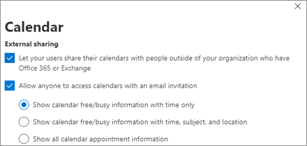

# Aumentar a proteção contra ameaças para Microsoft 365 assinatura

Este artigo ajuda você a aumentar a proteção em sua assinatura Microsoft 365 para proteger contra phishing, malware e outras ameaças. Essas recomendações são apropriadas para organizações com maior necessidade de segurança, como campanhas políticas, escritórios de advocacia e clínicas de saúde.

Antes de começar, verifique a Pontuação Segura da Microsoft. A Pontuação Segura da Microsoft analisa a segurança da sua organização com base em suas atividades regulares e configurações de segurança e atribui uma pontuação. Comece anotando sua pontuação atual. Tomar as ações recomendadas neste artigo aumenta sua pontuação. O objetivo não é atingir a pontuação máxima, mas estar ciente das oportunidades de proteger seu ambiente que não afetam negativamente a produtividade de seus usuários.

Para obter mais informações, consulte [Microsoft Secure Score](../security/defender/microsoft-secure-score.md).

## Aumentar o nível de proteção contra malware no email

Seu Office 365 ou Microsoft 365 inclui proteção contra malware, mas você pode aumentar essa proteção bloqueando anexos com tipos de arquivo que são comumente usados para malware. Para levantar a proteção contra malware no email:

1. Vá para <https://protection.office.com> e entre com suas credenciais de conta de administrador.

2. No Centro de Conformidade & segurança, no painel de navegação esquerdo, em Gerenciamento de ameaças, **escolha** **Política** \> **Anti-Malware**.

3. Clique duas vezes na política padrão para editar essa política em toda a empresa.

4. Clique em **Configurações**.

5. Em **Filtro tipos de anexo comuns,** selecione **Em**. Os tipos de arquivo bloqueados estão listados na janela diretamente abaixo desse controle. Certifique-se de adicionar esses tipos de arquivo:

   `ade, adp, ani, bas, bat, chm, cmd, com, cpl, crt, hlp, ht, hta, inf, ins, isp, job, js, jse, lnk, mda, mdb, mde, mdz, msc, msi, msp, mst, pcd, reg, scr, sct, shs, url, vb, vbe, vbs, wsc, wsf, wsh, exe, pif`

   Você pode adicionar ou excluir tipos de arquivo mais tarde, se necessário.

6. Clique em **Salvar.**

Para obter mais informações, consulte [Proteção anti-malware no EOP](../security/office-365-security/anti-malware-protection.md).

## Proteção contra ransomware

O ransomware restringe o acesso aos dados criptografando arquivos ou bloqueio de telas de computador. Em seguida, ele tenta roubar dinheiro das vítimas solicitando "resgate", geralmente na forma de criptocurrencies como o Bitcoin, em troca de acesso a dados.

Você pode proteger contra ransomware criando uma ou mais regras de fluxo de emails para bloquear extensões de arquivo que são comumente usadas para ransomware (elas foram adicionadas no aumento do nível de proteção contra [malware](#raise-the-level-of-protection-against-malware-in-mail) na etapa de email) ou para avisar os usuários que recebem esses anexos no email.

Além dos arquivos que você bloqueou na etapa anterior, também é uma boa prática criar uma regra para avisar os usuários antes de abrir Office anexos de arquivo que incluem macros. O ransomware pode estar oculto dentro de macros, portanto, alerte os usuários para não abrirem esses arquivos de pessoas que não conhecem.

Para criar uma regra de transporte de email:

1. Vá para o centro de administração em <https://admin.microsoft.com> e escolha Centros de **administração** \> **Exchange**.

2. Na categoria **fluxo de emails,** clique em **regras**.

3. Clique **+** em , e clique em Criar uma nova **regra.**

4. Clique **em Mais** opções na parte inferior da caixa de diálogo para ver o conjunto completo de opções.

5. Aplique as configurações na tabela a seguir para a regra. Deixe o restante das configurações no padrão, a menos que você queira alterá-las.

6. Clique em **Salvar**.

|Configuração|Avisar os usuários antes de abrir anexos Office arquivos|
|---|---|
|Nome|Regra anti-ransomware: avisar os usuários|
|Aplicar essa regra se . . .|Qualquer anexo . . . extensão de arquivo corresponde . . .|
|Especificar palavras ou frases|Adicione esses tipos de arquivo:   `dotm, docm, xlsm, sltm, xla, xlam, xll, pptm, potm, ppam, ppsm, sldm`|
|Faça o seguinte . . .|Notificar o destinatário com uma mensagem|
|Fornecer texto de mensagem|Não abra esses tipos de arquivos de pessoas que você não conhece porque elas podem conter macros com código mal-intencionado.|

Para saber mais, confira:

- [Ransomware: como reduzir o risco](https://www.microsoft.com/security/blog/2020/04/28/ransomware-groups-continue-to-target-healthcare-critical-services-heres-how-to-reduce-risk/)

- [Restaure sua OneDrive](https://support.microsoft.com//office/fa231298-759d-41cf-bcd0-25ac53eb8a15)

## Parar o encaminhamento automático para email

Os hackers que têm acesso à caixa de correio de um usuário podem roubar seu email definindo a caixa de correio para encaminhar emails automaticamente. Isso pode acontecer mesmo sem a conscientização do usuário. Você pode impedir que isso aconteça configurando uma regra de fluxo de emails.

Para criar uma regra de transporte de email, assista [a este vídeo curto](https://support.office.com/article/f9d693ba-5c78-47c0-b156-8e461e062aa7) ou siga estas etapas:

1. No centro Microsoft 365 de administração, clique **em Centros de administração** \> **Exchange**.

2. Na categoria **fluxo de emails,** clique em **regras**.

3. Clique **+** em , e clique em Criar uma nova **regra.**

4. Clique **em Mais** opções na parte inferior da caixa de diálogo para ver o conjunto completo de opções.

5. Aplique as configurações na tabela a seguir. Deixe o restante das configurações no padrão, a menos que você queira alterá-las.

6. Clique em **Salvar**.

|Configuração|Avisar os usuários antes de abrir anexos Office arquivos|
|---|---|
|Nome|Impedir o encaminhamento automático de emails para domínios externos|
|Aplicar essa regra se ...|O remetente . . . é externo/interno . . . Dentro da organização|
|Adicionar condição|As propriedades da mensagem . . . incluem o tipo de mensagem . . . Encaminhamento automático|
|Faça o seguinte...|Bloquear a mensagem . . . rejeitar a mensagem e incluir uma explicação.|
|Fornecer texto de mensagem|O encaminhamento automático de emails fora dessa organização é impedido por motivos de segurança.|

## Proteger seu email contra ataques de phishing

Se você configurou um ou mais domínios personalizados para seu Office 365 ou Microsoft 365 ambiente, você pode configurar a proteção anti-phishing direcionada. A proteção anti-phishing, parte do Microsoft Defender para Office 365, pode ajudar a proteger sua organização contra ataques de phishing com base em representação mal-intencionada e outros ataques de phishing. Se você não configurou um domínio personalizado, não precisa fazer isso.

Recomendamos que você seja iniciado com essa proteção criando uma política para proteger seus usuários mais importantes e seu domínio personalizado.

Para criar uma política anti-phishing no Defender para Office 365, assista a este breve vídeo de treinamento [ou](https://support.office.com/article/86c425e1-1686-430a-9151-f7176cce4f2c)conclua as seguintes etapas:

1. Vá para <https://protection.office.com>.

2. No Centro de Conformidade & segurança, no painel de navegação esquerdo, em Gerenciamento **de ameaças,** escolha **Política**.

3. Na página **Política,** escolha **Anti-phishing**.

4. Na página **Anti-phishing,** selecione **+ Criar**. Um assistente inicia essa etapa ao definir sua política anti-phishing.

5. Especifique o nome, a descrição e as configurações da política conforme recomendado no gráfico abaixo. Para obter mais informações, [consulte Learn about anti-phishing policy in Microsoft Defender for Office 365 options](../security/office-365-security/set-up-anti-phishing-policies.md).

6. Depois de revisar suas configurações, escolha **Criar essa política** ou **Salvar**, conforme apropriado.

|Configuração ou opção|Configuração recomendada|
|---|---|
|Nome|Domínio e equipe mais valiosa|
|Descrição|Verifique se a equipe mais importante e nosso domínio não estão sendo personificados.|
|Adicionar usuários a proteger|Selecione **+ Adicionar uma condição, O destinatário é**. Digite nomes de usuário ou insira o endereço de email dos proprietários, parceiros ou candidatos, gerentes e outros membros importantes da equipe. Você pode adicionar até 20 endereços internos e externos que deseja proteger contra representação.|
|Adicionar domínios para proteger|Selecione **+ Adicionar uma condição, O domínio do destinatário é**. Insira o domínio personalizado associado à sua assinatura Microsoft 365, se você definiu um. Você pode inserir mais de um domínio.|
|Escolher ações|Se o email for enviado por um usuário personificado: Escolha **Redirecionar** mensagem para outro endereço de email e digite o endereço de email do administrador de segurança; por exemplo, *Alice   @contoso.com*.   Se o email for enviado por um domínio representado: escolha **Colocar mensagem em quarentena**.|
|Inteligência da caixa de correio|Por padrão, a caixa de correio é selecionada quando você cria uma nova política anti-phishing. Deixe essa configuração **Ativada** para obter melhores resultados.|
|Adicionar remetentes e domínios confiáveis|Aqui você pode adicionar seu próprio domínio ou qualquer outro domínio confiável.|
|Aplicado a|Selecione **O domínio do destinatário é**. Em **Qualquer um desses**, selecione **Escolher**. Selecione **+ Adicionar**. Marque a caixa de seleção ao lado do nome do domínio, por exemplo, *contoso.   com*, na lista e selecione **Adicionar**. Selecione **Concluído**.|

Para obter mais informações, [consulte Configurar políticas anti-phishing no Defender para Office 365](../security/office-365-security/set-up-anti-phishing-policies.md).

## Proteger contra anexos, arquivos e links mal-intencionados com o Defender para Office 365

Primeiro, certifique-se de que, no centro de administração, você tenha a nova visualização do centro <https://admin.microsoft.com> de administração 2016. Ativar a alternância ao lado do texto **O novo centro de administração**.

   

Se você ainda não  vir a página Instalação com cartões em seu locatário, confira como concluir essas etapas no Centro de Conformidade & Segurança. Consulte [Configurar Cofre anexos](#set-up-safe-attachments-in-the-security--compliance-center) no Centro de Conformidade & Segurança e Configurar links Cofre no Centro de Conformidade & [Segurança.](#set-up-safe-links-in-the-security--compliance-center)

1. Na nav esquerda, escolha **Configurar**.
2. Na página **Instalação,** escolha **Exibir no** cartão **Aumentar a proteção contra ameaças** avançadas.

   

3. Na página **Aumentar a proteção contra ameaças avançadas,** escolha **Começar**.
4. No painel que é aberto, selecione as caixas de seleção ao lado de Links e **anexos** no email , Examinar arquivos no **SharePoint, OneDrive** e Teams e Verificar Office links em aplicativos da área de trabalho e do **Office Online** em Verificar itens para conteúdo mal-intencionado . 

   Em **Links e anexos no email**, Digite Em Todos os Usuários ou os usuários específicos cujo email você deseja digitalizado.

   

5. Escolha **Criar políticas para** ativar Cofre Anexos e Cofre Links.

### Configurar Cofre anexos no Centro de Conformidade & Segurança

As pessoas enviam, recebem e compartilham regularmente anexos, como documentos, apresentações, planilhas e muito mais. Nem sempre é fácil saber se um anexo é seguro ou mal-intencionado apenas olhando para uma mensagem de email. O Microsoft Defender para Office 365 inclui Cofre proteção de anexos, mas essa proteção não está 100% ativas por padrão. Recomendamos que você crie uma nova regra para começar a usar essa proteção. Essa proteção se estende a arquivos em SharePoint, OneDrive e Microsoft Teams.

Para criar uma política Cofre Anexo, assista a [este vídeo](https://support.office.com/article/e7e68934-23dc-4b9c-b714-e82e27a8f8a5)curto ou conclua as seguintes etapas:

1. Vá para <https://protection.office.com> e entre com sua conta de administrador.

2. No Centro de Conformidade & segurança, no painel de navegação esquerdo, em Gerenciamento **de ameaças,** escolha **Política**.

3. Na página Política, escolha Cofre **Anexos**.

4. Na página Cofre anexos, aplique essa proteção amplamente selecionando a caixa de seleção Ativar a ATP para **SharePoint, OneDrive** e Microsoft Teams.

5. Selecione **+** para criar uma nova política.

6. Aplique as configurações na tabela a seguir.

7. Depois de revisar suas configurações, escolha **Criar essa política** ou **Salvar**, conforme apropriado.

|Configuração ou opção|Configuração recomendada|
|---|---|
|Nome|Bloquear emails atuais e futuros com malware detectado.|
|Descrição|Bloquear emails e anexos atuais e futuros com malware detectado.|
|Salvar anexos resposta de malware desconhecido|Selecione Bloquear - Bloquear os emails e anexos atuais **e futuros com malware detectado.**|
|Redirecionar anexo na detecção|Habilitar redirecionamento (selecione esta caixa)   Insira a conta de administrador ou uma configuração de caixa de correio para quarentena.   Aplique a seleção acima se ocorrer uma verificação de malware para anexos ou se ocorrer um erro (selecione esta caixa).|
|Aplicado a|O domínio do destinatário é . . . selecione seu domínio.|

Para obter mais informações, [consulte Configurar políticas anti-phishing no Defender para Office 365](../security/office-365-security/set-up-anti-phishing-policies.md).

### Configurar Cofre Links no Centro de Conformidade & Segurança

Os hackers às vezes ocultam sites mal-intencionados em links no email ou em outros arquivos. Cofre Os links, parte do Microsoft Defender para Office 365, podem ajudar a proteger sua organização fornecendo a verificação de tempo de clique de endereços da Web (URLs) em mensagens de email e documentos Office. A proteção é definida por meio Cofre Políticas de Links.

Recomendamos que você faça o seguinte:

- Modifique a política padrão para aumentar a proteção.

- Adicione uma nova política direcionada a todos os destinatários em seu domínio.

Para configurar Cofre Links, assista a [este breve](https://support.office.com/article/61492713-53c2-47da-a6e7-fa97479e97fa)vídeo de treinamento ou conclua as seguintes etapas:

1. Vá para <https://protection.office.com> e entre com sua conta de administrador.

2. No Centro de Conformidade & segurança, no painel de navegação esquerdo, em Gerenciamento **de ameaças,** escolha **Política**.

3. Na página Política, escolha Cofre **Links**.

Para modificar a política padrão:

1. Na página Cofre links, em **Políticas que se aplicam** a toda a organização, selecione a **política** Padrão.

2. Em **Configurações que se aplicam ao conteúdo,** exceto email, selecione **Microsoft 365 Apps para Grandes Empresas, Office para iOS e Android**.

3. Clique em **Salvar**.

Para criar uma nova política direcionada a todos os destinatários em seu domínio:

1. Na página Cofre links, em **Políticas que se aplicam** a toda a organização , clique para criar uma nova **+** política.

2. Aplique as configurações listadas na tabela a seguir.

3. Clique em **Salvar**.

|Configuração ou opção|Configuração recomendada|
|---|---|
|Nome|Cofre política de links para todos os destinatários no domínio|
|Selecione a ação para URLs potencialmente mal-intencionadas desconhecidas em mensagens|Selecione **Em - AS URLs serão reescritas** e verificadas em uma lista de links mal-intencionados conhecidos quando o usuário clicar no link .|
|Usar Cofre anexos para examinar o conteúdo baixável|Selecione essa caixa.|
|Aplicado a|O domínio do destinatário é . . . selecione seu domínio.|

Para obter mais informações, [consulte Cofre Links no Defender para Office 365](../security/office-365-security/safe-links.md).

## Ativar o Log de Auditoria Unificada

Depois de ativar a pesquisa de log de auditoria no Centro de Conformidade & segurança, você poderá reter o administrador e outras atividades do usuário no log e pesquisá-lo.

Você deve ter a função Logs de Auditoria Exchange Online ativar ou desativar a pesquisa de log de auditoria em sua assinatura Microsoft 365 de auditoria. Por padrão, essa função é atribuída aos grupos de função Gerenciamento de Conformidade e Gerenciamento de Organização na página Permissões no Exchange de administração. Os administradores globais no Microsoft 365 são membros desse grupo por padrão.

1. Para ativar a pesquisa de log de auditoria, vá para o centro de administração em e escolha Segurança em Centros de <https://admin.microsoft.com> administração na nav esquerda.  
2. Na página **Microsoft 365 Segurança,** escolha **Mais** recursos e **abra** no cartão Office 365 Segurança & **Centro de** Conformidade.

    
3. Na página segurança e conformidade, escolha **Pesquisar** e, em seguida, **Auditar pesquisa de log.**
4. Na parte superior da página de pesquisa **de log de** auditoria, escolha Ativar **auditoria**.

Depois que o recurso for ligado, você poderá pesquisar arquivos, pastas e muitas atividades. Para obter mais informações, consulte [pesquisar o log de auditoria](../compliance/search-the-audit-log-in-security-and-compliance.md).

## Ajustar configurações de compartilhamento anônimo para SharePoint e OneDrive arquivos e pastas

(altere a expiração padrão do link anônimo para 14 dias, altere o tipo de compartilhamento padrão para &quot;Pessoas Específicas") Para alterar as configurações de compartilhamento para OneDrive e SharePoint:

1. Vá para o centro de administração em e escolha SharePoint <https://admin.microsoft.com> em Centros de **administração** na nav esquerda. 
2. No centro SharePoint de administração, vá para **Compartilhamento de** \> **Políticas.**
3. Na  página Compartilhamento, em Links de arquivo e **pasta,** selecione Pessoas específicas e, em Configurações avançadas para **links "Qualquer pessoa",** selecione Esses **links** devem expirar dentro desses muitos dias e digite em 14 (ou outro número de dias para o qual você deseja restringir o tempo de vida do link).

   

## Alertas de atividade

Você pode usar alertas de atividade para controlar as atividades do administrador e do usuário e detectar incidentes de prevenção contra malware e perda de dados em sua organização. Sua assinatura inclui um conjunto de políticas padrão, mas você também pode criar políticas personalizadas. Para obter mais informações, consulte [políticas de alerta](../compliance/alert-policies.md). Por exemplo, se você armazenar um arquivo importante no SharePoint que não deseja que ninguém compartilhe externamente, poderá criar uma notificação que o alerte se alguém compartilhar.

A figura a seguir mostra as políticas padrão incluídas no Microsoft 365.

## Desabilitar ou gerenciar o compartilhamento de calendário

Você pode impedir que as pessoas em sua organização compartilhem seus calendários ou você também pode gerenciar o que elas podem compartilhar. Por exemplo, você só pode restringir o compartilhamento a horários de livre/ocupado.

1. Vá para o centro de administração em <https://admin.microsoft.com> e escolha **Configurações** \> **Org Configurações**.
2. Na página **Serviços,** escolha **Calendário** e escolha se as pessoas em sua organização podem compartilhar seus calendários com pessoas de fora que têm Office 365 ou Exchange ou com qualquer pessoa.

   Se você escolher a opção compartilhar com qualquer pessoa, poderá decidir também compartilhar apenas informações de livre/ocupado.

3. Escolha **Salvar alterações** na parte inferior da página.

   A figura a seguir mostra o compartilhamento de calendário não permitido.

   

   A figura a seguir mostra as configurações quando o compartilhamento de calendário é permitido com um link de email com apenas informações de livre/ocupado.

   

Se os usuários têm permissão para  compartilhar seus calendários, consulte estas instruções sobre como compartilhar de Outlook na Web.
