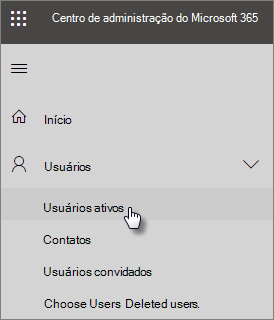

# Proteger suas contas de administrador

Como as contas de administrador vêm com privilégios elevados, elas são alvos valiosos para hackers e criminosos virtuais. Este artigo descreve:

- Como configurar uma conta de administrador adicional para emergências.
- Como proteger essas contas.
 
Quando você se inscreve no Microsoft 365 e insere suas informações, você se torna automaticamente o administrador global. Um administrador global tem o controle final de contas de usuário e todas as outras configurações no centro de administração da Microsoft, mas há muitos tipos diferentes de contas de administrador com vários níveis de acesso. Consulte [sobre funções de administrador](https://docs.microsoft.com/office365/admin/add-users/about-admin-roles) para obter informações sobre os diferentes níveis de acesso para cada tipo de função de administrador.

## Criar contas de administração adicionais

Use contas de administrador somente para administração. Os administradores devem ter uma conta de usuário separada para uso regular dos aplicativos do Office e usar apenas a conta administrativa, quando necessário, para gerenciar contas e dispositivos, e enquanto trabalham em outras funções de administrador. Também é uma boa ideia remover a licença do Microsoft 365 das contas de administrador para que você não precise pagar por elas.

Convém configurar pelo menos uma conta de administrador global adicional para conceder acesso de administrador a outro funcionário confiável. Você também pode criar contas de administrador separadas para o gerenciamento de usuários (essa função é chamada de **administrador de gerenciamento de usuários**). Para obter mais informações, consulte [sobre funções de administrador](https://docs.microsoft.com/office365/admin/add-users/about-admin-roles).

Para criar contas de administração adicionais:

 1. Vá para o <a href="https://go.microsoft.com/fwlink/p/?linkid=837890" target="_blank">centro de administração</a> e, em seguida, escolha usuários ativos do **usuário** \> **Active users** no painel de navegação esquerdo.

    

2. Na página **usuários ativos** , selecione **Adicionar um usuário** na parte superior da página e, no painel **novo usuário** , insira o nome e outras informações.
3. Expanda a seção **funções** e escolha **administrador global** para conceder acesso de administrador global ao usuário. Você também pode escolher **administrador personalizado** e escolher qualquer uma das funções que são exibidas.

    Insira um email alternativo na caixa de texto **endereço de email alternativo** . Você pode usar esse endereço para recuperar suas informações de senha, caso tenha bloqueado. Para administradores globais, um demonstrativo de cobrança também será enviado para esse endereço.

    
    
4. Na seção **licenças de produto** , mova o seletor para o **Microsoft 365 Business** para fora e a **opção** **criar usuário sem licença de produto** . **On**

    

## Criar uma conta de administrador de emergência

Você também deve criar uma conta de backup que não esteja configurada com a autenticação multifator (MFA), para que você não se bloqueie acidentalmente (por exemplo, se perder o telefone que está usando como uma segunda forma de verificação). Certifique-se de que a senha dessa conta seja uma frase ou pelo menos 16 caracteres de comprimento. Isso geralmente é conhecido como "conta de divisão".

## Criar uma conta de usuário para si mesmo

Use sua conta de usuário para participar da colaboração com sua organização, incluindo verificação de email. Isso significa que suas credenciais de administrador podem ser semelhantes a *Alice. Chavez  @Contoso. org* e sua conta de usuário comum pode ser semelhante a *Alice  @Contoso. com*.

Para criar uma nova conta de usuário:
1. Vá para o <a href="https://go.microsoft.com/fwlink/p/?linkid=837890" target="_blank">centro de administração</a> e, em seguida, escolha usuários ativos do **usuário** \> **Active users** no painel de navegação esquerdo.
2. Na página **usuários ativos** , selecione **Adicionar um usuário** na parte superior da página e, no painel **novo usuário** , insira o nome e outras informações.
3. Expanda a seção **funções** e escolha **usuário (sem acesso administrativo)**.
1. Na seção **licenças de produto** , mova o seletor **para o** **Microsoft 365 Business para o** . 

## Registrar cada uma dessas contas para autenticação multifator

## Recomendações adicionais

- Certifique-se de que as contas de administrador também estão configuradas para a autenticação multifator. Mostraremos como fazer isso em [Configurar políticas de acesso condicional](m365-campaigns-conditional-access.md).
- Antes de usar contas de administrador, feche todas as sessões de navegador não relacionadas e aplicativos, incluindo contas de email pessoais. Você também pode usar as janelas de navegador privada ou incógnito.
- Após concluir as tarefas de administração, não deixe de sair da sessão do navegador.
