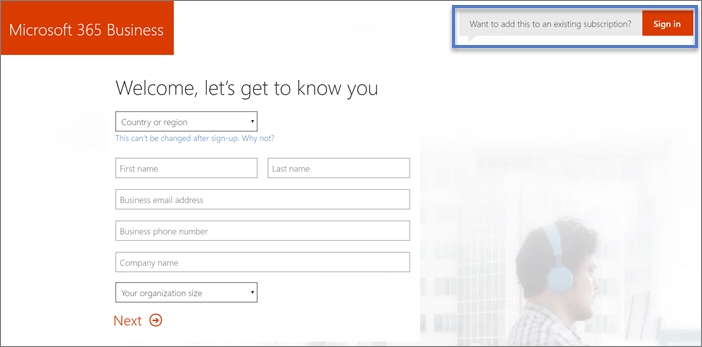

# Inscrever-se para Microsoft 365 campanhasSign up for Microsoft 365 for Campaigns 

Veja como concluir sua assinatura para Microsoft 365 campanhas.Here's how to complete your sign-up for Microsoft 365 for Campaigns.

## Antes de começar:Before you start:

- Receba seu convite para Microsoft 365 campanhas concluindo as etapas em [Obter Microsoft 365 para campanhas.](get-microsoft-365-campaigns.md#get-microsoft-365-for-campaigns)Get your invite to Microsoft 365 for Campaigns by completing the steps in [Get Microsoft 365 for Campaigns](get-microsoft-365-campaigns.md#get-microsoft-365-for-campaigns).
- Abra seu convite de email da Microsoft.Open your email invitation from Microsoft. O convite tem um link de assinatura exclusivo para sua organização.The invite has a unique sign-up link for your organization. Você precisa disso para obter preços especiais de campanhas.You need this to get campaigns special pricing.
- Tenha seu cartão de crédito comercial e um telefone prontos.Have your business credit card and a phone ready.

    > [!TIP]
    > Seu link de assinatura é exclusivo da campanha.Your sign-up link is unique to your campaign. Ele só funciona uma vez, portanto, certifique-se de ter tempo suficiente para concluir a assinatura.It only works once, so make sure you have enough time to complete sign-up. Você precisa de cerca de dez minutos.You need about ten minutes.

## Etapas para se inscreverSteps to sign up

1. Em seu convite para enviar Microsoft 365 para campanhas por email, selecione **REGISTRAR SUA ORGANIZAÇÃO >**.In your invitation to Microsoft 365 for Campaigns email, select **ENROLL YOUR ORGANIZATION >**. Isso leva você Microsoft 365 inscrever-se.This takes you to Microsoft 365 sign-up.
    > [!NOTE]
    > Se você já tiver uma assinatura de Microsoft 365 para empresas e quiser adicionar a oferta do Microsoft 365 para Campanhas, vá para adicionar o Microsoft 365 para [Campanhas](#steps-to-add-microsoft-365-for-campaigns-to-an-existing-subscription)a uma assinatura existente .If you already have an existing Microsoft 365 for business subscription and you want to add the Microsoft 365 for Campaigns offer to it, go to [add Microsoft 365 for Campaigns to an existing subscription](#steps-to-add-microsoft-365-for-campaigns-to-an-existing-subscription).
1. **Na página Microsoft 365 Business ,** insira os detalhes da sua empresa.**On the Microsoft 365 Business page**, enter your business details. Endereço **de email para Empresas**, use um endereço de email atual.For **Business email address**, use a current email address. Só precisamos desse endereço para manter contato com você durante o processo de instalação.We only need this address to stay in touch with you during the setup process. Selecione **Avançar**.Select **Next**.
1. **Na página Criar sua ID de usuário:****On the Create your user ID page**:
    1. Em **Nome de** Usuário , insira o nome ou alias que você deseja para seu endereço de email.In **Username**, enter the name or alias you want for your email address. Por exemplo, talvez você queira ser conhecido apenas como Alice ou Rob.For example, you might want to be known as just Alice, or Rob. Em uma campanha maior, AliceC ou AliceChavez pode fazer mais sentido.In a larger campaign, AliceC or AliceChavez might make more sense.
    2. Em **Sua empresa**, insira o nome da campanha para a sua empresa.In **Your company**, enter the name of the campaign you work for. Por exemplo, ContosoCampaign.For example, ContosoCampaign. Se você já possui um domínio, use esse nome aqui.If you already own a domain, use that name here. 
    3. Em **Selecionar um domínio,** selecione **.onmicrosoft.com** por enquanto.In **Select a domain**, select **.onmicrosoft.com** for now. Podemos configurar você com um domínio posteriormente ou ajudá-lo a Microsoft 365 conectar a um domínio que você já possui.We can set you up with a domain later, or help you get Microsoft 365 connected to a domain that you already own.
    4. Crie uma senha e selecione **Criar minha conta**.Create a password and select **Create my account**.
    > [!NOTE]
    > Se sua campanha ou parte não possuir um domínio e você tiver decidido qual domínio deseja, poderá comprar um agora selecionando-o.If your campaign or party doesn't own a domain, and you have decided what domain you want, you can buy one now by selecting it.

4. **Prove. Você está. Não. A. Robô. page**:**Prove. You're. Not. A. Robot. page**:
    1. Prepare seu telefone e selecione **Texto para mim** (ou **Chame-me,** se preferir).Have your phone ready, and select **Text me** (or **Call me** if you prefer). Em seguida, insira seu número de telefone.Then enter your phone number. 
    2. Quando você selecionar **Texto para mim,** enviaremos um código de verificação.When you select **Text me**, we'll send you a verification code. Ou chamaremos você com um código se você selecionar **Chamar-me**.Or we'll call you with a code if you select **Call me**.
    3. Insira o código de sua mensagem de texto (ou chamada) e selecione **Next**.Enter the code from your text message (or call) and select **Next**. Espere uma espera curta.Expect a short wait. 
5. **Onde você estará usando esta página**: Insira os detalhes do local de trabalho principal da campanha e o número de telefone.**Where will you be using this page**: Enter the campaign's primary work location details and phone number. Selecione **Avançar**.Select **Next**.
6. **Como essa página de aparência**:**How does this look page**:
    1. Verifique se o custo por usuário é de US$ 5,00.Verify the cost per user is $5.00. 
    2. Se você quiser apenas configurar a si mesmo por enquanto, selecione **Próximo**.If you only want to set yourself up for now, select **Next**. 
    3. Opcional: adicione algumas licenças extras agora alterando o número no **campo do** usuário.Optional: Add some extra licenses now by changing the number in the **user** field. [A equipe com quem você trabalha pode ter licenças](../admin/add-users/add-users.md?toc=%2fmicrosoft-365%2fcampaigns%2ftoc.json) para Microsoft 365 a qualquer momento.[The staff you work with can be assigned licenses to Microsoft 365](../admin/add-users/add-users.md?toc=%2fmicrosoft-365%2fcampaigns%2ftoc.json) at any time.
7. **Como você deseja pagar? página**: Selecione **Novo** cartão de crédito, insira os detalhes do cartão de crédito comercial e selecione **Fazer o pedido**.**How do you want to pay? page**: Select **New credit card**, enter your business credit card details, and select **Place order**. Se preferir, também é possível usar uma conta bancária.If you prefer, it's also possible to use a bank account.
8. **Isso pode demorar um pouco:** você encontrará detalhes sobre onde entrar e sua ID de usuário.**This may take a moment page**: You'll find details about where to sign in and your user ID. Também enviaremos essas informações para o endereço de email inserido durante a etapa 2 acima.We'll also send this information to the email address that you entered during step 2 above.

Suas etapas de inscrever-se estão concluídas!Your sign-up steps are complete! Se quiser continuar com as próximas etapas, selecione **Iniciar** a Instalação ou volte mais tarde para concluir as etapas.If you want to continue with the next steps, select **Start Setup**, or come back later to finish the steps. Quando estiver pronto, verifique seu email (da etapa 2) para encontrar seu nome de usuário e senha para que você possa fazer logoff na próxima vez.When you're ready, check your email (from step 2) to find your user name and password so you can log in next time. Elas são chamadas de credenciais de administrador ou administrador global.These are called your admin or global admin credentials.

## Etapas para adicionar Microsoft 365 campanhas a uma assinatura existenteSteps to add Microsoft 365 for Campaigns to an existing subscription

Se você já tiver e a assinatura existente para Microsoft 365 para empresas, por exemplo, Microsoft 365 Business Standard, poderá usar a oferta Microsoft 365 para Campanhas para adicionar licenças a ele.If you already have and existing subscription to Microsoft 365 for business, for example, Microsoft 365 Business Standard, you can use the Microsoft 365 for Campaigns offer to add licenses to it.
> [!IMPORTANT]
> Não é possível adicionar a Microsoft 365 de campanhas a uma conta Microsoft 365 existente.You cannot add the Microsoft 365 for Campaigns offer to an existing Microsoft 365 account.

1. Em seu convite para enviar Microsoft 365 para campanhas por email, selecione **REGISTRAR SUA ORGANIZAÇÃO >**.In your invitation to Microsoft 365 for Campaigns email, select **ENROLL YOUR ORGANIZATION >**. Isso leva você Microsoft 365 inscrever-se.This takes you to Microsoft 365 sign-up.
2. Na página **Bem-vindo, vamos conhecer** você, clicar ou tocar em Deseja adicionar isso **a uma assinatura existente? Entre**.On the **Welcome, let's get to know you** page, click or tap **Want to add this to an existing subscription? Sign in**.
    
    
3. Na página de entrada, insira o alias de administrador para sua assinatura existente, por exemplo, *Alice@VoteContoso  .org*, escolha **Next**, insira sua senha e escolha **Entrar**.On the sign in page, enter the admin alias for your existing subscription, for example *Alice@VoteContoso .org*, choose **Next**, enter your password, and then choose **Sign in**.
4. Em Como **isso fica? insira** o número de usuários que você tem e escolha **Next**.On the **How does this look?** enter the number of users you have and choose **Next**. Você não precisa inserir um código promocional aqui porque ele já está incluído na URL do convite.You don't have to enter a promo code here because it is already included in the invitation URL.
5. Na página **Como você deseja pagar?** Insira seu método de pagamento e escolha **Fazer pedido**.On the **How do you want to pay?** page, enter your payment method and choose **Place order**.

Depois de concluir essas etapas, você estará pronto para atribuir [as novas licenças](../admin/manage/assign-licenses-to-users.md) à sua equipe de campanha.After you have completed these steps, you're ready to [assign the new licenses](../admin/manage/assign-licenses-to-users.md) to your campaign staff.

## O que vem a seguir?What's next?

- [Configurar Microsoft 365](../business/set-up.md?toc=/microsoft-365/campaigns/toc.json) para concluir sua Microsoft 365 para Campanhas configurada.[Set up Microsoft 365](../business/set-up.md?toc=/microsoft-365/campaigns/toc.json) to complete your Microsoft 365 for Campaigns set up.
- [Adicione usuários](../admin/add-users/add-users.md?toc=%2fmicrosoft-365%2fcampaigns%2ftoc.json) ao seu plano.[Add users](../admin/add-users/add-users.md?toc=%2fmicrosoft-365%2fcampaigns%2ftoc.json) to your plan. Inclua o candidato da campanha, todos os funcionários de campanha sênior e qualquer pessoa que tenha acesso a informações confidenciais de campanha ou de terceiros.Include the campaign candidate, all senior campaign staff, and anyone who will have access to sensitive campaign or party information.
- [Aumento da proteção para sua campanhaBump up protection for your campaign](m365-campaigns-security-overview.md)
