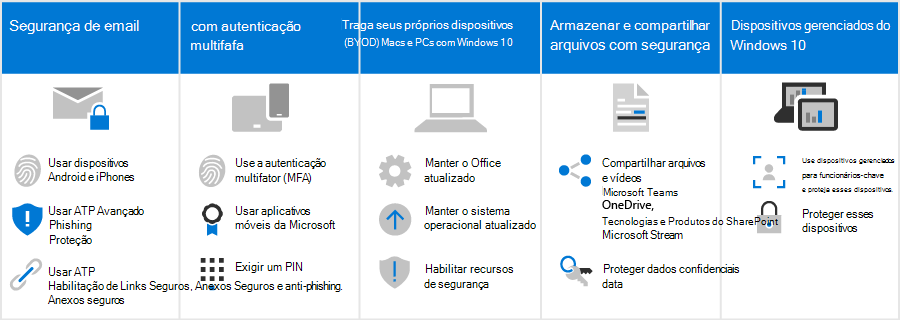

# Como essas recomendações de segurança afetam seus usuários

As recomendações de segurança para Microsoft 365 nesta solução dificultam muito o acesso dos hackers ao seu ambiente. A tradeoff é que seus usuários precisarão estar cientes de como trabalhar nesse ambiente mais seguro. Entendemos que um pouco mais de paciência é necessário, mas vale a pena manter sua organização protegida.

## Usar práticas de email seguras

Todos os usuários devem estar cientes e usar essas práticas de email para ajudar a manter seus emails seguros:

- Configurar email para usar a autenticação multifatório com o aplicativo autenticador.
- Verifique emails legítimos e procure dicas de segurança do Phishing Avançado no Defender para Office 365 Proteção.
- Abra apenas links e anexos seguros, conforme verificado por Cofre Links e Cofre Anexos.

Saiba mais sobre [autenticação multifa factor,](m365-campaigns-multifactor-authenication.md) [phishing e outros ataques.](m365-campaigns-phishing-and-attacks.md)

Baixe um [infográfico](m365-campaigns-protect-campaign-infographic.md) com dicas para você e os membros da sua equipe.

## Configurar iPhones e dispositivos Android

Todos os usuários que você adicionar ao seu ambiente precisarão levar alguns minutos para configurar [iPhones](../business/set-up-mobile-devices.md?toc=%2Fmicrosoft-365%2Fcampaigns%2Ftoc.json) e dispositivos Android para funcionar com segurança:

- Configurar dispositivos para usar a autenticação multifagador com o aplicativo autenticador.
- Use aplicativos móveis da Microsoft, incluindo Outlook Mobile, Word, OneDrive e outros aplicativos da Microsoft na loja de aplicativos. Os aplicativos de email nativos incluídos em iPhones e dispositivos Android não são suportados. 
- Exigir um PIN para que os usuários desbloqueiem seus dispositivos.

Depois de defini-los, seus usuários serão solicitados a usar o aplicativo autenticador ao acessar os dados da sua organização nesses dispositivos, incluindo email.

## Manter computadores BYOD e Windows 10 computadores atualizados

Também é importante que os usuários mantenham seu dispositivo de trabalho principal atualizado:

- Instale as versões mais recentes Office aplicativos da área de trabalho e mantenha-as atualizadas, quando solicitado.
- Fique por dentro das atualizações do sistema operacional, como Windows atualizações.

Para [dispositivos](m365-campaigns-protect-pcs-macs.md)Windows 10 e Mac não habilitados, os usuários têm a responsabilidade de garantir que os recursos básicos de segurança sejam habilitados.

**Habilitar recursos básicos de segurança em dispositivos BYOD Windows 10 e Mac**

| |**Windows 10**|**Mac**|
|:-----|:-----|:------|
|Recursos de segurança|Ativar a BitLocker de dispositivos

 Verifique se Windows Defender permanece em 
Ativar Windows Firewall| Usar FileVault para criptografar o disco Mac 

Usar um software antivírus confiável 
Ativar a proteção de firewall|

Para saber mais sobre essas recomendações, consulte [Protect your account and devices from hackers and malware](https://support.office.com/article/Protect-your-account-and-devices-from-hackers-and-malware-066d6216-a56b-4f90-9af3-b3a1e9a327d6#ID0EAABAAA=Windows_10).

## Colaborar usando Microsoft Teams, OneDrive, SharePoint Online e outras ferramentas

Seus usuários podem estar tentados a compartilhar e armazenar arquivos da sua organização em locais diferentes Microsoft 365. Microsoft 365 torna mais fácil colaborar e compartilhar com segurança. Você pode [compartilhar arquivos e vídeos](share-files-and-videos.md) diretamente de Microsoft Teams, OneDrive, Stream e até mesmo de dentro de um arquivo. O compartilhamento dessas ferramentas ajuda a impedir que seus dados vazem. Você pode adicionar proteção adicional a dados confidenciais para evitar o compartilhamento fora da sua organização.

## Configurar dispositivos Windows 10 gerenciados

Recomendamos que os membros da equipe mais importantes usem dispositivos Windows 10 novos adquiridos. Mostraremos como gerenciar e proteger [esses dispositivos.](../business/set-up-windows-devices.md?toc=/microsoft-365/campaigns/toc.json) Isso garante que os membros da equipe que são o destino de maior valor para os hackers recebam a maior proteção.
