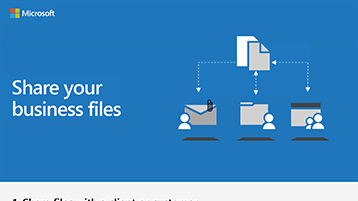

# Compartilhar arquivos e vídeos

Quando você precisa controlar quem pode exibir e quem pode editar seus arquivos, você precisa armazenar os arquivos em um local seguro, onde você pode certificar-se de que as permissões são aplicadas corretamente. Você pode usar o Microsoft Teams para armazenar seus arquivos e, em seguida, compartilhar os arquivos dentro ou fora da sua campanha usando o Microsoft Teams ou enviando links do SharePoint. Enviar um link em vez de um anexo de email significa que você sabe quem está exibindo e modificando os arquivos e não pode ser exibido ou modificado sem sua permissão. 

Com seus arquivos no Microsoft Teams e no SharePoint, você também pode trabalhar nos arquivos juntos e revisar as alterações de cada um. Use o Microsoft Teams para compartilhar arquivos dentro de uma campanha política. Se você precisar compartilhar externamente com pessoas de fora da campanha, você pode adicioná-los como convidados a uma equipe ou enviá-los para um link do SharePoint seguro.

Você também pode usar o Microsoft Stream para armazenar e compartilhar vídeos para sua campanha. Esses vídeos não são visíveis para o público para que sejam ideais para mensagens de campanha internas.

## Práticas recomendadas

Use estes métodos para compartilhar arquivos e vídeos com segurança:

1. Armazene arquivos no Microsoft Teams ou no SharePoint e certifique-se de que apenas as pessoas que precisam acessar esses arquivos tenham. 
2. Quando você quiser compartilhar, não anexe arquivos a um email. Em vez disso, escolha **obter link** do Microsoft Teams ou SharePoint e enviar o link no email.
3. Para compartilhar um arquivo externamente, adicione o usuário como convidado à sua equipe ou use o SharePoint para obter um link seguro para compartilhar apenas esse arquivo.
4. Use o Microsoft Stream para hospedar vídeos que você deseja que sua campanha veja. 
5. Use o Microsoft Teams ou o SharePoint para armazenar arquivos de vídeo de que você precisa que sua equipe colabore para colaborar ou compartilhar.

 
## Configurar

Para criar uma equipe e adicionar convidados, como anunciantes ou parceiros de financiamento, siga estas etapas.

> [!VIDEO https://www.microsoft.com/videoplayer/embed/RE1FQMp]

Para compartilhar um link seguro com um convidado, sem usar o Microsoft Teams, siga estas etapas

> [!VIDEO https://www.microsoft.com/videoplayer/embed/RE22Yf0]

Para criar e compartilhar vídeos, siga estas etapas.

> [!VIDEO https://www.microsoft.com/videoplayer/embed/RWrv0F]

Baixe um infográfico em [PDF](https://go.microsoft.com/fwlink/?linkid=2079435) ou [PowerPoint](https://go.microsoft.com/fwlink/?linkid=2079438) para obter uma visão geral rápida das maneiras de compartilhar seus arquivos.

