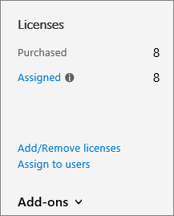

# Adicionar espaço de armazenamento para sua assinatura

Se você começar a ficar sem armazenamento para seus conjuntos de sites do SharePoint Online, será possível adicionar armazenamento à sua assinatura, se seu plano estiver qualificado. Se você não vir o **armazenamento de arquivos extra do Office 365** na lista de Complementos disponíveis, isso significa que seu plano não está qualificado. Para obter mais informações, veja [o meu plano está qualificado?](#is-my-plan-eligible-for-office-365-extra-file-storage)

## Exibir armazenamento disponível

::: moniker range="o365-worldwide"

1. Entre https://admin.microsoft.com como um administrador global ou do SharePoint. (Se você vir uma mensagem informando que você não tem permissão para acessar a página, você não tem permissões de administrador do Microsoft 365 em sua organização.)
    
2. No painel esquerdo, em **centros de administração**, selecione **SharePoint**. Se aparecer o centro de administração do SharePoint clássico, selecione **Abrir agora**, na parte superior da página, para abrir o novo centro de administração do SharePoint. 
    
3. No painel esquerdo do novo centro de administração do SharePoint, selecione **sites ativos**.

4. No canto superior direito da página, confira a quantidade de armazenamento usada em todos os sites e o armazenamento total da sua assinatura. (Se a sua organização tiver configurado multigeográfico no Office 365, a barra também mostrará a quantidade de armazenamento usada em todos os locais geográficos.) 

::: moniker-end

::: moniker range="o365-germany"

1. Entre https://portal.office.de como um administrador global ou do SharePoint e selecione o bloco administrador para abrir o centro de administração. (Se você vir uma mensagem informando que você não tem permissão para acessar a página, você não tem permissões de administrador do Microsoft 365 em sua organização.)
    
2. No painel esquerdo, em **centros de administração**, selecione **SharePoint**. Se aparecer o centro de administração do SharePoint clássico, selecione **Abrir agora**, na parte superior da página, para abrir o novo centro de administração do SharePoint. 
    
3. No painel esquerdo do novo centro de administração do SharePoint, selecione **sites ativos**.

4. No canto superior direito da página, confira a quantidade de armazenamento usada em todos os sites e o armazenamento total da sua assinatura. 

::: moniker-end

::: moniker range="o365-21vianet"

1. Entre https://login.partner.microsoftonline.cn/ como um administrador global ou do SharePoint e selecione o bloco administrador para abrir o centro de administração. (Se você vir uma mensagem informando que você não tem permissão para acessar a página, você não tem permissões de administrador do Microsoft 365 em sua organização.)
     
2. No painel esquerdo, em **centros de administração**, selecione **SharePoint**. Se aparecer o centro de administração do SharePoint clássico, selecione **Abrir agora**, na parte superior da página, para abrir o novo centro de administração do SharePoint. 
    
3. No painel esquerdo do novo centro de administração do SharePoint, selecione **sites ativos**.

4. No canto superior direito da página, confira a quantidade de armazenamento usada em todos os sites e o armazenamento total da sua assinatura.  

::: moniker-end

> [!NOTE]
> O armazenamento usado não inclui as alterações feitas nas últimas 24-48 horas. 

Após determinar a quantidade de armazenamento que está usando, você pode adicionar ou remover espaço de armazenamento da assinatura. Para descobrir quanto custará para adicionar espaço de armazenamento, siga as etapas deste artigo e revise as informações sobre preços antes de comprar.
  
Para obter informações sobre como configurar os limites de armazenamento do conjunto de sites, consulte [manage site Collection Storage Limits](https://docs.microsoft.com/sharepoint/manage-site-collection-storage-limits).
  
## Adicionar armazenamento à sua assinatura

Se você ainda não comprou o armazenamento adicional para sua assinatura, é possível fazer isso.

::: moniker range="o365-worldwide"

1. No centro de administração, vá para a página <a href="https://go.microsoft.com/fwlink/p/?linkid=868433" target="_blank">serviços de compra</a> de **cobrança** \> .

2. Na parte inferior da página de **serviços de compra** , selecione **Complementos**.

3. Selecione o **armazenamento de arquivos extra do Office 365**.

4. Na página **armazenamento de arquivos extra do Office 365** , se mostrado, escolha a assinatura base e, em seguida, insira o número de gigabytes de armazenamento que você deseja adicionar.

5. Selecione **fazer check-out agora**.

6. Na página **como esta?** , verifique o número de gigabytes de armazenamento que você selecionou, revise as informações de preços e, em seguida, selecione **Avançar**.

7. Na página **ordem completa** , verifique o total. Se você precisar fazer alterações, selecione **Editar ordem**. Se a ordem exigir uma verificação de crédito, marque a caixa de seleção. Quando tiver terminado, selecione **fazer pedido** \> **ir para a home page do administrador**.

::: moniker-end

::: moniker range="o365-germany"

1. No centro de administração, vá para a página <a href="https://go.microsoft.com/fwlink/p/?linkid=847745" target="_blank">assinaturas</a> de **cobrança** \>.  

2. Na página **assinaturas** , escolha a assinatura à qual você deseja adicionar o espaço de armazenamento e, em seguida, **selecione Complementos**.

    
  
    > [!NOTE]
    > Se você **não vir Complementos e se**sua assinatura foi adquirida por meio de um parceiro, selecione o centro de **serviços de licenciamento por volume (VLSC)**.
  
3. Selecione **comprar Complementos**.

    
  
4. Na página **comprar serviços** , passe o mouse ou toque no **armazenamento de arquivos Extra do Office 365**e selecione **comprar agora**.
  
5. Insira o número de licenças de usuário necessárias e, se mostrado, escolha uma assinatura base. Selecione **fazer check-out agora**.
  
6. Na página **como esta?** , verifique o número de gigabytes de armazenamento que você selecionou, revise as informações de preços e, em seguida, selecione **Avançar**.

7. Na página **ordem completa** , selecione **fazer pedido**.

::: moniker-end

::: moniker range="o365-21vianet"

1. No centro de administração, vá para a página **Cobrança** \> <a href="https://go.microsoft.com/fwlink/p/?linkid=850626" target="_blank">Assinaturas</a>.

2. Na página **assinaturas** , escolha a assinatura à qual você deseja adicionar o espaço de armazenamento e, em seguida, **selecione Complementos**.

    
  
    > [!NOTE]
    > Se você **não vir Complementos e se**sua assinatura foi adquirida por meio de um parceiro, selecione o centro de **serviços de licenciamento por volume (VLSC)**.
  
3. Selecione **comprar Complementos**.

    
  
4. Na página **comprar serviços** , passe o mouse ou toque no **armazenamento de arquivos Extra do Office 365**e selecione **comprar agora**.
  
5. Insira o número de licenças de usuário necessárias e, se mostrado, escolha uma assinatura base. Selecione **fazer check-out agora**.
  
6. Na página **como esta?** , verifique o número de gigabytes de armazenamento que você selecionou, revise as informações de preços e, em seguida, selecione **Avançar**.

7. Na página **ordem completa** , selecione **fazer pedido**.

::: moniker-end

## Aumentar ou diminuir armazenamento

Se você já comprou o armazenamento de arquivos extra por meio do complemento de **armazenamento de arquivos extra do Office 365** , poderá usar estas etapas para aumentar ou diminuir o espaço de armazenamento adicional da sua assinatura. Você pode reduzir o armazenamento para, no máximo, 1 gigabyte. Para remover todo o espaço de armazenamento adicional, é necessário [entrar em contato com o suporte](../admin/contact-support-for-business-products.md).

::: moniker range="o365-worldwide"

1. No centro de administração, vá para a página **Cobrança** \> <a href="https://go.microsoft.com/fwlink/p/?linkid=842054" target="_blank">Produtos e serviços</a>.

2. Escolha a assinatura que contém o suplemento de **armazenamento de arquivos extra do Office 365** .

3. Selecione **Complementos**e, em seguida, escolha **Alterar quantidade**.

4. No painel **Adicionar/remover gigabytes** , insira o total de gigabytes que você deseja para a assinatura e, em seguida, selecione **Enviar alteração**.

::: moniker-end

::: moniker range="o365-germany"

1. No centro de administração, vá para a página **Cobrança** \> <a href="https://go.microsoft.com/fwlink/p/?linkid=847745" target="_blank">Assinaturas</a>.

2. Na página **assinaturas** , selecione **Complementos**.

    
  
    > [!NOTE]
    > Se você **não vir Complementos e se**sua assinatura foi adquirida por meio de um parceiro, selecione o centro de **serviços de licenciamento por volume (VLSC)**.
  
3. Em **armazenamento de arquivos extra do Office 365**, selecione **Alterar quantidade**.

    
  
4. No painel direito, insira o número total de gigabytes necessários e, em seguida, selecione **Enviar**.

    Por exemplo, se você tem atualmente 200 GB de armazenamento adicional, mas precisa apenas de 100 GB, digite **100** na caixa.

5. Selecione **Fechar**.

::: moniker-end

::: moniker range="o365-21vianet"

1. No centro de administração, vá para a página **Cobrança** \> <a href="https://go.microsoft.com/fwlink/p/?linkid=850626" target="_blank">Assinaturas</a>.

2. Na página **assinaturas** , selecione **Complementos**.

    
  
    > [!NOTE]
    > Se você **não vir Complementos e se**sua assinatura foi adquirida por meio de um parceiro, selecione o centro de **serviços de licenciamento por volume (VLSC)**.
  
3. Em **armazenamento de arquivos extra do Office 365**, selecione **Alterar quantidade**.

    
  
4. No painel direito, insira o número total de gigabytes necessários e, em seguida, selecione **Enviar**.

    Por exemplo, se você tem atualmente 200 GB de armazenamento adicional, mas precisa apenas de 100 GB, digite **100** na caixa.

5. Selecione **Fechar**.

::: moniker-end

## Meu plano é qualificado para o Office 365 com Espaço de Armazenamento Adicional?

O Office 365 com Espaço de Armazenamento Adicional está disponível para as seguintes assinaturas:
  
- Office 365 Enterprise E1

- Office 365 Enterprise E2

- Office 365 Enterprise E3

- Office 365 Enterprise E4

- Office 365 Enterprise E5

- Office para a Web com o SharePoint plano 1

- Office para a Web com o SharePoint Plan 2

- SharePoint Online Plano 1

- SharePoint Online Plano 2

- Microsoft 365 Business Basic

- Microsoft 365 Business Standard

- Microsoft 365 Business Premium

- Microsoft 365 E3

- Microsoft 365 E5

- Microsoft 365 F1

> [!NOTE]
> O armazenamento de arquivos extra do Office 365 também está disponível para os planos GCC, GCC alto e DOD.