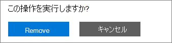

# Adicionar, atualizar ou remover seus métodos de pagamento

::: moniker range="o365-worldwide"
Você pode comprar produtos e serviços da Microsoft com um cartão de crédito ou débito ou uma conta bancária. Você pode inserir suas informações de pagamento na página **métodos de pagamento** ou quando fizer uma compra.

Você só pode gerenciar os métodos de pagamento que você adicionou.

> [!NOTE]
> A opção de pagamento com uma conta bancária não está disponível em alguns países ou regiões.
>
> Você deve usar um cartão de crédito emitido do mesmo país do seu locatário.

**A interface que você vê não corresponde à descrita neste artigo?** Em caso afirmativo, consulte [Manage Payment Methods](manage-payment-methods.md).

## Adicionar um método de pagamento

1. No centro de administração, vá **para a página** > <a href="https://go.microsoft.com/fwlink/p/?linkid=2018806" target="_blank">métodos de pagamento</a> de faturas **& pagamentos** > .
2. Selecione **Adicionar um método de pagamento**.
3. Na página **Método de pagamento**, escolha um método de pagamento do menu suspenso.
4. Insira as informações para o novo cartão ou conta bancária e, em seguida, selecione **Adicionar**.

## Atualizar um método de pagamento existente

Não é possível alterar o número em um cartão ou conta bancária existente. Se o número do cartão ou da conta bancária tiver sido alterado, adicione-o como uma nova forma de pagamento. Em seguida, selecione-o como a opção de pagamento para sua assinatura e remova o cartão ou a conta bancária existente. Você deve usar um cartão emitido do mesmo país do seu locatário.

1. No centro de administração, vá **para a página** > <a href="https://go.microsoft.com/fwlink/p/?linkid=2018806" target="_blank">métodos de pagamento</a> de faturas **& pagamentos** > .
2. Na página **métodos de pagamento** , escolha o cartão ou a conta bancária a ser atualizada e, em seguida, selecione **Editar**.
3. Atualize suas informações de método de pagamento (nome no cartão ou conta bancária, endereço de cobrança, número de telefone ou data de expiração) e, em seguida, selecione **salvar**.

## Alterar um método de pagamento

Você pode alterar a forma de pagamento usada para pagar uma única assinatura. Você também pode mover todas as assinaturas de um método de pagamento para outro.

### Alterar o método de pagamento usado para uma única assinatura

1. No centro de administração, vá para a página **Cobrança** > <a href="https://go.microsoft.com/fwlink/p/?linkid=842054" target="_blank">Produtos e serviços</a>.
2. Selecione a assinatura que você deseja pagar com o novo cartão ou conta bancária. Em **cobrança**, ao lado da forma de pagamento, selecione **Editar**.
3. Ao lado de sua método de pagamento existente, selecione **alterar**.
4. No menu suspenso, selecione uma método de pagamento alternativo ou escolha Adicionar uma forma de pagamento.
5. Se você adicionar um método de pagamento, insira os detalhes do cartão ou da conta e selecione **salvar**.
6. Verifique se o método de pagamento selecionado está correto e, em seguida, selecione **salvar**.

### Alterar o método de pagamento usado para várias assinaturas

1. No centro de administração, vá **para a página** > <a href="https://go.microsoft.com/fwlink/p/?linkid=2018806" target="_blank">métodos de pagamento</a> de faturas **& pagamentos** > .
2. Ao lado do método de pagamento que você deseja alterar, selecione o menu **mais** (três pontos) e, em seguida, selecione **alterar assinaturas**.
3. O painel **alterar método de pagamento** lista as assinaturas existentes que usam essa forma de pagamento.
4. No menu suspenso **selecionar método de pagamento** , selecione uma outra forma de pagamento e, em seguida, selecione **salvar**.

> [!NOTE]
> Você só pode alterar os métodos de pagamento existentes no painel **alterar método de pagamento** . Se você deseja alterar para pagar por fatura, confira [alterar de cartão de crédito ou conta bancária para fatura](change-payment-method.md#change-from-credit-card-or-bank-account-to-invoice).

## Remover um método de pagamento

Você só pode remover um cartão de crédito ou débito ou uma conta bancária da sua lista de métodos de pagamento se ele não estiver anexado a uma assinatura. Isso se aplica a todas as assinaturas, seja qual for o status. Adicione um método de pagamento para a assinatura e remova a antiga da assinatura. Se a forma de pagamento estiver associada a um perfil de cobrança, altere o método de pagamento usado para o perfil de cobrança e remova a forma de pagamento.

### Excluir um método de pagamento

Se sua forma de pagamento não estiver associada a nenhuma assinatura, você poderá excluí-la imediatamente.

1. No centro de administração, vá **para a página** > <a href="https://go.microsoft.com/fwlink/p/?linkid=2018806" target="_blank">métodos de pagamento</a> de faturas **& pagamentos** > .
2. Passe o mouse sobre o cartão ou a conta bancária e, em seguida, selecione o ícone Excluir.
3. Na parte inferior do painel **Excluir método de pagamento** , selecione **excluir**.

### Adicionar um método de pagamento alternativo usado para pagar por assinaturas

Se sua forma de pagamento estiver associada a qualquer assinatura e você não tiver um método de pagamento alternativo no arquivo, primeiro adicione uma forma de pagamento. Em seguida, altere o método de pagamento usado para pagar as assinaturas. Em seguida, você pode excluir a forma de pagamento.

1. No centro de administração, vá **para a página** > <a href="https://go.microsoft.com/fwlink/p/?linkid=2018806" target="_blank">métodos de pagamento</a> de faturas **& pagamentos** > .
2. Passe o mouse sobre o cartão ou a conta bancária e, em seguida, selecione o ícone Excluir.
3. O painel **Excluir método de pagamento** lista as assinaturas existentes que usam essa forma de pagamento.
4. Selecione **Adicionar um método de pagamento**.
5. Selecione o tipo de método de pagamento que você deseja adicionar, insira as informações da conta e, em seguida, selecione **Adicionar**.
6. Selecione o novo método de pagamento na lista suspensa e, em seguida, selecione **alterar**.
    > [!WARNING]
    > Isso moverá todas as assinaturas para a nova forma de pagamento.
7. Selecione **excluir**.

### Alterar o método de pagamento usado para pagar por assinaturas

Se sua forma de pagamento estiver associada a qualquer assinatura, e se você tiver pelo menos uma forma de pagamento alternativa no arquivo, primeiro altere o método de pagamento usado para pagar as assinaturas. Em seguida, você pode excluir a forma de pagamento.

1. No centro de administração, vá **para a página** > <a href="https://go.microsoft.com/fwlink/p/?linkid=2018806" target="_blank">métodos de pagamento</a> de faturas **& pagamentos** > .
2. Passe o mouse sobre o cartão ou a conta bancária e, em seguida, selecione o ícone Excluir.
3. O painel **Excluir método de pagamento** lista as assinaturas existentes que usam essa forma de pagamento.
4. Selecione **alterar método de pagamento**.
5. Selecione uma método de pagamento alternativo na lista suspensa e selecione **alterar**.
    > [!WARNING]
    > Isso moverá todas as assinaturas para a forma de pagamento alternativo.
6. Selecione **excluir**.

### Alterar a forma de pagamento de um perfil de cobrança

Se sua forma de pagamento estiver associada a um perfil de cobrança e também não for usada para pagar diretamente por outras assinaturas, primeiro altere o método de pagamento associado a ela. Em seguida, você pode excluir a forma de pagamento.

1. No centro de administração, vá para a página <a href="https://go.microsoft.com/fwlink/p/?linkid=2103629" target="_blank">perfis de cobrança</a> de pagamento > de **contas &amp; ** de **cobrança** > .
2. Selecione o perfil de cobrança que você deseja atualizar.
3. Na página detalhes do perfil de cobrança, em **método de pagamento**, selecione **Editar**.
4. Se você adicionar um método de pagamento alternativo, selecione **Adicionar um método de pagamento**. Insira as informações da sua conta e selecione **Adicionar**.
5. No menu suspenso **selecionar um método de pagamento** , selecione uma outra forma de pagamento e, em seguida, selecione **salvar**.
6. Siga as etapas em [excluir um método de pagamento](#delete-a-payment-method).

### Alterar o método de pagamento usado para um perfil de cobrança e assinaturas

Se sua forma de pagamento estiver associada a um perfil de cobrança e também for usada para pagar diretamente por qualquer assinatura, primeiro altere o método de pagamento associado ao perfil de cobrança. Em seguida, altere o método de pagamento usado para pagar as assinaturas. Em seguida, você pode excluir a forma de pagamento.

1. Siga as etapas de 1 a 5 em [alterar a forma de pagamento de um perfil de cobrança](#change-the-payment-method-for-a-billing-profile).
2. Se você não tiver um método de pagamento alternativo, siga as etapas em [Adicionar um método de pagamento alternativo usado para pagar assinaturas](#add-an-alternate-payment-method-used-to-pay-for-subscriptions).
3. Se você já tiver outros métodos de pagamento disponíveis, siga as etapas em [alterar um método de pagamento](#change-a-payment-method).

## Solucionar problemas de métodos de pagamento

|**Problema**|**Etapas de solução de problemas**|
|:-----|:-----|
|**Recebo uma mensagem de erro que diz: "o navegador está definido atualmente para bloquear cookies".**   |Configure seu navegador para permitir cookies de terceiros e tente novamente.    |
|**Meu cartão de crédito ou débito foi recusado.**   |Se você pagar por cartão de crédito ou débito e seu cartão for recusado, você receberá um email dizendo que a Microsoft não pôde processar o pagamento. Verifique se o número do cartão de &mdash; detalhes do cartão, a data de vencimento, o nome no cartão e o endereço, incluindo cidade, estado e CEP, aparecem exatamente como eles fazem no cartão e na instrução. Você pode atualizar as informações do cartão e enviar o pagamento imediatamente usando o link de **equilíbrio de liquidação** na seção **cobrança** da página detalhes da assinatura. Para obter mais informações, consulte e [se meu cartão de crédito foi recusado e se o meu pagamento está](pay-for-your-subscription.md#what-if-my-credit-card-was-declined-and-my-payment-is-past-due)vencido?.      Se você continuar a ver a mensagem "recusada", entre em contato com seu banco. É possível que o cartão não esteja ativo. Se você recebeu recentemente o cartão no email com uma data de validade atualizada, verifique se ele está ativado. Seu banco também pode informá-lo se o cartão não está aprovado para transações online, internacionais ou recorrentes.    |
|**Desejo atualizar um cartão ou número de conta bancária.**   |Não é possível alterar o número em um cartão ou conta bancária existente. Se o número do cartão ou da conta bancária tiver sido alterado, adicione outro número de cartão ou conta bancária. Em seguida, mova as assinaturas ativas do cartão ou da conta antiga para a nova. Em seguida, exclua o cartão ou a conta antiga. Para obter mais informações, consulte [Adicionar um método de pagamento](#add-a-payment-method) ou [alterar uma forma de pagamento](#change-a-payment-method). |
|**Só tenho um cartão ou conta bancária em minha conta e desejo removê-lo.**   |Se você tiver apenas um cartão ou uma conta bancária, verá uma mensagem de erro ao tentar removê-lo. Para corrigir o erro, certifique-se de que você está usando um método de pagamento diferente para pagar todas as suas assinaturas e tente remover o cartão ou a conta bancária novamente.    |
|**Não consigo adicionar meu cartão ou minha conta bancária.**   |Se você tiver problemas para inserir as informações do cartão ou da conta bancária, você pode [entrar em contato com o suporte](../../admin/contact-support-for-business-products.md).    |

::: moniker-end

::: moniker range="o365-21vianet"

Você deve ser um Administrador Global ou um Administrador de cobrança para realizar as tarefas descritas neste artigo.
  
 **Não é um administrador?** Entre em contato com seu administrador de ti para obter ajuda. [Quem tem permissões de administrador na minha empresa?](../../admin/admin-overview/admin-overview.md#who-has-admin-permissions-in-my-business)
  
 **Para o Office 365 Home ou pessoal**, confira [alterar o método de pagamento ou cartão de crédito vinculado à sua conta da Microsoft](https://support.microsoft.com/help/4026594).
  
> [!NOTE]
> A opção de pagamento com uma conta bancária não está disponível em alguns países ou regiões.
>
> Você deve usar um cartão de crédito emitido do mesmo país do seu locatário.

## Adicionar um cartão de crédito ou uma conta bancária

1. No centro de administração, vá para a página **Cobrança** \> <a href="https://go.microsoft.com/fwlink/p/?linkid=850626" target="_blank">Assinaturas</a>.

2. Escolha a assinatura que deseja pagar com o novo cartão de crédito ou conta bancária e, em seguida, selecione **atualizar detalhes de pagamento**.

    
  
3. Selecione a seta suspensa em **Adicionar ou selecionar um método de pagamento**e, em seguida, selecione **novo cartão de crédito** ou **nova conta bancária**.

    
  
4. Insira as informações para o novo cartão de crédito ou conta bancária e, em seguida, selecione **Enviar**.

    > [!NOTE]
    > O novo cartão de crédito ou conta bancária só será usado para a assinatura do Office 365 que você escolheu na etapa 2. Caso tenha outras assinaturas para as quais deseja usar o novo cartão ou a nova conta, siga as etapas descritas neste artigo para alterar o cartão ou a conta para cada assinatura.

::: moniker-end

::: moniker range="o365-germany"
## Adicionar um cartão de crédito ou uma conta bancária

Você deve ser um Administrador Global ou um Administrador de cobrança para realizar as tarefas descritas neste artigo.
  
 **Não é um administrador?** Contate o administrador de TI para obter ajuda. [Quem tem permissões de administrador na minha empresa?](../../admin/admin-overview/admin-overview.md#who-has-admin-permissions-in-my-business)
  
 **Para o Office 365 Home ou pessoal**, confira [alterar o método de pagamento ou cartão de crédito vinculado à sua conta da Microsoft](https://support.microsoft.com/help/4026594).
  
> [!NOTE]
> A opção de pagamento com uma conta bancária não está disponível em alguns países ou regiões.
>
> Você deve usar um cartão de crédito emitido do mesmo país do seu locatário.

1. No centro de administração, vá para a página **Cobrança** \> <a href="https://go.microsoft.com/fwlink/p/?linkid=847745" target="_blank">Assinaturas</a>.

2. Escolha a assinatura que deseja pagar com o novo cartão de crédito ou conta bancária e, em seguida, selecione **atualizar detalhes de pagamento**.

    
  
3. Selecione a seta suspensa em **Adicionar ou selecionar um método de pagamento**e, em seguida, selecione **novo cartão de crédito** ou **nova conta bancária**.

    
  
4. Insira as informações para o novo cartão de crédito ou conta bancária e, em seguida, selecione **Enviar**.

    > [!NOTE]
    > O novo cartão de crédito ou conta bancária só será usado para a assinatura do Office 365 que você escolheu na etapa 2. Caso tenha outras assinaturas para as quais deseja usar o novo cartão ou a nova conta, siga as etapas descritas neste artigo para alterar o cartão ou a conta para cada assinatura.

::: moniker-end

::: moniker range="o365-21vianet"
## Atualizar um cartão de crédito ou uma conta bancária existente

> [!NOTE]
> Não é possível alterar o número de um cartão de crédito ou de uma conta bancária existente. Se o cartão de crédito ou o número da conta bancária tiver mudado, adicione-o como um novo cartão de crédito ou conta bancária. Em seguida, selecione-o como a opção de pagamento para sua assinatura e remova o cartão de crédito ou a conta bancária existente.
> Você deve usar um cartão de crédito emitido do mesmo país do seu locatário.

1. No centro de administração, vá para a página **Cobrança** \> <a href="https://go.microsoft.com/fwlink/p/?linkid=850626" target="_blank">Assinaturas</a>.

2. Escolha a assinatura que você comprou com a conta bancária de cartão de crédito que você deseja atualizar e, em seguida, selecione **atualizar detalhes de pagamento**.

    > [!NOTE]
    > Se outro administrador comprou a assinatura, não será possível atualizar as informações do cartão de crédito ou da conta bancária dessa assinatura. Se o cartão de crédito estiver prestes a expirar e o outro administrador não puder atualizá-lo, você poderá impedir a interrupção do serviço se adicionar um cartão de crédito ou uma nova conta bancária diferente para a assinatura.
  
    
  
3. Selecione a seta suspensa em **Adicionar ou selecionar um método de pagamento**. Selecione o cartão de crédito ou conta bancária que você deseja atualizar e, em seguida, selecione **Editar detalhes**.

    
  
4. Atualize suas informações de cartão de crédito ou conta bancária (nome no cartão de crédito ou conta bancária, endereço de cobrança. número de telefone ou data de expiração, conforme necessário, selecione **Enviar**.

5. Uma mensagem de confirmação é exibida. Se isso não ocorrer, confira o tópico [Solucionando problemas com cartões de crédito e contas bancárias](#troubleshooting-credit-cards-and-bank-accounts).

    

::: moniker-end

::: moniker range="o365-germany"
## Atualizar um cartão de crédito ou uma conta bancária existente

> [!NOTE]
> Não é possível alterar o número de um cartão de crédito ou de uma conta bancária existente. Se o cartão de crédito ou o número da conta bancária tiver mudado, adicione-o como um novo cartão de crédito ou conta bancária. Em seguida, selecione-o como a opção de pagamento para sua assinatura e remova o cartão de crédito ou a conta bancária existente.
> Você deve usar um cartão de crédito emitido do mesmo país do seu locatário.

1. No centro de administração, vá para a página **Cobrança** \> <a href="https://go.microsoft.com/fwlink/p/?linkid=847745" target="_blank">Assinaturas</a>.

2. Escolha a assinatura que você comprou com a conta bancária de cartão de crédito que você deseja atualizar e, em seguida, selecione **atualizar detalhes de pagamento**.

    > [!NOTE]
    > Se outro administrador comprou a assinatura, não será possível atualizar as informações do cartão de crédito ou da conta bancária dessa assinatura. Se o cartão de crédito estiver prestes a expirar e o outro administrador não puder atualizá-lo, você poderá impedir a interrupção do serviço se adicionar um cartão de crédito ou uma nova conta bancária diferente para a assinatura.
  
    
  
3. Selecione a seta suspensa em **Adicionar ou selecionar um método de pagamento**. Selecione o cartão de crédito ou conta bancária que você deseja atualizar e, em seguida, selecione **Editar detalhes**.

    
  
4. Atualize suas informações de cartão de crédito ou conta bancária (nome no cartão de crédito ou conta bancária, endereço de cobrança. número de telefone ou data de expiração, conforme necessário, selecione **Enviar**.

5. Uma mensagem de confirmação é exibida. Se isso não ocorrer, confira o tópico [Solucionando problemas com cartões de crédito e contas bancárias](#troubleshooting-credit-cards-and-bank-accounts).

    

::: moniker-end

::: moniker range="o365-21vianet"
## Remover um cartão de crédito ou uma conta bancária

1. No centro de administração, vá para a página **Cobrança** \> <a href="https://go.microsoft.com/fwlink/p/?linkid=850626" target="_blank">Assinaturas</a>.

2. Escolha qualquer assinatura e, em seguida, selecione **atualizar detalhes de pagamento**.

    
  
3. Selecione a seta suspensa em **Adicionar ou selecionar um método de pagamento**.

4. Selecione o cartão de crédito ou a conta bancária e, em seguida, selecione **remover**.

    
  
5. Selecione **remover** novamente para excluir o cartão de crédito ou a conta bancária.

    
  
    > [!NOTE]
    > Você não poderá remover um cartão de crédito ou uma conta bancária se ele estiver sendo usado para pagar uma assinatura. Se você tentar, você verá uma mensagem como esta:   
    > Para remover o cartão de crédito ou a conta bancária, selecione **voltar** e siga as etapas deste artigo para alterar o cartão de crédito ou a conta bancária que você usa para pagar para a assinatura. Em seguida, tente remover o cartão ou a conta novamente.

::: moniker-end

::: moniker range="o365-germany"
## Remover um cartão de crédito ou uma conta bancária

1. No centro de administração, vá para a página **Cobrança** \> <a href="https://go.microsoft.com/fwlink/p/?linkid=847745" target="_blank">Assinaturas</a>.

2. Escolha qualquer assinatura e, em seguida, selecione **atualizar detalhes de pagamento**.

    
  
3. Selecione a seta suspensa em **Adicionar ou selecionar um método de pagamento**.

4. Selecione o cartão de crédito ou a conta bancária e, em seguida, selecione **remover**.

    

5. Selecione **remover** novamente para excluir o cartão de crédito ou a conta bancária.

    
  
    > [!NOTE]
    > Você não poderá remover um cartão de crédito ou uma conta bancária se ele estiver sendo usado para pagar uma assinatura. Se você tentar, você verá uma mensagem como esta:   
    > Para remover o cartão de crédito ou a conta bancária, selecione **voltar** e siga as etapas deste artigo para alterar o cartão de crédito ou a conta bancária que você usa para pagar para a assinatura. Em seguida, tente remover o cartão ou a conta novamente.

::: moniker-end

::: moniker range="o365-21vianet"
## Alterar o cartão de crédito ou a conta bancária usada para pagar uma assinatura

1. No centro de administração, vá para a página **Cobrança** \> <a href="https://go.microsoft.com/fwlink/p/?linkid=850626" target="_blank">Assinaturas</a>.

2. Escolha a assinatura que deseja pagar com o novo cartão de crédito ou conta bancária e, em seguida, selecione **atualizar detalhes de pagamento**.

    
  
3. Selecione a seta suspensa em **Adicionar ou selecione um método de pagamento** e selecione o cartão de crédito ou conta bancária que você deseja usar.

    
  
4. Selecione **Enviar**. Se o cartão de crédito ou conta bancária que você deseja usar ainda não estiver listado, escolha **novo cartão de crédito** ou **nova conta bancária** para adicioná-lo.

::: moniker-end

::: moniker range="o365-germany"
## Alterar o cartão de crédito ou a conta bancária usada para pagar uma assinatura

1. No centro de administração, vá para a página **Cobrança** \> <a href="https://go.microsoft.com/fwlink/p/?linkid=847745" target="_blank">Assinaturas</a>.

2. Escolha a assinatura que deseja pagar com o novo cartão de crédito ou conta bancária e, em seguida, selecione **atualizar detalhes de pagamento**.

    
  
3. Selecione a seta suspensa em **Adicionar ou selecione um método de pagamento** e selecione o cartão de crédito ou conta bancária que você deseja usar.

    
  
4. Selecione **Enviar**. Se o cartão de crédito ou conta bancária que você deseja usar ainda não estiver listado, escolha **novo cartão de crédito** ou **nova conta bancária** para adicioná-lo.

::: moniker-end

::: moniker range="o365-21vianet"
## Solucionando problemas com cartões de crédito e contas bancárias

|**Problema**|**Etapas de solução de problemas**|
|:-----|:-----|
|**Recebi a mensagem de erro "O navegador está configurado para bloquear cookies".**   |Configure seu navegador para permitir cookies de terceiros e tente novamente.    |
|**Meu cartão de crédito foi recusado.**   |Se você pagar por cartão de crédito e seu cartão de crédito for recusado, você receberá um email informando que não foi possível processar o pagamento. Verifique se os detalhes do cartão de crédito (número do cartão, data de expiração, nome no cartão de crédito e endereço, incluindo cidade, estado e CEP) aparecem exatamente como no cartão de crédito e no seu extrato de cartão de crédito. Você pode atualizar suas informações de cartão de crédito e enviar imediatamente o pagamento usando o recurso **pagar agora** . Para obter mais informações, consulte e [se meu cartão de crédito foi recusado e se o meu pagamento está](pay-for-your-subscription.md#what-if-my-credit-card-was-declined-and-my-payment-is-past-due)vencido?.      Se você continuar a ver a mensagem "recusada", entre em contato com seu banco. É possível que seu cartão de crédito não esteja ativo. Se você recebeu recentemente o cartão de crédito no email com uma data de validade atualizada, certifique-se de que ele está ativado. Seu banco também pode informá-lo se o cartão de crédito não está aprovado para transações online, internacionais ou recorrentes.    |
|**Desejo atualizar um número de cartão de crédito ou conta bancária.**   |Não é possível alterar o número de um cartão de crédito ou de uma conta bancária existente. Se o seu cartão de crédito ou seu número de conta bancária tiver mudado, [adicione um novo cartão de crédito ou conta bancária](#add-a-credit-card-or-bank-account), [altere sua assinatura para o cartão ou a conta bancária](#change-the-credit-card-or-bank-account-used-to-pay-for-a-subscription)e [exclua o cartão de crédito ou conta bancária antiga](#remove-a-credit-card-or-bank-account). |
|**Eu tenho um único cartão de crédito ou uma única conta bancária e desejo removê-los.**   |Se você tiver apenas um cartão de crédito ou uma conta bancária, verá uma mensagem de erro ao tentar removê-lo. Para corrigir o erro, certifique-se de que você está usando um método de pagamento diferente para pagar todas as assinaturas e tente remover o cartão de crédito ou a conta bancária novamente.    |
|**Não consigo adicionar meu cartão de crédito ou conta bancária.**   |Se tiver problemas para inserir seu cartão de crédito ou conta bancária, você poderá [contatar o suporte](../../admin/contact-support-for-business-products.md).  |

::: moniker-end

::: moniker range="o365-germany"
## Solucionando problemas com cartões de crédito e contas bancárias

|**Problema**|**Etapas de solução de problemas**|
|:-----|:-----|
|**Recebi a mensagem de erro "O navegador está configurado para bloquear cookies".**   |Configure seu navegador para permitir cookies de terceiros e tente novamente.    |
|**Meu cartão de crédito foi recusado.**   |Se você pagar por cartão de crédito e seu cartão de crédito for recusado, você receberá um email informando que não foi possível processar o pagamento. Verifique se os detalhes do cartão de crédito (número do cartão, data de expiração, nome no cartão de crédito e endereço, incluindo cidade, estado e CEP) aparecem exatamente como no cartão de crédito e no seu extrato de cartão de crédito. Você pode atualizar suas informações de cartão de crédito e enviar imediatamente o pagamento usando o recurso **pagar agora** . Para obter mais informações, consulte e [se meu cartão de crédito foi recusado e se o meu pagamento está](pay-for-your-subscription.md#what-if-my-credit-card-was-declined-and-my-payment-is-past-due)vencido?.      Se você continuar a ver a mensagem "recusada", entre em contato com seu banco. É possível que seu cartão de crédito não esteja ativo. Se você recebeu recentemente o cartão de crédito no email com uma data de validade atualizada, certifique-se de que ele está ativado. Seu banco também pode informá-lo se o cartão de crédito não está aprovado para transações online, internacionais ou recorrentes.    |
|**Desejo atualizar um número de cartão de crédito ou conta bancária.**   |Não é possível alterar o número de um cartão de crédito ou de uma conta bancária existente. Se o seu cartão de crédito ou seu número de conta bancária tiver mudado, [adicione um novo cartão de crédito ou conta bancária](#add-a-credit-card-or-bank-account-1), [altere sua assinatura para o cartão de crédito ou conta bancária](#change-the-credit-card-or-bank-account-used-to-pay-for-a-subscription-1)e [exclua o cartão de crédito ou conta bancária antiga](#remove-a-credit-card-or-bank-account-1). |
|**Eu tenho um único cartão de crédito ou uma única conta bancária e desejo removê-los.**   |Se você tiver apenas um cartão de crédito ou uma conta bancária, verá uma mensagem de erro ao tentar removê-lo. Para corrigir o erro, certifique-se de que você está usando um método de pagamento diferente para pagar todas as assinaturas e tente remover o cartão de crédito ou a conta bancária novamente.    |
|**Não consigo adicionar meu cartão de crédito ou conta bancária.**   |Se tiver problemas para inserir seu cartão de crédito ou conta bancária, você poderá [contatar o suporte](../../admin/contact-support-for-business-products.md).  |

::: moniker-end

## Artigos relacionados

[Alterar seus endereços de cobrança](change-your-billing-addresses.md)
  
[Cancelar sua assinatura](../subscriptions/cancel-your-subscription.md)
