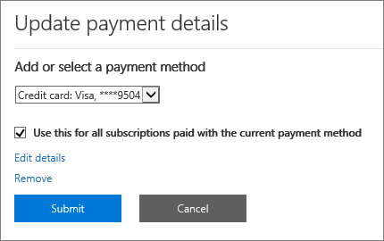

# Adicionar, atualizar ou remover seus métodos de pagamentoAdd, update, or remove your payment methods

::: moniker range="o365-worldwide"
Você pode comprar produtos e serviços da Microsoft com um cartão de crédito ou débito ou uma conta bancária.You can purchase products and services from Microsoft with a credit or debit card, or bank account. Você pode inserir suas informações de pagamento na página **métodos de pagamento** ou quando fizer uma compra.You can enter your payment information on the **Payment methods** page, or when you make a purchase.

Você só pode gerenciar os métodos de pagamento que você adicionou.You can only manage payment methods that you've added.

> [!NOTE]
> A opção de pagamento com uma conta bancária não está disponível em alguns países ou regiões.The option to pay with a bank account is not available in some countries or regions.
>
> Você deve usar um cartão de crédito emitido do mesmo país do seu locatário.You must use a credit card issued from the same country as your tenant.

**A interface que você vê não corresponde à descrita neste artigo?****Does the interface you see not match the one described in this article?** Em caso afirmativo, consulte [Manage Payment Methods](manage-payment-methods.md).If so, see [Manage payment methods](manage-payment-methods.md).

## Adicionar um método de pagamentoAdd a payment method

1. No centro de administração, vá **para a página** > <a href="https://go.microsoft.com/fwlink/p/?linkid=2018806" target="_blank">métodos de pagamento</a> de faturas **& pagamentos** > .In the admin center, go to the **Billing** > **Bills & payments** > <a href="https://go.microsoft.com/fwlink/p/?linkid=2018806" target="_blank">Payment methods</a> page.
2. Selecione **Adicionar um método de pagamento**.Select **Add a payment method**.
3. Na página **Método de pagamento**, escolha um método de pagamento do menu suspenso.On the **Payment methods** page, pick a payment method from the drop-down menu.
4. Insira as informações para o novo cartão ou conta bancária e, em seguida, selecione **Adicionar**.Enter the information for the new card or bank account, then select **Add**.

## Atualizar um método de pagamento existenteUpdate an existing payment method

Não é possível alterar o número em um cartão ou conta bancária existente.You can't change the number on an existing card or bank account. Se o número do cartão ou da conta bancária tiver sido alterado, adicione-o como uma nova forma de pagamento.If the card or bank account number has changed, add it as a new payment method. Em seguida, selecione-o como a opção de pagamento para sua assinatura e remova o cartão ou a conta bancária existente.Next, pick it as the payment option for your subscription, then remove the existing card or bank account. Você deve usar um cartão emitido do mesmo país do seu locatário.You must use a card issued from the same country as your tenant.

1. No centro de administração, vá **para a página** > <a href="https://go.microsoft.com/fwlink/p/?linkid=2018806" target="_blank">métodos de pagamento</a> de faturas **& pagamentos** > .In the admin center, go to the **Billing** > **Bills & payments** > <a href="https://go.microsoft.com/fwlink/p/?linkid=2018806" target="_blank">Payment methods</a> page.
2. Na página **métodos de pagamento** , escolha o cartão ou a conta bancária a ser atualizada e, em seguida, selecione **Editar**.On the **Payment methods** page, pick the card or bank account to update, then select **Edit**.
3. Atualize suas informações de método de pagamento (nome no cartão ou conta bancária, endereço de cobrança, número de telefone ou data de expiração) e, em seguida, selecione **salvar**.Update your payment method information (name on the card or bank account, billing address, phone number, or expiration date), then select **Save**.

## Alterar um método de pagamentoChange a payment method

Você pode alterar a forma de pagamento usada para pagar uma única assinatura.You can change the payment method that is used to pay for a single subscription. Você também pode mover todas as assinaturas de um método de pagamento para outro.You can also move all subscriptions from one payment method to another.

### Alterar o método de pagamento usado para uma única assinaturaChange the payment method used for a single subscription

1. No centro de administração, vá para a página **Cobrança** > <a href="https://go.microsoft.com/fwlink/p/?linkid=842054" target="_blank">Produtos e serviços</a>.In the admin center, go to the **Billing** > <a href="https://go.microsoft.com/fwlink/p/?linkid=842054" target="_blank">Products & services</a> page.
2. Selecione a assinatura que você deseja pagar com o novo cartão ou conta bancária.Select the subscription that you want to pay for with the new card or bank account. Em **cobrança**, ao lado da forma de pagamento, selecione **Editar**.Under **Billing**, next to the payment method, select **Edit**.
3. Ao lado de sua método de pagamento existente, selecione **alterar**.Next to your existing payment method, select **Change**.
4. No menu suspenso, selecione uma método de pagamento alternativo ou escolha Adicionar uma forma de pagamento.From the drop-down menu, select an alternate payment method, or choose to add a payment method.
5. Se você adicionar um método de pagamento, insira os detalhes do cartão ou da conta e selecione **salvar**.If you add a payment method, enter the card or account details, then select **Save**.
6. Verifique se o método de pagamento selecionado está correto e, em seguida, selecione **salvar**.Verify that the selected payment method is correct, then select **Save**.

### Alterar o método de pagamento usado para várias assinaturasChange the payment method used for multiple subscriptions

1. No centro de administração, vá **para a página** > <a href="https://go.microsoft.com/fwlink/p/?linkid=2018806" target="_blank">métodos de pagamento</a> de faturas **& pagamentos** > .In the admin center, go to the **Billing** > **Bills & payments** > <a href="https://go.microsoft.com/fwlink/p/?linkid=2018806" target="_blank">Payment methods</a> page.
2. Ao lado do método de pagamento que você deseja alterar, selecione o menu **mais** (três pontos) e, em seguida, selecione **alterar assinaturas**.Next to the payment method you want to change, select the **More** menu (three dots), and then select **Change subscriptions**.
3. O painel **alterar método de pagamento** lista as assinaturas existentes que usam essa forma de pagamento.The **Change payment method** pane lists existing subscriptions that use that payment method.
4. No menu suspenso **selecionar método de pagamento** , selecione uma outra forma de pagamento e, em seguida, selecione **salvar**.From the **Select payment method** drop-down, select a different payment method, then select **Save**.

> [!NOTE]
> Você só pode alterar os métodos de pagamento existentes no painel **alterar método de pagamento** .You can only change between existing payment methods in the **Change payment method** pane. Se você deseja alterar para pagar por fatura, confira [alterar de cartão de crédito ou conta bancária para fatura](change-payment-method.md#change-from-credit-card-or-bank-account-to-invoice).If you want to change to pay by invoice, see [Change from credit card or bank account to invoice](change-payment-method.md#change-from-credit-card-or-bank-account-to-invoice).

## Remover um método de pagamentoRemove a payment method

Você só pode remover um cartão de crédito ou débito ou uma conta bancária da sua lista de métodos de pagamento se ele não estiver anexado a uma assinatura.You can only remove a credit or debit card or bank account from your list of payment methods if it’s not attached to a subscription. Isso se aplica a todas as assinaturas, seja qual for o status.This applies to all subscriptions, whatever their status. Adicione um método de pagamento para a assinatura e remova a antiga da assinatura.Add a payment method for the subscription, then remove the old one from that subscription. Se a forma de pagamento estiver associada a um perfil de cobrança, altere o método de pagamento usado para o perfil de cobrança e remova a forma de pagamento.If the payment method is associated with a billing profile, change the payment method used for the billing profile, and then remove the payment method.

### Excluir um método de pagamentoDelete a payment method

Se sua forma de pagamento não estiver associada a nenhuma assinatura, você poderá excluí-la imediatamente.If your payment method isn't associated with any subscriptions, you can immediately delete it.

1. No centro de administração, vá **para a página** > <a href="https://go.microsoft.com/fwlink/p/?linkid=2018806" target="_blank">métodos de pagamento</a> de faturas **& pagamentos** > .In the admin center, go to the **Billing** > **Bills & payments** > <a href="https://go.microsoft.com/fwlink/p/?linkid=2018806" target="_blank">Payment methods</a> page.
2. Passe o mouse sobre o cartão ou a conta bancária e, em seguida, selecione o ícone Excluir.Hover over the card or bank account, then select the delete icon.
3. Na parte inferior do painel **Excluir método de pagamento** , selecione **excluir**.At the bottom of the **Delete payment method** pane, select **Delete**.

### Adicionar um método de pagamento alternativo usado para pagar por assinaturasAdd an alternate payment method used to pay for subscriptions

Se sua forma de pagamento estiver associada a qualquer assinatura e você não tiver um método de pagamento alternativo no arquivo, primeiro adicione uma forma de pagamento.If your payment method is associated with any subscriptions and you don't have an alternate payment method on file, first add a payment method. Em seguida, altere o método de pagamento usado para pagar as assinaturas.Next, change the payment method used to pay for the subscriptions. Em seguida, você pode excluir a forma de pagamento.Then you can delete the payment method.

1. No centro de administração, vá **para a página** > <a href="https://go.microsoft.com/fwlink/p/?linkid=2018806" target="_blank">métodos de pagamento</a> de faturas **& pagamentos** > .In the admin center, go to the **Billing** > **Bills & payments** > <a href="https://go.microsoft.com/fwlink/p/?linkid=2018806" target="_blank">Payment methods</a> page.
2. Passe o mouse sobre o cartão ou a conta bancária e, em seguida, selecione o ícone Excluir.Hover over the card or bank account, then select the delete icon.
3. O painel **Excluir método de pagamento** lista as assinaturas existentes que usam essa forma de pagamento.The **Delete payment method** pane lists existing subscriptions that use that payment method.
4. Selecione **Adicionar um método de pagamento**.Select **Add a payment method**.
5. Selecione o tipo de método de pagamento que você deseja adicionar, insira as informações da conta e, em seguida, selecione **Adicionar**.Select the type of payment method you want to add, enter the account information, then select **Add**.
6. Selecione o novo método de pagamento na lista suspensa e, em seguida, selecione **alterar**.Select the new payment method from the drop-down list, then select **Change**.
    > [!WARNING]
    > Isso moverá todas as assinaturas para a nova forma de pagamento.This will move all subscriptions to the new payment method.
7. Selecione **excluir**.Select **Delete**.

### Alterar o método de pagamento usado para pagar por assinaturasChange the payment method used to pay for subscriptions

Se sua forma de pagamento estiver associada a qualquer assinatura, e se você tiver pelo menos uma forma de pagamento alternativa no arquivo, primeiro altere o método de pagamento usado para pagar as assinaturas.If your payment method is associated with any subscriptions, and you have at least one alternate payment method on file, first change the payment method used to pay for the subscriptions. Em seguida, você pode excluir a forma de pagamento.Then you can delete the payment method.

1. No centro de administração, vá **para a página** > <a href="https://go.microsoft.com/fwlink/p/?linkid=2018806" target="_blank">métodos de pagamento</a> de faturas **& pagamentos** > .In the admin center, go to the **Billing** > **Bills & payments** > <a href="https://go.microsoft.com/fwlink/p/?linkid=2018806" target="_blank">Payment methods</a> page.
2. Passe o mouse sobre o cartão ou a conta bancária e, em seguida, selecione o ícone Excluir.Hover over the card or bank account, then select the delete icon.
3. O painel **Excluir método de pagamento** lista as assinaturas existentes que usam essa forma de pagamento.The **Delete payment method** pane lists existing subscriptions that use that payment method.
4. Selecione **alterar método de pagamento**.Select **Change payment method**.
5. Selecione uma método de pagamento alternativo na lista suspensa e selecione **alterar**.Select an alternate payment method from the drop-down list, then select **Change**.
    > [!WARNING]
    > Isso moverá todas as assinaturas para a forma de pagamento alternativo.This will move all subscriptions to the alternate payment method.
6. Selecione **excluir**.Select **Delete**.

### Alterar a forma de pagamento de um perfil de cobrançaChange the payment method for a billing profile

Se sua forma de pagamento estiver associada a um perfil de cobrança e também não for usada para pagar diretamente por outras assinaturas, primeiro altere o método de pagamento associado a ela.If your payment method is associated with a billing profile and isn't also used to directly pay for other subscriptions, first change the payment method associated with it. Em seguida, você pode excluir a forma de pagamento.Then you can delete the payment method.

1. No centro de administração, vá para a página <a href="https://go.microsoft.com/fwlink/p/?linkid=2103629" target="_blank">perfis de cobrança</a> de pagamento > de \*\*contas &amp; \*\* de **cobrança** > .In the admin center, go to the **Billing** > **Bills &amp; payments** > <a href="https://go.microsoft.com/fwlink/p/?linkid=2103629" target="_blank">Billing profiles</a> page.
2. Selecione o perfil de cobrança que você deseja atualizar.Select the billing profile you want to update.
3. Na página detalhes do perfil de cobrança, em **método de pagamento**, selecione **Editar**.On the billing profile details page, under **Payment method**, select **Edit**.
4. Se você adicionar um método de pagamento alternativo, selecione **Adicionar um método de pagamento**.If you add an alternate payment method, select **Add a payment method**. Insira as informações da sua conta e selecione **Adicionar**.Enter your account information, then select **Add**.
5. No menu suspenso **selecionar um método de pagamento** , selecione uma outra forma de pagamento e, em seguida, selecione **salvar**.From the **Select a payment method** drop-down, select a different payment method, then select **Save**.
6. Siga as etapas em [excluir um método de pagamento](#delete-a-payment-method).Follow the steps in [Delete a payment method](#delete-a-payment-method).

### Alterar o método de pagamento usado para um perfil de cobrança e assinaturasChange the payment method used for both a billing profile and subscriptions

Se sua forma de pagamento estiver associada a um perfil de cobrança e também for usada para pagar diretamente por qualquer assinatura, primeiro altere o método de pagamento associado ao perfil de cobrança.If your payment method is associated with a billing profile and is also used to directly pay for any subscriptions, first change the payment method associated with the billing profile. Em seguida, altere o método de pagamento usado para pagar as assinaturas.Next, change the payment method used to pay for the subscriptions. Em seguida, você pode excluir a forma de pagamento.Then you can delete the payment method.

1. Siga as etapas de 1 a 5 em [alterar a forma de pagamento de um perfil de cobrança](#change-the-payment-method-for-a-billing-profile).Follow steps 1 through 5 in [Change the payment method for a billing profile](#change-the-payment-method-for-a-billing-profile).
2. Se você não tiver um método de pagamento alternativo, siga as etapas em [Adicionar um método de pagamento alternativo usado para pagar assinaturas](#add-an-alternate-payment-method-used-to-pay-for-subscriptions).If you have no alternate payment method, follow the steps in [Add an alternate payment method used to pay for subscriptions](#add-an-alternate-payment-method-used-to-pay-for-subscriptions).
3. Se você já tiver outros métodos de pagamento disponíveis, siga as etapas em [alterar um método de pagamento](#change-a-payment-method).If you already have other payment methods available, follow the steps in [Change a payment method](#change-a-payment-method).

## Solucionar problemas de métodos de pagamentoTroubleshoot payment methods

|**Problema****Issue**|**Etapas de solução de problemas****Troubleshooting steps**|
|:-----|:-----|
|**Recebo uma mensagem de erro que diz: "o navegador está definido atualmente para bloquear cookies".****I get an error message that says, "The browser is currently set to block cookies."**   |Configure seu navegador para permitir cookies de terceiros e tente novamente.Set your browser to allow third-party cookies and try again.    |
|**Meu cartão de crédito ou débito foi recusado.****My credit or debit card was declined.**   |Se você pagar por cartão de crédito ou débito e seu cartão for recusado, você receberá um email dizendo que a Microsoft não pôde processar o pagamento.If you pay by credit or debit card, and your card is declined, you receive an email that says Microsoft was unable to process the payment. Verifique se o número do cartão de &mdash; detalhes do cartão, a data de vencimento, o nome no cartão e o endereço, incluindo cidade, estado e CEP, aparecem exatamente como eles fazem no cartão e na instrução.Double-check that the card details &mdash; card number, expiration date, name on the card, and address, including city, state, and ZIP code — appear exactly as they do on the card and your statement. Você pode atualizar as informações do cartão e enviar o pagamento imediatamente usando o link de **equilíbrio de liquidação** na seção **cobrança** da página detalhes da assinatura.You can update your card information and immediately submit the payment by using the **Settle balance** link in the **Billing** section of the subscription details page. Para obter mais informações, consulte e [se meu cartão de crédito foi recusado e se o meu pagamento está](pay-for-your-subscription.md#what-if-my-credit-card-was-declined-and-my-payment-is-past-due)vencido?.For more information, see [What if my credit card was declined and my payment is past due?](pay-for-your-subscription.md#what-if-my-credit-card-was-declined-and-my-payment-is-past-due).      Se você continuar a ver a mensagem "recusada", entre em contato com seu banco.If you continue to see the "declined" message, contact your bank. É possível que o cartão não esteja ativo.It's possible that your card isn't active. Se você recebeu recentemente o cartão no email com uma data de validade atualizada, verifique se ele está ativado.If you recently received the card in the mail with an updated expiration date, make sure it's activated. Seu banco também pode informá-lo se o cartão não está aprovado para transações online, internacionais ou recorrentes.Your bank can also tell you whether your card isn't approved for online, international, or recurring transactions.    |
|**Desejo atualizar um cartão ou número de conta bancária.****I want to update a card or bank account number.**   |Não é possível alterar o número em um cartão ou conta bancária existente.You can't change the number on an existing card or bank account. Se o número do cartão ou da conta bancária tiver sido alterado, adicione outro número de cartão ou conta bancária.If your card or bank account number has changed, add another card number or bank account. Em seguida, mova as assinaturas ativas do cartão ou da conta antiga para a nova.Next, move any active subscriptions from the old card or account to the new one. Em seguida, exclua o cartão ou a conta antiga.Then delete the old card or account. Para obter mais informações, consulte [Adicionar um método de pagamento](#add-a-payment-method) ou [alterar uma forma de pagamento](#change-a-payment-method).For more information, see [Add a payment method](#add-a-payment-method) or [Change a payment method](#change-a-payment-method). |
|**Só tenho um cartão ou conta bancária em minha conta e desejo removê-lo.****I only have one card or bank account on my account and I want to remove it.**   |Se você tiver apenas um cartão ou uma conta bancária, verá uma mensagem de erro ao tentar removê-lo.If you only have one card or bank account, you see an error message when you try to remove it. Para corrigir o erro, certifique-se de que você está usando um método de pagamento diferente para pagar todas as suas assinaturas e tente remover o cartão ou a conta bancária novamente.To fix the error, make sure that you're using a different payment method to pay for all your subscriptions, then try removing the card or bank account again.    |
|**Não consigo adicionar meu cartão ou minha conta bancária.****I can't add my card or bank account.**   |Se você tiver problemas para inserir as informações do cartão ou da conta bancária, você pode [entrar em contato com o suporte](../../admin/contact-support-for-business-products.md).If you have trouble entering your card or bank account information, you can [contact support](../../admin/contact-support-for-business-products.md).    |

::: moniker-end

::: moniker range="o365-21vianet"

Você deve ser um Administrador Global ou um Administrador de cobrança para realizar as tarefas descritas neste artigo.You must be a Global Admin or a Billing Admin to do the tasks described in this article.
  
 **Não é um administrador?****Not an admin?** Entre em contato com seu administrador de ti para obter ajuda. [Quem tem permissões de administrador na minha empresa?](../../admin/admin-overview/admin-overview.md#who-has-admin-permissions-in-my-business)Contact your IT administrator for help.[Who has admin permissions in my business?](../../admin/admin-overview/admin-overview.md#who-has-admin-permissions-in-my-business)
  
 **Para o Office 365 Home ou pessoal**, confira [alterar o método de pagamento ou cartão de crédito vinculado à sua conta da Microsoft](https://support.microsoft.com/help/4026594).**For Office 365 Home, or Personal**, see [Change the payment method or credit card linked to your Microsoft account](https://support.microsoft.com/help/4026594).
  
> [!NOTE]
> A opção de pagamento com uma conta bancária não está disponível em alguns países ou regiões.The option to pay with a bank account is not available in some countries or regions.
>
> Você deve usar um cartão de crédito emitido do mesmo país do seu locatário.You must use a credit card issued from the same country as your tenant.

## Adicionar um cartão de crédito ou uma conta bancáriaAdd a credit card or bank account

1. No centro de administração, vá para a página **Cobrança** \> <a href="https://go.microsoft.com/fwlink/p/?linkid=850626" target="_blank">Assinaturas</a>.In the admin center, go to the **Billing** \> <a href="https://go.microsoft.com/fwlink/p/?linkid=850626" target="_blank">Subscriptions</a> page.

2. Escolha a assinatura que deseja pagar com o novo cartão de crédito ou conta bancária e, em seguida, selecione **atualizar detalhes de pagamento**.Pick the subscription you want to pay for with the new credit card or bank account, then select **Update payment details**.

    
  
3. Selecione a seta suspensa em **Adicionar ou selecionar um método de pagamento**e, em seguida, selecione **novo cartão de crédito** ou **nova conta bancária**.Select the drop-down arrow under **Add or select a payment method**, then select **New credit card** or **New bank account**.

    
  
4. Insira as informações para o novo cartão de crédito ou conta bancária e, em seguida, selecione **Enviar**.Enter the information for the new credit card or bank account, then select **Submit**.

    > [!NOTE]
    > O novo cartão de crédito ou conta bancária só será usado para a assinatura do Office 365 que você escolheu na etapa 2.The new credit card or bank account will only be used for the Office 365 subscription you chose in step 2. Caso tenha outras assinaturas para as quais deseja usar o novo cartão ou a nova conta, siga as etapas descritas neste artigo para alterar o cartão ou a conta para cada assinatura.If you have other subscriptions that you want to use the new credit card or bank account for, follow the steps in this article to change the credit card or bank account used to pay for each subscription.

::: moniker-end

::: moniker range="o365-germany"
## Adicionar um cartão de crédito ou uma conta bancáriaAdd a credit card or bank account

Você deve ser um Administrador Global ou um Administrador de cobrança para realizar as tarefas descritas neste artigo.You must be a Global Admin or a Billing Admin to do the tasks described in this article.
  
 **Não é um administrador?** Contate o administrador de TI para obter ajuda. [Quem tem permissões de administrador na minha empresa?](../../admin/admin-overview/admin-overview.md#who-has-admin-permissions-in-my-business)**Not an admin?** Contact your IT administrator for help. [Who has admin permissions in my business?](../../admin/admin-overview/admin-overview.md#who-has-admin-permissions-in-my-business)
  
 **Para o Office 365 Home ou pessoal**, confira [alterar o método de pagamento ou cartão de crédito vinculado à sua conta da Microsoft](https://support.microsoft.com/help/4026594).**For Office 365 Home, or Personal**, see [Change the payment method or credit card linked to your Microsoft account](https://support.microsoft.com/help/4026594).
  
> [!NOTE]
> A opção de pagamento com uma conta bancária não está disponível em alguns países ou regiões.The option to pay with a bank account is not available in some countries or regions.
>
> Você deve usar um cartão de crédito emitido do mesmo país do seu locatário.You must use a credit card issued from the same country as your tenant.

1. No centro de administração, vá para a página **Cobrança** \> <a href="https://go.microsoft.com/fwlink/p/?linkid=847745" target="_blank">Assinaturas</a>.In the admin center, go to the **Billing** \> <a href="https://go.microsoft.com/fwlink/p/?linkid=847745" target="_blank">Subscriptions</a> page.

2. Escolha a assinatura que deseja pagar com o novo cartão de crédito ou conta bancária e, em seguida, selecione **atualizar detalhes de pagamento**.Pick the subscription you want to pay for with the new credit card or bank account, then select **Update payment details**.

    
  
3. Selecione a seta suspensa em **Adicionar ou selecionar um método de pagamento**e, em seguida, selecione **novo cartão de crédito** ou **nova conta bancária**.Select the drop-down arrow under **Add or select a payment method**, then select **New credit card** or **New bank account**.

    
  
4. Insira as informações para o novo cartão de crédito ou conta bancária e, em seguida, selecione **Enviar**.Enter the information for the new credit card or bank account, then select **Submit**.

    > [!NOTE]
    > O novo cartão de crédito ou conta bancária só será usado para a assinatura do Office 365 que você escolheu na etapa 2.The new credit card or bank account will only be used for the Office 365 subscription you chose in step 2. Caso tenha outras assinaturas para as quais deseja usar o novo cartão ou a nova conta, siga as etapas descritas neste artigo para alterar o cartão ou a conta para cada assinatura.If you have other subscriptions that you want to use the new credit card or bank account for, follow the steps in this article to change the credit card or bank account used to pay for each subscription.

::: moniker-end

::: moniker range="o365-21vianet"
## Atualizar um cartão de crédito ou uma conta bancária existenteUpdate an existing credit card or bank account

> [!NOTE]
> Não é possível alterar o número de um cartão de crédito ou de uma conta bancária existente.You can't change the number on an existing credit card or bank account. Se o cartão de crédito ou o número da conta bancária tiver mudado, adicione-o como um novo cartão de crédito ou conta bancária.If the credit card or bank account number has changed, add it as a new credit card or bank account. Em seguida, selecione-o como a opção de pagamento para sua assinatura e remova o cartão de crédito ou a conta bancária existente.Next, pick it as the payment option for your subscription, then remove the existing credit card or bank account.
> Você deve usar um cartão de crédito emitido do mesmo país do seu locatário.You must use a credit card issued from the same country as your tenant.

1. No centro de administração, vá para a página **Cobrança** \> <a href="https://go.microsoft.com/fwlink/p/?linkid=850626" target="_blank">Assinaturas</a>.In the admin center, go to the **Billing** \> <a href="https://go.microsoft.com/fwlink/p/?linkid=850626" target="_blank">Subscriptions</a> page.

2. Escolha a assinatura que você comprou com a conta bancária de cartão de crédito que você deseja atualizar e, em seguida, selecione **atualizar detalhes de pagamento**.Pick the subscription you bought with the credit card bank account that you want to update, then select **Update payment details**.

    > [!NOTE]
    > Se outro administrador comprou a assinatura, não será possível atualizar as informações do cartão de crédito ou da conta bancária dessa assinatura.If another admin purchased the subscription, you won't be able to update the credit card or bank account information for it. Se o cartão de crédito estiver prestes a expirar e o outro administrador não puder atualizá-lo, você poderá impedir a interrupção do serviço se adicionar um cartão de crédito ou uma nova conta bancária diferente para a assinatura.If the credit card is about to expire and the other administrator isn't able to update it, you can prevent service interruption if you add a different credit card or new bank account for the subscription.
  
    
  
3. Selecione a seta suspensa em **Adicionar ou selecionar um método de pagamento**.Select the drop-down arrow under **Add or select a payment method**. Selecione o cartão de crédito ou conta bancária que você deseja atualizar e, em seguida, selecione **Editar detalhes**.Select the credit card or bank account that you want to update, then select **Edit details**.

    
  
4. Atualize suas informações de cartão de crédito ou conta bancária (nome no cartão de crédito ou conta bancária, endereço de cobrança.Update your credit card or bank account information (name on the credit card or bank account, billing address. número de telefone ou data de expiração, conforme necessário, selecione **Enviar**.phone number, or expiration date) as needed, then select **Submit**.

5. Uma mensagem de confirmação é exibida.A confirmation message appears. Se isso não ocorrer, confira o tópico [Solucionando problemas com cartões de crédito e contas bancárias](#troubleshooting-credit-cards-and-bank-accounts).If it doesn't, see [Troubleshooting credit cards and bank accounts](#troubleshooting-credit-cards-and-bank-accounts).

    

::: moniker-end

::: moniker range="o365-germany"
## Atualizar um cartão de crédito ou uma conta bancária existenteUpdate an existing credit card or bank account

> [!NOTE]
> Não é possível alterar o número de um cartão de crédito ou de uma conta bancária existente.You can't change the number on an existing credit card or bank account. Se o cartão de crédito ou o número da conta bancária tiver mudado, adicione-o como um novo cartão de crédito ou conta bancária.If the credit card or bank account number has changed, add it as a new credit card or bank account. Em seguida, selecione-o como a opção de pagamento para sua assinatura e remova o cartão de crédito ou a conta bancária existente.Next, pick it as the payment option for your subscription, then remove the existing credit card or bank account.
> Você deve usar um cartão de crédito emitido do mesmo país do seu locatário.You must use a credit card issued from the same country as your tenant.

1. No centro de administração, vá para a página **Cobrança** \> <a href="https://go.microsoft.com/fwlink/p/?linkid=847745" target="_blank">Assinaturas</a>.In the admin center, go to the **Billing** \> <a href="https://go.microsoft.com/fwlink/p/?linkid=847745" target="_blank">Subscriptions</a> page.

2. Escolha a assinatura que você comprou com a conta bancária de cartão de crédito que você deseja atualizar e, em seguida, selecione **atualizar detalhes de pagamento**.Pick the subscription you bought with the credit card bank account that you want to update, then select **Update payment details**.

    > [!NOTE]
    > Se outro administrador comprou a assinatura, não será possível atualizar as informações do cartão de crédito ou da conta bancária dessa assinatura.If another admin purchased the subscription, you won't be able to update the credit card or bank account information for it. Se o cartão de crédito estiver prestes a expirar e o outro administrador não puder atualizá-lo, você poderá impedir a interrupção do serviço se adicionar um cartão de crédito ou uma nova conta bancária diferente para a assinatura.If the credit card is about to expire and the other administrator isn't able to update it, you can prevent service interruption if you add a different credit card or new bank account for the subscription.
  
    
  
3. Selecione a seta suspensa em **Adicionar ou selecionar um método de pagamento**.Select the drop-down arrow under **Add or select a payment method**. Selecione o cartão de crédito ou conta bancária que você deseja atualizar e, em seguida, selecione **Editar detalhes**.Select the credit card or bank account that you want to update, then select **Edit details**.

    
  
4. Atualize suas informações de cartão de crédito ou conta bancária (nome no cartão de crédito ou conta bancária, endereço de cobrança.Update your credit card or bank account information (name on the credit card or bank account, billing address. número de telefone ou data de expiração, conforme necessário, selecione **Enviar**.phone number, or expiration date) as needed, then select **Submit**.

5. Uma mensagem de confirmação é exibida.A confirmation message appears. Se isso não ocorrer, confira o tópico [Solucionando problemas com cartões de crédito e contas bancárias](#troubleshooting-credit-cards-and-bank-accounts).If it doesn't, see [Troubleshooting credit cards and bank accounts](#troubleshooting-credit-cards-and-bank-accounts).

    

::: moniker-end

::: moniker range="o365-21vianet"
## Remover um cartão de crédito ou uma conta bancáriaRemove a credit card or bank account

1. No centro de administração, vá para a página **Cobrança** \> <a href="https://go.microsoft.com/fwlink/p/?linkid=850626" target="_blank">Assinaturas</a>.In the admin center, go to the **Billing** \> <a href="https://go.microsoft.com/fwlink/p/?linkid=850626" target="_blank">Subscriptions</a> page.

2. Escolha qualquer assinatura e, em seguida, selecione **atualizar detalhes de pagamento**.Pick any subscription, then select **Update payment details**.

    
  
3. Selecione a seta suspensa em **Adicionar ou selecionar um método de pagamento**.Select the drop-down arrow under **Add or select a payment method**.

4. Selecione o cartão de crédito ou a conta bancária e, em seguida, selecione **remover**.Select the credit card or bank account, then select **Remove**.

    
  
5. Selecione **remover** novamente para excluir o cartão de crédito ou a conta bancária.Select **Remove** again to delete the credit card or bank account.

    
  
    > [!NOTE]
    > Você não poderá remover um cartão de crédito ou uma conta bancária se ele estiver sendo usado para pagar uma assinatura.You won't be able to remove a credit card or bank account if it's currently used to pay for a subscription. Se você tentar, você verá uma mensagem como esta: If you try, you see a message like this:   
    > Para remover o cartão de crédito ou a conta bancária, selecione **voltar** e siga as etapas deste artigo para alterar o cartão de crédito ou a conta bancária que você usa para pagar para a assinatura.To remove the credit card or bank account, select **Back** and follow the steps in this article to change the credit card or bank account that you use to pay for the subscription. Em seguida, tente remover o cartão ou a conta novamente.Then try removing the credit card or bank account again.

::: moniker-end

::: moniker range="o365-germany"
## Remover um cartão de crédito ou uma conta bancáriaRemove a credit card or bank account

1. No centro de administração, vá para a página **Cobrança** \> <a href="https://go.microsoft.com/fwlink/p/?linkid=847745" target="_blank">Assinaturas</a>.In the admin center, go to the **Billing** \> <a href="https://go.microsoft.com/fwlink/p/?linkid=847745" target="_blank">Subscriptions</a> page.

2. Escolha qualquer assinatura e, em seguida, selecione **atualizar detalhes de pagamento**.Pick any subscription, then select **Update payment details**.

    
  
3. Selecione a seta suspensa em **Adicionar ou selecionar um método de pagamento**.Select the drop-down arrow under **Add or select a payment method**.

4. Selecione o cartão de crédito ou a conta bancária e, em seguida, selecione **remover**.Select the credit card or bank account, then select **Remove**.

    

5. Selecione **remover** novamente para excluir o cartão de crédito ou a conta bancária.Select **Remove** again to delete the credit card or bank account.

    
  
    > [!NOTE]
    > Você não poderá remover um cartão de crédito ou uma conta bancária se ele estiver sendo usado para pagar uma assinatura.You won't be able to remove a credit card or bank account if it's currently used to pay for a subscription. Se você tentar, você verá uma mensagem como esta: If you try, you see a message like this:   
    > Para remover o cartão de crédito ou a conta bancária, selecione **voltar** e siga as etapas deste artigo para alterar o cartão de crédito ou a conta bancária que você usa para pagar para a assinatura.To remove the credit card or bank account, select **Back** and follow the steps in this article to change the credit card or bank account that you use to pay for the subscription. Em seguida, tente remover o cartão ou a conta novamente.Then try removing the credit card or bank account again.

::: moniker-end

::: moniker range="o365-21vianet"
## Alterar o cartão de crédito ou a conta bancária usada para pagar uma assinaturaChange the credit card or bank account used to pay for a subscription

1. No centro de administração, vá para a página **Cobrança** \> <a href="https://go.microsoft.com/fwlink/p/?linkid=850626" target="_blank">Assinaturas</a>.In the admin center, go to the **Billing** \> <a href="https://go.microsoft.com/fwlink/p/?linkid=850626" target="_blank">Subscriptions</a> page.

2. Escolha a assinatura que deseja pagar com o novo cartão de crédito ou conta bancária e, em seguida, selecione **atualizar detalhes de pagamento**.Pick the subscription that you want to pay for with the new credit card or bank account, then select **Update payment details**.

    
  
3. Selecione a seta suspensa em **Adicionar ou selecione um método de pagamento** e selecione o cartão de crédito ou conta bancária que você deseja usar.Select the drop-down arrow under **Add or select a payment method** and select the credit card or bank account that you want to use.

    
  
4. Selecione **Enviar**.Select **Submit**. Se o cartão de crédito ou conta bancária que você deseja usar ainda não estiver listado, escolha **novo cartão de crédito** ou **nova conta bancária** para adicioná-lo.If the credit card or bank account that you want to use isn't listed yet, pick **New credit card** or **New bank account** to add it.

::: moniker-end

::: moniker range="o365-germany"
## Alterar o cartão de crédito ou a conta bancária usada para pagar uma assinaturaChange the credit card or bank account used to pay for a subscription

1. No centro de administração, vá para a página **Cobrança** \> <a href="https://go.microsoft.com/fwlink/p/?linkid=847745" target="_blank">Assinaturas</a>.In the admin center, go to the **Billing** \> <a href="https://go.microsoft.com/fwlink/p/?linkid=847745" target="_blank">Subscriptions</a> page.

2. Escolha a assinatura que deseja pagar com o novo cartão de crédito ou conta bancária e, em seguida, selecione **atualizar detalhes de pagamento**.Pick the subscription that you want to pay for with the new credit card or bank account, then select **Update payment details**.

    
  
3. Selecione a seta suspensa em **Adicionar ou selecione um método de pagamento** e selecione o cartão de crédito ou conta bancária que você deseja usar.Select the drop-down arrow under **Add or select a payment method** and select the credit card or bank account that you want to use.

    
  
4. Selecione **Enviar**.Select **Submit**. Se o cartão de crédito ou conta bancária que você deseja usar ainda não estiver listado, escolha **novo cartão de crédito** ou **nova conta bancária** para adicioná-lo.If the credit card or bank account that you want to use isn't listed yet, pick **New credit card** or **New bank account** to add it.

::: moniker-end

::: moniker range="o365-21vianet"
## Solucionando problemas com cartões de crédito e contas bancáriasTroubleshooting credit cards and bank accounts

|**Problema****Issue**|**Etapas de solução de problemas****Troubleshooting steps**|
|:-----|:-----|
|**Recebi a mensagem de erro "O navegador está configurado para bloquear cookies".****I get an error message that says "The browser is currently set to block cookies."**   |Configure seu navegador para permitir cookies de terceiros e tente novamente.Set your browser to allow third-party cookies and try again.    |
|**Meu cartão de crédito foi recusado.****My credit card was declined.**   |Se você pagar por cartão de crédito e seu cartão de crédito for recusado, você receberá um email informando que não foi possível processar o pagamento.If you pay by credit card, and your credit card is declined, you receive an email that we were unable to process the payment. Verifique se os detalhes do cartão de crédito (número do cartão, data de expiração, nome no cartão de crédito e endereço, incluindo cidade, estado e CEP) aparecem exatamente como no cartão de crédito e no seu extrato de cartão de crédito.Verify that the credit card details (card number, expiration date, name on the credit card, and address, including city, state, and ZIP code) appear exactly as they do on the credit card and your credit card statement. Você pode atualizar suas informações de cartão de crédito e enviar imediatamente o pagamento usando o recurso **pagar agora** .You can update your credit card information and immediately submit the payment by using the **Pay now** feature. Para obter mais informações, consulte e [se meu cartão de crédito foi recusado e se o meu pagamento está](pay-for-your-subscription.md#what-if-my-credit-card-was-declined-and-my-payment-is-past-due)vencido?.For more information, see [What if my credit card was declined and my payment is past due?](pay-for-your-subscription.md#what-if-my-credit-card-was-declined-and-my-payment-is-past-due).      Se você continuar a ver a mensagem "recusada", entre em contato com seu banco.If you continue to see the "declined" message, contact your bank. É possível que seu cartão de crédito não esteja ativo.It's possible that your credit card isn't active. Se você recebeu recentemente o cartão de crédito no email com uma data de validade atualizada, certifique-se de que ele está ativado.If you recently received the credit card in the mail with an updated expiration date, make sure it's activated. Seu banco também pode informá-lo se o cartão de crédito não está aprovado para transações online, internacionais ou recorrentes.Your bank can also tell you whether your credit card isn't approved for online, international, or recurring transactions.    |
|**Desejo atualizar um número de cartão de crédito ou conta bancária.****I want to update a credit card or bank account number.**   |Não é possível alterar o número de um cartão de crédito ou de uma conta bancária existente.You can't change the number on an existing credit card or bank account. Se o seu cartão de crédito ou seu número de conta bancária tiver mudado, [adicione um novo cartão de crédito ou conta bancária](#add-a-credit-card-or-bank-account), [altere sua assinatura para o cartão ou a conta bancária](#change-the-credit-card-or-bank-account-used-to-pay-for-a-subscription)e [exclua o cartão de crédito ou conta bancária antiga](#remove-a-credit-card-or-bank-account).If your credit card or bank account number has changed, [add a new credit card or bank account](#add-a-credit-card-or-bank-account), [change your subscription to that card or bank account](#change-the-credit-card-or-bank-account-used-to-pay-for-a-subscription), and then [delete the old credit card or bank account](#remove-a-credit-card-or-bank-account). |
|**Eu tenho um único cartão de crédito ou uma única conta bancária e desejo removê-los.****I only have one credit card or bank account on my account and I want to remove it.**   |Se você tiver apenas um cartão de crédito ou uma conta bancária, verá uma mensagem de erro ao tentar removê-lo.If you only have one credit card or bank account, you see an error message when you try to remove it. Para corrigir o erro, certifique-se de que você está usando um método de pagamento diferente para pagar todas as assinaturas e tente remover o cartão de crédito ou a conta bancária novamente.To fix error, make sure that you're using a different payment method to pay for all of your subscriptions, then try removing the credit card or bank account again.    |
|**Não consigo adicionar meu cartão de crédito ou conta bancária.****I can't add my credit card or bank account.**   |Se tiver problemas para inserir seu cartão de crédito ou conta bancária, você poderá [contatar o suporte](../../admin/contact-support-for-business-products.md).If you have trouble entering your credit card or bank account information, you can [contact support](../../admin/contact-support-for-business-products.md).    |

::: moniker-end

::: moniker range="o365-germany"
## Solucionando problemas com cartões de crédito e contas bancáriasTroubleshooting credit cards and bank accounts

|**Problema****Issue**|**Etapas de solução de problemas****Troubleshooting steps**|
|:-----|:-----|
|**Recebi a mensagem de erro "O navegador está configurado para bloquear cookies".****I get an error message that says "The browser is currently set to block cookies."**   |Configure seu navegador para permitir cookies de terceiros e tente novamente.Set your browser to allow third-party cookies and try again.    |
|**Meu cartão de crédito foi recusado.****My credit card was declined.**   |Se você pagar por cartão de crédito e seu cartão de crédito for recusado, você receberá um email informando que não foi possível processar o pagamento.If you pay by credit card, and your credit card is declined, you receive an email that we were unable to process the payment. Verifique se os detalhes do cartão de crédito (número do cartão, data de expiração, nome no cartão de crédito e endereço, incluindo cidade, estado e CEP) aparecem exatamente como no cartão de crédito e no seu extrato de cartão de crédito.Verify that the credit card details (card number, expiration date, name on the credit card, and address, including city, state, and ZIP code) appear exactly as they do on the credit card and your credit card statement. Você pode atualizar suas informações de cartão de crédito e enviar imediatamente o pagamento usando o recurso **pagar agora** .You can update your credit card information and immediately submit the payment by using the **Pay now** feature. Para obter mais informações, consulte e [se meu cartão de crédito foi recusado e se o meu pagamento está](pay-for-your-subscription.md#what-if-my-credit-card-was-declined-and-my-payment-is-past-due)vencido?.For more information, see [What if my credit card was declined and my payment is past due?](pay-for-your-subscription.md#what-if-my-credit-card-was-declined-and-my-payment-is-past-due).      Se você continuar a ver a mensagem "recusada", entre em contato com seu banco.If you continue to see the "declined" message, contact your bank. É possível que seu cartão de crédito não esteja ativo.It's possible that your credit card isn't active. Se você recebeu recentemente o cartão de crédito no email com uma data de validade atualizada, certifique-se de que ele está ativado.If you recently received the credit card in the mail with an updated expiration date, make sure it's activated. Seu banco também pode informá-lo se o cartão de crédito não está aprovado para transações online, internacionais ou recorrentes.Your bank can also tell you whether your credit card isn't approved for online, international, or recurring transactions.    |
|**Desejo atualizar um número de cartão de crédito ou conta bancária.****I want to update a credit card or bank account number.**   |Não é possível alterar o número de um cartão de crédito ou de uma conta bancária existente.You can't change the number on an existing credit card or bank account. Se o seu cartão de crédito ou seu número de conta bancária tiver mudado, [adicione um novo cartão de crédito ou conta bancária](#add-a-credit-card-or-bank-account-1), [altere sua assinatura para o cartão de crédito ou conta bancária](#change-the-credit-card-or-bank-account-used-to-pay-for-a-subscription-1)e [exclua o cartão de crédito ou conta bancária antiga](#remove-a-credit-card-or-bank-account-1).If your credit card or bank account number has changed, [add a new credit card or bank account](#add-a-credit-card-or-bank-account-1), [change your subscription to that the credit card or bank account](#change-the-credit-card-or-bank-account-used-to-pay-for-a-subscription-1), and then [delete the old credit card or bank account](#remove-a-credit-card-or-bank-account-1). |
|**Eu tenho um único cartão de crédito ou uma única conta bancária e desejo removê-los.****I only have one credit card or bank account on my account and I want to remove it.**   |Se você tiver apenas um cartão de crédito ou uma conta bancária, verá uma mensagem de erro ao tentar removê-lo.If you only have one credit card or bank account, you see an error message when you try to remove it. Para corrigir o erro, certifique-se de que você está usando um método de pagamento diferente para pagar todas as assinaturas e tente remover o cartão de crédito ou a conta bancária novamente.To fix error, make sure that you're using a different payment method to pay for all of your subscriptions, then try removing the credit card or bank account again.    |
|**Não consigo adicionar meu cartão de crédito ou conta bancária.****I can't add my credit card or bank account.**   |Se tiver problemas para inserir seu cartão de crédito ou conta bancária, você poderá [contatar o suporte](../../admin/contact-support-for-business-products.md).If you have trouble entering your credit card or bank account information, you can [contact support](../../admin/contact-support-for-business-products.md).    |

::: moniker-end

## Artigos relacionadosRelated articles

[Alterar seus endereços de cobrançaChange your billing addresses](change-your-billing-addresses.md)
  
[Cancelar sua assinaturaCancel your subscription](../subscriptions/cancel-your-subscription.md)