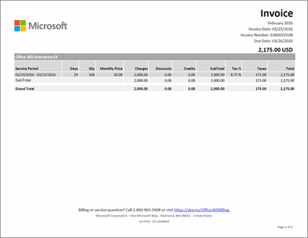

# Entenda sua fatura do Office 365 para empresas

A cada mês, você receberá um email informando que o novo demonstrativo de cobrança está disponível no centro de administração. [Saiba como encontrar e exibir a sua fatura](view-your-bill-or-invoice.md).
  
A fatura contém duas páginas. A página 1 contém o resumo e informações gerais sobre a fatura, o pedido, o valor devido, a forma de pagamento e como contatar o suporte.
  

  
A página 2 contém detalhes sobre as atividades de cobrança de cada assinatura.
  

  
Para ver descrições sobre os campos e termos incluídos na fatura, confira o tópico [Glossário de Campos da Fatura](#invoice-field-glossary) mais adiante neste artigo.
  
## Entender os conceitos de cobrança

Antes de exibir a fatura, é preciso entender alguns conceitos de cobrança.
  
### Saldo da fatura versus saldo do pedido

 **Saldo da fatura** é o valor mostrado na fatura e é apenas o valor devido para esse período de cobrança específico. O saldo total da **ordem** é a soma de todas as faturas não pagas. Você pode exibir o seu saldo de pedidos na seção **cobrança** do centro de administração.
  
### Frequência de cobrança versus frequência de faturamento

 A **frequência de cobrança** significa quantas vezes você é cobrado. As assinaturas são cobradas mensalmente ou anualmente, dependendo da opção que você escolheu durante a compra da assinatura. A **frequência da fatura** significa quantas vezes você recebe uma fatura. Se você escolheu a cobrança anual, só receberá uma fatura por ano, a menos que as atividades da sua assinatura exijam uma cobrança ou um crédito.
  
Caso faça mais de um pedido, você receberá uma fatura para cada pedido.
  
## Glossário de Campos da Fatura

A tabela a seguir descreve os campos exibidos na fatura. Alguns campos listados aqui podem não ser exibidos na fatura, dependendo da opção pelo pagamento por fatura, cartão de crédito ou débito em conta.
  
> [!NOTE]
> O pagamento por meio de conta bancária não está disponível em alguns países ou regiões.
  
|**Nome**|**Descrição**|
|:-----|:-----|
|Preço anual|As assinaturas são cobradas mensalmente ou anualmente. Se você escolher cobrança anual durante a compra da assinatura, o preço anual da licença será refletido na fatura. Caso pretenda alterar a frequência de cobrança, cancele a assinatura e compre-a novamente com a nova frequência de cobrança.|
|Período de Cobrança|Um período de cobrança é o período de tempo decorrido desde a data da última fatura. Um Período de Serviço é o período de tempo durante o qual você é cobrado por usar o serviço.|
|Enviar Cobrança para|Este é o endereço do seu departamento de cobrança e é geralmente o mesmo que o endereço vendido para. Para atualizar seu endereço de cobrança, confira [alterar seus endereços de cobrança](change-your-billing-addresses.md).|
|Encargos|A página 1 mostra um resumo de todos os encargos para o Período de Cobrança da fatura. A página 2 mostra os encargos detalhados de cada assinatura.|
|Cheque|Se pagar por fatura e a opção de pagamento em cheque estiver disponível em seu país, você verá informações sobre o endereço de envio do pagamento na parte inferior da página 1. Faça referência ao número da fatura no cheque.|
|Créditos|A página 1 mostra um resumo de todos os créditos referentes ao Período de Cobrança da fatura. A página 2 mostra os créditos detalhados de cada assinatura.|
|Número da OC do Cliente|O número da OC (ordem de compra). Quando você atualizar o número da OC, as próximas faturas vão inclui-lo. [Mudar o número da OC](#change-your-purchase-order-number).    **Observação** Não é possível adicionar um número de OC a uma fatura existente.           |
|Dias|Cada transação de cobrança está associada a um Período de Serviço. A coluna Dias indica o número de dias neste período de serviço.|
|Descontos|A página 1 mostra um resumo de todos os descontos referentes ao Período de Cobrança da fatura. A página 2 mostra os descontos detalhados de cada assinatura.|
|Data de Vencimento|A data de vencimento do pagamento da fatura. Quando a assinatura é paga com cartão de crédito ou por débito em conta, cobramos essa forma de pagamento no dia seguinte à data da fatura.  **Observação** O pagamento por conta bancária não está disponível em alguns países ou regiões.           |
|Transferência Eletrônica de Fundos|Se você escolher "fatura" como o método de pagamento de assinatura, a página 1 conterá as informações de conta bancária da Microsoft para pagamentos eletrônicos (Wire, ACH, SEPA, etc.). Normalmente, seu banco terá um campo de referência que deverá ser preenchido ao enviar um pagamento. Faça referência ao número da fatura exibido nesse campo.|
|Total Geral|Esta linha inclui os totais de todas as colunas de Encargos, Descontos, Créditos, Subtotal, Impostos e Total para todas as assinaturas listadas na fatura.|
|Data da fatura|A data de criação da fatura. A data da fatura é o dia posterior ao término do Período de Cobrança. Por exemplo, se o Período de Cobrança for de 15 de janeiro a 14 de fevereiro, a Data da Fatura será 15 de fevereiro.|
|Número da Fatura|O número exclusivo atribuído à fatura. Faça referência ao Número da Fatura no pagamento.|
|Preço Mensal|As assinaturas são cobradas mensalmente ou anualmente. Se você escolher cobrança mensal durante a compra da assinatura, o preço mensal da licença será refletido na fatura. Caso pretenda alterar a frequência de cobrança, cancele a assinatura e compre-a novamente com a nova frequência de cobrança.|
|Número do Pedido|Sempre que você compra uma nova assinatura, nosso sistema cria um pedido. Você recebe uma fatura mensal para cada pedido.|
|Instruções de Pagamento|Se pagar com cartão de crédito, você verá a informação "Não pagar - cobrado do cartão de crédito registrado." Se pagar por fatura, você verá as instruções para pagamento por TEF (Transferência Eletrônica de Fundos) e por cheque, quando aplicável.|
|Condições de Pagamento|O número de dias para o vencimento, a partir da Data da Fatura. O prazo padrão é de 30 dias.|
|Produto|Na página 1, usamos o termo genérico "Serviços Online" para descrever as assinaturas. Na página 2, você verá os nomes individuais das assinaturas.|
|Qtd.|A quantidade de licenças compradas durante o Período de Serviço.|
|Período de Serviço|Um Período de Serviço é o período de tempo durante o qual você é cobrado por usar o serviço. Um Período de Cobrança é o período de tempo decorrido desde a última data da fatura.|
|Endereço de Uso do Serviço|O endereço no qual o serviço está sendo usado normalmente é o mesmo endereço descrito no campo Vendido para. Para atualizar seu endereço de uso do serviço, confira [alterar seus endereços de cobrança](change-your-billing-addresses.md).|
|Vendido Para|O nome e o endereço de sua empresa. Para atualizar essa informação, confira o artigo [Alterar o endereço, o email de contato técnico e outras informações da organização](../../admin/manage/change-address-contact-and-more.md).  |
|Total|Cada assinatura descrita na fatura tem uma linha de Subtotal distinta para todas as colunas de Encargos, Descontos, Créditos, Subtotal, Impostos e Total.|
|Imposto|A página 1 mostra o total de impostos da fatura. A página 2 mostra a taxa de imposto aplicada e o valor total de impostos de cada item da linha. Caso sua empresa traga a isenção de impostos na fatura, [fale com o suporte](../../admin/contact-support-for-business-products.md).  |
|Total|O valor devido para o Período de Cobrança da fatura.|

## Mudar o número da OC

Se paga por fatura, você pode adicionar ou alterar o número da OC (ordem de compra) da sua assinatura.
  
> [!NOTE]
> Nosso sistema não permite adicionar um número de OC em uma fatura existente. O número da OC será exibido em todas as faturas seguintes.

::: moniker range="o365-worldwide"

1. No centro de administração, vá para a página **Cobrança** \> <a href="https://go.microsoft.com/fwlink/p/?linkid=842054" target="_blank">Produtos e serviços</a>.

2. Se você estiver no modo de exibição de **tabela** , selecione **cartões** para alternar entre modos de exibição.

3. Encontre a assinatura que você deseja alterar.

4. Na seção **cobrança** , ao lado de **fatura**, selecione **Editar**.

5. Na parte inferior do painel **Editar detalhes de pagamento** , insira o número da OC e, em seguida, selecione **salvar**.

::: moniker-end

::: moniker range="o365-germany"

1. No centro de administração, vá para a página **Cobrança** \> <a href="https://go.microsoft.com/fwlink/p/?linkid=847745" target="_blank">Assinaturas</a>.

2. Selecione a assinatura que você deseja alterar e, na seção **método de pagamento** , selecione **alterar detalhes de pagamento**.

3. Na parte inferior do painel **alterar detalhes de pagamento** , insira o número da OC e selecione **Enviar**.

::: moniker-end

::: moniker range="o365-21vianet"

1. No centro de administração, vá para a página **Cobrança** \> <a href="https://go.microsoft.com/fwlink/p/?linkid=850626" target="_blank">Assinaturas</a>.

2. Selecione a assinatura que você deseja alterar e, na seção **método de pagamento** , selecione **alterar detalhes de pagamento**.

3. Na parte inferior do painel **alterar detalhes de pagamento** , insira o número da OC e selecione **Enviar**.

::: moniker-end

## Artigos relacionados

[Pagar sua assinatura do Office 365 para empresas](pay-for-your-subscription.md)

[Opções de pagamento do Minecraft: Education Edition](https://go.microsoft.com/fwlink/p/?linkid=838761)