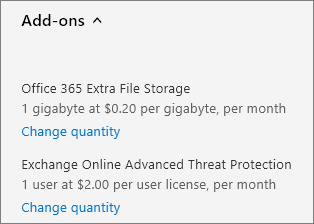

# Comprar ou editar um complemento do Office 365 para empresas

Várias dos planos do Office 365 para empresas possuem complementos que você pode comprar para sua assinatura. Um complemento fornece funcionalidade adicional para a assinatura para a qual você o comprou.

::: moniker range="o365-worldwide"

> [!NOTE]
> Se não estiver usando o novo centro de administração do Microsoft 365, você poderá ativá-lo selecionando a alternância **Experimentar o novo centro de administração** localizado na parte superior da Home Page.

::: moniker-end 

## Comprar um complemento

::: moniker range="o365-worldwide"

1. No centro de administração, vá para a página <a href="https://go.microsoft.com/fwlink/p/?linkid=868433" target="_blank">serviços de compra</a> de **cobrança** \> .

2. Na parte inferior da página de **serviços de compra** , selecione **Complementos**.

3. Na página **comprar serviços** , selecione a assinatura complementar que você deseja comprar.

4. Insira o número de licenças necessárias e escolha se deseja pagar a cada mês ou pelo ano inteiro. Escolha se você deseja atribuir licenças automaticamente a todos que não têm licença no momento. Se mostrado, selecione uma assinatura base.

5. Selecione **fazer check-out agora**.

6. Revise as informações de precificação e, em seguida, selecione **Avançar**.

7. Forneça suas informações de pagamento e, em seguida, selecione **fazer pedido** \> **ir para a página inicial do administrador**.

::: moniker-end

::: moniker range="o365-germany"

1. No centro de administração, vá para a página **Cobrança** \> <a href="https://go.microsoft.com/fwlink/p/?linkid=847745" target="_blank">Assinaturas</a>.

2. Na página **assinaturas** , selecione a assinatura para a qual você deseja comprar um complemento.

3. No canto inferior esquerdo dos detalhes da assinatura **, selecione** \> Complementos **comprar Complementos**..

    
  
4. Na página **serviços de compra** , passe o mouse ou toque na assinatura complementar que você deseja comprar e selecione **comprar agora**.

5. Insira o número de licenças necessárias e escolha se deseja pagar a cada mês ou pelo ano inteiro. Escolha se você deseja atribuir licenças automaticamente a todos que não têm licença no momento. Se mostrado, selecione uma assinatura base.

6. Selecione **fazer check-out agora**.

7. Revise as informações de preços e selecione **Avançar**.

8. Forneça suas informações de pagamento e, em seguida, selecione **fazer pedido** \> **ir para a página inicial do administrador**.

::: moniker-end

::: moniker range="o365-21vianet"

1. No centro de administração, vá para a página **Cobrança** \> <a href="https://go.microsoft.com/fwlink/p/?linkid=850626" target="_blank">Assinaturas</a>.

2. Na página **assinaturas** , selecione a assinatura para a qual você deseja comprar um complemento.

3. No canto inferior esquerdo dos detalhes da assinatura **, selecione** \> Complementos **comprar Complementos**..

    
  
4. Na página **serviços de compra** , passe o mouse ou toque na assinatura complementar que você deseja comprar e selecione **comprar agora**.

5. Insira o número de licenças necessárias e escolha se deseja pagar a cada mês ou pelo ano inteiro. Escolha se você deseja atribuir licenças automaticamente a todos que não têm licença no momento. Se mostrado, selecione uma assinatura base.

6. Selecione **fazer check-out agora**.

7. Revise as informações de preços e selecione **Avançar**.

8. Forneça suas informações de pagamento e, em seguida, selecione **fazer pedido** \> **ir para a página inicial do administrador**.

::: moniker-end

## Atualizar um complemento

As etapas que você usa para atualizar um complemento dependem se o complemento é um complemento tradicional ou um complemento autônomo. 

Os *Complementos tradicionais* são vinculados a uma assinatura específica. Se você cancelar a assinatura, o complemento associado também será cancelado.
  
Complementos *autônomos* não estão vinculados a uma assinatura específica. Os complementos autônomos aparecem como uma assinatura separada na página **assinaturas** (ou na página **produtos & serviços** no novo centro de administração) e têm sua própria data de expiração. Você gerencia um complemento autônomo da mesma maneira que você gerencia qualquer outra assinatura.
  
### Atualizar um complemento tradicional

::: moniker range="o365-worldwide"

1. No centro de administração, vá para a página **Cobrança** \> <a href="https://go.microsoft.com/fwlink/p/?linkid=842054" target="_blank">Produtos e serviços</a>.

2. Na página **produtos & serviços** , selecione a assinatura para a qual você deseja atualizar um complemento.

3. Selecione **Complementos**. Os complementos que você comprou são mostrados.

4. Selecione a **quantidade de alteração** do complemento que você deseja alterar.

5. Insira a alteração de quantidade que você deseja para a assinatura e, em seguida, selecione **Enviar alteração**.

::: moniker-end

::: moniker range="o365-germany"

1. No centro de administração, vá para a página **Cobrança** \> <a href="https://go.microsoft.com/fwlink/p/?linkid=847745" target="_blank">Assinaturas</a>.

2. Na página **assinaturas** , selecione a assinatura para a qual você deseja atualizar um complemento.

3. Selecione **Complementos**.

    Os complementos adquiridos são mostrados e cada um dos complementos terá um link de **Alterar a quantidade** abaixo dele.

4. Selecione o link **Alterar quantidade** para o complemento que você deseja atualizar. 

    
  
5. Insira o número de licenças de usuário necessárias na caixa e selecione **Enviar**.

    > [!TIP]
    > Você também pode usar a seta para cima e a seta para baixo para alterar a quantidade de licenças de usuário ou inserir apenas o número desejado na caixa.
  
    

::: moniker-end

::: moniker range="o365-21vianet"

1. No centro de administração, vá para a página **Cobrança** \> <a href="https://go.microsoft.com/fwlink/p/?linkid=850626" target="_blank">Assinaturas</a>.

2. Na página **assinaturas** , selecione a assinatura para a qual você deseja atualizar um complemento.

3. Selecione **Complementos**.

    Os complementos adquiridos são mostrados e cada um dos complementos terá um link de **Alterar a quantidade** abaixo dele.

4. Selecione o link **Alterar quantidade** para o complemento que você deseja atualizar. 

    
  
5. Insira o número de licenças de usuário necessárias na caixa e selecione **Enviar**.

    > [!TIP]
    > Você também pode usar a seta para cima e a seta para baixo para alterar a quantidade de licenças de usuário ou inserir apenas o número desejado na caixa.
  
    

::: moniker-end

### Atualizar um complemento autônomo

::: moniker range="o365-worldwide"

1. No centro de administração, vá para a página **Cobrança** \> <a href="https://go.microsoft.com/fwlink/p/?linkid=842054" target="_blank">Produtos e serviços</a>.

2. Na página **produtos & serviços** , selecione a assinatura complementar que você deseja atualizar e selecione **Adicionar/remover licenças**.

3. Insira o número de licenças necessárias na caixa e selecione **Enviar alteração**.

::: moniker-end

::: moniker range="o365-germany"

1. No centro de administração, vá para a página **Cobrança** \> <a href="https://go.microsoft.com/fwlink/p/?linkid=847745" target="_blank">Assinaturas</a>.

2. Na página **assinaturas** , selecione a assinatura complementar que você deseja atualizar e, em seguida, selecione **Adicionar/remover licenças**.

3. Insira o número de licenças que você precisa na caixa e selecione **Enviar**.

    > [!TIP]
    > Você também pode usar as setas para cima e para baixo para alterar a quantidade de licenças ou apenas inserir o número desejado na caixa.
  
    

::: moniker-end

::: moniker range="o365-21vianet"

1. No centro de administração, vá para a página **Cobrança** \> <a href="https://go.microsoft.com/fwlink/p/?linkid=850626" target="_blank">Assinaturas</a>.

2. Na página **assinaturas** , selecione a assinatura complementar que você deseja atualizar e, em seguida, selecione **Adicionar/remover licenças**.

3. Insira o número de licenças que você precisa na caixa e selecione **Enviar**.

    > [!TIP]
    > Você também pode usar as setas para cima e para baixo para alterar a quantidade de licenças ou apenas inserir o número desejado na caixa.
  
    

::: moniker-end

## Remover um complemento

Você pode cancelar um complemento autônomo da mesma forma que [cancela uma assinatura](subscriptions/cancel-your-subscription.md). Ou você pode definir a **cobrança recorrente** como desativada para um complemento autônomo usando as etapas acima. No entanto, não é possível remover um complemento tradicional após ele ter sido comprado. Se você precisar remover um complemento tradicional, [entre em contato com o suporte para obter ajuda](../admin/contact-support-for-business-products.md).
  
## Complementos disponíveis

A tabela a seguir lista complementos que estão disponíveis para edições diferentes do Office 365 para empresas.
  
Para saber mais sobre complementos do Skype for Business, veja [Licenciamento do complemento do Skype for Business e do Microsoft Teams](https://docs.microsoft.com/SkypeForBusiness/skype-for-business-and-microsoft-teams-add-on-licensing/skype-for-business-and-microsoft-teams-add-on-licensing).
  
****

|**Complemento**|**Disponível nessas assinaturas**|
|:-----|:-----|
|Sistema de Proteção de Dados do Cliente    | Office 365 Enterprise E1     Office 365 Enterprise E3     Office 365 Enterprise E4    |
|[Proteção avançada contra ameaças do Office 365 online](https://go.microsoft.com/fwlink/p/?LinkId=691156)   | Office 365 Enterprise E1     Office 365 Enterprise E3     Office 365 Enterprise E4    |
|[Arquivamento do Exchange Online](https://go.microsoft.com/fwlink/p/?LinkId=691157)   | Office 365 Business Essentials     Office 365 Business Premium     Office 365 Enterprise E1     Office 365 Enterprise F1    |
|Microsoft MyAnalytics    | Office 365 Enterprise E1     Office 365 Enterprise E3     Office 365 Enterprise E4    |
|Conformidade Avançada do Office 365    | Office 365 Enterprise E1     Office 365 Enterprise E3     Office 365 Enterprise E4    |
|Espaço de Armazenamento Adicional do Office 365    | Office 365 Business     Office 365 Business Essentials     Office 365 Business Premium     Office 365 Enterprise E1     Office 365 Enterprise E2     Office 365 Enterprise E3     Office 365 Enterprise E4     Office 365 Enterprise E5     Office para a Web com o SharePoint plano 1     Office para a Web com o SharePoint Plan 2     SharePoint Online Plano 1     SharePoint Online Plano 2    |
|Sistema de Telefonia no Office 365    | Office 365 Enterprise E1     Office 365 Enterprise E3     Office 365 Enterprise E4     Office 365 Enterprise E5    |
|Audioconferência no Office 365    |  Office 365 Business Essentials   Office 365 Business Premium   Office 365 Enterprise E1   Office 365 Enterprise E3   Office 365 Enterprise E4   Office 365 Enterprise E5 sem Audioconferência   Microsoft 365 Business   Microsoft 365 E3   Microsoft 365 E5    |
|Créditos de Comunicação no Office 365    | Office 365 Enterprise E5    |
|Plano de Chamadas Domésticas no Office 365    | Office 365 Enterprise E5    |
|Plano de Chamadas Internacionais no Office 365    | Office 365 Enterprise E5    |
  
## Artigos relacionados

[Adicionar espaço de armazenamento para sua assinatura](add-storage-space.md)
