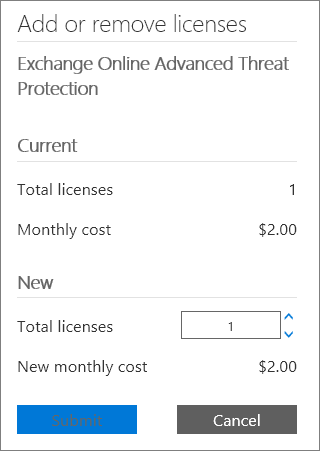

# Comprar ou editar um complemento do Office 365 para empresasBuy or edit an add-on for Office 365 for business

Várias dos planos do Office 365 para empresas possuem complementos que você pode comprar para sua assinatura. Um complemento fornece funcionalidade adicional para a assinatura para a qual você o comprou.Several of the Office 365 for business plans have add-ons that you can buy for your subscription. An add-on provides additional functionality to the subscription that you buy it for.

## Comprar um complementoBuy an add-on

::: moniker range="o365-worldwide"

1. No centro de administração, vá para a página <a href="https://go.microsoft.com/fwlink/p/?linkid=868433" target="_blank">serviços de compra</a> de **cobrança** \> .In the admin center, go to the **Billing** \> <a href="https://go.microsoft.com/fwlink/p/?linkid=868433" target="_blank">Purchase services</a> page.

2. Na parte inferior da página de **serviços de compra** , selecione **Complementos**.At the bottom of the **Purchase services** page, select **Add-ons**.

3. Na página **comprar serviços** , selecione a assinatura complementar que você deseja comprar.On the **Purchase services** page, select the add-on subscription that you want to buy.

4. Insira o número de licenças necessárias e escolha se deseja pagar a cada mês ou pelo ano inteiro.Enter the number of licenses that you need, and choose whether to pay each month or for the whole year. Escolha se você deseja atribuir licenças automaticamente a todos que não têm licença no momento.Choose whether you want to automatically assign licenses to everyone who does not currently have a license. Se mostrado, selecione uma assinatura base.If shown, select a base subscription.

5. Selecione **fazer check-out agora**.Select **Check out now**.

6. Revise as informações de precificação e, em seguida, selecione **Avançar**.Review the pricing information, then select **Next**.

7. Forneça suas informações de pagamento e, em seguida, selecione **fazer pedido** \> **ir para a página inicial do administrador**.Provide your payment information, and then select **Place order** \> **Go to Admin Home**.

::: moniker-end

::: moniker range="o365-germany"

1. No centro de administração, vá para a página **Cobrança** \> <a href="https://go.microsoft.com/fwlink/p/?linkid=847745" target="_blank">Assinaturas</a>.In the admin center, go to the **Billing** \> <a href="https://go.microsoft.com/fwlink/p/?linkid=847745" target="_blank">Subscriptions</a> page.

2. Na página **assinaturas** , selecione a assinatura para a qual você deseja comprar um complemento.On the **Subscriptions** page, select the subscription for which you want to buy an add-on.

3. No canto inferior esquerdo dos detalhes da assinatura **, selecione** \> Complementos **comprar Complementos**..On the bottom-left corner of the subscription details, select **Add-ons** \> **Buy add-ons**.

    
  
4. Na página **serviços de compra** , passe o mouse ou toque na assinatura complementar que você deseja comprar e selecione **comprar agora**.On the **Purchase services** page, mouse over or tap the add-on subscription that you want to buy, and then select **Buy now**.

5. Insira o número de licenças necessárias e escolha se deseja pagar a cada mês ou pelo ano inteiro.Enter the number of licenses that you need, and choose whether to pay each month or for the whole year. Escolha se você deseja atribuir licenças automaticamente a todos que não têm licença no momento.Choose whether you want to automatically assign licenses to everyone who does not currently have a license. Se mostrado, selecione uma assinatura base.If shown, select a base subscription.

6. Selecione **fazer check-out agora**.Select **Check out now**.

7. Revise as informações de preços e selecione **Avançar**.Review the pricing information, and then select **Next**.

8. Forneça suas informações de pagamento e, em seguida, selecione **fazer pedido** \> **ir para a página inicial do administrador**.Provide your payment information, and then select **Place order** \> **Go to Admin Home**.

::: moniker-end

::: moniker range="o365-21vianet"

1. No centro de administração, vá para a página **Cobrança** \> <a href="https://go.microsoft.com/fwlink/p/?linkid=850626" target="_blank">Assinaturas</a>.In the admin center, go to the **Billing** \> <a href="https://go.microsoft.com/fwlink/p/?linkid=850626" target="_blank">Subscriptions</a> page.

2. Na página **assinaturas** , selecione a assinatura para a qual você deseja comprar um complemento.On the **Subscriptions** page, select the subscription for which you want to buy an add-on.

3. No canto inferior esquerdo dos detalhes da assinatura **, selecione** \> Complementos **comprar Complementos**..On the bottom-left corner of the subscription details, select **Add-ons** \> **Buy add-ons**.

    
  
4. Na página **serviços de compra** , passe o mouse ou toque na assinatura complementar que você deseja comprar e selecione **comprar agora**.On the **Purchase services** page, mouse over or tap the add-on subscription that you want to buy, and then select **Buy now**.

5. Insira o número de licenças necessárias e escolha se deseja pagar a cada mês ou pelo ano inteiro.Enter the number of licenses that you need, and choose whether to pay each month or for the whole year. Escolha se você deseja atribuir licenças automaticamente a todos que não têm licença no momento.Choose whether you want to automatically assign licenses to everyone who does not currently have a license. Se mostrado, selecione uma assinatura base.If shown, select a base subscription.

6. Selecione **fazer check-out agora**.Select **Check out now**.

7. Revise as informações de preços e selecione **Avançar**.Review the pricing information, and then select **Next**.

8. Forneça suas informações de pagamento e, em seguida, selecione **fazer pedido** \> **ir para a página inicial do administrador**.Provide your payment information, and then select **Place order** \> **Go to Admin Home**.

::: moniker-end

## Atualizar um complementoUpdate an add-on

As etapas que você usa para atualizar um complemento dependem se o complemento é um complemento tradicional ou um complemento autônomo.The steps that you use to update an add-on depend on whether the add-on is a traditional add-on, or a standalone add-on.

Os *Complementos tradicionais* são vinculados a uma assinatura específica.*Traditional add-ons* are linked to a specific subscription. Se você cancelar a assinatura, o complemento associado também será cancelado.If you cancel the subscription, the associated add-on is also cancelled.
  
Complementos *autônomos* não estão vinculados a uma assinatura específica.*Standalone add-ons* are not linked to a specific subscription. Os complementos autônomos aparecem como uma assinatura separada na página **produtos & serviços** e têm sua própria data de expiração.Standalone add-ons appear as a separate subscription on the **Products & services** page, and have their own expiration date. Você gerencia um complemento autônomo da mesma maneira que você gerencia qualquer outra assinatura.You manage a standalone add-on the same way that you manage any other subscription.
  
### Atualizar um complemento tradicionalUpdate a traditional add-on

::: moniker range="o365-worldwide"

1. No centro de administração, vá para a página **Cobrança** \> <a href="https://go.microsoft.com/fwlink/p/?linkid=842054" target="_blank">Produtos e serviços</a>.In the admin center, go to the **Billing** \> <a href="https://go.microsoft.com/fwlink/p/?linkid=842054" target="_blank">Products & services</a> page.

2. Na página **produtos & serviços** , selecione a assinatura para a qual você deseja atualizar um complemento.On the **Products & services** page, select the subscription for which you want to update an add-on.

3. Selecione **Complementos**.Select **Add-ons**. Os complementos que você comprou são mostrados.The add-ons that you have purchased are shown.

4. Selecione a **quantidade de alteração** do complemento que você deseja alterar.Select **Change quantity** for the add-on you want to change.

5. Insira a alteração de quantidade que você deseja para a assinatura e, em seguida, selecione **Enviar alteração**.Enter the quantity change you want for the subscription, then select **Submit change**.

::: moniker-end

::: moniker range="o365-germany"

1. No centro de administração, vá para a página **Cobrança** \> <a href="https://go.microsoft.com/fwlink/p/?linkid=847745" target="_blank">Assinaturas</a>.In the admin center, go to the **Billing** \> <a href="https://go.microsoft.com/fwlink/p/?linkid=847745" target="_blank">Subscriptions</a> page.

2. Na página **assinaturas** , selecione a assinatura para a qual você deseja atualizar um complemento.On the **Subscriptions** page, select the subscription for which you want to update an add-on.

3. Selecione **Complementos**.Select **Add-ons**.

    Os complementos adquiridos são mostrados e cada um dos complementos terá um link de **Alterar a quantidade** abaixo dele.The add-ons that you have purchased are shown and each of the add-ons will have a **Change quantity** link below it.

4. Selecione o link **Alterar quantidade** para o complemento que você deseja atualizar.Select the **Change quantity** link for the add-on that you want to update. 

    
  
5. Insira o número de licenças de usuário necessárias na caixa e selecione **Enviar**.Enter the number of user licenses that you need in the box, and then select **Submit**.

    > [!TIP]
    > Você também pode usar a seta para cima e a seta para baixo para alterar a quantidade de licenças de usuário ou inserir apenas o número desejado na caixa.You can also use the up-arrow and down-arrow to change the quantity of user licenses or just enter the number you want in the box.
  
    

::: moniker-end

::: moniker range="o365-21vianet"

1. No centro de administração, vá para a página **Cobrança** \> <a href="https://go.microsoft.com/fwlink/p/?linkid=850626" target="_blank">Assinaturas</a>.In the admin center, go to the **Billing** \> <a href="https://go.microsoft.com/fwlink/p/?linkid=850626" target="_blank">Subscriptions</a> page.

2. Na página **assinaturas** , selecione a assinatura para a qual você deseja atualizar um complemento.On the **Subscriptions** page, select the subscription for which you want to update an add-on.

3. Selecione **Complementos**.Select **Add-ons**.

    Os complementos adquiridos são mostrados e cada um dos complementos terá um link de **Alterar a quantidade** abaixo dele.The add-ons that you have purchased are shown and each of the add-ons will have a **Change quantity** link below it.

4. Selecione o link **Alterar quantidade** para o complemento que você deseja atualizar.Select the **Change quantity** link for the add-on that you want to update. 

    
  
5. Insira o número de licenças de usuário necessárias na caixa e selecione **Enviar**.Enter the number of user licenses that you need in the box, and then select **Submit**.

    > [!TIP]
    > Você também pode usar a seta para cima e a seta para baixo para alterar a quantidade de licenças de usuário ou inserir apenas o número desejado na caixa.You can also use the up-arrow and down-arrow to change the quantity of user licenses or just enter the number you want in the box.
  
    

::: moniker-end

### Atualizar um complemento autônomoUpdate a standalone add-on

::: moniker range="o365-worldwide"

1. No centro de administração, vá para a página **Cobrança** \> <a href="https://go.microsoft.com/fwlink/p/?linkid=842054" target="_blank">Produtos e serviços</a>.In the admin center, go to the **Billing** \> <a href="https://go.microsoft.com/fwlink/p/?linkid=842054" target="_blank">Products & services</a> page.

2. Na página **produtos & serviços** , selecione a assinatura complementar que você deseja atualizar e selecione **Adicionar/remover licenças**.On the **Products & services** page, select the add-on subscription that you want to update, and then select **Add/Remove licenses**.

3. Insira o número de licenças necessárias na caixa e selecione **Enviar alteração**.Enter the number of licenses that you need in the box, and then select **Submit change**.

::: moniker-end

::: moniker range="o365-germany"

1. No centro de administração, vá para a página **Cobrança** \> <a href="https://go.microsoft.com/fwlink/p/?linkid=847745" target="_blank">Assinaturas</a>.In the admin center, go to the **Billing** \> <a href="https://go.microsoft.com/fwlink/p/?linkid=847745" target="_blank">Subscriptions</a> page.

2. Na página **assinaturas** , selecione a assinatura complementar que você deseja atualizar e, em seguida, selecione **Adicionar/remover licenças**.On the **Subscriptions** page, select the add-on subscription that you want to update, and then select **Add/Remove licenses**.

3. Insira o número de licenças que você precisa na caixa e selecione **Enviar**.Enter the number of licenses that you need in the box, and then select **Submit**.

    > [!TIP]
    > Você também pode usar as setas para cima e para baixo para alterar a quantidade de licenças ou apenas inserir o número desejado na caixa.You can also use the up-arrow and down-arrow to change the quantity of licenses or just enter the number you want in the box.
  
    

::: moniker-end

::: moniker range="o365-21vianet"

1. No centro de administração, vá para a página **Cobrança** \> <a href="https://go.microsoft.com/fwlink/p/?linkid=850626" target="_blank">Assinaturas</a>.In the admin center, go to the **Billing** \> <a href="https://go.microsoft.com/fwlink/p/?linkid=850626" target="_blank">Subscriptions</a> page.

2. Na página **assinaturas** , selecione a assinatura complementar que você deseja atualizar e, em seguida, selecione **Adicionar/remover licenças**.On the **Subscriptions** page, select the add-on subscription that you want to update, and then select **Add/Remove licenses**.

3. Insira o número de licenças que você precisa na caixa e selecione **Enviar**.Enter the number of licenses that you need in the box, and then select **Submit**.

    > [!TIP]
    > Você também pode usar as setas para cima e para baixo para alterar a quantidade de licenças ou apenas inserir o número desejado na caixa.You can also use the up-arrow and down-arrow to change the quantity of licenses or just enter the number you want in the box.
  
    

::: moniker-end

## Remover um complementoRemove an add-on

Você pode cancelar um complemento autônomo da mesma forma que [cancela uma assinatura](subscriptions/cancel-your-subscription.md).You can cancel a standalone add-on the same way that you [cancel a subscription](subscriptions/cancel-your-subscription.md). Ou você pode definir a **cobrança recorrente** como desativada para um complemento autônomo usando as etapas acima.Or you can set **Recurring billing** to off for a standalone add-on by using the steps above. No entanto, não é possível remover um complemento tradicional após ele ter sido comprado.However, you cannot remove a traditional add-on after it's been bought. Se você precisar remover um complemento tradicional, [entre em contato com o suporte para obter ajuda](../admin/contact-support-for-business-products.md).If you need to remove a traditional add-on, please [contact support for help](../admin/contact-support-for-business-products.md).
  
## Complementos disponíveisAvailable add-ons

A tabela a seguir lista complementos que estão disponíveis para edições diferentes do Office 365 para empresas.The following table lists add-ons that are available for different editions of Office 365 for business.
  
Para saber mais sobre complementos do Skype for Business, veja [Licenciamento do complemento do Skype for Business e do Microsoft Teams](https://docs.microsoft.com/SkypeForBusiness/skype-for-business-and-microsoft-teams-add-on-licensing/skype-for-business-and-microsoft-teams-add-on-licensing).For information about Skype for Business add-ons, see [Skype for Business and Microsoft Teams add-on licensing](https://docs.microsoft.com/SkypeForBusiness/skype-for-business-and-microsoft-teams-add-on-licensing/skype-for-business-and-microsoft-teams-add-on-licensing).
  
|**Complemento****Add-on**|**Disponível nessas assinaturas****Available in these subscriptions**|
|:-----|:-----|
|Sistema de Proteção de Dados do ClienteCustomer Lockbox    | Office 365 Enterprise E1Office 365 Enterprise E1     Office 365 Enterprise E3Office 365 Enterprise E3     Office 365 Enterprise E4Office 365 Enterprise E4    |
|[Proteção avançada contra ameaças do Office 365 onlineOffice 365 Online Advanced Threat Protection](https://go.microsoft.com/fwlink/p/?LinkId=691156)   | Office 365 Enterprise E1Office 365 Enterprise E1     Office 365 Enterprise E3Office 365 Enterprise E3     Office 365 Enterprise E4Office 365 Enterprise E4    |
|[Arquivamento do Exchange OnlineExchange Online Archiving](https://go.microsoft.com/fwlink/p/?LinkId=691157)   | Office 365 Business EssentialsOffice 365 Business Essentials     Office 365 Business PremiumOffice 365 Business Premium     Office 365 Enterprise E1Office 365 Enterprise E1     Office 365 Enterprise F1Office 365 Enterprise F1    |
|Microsoft MyAnalyticsMicrosoft MyAnalytics    | Office 365 Enterprise E1Office 365 Enterprise E1     Office 365 Enterprise E3Office 365 Enterprise E3     Office 365 Enterprise E4Office 365 Enterprise E4    |
|Conformidade Avançada do Office 365Office 365 Advanced Compliance    | Office 365 Enterprise E1Office 365 Enterprise E1     Office 365 Enterprise E3Office 365 Enterprise E3     Office 365 Enterprise E4Office 365 Enterprise E4    |
|Espaço de Armazenamento Adicional do Office 365Office 365 Extra File Storage    | Office 365 BusinessOffice 365 Business     Office 365 Business EssentialsOffice 365 Business Essentials     Office 365 Business PremiumOffice 365 Business Premium     Office 365 Enterprise E1Office 365 Enterprise E1     Office 365 Enterprise E2Office 365 Enterprise E2     Office 365 Enterprise E3Office 365 Enterprise E3     Office 365 Enterprise E4Office 365 Enterprise E4     Office 365 Enterprise E5Office 365 Enterprise E5     Office para a Web com o SharePoint plano 1Office for the web with SharePoint Plan 1     Office para a Web com o SharePoint Plan 2Office for the web with SharePoint Plan 2     SharePoint Online Plano 1SharePoint Online Plan 1     SharePoint Online Plano 2SharePoint Online Plan 2    |
|Sistema de Telefonia no Office 365Phone System in Office 365    | Office 365 Enterprise E1Office 365 Enterprise E1     Office 365 Enterprise E3Office 365 Enterprise E3     Office 365 Enterprise E4Office 365 Enterprise E4     Office 365 Enterprise E5Office 365 Enterprise E5    |
|Audioconferência no Office 365Audio Conferencing in Office 365    |  Office 365 Business EssentialsOffice 365 Business Essentials   Office 365 Business PremiumOffice 365 Business Premium   Office 365 Enterprise E1Office 365 Enterprise E1   Office 365 Enterprise E3Office 365 Enterprise E3   Office 365 Enterprise E4Office 365 Enterprise E4   Office 365 Enterprise E5 sem AudioconferênciaOffice 365 Enterprise E5 without Audio Conferencing   Microsoft 365 BusinessMicrosoft 365 Business   Microsoft 365 E3Microsoft 365 E3   Microsoft 365 E5Microsoft 365 E5    |
|Créditos de Comunicação no Office 365Communications Credits in Office 365    | Office 365 Enterprise E5Office 365 Enterprise E5    |
|Plano de Chamadas Domésticas no Office 365Domestic Calling Plan in Office 365    | Office 365 Enterprise E5Office 365 Enterprise E5    |
|Plano de Chamadas Internacionais no Office 365International Calling Plan in Office 365    | Office 365 Enterprise E5Office 365 Enterprise E5    |
  
## Artigos relacionadosRelated articles

[Adicionar espaço de armazenamento para sua assinaturaAdd storage space for your subscription](add-storage-space.md)