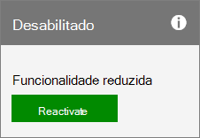

# Reativar sua assinatura

::: moniker range="o365-21vianet"

> [!NOTE]
> O centro de administração está mudando. Se a sua experiência não corresponder aos detalhes apresentados aqui, consulte [Sobre o novo centro de administração do Microsoft 365](https://docs.microsoft.com/microsoft-365/admin/microsoft-365-admin-center-preview?view=o365-21vianet&preserve-view=true).

::: moniker-end

Você pode reativar sua assinatura no centro de administração se: a assinatura expirou, foi desabilitada pela Microsoft ou se você a cancelou no meio de um termo de assinatura.
  
## Antes de começar

Você deve ser um administrador global ou de cobrança para reativar uma assinatura. Para obter mais informações, confira o artigo [Sobre funções de administrador](../../admin/add-users/about-admin-roles.md).

**Não é um administrador?** Entre em contato com sua administração para reativar sua assinatura.

## Reativar uma assinatura

::: moniker range="o365-worldwide"

1. No centro de administração, vá para a página **Cobrança** \> <a href="https://go.microsoft.com/fwlink/p/?linkid=842054" target="_blank">Seus produtos</a>.
2. Na página **Produtos**, encontre a assinatura que quer reativar. Selecione **Mais ações** (três pontos) e, em **seguida, selecione Reativar esta assinatura.\**
    Se você não vir **Reativar essa assinatura,** entre em contato [com o suporte.](../../admin/contact-support-for-business-products.md)
3. No painel **Reativar esta assinatura**, selecione um método de pagamento na lista suspensa ou selecione **Adicionar método de pagamento**.
4. Selecione **Salvar**.

::: moniker-end

::: moniker range="o365-germany"
  
1. No centro de administração, vá para a página **Cobrança** \> <a href="https://go.microsoft.com/fwlink/p/?linkid=847745" target="_blank">Assinaturas</a>.

2. Encontre a assinatura que você deseja reativar e selecione **Reativar.**

    
  
    Se você não vir **Reativar** como uma ação disponível, ligue para o [Suporte](../../admin/contact-support-for-business-products.md) para reativar sua assinatura.

3. Insira seus detalhes de pagamento. Você pode atualizar suas informações de pagamento existentes aqui.

   Se sua assinatura tiver expirado, depois que você enviar os detalhes de  pagamento, ela retornará a um estado ativo e a próxima data de cobrança se estenderá por um mês ou um ano, dependendo do seu compromisso de assinatura atual. Se você pagar com cartão de crédito ou conta bancária, seu cartão de crédito ou conta será cobrado pelo ramal. Se pagar por fatura, você verá a extensão refletida em sua próxima fatura. Para garantir que sua assinatura não expire novamente, [a adição de cobrança recorrente.](renew-your-subscription.md#turn-recurring-billing-off-or-on)

   > [!NOTE]
   > A capacidade de pagar por conta bancária não está disponível em alguns países ou regiões.
  
   Se sua assinatura foi cancelada ou foi desabilitada porque um pagamento não foi  recebido, ela retorna a um estado ativo e a data de cobrança Próxima permanece a mesma.

::: moniker-end

::: moniker range="o365-21vianet"
  
1. No centro de administração, vá para a página **Cobrança** \> <a href="https://go.microsoft.com/fwlink/p/?linkid=850626" target="_blank">Assinaturas</a>.

2. Encontre a assinatura que você deseja reativar e selecione **Reativar.**

    
  
    Se você não vir **Reativar** como uma ação disponível, ligue para o [Suporte](../../admin/contact-support-for-business-products.md) para reativar sua assinatura.

3. Insira seus detalhes de pagamento. Você pode atualizar suas informações de pagamento existentes aqui.

   Se sua assinatura tiver expirado, depois que você enviar os detalhes de  pagamento, ela retornará a um estado ativo e a próxima data de cobrança se estenderá por um mês ou um ano, dependendo do seu compromisso de assinatura atual. Se você pagar com cartão de crédito ou conta bancária, seu cartão de crédito ou conta será cobrado pelo ramal. Se pagar por fatura, você verá a extensão refletida em sua próxima fatura. Para garantir que sua assinatura não expire novamente, [a adição de cobrança recorrente.](renew-your-subscription.md#turn-recurring-billing-off-or-on)

   > [!NOTE]
   > A capacidade de pagar por conta bancária não está disponível em alguns países ou regiões.
  
   Se sua assinatura foi cancelada ou foi desabilitada porque um pagamento não foi  recebido, ela retorna a um estado ativo e a data de cobrança Próxima permanece a mesma.

::: moniker-end

## Conteúdo relacionado

[Experimente ou compre uma assinatura do Microsoft 365 para empresas](../try-or-buy-microsoft-365.md) (artigo)\
[Renovar o Microsoft 365 para empresas](renew-your-subscription.md) (artigo)\
[Cancelar sua assinatura](cancel-your-subscription.md) (artigo)
