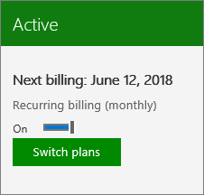

# Renove o Microsoft 365 para empresasRenew Microsoft 365 for business

::: moniker range="o365-21vianet"

> [!NOTE]
> O centro de administração está mudando.The admin center is changing. Se a sua experiência não corresponder aos detalhes apresentados aqui, consulte [Sobre o novo centro de administração do Microsoft 365](https://docs.microsoft.com/microsoft-365/admin/microsoft-365-admin-center-preview?view=o365-21vianet&preserve-view=true).If your experience doesn't match the details presented here, see [About the new Microsoft 365 admin center](https://docs.microsoft.com/microsoft-365/admin/microsoft-365-admin-center-preview?view=o365-21vianet&preserve-view=true).

::: moniker-end

Esse artigo se aplica à maioria das assinaturas do Microsoft 365 para empresas.This article applies to most paid Microsoft 365 for business subscriptions.
  
Para renovar usando uma chave do produto comprada em um varejista ou em um parceiro da Microsoft, confira [Encontrar e inserir a chave do produto](../enter-your-product-key.md).To renew by using a product key that you bought from a retail store or Microsoft partner, see [Find and enter your product key](../enter-your-product-key.md).

> [!NOTE]
> O pagamento por meio de conta bancária não está disponível em alguns países ou regiões.Paying by bank account isn't available in some countries or regions.
  
## Ativar ou desativar as cobranças recorrentesTurn Recurring billing off or on

Se você pagar com um cartão de crédito ou uma conta bancária, a **Cobrança recorrente** será ativada por padrão.If you pay by credit card or bank account, **Recurring billing** is turned on by default. Quando a **cobrança recorrente** está ativada, sua assinatura continua a ser cobrada por ano, no dia em que você se inscreveu.When **Recurring billing** is on, your subscription will continue to be billed each year on the day you subscribed. Você pode desativar ou ativar essa opção novamente no centro de administração se sua assinatura estiver ativa.You can turn it off or back on again in the admin center if your subscription is active.
  
Se sua assinatura for pré-paga com uma chave do produto, ela expirará no final do período da assinatura.If you prepaid for your subscription with a product key, your subscription will expire at the end of subscription term. Você pode ativar a **Cobrança recorrente** e fornecer informações do cartão de crédito ou da conta bancária para que sua assinatura seja cobrada anualmente no dia que você se inscreveu.You can turn on **Recurring billing** and provide credit card or bank account information so that your subscription will continue to be billed every year on the day you subscribed. Você também tem a opção de pagar mensalmente ou pagar pelo ano inteiro.You also have the option to pay every month, or to pay for the entire year up front. Não haverá cobrança em seu cartão de crédito ou conta bancária até o período inicial da assinatura expirar.Your credit card or bank account will not be charged until your initial subscription term has expired.

::: moniker range="o365-worldwide"

1. No centro de administração, vá para a página **Cobrança** \> <a href="https://go.microsoft.com/fwlink/p/?linkid=842054" target="_blank">Seus produtos</a>.In the admin center, go to the **Billing** \> <a href="https://go.microsoft.com/fwlink/p/?linkid=842054" target="_blank">Your products</a> page.
2. Selecione a assinatura da qual você quer gerenciar a cobrança recorrente.Select the subscription for which you want to manage recurring billing.
3. Na página de detalhes da assinatura, em **Configurações de pagamento e assinatura**, selecione **Editar cobrança recorrente**.On the subscription details page, under **Subscription and payment settings**, select **Edit recurring billing**.
4. No painel **Editar definições de cobrança recorrente**, selecione **Ativado**, **Ativado, mas renove uma vez** ou **Desativar**.In the **Edit recurring billing settings** pane, select **On**, **On, but renew once**, or **Turn off**.
5. Selecione **Salvar**.Select **Save**.

    > [!NOTE]
    > - Você só pode alterar a configuração de **Cobrança recorrente** para assinaturas ativas.You can only change the **Recurring billing** setting for active subscriptions. Se a sua assinatura já tiver expirado ou se estiver desabilitada, será necessário [reativá-la](reactivate-your-subscription.md) antes que seja possível ativar ou desativar a **Cobrança recorrente**.If your subscription has already expired or is disabled, you will need to [reactivate it](reactivate-your-subscription.md) before you can turn **Recurring billing** on or off.
    > - Quando a **Cobrança recorrente** for desativada, a assinatura não será cancelada.When **Recurring billing** is turned off, the subscription isn't cancelled. Se desejar manter a assinatura ativa, você deverá pagar a fatura manualmente.If you want to keep the subscription active, you must pay the bill manually.
    > - Se você desativar a **Cobrança recorrente**, a assinatura permanecerá ativa até expirar.If you turn off **Recurring billing**, the subscription remains active until it expires. Você pode exibir a data de expiração na página de detalhes da assinatura na seção **Configurações de pagamento e assinatura**.You can view the expiration date on the subscription details page in the **Subscription and payment settings** section.
    > - Para saber como cancelar a assinatura imediatamente, consulte [Cancelar a minha assinatura](cancel-your-subscription.md).To learn how to cancel the subscription right away, see [Cancel my subscription](cancel-your-subscription.md).

::: moniker-end

::: moniker range="o365-germany"
  
1. No centro de administração, vá para a página **Cobrança** \> <a href="https://go.microsoft.com/fwlink/p/?linkid=847745" target="_blank">Assinaturas</a>.In the admin center, go to the **Billing** \> <a href="https://go.microsoft.com/fwlink/p/?linkid=847745" target="_blank">Subscriptions</a> page.

2. Escolha a assinatura da qual você quer gerenciar o faturamento recorrente.Choose the subscription for which you want to manage recurring billing.

3. Para ativar a **Cobrança recorrente**, alterne o botão de alternância para **Ativar**.To turn on **Recurring billing**, switch the toggle to **On**.

    
  
    Você pode desativar a **Cobrança recorrente**, alternando o botão de alternância para **Desativar**.You can turn off **Recurring billing** by switching the toggle to **Off**.

    > [!NOTE]
    > - Você só pode alterar a configuração de **Cobrança recorrente** para assinaturas ativas.You can only change the **Recurring billing** setting for active subscriptions. Se a sua assinatura já tiver expirado ou se estiver desabilitada, será necessário [reativá-la](reactivate-your-subscription.md) antes que seja possível ativar ou desativar a **Cobrança recorrente**.If your subscription has already expired or is disabled, you will need to [reactivate it](reactivate-your-subscription.md) before you can turn **Recurring billing** on or off.
    > - Quando a **Cobrança recorrente** for desativada, a assinatura não será cancelada imediatamente.When **Recurring billing** is turned off, the subscription isn't cancelled right away. Ela permanecerá ativa até expirar.It remains active until it expires. Você pode exibir a data de expiração no cartão de assinaturaYou can view the expiration date on the subscription card
    > - Para saber como cancelar a assinatura imediatamente, consulte [Cancelar a minha assinatura](cancel-your-subscription.md).To learn how to cancel the subscription right away, see [Cancel my subscription](cancel-your-subscription.md).

::: moniker-end

::: moniker range="o365-21vianet"
  
1. No centro de administração, vá para a página **Cobrança** \> <a href="https://go.microsoft.com/fwlink/p/?linkid=850626" target="_blank">Assinaturas</a>.In the admin center, go to the **Billing** \> <a href="https://go.microsoft.com/fwlink/p/?linkid=850626" target="_blank">Subscriptions</a> page.

2. Escolha a assinatura da qual você quer gerenciar o faturamento recorrente.Choose the subscription for which you want to manage recurring billing.

3. Para ativar a **Cobrança recorrente**, alterne o botão de alternância para **Ativar**.To turn on **Recurring billing**, switch the toggle to **On**.

    
  
    Você pode desativar a **Cobrança recorrente**, alternando o botão de alternância para **Desativar**.You can turn off **Recurring billing** by switching the toggle to **Off**.

    > [!NOTE]
    > - Você só pode alterar a configuração de **Cobrança recorrente** para assinaturas ativas.You can only change the **Recurring billing** setting for active subscriptions. Se a sua assinatura já tiver expirado ou se estiver desabilitada, será necessário [reativá-la](reactivate-your-subscription.md) antes que seja possível ativar ou desativar a **Cobrança recorrente**.If your subscription has already expired or is disabled, you will need to [reactivate it](reactivate-your-subscription.md) before you can turn **Recurring billing** on or off.
    > - Quando a **Cobrança recorrente** for desativada, a assinatura não será cancelada imediatamente.When **Recurring billing** is turned off, the subscription isn't cancelled right away. Ela permanecerá ativa até expirar.It remains active until it expires. Você pode exibir a data de expiração no cartão de assinatura.You can view the expiration date on the subscription card.
    > - Para saber como cancelar a assinatura imediatamente, consulte [Cancelar a minha assinatura](cancel-your-subscription.md).To learn how to cancel the subscription right away, see [Cancel my subscription](cancel-your-subscription.md).

::: moniker-end

## Artigos relacionadosRelated articles

[Reativar sua assinaturaReactivate your subscription](reactivate-your-subscription.md)
  
[O que acontecerá com os meus dados e com o meu acesso quando a assinatura terminar?What happens to my data and access when my subscription ends?](what-if-my-subscription-expires.md)

[Inserir a sua chave de produtoEnter your product key](../enter-your-product-key.md)
  
[Compre a versão de avaliação do Microsoft 365 para empresasBuy your trial version of Microsoft 365 for business](../buy-a-subscription-from-your-free-trial.md)
