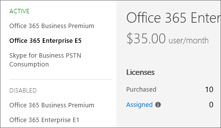

# Trocar os planos do Office 365 para negócios manualmente

::: moniker range="o365-worldwide"

> [!NOTE]
> Este artigo aplica-se ao centro de administração antigo. Para exibir o artigo sobre o novo centro de administração, confira [alterar planos manualmente](change-plans-manually.md). O novo centro de administração está disponível para todos os administradores do Microsoft 365. Para saber mais, confira [Sobre o novo centro de administração do Microsoft 365](../../admin/microsoft-365-admin-center-preview.md).

::: moniker-end

## Etapa 1: decidir como mudar de planos

A melhor maneira de mudar todos os usuários de um plano para outro é usar o [botão usar o switch de planos](switch-to-a-different-plan.md#use-the-switch-plans-button). Às vezes, isso não é possível. Em vez disso, faça um comutador manual:
  
- Se o botão **mudar de plano** não estiver lá.

- Se, quando você selecionar o botão **mudar** de plano, o plano que você deseja não estará listado.

- Se você não quiser mudar todos os seus usuários da mesma maneira. Algumas empresas precisam de diferentes usuários inscritos em diferentes planos. Use uma opção manual para isso.

Para continuar com uma opção manual, leia [a etapa 2: comprar uma nova assinatura](#step-2-buy-a-new-subscription) neste tópico.
  
## Etapa 2: comprar uma nova assinatura

 **Já comprou?** Se você já tem uma assinatura para a qual deseja mover os usuários, pule esta etapa e vá para a [etapa 3: Verifique sua nova assinatura e licenças](#step-3-check-your-new-subscription-and-licenses) neste tópico.
  
- Ou
  
 **Adquira uma nova assinatura e licenças:** Siga as etapas em [comprar outra assinatura do Office 365 for Business](../buy-another-subscription.md) para comprar uma nova assinatura.
  
Certifique-se de comprar uma assinatura para a mesma organização em que os usuários estão agora. Por exemplo, verifique os endereços de email dos usuários que você deseja mover. Se seus endereços de email incluírem @contoso. com, você deverá adquirir uma nova assinatura para o contoso.com. Inclua uma licença para cada usuário que você deseja mover.
  
 **Se você precisar de ajuda para escolher um plano**, confira a página [comparação de produtos do Office 365 for Business](https://go.microsoft.com/fwlink/p/?linkid=842056) ou [ligue para o suporte](../../admin/contact-support-for-business-products.md).
  
## Etapa 3: verificar sua nova assinatura e licenças

::: moniker range="o365-worldwide"

1. No centro de administração, vá para a página **Cobrança** \> <a href="https://go.microsoft.com/fwlink/p/?linkid=842054" target="_blank">Assinaturas</a>.

::: moniker-end

::: moniker range="o365-germany"

1. No centro de administração, vá para a página **Cobrança** > <a href="https://go.microsoft.com/fwlink/p/?linkid=847745" target="_blank">Assinaturas</a>.

::: moniker-end

::: moniker range="o365-21vianet"

1. No centro de administração, vá para a página **Cobrança** > <a href="https://go.microsoft.com/fwlink/p/?linkid=850626" target="_blank">Assinaturas</a>.

::: moniker-end

2. **Verificar se as duas assinaturas estão listadas e ativas**

    A assinatura da qual você está migrando usuários e a assinatura à qual você está movendo usuários devem estar listadas em conjunto. Se a nova assinatura não estiver quando você verificar pela primeira vez, tente novamente mais tarde. Verifique se ambas as assinaturas estão listadas em **ativo**. [A nova assinatura não está listada ou não está ativa](#the-new-subscription-isnt-listed-or-isnt-active).

   **A nova assinatura do Office 365 for Business com licenças disponíveis**

    
  
3. **Verifique se você tem licenças suficientes para cada usuário**

    Cada usuário precisa de uma licença que corresponda à sua assinatura. Portanto, se você quiser mover dez usuários para o Office 365 Enterprise e5, precisará certificar-se de que dez licenças estejam disponíveis. Na imagem aqui, dez licenças foram adquiridas para o Office 365 Enterprise E5 e todas as dez licenças estão disponíveis para atribuição.

4. **Precisa de mais licenças para a nova assinatura?** Vá para a página **assinaturas** e [compre licenças para sua assinatura do Office 365 para empresas](../licenses/buy-licenses.md).
  
    [E as licenças antigas?](#what-about-the-old-licenses)

### A nova assinatura não está listada ou não está ativa

- **Se você comprou uma assinatura por fatura** e uma verificação de crédito for necessária, pode levar até dois dias úteis antes que a assinatura esteja disponível.

- **Se você comprou duas assinaturas e elas não estão listadas aqui**, elas podem ter sido adquiridas para diferentes organizações (para diferentes domínios). As assinaturas não podem atravessar os limites da organização.

- **Se você souber que tem uma assinatura adicional**e ela não estiver listada aqui ou não estiver listada em **Active**, [Call Support](../../admin/contact-support-for-business-products.md).

### E as licenças antigas?

As licenças para a assinatura atual serão removidas mais tarde; Você só pagará pelas novas licenças de usuário de então em diante.
  
## Etapa 4: Reatribuir licenças

### Reatribuir uma licença para um usuário

::: moniker range="o365-worldwide"

1. No centro de administração, vá para a página **Usuários** \> <a href="https://go.microsoft.com/fwlink/p/?linkid=834822" target="_blank">Usuários ativos</a>.

::: moniker-end

::: moniker range="o365-germany"

1. No centro de administração, vá para a página **Usuários** > <a href="https://go.microsoft.com/fwlink/p/?linkid=847686" target="_blank">Usuários ativos</a>.

::: moniker-end

::: moniker range="o365-21vianet"

1. No centro de administração, vá para a página **Usuários** > <a href="https://go.microsoft.com/fwlink/p/?linkid=850628" target="_blank">Usuários ativos</a>.

::: moniker-end

2. Na página **usuários ativos** , selecione a caixa ao lado do nome do usuário ao qual você deseja atribuir uma licença.

3. No lado direito, na linha **licenças de produto** , selecione **Editar**.

4. No painel **licenças de produto** , alterne a opção para a posição **ativado** da licença que você deseja atribuir a este usuário. Por padrão, todos os serviços associados a essa licença são atribuídos automaticamente ao usuário.

    > [!TIP]
    > Para limitar quais serviços estão disponíveis para o usuário, alterne as opções para a posição **desativado** dos serviços que você deseja remover para esse usuário. Por exemplo, se você deseja que o usuário tenha acesso a todos os serviços disponíveis, exceto o Skype for Business Online, você pode alterar o recurso de alternância para o serviço Skype for Business online para a posição **desativado** .
  
    
  
5. Alterne a opção para a posição **desativado** para as licenças que este usuário não precisa mais.

6. Na parte inferior do painel **licenças de produto** , selecione **atribuir** \> **Close** \> fechar **fechar**.

### Reatribuir licenças para vários usuários de uma só vez

::: moniker range="o365-worldwide"

1. No centro de administração, vá para a página <a href="https://go.microsoft.com/fwlink/p/?linkid=834822" target="_blank">usuários ativos</a> ou selecione usuários **Users** \> **ativos**do usuário.

::: moniker-end

::: moniker range="o365-germany"

1. No centro de administração, vá para a página <a href="https://go.microsoft.com/fwlink/p/?linkid=847686" target="_blank">usuários ativos</a> do **usuário** > .

::: moniker-end

::: moniker range="o365-21vianet"

1. No centro de administração, vá para a página **Usuários** > <a href="https://go.microsoft.com/fwlink/p/?linkid=850628" target="_blank">Usuários ativos</a>.

::: moniker-end

2. Selecione as caixas ao lado dos nomes dos usuários de que você deseja substituir as licenças existentes.

3. No painel **Ações em massa**, escolha **Editar licenças de produto**.

4. No painel **Atribuir produtos**, selecione **Substituir atribuições de licença de produto existentes** \> **Avançar**.

5. Alterne o botão de alternância para a posição **ativado** dos produtos que você deseja atribuir a esses usuários.

    > [!TIP]
    > - Para limitar quais serviços estão disponíveis para o usuário, mude para alternar para a posição **desativado** dos serviços que você deseja remover para esse usuário. Por exemplo, se você deseja que o usuário tenha acesso a todos os serviços disponíveis, exceto o Skype for Business Online, você pode alterar o recurso de alternância para o serviço Skype for Business online para a posição **desativado** .
    > - Atribuições de licença para os usuários selecionados que tenham sido feitas anteriormente serão removidas.
  
    
  
6. Na parte inferior do painel **Substituir produtos existentes**, selecione **Substituir** \> **Fechar**.

## Etapa 5: cancelar assinaturas ou remover licenças que não são mais necessárias (opcional)

Se você moveu todos os usuários de uma assinatura para outra e não precisa mais da assinatura original, você pode [cancelar a assinatura](cancel-your-subscription.md).
  
Se você moveu apenas alguns usuários para uma assinatura diferente, [remova as licenças](../licenses/remove-licenses-from-subscription.md) que não são mais necessárias.
  
## Contate o suporte para ajudá-lo a trocar de plano

[Ligar para o suporte](../../admin/contact-support-for-business-products.md)