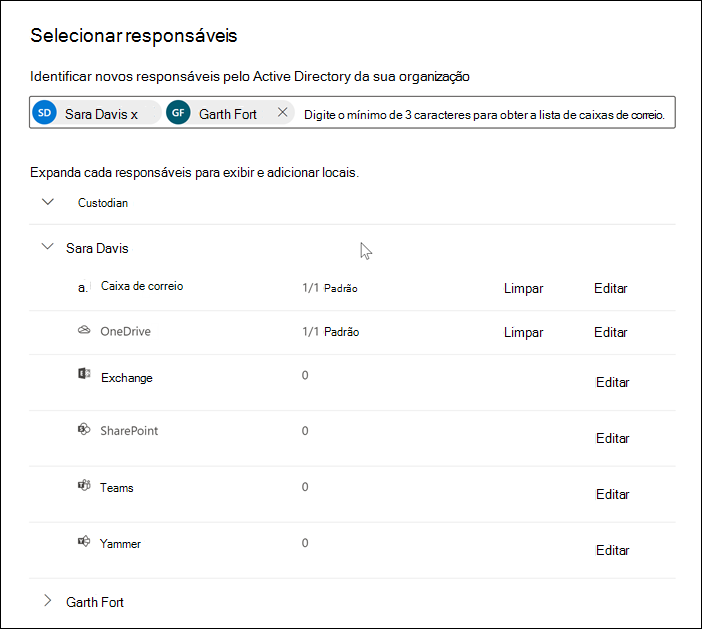
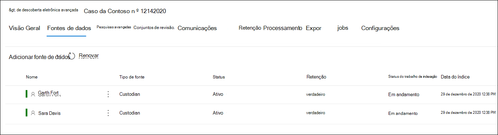

# Adicionar responsáveis a uma ocorrência de descoberta eletrônica avançadaAdd custodians to an Advanced eDiscovery case

Use a ferramenta interna de gerenciamento de responsáveis em descoberta eletrônica avançada para coordenar seus fluxos de trabalho em torno do gerenciamento de responsáveis e pela identificação de fontes de dados relevantes, custodial, associadas a um caso.Use the built-in custodian management tool in Advanced eDiscovery to coordinate your workflows around managing custodians and identifying relevant, custodial data sources associated with a case. Quando você adiciona um profissional, o sistema pode identificar e colocar automaticamente uma retenção em sua caixa de correio do Exchange e na conta do OneDrive for Business.When you add a custodian, the system can automatically identify and place a hold on their Exchange mailbox and OneDrive for Business account. Durante o processo de descoberta de sua investigação, você também pode identificar outras fontes de dados (como caixas de correio, sites ou equipes) que um acessado ou contribuíram.During the discovery process of your investigation, you might also identify other data sources (such as mailboxes, sites, or Teams) that a custodian accessed or contributed to. Nessa situação, você pode usar a ferramenta de gerenciamento de responsáveis para associar essas fontes de dados a um determinado funcionário.In this situation, you can use the custodian management tool to associate those data sources will a specific custodian. Depois de adicionar os responsáveis a um caso e associar outra fonte de dados a eles, você pode preservar rapidamente os dados e Pesquisar os dados do custodial.After you add custodians to a case and associate other data source with them, you can quickly preserve data and search the custodial data.

Você pode adicionar e gerenciar os responsáveis em casos de descoberta eletrônica avançada em quatro etapas:You can add and manage custodians in Advanced eDiscovery cases in four steps:

1. Identificar os responsáveis.Identify the custodians.

2. Escolha os locais de dados dos responsáveis.Choose custodian data locations.

3. Definir configurações de retenção.Configure hold settings.

4. Revise os responsáveis e conclua o processo.Review the custodians and complete the process.

   [ de descoberta eletrônica avançada](../media/AeD-Sources-Tab.png#lightbox)

## Verifique se você tem as permissões necessáriasMake sure you have the necessary permissions

Para adicionar os responsáveis a um caso, você deve ser membro do grupo de função Gerenciador de descoberta eletrônica.To add custodians to a case, you must be a member of the eDiscovery Manager role group. Isso fornece as permissões necessárias para adicionar os responsáveis a um caso e colocar uma retenção nas fontes de dados do custodial.This provides you with the necessary permissions to add custodians to a case and place a hold on the custodial data sources. Para obter mais informações, confira [Atribuir permissões de descoberta eletrônica](get-started-with-advanced-ediscovery.md#step-2-assign-ediscovery-permissions).For more information, see [Assign eDiscovery permissions](get-started-with-advanced-ediscovery.md#step-2-assign-ediscovery-permissions).

## Etapa 1: identificar os responsáveisStep 1: Identify custodians

1. Vá para [https://compliance.microsoft.com](https://compliance.microsoft.com) e entre com uma conta de usuário que tenha recebido as permissões de descoberta eletrônica apropriadas.Go to [https://compliance.microsoft.com](https://compliance.microsoft.com) and sign in with a user account that has been assigned the appropriate eDiscovery permissions.

2. No painel de navegação esquerdo do centro de conformidade da Microsoft 365, clique em **Mostrar tudo** e, em seguida, clique em **descoberta eletrônica > avançado**.In the left navigation pane of the Microsoft 365 compliance center, click **Show all**, and then click **eDiscovery > Advanced**.

3. Na página **descoberta eletrônica avançada** , clique na guia **ocorrências** e, em seguida, selecione o caso para o qual você deseja adicionar os responsáveis.On the **Advanced eDiscovery** page, click the **Cases** tab, and then select the case that you want to add custodians to.

4. Clique na guia **fontes de dados** e, em seguida, clique em **Adicionar fonte de dados**  >  **Adicionar novos responsáveis**.Click the **Data sources** tab and then click **Add data source** > **Add new custodians**.

5. Adicione um ou mais usuários em sua organização como responsáveis pelo caso digitando a primeira parte do nome ou alias de uma pessoa.Add one or more users in your organization as custodians to the case by typing the first part of a person's name or alias. Depois de encontrar a pessoa correta, selecione seu nome para adicioná-la à lista.After you find the correct person, select their name to add them to the list.

## Etapa 2: escolher locais de dados de responsáveisStep 2: Choose custodian data locations

Após selecionar os responsáveis, o sistema tentará automaticamente identificar e verificar esses usuários e suas fontes de dados.After you select custodians, the system automatically attempts to identify and verify these users and their data sources. Após adicionar os responsáveis à lista, a ferramenta inclui automaticamente a caixa de correio principal e a conta do OneDrive para cada um dos responsáveis.After adding custodians to the list, the tool automatically includes the primary mailbox and OneDrive account for each custodian. Você pode optar por não incluir essas fontes de dados ao adicionar os responsáveis à ocorrência.You can choose not to include these data sources when adding custodians to the case.

Além da conta de caixa de correio e do OneDrive de um funcionário, você também pode associar outros locais de dados a um funcionário, como o site do SharePoint ou uma equipe do Microsoft a quem é membro.In addition to a custodian's mailbox and OneDrive account, you can also associate other data locations to a custodian, such as SharePoint site or a Microsoft Team the custodian is a member of. Isso permite preservar, coletar, analisar e revisar o conteúdo em outras fontes de dados associadas aos responsáveis da ocorrência.This allows you to preserve, collect, analyze, and review content in other data sources associated with the custodians of the case.

Para desmarcar a caixa de correio principal e a conta do OneDrive para um responsáveis:To deselect the primary mailbox and OneDrive account for a custodian:

1. Expanda os responsáveis para exibir os locais de dados principais que foram associados automaticamente a cada um dos responsáveis.Expand the custodian to view the primary data locations that have been automatically associated to each custodian.

2. Selecione **limpar** ao lado de **caixa de correio** ou **onedrive** para remover a caixa de correio ou a conta do onedrive de um dos responsáveis de ser associada como um local de dados para esses responsáveis.Select **Clear** next to **Mailbox** or **OneDrive** to remove a custodian's mailbox or OneDrive account from being associated as a data location for this custodian.

   

Para associar outras caixas de correio, sites, equipes ou grupos do Yammer a um determinado funcionário:To associate other mailboxes, sites, Teams, or Yammer groups to a specific custodian:

1. Expanda um funcionário para exibir os seguintes serviços para associar locais de dados aos responsáveis.Expand a custodian to display the following services to associate data locations with the custodian. Clique em **Editar** ao lado de um serviço para adicionar um local de dados.Click **Edit** next to a service to add a data location.

   - **Exchange**: Use para associar outras caixas de correio aos responsáveis.**Exchange**: Use to associate other mailboxes to the custodian. Digite na caixa de pesquisa o nome ou alias (um mínimo de três caracteres) de caixas de correio de usuário ou grupos de distribuição.Type into the search box the name or alias (a minimum of three characters) of user mailboxes or distribution groups. Selecione as caixas de correio a serem atribuídas aos responsáveis e clique em **Adicionar**.Select the mailboxes to assign to the custodian and then click **Add**.

   - **SharePoint**: Use para associar sites do SharePoint aos responsáveis.**SharePoint**: Use to associate SharePoint sites to the custodian. Selecione um site na lista ou pesquise um site digitando uma URL na caixa de pesquisa.Select a site in the list or search for a site by typing a URL in the search box. Selecione os sites a serem atribuídos aos responsáveis e clique em **Adicionar**.Select the sites to assign to the custodian and then click **Add**.

   - **Teams**: Use para atribuir ao Microsoft Teams os responsáveis é membro do no momento.**Teams**: Use to assign the Microsoft Teams the custodian is currently a member of. Selecione as equipes que serão atribuídas aos responsáveis e clique em **Adicionar**.Select the teams to assign to the custodian and then click **Add**. Após adicionar uma equipe, o sistema identifica e localiza automaticamente o site do SharePoint e a caixa de correio de grupo associados a essa equipe e os atribui aos responsáveis.After you add a team, the system automatically identifies and locates the SharePoint site and group mailbox associated to that team and assigns them to the custodian.

   - **Yammer**: Use para atribuir os grupos do Yammer aos quais o responsáveis é membro no momento.**Yammer**:  Use to assign the Yammer groups the custodian is currently a member of. Selecione os grupos a serem atribuídos aos responsáveis e clique em **Adicionar**.Select the groups to assign to the custodian and then click **Add**. Após adicionar uma equipe, o sistema identifica e localiza automaticamente o site do SharePoint e a caixa de correio de grupo associados a esse grupo e os atribui aos responsáveis.After you add a team, the system automatically identifies and locates the SharePoint site and group mailbox associated to that group and assigns them to the custodian.

   > [!NOTE]
   > Você pode usar os seletores de local do **Exchange** e **do SharePoint** para associar outras equipes ou grupos do Yammer (que um funcionário não é membro de) a um funcionário.You can use the **Exchange** and **SharePoint** location pickers to associate other teams or Yammer groups (that a custodian is not a member of) to a custodian. Para fazer isso, você precisa adicionar a caixa de correio e o site associados a cada equipe ou grupo do Yammer.To do this, you have to add both the mailbox and site associated with each team or Yammer group.

2. Você pode exibir o número total de caixas de correio, sites, equipes e grupos do Yammer atribuídos a cada um deles expandindo cada um dos responsáveis na tabela.You can view the total number of mailboxes, sites, Teams, and Yammer groups assigned to each custodian by expanding each custodian in the table. Quando você tiver finalizado os locais de dados atribuídos para cada um dos responsáveis, essas associações serão mantidas e usadas durante os estágios de coleta, processamento e revisão no fluxo de trabalho de descoberta eletrônica avançada.When you've finalized the assigned data locations for each custodian, these associations will be maintained and used during the collection, processing, and review stages in the Advanced eDiscovery workflow.

3. Após adicionar os responsáveis e configurar seus locais de dados, clique em **Avançar** para ir para a página **configurações de retenção** .After adding custodians and configuring their data locations, click **Next** to go to the **Hold settings** page.  

## Etapa 3: definir as configurações de retençãoStep 3: Configure hold settings

 Depois de finalizar os responsáveis e seus locais de dados, você pode colocar alguns ou todos os responsáveis por retenção.After you've finalized the custodians and their data locations, you can place some or all of the custodians on hold. Quando você coloca um bloqueador, todo o conteúdo de todos os locais de conteúdo associados aos responsáveis é preservado até que você remova a retenção ou libere os responsáveis da retenção.When you place a custodian on hold, all content in all content locations that are associated with the custodian is preserved until you remove the hold or release the custodian from the hold. Em alguns casos, talvez você queira adicionar os responsáveis por um caso sem colocá-los em espera.In some cases, you may want to add custodians to a case without placing them on hold.

Para colocar os responsáveis e as fontes de dados em retenção:To place the custodians and data sources on hold:

1. Na página **configurações de retenção** , você pode aplicar uma retenção a responsáveis individuais marcando a caixa de seleção na coluna **isenção** .On the **Hold settings** page, you can apply a hold to individual custodians by selecting the checkbox under the **Hold** column.

   Como alternativa, você pode colocar todos os responsáveis por retenção, selecionando a caixa de seleção **reter** na parte superior da coluna.Alternatively, you can place all custodians on hold by selecting the **Hold** checkbox at the top of the column.

2. Verifique as seleções de retenção de responsáveis e clique em **Avançar**.Verify the custodian hold selections and then click **Next**.

   > [!NOTE]
   > Se você não colocar uma retenção em um local, os responsáveis e as fontes de dados associadas serão adicionados ao caso, mas o conteúdo dessas fontes de dados não será preservado pela retenção associada ao caso.If you don't place a hold on a custodian, the custodian and their associated data sources will be added to the case but the content in those data sources won't preserved by the hold that associated with the case.

## Etapa 4: revise os responsáveis e conclua o processoStep 4: Review the custodians and complete the process

Antes de realmente adicionar os responsáveis ao caso, você pode revisar a lista de responsáveis, os locais de dados atribuídos a eles e as configurações de retenção.Before you actually add the custodians to the case, you can review the list of custodians, the data locations assigned to them, and the hold settings.

1. Verifique e revise todas as configurações de fontes de dados e a configuração de retenção associada a cada um dos responsáveis na tabela.Verify and review all the data sources count and the hold setting associated with each custodian in the table. Se necessário, volte para a página **identificar responsáveis** ou **manter as configurações** para fazer qualquer alteração.If necessary, go back to the **Identify custodian** or **Hold settings** pages to make any changes.

2. Clique em **Enviar** para adicionar os responsáveis e seus locais de dados ao caso e aplicar todas as configurações de retenção do custodial.Click **Submit** to add custodians and their data locations to the case and apply all custodial hold settings.

   Os novos responsáveis são adicionados ao caso e exibidos na guia fontes de **dados** .The new custodians are added to the case and displayed on the **Data sources** tab.

   [ fontes de dados](../media/DataSourcesTab.png#lightbox)
