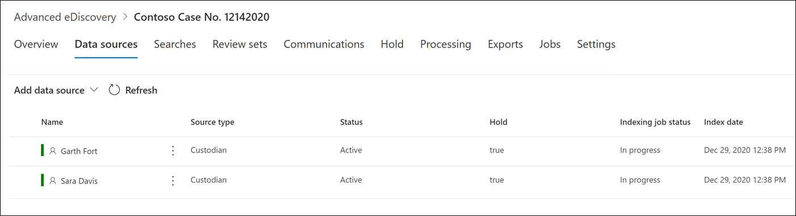

# Adicionar custodiantes a uma ocorrência de Descoberta AvançadaAdd custodians to an Advanced eDiscovery case

Use a ferramenta de gerenciamento custodiante integrado na Descoberta Avançada para coordenar seus fluxos de trabalho em torno do gerenciamento de custodiantes e identificação de fontes de dados custodiantes relevantes associadas a uma ocorrência.Use the built-in custodian management tool in Advanced eDiscovery to coordinate your workflows around managing custodians and identifying relevant, custodial data sources associated with a case. Quando você adiciona um custodiante, o sistema pode identificar e colocar em espera automaticamente a caixa de correio do Exchange e a conta do OneDrive for Business.When you add a custodian, the system can automatically identify and place a hold on their Exchange mailbox and OneDrive for Business account. Durante o processo de descoberta de sua investigação, você também pode identificar outras fontes de dados (como caixas de correio, sites ou Teams) para as quais um custodiante acessou ou contribuiu.During the discovery process of your investigation, you might also identify other data sources (such as mailboxes, sites, or Teams) that a custodian accessed or contributed to. Nessa situação, você pode usar a ferramenta de gerenciamento custodiante para associar essas fontes de dados a um custodiante específico.In this situation, you can use the custodian management tool to associate those data sources will a specific custodian. Depois de adicionar custodiantes a uma ocorrência e associar outra fonte de dados a eles, você pode rapidamente preservar dados e pesquisar os dados custodiantes.After you add custodians to a case and associate other data source with them, you can quickly preserve data and search the custodial data.

Você pode adicionar e gerenciar custodiantes em casos de Descoberta Avançada em quatro etapas:You can add and manage custodians in Advanced eDiscovery cases in four steps:

1. Identifique os custodiantes.Identify the custodians.

2. Escolha locais de dados custodiante.Choose custodian data locations.

3. Definir configurações de espera.Configure hold settings.

4. Revise os custodiantes e conclua o processo.Review the custodians and complete the process.

   

## Certifique-se de que você tenha as permissões necessáriasMake sure you have the necessary permissions

Para adicionar custodiantes a uma ocorrência, você deve ser um membro do grupo de função gerente de descoberta de ediscovery.To add custodians to a case, you must be a member of the eDiscovery Manager role group. Isso fornece as permissões necessárias para adicionar custodiantes a uma ocorrência e colocar em espera as fontes de dados custodial.This provides you with the necessary permissions to add custodians to a case and place a hold on the custodial data sources. Para obter mais informações, confira [Atribuir permissões de descoberta eletrônica](get-started-with-advanced-ediscovery.md#step-2-assign-ediscovery-permissions).For more information, see [Assign eDiscovery permissions](get-started-with-advanced-ediscovery.md#step-2-assign-ediscovery-permissions).

## Etapa 1: identificar os custodiantesStep 1: Identify custodians

1. Vá para [https://compliance.microsoft.com](https://compliance.microsoft.com) e entre com uma conta de usuário que recebeu as permissões apropriadas de Descoberta.Go to [https://compliance.microsoft.com](https://compliance.microsoft.com) and sign in with a user account that has been assigned the appropriate eDiscovery permissions.

2. No painel de navegação esquerdo do centro de conformidade do Microsoft 365, clique em Mostrar tudo e clique em Descoberta > **Avançado.**In the left navigation pane of the Microsoft 365 compliance center, click **Show all**, and then click **eDiscovery > Advanced**.

3. Na página **Descoberta Avançada, clique**  na guia Ocorrências e selecione a ocorrência à quais você deseja adicionar custodiantes.On the **Advanced eDiscovery** page, click the **Cases** tab, and then select the case that you want to add custodians to.

4. Clique na **guia Fontes de** dados e clique em Adicionar fonte de **dados** Adicionar  >  **novos custodiantes.**Click the **Data sources** tab and then click **Add data source** > **Add new custodians**.

5. Adicione um ou mais usuários em sua organização como custodiantes à ocorrência digitando a primeira parte do nome ou alias de uma pessoa.Add one or more users in your organization as custodians to the case by typing the first part of a person's name or alias. Depois de encontrar a pessoa correta, selecione seu nome para adicioná-la à lista.After you find the correct person, select their name to add them to the list.

## Etapa 2: Escolher locais de dados custodianteStep 2: Choose custodian data locations

Depois de selecionar os custodiantes, o sistema tentará identificar e verificar automaticamente esses usuários e suas fontes de dados.After you select custodians, the system automatically attempts to identify and verify these users and their data sources. Depois de adicionar custodiantes à lista, a ferramenta inclui automaticamente a caixa de correio principal e a conta do OneDrive para cada custodiante.After adding custodians to the list, the tool automatically includes the primary mailbox and OneDrive account for each custodian. Você pode optar por não incluir essas fontes de dados ao adicionar custodiantes à ocorrência.You can choose not to include these data sources when adding custodians to the case.

Além da caixa de correio de um responsável e da conta do OneDrive, você também pode associar outros locais de dados a um custodiante, como um site do SharePoint ou uma Equipe da Microsoft da qual o custodiante é membro.In addition to a custodian's mailbox and OneDrive account, you can also associate other data locations to a custodian, such as SharePoint site or a Microsoft Team the custodian is a member of. Isso permite preservar, coletar, analisar e revisar conteúdo em outras fontes de dados associadas aos custodiantes do caso.This allows you to preserve, collect, analyze, and review content in other data sources associated with the custodians of the case.

Para desmarcar a caixa de correio principal e a conta do OneDrive para um custodiatário:To deselect the primary mailbox and OneDrive account for a custodian:

1. Expanda o custodiante para exibir os locais de dados primários que foram associados automaticamente a cada custodiante.Expand the custodian to view the primary data locations that have been automatically associated to each custodian.

2. Selecione **Limpar ao** **lado** da Caixa de Correio ou do **OneDrive** para remover a caixa de correio de um responsável ou a conta do OneDrive de serem associadas como um local de dados para esse custodiante.Select **Clear** next to **Mailbox** or **OneDrive** to remove a custodian's mailbox or OneDrive account from being associated as a data location for this custodian.

   

Para associar outras caixas de correio, sites, equipes ou grupos do Yammer a um custodiante específico:To associate other mailboxes, sites, Teams, or Yammer groups to a specific custodian:

1. Expanda um custodiante para exibir os seguintes serviços para associar locais de dados ao custodiante.Expand a custodian to display the following services to associate data locations with the custodian. Clique **em Editar** ao lado de um serviço para adicionar um local de dados.Click **Edit** next to a service to add a data location.

   - **Exchange**: Use para associar outras caixas de correio ao custodiatário.**Exchange**: Use to associate other mailboxes to the custodian. Digite na caixa de pesquisa o nome ou alias (um mínimo de três caracteres) de caixas de correio de usuário ou grupos de distribuição.Type into the search box the name or alias (a minimum of three characters) of user mailboxes or distribution groups. Selecione as caixas de correio a atribuir ao custodiatário e clique em **Adicionar.**Select the mailboxes to assign to the custodian and then click **Add**.

   - **SharePoint**: use para associar sites do SharePoint ao custodiatário.**SharePoint**: Use to associate SharePoint sites to the custodian. Selecione um site na lista ou procure um site digitando uma URL na caixa de pesquisa.Select a site in the list or search for a site by typing a URL in the search box. Selecione os sites para atribuir ao custodiatário e clique em **Adicionar.**Select the sites to assign to the custodian and then click **Add**.

   - **Teams**: use para atribuir ao Microsoft Teams que o custodiatário é membro no momento.**Teams**: Use to assign the Microsoft Teams the custodian is currently a member of. Selecione as equipes a atribuir ao custodiatário e clique em **Adicionar.**Select the teams to assign to the custodian and then click **Add**. Depois que você adicionar uma equipe, o sistema identificará automaticamente e localizará o site do SharePoint e a caixa de correio de grupo associada a essa equipe e a atribuirá ao custodiante.After you add a team, the system automatically identifies and locates the SharePoint site and group mailbox associated to that team and assigns them to the custodian.

   - **Yammer**: use para atribuir os grupos do Yammer dos que o custodiante é atualmente membro.**Yammer**:  Use to assign the Yammer groups the custodian is currently a member of. Selecione os grupos para atribuir ao custodiatário e clique em **Adicionar.**Select the groups to assign to the custodian and then click **Add**. Depois de adicionar uma equipe, o sistema identifica automaticamente e localiza o site do SharePoint e a caixa de correio de grupo associada a esse grupo e os atribui ao custodiante.After you add a team, the system automatically identifies and locates the SharePoint site and group mailbox associated to that group and assigns them to the custodian.

   > [!NOTE]
   > Você pode usar os seletores de local do **Exchange** e do **SharePoint** para associar outras equipes ou grupos do Yammer (dos que um custodiante não é membro) a um custodiante.You can use the **Exchange** and **SharePoint** location pickers to associate other teams or Yammer groups (that a custodian is not a member of) to a custodian. Para fazer isso, você precisa adicionar a caixa de correio e o site associados a cada equipe ou grupo do Yammer.To do this, you have to add both the mailbox and site associated with each team or Yammer group.

2. Você pode exibir o número total de caixas de correio, sites, equipes e grupos do Yammer atribuídos a cada custodiante expandindo cada custodiante na tabela.You can view the total number of mailboxes, sites, Teams, and Yammer groups assigned to each custodian by expanding each custodian in the table. Quando você finalizar os locais de dados atribuídos para cada custodiante, essas associações serão mantidas e usadas durante as etapas de coleta, processamento e revisão no fluxo de trabalho de Descoberta Eletrônico Avançada.When you've finalized the assigned data locations for each custodian, these associations will be maintained and used during the collection, processing, and review stages in the Advanced eDiscovery workflow.

3. Depois de adicionar custodiantes e configurar seus locais de dados, clique em **Next** para ir para a página de configurações **de** Espera.After adding custodians and configuring their data locations, click **Next** to go to the **Hold settings** page.  

## Etapa 3: Definir configurações de esperaStep 3: Configure hold settings

 Depois de finalizar os custodiantes e seus locais de dados, você pode colocar alguns ou todos os custodiantes em espera.After you've finalized the custodians and their data locations, you can place some or all of the custodians on hold. Quando você coloca um custodiante em espera, todo o conteúdo em todos os locais de conteúdo que estão associados ao custodiante é preservado até que você remova a iseção ou libere o custodiante da iserção.When you place a custodian on hold, all content in all content locations that are associated with the custodian is preserved until you remove the hold or release the custodian from the hold. Em alguns casos, talvez você queira adicionar custodiantes a uma ocorrência sem colocá-los em espera.In some cases, you may want to add custodians to a case without placing them on hold.

Para colocar os custodiantes e as fontes de dados em espera:To place the custodians and data sources on hold:

1. Na página **Configurações de** Espera, você pode aplicar uma responsabilidade a custodiantes individuais marcando a caixa de seleção na **coluna** Espera.On the **Hold settings** page, you can apply a hold to individual custodians by selecting the checkbox under the **Hold** column.

   Como alternativa, você pode colocar todos os  custodiantes em espera selecionando a caixa de seleção De espera na parte superior da coluna.Alternatively, you can place all custodians on hold by selecting the **Hold** checkbox at the top of the column.

2. Verifique as seleções de espera custodiada e clique em **Próximo.**Verify the custodian hold selections and then click **Next**.

   > [!NOTE]
   > Se você não colocar um custodiante em um custodiante, o custodiante e suas fontes de dados associadas serão adicionados à ocorrência, mas o conteúdo nessas fontes de dados não será preservado pela responsabilidade associada à ocorrência.If you don't place a hold on a custodian, the custodian and their associated data sources will be added to the case but the content in those data sources won't preserved by the hold that associated with the case.

## Etapa 4: Revise os custodiantes e conclua o processoStep 4: Review the custodians and complete the process

Antes de realmente adicionar os custodiantes à ocorrência, você pode analisar a lista de custodiantes, os locais de dados atribuídos a eles e as configurações de espera.Before you actually add the custodians to the case, you can review the list of custodians, the data locations assigned to them, and the hold settings.

1. Verifique e revise todas as fontes de dados e a configuração de espera associada a cada custodiante na tabela.Verify and review all the data sources count and the hold setting associated with each custodian in the table. Se necessário, volte para as páginas Identificar **custodiante** ou Configurações **de** Espera para fazer qualquer alteração.If necessary, go back to the **Identify custodian** or **Hold settings** pages to make any changes.

2. Clique **em Enviar** para adicionar custodiantes e seus locais de dados à ocorrência e aplicar todas as configurações de espera de custodiante.Click **Submit** to add custodians and their data locations to the case and apply all custodial hold settings.

   Os novos custodiantes são adicionados à ocorrência e exibidos na **guia Fontes de** dados.The new custodians are added to the case and displayed on the **Data sources** tab.

   
