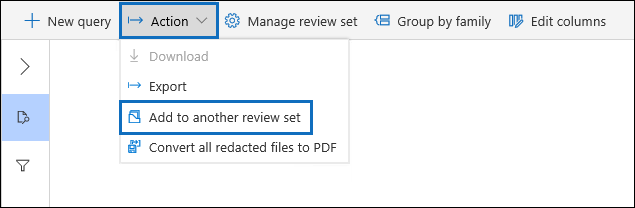

# Adicionar dados a um conjunto de revisão de outro conjunto de revisãoAdd data to a review set from another review set

Em alguns casos, pode ser necessário selecionar documentos de um conjunto de análise e trabalhar com eles individualmente em outro conjunto de revisão.In some cases, it may be necessary to select documents from one review set and work with them individually in another review set. Isso é especialmente útil se você tiver escolhido conteúdo em um conjunto de revisão e quiser executar a análise no subconjunto de dados.This is especially useful if you've culled content in a review set and want to run analytics on the subset of data.

Siga o fluxo de trabalho neste artigo para adicionar conteúdo de um conjunto de análise para outro.Follow the workflow in this article to add content from one review set to another.

## Antes de começarBefore you begin

Antes de começar, você precisará criar uma nova revisão configurada para adicionar os dados a.Before you start, you'll need to create a new review set to add the data to.  Um novo conjunto de revisão pode ser adicionado à guia **conjuntos de revisão** da ocorrência.A new review set can be added on the **Review sets** tab of the case. Para obter mais informações, consulte [criar um conjunto de revisão](managing-review-sets.md#create-a-review-set).For more information, see [Create a review set](managing-review-sets.md#create-a-review-set).

## Etapa 1: identificar o conteúdo a ser adicionado a outro conjunto de revisãoStep 1: Identify content to add to another review set

Você pode adicionar conteúdo de uma análise definida para outra selecionando documentos específicos no conjunto de revisão de origem ou selecionando todos os itens retornados por consulta de conjunto de revisão.You can add content from one review set to another one by selecting specific documents in the source review set or by selecting all items returned by review set query. Se você estiver adicionando itens selecionados, selecione os itens, selecione **ação**e, em seguida, selecione **Adicionar a outro conjunto de revisão**.If you're adding selected items, select the items, select **Action**, and then select **Add to another review set**.

## Etapa 2: especificar as opções para adicionar a outro conjunto de revisãoStep 2: Specify options for adding to another review set

Na página **Adicionar a outro conjunto de revisão de opções** , escolha o conjunto de revisão ao qual você deseja adicionar os itens.In the **Add to another review set options** flyout page, choose the review set you want to add the items to. Escolha se deseja adicionar **todos os resultados de pesquisa** ou os **itens selecionados**.Choose whether to add **All search results** or **Selected items**.  **Informações adicionais** fornecem opções para incluir todos os metadados dos itens e se devem ser incluídas as marcas (marcando a caixa de seleção **Rótulos** ) do conjunto de revisão de origem quando os documentos são adicionados ao novo conjunto de revisão.**Additional information** provides options to include all metadata from the items and whether to include the tags (by selecting the **Labels** check box) from the source review set when the documents are added to the new review set.  

Após clicar em **OK**, um novo trabalho (chamado **adição de dados a outro conjunto de revisão**) é criado para adicionar o conteúdo a outro conjunto de análise.After you click **Ok**, a new job (named **Adding data to another review set**) is created to add the content to another review set. Você pode ir para a guia **trabalhos** e monitorar o progresso desse trabalho.You can go to the **Jobs** tab and monitor the progress of this job. Para obter mais informações, consulte [Manage Jobs](managing-jobs-ediscovery20.md).For more information, see [Manage jobs](managing-jobs-ediscovery20.md).
