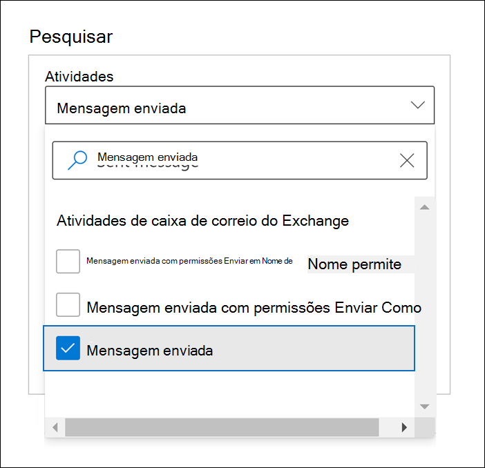
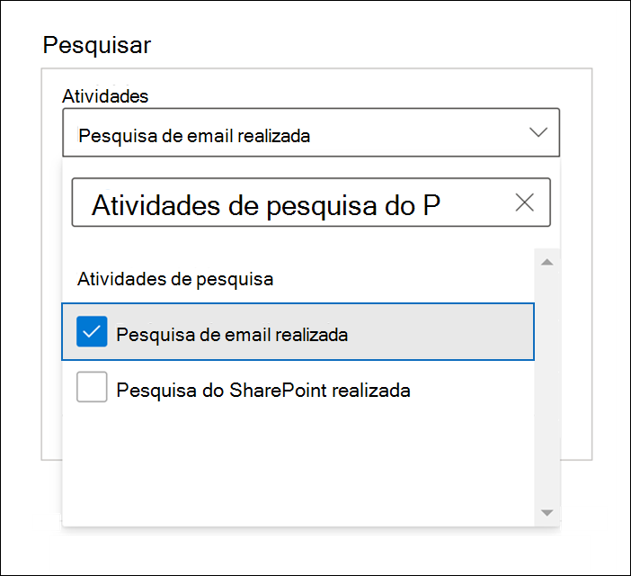

# Auditoria Avançada no Microsoft 365

A [funcionalidade de auditoria unificada](search-the-audit-log-in-security-and-compliance.md) no Microsoft 365 oferece às organizações a visibilidade de vários tipos de atividades auditadas em vários serviços do Microsoft 365. A Auditoria Avançada ajuda as organizações a conduzir investigações forenses e de conformidade ao aumentar a retenção de log de auditoria necessária para conduzir uma investigação, fornecendo acesso a eventos cruciais que ajudam a determinar o escopo do comprometimento e acesso mais rápido à API da Atividade de Gestão do Office 365.

> [!NOTE]
> A Auditoria Avançada está disponível para organizações com uma assinatura do Office 365 E5/G5 ou Microsoft 365 Enterprise E5/G5. Além disso, uma licença de complemento do Microsoft 365 E5 Compliance ou Descoberta Eletrônica E5 pode ser atribuída aos usuários quando o licenciamento por usuário for necessário aos recursos de Auditoria Avançada, como é o caso da retenção a longo prazo dos logs de auditoria e do acesso a eventos cruciais de investigações. Para obter mais informações sobre licenciamento, confira [Diretrizes de licenciamento do Microsoft 365 para conformidade e segurança](https://docs.microsoft.com/office365/servicedescriptions/microsoft-365-service-descriptions/microsoft-365-tenantlevel-services-licensing-guidance/microsoft-365-security-compliance-licensing-guidance#advanced-audit).

Este artigo fornece uma visão geral dos recursos de Auditoria Avançada e mostra como configurar usuários para Auditoria Avançada.

## Retenção a longo prazo de logs de auditoria

A Auditoria Avançada mantém todos os registros de auditoria do Exchange, SharePoint e Azure Active Directory por um ano. Isso é feito por uma política de retenção de log de auditoria padrão que mantém qualquer registro de auditoria que contenha o valor **Exchange**, **SharePoint** ou **AzureActiveDirectory** da propriedade **Carga de trabalho** (que indica o serviço em que a atividade ocorreu) por um ano. Manter os registros de auditoria por períodos mais longos pode ajudar com investigações de conformidade ou perícia contínua. Para saber mais, confira a seção "Política de retenção de log de auditoria padrão" em [Gerenciar políticas de retenção de log de auditoria](audit-log-retention-policies.md#default-audit-log-retention-policy).

Também estamos lançando o recurso de retenção de logs de auditoria por dez anos. A retenção de logs de auditoria por dez anos ajuda a dar suporte às investigações longas e a responder às obrigações normativas e legais.

> [!NOTE]
> Manter os logs de auditoria por dez anos exige uma licença adicional complementar. Essa nova licença estará disponível no início de 2021. Para obter mais informações, confira a seção [Perguntas frequentes sobre Auditoria Avançada](#faqs-for-advanced-audit) desse artigo.

### Políticas de retenção de log de auditoria

Todos os registros de auditoria gerados em outros serviços que não são cobertos pela política de retenção de log de auditoria padrão (descrita na seção anterior) são retidos por 90 dias. Mas agora você pode criar políticas de retenção de logs de auditoria personalizadas para manter outros registros de auditoria por períodos mais longos de até dez anos. Você pode criar uma política para manter registros de auditoria com base em um ou mais dos seguintes critérios:

- O serviço do Microsoft 365 em que as atividades auditadas ocorrem.

- Atividades auditadas específicas.

- O usuário que executa uma atividade auditada.

Você também pode especificar por quanto tempo deseja manter registros de auditoria que correspondam à política e a um nível de prioridade, para que políticas específicas tenham prioridade sobre outras políticas. Observe também que qualquer política de retenção de log de auditoria personalizada terá precedência sobre a política de retenção de auditoria padrão, caso você precise reter registros de auditoria do Exchange, SharePoint ou Azure Active Directory por menos de um ano (ou por até dez anos) para alguns ou todos os usuários em sua organização. Para saber mais, confira [Gerenciar políticas de retenção de log de auditoria](audit-log-retention-policies.md).

## Acesso aos eventos cruciais de investigações

A Auditoria Avançada ajuda as organizações a conduzirem investigações forenses e de conformidade, fornecendo acesso a eventos cruciais, como quando os itens de email foram acessados, quando os itens de email foram respondidos e encaminhados, e quando e o que um usuário pesquisava no Exchange Online e no SharePoint Online. Esses eventos cruciais podem ajudá-lo a investigar possíveis violações e a determinar o escopo dos comprometimentos.  A Auditoria Avançada oferece os seguintes eventos cruciais:

- [MailItemsAccessed](#mailitemsaccessed)

- [Send](#send)

- [SearchQueryInitiatedExchange](#searchqueryinitiatedexchange)

- [SearchQueryInitiatedSharePoint](#searchqueryinitiatedsharepoint)

### MailItemsAccessed

O evento MailItemsAccessed é uma ação de auditoria da caixa de correio e é acionado quando dados de email é acessado por protocolos de email e clientes de email. A ação MailItemsAccessed pode ajudar os investigadores a identificar violações de dados e determinar o escopo das mensagens que podem ter sido comprometidas. Se um invasor obtiver acesso às mensagens de email, a ação MailItemsAccessed será acionada mesmo se não houver sinal explícito de que as mensagens foram realmente lidas (em outras palavras, o tipo de acesso, como via associação ou sincronização, é registrado no registro de auditoria).

A ação da caixa de correio MailItemsAccessed substitui o MessageBind no log de auditoria da caixa de correio do Exchange Online e fornece os seguintes aprimoramentos:

- O MessageBind era configurável apenas para o tipo de logon do usuário AuditAdmin; não se aplicava a ações de representante ou de proprietário. O MailItemsAccessed se aplica a todos os tipos de logon.

- O MessageBind abrangia apenas o acesso por um cliente de email. Não se aplicava a atividades de sincronização. Os eventos MailItemsAccessed são disparados pelos tipos de acesso de ligação e sincronização.

- As ações MessageBind acionariam a criação de vários registros de auditoria quando a mesma mensagem de email fosse acessada, o que resultava em "ruído" de auditoria. Por outro lado, os eventos MailItemsAccessed são agregados em menos registros de auditoria.

Para obter informações sobre registros de auditoria para atividades MailItemsAccessed, confira [Usar auditoria avançada para investigar contas comprometidas](mailitemsaccessed-forensics-investigations.md).

Para pesquisar registros de auditoria MailItemsAccessed, é possível pesquisar a atividade **Itens da caixa de correio acessados**​​ na lista suspensa **Atividades da caixa de correio do Exchange** na [ferramenta de pesquisa de log de auditoria](search-the-audit-log-in-security-and-compliance.md) no centro de conformidade do Microsoft 365.

Você também pode executar os comandos [Search-UnifiedAuditLog -Operations MailItemsAccessed](https://docs.microsoft.com/powershell/module/exchange/search-unifiedauditlog) ou [Search-MailboxAuditLog -Operations MailItemsAccessed](https://docs.microsoft.com/powershell/module/exchange/search-mailboxauditlog) no PowerShell do Exchange Online.

### Send

O evento Send também é uma ação de auditoria de caixa de correio e é acionado quando um usuário realiza uma das seguintes ações:

- Envia uma mensagem de email

- Responde a uma mensagem de email

- Encaminha uma mensagem de email

Os investigadores podem usar o evento Send para identificar os emails enviados de uma conta comprometida. O registro de auditoria para um evento de Envio contém informações sobre a mensagem, como, por exemplo, quando a mensagem foi enviada, a ID de InternetMessage, o campo assunto e se a mensagem continha anexos. Essas informações de auditoria podem ajudar os investigadores a identificar informações sobre mensagens de email enviadas de uma conta comprometida ou enviadas por um invasor. Além disso, os investigadores podem usar uma ferramenta de Descoberta Eletrônica do Microsoft 365 para procurar a mensagem (usando o campo assunto ou ID da mensagem) para identificar os destinatários para os quais a mensagem foi enviada e o conteúdo real da mensagem enviada.

Para pesquisar os registros de auditoria Send, é possível pesquisar a atividade **Mensagem enviada**​​ na lista suspensa **Atividades da caixa de correio do Exchange** na [ferramenta de pesquisa de log de auditoria](search-the-audit-log-in-security-and-compliance.md) no centro de conformidade do Microsoft 365.

Você também pode executar os comandos [Search-UnifiedAuditLog -Operations Send](https://docs.microsoft.com/powershell/module/exchange/search-unifiedauditlog) ou [Search-MailboxAuditLog -Operations Send](https://docs.microsoft.com/powershell/module/exchange/search-mailboxauditlog) no PowerShell do Exchange Online.

### SearchQueryInitiatedExchange

O evento SearchQueryInitiatedExchange é disparado quando uma pessoa usa a barra de pesquisa no Outlook ou no Outlook na Web para procurar itens em uma caixa de correio. Os investigadores podem usar o evento SearchQueryInitiatedExchange para determinar se um invasor que pode ter comprometido uma conta procurou por ou tentou acessar informações confidenciais na caixa de correio. O registro de auditoria para um evento SearchQueryInitiatedExchange contém informações como o texto atual de consulta de pesquisa. Examinando as consultas de pesquisa que um invasor pode ter executado, um investigador pode entender melhor a intenção dos dados de email que foi pesquisado.

Para pesquisar os registros de auditoria SearchQueryInitiatedExchange, é possível pesquisar a atividade **Pesquisa de email realizada**​​ na lista suspensa **Atividades de pesquisa** na [ferramenta de pesquisa de log de auditoria](search-the-audit-log-in-security-and-compliance.md) no centro de conformidade.

Você também pode executar o [Search-UnifiedAuditLog – Operations SearchQueryInitiatedExchange](https://docs.microsoft.com/powershell/module/exchange/search-unifiedauditlog) no PowerShell do Exchange Online.

> [!NOTE]
> Você deve executar o comando a seguir no PowerShell do Exchange Online para que os eventos do SearchQueryInitiatedExchange (feitos pelo usuário E5 especificado) sejam incluídos nos resultados de pesquisa de log de auditoria: `Set-Mailbox <user identity> -AuditOwner @{Add="SearchQueryInitiated"}`.  
Em um ambiente multi-geo, você deve executar o comando **Set-Mailbox** na floresta onde a caixa de correio do usuário está localizada. Para identificar a localização da caixa de correio do usuário, execute o seguinte comando: `Get-Mailbox <user identity> | FL MailboxLocations`.
Se o comando `Set-Mailbox -AuditOwner @{Add="SearchQueryInitiated"}` foi executado anteriormente na floresta diferente daquela em que a caixa de correio do usuário está localizada, você deve remover o valor SearchQueryInitiated da caixa de correio do usuário (executando `Set-Mailbox -AuditOwner @{Remove="SearchQueryInitiated"}`) e, em seguida, adicioná-lo à caixa de correio do usuário na floresta onde o usuário caixa de correio está localizada.

### SearchQueryInitiatedSharePoint

De forma semelhante à pesquisa de itens da caixa de correio, o evento SearchQueryInitiatedSharePoint será disparado quando uma pessoa procurar itens no site inicial do SharePoint da sua organização. Os investigadores podem usar o evento SearchQueryInitiatedSharePoint para determinar se um invasor tentou localizar (e possivelmente acessar) informações confidenciais no SharePoint. O registro de auditoria para um evento SearchQueryInitiatedSharePoint contém também o texto real da consulta de pesquisa. Examinando as consultas de pesquisa que um invasor pode ter executado, um investigador pode entender melhor a intenção e o escopo dos dados do arquivo sendo pesquisado.

Para pesquisar os registros de auditoria SearchQueryInitiatedSharePoint, é possível pesquisar a atividade **Pesquisa SharePoint realizada**​​ na lista suspensa **Atividades de pesquisa** na [ferramenta de pesquisa de log de auditoria](search-the-audit-log-in-security-and-compliance.md) no centro de conformidade.

Você também pode executar o [Search-UnifiedAuditLog – Operations SearchQueryInitiatedSharePoint](https://docs.microsoft.com/powershell/module/exchange/search-unifiedauditlog) no PowerShell do Exchange Online.

> [!NOTE]
> Você deve executar o comando a seguir no PowerShell do Exchange Online para que os eventos do SearchQueryInitiatedExchange (feitos pelo usuário E5 especificado) sejam incluídos nos resultados de pesquisa de log de auditoria: `Set-Mailbox <user identity> -AuditOwner @{Add="SearchQueryInitiated"}`.  
Em um ambiente multi-geo, você deve executar o comando **Set-Mailbox** na floresta onde a caixa de correio do usuário está localizada. Para identificar a localização da caixa de correio do usuário, execute o seguinte comando: `Get-Mailbox <user identity> | FL MailboxLocations`.
Se o comando `Set-Mailbox -AuditOwner @{Add="SearchQueryInitiated"}` foi executado anteriormente na floresta diferente daquela em que a caixa de correio do usuário está localizada, você deve remover o valor SearchQueryInitiated da caixa de correio do usuário (executando `Set-Mailbox -AuditOwner @{Remove="SearchQueryInitiated"}`) e, em seguida, adicioná-lo à caixa de correio do usuário na floresta onde o usuário caixa de correio está localizada.

## Acesso de alta largura de banda à API da Atividade de Gerenciamento do Office 365

As organizações que acessam logs de auditoria por meio da API da Atividade de Gestão do Office 365 foram restritas pelos limites no nível do editor. Isso significa que, para um editor obter dados em nome de vários clientes, o limite foi compartilhado por todos esses clientes.

Com o lançamento da Auditoria Avançada, passamos de um limite de nível de editor para um limite de nível de locatário. O resultado é que todas as organizações terão sua própria cota de largura de banda totalmente alocada para acessar os dados de auditoria. A largura de banda não é um limite estático predefinido, mas é modelada em uma combinação de fatores, incluindo o número de assentos na organização e que as organizações E5 terão mais largura de banda do que as organizações que não são E5.

Todas as organizações alocam inicialmente uma linha de base de 2.000 solicitações por minuto. Esse limite aumentará dinamicamente de acordo com a contagem de assentos de uma organização e de sua assinatura de licenciamento. As organizações E5 terão aproximadamente o dobro da largura de banda que as organizações que não são E5. Também haverá limite máximo quanto à largura de banda para proteger a integridade do serviço.

Para mais informações, confira a seção "limitação da API" em [Referência da API de atividade de gerenciamento do Office 365](https://docs.microsoft.com/office/office-365-management-api/office-365-management-activity-api-reference#api-throttling).

## Configurar Auditoria Avançada para usuários

Recursos de Auditoria Avançada, como a capacidade de registrar eventos cruciais, como MailItemsAccessed e Send, exigem uma licença E5 apropriada atribuída aos usuários. Além disso, o aplicativo/plano de serviço de Auditoria Avançada deve ser habilitado para esses usuários. Para verificar se o aplicativo Auditoria Avançada está atribuído aos usuários, execute as seguintes etapas para cada usuário:

1. No [Centro de administração do Microsoft 365](https://admin.microsoft.com/Adminportal), acesse **Usuários** > **Ativar usuários** e selecione um usuário.

2. Na página flyout de propriedades do usuário, clique em **Licenças e aplicativos**.

3. Na seção **Licenças**, verifique se o usuário recebeu uma licença E5.

4. Expanda a seção **Aplicativos** e verifique se a caixa de seleção **Auditoria Avançada do Microsoft 365** está marcada.

5. Se a caixa de seleção não estiver marcada, selecione-a e clique em **Salvar alterações**.

   O log de registros de auditoria para MailItemsAccessed, Send, e outros eventos cruciais para o usuário começará dentro de 24 horas.

Para organizações que atribuem licenças a grupos de usuários usando o licenciamento baseado em grupo, é necessário desativar a atribuição de licenciamento da Auditoria avançada do Microsoft 365 do grupo. Depois de salvar as alterações, verifique se a Auditoria Avançada do Microsoft 365 está desativada para o grupo. Em seguida, ative novamente a atribuição de licenciamento do grupo. Para obter mais instruções do licenciamento baseado em grupo, consulte [Atribuir licenças a usuários por membro de grupo no Azure Active Directory](https://docs.microsoft.com/azure/active-directory/users-groups-roles/licensing-groups-assign).

Além disso, se você personalizou as ações de caixa de correio que estão conectadas às caixas de correio dos usuários ou compartilhadas, as novas ações da caixa de correio padrão, como MailItemsAccessed, não serão auditadas automaticamente nessas caixas de correio. Para obter informações sobre como alterar as ações da caixa de correio que são auditadas para cada tipo de logon, confira a seção "Alterar ou restaurar ações da caixa de correio registradas por padrão" em [Gerenciar auditoria de caixa de correio](enable-mailbox-auditing.md#change-or-restore-mailbox-actions-logged-by-default).

## Perguntas frequentes para Auditoria Avançada

**Todo usuário precisa de uma licença E5 para se beneficiar da Auditoria Avançada?**

Para se beneficiar dos recursos da Auditoria Avançada no nível de usuário, o usuário deve ter uma licença E5. Existem alguns recursos que verificarão a licença apropriada para expor o recurso ao usuário. Por exemplo, se você estiver tentando manter os registros de auditoria para um usuário que não tem uma licença E5 por mais de 90 dias, o sistema retornará uma mensagem de erro.

**Minha organização tem uma assinatura E5, preciso fazer algo para ter acesso aos registros de auditoria dos eventos cruciais?**

Para clientes qualificados e usuários atribuídos à licença apropriada, não há ação para obter acesso a eventos de auditoria cruciais.

**Quando a nova licença do complemento de retenção do log de auditoria de dez anos estará disponível?**

O novo complemento de retenção de log de auditoria de dez anos estará disponível para compra pelos clientes com assinaturas E5 no início de 2021.

**O que acontecerá com os dados do log de auditoria da minha organização se eu criar uma política de retenção de log de auditoria de dez anos, o recurso for lançado para disponibilidade geral, mas antes da licença complementar necessária estar disponível no início de 2021?**

Todos os dados de log de auditoria abrangidos por uma política de retenção de log de auditoria de dez anos que você cria depois da disponibilidade geral serão mantidos por dez anos. Quando a licença complementar de retenção do log de auditoria de dez anos estiver disponível no início de 2021, você precisará comprar licenças de complemento para os usuários os quais os dados de auditoria estão sendo retidos por uma política de retenção existente de dez anos. Além disso, após a licença complementar estar disponível no início de 2021, o licenciamento apropriado será aplicado quando você criar novas políticas de retenção de log de auditoria de dez anos.

**Os novos eventos da Auditoria Avançada estão disponíveis na API da Atividade de Gerenciamento do Office 365?**

Sim. Desde que os registros de auditoria sejam gerados para os usuários com a licença adequada, você poderá acessá-los por meio da API da Atividade de Gerenciamento do Office 365.

**Maior largura de banda significa melhor latência ou SLA mais alto?**

No momento, a alta largura de banda fornece um pipeline melhor, especialmente para organizações com um alto volume de sinais de auditoria e padrões de consumo significativos. Uma maior largura de banda pode levar a uma latência melhor. No entanto, não há um SLA associado à alta largura de banda. As latências padrão são documentadas e essas latências não mudam com o lançamento da Auditoria Avançada.
