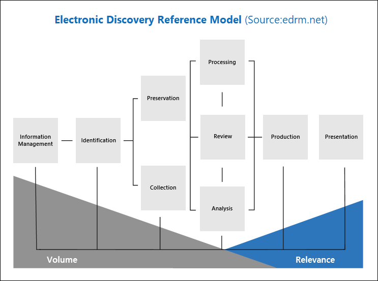

# Alinhamento avançado da Descoberta Eletrônica com o Modelo de Referência de Descoberta Eletrônica

O fluxo de trabalho integrado da Descoberta Eletrônica Avançada no Microsoft 365 se alinha ao processo de Descoberta Eletrônica descrito pelo Modelo de Referência de Descoberta Eletrônica (EDRM).

(Fonte de imagem cortesia da edrm.net. A imagem de origem foi disponibilizada em Creative Commons Attribution 3.0 Unported License.)

Em um nível alto, veja como a Descoberta Avançada dá suporte ao fluxo de trabalho EDRM:

- **Identificação.** Depois de identificar possíveis pessoas de interesse em uma investigação, você pode adicioná-las como custodiantes (também chamadas de custodiantes de *dados,* pois elas podem possuir informações relevantes para a investigação) a um caso de Descoberta Avançada de Descoberta e. Depois que os usuários são adicionados como custodiantes, é fácil preservar, coletar e revisar documentos custodiantes.

- **Preservação.** Para preservar e proteger dados que são relevantes para uma investigação, a Descoberta Avançada permite que você coloque uma responsabilidade legal sobre as fontes de dados associadas aos custodiantes em um caso. Você também pode colocar dados não custodiais em espera. A Descoberta Eletrônica Avançada também tem um fluxo de trabalho de comunicações integrado para que você possa enviar notificações de responsabilidade legal aos custodiantes e acompanhar seus reconhecimentos.

- **Coleção.** Depois de identificar (e preservar) as fontes de dados relevantes para a investigação, você pode usar a ferramenta de pesquisa interna na pesquisa de Descoberta Avançada e coletar dados ao vivo das fontes de dados de custodia (e fontes de dados não custodiais, se aplicável) que podem ser relevantes para o caso.

- **Processamento.** Depois de coletar todos os dados relevantes para o caso, a próxima etapa é processá-los para análise e análise posteriores. Na Descoberta Virtual Avançada, os dados in-loco identificados na fase de coleta são copiados para um local de Armazenamento do Azure (chamado de conjunto de *revisão),* que fornece uma exibição estática dos dados de caso. 

- **Revisão.** Depois que os dados foram adicionados a um conjunto de revisão, você pode exibir documentos específicos e executar consultas adicionais para reduzir os dados ao que é mais relevante para o caso. Além disso, pode anotar e marcar documentos específicos.

- **Análise.** A Descoberta Avançada fornece uma ferramenta de análise integrada que ajuda você a analisar ainda mais os dados do conjunto de revisão que você determina não é relevante para a investigação. Além de reduzir o volume de dados relevantes, o Advance eDiscovery também ajuda você a economizar custos de revisão legal, deixando você organizar o conteúdo para tornar o processo de revisão mais fácil e eficiente.

- **Produção** e **Apresentação.** Quando estiver pronto, você poderá exportar documentos de um conjunto de revisão para revisão legal. Você pode exportar documentos no formato nativo ou em um formato especificado por EDRM para que eles possam ser importados para aplicativos de revisão de terceiros.

## Mais Informações

Para começar a usar a Descoberta Avançada, consulte:

- [Configurar a Descoberta Eletrônica Avançada](get-started-with-advanced-ediscovery.md)

- [Criar e gerenciar um caso de Descoberta Avançada](create-and-manage-advanced-ediscoveryv2-case.md)