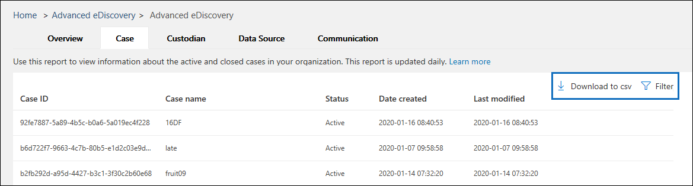

# Relatórios de descoberta eletrônica avançada (visualização)

Relatórios de descoberta eletrônica avançados ajudam a agregar dados de caso em sua organização para simplificar a análise de dados e o relatório organizacional. O recurso relatórios de descoberta eletrônica avançada inclui vários relatórios internos para ajudá-lo a responder perguntas como:

- Quantos responsáveis ativos existem para todos os casos na minha organização?

- Quantas fontes de dados estão em espera para todos os casos em minha organização?

- Quantas notificações de bloqueio foram emitidas no último mês para todos os casos em minha organização?

- Quantos casos ativos e fechados estão em minha organização?

## Antes de começar

- Para acessar relatórios de descoberta eletrônica avançados, você deve ser membro do grupo de função Administrador de descoberta eletrônica. Ser membro desse grupo de função fornece as permissões necessárias para exibir, filtrar e exportar os dados nos relatórios. Para obter mais informações, confira [Atribuir permissões de descoberta eletrônica](assign-ediscovery-permissions.md).

- Relatórios de descoberta eletrônica avançados são atualizados diariamente. Como resultado, pode haver um atraso quando novos casos, responsáveis, fontes de dados e comunicações são criados e quando aparecem no relatório correspondente.

Para acessar os relatórios de descoberta eletrônica avançados:

1. Acesse https://protection.office.com
  
2. Entre no Office 365 usando sua conta corporativa ou de estudante.
  
3. No centro de conformidade & segurança, clique em **descoberta eletrônica avançada > descoberta eletrônica avançada**.
  
   Na home page da **descoberta eletrônica avançada** , as guias de ocorrência, responsáveis, fonte de dados e relatório de comunicações são exibidas na parte superior da página. 
  
   

5. Para exibir um relatório, clique em uma guia de relatório e, se necessário, você pode executar uma das seguintes ações:

   

   a. Clique em **filtro** para restringir os dados do relatório. Você pode filtrar por diferentes propriedades de cada relatório.
  
   b. Clique em **baixar para CSV** para exportar os dados do relatório para um arquivo CSV.

## Relatório de caso

O relatório de caso agrega informações sobre casos de descoberta eletrônica ativos e fechados em sua organização.

|Coluna        |Descrição|
|:-------------|:-------------|
|ID do caso | O identificador exclusivo de cada caso.| 
|Nome do caso | Nome do caso definido pelo usuário.|
|Status | Indica se o caso está ativo ou fechado.|
|Data de criação |Data em que o caso foi criado. As datas estão no formato UTC.|
|Última modificação |A data em que o caso foi fechado ou atualizado pela última vez. As datas estão no formato UTC.| 
|||

## Relatório de responsáveis

No fluxo de trabalho de descoberta eletrônica, as pessoas que são o assunto de uma investigação ou um caso jurídico são chamadas de *responsáveis por dados* (ou apenas *responsáveis*) e são definidas como "pessoas com controle administrativo de um documento ou arquivo eletrônico". O relatório de responsáveis ajuda a identificar todos os responsáveis cujas fontes de dados são colocadas em espera para todos os casos em sua organização.

|Coluna         |Descrição|
|:-------------|:-------------|
|Nome do responsáveis| O nome dos responsáveis no Active Directory.|
|UPN de responsáveis | O nome principal do usuário do responsáveis.|
|ID do responsáveis | O identificador exclusivo para os responsáveis em um determinado caso. |
|Nome do caso | O nome do caso definido pelo usuário.|
|Status de retenção | Indica se os responsáveis estão em espera no momento ou se foram liberados do caso.|
|ID do caso | O identificador exclusivo do caso.|
|Status de comunicação |Indica se os responsáveis foram emitidos uma notificação de retenção legal ou não. |
|Responsáveis adicionados | A data em que os responsáveis foram adicionados ao caso. As datas estão no formato UTC.|
|||

## Relatório de fonte de dados

Você pode usar um caso de descoberta eletrônica avançada para criar isenções para preservar o conteúdo que pode ser relevante para o caso. Usando os recursos avançados de retenção de descoberta eletrônica, você pode colocar bloqueios em seus responsáveis e suas fontes de dados. Além disso, você pode colocar um bloqueio não custodial nas caixas de correio e nas contas do OneDrive for Business. Você pode usar o relatório de fontes de dados para agregar detalhes sobre os locais de conteúdo em espera para todos os casos em sua organização.

|Coluna        |Descrição|
| -------------|-------------|
|ID do caso |O identificador exclusivo de cada caso. |
|Carga de trabalho |Indica o tipo de local de conteúdo colocado em espera (por exemplo, Exchange ou SharePoint).
|Nome do local |Indica o endereço SMTP (para caixas de correio do Exchange) ou a URL (para sites do SharePoint) do local do conteúdo. | 
|ID do responsáveis |Se a fonte de dados pertencer a um responsável, esta coluna mostrará o identificador exclusivo para os responsáveis em um determinado caso. Esta coluna será nula para locais não custodial.|
|Nome do responsáveis |O nome dos responsáveis no Active Directory.| 
|Nome do caso |O nome do caso definido pelo usuário.| 
|Status |Indica se o local do conteúdo está em espera no momento. | 
|ID da política de retenção |O identificador exclusivo da retenção que contém o local do conteúdo. | 
|Data de criação da retenção |Indica a data em que a política de retenção foi criada. As datas estão no formato UTC. | 
|Nome da política de retenção |O nome da retenção que contém o local do conteúdo. |
|Data de retenção de retenção |A data em que a retenção foi modificada pela última vez. As datas estão no formato UTC.| 
|Retenção da última modificação por|O nome do usuário que modificou a retenção pela última vez.| 
|||

## Relatório de comunicação

Sua organização pode emitir avisos de retenção legal para notificar os responsáveis pela obrigação de preservar as informações relevantes como parte do caso jurídico ou investigação. Você pode usar o relatório de comunicações para exibir dados agregados sobre confirmações, lembretes, escalonamentos e outros tipos de comunicação.

|Coluna         |Descrição|
| -------------|-------------|
|ID do caso | O identificador exclusivo do caso.|
|Nome do caso | Nome do caso definido pelo usuário.|
|ID do responsáveis |O identificador exclusivo para os responsáveis em um determinado caso.|
|Nome do responsáveis |O nome do responsáveis.|
|Tipo de aviso |Indica o tipo de aviso que foi emitido para o responsáveis.|
|Responsável pela emissão |O nome do usuário que emitiu a notificação de retenção legal.|
|Evento de notificação|Indica a mensagem de notificação de retenção legal enviada para o usuário. Os valores possíveis incluem: lembrete, escalonamento, reconhecimento e emissão de isenções.|
|Data de envio |A data em que a comunicação foi emitida. Para confirmações, esta coluna indica a hora em que o aviso foi confirmado pelo responsáveis. As datas estão no formato UTC.|
|||
