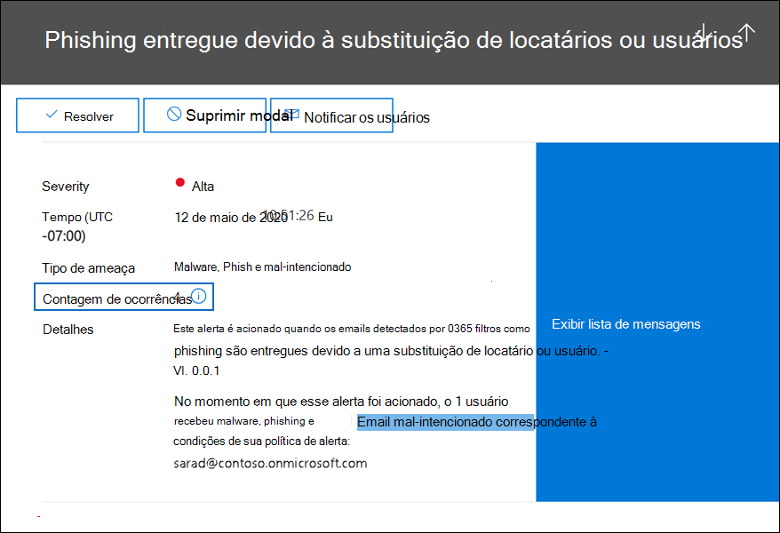

# <a name="alert-policies-in-the-security-and-compliance-center"></a>Políticas de alerta no centro de conformidade e segurança

Você pode usar as ferramentas de política de alerta e painel de alerta nos centros de segurança e conformidade do Microsoft 365 para criar políticas de alerta e, em seguida, exibir os alertas gerados quando os usuários executam atividades que corresponderem às condições de uma política de alerta. Há várias políticas de alerta padrão que ajudam você a monitorar atividades como a atribuição de privilégios de administrador no Exchange Online, ataques de malware, campanhas de phishing e níveis incomuns de exclusões de arquivo e compartilhamento externo.

As políticas de alerta permitem categorizar os alertas disparados por uma política, aplicar a política a todos os usuários em sua organização, definir um nível limite para quando um alerta for disparado e decidir se receberão notificações por email quando os alertas são disparados. Há também uma página Exibir **alertas** no centro de segurança e conformidade onde você pode exibir e filtrar alertas, definir um status de alerta para ajudá-lo a gerenciar alertas e, em seguida, descartar alertas depois de resolver ou resolver o incidente subjacente.

> [!NOTE]
> As políticas de alerta estão disponíveis para organizações com uma assinatura Microsoft 365 Enterprise, Office 365 Enterprise ou Office 365 US Government E1/F1/G1, E3/F3/G3 ou E5/G5. A funcionalidade avançada só está disponível para organizações com uma assinatura E5/G5 ou para organizações que têm uma assinatura E1/F1/G1 ou E3/F3/G3 e um Microsoft Defender para Office 365 P2 ou um Microsoft 365 E5 Compliance ou uma assinatura de complemento de Descoberta e Auditoria e Descoberta E5. A funcionalidade que requer uma assinatura E5/G5 ou complemento é realçada neste tópico. Observe também que as políticas de alerta estão disponíveis nos ambientes Office 365 GCC, GCC Alta e DoD us.

## <a name="how-alert-policies-work"></a>Como funcionam as políticas de alerta

Aqui está uma visão geral rápida de como as políticas de alerta funcionam e os alertas que são disparados quando a atividade do usuário ou do administrador corresponde às condições de uma política de alerta.


1. Um administrador em sua organização cria, configura e ativas  uma política de alerta usando a página Políticas de alerta no centro de segurança e conformidade. Você também pode criar políticas de alerta usando o cmdlet [New-ProtectionAlert](/powershell/module/exchange/new-protectionalert) no Centro de Conformidade & Segurança do PowerShell.

   Para criar políticas de alerta, você precisa receber a função Gerenciar Alertas ou a função Configuração da Organização no centro de segurança e conformidade.

   > [!NOTE]
   > Leva até 24 horas após a criação ou atualização de uma política de alerta antes que os alertas possam ser disparados pela política. Isso porque a política precisa ser sincronizada com o mecanismo de detecção de alerta.

2. Um usuário executa uma atividade que corresponde às condições de uma política de alerta. No caso de ataques de malware, as mensagens de email infectados enviadas aos usuários em sua organização disparam um alerta.

3. Microsoft 365 gera um alerta exibido na página Exibir **alertas** no Centro de Conformidade & Segurança. Além disso, se as notificações por email estão habilitadas para a política de alerta, a Microsoft envia uma notificação para uma lista de destinatários. Os alertas que um administrador ou outros usuários podem ver que na página Exibir alertas é determinado pelas funções atribuídas ao usuário. Para obter mais informações, consulte [RBAC permissions required to view alerts](#rbac-permissions-required-to-view-alerts).

4. Um administrador gerencia alertas no centro de segurança e conformidade. Gerenciar alertas consiste em atribuir um status de alerta para ajudar a controlar e gerenciar qualquer investigação.

## <a name="alert-policy-settings"></a>Configurações de política de alerta

Uma política de alerta consiste em um conjunto de regras e condições que definem a atividade do usuário ou administrador que gera um alerta, uma lista de usuários que disparam o alerta se executarem a atividade e um limite que define quantas vezes a atividade precisa ocorrer antes que um alerta seja disparado. Você também categoriza a política e atribui a ela um nível de severidade. Essas duas configurações ajudam você a gerenciar políticas de alerta (e os alertas disparados quando as condições de política são acionadas) porque você pode filtrar essas configurações ao gerenciar políticas e exibir alertas no centro de segurança e conformidade. Por exemplo, você pode exibir alertas que corresponderem às condições da mesma categoria ou exibir alertas com o mesmo nível de gravidade.

Para exibir e criar políticas de alerta, vá para [https://protection.office.com](https://protection.office.com) e selecione Políticas de alerta **de** \> **alerta.**


Uma política de alerta consiste nas seguintes configurações e condições.

- Atividade que o alerta está acompanhando **-** Você cria uma política para rastrear uma atividade ou, em alguns casos, algumas atividades relacionadas, como compartilhar um arquivo com um usuário externo compartilhando-o, atribuindo permissões de acesso ou criando um link anônimo. Quando um usuário executa a atividade definida pela política, um alerta é disparado com base nas configurações de limite de alerta.

    > [!NOTE]
    > As atividades que você pode acompanhar dependem do plano de governo Office 365 Enterprise ou Office 365 da sua organização. Em geral, as atividades relacionadas a campanhas de malware e ataques de phishing exigem uma assinatura E5/G5 ou uma assinatura de complemento E1/F1/G1 ou E3/F3/G3 com uma assinatura de complemento do Plano 2 do [Defender](../security/office-365-security/defender-for-office-365.md) para Office 365.

- **Condições de atividade** - Para a maioria das atividades, você pode definir condições adicionais que devem ser atendidas para disparar um alerta. As condições comuns incluem endereços IP (para que um alerta seja disparado quando o usuário executa a atividade em um computador com um endereço IP específico ou dentro de um intervalo de endereços IP), se um alerta é disparado se um usuário ou usuário específico executa essa atividade e se a atividade é executada em um nome de arquivo ou URL específico. Você também pode configurar uma condição que dispara um alerta quando a atividade é executada por qualquer usuário em sua organização. As condições disponíveis dependem da atividade selecionada.

- **Quando o alerta é disparado** - Você pode configurar uma configuração que define com que frequência uma atividade pode ocorrer antes que um alerta seja disparado. Isso permite configurar uma política para gerar um alerta sempre que uma atividade corresponde às condições da política, quando um determinado limite é excedido ou quando a ocorrência da atividade que o alerta está rastreando se torna incomum para sua organização.

    

    Se você selecionar a configuração com base em atividades incomuns, a Microsoft estabelecerá um valor de linha de base que define a frequência normal da atividade selecionada. Leva até sete dias para estabelecer essa linha de base, durante o qual os alertas não serão gerados. Depois que a linha de base é estabelecida, um alerta é disparado quando a frequência da atividade controlada pela política de alerta excede muito o valor da linha de base. Para atividades relacionadas à auditoria (como atividades de arquivo e pasta), você pode estabelecer uma linha de base com base em um único usuário ou com base em todos os usuários em sua organização; para atividades relacionadas a malware, você pode estabelecer uma linha de base com base em uma única família de malware, um único destinatário ou todas as mensagens em sua organização.

    > [!NOTE]
    > A capacidade de configurar políticas de alerta com base em um limite ou com base em atividades incomuns requer uma assinatura E5/G5 ou uma assinatura E1/F1/G1 ou E3/F3/G3 com um Microsoft Defender para Office 365 P2, Microsoft 365 E5 Compliance ou Microsoft 365 assinatura de complemento descoberta e auditoria. As organizações com uma assinatura E1/F1/G1 e E3/F3/G3 só podem criar políticas de alerta em que um alerta é disparado sempre que uma atividade ocorre.

- **Categoria de alerta** - Para ajudar a controlar e gerenciar os alertas gerados por uma política, você pode atribuir uma das seguintes categorias a uma política.

  - Prevenção contra perda de dados

  - Governança de informações

  - Fluxo de mensagens

  - Permissões

  - Gerenciamento de ameaças

  - Outros

  Quando ocorre uma atividade que corresponde às condições da política de alerta, o alerta gerado é marcado com a categoria definida nesta configuração. Isso permite rastrear e gerenciar alertas com a mesma configuração de categoria na página Exibir **alertas** no centro de segurança e conformidade porque você pode classificar e filtrar alertas com base na categoria.

- **Gravidade do alerta** - Semelhante à categoria de alerta, você atribui um atributo de severidade (**Baixo,** **Médio,** **Alto** ou **Informacional**) às políticas de alerta. Assim como a categoria de alerta, quando ocorre uma atividade que corresponde às condições da política de alerta, o alerta gerado é marcado com o mesmo nível de gravidade definido para a política de alerta. Novamente, isso permite rastrear e gerenciar alertas com a mesma configuração de gravidade na página **Exibir alertas.** Por exemplo, você pode filtrar **a** lista de alertas para que apenas alertas com alta gravidade sejam exibidos.

    > [!TIP]
    > Ao configurar uma política de alerta, considere atribuir uma severidade maior a atividades que podem resultar em consequências gravemente negativas, como a detecção de malware após a entrega aos usuários, a visualização de dados confidenciais ou confidenciais, o compartilhamento de dados com usuários externos ou outras atividades que podem resultar em perda de dados ou ameaças à segurança. Isso pode ajudá-lo a priorizar alertas e as ações que você toma para investigar e resolver as causas subjacentes.

- **Notificações por** email - Você pode configurar a política para que as notificações de email sejam enviadas (ou não enviadas) para uma lista de usuários quando um alerta é disparado. Você também pode definir um limite de notificação diário para que, uma vez atingido o número máximo de notificações, não sejam enviadas mais notificações para o alerta durante esse dia. Além das notificações por email, você ou outros administradores podem exibir os alertas disparados por uma política na página **Exibir alertas.** Considere a habilitação de notificações por email para políticas de alerta de uma categoria específica ou que tenham uma configuração de gravidade mais alta.

## <a name="default-alert-policies"></a>Políticas de alerta padrão

A Microsoft fornece políticas de alerta internas que ajudam a identificar Exchange abuso de permissões de administrador, atividade de malware, possíveis ameaças externas e internas e riscos de governança de informações. Na página **Políticas de alerta,** os nomes dessas políticas internas estão em negrito e o tipo de política é definido como **System**. Essas políticas são ativas por padrão. Você pode desativar essas políticas (ou voltar a ativar), configurar uma lista de destinatários para o que enviar notificações por email e definir um limite de notificação diário. As outras configurações dessas políticas não podem ser editadas.

A tabela a seguir lista e descreve as políticas de alerta padrão disponíveis e a categoria à que cada política é atribuída. A categoria é usada para determinar quais alertas um usuário pode exibir na página Exibir alertas. Para obter mais informações, consulte [RBAC permissions required to view alerts](#rbac-permissions-required-to-view-alerts).

A tabela também indica o plano Office 365 Enterprise e Office 365 us government necessário para cada um deles. Algumas políticas de alerta padrão estarão disponíveis se sua organização tiver a assinatura de complemento apropriada, além de uma assinatura E1/F1/G1 ou E3/F3/G3.

| Política de alerta padrão | Descrição | Categoria | Enterprise assinatura |
|:-----|:-----|:-----|:-----|
|**Um clique de URL potencialmente mal-intencionado foi detectado**|Gera um alerta quando um [](../security/office-365-security/safe-links.md) usuário protegido por links Cofre em sua organização clica em um link mal-intencionado. Esse evento é acionado quando as alterações de veredito de URL são identificadas pelo Microsoft Defender para Office 365 ou quando os usuários substituem as páginas de Links do Cofre (com base na política de links de Microsoft 365 Cofre para empresas). Esta política de alerta tem uma **configuração de** alta gravidade. Para clientes do Defender Office 365 P2, E5, G5, esse alerta dispara automaticamente a investigação e a resposta automatizadas [no Office 365](../security/office-365-security/office-365-air.md). Para obter mais informações sobre eventos que disparam esse alerta, consulte [Set up Cofre Links policies](../security/office-365-security/set-up-safe-links-policies.md).|Gerenciamento de ameaças|E5/G5 ou Defender para Office 365 assinatura de complemento P2|
|**Resultado do Envio de Administrador concluído**|Gera um alerta quando um [Envio de Administrador](../security/office-365-security/admin-submission.md) conclui a varredura da entidade enviada. Um alerta será disparado sempre que um resultado de nova varredura for renderizado de um Envio de Administrador. Esses alertas devem lembrá-lo de revisar os resultados de [envios](https://protection.office.com/reportsubmission)anteriores, enviar mensagens relatadas pelo usuário para obter a verificação de política mais recente e analisar novamente os vereditos e ajudá-lo a determinar se as políticas de filtragem em sua organização estão tendo o impacto pretendido. Esta política tem uma **configuração de** severidade informacional.|Gerenciamento de ameaças|E1/F1, E3/F3 ou E5|
|**O administrador acionou a investigação manual de email**|Gera um alerta quando um administrador dispara a investigação manual de um email do Explorador de Ameaças. Para obter mais informações, consulte [Example: A security administrator triggers an investigation from Threat Explorer](../security/office-365-security/automated-investigation-response-office.md#example-a-security-administrator-triggers-an-investigation-from-threat-explorer). Esse alerta notifica sua organização de que a investigação foi iniciada. O alerta fornece informações sobre quem disparou e inclui um link para a investigação. Esta política tem uma **configuração de** severidade informacional.|Gerenciamento de ameaças| E5/G5 ou Microsoft Defender para Office 365 assinatura de complemento P2| 
|**Criação de regra de encaminhamento/redirecionamento**|Gera um alerta quando alguém em sua organização cria uma regra de caixa de entrada para sua caixa de correio que encaminha ou redireciona mensagens para outra conta de email. Essa política só rastreia regras de caixa de entrada criadas usando Outlook na Web (anteriormente conhecido como Outlook Web App) ou Exchange Online PowerShell. Esta política tem uma **configuração de** severidade informacional. Para obter mais informações sobre como usar regras de caixa de entrada para encaminhar e redirecionar emails no Outlook na Web, consulte [Use rules in Outlook na Web to automatically](https://support.office.com/article/1433e3a0-7fb0-4999-b536-50e05cb67fed)forward messages to another account .|Gerenciamento de ameaças|E1/F1/G1, E3/F3/G3 ou E5/G5|
|**Pesquisa de Descoberta Desdiscovery iniciada ou exportada**|Gera um alerta quando alguém usa a ferramenta de pesquisa de conteúdo no centro de segurança e conformidade. Um alerta é acionado quando as seguintes atividades de pesquisa de conteúdo são executadas: <br/><br/>* Uma pesquisa de conteúdo é iniciada<br/>* Os resultados de uma pesquisa de conteúdo são exportados<br/>* Um relatório de pesquisa de conteúdo é exportado<br/><br/>Os alertas também são acionados quando as atividades de pesquisa de conteúdo anteriores são executadas em associação com um caso de Descoberta E. Esta política tem uma **configuração de** severidade informacional. Para obter mais informações sobre atividades de pesquisa de conteúdo, consulte [Search for eDiscovery activities in the audit log](search-for-ediscovery-activities-in-the-audit-log.md#ediscovery-activities).|Gerenciamento de ameaças|E1/F1/G1, E3/F3/G3 ou E5/G5|
|**Elevação do Exchange de administrador**|Gera um alerta quando alguém recebe permissões administrativas em sua Exchange Online organização. Por exemplo, quando um usuário é adicionado ao grupo de função Gerenciamento da Organização no Exchange Online. Esta política tem uma **configuração De** baixa gravidade.|Permissões|E1/F1/G1, E3/F3/G3 ou E5/G5|
|**Mensagens de email contendo malware removido após a entrega**|Gera um alerta quando todas as mensagens que contêm malware são entregues às caixas de correio em sua organização. Se esse evento ocorrer, a Microsoft removerá as mensagens infectados de Exchange Online caixas de correio usando limpeza automática [zero hora](../security/office-365-security/zero-hour-auto-purge.md). Esta política tem uma **configuração de severidade** informacional e dispara [automaticamente investigação e](../security/office-365-security/office-365-air.md)resposta automatizadas em Office 365 .|Gerenciamento de ameaças|E5/G5 ou Microsoft Defender para Office 365 assinatura de complemento P2|
|**Mensagens de email contendo URLs de phishing removidas após a entrega**|Gera um alerta quando todas as mensagens que contêm phishing são entregues às caixas de correio em sua organização. Se esse evento ocorrer, a Microsoft removerá as mensagens infectados de Exchange Online caixas de correio usando limpeza automática [zero hora](../security/office-365-security/zero-hour-auto-purge.md). Esta política tem uma **configuração de severidade** informacional e dispara [automaticamente investigação e](../security/office-365-security/office-365-air.md)resposta automatizadas em Office 365 .|Gerenciamento de ameaças|E5/G5 ou Defender para Office 365 assinatura de complemento P2|
|**Email relatado pelo usuário como malware ou pishing**|Gera um alerta quando os usuários da sua organização relatam mensagens como emails de phishing usando o complemento Mensagem de Relatório. Esta política tem uma **configuração De** baixa gravidade. Para obter mais informações sobre esse add-in, consulte [Use the Report Message add-in](https://support.office.com/article/b5caa9f1-cdf3-4443-af8c-ff724ea719d2). Para clientes do Defender Office 365 P2, E5, G5, esse alerta dispara automaticamente a investigação e a resposta automatizadas [no Office 365](../security/office-365-security/office-365-air.md).|Gerenciamento de ameaças|E1/F1/G1, E3/F3/G3 ou E5/G5|
|**Limite de envio de email excedido**|Gera um alerta quando alguém em sua organização envia mais emails do que é permitido pela política de spam de saída. Isso geralmente é uma indicação de que o usuário está enviando muitos emails ou que a conta pode estar comprometida. Esta política tem uma **configuração de** gravidade média. Se você receber um alerta gerado por essa política de alerta, é uma boa ideia verificar se a conta de [usuário está comprometida](../security/office-365-security/responding-to-a-compromised-email-account.md).|Gerenciamento de ameaças|E1/F1/G1, E3/F3/G3 ou E5/G5|
|**Formulário bloqueado devido a possível tentativa de phishing**|Gera um alerta quando alguém em sua organização foi impedido de compartilhar formulários e coletar respostas usando o Microsoft Forms devido ao comportamento de tentativa de phishing repetida detectada. Esta política tem uma **configuração de alta gravidade.**|Gerenciamento de ameaças|E1, E3/F3 ou E5|
|**Formulário sinalizado e confirmado como phishing**|Gera um alerta quando um formulário criado no Microsoft Forms de dentro da sua organização foi identificado como possível phishing por meio do Relatório de Abuso e confirmado como phishing pela Microsoft. Esta política tem uma **configuração de** alta gravidade.|Gerenciamento de ameaças|E1, E3/F3 ou E5|
|**As mensagens foram atrasadas**|Gera um alerta quando a Microsoft não pode entregar mensagens de email para sua organização local ou um servidor parceiro usando um conector. Quando isso acontece, a mensagem é enluada Office 365. Esse alerta é acionado quando há 2.000 mensagens ou mais que foram enluadas por mais de uma hora. Esta política tem uma **configuração de** alta gravidade.|Fluxo de mensagens|E1/F1/G1, E3/F3/G3 ou E5/G5|
|**Campanha de malware detectada após a entrega**|Gera um alerta quando um número incomum de mensagens que contêm malware são entregues às caixas de correio em sua organização. Se esse evento ocorrer, a Microsoft removerá as mensagens infectados Exchange Online caixas de correio. Esta política tem uma **configuração de** alta gravidade.|Gerenciamento de ameaças|E5/G5 ou Microsoft Defender para Office 365 assinatura de complemento P2|
|**Campanha de malware detectada e bloqueada**|Gera um alerta quando alguém tenta enviar um número incomum de mensagens de email contendo um determinado tipo de malware para os usuários em sua organização. Se esse evento ocorrer, as mensagens infectados serão bloqueadas pela Microsoft e não serão entregues às caixas de correio. Esta política tem uma **configuração De** baixa gravidade.|Gerenciamento de ameaças|E5/G5 ou Defender para Office 365 assinatura de complemento P2|
|**Campanha de malware detectada em SharePoint e OneDrive**|Gera um alerta quando um volume incomum de malware ou vírus é detectado em arquivos localizados SharePoint sites ou contas OneDrive em sua organização. Esta política tem uma **configuração de** alta gravidade.|Gerenciamento de ameaças|E5/G5 ou Defender para Office 365 assinatura de complemento P2|
|**Malware não desativado porque o ZAP está desabilitado**| Gera um alerta quando a Microsoft detecta a entrega de uma mensagem de malware em uma caixa de correio porque Zero-Hour Limpeza Automática para mensagens phishing está desabilitada. Esta política tem uma **configuração de** severidade informacional. |Gerenciamento de ameaças|E5/G5 ou Defender para Office 365 assinatura de complemento P2|
|**Phishing entregue porque a pasta Lixo Eletrônico do usuário está desabilitada**|Gera um alerta quando a Microsoft detecta que a pasta Lixo Eletrônico do usuário está desabilitada, permitindo a entrega de uma mensagem de phishing de alta confiança para uma caixa de correio. Esta política tem uma **configuração de** severidade informacional.|Gerenciamento de ameaças|E5/G5 ou Defender para Office 365 assinatura de complemento P1 ou P2|
|**Phish entregue devido a uma substituição de ETR**|Gera um alerta quando a Microsoft detecta uma regra de transporte Exchange (ETR) que permitia a entrega de uma mensagem de phishing de alta confiança a uma caixa de correio. Esta política tem uma **configuração de** severidade informacional. Para obter mais informações sobre Exchange regras de transporte (regras de fluxo de emails), consulte Regras de fluxo de email (regras de [transporte) em Exchange Online](/exchange/security-and-compliance/mail-flow-rules/mail-flow-rules).|Gerenciamento de ameaças|E5/G5 ou Defender para Office 365 assinatura de complemento P1 ou P2|
|**Phish fornecido devido a uma política de autorização de IP**|Gera um alerta quando a Microsoft detecta uma política de permissão de IP que permitia a entrega de uma mensagem de phishing de alta confiança a uma caixa de correio. Esta política tem uma **configuração de** severidade informacional. Para obter mais informações sobre a política de autorização de IP (filtragem de conexão), consulte [Configure the default connection filter policy - Office 365](../security/office-365-security/configure-the-connection-filter-policy.md).|Gerenciamento de ameaças|E5/G5 ou Defender para Office 365 assinatura de complemento P1 ou P2|
|**Phish not adados porque o ZAP está desabilitado**| Gera um alerta quando a Microsoft detecta a entrega de uma mensagem de phishing de alta confiança para uma caixa de correio porque Zero-Hour Limpeza Automática para mensagens phishing está desabilitada. Esta política tem uma **configuração de** severidade informacional.|Gerenciamento de ameaças|E5/G5 ou Defender para Office 365 assinatura de complemento P2|
|**Phishing entregue devido a locatário ou substituição de usuário**<sup>1</sup>|Gera um alerta quando a Microsoft detecta uma substituição de administrador ou usuário permitindo a entrega de uma mensagem de phishing em uma caixa de correio. Exemplos de substituições incluem uma regra de caixa de entrada ou fluxo de emails que permite mensagens de um remetente ou domínio específico ou uma política anti-spam que permite mensagens de remetentes ou domínios específicos. Esta política tem uma **configuração de** alta gravidade.|Gerenciamento de ameaças|E5/G5 ou Defender para Office 365 assinatura de complemento P2|
|**Atividade suspeita do encaminhamento de email**|Gera um alerta quando alguém em sua organização tem email com auto-envio para uma conta externa suspeita. Este é um aviso antecipado para o comportamento que pode indicar que a conta está comprometida, mas não grave o suficiente para restringir o usuário. Esta política tem uma **configuração de** alta gravidade. Embora seja raro, um alerta gerado por essa política pode ser uma anomalia. É uma boa ideia verificar se a conta [de usuário está comprometida](../security/office-365-security/responding-to-a-compromised-email-account.md).|Gerenciamento de ameaças|E1/F1/G1, E3/F3/G3 ou E5/G5|
|**Padrões suspeitos de envio de email detectados**|Gera um alerta quando alguém em sua organização envia emails suspeitos e corre o risco de ser impedido de enviar emails. Este é um aviso antecipado para o comportamento que pode indicar que a conta está comprometida, mas não grave o suficiente para restringir o usuário. Esta política tem uma **configuração de** gravidade média. Embora seja raro, um alerta gerado por essa política pode ser uma anomalia. No entanto, é uma boa ideia verificar se a [conta de usuário está comprometida](../security/office-365-security/responding-to-a-compromised-email-account.md).|Gerenciamento de ameaças|E1/F1/G1, E3/F3/G3 ou E5/G5  |
|**Locatário restrito ao envio de email**|Gera um alerta quando a maior parte do tráfego de email da sua organização foi detectada como suspeita e a Microsoft restringiu o envio de emails à sua organização. Investigue qualquer conta de usuário e administrador potencialmente comprometida, novos conectores ou retransmissão abertas e contate o Suporte da Microsoft para desbloquear sua organização. Esta política tem uma **configuração de** alta gravidade. Para obter mais informações sobre por que as organizações são bloqueadas, consulte Corrigir problemas de entrega de email para o código de erro [5.7.7xx em Exchange Online](/Exchange/mail-flow-best-practices/non-delivery-reports-in-exchange-online/fix-error-code-5-7-700-through-5-7-750).|Gerenciamento de ameaças|E1/F1/G1, E3/F3/G3 ou E5/G5|
|**Atividade incomum de arquivo de usuário externo**|Gera um alerta quando um número incomum de atividades é executado em arquivos SharePoint ou OneDrive por usuários fora da sua organização. Isso inclui atividades como acessar arquivos, baixar arquivos e excluir arquivos. Esta política tem uma **configuração de** alta gravidade.|Governança de informações|E5/G5, Microsoft Defender para Office 365 P2 ou Microsoft 365 E5 assinatura de complemento|
|**Volume incomum de compartilhamento de arquivos externos**|Gera um alerta quando um número incomum de arquivos em SharePoint ou OneDrive são compartilhados com usuários fora da sua organização. Esta política tem uma **configuração de** gravidade média.|Governança de informações|E5/G5, Defender para Office 365 P2 ou Microsoft 365 E5 de complemento|
|**Volume incomum de exclusão de arquivo**|Gera um alerta quando um número excepcionalmente grande de arquivos é excluído no SharePoint ou OneDrive em um curto período de tempo. Esta política tem uma **configuração de** gravidade média.|Governança de informações|E5/G5, Defender para Office 365 P2 ou Microsoft 365 E5 de complemento|
|**Aumento incomum de emails relatados como pishing** |Gera um alerta quando há um aumento significativo no número de pessoas em sua organização usando o complemento Mensagem de Relatório no Outlook para relatar mensagens como emails de phishing. Esta política tem uma **configuração de** gravidade média. Para obter mais informações sobre esse add-in, consulte [Use the Report Message add-in](https://support.office.com/article/b5caa9f1-cdf3-4443-af8c-ff724ea719d2).|Gerenciamento de ameaças|E5/G5 ou Defender para Office 365 assinatura de complemento P2|
|**Phishing de representação de usuário entregue na caixa de entrada/pasta**<sup>1,</sup><sup>2</sup>|Gera um alerta quando a Microsoft detecta que uma substituição de administrador ou usuário permitiu a entrega de uma mensagem de phishing de representação de usuário na caixa de entrada (ou outra pasta acessível pelo usuário) de uma caixa de correio. Exemplos de substituições incluem uma regra de caixa de entrada ou fluxo de emails que permite mensagens de um remetente ou domínio específico ou uma política anti-spam que permite mensagens de remetentes ou domínios específicos. Esta política tem uma **configuração de** gravidade média.|Gerenciamento de ameaças|E5/G5 ou Defender para Office 365 assinatura de complemento P2|
|**Usuário impedido de enviar emails**|Gera um alerta quando alguém em sua organização é impedido de enviar emails de saída. Isso normalmente resulta quando uma conta é comprometida e  o usuário é listado na página Usuários Restritos no Centro de Conformidade & Segurança. (Para acessar esta página, acesse Gerenciamento de **ameaças > Revisão > Usuários Restritos**). Esta política tem uma **configuração de** alta gravidade. Para obter mais informações sobre usuários restritos, consulte Removendo um usuário, domínio ou endereço IP de uma lista de bloqueios após o envio [de emails de spam.](/office365/securitycompliance/removing-user-from-restricted-users-portal-after-spam)|Gerenciamento de ameaças|E1/F1/G1, E3/F3/G3 ou E5/G5|
|**Usuário impedido de compartilhar formulários e coletar respostas**|Gera um alerta quando alguém em sua organização foi impedido de compartilhar formulários e coletar respostas usando o Microsoft Forms devido ao comportamento de tentativa de phishing repetida detectada. Esta política tem uma **configuração de** alta gravidade.|Gerenciamento de ameaças|E1, E3/F3 ou E5|
|||||

> [!NOTE]
> <sup>1</sup> Removemos temporariamente essa política de alerta padrão com base nos comentários dos clientes. Estamos trabalhando para melhorá-lo e a substituiremos por uma nova versão em um futuro próximo. Até lá, você pode criar uma política de alerta personalizada para substituir essa funcionalidade usando as seguintes configurações:<br/>&nbsp; * Atividade é o email phishing detectado no momento da entrega<br/>&nbsp; * Email não é ZAP'd<br/>&nbsp; * A direção do email é Entrada<br/>&nbsp; * O status de entrega de email é Entregue<br/>&nbsp; * A tecnologia de detecção é retenção de URL mal-intencionada, detonação de URL, filtro de phishing avançado, filtro de phishing geral, representação de domínio, representação de usuário e representação de marca<br/><br/>&nbsp;&nbsp;&nbsp;Para obter mais informações sobre anti-phishing Office 365, consulte Configurar políticas [anti-phishing e anti-phishing.](../security/office-365-security/set-up-anti-phishing-policies.md)<br/><br/><sup>2</sup> Para recriar essa política de alerta, siga as diretrizes na nota de rodapé anterior, mas escolha Representação de usuário como a única tecnologia de Detecção.

A atividade incomum monitorada por algumas das políticas internas baseia-se no mesmo processo que a configuração de limite de alerta descrita anteriormente. A Microsoft estabelece um valor de linha de base que define a frequência normal para atividade "usual". Os alertas são disparados quando a frequência de atividades controladas pela política de alerta interna excede muito o valor da linha de base.

## <a name="viewing-alerts"></a>Exibindo alertas

Quando uma atividade executada pelos usuários em sua organização corresponde às configurações de uma política de alerta, um alerta é gerado e exibido na página Exibir **alertas** no centro de segurança e conformidade. Dependendo das configurações de uma política de alerta, uma notificação de email também é enviada para uma lista de usuários especificados quando um alerta é disparado. Para cada alerta, o painel na página Exibir **alertas** exibe o nome da política de alerta correspondente, a gravidade e a categoria do alerta (definido na política de alerta) e o número de vezes que ocorreu uma atividade que resultou no alerta sendo gerado. Esse valor se baseia na configuração de limite da política de alerta. O painel também mostra o status de cada alerta. Para obter mais informações sobre como usar a propriedade status para gerenciar alertas, consulte [Managing alerts](#managing-alerts).

Para exibir alertas, vá para [https://protection.office.com](https://protection.office.com) e selecione **Alertas** \> **Exibir alertas**.


Você pode usar os filtros a seguir para exibir um subconjunto de todos os alertas na página **Exibir alertas.**

- **Status.** Use esse filtro para mostrar alertas atribuídos a um status específico. O status padrão é **Active**. Você ou outros administradores podem alterar o valor de status.

- **Política.** Use esse filtro para mostrar alertas que corresponderem à configuração de uma ou mais políticas de alerta. Ou você pode exibir todos os alertas para todas as políticas de alerta.

- **Intervalo de tempo.** Use esse filtro para mostrar alertas que foram gerados dentro de um intervalo de data e hora específico.

- **Severidade.** Use esse filtro para mostrar alertas atribuídos a uma gravidade específica.

- **Categoria.** Use esse filtro para mostrar alertas de uma ou mais categorias de alerta.

- **Marcas.** Use esse filtro para mostrar alertas de uma ou mais marcas de usuário. As marcas são refletidas com base em caixas de correio marcadas ou usuários que aparecem nos alertas. Consulte [Marcas de usuário Office 356 ATP](../security/office-365-security/user-tags.md) para saber mais.

- **Source.** Use esse filtro para mostrar alertas disparados por políticas de alerta no centro de segurança e conformidade ou alertas disparados por políticas Office 365 Cloud App Security, ou ambos. Para obter mais informações sobre Office 365 Cloud App Security alertas, consulte [Exibindo Cloud App Security alertas](#viewing-cloud-app-security-alerts).

> [!IMPORTANT]
> A filtragem e a classificação por marcas de usuário estão atualmente em visualização pública.
> Ele pode ser substancialmente modificado antes de ser lançado comercialmente. A Microsoft não faz garantias, expressas ou implícitas, com relação às informações fornecidas sobre ele.

## <a name="alert-aggregation"></a>Agregação de alerta

Quando vários eventos que corresponderem às condições de uma política de alerta ocorrem com um curto período de tempo, eles são adicionados a um alerta existente por um processo chamado *agregação de alerta.* Quando um evento dispara um alerta, o alerta é gerado e exibido na página Exibir **alertas** e uma notificação é enviada. Se o mesmo evento ocorrer dentro do intervalo de agregação, Microsoft 365 adiciona detalhes sobre o novo evento ao alerta existente em vez de disparar um novo alerta. O objetivo da agregação de alertas é ajudar a reduzir a "fatiga" do alerta e permitir que você se concentre e tome medidas em menos alertas para o mesmo evento.

O comprimento do intervalo de agregação depende de sua assinatura Office 365 ou Microsoft 365.

|Assinatura|Intervalo de agregação|
|:---------|:---------:|
|Office 365 ou Microsoft 365 E5/G5|1 minuto|
|Microsoft Defender para Office 365 Plano 2 |1 minuto|
|Complemento de Conformidade do E5 ou Complemento de Descoberta e Auditoria do E5|1 minuto|
|Office 365 ou Microsoft 365 E1/F1/G1 ou E3/F3/G3|15 minutos|
|Defender para Office 365 Plano 1 ou Proteção do Exchange Online|15 minutos|
|||

Quando os eventos que corresponderem à mesma política de alerta ocorrem dentro do intervalo de agregação, os detalhes sobre o evento subsequente são adicionados ao alerta original. Para todos os eventos, as informações sobre eventos agregados são exibidas no campo de detalhes e o número de vezes que um evento ocorreu com o intervalo de agregação é exibido no campo de contagem de atividade/acerto. Você pode exibir mais informações sobre todas as instâncias de eventos agregados exibindo a lista de atividades.

A captura de tela a seguir mostra um alerta com quatro eventos agregados. A lista de atividades contém informações sobre as quatro mensagens de email relevantes para o alerta.



Lembre-se das seguintes coisas sobre a agregação de alerta:

- Os alertas disparados pelo clique de UMA URL potencialmente **mal-intencionada** foram detectados [e](#default-alert-policies) a política de alerta padrão não é agregada. Isso porque os alertas disparados por essa política são exclusivos para cada usuário e mensagem de email.

- No momento, a **propriedade de** alerta contagem de acertos não indica o número de eventos agregados para todas as políticas de alerta. Para alertas disparados por essas políticas de alerta, você  pode exibir os eventos agregados clicando em Exibir lista de mensagens ou **Exibir** atividade no alerta. Estamos trabalhando para disponibilizar o número de eventos agregados listados na propriedade **de** alerta de contagem de acertos para todas as políticas de alerta.

## <a name="rbac-permissions-required-to-view-alerts"></a>Permissões do RBAC necessárias para exibir alertas

As permissões RBAC (Controle de Acesso Baseado em Função) atribuídas aos usuários em sua organização determinam quais alertas um usuário pode ver na página **Exibir alertas.** Como isso é feito? As funções de gerenciamento atribuídas aos usuários & (com base em sua associação em grupos de funções no Centro de Conformidade e Segurança) determinam quais categorias de alerta um usuário pode ver na página Exibir **alertas.** Aqui estão alguns exemplos:

- Os membros do grupo de função Gerenciamento de Registros podem exibir apenas os alertas gerados pelas políticas de alerta atribuídas à categoria **Governança de** informações.

- Membros do grupo de função Administrador de Conformidade não podem exibir alertas gerados por políticas de alerta atribuídas à **categoria gerenciamento de** ameaças.

- Os membros do grupo de funções do Gerenciador de Descobertas E não podem exibir alertas porque nenhuma das funções atribuídas fornece permissão para exibir alertas de qualquer categoria de alerta.

Esse design (com base em permissões RBAC) permite determinar quais alertas podem ser exibidos (e gerenciados) pelos usuários em funções de trabalho específicas em sua organização.

A tabela a seguir lista as funções necessárias para exibir alertas das seis categorias de alerta diferentes. A primeira coluna nas tabelas lista todas as funções no Centro de Conformidade & Segurança.  Uma marca de seleção indica que um usuário atribuído a essa função pode exibir alertas da categoria de alerta correspondente listada na linha superior.

Para ver a qual categoria uma política de alerta padrão é atribuída, consulte a tabela em [Políticas de alerta padrão](#default-alert-policies).

|Função|Governança de informações|Prevenção contra perda de dados|Fluxo de mensagens|Permissões|Gerenciamento de ameaças|Outros|
|:---------|:---------:|:---------:|:---------:|:---------:|:---------:|:---------:|
|Logs de auditoria|||||||
|Gerenciamento de Casos|||||||
|Administrador de Conformidade|||||||
|Pesquisa de Conformidade|||||||
|Gerenciamento de dispositivo|||||||
|Gerenciamento de disposição|||||||
|Gerenciamento de Conformidade de DLP|||||||
|Exportar|||||||
|Retenção|||||||
|Gerenciar Alertas|||||||
|Configuração da Organização|||||||
|Visualização|||||||
|Gerenciamento de Registros|||||||
|Gerenciamento de retenção|||||||
|Revisão|||||||
|RMS Decrypt|||||||
|Gerenciamento de Função|||||||
|Pesquisar e limpar|||||||
|Administrador de Segurança|||||||
|Leitor de segurança||||||
|Exibição de Garantia de Serviço|||||||
|Administrador de Revisão de Supervisão|||||||
|Logs de Auditoria Somente para Exibição|||||||
|View-Only gerenciamento de dispositivos|||||||
|View-Only gerenciamento de conformidade de DLP|||||||
|View-Only Gerenciar Alertas|||||||
|Destinatários Somente para Exibição|||||||
|View-Only gerenciamento de registros|||||||
|View-Only Gerenciamento de Retenção|||||||
|||||||

> [!TIP]
> Para exibir as funções atribuídas a cada um dos grupos de funções padrão, execute os seguintes comandos no Centro de & Conformidade e Segurança do PowerShell:
> 
> ```powershell
> $RoleGroups = Get-RoleGroup
> ```
> 
> ```powershell
> $RoleGroups | foreach {Write-Output -InputObject `r`n,$_.Name,"-----------------------"; Get-RoleGroup $_.Identity | Select-Object -ExpandProperty Roles}
> ```
> 
> Você também pode exibir as funções atribuídas a um grupo de funções no Centro de Conformidade & Segurança. Vá até a **página Permissões** e selecione um grupo de funções. As funções atribuídas são listadas na página de sobrevoo.

## <a name="managing-alerts"></a>Gerenciando alertas

Depois que os alertas foram **gerados** e exibidos na página Exibir alertas no centro de segurança e conformidade, você pode triagem, investigar e resolvê-los. Aqui estão algumas tarefas que você pode executar para gerenciar alertas.

- **Atribua um status aos alertas.** Você pode atribuir um dos seguintes status a alertas: **Ativo** (o valor padrão), **Investigando,** **Resolvido** ou **Ignorado.** Em seguida, você pode filtrar essa configuração para exibir alertas com a mesma configuração de status. Essa configuração de status pode ajudar a acompanhar o processo de gerenciamento de alertas.

- **Exibir detalhes do alerta.** Você pode selecionar um alerta para exibir uma página de sobremenu com detalhes sobre o alerta. As informações detalhadas dependem da política de alerta correspondente, mas normalmente inclui o seguinte:

  - O nome da operação real que disparou o alerta, como um cmdlet ou uma operação de log de auditoria.

  - Uma descrição da atividade que disparou o alerta.

  - O usuário (ou lista de usuários) que disparou o alerta. Isso é incluído apenas para políticas de alerta configuradas para rastrear um único usuário ou uma única atividade.

  - O número de vezes que a atividade controlada pelo alerta foi executada. Esse número pode não corresponder ao número real de alertas relacionados listados na página Exibir alertas porque mais alertas podem ter sido disparados.

  - Um link para uma lista de atividades que inclui um item para cada atividade executada que disparou o alerta. Cada entrada nesta lista identifica quando a atividade ocorreu, o nome da operação real (como "FileDeleted") e o usuário que realizou a atividade, o objeto (como um arquivo, um caso de Descoberta Eletrônica ou uma caixa de correio) em que a atividade foi executada e o endereço IP do computador do usuário. Para alertas relacionados a malware, isso é links para uma lista de mensagens.

  - O nome (e o link) da política de alerta correspondente.

- **Suprimir notificações por email.** Você pode desativar (ou suprimir) notificações de email da página de sobrevoo para um alerta. Quando você suprimir notificações por email, a Microsoft não enviará notificações quando atividades ou eventos que corresponderem às condições da política de alerta. Mas os alertas serão disparados quando as atividades executadas pelos usuários corresponderem às condições da política de alerta. Você também pode desativar notificações por email editando a política de alerta.

- **Resolver alertas.** Você pode marcar um alerta conforme resolvido na página de sobrevoo para um alerta (que define o status do alerta como **Resolvido).** A menos que você altere o filtro, os alertas resolvidos não serão exibidos na página **Exibir alertas.**

## <a name="viewing-cloud-app-security-alerts"></a>Exibindo alertas de Segurança do Aplicativo na Nuvem

Os alertas disparados pelas políticas de Segurança de Aplicativos na Nuvem do Office 365 agora são exibidos na página Exibir **alertas** no centro de segurança e conformidade. Isso inclui alertas disparados por políticas de atividade e alertas disparados por políticas de detecção de anomalias no Office 365 Cloud App Security. Isso significa que você pode exibir todos os alertas no centro de segurança e conformidade. O Office 365 Cloud App Security só está disponível para organizações com uma assinatura do Office 365 Enterprise E5 ou do Office 365 US Government G5. Para obter mais informações, consulte [Overview of Cloud App Security](/cloud-app-security/what-is-cloud-app-security).

As organizações que têm o Microsoft Cloud App Security como parte de uma assinatura do Enterprise Mobility + Security E5 ou como um serviço autônomo também podem exibir alertas de Segurança de Aplicativos na Nuvem relacionados aos aplicativos e serviços do Office 365 no Centro de Conformidade & Segurança.

Para exibir apenas alertas de Segurança do Aplicativo na Nuvem no centro de segurança e conformidade, use o filtro **Source** e selecione **Segurança do Aplicativo na Nuvem.**


Semelhante a um alerta disparado por uma política de alerta no centro de segurança e conformidade, você pode selecionar um alerta de Segurança de Aplicativo na Nuvem para exibir uma página de sobremenuso com detalhes sobre o alerta. O alerta inclui um link para exibir os detalhes e gerenciar o alerta no portal de Segurança do Aplicativo na Nuvem e um link para a política de Segurança do Aplicativo na Nuvem correspondente que disparou o alerta. Consulte [Monitor alerts in Cloud App Security](/cloud-app-security/monitor-alerts).


> [!IMPORTANT]
> Alterar o status de um alerta de Segurança de Aplicativo na Nuvem no centro de conformidade e segurança não atualizará o status da resolução para o mesmo alerta no portal de Segurança do Aplicativo na Nuvem. Por exemplo, se você marcar o status do alerta como **Resolvido** no centro de segurança e conformidade, o status do alerta no portal de Segurança do Aplicativo na Nuvem não será alterado. Para resolver ou descartar um alerta de Segurança do Aplicativo na Nuvem, gerencie o alerta no portal de Segurança do Aplicativo na Nuvem.
