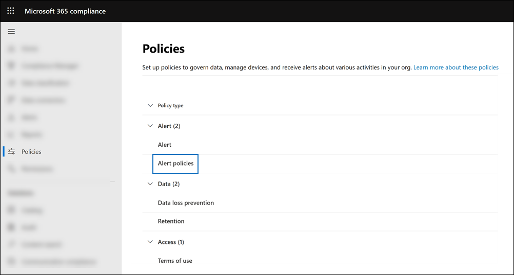
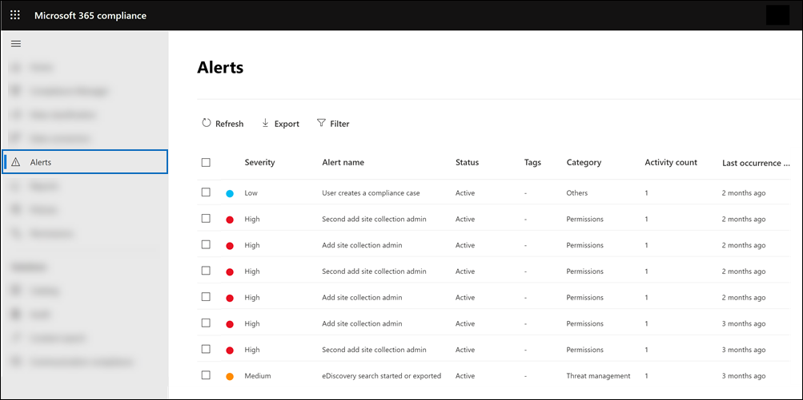

# <a name="alert-policies-in-the-microsoft-365-compliance-center"></a><span data-ttu-id="8d513-103">Políticas de alerta no Centro de conformidade do Microsoft 365</span><span class="sxs-lookup"><span data-stu-id="8d513-103">Alert policies in the Microsoft 365 compliance center</span></span>

<span data-ttu-id="8d513-104">Você pode usar as ferramentas de política de alerta e painel de alerta no Centro de conformidade do Microsoft 365 para criar políticas de alerta e exibir os alertas gerados quando os usuários executam atividades que corresponderem às condições de uma política de alerta.</span><span class="sxs-lookup"><span data-stu-id="8d513-104">You can use the alert policy and alert dashboard tools in the Microsoft 365 compliance center to create alert policies and then view the alerts generated when users perform activities that match the conditions of an alert policy.</span></span> <span data-ttu-id="8d513-105">Há várias políticas de alerta padrão que ajudam você a monitorar atividades como a atribuição de privilégios de administrador no Exchange Online, ataques de malware, campanhas de phishing e níveis incomuns de exclusões de arquivo e compartilhamento externo.</span><span class="sxs-lookup"><span data-stu-id="8d513-105">There are several default alert policies that help you monitor activities such as assigning admin privileges in Exchange Online, malware attacks, phishing campaigns, and unusual levels of file deletions and external sharing.</span></span>

<span data-ttu-id="8d513-106">As políticas de alerta permitem categorizar os alertas disparados por uma política, aplicar a política a todos os usuários em sua organização, definir um nível limite para quando um alerta for disparado e decidir se receberão notificações por email quando os alertas são disparados.</span><span class="sxs-lookup"><span data-stu-id="8d513-106">Alert policies let you categorize the alerts that are triggered by a policy, apply the policy to all users in your organization, set a threshold level for when an alert is triggered, and decide whether to receive email notifications when alerts are triggered.</span></span> <span data-ttu-id="8d513-107">Há também uma página **Alertas** no centro de conformidade onde você pode exibir e filtrar alertas, definir um status de alerta para ajudá-lo a gerenciar alertas e, em seguida, descartar alertas depois de resolver ou resolver o incidente subjacente.</span><span class="sxs-lookup"><span data-stu-id="8d513-107">There's also a **Alerts** page in the compliance center where you can view and filter alerts, set an alert status to help you manage alerts, and then dismiss alerts after you've addressed or resolved the underlying incident.</span></span>

> [!NOTE]
> <span data-ttu-id="8d513-108">As políticas de alerta estão disponíveis para organizações com uma assinatura Microsoft 365 Enterprise, Office 365 Enterprise ou Office 365 US Government E1/F1/G1, E3/F3/G3 ou E5/G5.</span><span class="sxs-lookup"><span data-stu-id="8d513-108">Alert policies are available for organizations with a Microsoft 365 Enterprise, Office 365 Enterprise, or Office 365 US Government E1/F1/G1, E3/F3/G3, or E5/G5 subscription.</span></span> <span data-ttu-id="8d513-109">A funcionalidade avançada só está disponível para organizações com uma assinatura E5/G5 ou para organizações que têm uma assinatura E1/F1/G1 ou E3/F3/G3 e um Microsoft Defender para Office 365 P2 ou um Microsoft 365 E5 Compliance ou uma assinatura de complemento de Descoberta e Auditoria e Descoberta E5.</span><span class="sxs-lookup"><span data-stu-id="8d513-109">Advanced functionality is only available for organizations with an E5/G5 subscription, or for organizations that have an E1/F1/G1 or E3/F3/G3 subscription and a Microsoft Defender for Office 365 P2 or a Microsoft 365 E5 Compliance or an E5 eDiscovery and Audit add-on subscription.</span></span> <span data-ttu-id="8d513-110">A funcionalidade que requer uma assinatura E5/G5 ou complemento é realçada neste tópico.</span><span class="sxs-lookup"><span data-stu-id="8d513-110">The functionality that requires an E5/G5 or add-on subscription is highlighted in this topic.</span></span> <span data-ttu-id="8d513-111">Observe também que as políticas de alerta estão disponíveis nos ambientes Office 365 GCC, GCC Alta e DoD us.</span><span class="sxs-lookup"><span data-stu-id="8d513-111">Also note that alert policies are available in Office 365 GCC, GCC High, and DoD US government environments.</span></span>

## <a name="how-alert-policies-work"></a><span data-ttu-id="8d513-112">Como funcionam as políticas de alerta</span><span class="sxs-lookup"><span data-stu-id="8d513-112">How alert policies work</span></span>

<span data-ttu-id="8d513-113">Aqui está uma visão geral rápida de como as políticas de alerta funcionam e os alertas que são disparados quando a atividade do usuário ou do administrador corresponde às condições de uma política de alerta.</span><span class="sxs-lookup"><span data-stu-id="8d513-113">Here's a quick overview of how alert policies work and the alerts that are triggers when user or admin activity matches the conditions of an alert policy.</span></span>


1. <span data-ttu-id="8d513-115">Um administrador em sua organização cria, configura e ativas uma política de alerta usando a página Políticas **de** alerta no centro de conformidade.</span><span class="sxs-lookup"><span data-stu-id="8d513-115">An admin in your organization creates, configures, and turns on an alert policy by using the **Alert policies** page in the compliance center.</span></span> <span data-ttu-id="8d513-116">Você também pode criar políticas de alerta usando o cmdlet [New-ProtectionAlert](/powershell/module/exchange/new-protectionalert) no Centro de Conformidade & Segurança do PowerShell.</span><span class="sxs-lookup"><span data-stu-id="8d513-116">You can also create alert policies by using the [New-ProtectionAlert](/powershell/module/exchange/new-protectionalert) cmdlet in Security & Compliance Center PowerShell.</span></span>

   <span data-ttu-id="8d513-117">Para criar políticas de alerta, você precisa receber a função Gerenciar Alertas ou a função Configuração da Organização no centro de conformidade.</span><span class="sxs-lookup"><span data-stu-id="8d513-117">To create alert policies, you have to be assigned the Manage Alerts role or the Organization Configuration role in the compliance center.</span></span>

   > [!NOTE]
   > <span data-ttu-id="8d513-118">Leva até 24 horas após a criação ou atualização de uma política de alerta antes que os alertas possam ser disparados pela política.</span><span class="sxs-lookup"><span data-stu-id="8d513-118">It takes up to 24 hours after creating or updating an alert policy before alerts can be triggered by the policy.</span></span> <span data-ttu-id="8d513-119">Isso porque a política precisa ser sincronizada com o mecanismo de detecção de alerta.</span><span class="sxs-lookup"><span data-stu-id="8d513-119">This is because the policy has to be synced to the alert detection engine.</span></span>

2. <span data-ttu-id="8d513-120">Um usuário executa uma atividade que corresponde às condições de uma política de alerta.</span><span class="sxs-lookup"><span data-stu-id="8d513-120">A user performs an activity that matches the conditions of an alert policy.</span></span> <span data-ttu-id="8d513-121">No caso de ataques de malware, as mensagens de email infectados enviadas aos usuários em sua organização disparam um alerta.</span><span class="sxs-lookup"><span data-stu-id="8d513-121">In the case of malware attacks, infected email messages sent to users in your organization trigger an alert.</span></span>

3. <span data-ttu-id="8d513-122">Microsoft 365 gera um alerta exibido na página **Alertas** no Centro de conformidade do Microsoft 365.</span><span class="sxs-lookup"><span data-stu-id="8d513-122">Microsoft 365 generates an alert that's displayed on the **Alerts** page in Microsoft 365 compliance center.</span></span> <span data-ttu-id="8d513-123">Além disso, se as notificações por email estão habilitadas para a política de alerta, a Microsoft envia uma notificação para uma lista de destinatários.</span><span class="sxs-lookup"><span data-stu-id="8d513-123">Also, if email notifications are enabled for the alert policy, Microsoft sends a notification to a list of recipients.</span></span> <span data-ttu-id="8d513-124">Os alertas que um administrador ou outros usuários podem ver que na página Alertas é determinado pelas funções atribuídas ao usuário.</span><span class="sxs-lookup"><span data-stu-id="8d513-124">The alerts that an admin or other users can see that on the Alerts page is determined by the roles assigned to the user.</span></span> <span data-ttu-id="8d513-125">Para obter mais informações, consulte [RBAC permissions required to view alerts](#rbac-permissions-required-to-view-alerts).</span><span class="sxs-lookup"><span data-stu-id="8d513-125">For more information, see [RBAC permissions required to view alerts](#rbac-permissions-required-to-view-alerts).</span></span>

4. <span data-ttu-id="8d513-126">Um administrador gerencia alertas no centro de conformidade.</span><span class="sxs-lookup"><span data-stu-id="8d513-126">An admin manages alerts in the compliance center.</span></span> <span data-ttu-id="8d513-127">Gerenciar alertas consiste em atribuir um status de alerta para ajudar a controlar e gerenciar qualquer investigação.</span><span class="sxs-lookup"><span data-stu-id="8d513-127">Managing alerts consists of assigning an alert status to help track and manage any investigation.</span></span>

## <a name="alert-policy-settings"></a><span data-ttu-id="8d513-128">Configurações de política de alerta</span><span class="sxs-lookup"><span data-stu-id="8d513-128">Alert policy settings</span></span>

<span data-ttu-id="8d513-129">Uma política de alerta consiste em um conjunto de regras e condições que definem a atividade do usuário ou administrador que gera um alerta, uma lista de usuários que disparam o alerta se executarem a atividade e um limite que define quantas vezes a atividade precisa ocorrer antes que um alerta seja disparado.</span><span class="sxs-lookup"><span data-stu-id="8d513-129">An alert policy consists of a set of rules and conditions that define the user or admin activity that generates an alert, a list of users who trigger the alert if they perform the activity, and a threshold that defines how many times the activity has to occur before an alert is triggered.</span></span> <span data-ttu-id="8d513-130">Você também categoriza a política e atribui a ela um nível de severidade.</span><span class="sxs-lookup"><span data-stu-id="8d513-130">You also categorize the policy and assign it a severity level.</span></span> <span data-ttu-id="8d513-131">Essas duas configurações ajudam você a gerenciar políticas de alerta (e os alertas disparados quando as condições de política são corresponderem) porque você pode filtrar essas configurações ao gerenciar políticas e exibir alertas no centro de conformidade.</span><span class="sxs-lookup"><span data-stu-id="8d513-131">These two settings help you manage alert policies (and the alerts that are triggered when the policy conditions are matched) because you can filter on these settings when managing policies and viewing alerts in the compliance center.</span></span> <span data-ttu-id="8d513-132">Por exemplo, você pode exibir alertas que corresponderem às condições da mesma categoria ou exibir alertas com o mesmo nível de gravidade.</span><span class="sxs-lookup"><span data-stu-id="8d513-132">For example, you can view alerts that match the conditions from the same category or view alerts with the same severity level.</span></span>

<span data-ttu-id="8d513-133">**Para exibir e criar políticas de alerta:**</span><span class="sxs-lookup"><span data-stu-id="8d513-133">**To view and create alert policies:**</span></span>

<span data-ttu-id="8d513-134">Vá para <https://compliance.microsoft.com> e selecione Políticas Políticas   >  **alerta** políticas  >  **de alerta.**</span><span class="sxs-lookup"><span data-stu-id="8d513-134">Go to <https://compliance.microsoft.com> and then select **Policies** > **Alert** > **Alert policies**.</span></span> <span data-ttu-id="8d513-135">Como alternativa, você pode ir diretamente para <https://compliance.microsoft.com/alertpolicies> .</span><span class="sxs-lookup"><span data-stu-id="8d513-135">Alternatively, you can go directly to <https://compliance.microsoft.com/alertpolicies>.</span></span>



<span data-ttu-id="8d513-137">Uma política de alerta consiste nas seguintes configurações e condições.</span><span class="sxs-lookup"><span data-stu-id="8d513-137">An alert policy consists of the following settings and conditions.</span></span>

- <span data-ttu-id="8d513-138">**Atividade que o alerta está rastreando**.</span><span class="sxs-lookup"><span data-stu-id="8d513-138">**Activity the alert is tracking**.</span></span> <span data-ttu-id="8d513-139">Você cria uma política para rastrear uma atividade ou, em alguns casos, algumas atividades relacionadas, como compartilhar um arquivo com um usuário externo compartilhando-o, atribuindo permissões de acesso ou criando um link anônimo.</span><span class="sxs-lookup"><span data-stu-id="8d513-139">You create a policy to track an activity or in some cases a few related activities, such a sharing a file with an external user by sharing it, assigning access permissions, or creating an anonymous link.</span></span> <span data-ttu-id="8d513-140">Quando um usuário executa a atividade definida pela política, um alerta é disparado com base nas configurações de limite de alerta.</span><span class="sxs-lookup"><span data-stu-id="8d513-140">When a user performs the activity defined by the policy, an alert is triggered based on the alert threshold settings.</span></span>

    > [!NOTE]
    > <span data-ttu-id="8d513-141">As atividades que você pode acompanhar dependem do plano de governo Office 365 Enterprise ou Office 365 da sua organização.</span><span class="sxs-lookup"><span data-stu-id="8d513-141">The activities that you can track depend on your organization's Office 365 Enterprise or Office 365 US Government plan.</span></span> <span data-ttu-id="8d513-142">Em geral, as atividades relacionadas a campanhas de malware e ataques de phishing exigem uma assinatura E5/G5 ou uma assinatura de complemento E1/F1/G1 ou E3/F3/G3 com uma assinatura de complemento do Plano 2 do [Defender](../security/office-365-security/defender-for-office-365.md) para Office 365.</span><span class="sxs-lookup"><span data-stu-id="8d513-142">In general, activities related to malware campaigns and phishing attacks require an E5/G5 subscription or an E1/F1/G1 or E3/F3/G3 subscription with an [Defender for Office 365](../security/office-365-security/defender-for-office-365.md) Plan 2 add-on subscription.</span></span>

- <span data-ttu-id="8d513-143">**Condições de atividade**.</span><span class="sxs-lookup"><span data-stu-id="8d513-143">**Activity conditions**.</span></span> <span data-ttu-id="8d513-144">Para a maioria das atividades, você pode definir condições adicionais que devem ser atendidas para disparar um alerta.</span><span class="sxs-lookup"><span data-stu-id="8d513-144">For most activities, you can define additional conditions that must be met to trigger an alert.</span></span> <span data-ttu-id="8d513-145">As condições comuns incluem endereços IP (para que um alerta seja disparado quando o usuário executa a atividade em um computador com um endereço IP específico ou dentro de um intervalo de endereços IP), se um alerta é disparado se um usuário ou usuário específico executa essa atividade e se a atividade é executada em um nome de arquivo ou URL específico.</span><span class="sxs-lookup"><span data-stu-id="8d513-145">Common conditions include IP addresses (so that an alert is triggered when the user performs the activity on a computer with a specific IP address or within an IP address range), whether an alert is triggered if a specific user or users perform that activity, and whether the activity is performed on a specific file name or URL.</span></span> <span data-ttu-id="8d513-146">Você também pode configurar uma condição que dispara um alerta quando a atividade é executada por qualquer usuário em sua organização.</span><span class="sxs-lookup"><span data-stu-id="8d513-146">You can also configure a condition that triggers an alert when the activity is performed by any user in your organization.</span></span> <span data-ttu-id="8d513-147">As condições disponíveis dependem da atividade selecionada.</span><span class="sxs-lookup"><span data-stu-id="8d513-147">The available conditions are dependent on the selected activity.</span></span>

- <span data-ttu-id="8d513-148">**Quando o alerta é disparado**.</span><span class="sxs-lookup"><span data-stu-id="8d513-148">**When the alert is triggered**.</span></span> <span data-ttu-id="8d513-149">Você pode configurar uma configuração que define com que frequência uma atividade pode ocorrer antes que um alerta seja disparado.</span><span class="sxs-lookup"><span data-stu-id="8d513-149">You can configure a setting that defines how often an activity can occur before an alert is triggered.</span></span> <span data-ttu-id="8d513-150">Isso permite configurar uma política para gerar um alerta sempre que uma atividade corresponde às condições da política, quando um determinado limite é excedido ou quando a ocorrência da atividade que o alerta está rastreando se torna incomum para sua organização.</span><span class="sxs-lookup"><span data-stu-id="8d513-150">This allows you to set up a policy to generate an alert every time an activity matches the policy conditions, when a certain threshold is exceeded, or when the occurrence of the activity the alert is tracking becomes unusual for your organization.</span></span>

    

    <span data-ttu-id="8d513-152">Se você selecionar a configuração com base em atividades incomuns, a Microsoft estabelecerá um valor de linha de base que define a frequência normal da atividade selecionada.</span><span class="sxs-lookup"><span data-stu-id="8d513-152">If you select the setting based on unusual activity, Microsoft establishes a baseline value that defines the normal frequency for the selected activity.</span></span> <span data-ttu-id="8d513-153">Leva até sete dias para estabelecer essa linha de base, durante o qual os alertas não serão gerados.</span><span class="sxs-lookup"><span data-stu-id="8d513-153">It takes up to seven days to establish this baseline, during which alerts won't be generated.</span></span> <span data-ttu-id="8d513-154">Depois que a linha de base é estabelecida, um alerta é disparado quando a frequência da atividade controlada pela política de alerta excede muito o valor da linha de base.</span><span class="sxs-lookup"><span data-stu-id="8d513-154">After the baseline is established, an alert is triggered when the frequency of the activity tracked by the alert policy greatly exceeds the baseline value.</span></span> <span data-ttu-id="8d513-155">Para atividades relacionadas à auditoria (como atividades de arquivo e pasta), você pode estabelecer uma linha de base com base em um único usuário ou com base em todos os usuários em sua organização; para atividades relacionadas a malware, você pode estabelecer uma linha de base com base em uma única família de malware, um único destinatário ou todas as mensagens em sua organização.</span><span class="sxs-lookup"><span data-stu-id="8d513-155">For auditing-related activities (such as file and folder activities), you can establish a baseline based on a single user or based on all users in your organization; for malware-related activities, you can establish a baseline based on a single malware family, a single recipient, or all messages in your organization.</span></span>

    > [!NOTE]
    > <span data-ttu-id="8d513-156">A capacidade de configurar políticas de alerta com base em um limite ou com base em atividades incomuns requer uma assinatura E5/G5 ou uma assinatura E1/F1/G1 ou E3/F3/G3 com um Microsoft Defender para Office 365 P2, Microsoft 365 E5 Compliance ou Microsoft 365 assinatura de complemento descoberta e auditoria.</span><span class="sxs-lookup"><span data-stu-id="8d513-156">The ability to configure alert policies based on a threshold or based on unusual activity requires an E5/G5 subscription, or an E1/F1/G1 or E3/F3/G3 subscription with a Microsoft Defender for Office 365 P2, Microsoft 365 E5 Compliance, or Microsoft 365 eDiscovery and Audit add-on subscription.</span></span> <span data-ttu-id="8d513-157">As organizações com uma assinatura E1/F1/G1 e E3/F3/G3 só podem criar políticas de alerta em que um alerta é disparado sempre que uma atividade ocorre.</span><span class="sxs-lookup"><span data-stu-id="8d513-157">Organizations with an E1/F1/G1 and E3/F3/G3 subscription can only create alert policies where an alert is triggered every time that an activity occurs.</span></span>

- <span data-ttu-id="8d513-158">**Categoria de alerta**.</span><span class="sxs-lookup"><span data-stu-id="8d513-158">**Alert category**.</span></span> <span data-ttu-id="8d513-159">Para ajudar a controlar e gerenciar os alertas gerados por uma política, você pode atribuir uma das seguintes categorias a uma política.</span><span class="sxs-lookup"><span data-stu-id="8d513-159">To help with tracking and managing the alerts generated by a policy, you can assign one of the following categories to a policy.</span></span>

  - <span data-ttu-id="8d513-160">Prevenção contra perda de dados</span><span class="sxs-lookup"><span data-stu-id="8d513-160">Data loss prevention</span></span>

  - <span data-ttu-id="8d513-161">Governança de informações</span><span class="sxs-lookup"><span data-stu-id="8d513-161">Information governance</span></span>

  - <span data-ttu-id="8d513-162">Fluxo de mensagens</span><span class="sxs-lookup"><span data-stu-id="8d513-162">Mail flow</span></span>

  - <span data-ttu-id="8d513-163">Permissões</span><span class="sxs-lookup"><span data-stu-id="8d513-163">Permissions</span></span>

  - <span data-ttu-id="8d513-164">Gerenciamento de ameaças</span><span class="sxs-lookup"><span data-stu-id="8d513-164">Threat management</span></span>

  - <span data-ttu-id="8d513-165">Outros</span><span class="sxs-lookup"><span data-stu-id="8d513-165">Others</span></span>

  <span data-ttu-id="8d513-166">Quando ocorre uma atividade que corresponde às condições da política de alerta, o alerta gerado é marcado com a categoria definida nesta configuração.</span><span class="sxs-lookup"><span data-stu-id="8d513-166">When an activity occurs that matches the conditions of the alert policy, the alert that's generated is tagged with the category defined in this setting.</span></span> <span data-ttu-id="8d513-167">Isso permite rastrear e gerenciar alertas com a mesma configuração de categoria na página **Alertas** no centro de conformidade porque você pode classificar e filtrar alertas com base na categoria.</span><span class="sxs-lookup"><span data-stu-id="8d513-167">This allows you to track and manage alerts that have the same category setting on the **Alerts** page in the compliance center because you can sort and filter alerts based on category.</span></span>

- <span data-ttu-id="8d513-168">**Gravidade do alerta**.</span><span class="sxs-lookup"><span data-stu-id="8d513-168">**Alert severity**.</span></span> <span data-ttu-id="8d513-169">Semelhante à categoria de alerta, você atribui um atributo de severidade (**Baixo,** **Médio,** **Alto** ou **Informacional**) às políticas de alerta.</span><span class="sxs-lookup"><span data-stu-id="8d513-169">Similar to the alert category, you assign a severity attribute (**Low**, **Medium**, **High**, or **Informational**) to alert policies.</span></span> <span data-ttu-id="8d513-170">Assim como a categoria de alerta, quando ocorre uma atividade que corresponde às condições da política de alerta, o alerta gerado é marcado com o mesmo nível de gravidade definido para a política de alerta.</span><span class="sxs-lookup"><span data-stu-id="8d513-170">Like the alert category, when an activity occurs that matches the conditions of the alert policy, the alert that's generated is tagged with the same severity level that's set for the alert policy.</span></span> <span data-ttu-id="8d513-171">Novamente, isso permite rastrear e gerenciar alertas com a mesma configuração de gravidade na página **Alertas.**</span><span class="sxs-lookup"><span data-stu-id="8d513-171">Again, this allows you to track and manage alerts that have the same severity setting on the **Alerts** page.</span></span> <span data-ttu-id="8d513-172">Por exemplo, você pode filtrar **a** lista de alertas para que apenas alertas com alta gravidade sejam exibidos.</span><span class="sxs-lookup"><span data-stu-id="8d513-172">For example, you can filter the list of alerts so that only alerts with a **High** severity are displayed.</span></span>

    > [!TIP]
    > <span data-ttu-id="8d513-173">Ao configurar uma política de alerta, considere atribuir uma severidade maior a atividades que podem resultar em consequências gravemente negativas, como a detecção de malware após a entrega aos usuários, a visualização de dados confidenciais ou confidenciais, o compartilhamento de dados com usuários externos ou outras atividades que podem resultar em perda de dados ou ameaças à segurança.</span><span class="sxs-lookup"><span data-stu-id="8d513-173">When setting up an alert policy, consider assigning a higher severity to activities that can result in severely negative consequences, such as detection of malware after delivery to users, viewing of sensitive or classified data, sharing data with external users, or other activities that can result in data loss or security threats.</span></span> <span data-ttu-id="8d513-174">Isso pode ajudá-lo a priorizar alertas e as ações que você toma para investigar e resolver as causas subjacentes.</span><span class="sxs-lookup"><span data-stu-id="8d513-174">This can help you prioritize alerts and the actions you take to investigate and resolve the underlying causes.</span></span>

- <span data-ttu-id="8d513-175">**Notificações por email**.</span><span class="sxs-lookup"><span data-stu-id="8d513-175">**Email notifications**.</span></span> <span data-ttu-id="8d513-176">Você pode configurar a política para que as notificações de email sejam enviadas (ou não enviadas) para uma lista de usuários quando um alerta é disparado.</span><span class="sxs-lookup"><span data-stu-id="8d513-176">You can set up the policy so that email notifications are sent (or not sent) to a list of users when an alert is triggered.</span></span> <span data-ttu-id="8d513-177">Você também pode definir um limite de notificação diário para que, uma vez atingido o número máximo de notificações, não sejam enviadas mais notificações para o alerta durante esse dia.</span><span class="sxs-lookup"><span data-stu-id="8d513-177">You can also set a daily notification limit so that once the maximum number of notifications has been reached, no more notifications are sent for the alert during that day.</span></span> <span data-ttu-id="8d513-178">Além das notificações por email, você ou outros administradores podem exibir os alertas disparados por uma política na página **Alertas.**</span><span class="sxs-lookup"><span data-stu-id="8d513-178">In addition to email notifications, you or other administrators can view the alerts that are triggered by a policy on the **Alerts** page.</span></span> <span data-ttu-id="8d513-179">Considere a habilitação de notificações por email para políticas de alerta de uma categoria específica ou que tenham uma configuração de gravidade mais alta.</span><span class="sxs-lookup"><span data-stu-id="8d513-179">Consider enabling email notifications for alert policies of a specific category or that have a higher severity setting.</span></span>

## <a name="default-alert-policies"></a><span data-ttu-id="8d513-180">Políticas de alerta padrão</span><span class="sxs-lookup"><span data-stu-id="8d513-180">Default alert policies</span></span>

<span data-ttu-id="8d513-181">A Microsoft fornece políticas de alerta internas que ajudam a identificar Exchange abuso de permissões de administrador, atividade de malware, possíveis ameaças externas e internas e riscos de governança de informações.</span><span class="sxs-lookup"><span data-stu-id="8d513-181">Microsoft provides built-in alert policies that help identify Exchange admin permissions abuse, malware activity, potential external and internal threats, and information governance risks.</span></span> <span data-ttu-id="8d513-182">Na página **Políticas de alerta,** os nomes dessas políticas internas estão em negrito e o tipo de política é definido como **System**.</span><span class="sxs-lookup"><span data-stu-id="8d513-182">On the **Alert policies** page, the names of these built-in policies are in bold and the policy type is defined as **System**.</span></span> <span data-ttu-id="8d513-183">Essas políticas são ativas por padrão.</span><span class="sxs-lookup"><span data-stu-id="8d513-183">These policies are turned on by default.</span></span> <span data-ttu-id="8d513-184">Você pode desativar essas políticas (ou voltar a ativar), configurar uma lista de destinatários para o que enviar notificações por email e definir um limite de notificação diário.</span><span class="sxs-lookup"><span data-stu-id="8d513-184">You can turn off these policies (or back on again), set up a list of recipients to send email notifications to, and set a daily notification limit.</span></span> <span data-ttu-id="8d513-185">As outras configurações dessas políticas não podem ser editadas.</span><span class="sxs-lookup"><span data-stu-id="8d513-185">The other settings for these policies can't be edited.</span></span>

<span data-ttu-id="8d513-186">A tabela a seguir lista e descreve as políticas de alerta padrão disponíveis e a categoria à que cada política é atribuída.</span><span class="sxs-lookup"><span data-stu-id="8d513-186">The following table lists and describes the available default alert policies and the category each policy is assigned to.</span></span> <span data-ttu-id="8d513-187">A categoria é usada para determinar quais alertas um usuário pode exibir na página Alertas.</span><span class="sxs-lookup"><span data-stu-id="8d513-187">The category is used to determine which alerts a user can view on the Alerts page.</span></span> <span data-ttu-id="8d513-188">Para obter mais informações, consulte [RBAC permissions required to view alerts](#rbac-permissions-required-to-view-alerts).</span><span class="sxs-lookup"><span data-stu-id="8d513-188">For more information, see [RBAC permissions required to view alerts](#rbac-permissions-required-to-view-alerts).</span></span>

<span data-ttu-id="8d513-189">A tabela também indica o plano Office 365 Enterprise e Office 365 us government necessário para cada um deles.</span><span class="sxs-lookup"><span data-stu-id="8d513-189">The table also indicates the Office 365 Enterprise and Office 365 US Government plan required for each one.</span></span> <span data-ttu-id="8d513-190">Algumas políticas de alerta padrão estarão disponíveis se sua organização tiver a assinatura de complemento apropriada, além de uma assinatura E1/F1/G1 ou E3/F3/G3.</span><span class="sxs-lookup"><span data-stu-id="8d513-190">Some default alert policies are available if your organization has the appropriate add-on subscription in addition to an E1/F1/G1 or E3/F3/G3 subscription.</span></span>

| <span data-ttu-id="8d513-191">Política de alerta padrão</span><span class="sxs-lookup"><span data-stu-id="8d513-191">Default alert policy</span></span> | <span data-ttu-id="8d513-192">Descrição</span><span class="sxs-lookup"><span data-stu-id="8d513-192">Description</span></span> | <span data-ttu-id="8d513-193">Categoria</span><span class="sxs-lookup"><span data-stu-id="8d513-193">Category</span></span> | <span data-ttu-id="8d513-194">Enterprise assinatura</span><span class="sxs-lookup"><span data-stu-id="8d513-194">Enterprise subscription</span></span> |
|:-----|:-----|:-----|:-----|
|<span data-ttu-id="8d513-195">**Um clique de URL potencialmente mal-intencionado foi detectado**</span><span class="sxs-lookup"><span data-stu-id="8d513-195">**A potentially malicious URL click was detected**</span></span>|<span data-ttu-id="8d513-196">Gera um alerta quando um [](../security/office-365-security/safe-links.md) usuário protegido por links Cofre em sua organização clica em um link mal-intencionado.</span><span class="sxs-lookup"><span data-stu-id="8d513-196">Generates an alert when a user protected by [Safe Links](../security/office-365-security/safe-links.md) in your organization clicks a malicious link.</span></span> <span data-ttu-id="8d513-197">Esse evento é acionado quando as alterações de veredito de URL são identificadas pelo Microsoft Defender para Office 365 ou quando os usuários substituem as páginas de Links do Cofre (com base na política de links de Microsoft 365 Cofre para empresas).</span><span class="sxs-lookup"><span data-stu-id="8d513-197">This event is triggered when URL verdict changes are identified by Microsoft Defender for Office 365 or when users override the Safe Links pages (based on your organization's Microsoft 365 for business Safe Links policy).</span></span> <span data-ttu-id="8d513-198">Esta política de alerta tem uma **configuração de** alta gravidade.</span><span class="sxs-lookup"><span data-stu-id="8d513-198">This alert policy has a **High** severity setting.</span></span> <span data-ttu-id="8d513-199">Para clientes do Defender Office 365 P2, E5, G5, esse alerta dispara automaticamente a investigação e a resposta automatizadas [no Office 365](../security/office-365-security/office-365-air.md).</span><span class="sxs-lookup"><span data-stu-id="8d513-199">For Defender for Office 365 P2, E5, G5 customers, this alert automatically triggers [automated investigation and response in Office 365](../security/office-365-security/office-365-air.md).</span></span> <span data-ttu-id="8d513-200">Para obter mais informações sobre eventos que disparam esse alerta, consulte [Set up Cofre Links policies](../security/office-365-security/set-up-safe-links-policies.md).</span><span class="sxs-lookup"><span data-stu-id="8d513-200">For more information on events that trigger this alert, see [Set up Safe Links policies](../security/office-365-security/set-up-safe-links-policies.md).</span></span>|<span data-ttu-id="8d513-201">Gerenciamento de ameaças</span><span class="sxs-lookup"><span data-stu-id="8d513-201">Threat management</span></span>|<span data-ttu-id="8d513-202">E5/G5 ou Defender para Office 365 assinatura de complemento P2</span><span class="sxs-lookup"><span data-stu-id="8d513-202">E5/G5 or Defender for Office 365 P2 add-on subscription</span></span>|
|<span data-ttu-id="8d513-203">**Resultado do Envio de Administrador concluído**</span><span class="sxs-lookup"><span data-stu-id="8d513-203">**Admin Submission result completed**</span></span>|<span data-ttu-id="8d513-204">Gera um alerta quando um [Envio de Administrador](../security/office-365-security/admin-submission.md) conclui a varredura da entidade enviada.</span><span class="sxs-lookup"><span data-stu-id="8d513-204">Generates an alert when an [Admin Submission](../security/office-365-security/admin-submission.md) completes the rescan of the submitted entity.</span></span> <span data-ttu-id="8d513-205">Um alerta será disparado sempre que um resultado de nova varredura for renderizado de um Envio de Administrador.</span><span class="sxs-lookup"><span data-stu-id="8d513-205">An alert will be triggered every time a rescan result is rendered from an Admin Submission.</span></span> <span data-ttu-id="8d513-206">Esses alertas devem lembrá-lo de revisar os resultados de [envios](https://protection.office.com/reportsubmission)anteriores, enviar mensagens relatadas pelo usuário para obter a verificação de política mais recente e analisar novamente os vereditos e ajudá-lo a determinar se as políticas de filtragem em sua organização estão tendo o impacto pretendido.</span><span class="sxs-lookup"><span data-stu-id="8d513-206">These alerts are meant to remind you to [review the results of previous submissions](https://protection.office.com/reportsubmission), submit user reported messages to get the latest policy check and rescan verdicts, and help you determine if the filtering policies in your organization are having the intended impact.</span></span> <span data-ttu-id="8d513-207">Esta política tem uma **configuração de** severidade informacional.</span><span class="sxs-lookup"><span data-stu-id="8d513-207">This policy has a **Informational** severity setting.</span></span>|<span data-ttu-id="8d513-208">Gerenciamento de ameaças</span><span class="sxs-lookup"><span data-stu-id="8d513-208">Threat management</span></span>|<span data-ttu-id="8d513-209">E1/F1, E3/F3 ou E5</span><span class="sxs-lookup"><span data-stu-id="8d513-209">E1/F1, E3/F3, or E5</span></span>|
|<span data-ttu-id="8d513-210">**O administrador acionou a investigação manual de email**</span><span class="sxs-lookup"><span data-stu-id="8d513-210">**Admin triggered manual investigation of email**</span></span>|<span data-ttu-id="8d513-211">Gera um alerta quando um administrador dispara a investigação manual de um email do Explorador de Ameaças.</span><span class="sxs-lookup"><span data-stu-id="8d513-211">Generates an alert when an admin triggers the manual investigation of an email from Threat Explorer.</span></span> <span data-ttu-id="8d513-212">Para obter mais informações, consulte [Example: A security administrator triggers an investigation from Threat Explorer](../security/office-365-security/automated-investigation-response-office.md#example-a-security-administrator-triggers-an-investigation-from-threat-explorer).</span><span class="sxs-lookup"><span data-stu-id="8d513-212">For more information, see [Example: A security administrator triggers an investigation from Threat Explorer](../security/office-365-security/automated-investigation-response-office.md#example-a-security-administrator-triggers-an-investigation-from-threat-explorer).</span></span> <span data-ttu-id="8d513-213">Esse alerta notifica sua organização de que a investigação foi iniciada.</span><span class="sxs-lookup"><span data-stu-id="8d513-213">This alert notifies your organization that the investigation was started.</span></span> <span data-ttu-id="8d513-214">O alerta fornece informações sobre quem disparou e inclui um link para a investigação.</span><span class="sxs-lookup"><span data-stu-id="8d513-214">The alert provides information about who triggered it and includes a link to the investigation.</span></span> <span data-ttu-id="8d513-215">Esta política tem uma **configuração de** severidade informacional.</span><span class="sxs-lookup"><span data-stu-id="8d513-215">This policy has an **Informational** severity setting.</span></span>|<span data-ttu-id="8d513-216">Gerenciamento de ameaças</span><span class="sxs-lookup"><span data-stu-id="8d513-216">Threat management</span></span>| <span data-ttu-id="8d513-217">E5/G5 ou Microsoft Defender para Office 365 assinatura de complemento P2</span><span class="sxs-lookup"><span data-stu-id="8d513-217">E5/G5 or Microsoft Defender for Office 365 P2 add-on subscription</span></span>| 
|<span data-ttu-id="8d513-218">**Criação de regra de encaminhamento/redirecionamento**</span><span class="sxs-lookup"><span data-stu-id="8d513-218">**Creation of forwarding/redirect rule**</span></span>|<span data-ttu-id="8d513-219">Gera um alerta quando alguém em sua organização cria uma regra de caixa de entrada para sua caixa de correio que encaminha ou redireciona mensagens para outra conta de email.</span><span class="sxs-lookup"><span data-stu-id="8d513-219">Generates an alert when someone in your organization creates an inbox rule for their mailbox that forwards or redirects messages to another email account.</span></span> <span data-ttu-id="8d513-220">Essa política só rastreia regras de caixa de entrada criadas usando Outlook na Web (anteriormente conhecido como Outlook Web App) ou Exchange Online PowerShell.</span><span class="sxs-lookup"><span data-stu-id="8d513-220">This policy only tracks inbox rules that are created using Outlook on the web (formerly known as Outlook Web App) or Exchange Online PowerShell.</span></span> <span data-ttu-id="8d513-221">Esta política tem uma **configuração de** severidade informacional.</span><span class="sxs-lookup"><span data-stu-id="8d513-221">This policy has a **Informational** severity setting.</span></span> <span data-ttu-id="8d513-222">Para obter mais informações sobre como usar regras de caixa de entrada para encaminhar e redirecionar emails no Outlook na Web, consulte [Use rules in Outlook na Web to automatically](https://support.office.com/article/1433e3a0-7fb0-4999-b536-50e05cb67fed)forward messages to another account .</span><span class="sxs-lookup"><span data-stu-id="8d513-222">For more information about using inbox rules to forward and redirect email in Outlook on the web, see [Use rules in Outlook on the web to automatically forward messages to another account](https://support.office.com/article/1433e3a0-7fb0-4999-b536-50e05cb67fed).</span></span>|<span data-ttu-id="8d513-223">Gerenciamento de ameaças</span><span class="sxs-lookup"><span data-stu-id="8d513-223">Threat management</span></span>|<span data-ttu-id="8d513-224">E1/F1/G1, E3/F3/G3 ou E5/G5</span><span class="sxs-lookup"><span data-stu-id="8d513-224">E1/F1/G1, E3/F3/G3, or E5/G5</span></span>|
|<span data-ttu-id="8d513-225">**Pesquisa de Descoberta Desdiscovery iniciada ou exportada**</span><span class="sxs-lookup"><span data-stu-id="8d513-225">**eDiscovery search started or exported**</span></span>|<span data-ttu-id="8d513-226">Gera um alerta quando alguém usa a ferramenta de pesquisa de conteúdo no centro de segurança e conformidade.</span><span class="sxs-lookup"><span data-stu-id="8d513-226">Generates an alert when someone uses the Content search tool in the Security and compliance center.</span></span> <span data-ttu-id="8d513-227">Um alerta é acionado quando as seguintes atividades de pesquisa de conteúdo são executadas:</span><span class="sxs-lookup"><span data-stu-id="8d513-227">An alert is triggered when the following content search activities are performed:</span></span> <br/><br/><span data-ttu-id="8d513-228">\* Uma pesquisa de conteúdo é iniciada</span><span class="sxs-lookup"><span data-stu-id="8d513-228">\* A content search is started</span></span><br/><span data-ttu-id="8d513-229">\* Os resultados de uma pesquisa de conteúdo são exportados</span><span class="sxs-lookup"><span data-stu-id="8d513-229">\* The results of a content search are exported</span></span><br/><span data-ttu-id="8d513-230">\* Um relatório de pesquisa de conteúdo é exportado</span><span class="sxs-lookup"><span data-stu-id="8d513-230">\* A content search report is exported</span></span><br/><br/><span data-ttu-id="8d513-231">Os alertas também são acionados quando as atividades de pesquisa de conteúdo anteriores são executadas em associação com um caso de Descoberta E.</span><span class="sxs-lookup"><span data-stu-id="8d513-231">Alerts are also triggered when the previous content search activities are performed in association with an eDiscovery case.</span></span> <span data-ttu-id="8d513-232">Esta política tem uma **configuração de** severidade informacional.</span><span class="sxs-lookup"><span data-stu-id="8d513-232">This policy has a **Informational** severity setting.</span></span> <span data-ttu-id="8d513-233">Para obter mais informações sobre atividades de pesquisa de conteúdo, consulte [Search for eDiscovery activities in the audit log](search-for-ediscovery-activities-in-the-audit-log.md#ediscovery-activities).</span><span class="sxs-lookup"><span data-stu-id="8d513-233">For more information about content search activities, see [Search for eDiscovery activities in the audit log](search-for-ediscovery-activities-in-the-audit-log.md#ediscovery-activities).</span></span>|<span data-ttu-id="8d513-234">Gerenciamento de ameaças</span><span class="sxs-lookup"><span data-stu-id="8d513-234">Threat management</span></span>|<span data-ttu-id="8d513-235">E1/F1/G1, E3/F3/G3 ou E5/G5</span><span class="sxs-lookup"><span data-stu-id="8d513-235">E1/F1/G1, E3/F3/G3, or E5/G5</span></span>|
|<span data-ttu-id="8d513-236">**Elevação do Exchange de administrador**</span><span class="sxs-lookup"><span data-stu-id="8d513-236">**Elevation of Exchange admin privilege**</span></span>|<span data-ttu-id="8d513-237">Gera um alerta quando alguém recebe permissões administrativas em sua Exchange Online organização.</span><span class="sxs-lookup"><span data-stu-id="8d513-237">Generates an alert when someone is assigned administrative permissions in your Exchange Online organization.</span></span> <span data-ttu-id="8d513-238">Por exemplo, quando um usuário é adicionado ao grupo de função Gerenciamento da Organização no Exchange Online.</span><span class="sxs-lookup"><span data-stu-id="8d513-238">For example, when a user is added to the Organization Management role group in Exchange Online.</span></span> <span data-ttu-id="8d513-239">Esta política tem uma **configuração De** baixa gravidade.</span><span class="sxs-lookup"><span data-stu-id="8d513-239">This policy has a **Low** severity setting.</span></span>|<span data-ttu-id="8d513-240">Permissões</span><span class="sxs-lookup"><span data-stu-id="8d513-240">Permissions</span></span>|<span data-ttu-id="8d513-241">E1/F1/G1, E3/F3/G3 ou E5/G5</span><span class="sxs-lookup"><span data-stu-id="8d513-241">E1/F1/G1, E3/F3/G3, or E5/G5</span></span>|
|<span data-ttu-id="8d513-242">**Mensagens de email contendo malware removido após a entrega**</span><span class="sxs-lookup"><span data-stu-id="8d513-242">**Email messages containing malware removed after delivery**</span></span>|<span data-ttu-id="8d513-243">Gera um alerta quando todas as mensagens que contêm malware são entregues às caixas de correio em sua organização.</span><span class="sxs-lookup"><span data-stu-id="8d513-243">Generates an alert when any messages containing malware are delivered to mailboxes in your organization.</span></span> <span data-ttu-id="8d513-244">Se esse evento ocorrer, a Microsoft removerá as mensagens infectados de Exchange Online caixas de correio usando limpeza automática [zero hora](../security/office-365-security/zero-hour-auto-purge.md).</span><span class="sxs-lookup"><span data-stu-id="8d513-244">If this event occurs, Microsoft removes the infected messages from Exchange Online mailboxes using [Zero-hour auto purge](../security/office-365-security/zero-hour-auto-purge.md).</span></span> <span data-ttu-id="8d513-245">Esta política tem uma **configuração de severidade** informacional e dispara [automaticamente investigação e](../security/office-365-security/office-365-air.md)resposta automatizadas em Office 365 .</span><span class="sxs-lookup"><span data-stu-id="8d513-245">This policy has an **Informational** severity setting and automatically triggers [automated investigation and response in Office 365](../security/office-365-security/office-365-air.md).</span></span>|<span data-ttu-id="8d513-246">Gerenciamento de ameaças</span><span class="sxs-lookup"><span data-stu-id="8d513-246">Threat management</span></span>|<span data-ttu-id="8d513-247">E5/G5 ou Microsoft Defender para Office 365 assinatura de complemento P2</span><span class="sxs-lookup"><span data-stu-id="8d513-247">E5/G5 or Microsoft Defender for Office 365 P2 add-on subscription</span></span>|
|<span data-ttu-id="8d513-248">**Mensagens de email contendo URLs de phishing removidas após a entrega**</span><span class="sxs-lookup"><span data-stu-id="8d513-248">**Email messages containing phish URLs removed after delivery**</span></span>|<span data-ttu-id="8d513-249">Gera um alerta quando todas as mensagens que contêm phishing são entregues às caixas de correio em sua organização.</span><span class="sxs-lookup"><span data-stu-id="8d513-249">Generates an alert when any messages containing phish are delivered to mailboxes in your organization.</span></span> <span data-ttu-id="8d513-250">Se esse evento ocorrer, a Microsoft removerá as mensagens infectados de Exchange Online caixas de correio usando limpeza automática [zero hora](../security/office-365-security/zero-hour-auto-purge.md).</span><span class="sxs-lookup"><span data-stu-id="8d513-250">If this event occurs, Microsoft removes the infected messages from Exchange Online mailboxes using [Zero-hour auto purge](../security/office-365-security/zero-hour-auto-purge.md).</span></span> <span data-ttu-id="8d513-251">Esta política tem uma **configuração de severidade** informacional e dispara [automaticamente investigação e](../security/office-365-security/office-365-air.md)resposta automatizadas em Office 365 .</span><span class="sxs-lookup"><span data-stu-id="8d513-251">This policy has an **Informational** severity setting and automatically triggers [automated investigation and response in Office 365](../security/office-365-security/office-365-air.md).</span></span>|<span data-ttu-id="8d513-252">Gerenciamento de ameaças</span><span class="sxs-lookup"><span data-stu-id="8d513-252">Threat management</span></span>|<span data-ttu-id="8d513-253">E5/G5 ou Defender para Office 365 assinatura de complemento P2</span><span class="sxs-lookup"><span data-stu-id="8d513-253">E5/G5 or Defender for Office 365 P2 add-on subscription</span></span>|
|<span data-ttu-id="8d513-254">**Email relatado pelo usuário como malware ou pishing**</span><span class="sxs-lookup"><span data-stu-id="8d513-254">**Email reported by user as malware or phish**</span></span>|<span data-ttu-id="8d513-255">Gera um alerta quando os usuários da sua organização relatam mensagens como emails de phishing usando o complemento Mensagem de Relatório.</span><span class="sxs-lookup"><span data-stu-id="8d513-255">Generates an alert when users in your organization  report messages as phishing email using the Report Message add-in.</span></span> <span data-ttu-id="8d513-256">Esta política tem uma **configuração De** baixa gravidade.</span><span class="sxs-lookup"><span data-stu-id="8d513-256">This policy has an **Low** severity setting.</span></span> <span data-ttu-id="8d513-257">Para obter mais informações sobre esse add-in, consulte [Use the Report Message add-in](https://support.office.com/article/b5caa9f1-cdf3-4443-af8c-ff724ea719d2).</span><span class="sxs-lookup"><span data-stu-id="8d513-257">For more information about this add-in, see [Use the Report Message add-in](https://support.office.com/article/b5caa9f1-cdf3-4443-af8c-ff724ea719d2).</span></span> <span data-ttu-id="8d513-258">Para clientes do Defender Office 365 P2, E5, G5, esse alerta dispara automaticamente a investigação e a resposta automatizadas [no Office 365](../security/office-365-security/office-365-air.md).</span><span class="sxs-lookup"><span data-stu-id="8d513-258">For Defender for Office 365 P2, E5, G5 customers, this alert automatically triggers [automated investigation and response in Office 365](../security/office-365-security/office-365-air.md).</span></span>|<span data-ttu-id="8d513-259">Gerenciamento de ameaças</span><span class="sxs-lookup"><span data-stu-id="8d513-259">Threat management</span></span>|<span data-ttu-id="8d513-260">E1/F1/G1, E3/F3/G3 ou E5/G5</span><span class="sxs-lookup"><span data-stu-id="8d513-260">E1/F1/G1, E3/F3/G3, or E5/G5</span></span>|
|<span data-ttu-id="8d513-261">**Limite de envio de email excedido**</span><span class="sxs-lookup"><span data-stu-id="8d513-261">**Email sending limit exceeded**</span></span>|<span data-ttu-id="8d513-262">Gera um alerta quando alguém em sua organização envia mais emails do que é permitido pela política de spam de saída.</span><span class="sxs-lookup"><span data-stu-id="8d513-262">Generates an alert when someone in your organization has sent more mail than is allowed by the outbound spam policy.</span></span> <span data-ttu-id="8d513-263">Isso geralmente é uma indicação de que o usuário está enviando muitos emails ou que a conta pode estar comprometida.</span><span class="sxs-lookup"><span data-stu-id="8d513-263">This is usually an indication the user is sending too much email or that the account may be compromised.</span></span> <span data-ttu-id="8d513-264">Esta política tem uma **configuração de** gravidade média.</span><span class="sxs-lookup"><span data-stu-id="8d513-264">This policy has a **Medium** severity setting.</span></span> <span data-ttu-id="8d513-265">Se você receber um alerta gerado por essa política de alerta, é uma boa ideia verificar se a conta de [usuário está comprometida](../security/office-365-security/responding-to-a-compromised-email-account.md).</span><span class="sxs-lookup"><span data-stu-id="8d513-265">If you get an alert generated by this alert policy, it's a good idea to [check whether the user account is compromised](../security/office-365-security/responding-to-a-compromised-email-account.md).</span></span>|<span data-ttu-id="8d513-266">Gerenciamento de ameaças</span><span class="sxs-lookup"><span data-stu-id="8d513-266">Threat management</span></span>|<span data-ttu-id="8d513-267">E1/F1/G1, E3/F3/G3 ou E5/G5</span><span class="sxs-lookup"><span data-stu-id="8d513-267">E1/F1/G1, E3/F3/G3, or E5/G5</span></span>|
|<span data-ttu-id="8d513-268">**Formulário bloqueado devido a possível tentativa de phishing**</span><span class="sxs-lookup"><span data-stu-id="8d513-268">**Form blocked due to potential phishing attempt**</span></span>|<span data-ttu-id="8d513-269">Gera um alerta quando alguém em sua organização foi impedido de compartilhar formulários e coletar respostas usando o Microsoft Forms devido ao comportamento de tentativa de phishing repetida detectada.</span><span class="sxs-lookup"><span data-stu-id="8d513-269">Generates an alert when someone in your organization has been restricted from sharing forms and collecting responses using Microsoft Forms due to detected repeated phishing attempt behavior.</span></span> <span data-ttu-id="8d513-270">Esta política tem uma **configuração de alta gravidade.**</span><span class="sxs-lookup"><span data-stu-id="8d513-270">This policy has a **High severity** setting.</span></span>|<span data-ttu-id="8d513-271">Gerenciamento de ameaças</span><span class="sxs-lookup"><span data-stu-id="8d513-271">Threat management</span></span>|<span data-ttu-id="8d513-272">E1, E3/F3 ou E5</span><span class="sxs-lookup"><span data-stu-id="8d513-272">E1, E3/F3, or E5</span></span>|
|<span data-ttu-id="8d513-273">**Formulário sinalizado e confirmado como phishing**</span><span class="sxs-lookup"><span data-stu-id="8d513-273">**Form flagged and confirmed as phishing**</span></span>|<span data-ttu-id="8d513-274">Gera um alerta quando um formulário criado no Microsoft Forms de dentro da sua organização foi identificado como possível phishing por meio do Relatório de Abuso e confirmado como phishing pela Microsoft.</span><span class="sxs-lookup"><span data-stu-id="8d513-274">Generates an alert when a form created in Microsoft Forms from within your organization has been identified as potential phishing through Report Abuse and confirmed as phishing by Microsoft.</span></span> <span data-ttu-id="8d513-275">Esta política tem uma **configuração de** alta gravidade.</span><span class="sxs-lookup"><span data-stu-id="8d513-275">This policy has a **High** severity setting.</span></span>|<span data-ttu-id="8d513-276">Gerenciamento de ameaças</span><span class="sxs-lookup"><span data-stu-id="8d513-276">Threat management</span></span>|<span data-ttu-id="8d513-277">E1, E3/F3 ou E5</span><span class="sxs-lookup"><span data-stu-id="8d513-277">E1, E3/F3, or E5</span></span>|
|<span data-ttu-id="8d513-278">**As mensagens foram atrasadas**</span><span class="sxs-lookup"><span data-stu-id="8d513-278">**Messages have been delayed**</span></span>|<span data-ttu-id="8d513-279">Gera um alerta quando a Microsoft não pode entregar mensagens de email para sua organização local ou um servidor parceiro usando um conector.</span><span class="sxs-lookup"><span data-stu-id="8d513-279">Generates an alert when Microsoft can't deliver email messages to your on-premises organization or a partner server by using a connector.</span></span> <span data-ttu-id="8d513-280">Quando isso acontece, a mensagem é enluada Office 365.</span><span class="sxs-lookup"><span data-stu-id="8d513-280">When this happens, the message is queued in Office 365.</span></span> <span data-ttu-id="8d513-281">Esse alerta é acionado quando há 2.000 mensagens ou mais que foram enluadas por mais de uma hora.</span><span class="sxs-lookup"><span data-stu-id="8d513-281">This alert is triggered when there are 2,000 messages or more that have been queued for more than an hour.</span></span> <span data-ttu-id="8d513-282">Esta política tem uma **configuração de** alta gravidade.</span><span class="sxs-lookup"><span data-stu-id="8d513-282">This policy has a **High** severity setting.</span></span>|<span data-ttu-id="8d513-283">Fluxo de mensagens</span><span class="sxs-lookup"><span data-stu-id="8d513-283">Mail flow</span></span>|<span data-ttu-id="8d513-284">E1/F1/G1, E3/F3/G3 ou E5/G5</span><span class="sxs-lookup"><span data-stu-id="8d513-284">E1/F1/G1, E3/F3/G3, or E5/G5</span></span>|
|<span data-ttu-id="8d513-285">**Campanha de malware detectada após a entrega**</span><span class="sxs-lookup"><span data-stu-id="8d513-285">**Malware campaign detected after delivery**</span></span>|<span data-ttu-id="8d513-286">Gera um alerta quando um número incomum de mensagens que contêm malware são entregues às caixas de correio em sua organização.</span><span class="sxs-lookup"><span data-stu-id="8d513-286">Generates an alert when an unusually large number of messages containing malware are delivered to mailboxes in your organization.</span></span> <span data-ttu-id="8d513-287">Se esse evento ocorrer, a Microsoft removerá as mensagens infectados Exchange Online caixas de correio.</span><span class="sxs-lookup"><span data-stu-id="8d513-287">If this event occurs, Microsoft removes the infected messages from Exchange Online mailboxes.</span></span> <span data-ttu-id="8d513-288">Esta política tem uma **configuração de** alta gravidade.</span><span class="sxs-lookup"><span data-stu-id="8d513-288">This policy has a **High** severity setting.</span></span>|<span data-ttu-id="8d513-289">Gerenciamento de ameaças</span><span class="sxs-lookup"><span data-stu-id="8d513-289">Threat management</span></span>|<span data-ttu-id="8d513-290">E5/G5 ou Microsoft Defender para Office 365 assinatura de complemento P2</span><span class="sxs-lookup"><span data-stu-id="8d513-290">E5/G5 or Microsoft Defender for Office 365 P2 add-on subscription</span></span>|
|<span data-ttu-id="8d513-291">**Campanha de malware detectada e bloqueada**</span><span class="sxs-lookup"><span data-stu-id="8d513-291">**Malware campaign detected and blocked**</span></span>|<span data-ttu-id="8d513-292">Gera um alerta quando alguém tenta enviar um número incomum de mensagens de email contendo um determinado tipo de malware para os usuários em sua organização.</span><span class="sxs-lookup"><span data-stu-id="8d513-292">Generates an alert when someone has attempted to send an unusually large number of email messages containing a certain type of malware to users in your organization.</span></span> <span data-ttu-id="8d513-293">Se esse evento ocorrer, as mensagens infectados serão bloqueadas pela Microsoft e não serão entregues às caixas de correio.</span><span class="sxs-lookup"><span data-stu-id="8d513-293">If this event occurs, the infected messages are blocked by Microsoft and not delivered to mailboxes.</span></span> <span data-ttu-id="8d513-294">Esta política tem uma **configuração De** baixa gravidade.</span><span class="sxs-lookup"><span data-stu-id="8d513-294">This policy has a **Low** severity setting.</span></span>|<span data-ttu-id="8d513-295">Gerenciamento de ameaças</span><span class="sxs-lookup"><span data-stu-id="8d513-295">Threat management</span></span>|<span data-ttu-id="8d513-296">E5/G5 ou Defender para Office 365 assinatura de complemento P2</span><span class="sxs-lookup"><span data-stu-id="8d513-296">E5/G5 or Defender for Office 365 P2 add-on subscription</span></span>|
|<span data-ttu-id="8d513-297">**Campanha de malware detectada em SharePoint e OneDrive**</span><span class="sxs-lookup"><span data-stu-id="8d513-297">**Malware campaign detected in SharePoint and OneDrive**</span></span>|<span data-ttu-id="8d513-298">Gera um alerta quando um volume incomum de malware ou vírus é detectado em arquivos localizados SharePoint sites ou contas OneDrive em sua organização.</span><span class="sxs-lookup"><span data-stu-id="8d513-298">Generates an alert when an unusually high volume of malware or viruses is detected in files located in SharePoint sites or OneDrive accounts in your organization.</span></span> <span data-ttu-id="8d513-299">Esta política tem uma **configuração de** alta gravidade.</span><span class="sxs-lookup"><span data-stu-id="8d513-299">This policy has a **High** severity setting.</span></span>|<span data-ttu-id="8d513-300">Gerenciamento de ameaças</span><span class="sxs-lookup"><span data-stu-id="8d513-300">Threat management</span></span>|<span data-ttu-id="8d513-301">E5/G5 ou Defender para Office 365 assinatura de complemento P2</span><span class="sxs-lookup"><span data-stu-id="8d513-301">E5/G5 or Defender for Office 365 P2 add-on subscription</span></span>|
|<span data-ttu-id="8d513-302">**Malware não desativado porque o ZAP está desabilitado**</span><span class="sxs-lookup"><span data-stu-id="8d513-302">**Malware not zapped because ZAP is disabled**</span></span>| <span data-ttu-id="8d513-303">Gera um alerta quando a Microsoft detecta a entrega de uma mensagem de malware em uma caixa de correio porque Zero-Hour Limpeza Automática para mensagens phishing está desabilitada.</span><span class="sxs-lookup"><span data-stu-id="8d513-303">Generates an alert when Microsoft detects delivery of a malware message to a mailbox because Zero-Hour Auto Purge for Phish messages is disabled.</span></span> <span data-ttu-id="8d513-304">Esta política tem uma **configuração de** severidade informacional.</span><span class="sxs-lookup"><span data-stu-id="8d513-304">This policy has an **Informational** severity setting.</span></span> |<span data-ttu-id="8d513-305">Gerenciamento de ameaças</span><span class="sxs-lookup"><span data-stu-id="8d513-305">Threat management</span></span>|<span data-ttu-id="8d513-306">E5/G5 ou Defender para Office 365 assinatura de complemento P2</span><span class="sxs-lookup"><span data-stu-id="8d513-306">E5/G5 or Defender for Office 365 P2 add-on subscription</span></span>|
|<span data-ttu-id="8d513-307">**Phishing entregue porque a pasta Lixo Eletrônico do usuário está desabilitada**</span><span class="sxs-lookup"><span data-stu-id="8d513-307">**Phish delivered because a user's Junk Mail folder is disabled**</span></span>|<span data-ttu-id="8d513-308">Gera um alerta quando a Microsoft detecta que a pasta Lixo Eletrônico do usuário está desabilitada, permitindo a entrega de uma mensagem de phishing de alta confiança para uma caixa de correio.</span><span class="sxs-lookup"><span data-stu-id="8d513-308">Generates an alert when Microsoft detects a user’s Junk Mail folder is disabled, allowing delivery of a high confidence phishing message to a mailbox.</span></span> <span data-ttu-id="8d513-309">Esta política tem uma **configuração de** severidade informacional.</span><span class="sxs-lookup"><span data-stu-id="8d513-309">This policy has an **Informational** severity setting.</span></span>|<span data-ttu-id="8d513-310">Gerenciamento de ameaças</span><span class="sxs-lookup"><span data-stu-id="8d513-310">Threat management</span></span>|<span data-ttu-id="8d513-311">E5/G5 ou Defender para Office 365 assinatura de complemento P1 ou P2</span><span class="sxs-lookup"><span data-stu-id="8d513-311">E5/G5 or Defender for Office 365 P1 or P2 add-on subscription</span></span>|
|<span data-ttu-id="8d513-312">**Phish entregue devido a uma substituição de ETR**</span><span class="sxs-lookup"><span data-stu-id="8d513-312">**Phish delivered due to an ETR override**</span></span>|<span data-ttu-id="8d513-313">Gera um alerta quando a Microsoft detecta uma regra de transporte Exchange (ETR) que permitia a entrega de uma mensagem de phishing de alta confiança a uma caixa de correio.</span><span class="sxs-lookup"><span data-stu-id="8d513-313">Generates an alert when Microsoft detects an Exchange Transport Rule (ETR) that allowed delivery of a high confidence phishing message to a mailbox.</span></span> <span data-ttu-id="8d513-314">Esta política tem uma **configuração de** severidade informacional.</span><span class="sxs-lookup"><span data-stu-id="8d513-314">This policy has an **Informational** severity setting.</span></span> <span data-ttu-id="8d513-315">Para obter mais informações sobre Exchange regras de transporte (regras de fluxo de emails), consulte Regras de fluxo de email (regras de [transporte) em Exchange Online](/exchange/security-and-compliance/mail-flow-rules/mail-flow-rules).</span><span class="sxs-lookup"><span data-stu-id="8d513-315">For more information about Exchange Transport Rules (Mail flow rules), see [Mail flow rules (transport rules) in Exchange Online](/exchange/security-and-compliance/mail-flow-rules/mail-flow-rules).</span></span>|<span data-ttu-id="8d513-316">Gerenciamento de ameaças</span><span class="sxs-lookup"><span data-stu-id="8d513-316">Threat management</span></span>|<span data-ttu-id="8d513-317">E5/G5 ou Defender para Office 365 assinatura de complemento P1 ou P2</span><span class="sxs-lookup"><span data-stu-id="8d513-317">E5/G5 or Defender for Office 365 P1 or P2 add-on subscription</span></span>|
|<span data-ttu-id="8d513-318">**Phish fornecido devido a uma política de autorização de IP**</span><span class="sxs-lookup"><span data-stu-id="8d513-318">**Phish delivered due to an IP allow policy**</span></span>|<span data-ttu-id="8d513-319">Gera um alerta quando a Microsoft detecta uma política de permissão de IP que permitia a entrega de uma mensagem de phishing de alta confiança a uma caixa de correio.</span><span class="sxs-lookup"><span data-stu-id="8d513-319">Generates an alert when Microsoft detects an IP allow policy that allowed delivery of a high confidence phishing message to a mailbox.</span></span> <span data-ttu-id="8d513-320">Esta política tem uma **configuração de** severidade informacional.</span><span class="sxs-lookup"><span data-stu-id="8d513-320">This policy has an **Informational** severity setting.</span></span> <span data-ttu-id="8d513-321">Para obter mais informações sobre a política de autorização de IP (filtragem de conexão), consulte [Configure the default connection filter policy - Office 365](../security/office-365-security/configure-the-connection-filter-policy.md).</span><span class="sxs-lookup"><span data-stu-id="8d513-321">For more information about the IP allow policy (connection filtering), see [Configure the default connection filter policy - Office 365](../security/office-365-security/configure-the-connection-filter-policy.md).</span></span>|<span data-ttu-id="8d513-322">Gerenciamento de ameaças</span><span class="sxs-lookup"><span data-stu-id="8d513-322">Threat management</span></span>|<span data-ttu-id="8d513-323">E5/G5 ou Defender para Office 365 assinatura de complemento P1 ou P2</span><span class="sxs-lookup"><span data-stu-id="8d513-323">E5/G5 or Defender for Office 365 P1 or P2 add-on subscription</span></span>|
|<span data-ttu-id="8d513-324">**Phish not adados porque o ZAP está desabilitado**</span><span class="sxs-lookup"><span data-stu-id="8d513-324">**Phish not zapped because ZAP is disabled**</span></span>| <span data-ttu-id="8d513-325">Gera um alerta quando a Microsoft detecta a entrega de uma mensagem de phishing de alta confiança para uma caixa de correio porque Zero-Hour Limpeza Automática para mensagens phishing está desabilitada.</span><span class="sxs-lookup"><span data-stu-id="8d513-325">Generates an alert when Microsoft detects delivery of a high confidence phishing message to a mailbox because Zero-Hour Auto Purge for Phish messages is disabled.</span></span> <span data-ttu-id="8d513-326">Esta política tem uma **configuração de** severidade informacional.</span><span class="sxs-lookup"><span data-stu-id="8d513-326">This policy has an **Informational** severity setting.</span></span>|<span data-ttu-id="8d513-327">Gerenciamento de ameaças</span><span class="sxs-lookup"><span data-stu-id="8d513-327">Threat management</span></span>|<span data-ttu-id="8d513-328">E5/G5 ou Defender para Office 365 assinatura de complemento P2</span><span class="sxs-lookup"><span data-stu-id="8d513-328">E5/G5 or Defender for Office 365 P2 add-on subscription</span></span>|
|<span data-ttu-id="8d513-329">**Phishing entregue devido a locatário ou substituição de usuário**<sup>1</sup></span><span class="sxs-lookup"><span data-stu-id="8d513-329">**Phish delivered due to tenant or user override**<sup>1</sup></span></span>|<span data-ttu-id="8d513-330">Gera um alerta quando a Microsoft detecta uma substituição de administrador ou usuário permitindo a entrega de uma mensagem de phishing em uma caixa de correio.</span><span class="sxs-lookup"><span data-stu-id="8d513-330">Generates an alert when Microsoft  detects an admin or user override allowed the delivery of a phishing message to a mailbox.</span></span> <span data-ttu-id="8d513-331">Exemplos de substituições incluem uma regra de caixa de entrada ou fluxo de emails que permite mensagens de um remetente ou domínio específico ou uma política anti-spam que permite mensagens de remetentes ou domínios específicos.</span><span class="sxs-lookup"><span data-stu-id="8d513-331">Examples of overrides include an inbox or mail flow rule that allows messages from a specific sender or domain, or an anti-spam policy that allows messages from specific senders or domains.</span></span> <span data-ttu-id="8d513-332">Esta política tem uma **configuração de** alta gravidade.</span><span class="sxs-lookup"><span data-stu-id="8d513-332">This policy has a **High** severity setting.</span></span>|<span data-ttu-id="8d513-333">Gerenciamento de ameaças</span><span class="sxs-lookup"><span data-stu-id="8d513-333">Threat management</span></span>|<span data-ttu-id="8d513-334">E5/G5 ou Defender para Office 365 assinatura de complemento P2</span><span class="sxs-lookup"><span data-stu-id="8d513-334">E5/G5 or Defender for Office 365 P2 add-on subscription</span></span>|
|<span data-ttu-id="8d513-335">**Atividade suspeita do encaminhamento de email**</span><span class="sxs-lookup"><span data-stu-id="8d513-335">**Suspicious email forwarding activity**</span></span>|<span data-ttu-id="8d513-336">Gera um alerta quando alguém em sua organização tem email com auto-envio para uma conta externa suspeita.</span><span class="sxs-lookup"><span data-stu-id="8d513-336">Generates an alert when someone in your organization has autoforwarded email to a suspicious external account.</span></span> <span data-ttu-id="8d513-337">Este é um aviso antecipado para o comportamento que pode indicar que a conta está comprometida, mas não grave o suficiente para restringir o usuário.</span><span class="sxs-lookup"><span data-stu-id="8d513-337">This is an early warning for behavior that may indicate the account is compromised, but not severe enough to restrict the user.</span></span> <span data-ttu-id="8d513-338">Esta política tem uma **configuração de** alta gravidade.</span><span class="sxs-lookup"><span data-stu-id="8d513-338">This policy has a **High** severity setting.</span></span> <span data-ttu-id="8d513-339">Embora seja raro, um alerta gerado por essa política pode ser uma anomalia.</span><span class="sxs-lookup"><span data-stu-id="8d513-339">Although it's rare, an alert generated by this policy may be an anomaly.</span></span> <span data-ttu-id="8d513-340">É uma boa ideia verificar se a conta [de usuário está comprometida](../security/office-365-security/responding-to-a-compromised-email-account.md).</span><span class="sxs-lookup"><span data-stu-id="8d513-340">It's a good idea to [check whether the user account is compromised](../security/office-365-security/responding-to-a-compromised-email-account.md).</span></span>|<span data-ttu-id="8d513-341">Gerenciamento de ameaças</span><span class="sxs-lookup"><span data-stu-id="8d513-341">Threat management</span></span>|<span data-ttu-id="8d513-342">E1/F1/G1, E3/F3/G3 ou E5/G5</span><span class="sxs-lookup"><span data-stu-id="8d513-342">E1/F1/G1, E3/F3/G3, or E5/G5</span></span>|
|<span data-ttu-id="8d513-343">**Padrões suspeitos de envio de email detectados**</span><span class="sxs-lookup"><span data-stu-id="8d513-343">**Suspicious email sending patterns detected**</span></span>|<span data-ttu-id="8d513-344">Gera um alerta quando alguém em sua organização envia emails suspeitos e corre o risco de ser impedido de enviar emails.</span><span class="sxs-lookup"><span data-stu-id="8d513-344">Generates an alert when someone in your organization has sent suspicious email and is at risk of being restricted from sending email.</span></span> <span data-ttu-id="8d513-345">Este é um aviso antecipado para o comportamento que pode indicar que a conta está comprometida, mas não grave o suficiente para restringir o usuário.</span><span class="sxs-lookup"><span data-stu-id="8d513-345">This is an early warning for behavior that may indicate that the account is compromised, but not severe enough to restrict the user.</span></span> <span data-ttu-id="8d513-346">Esta política tem uma **configuração de** gravidade média.</span><span class="sxs-lookup"><span data-stu-id="8d513-346">This policy has a **Medium** severity setting.</span></span> <span data-ttu-id="8d513-347">Embora seja raro, um alerta gerado por essa política pode ser uma anomalia.</span><span class="sxs-lookup"><span data-stu-id="8d513-347">Although it's rare, an alert generated by this policy may be an anomaly.</span></span> <span data-ttu-id="8d513-348">No entanto, é uma boa ideia verificar se a [conta de usuário está comprometida](../security/office-365-security/responding-to-a-compromised-email-account.md).</span><span class="sxs-lookup"><span data-stu-id="8d513-348">However, it's a good idea to [check whether the user account is compromised](../security/office-365-security/responding-to-a-compromised-email-account.md).</span></span>|<span data-ttu-id="8d513-349">Gerenciamento de ameaças</span><span class="sxs-lookup"><span data-stu-id="8d513-349">Threat management</span></span>|<span data-ttu-id="8d513-350">E1/F1/G1, E3/F3/G3 ou E5/G5</span><span class="sxs-lookup"><span data-stu-id="8d513-350">E1/F1/G1, E3/F3/G3, or E5/G5</span></span>  |
|<span data-ttu-id="8d513-351">**Locatário restrito ao envio de email**</span><span class="sxs-lookup"><span data-stu-id="8d513-351">**Tenant restricted from sending email**</span></span>|<span data-ttu-id="8d513-352">Gera um alerta quando a maior parte do tráfego de email da sua organização foi detectada como suspeita e a Microsoft restringiu o envio de emails à sua organização.</span><span class="sxs-lookup"><span data-stu-id="8d513-352">Generates an alert when most of the email traffic from your organization has been detected as suspicious and Microsoft has restricted your organization from sending email.</span></span> <span data-ttu-id="8d513-353">Investigue qualquer conta de usuário e administrador potencialmente comprometida, novos conectores ou retransmissão abertas e contate o Suporte da Microsoft para desbloquear sua organização.</span><span class="sxs-lookup"><span data-stu-id="8d513-353">Investigate any potentially compromised user and admin accounts, new connectors, or open relays, and then contact Microsoft Support to unblock your organization.</span></span> <span data-ttu-id="8d513-354">Esta política tem uma **configuração de** alta gravidade.</span><span class="sxs-lookup"><span data-stu-id="8d513-354">This policy has a **High** severity setting.</span></span> <span data-ttu-id="8d513-355">Para obter mais informações sobre por que as organizações são bloqueadas, consulte Corrigir problemas de entrega de email para o código de erro [5.7.7xx em Exchange Online](/Exchange/mail-flow-best-practices/non-delivery-reports-in-exchange-online/fix-error-code-5-7-700-through-5-7-750).</span><span class="sxs-lookup"><span data-stu-id="8d513-355">For more information about why organizations are blocked, see [Fix email delivery issues for error code 5.7.7xx in Exchange Online](/Exchange/mail-flow-best-practices/non-delivery-reports-in-exchange-online/fix-error-code-5-7-700-through-5-7-750).</span></span>|<span data-ttu-id="8d513-356">Gerenciamento de ameaças</span><span class="sxs-lookup"><span data-stu-id="8d513-356">Threat management</span></span>|<span data-ttu-id="8d513-357">E1/F1/G1, E3/F3/G3 ou E5/G5</span><span class="sxs-lookup"><span data-stu-id="8d513-357">E1/F1/G1, E3/F3/G3, or E5/G5</span></span>|
|<span data-ttu-id="8d513-358">**Atividade incomum de arquivo de usuário externo**</span><span class="sxs-lookup"><span data-stu-id="8d513-358">**Unusual external user file activity**</span></span>|<span data-ttu-id="8d513-359">Gera um alerta quando um número incomum de atividades é executado em arquivos SharePoint ou OneDrive por usuários fora da sua organização.</span><span class="sxs-lookup"><span data-stu-id="8d513-359">Generates an alert when an unusually large number of activities are performed on files in SharePoint or OneDrive by users outside of your organization.</span></span> <span data-ttu-id="8d513-360">Isso inclui atividades como acessar arquivos, baixar arquivos e excluir arquivos.</span><span class="sxs-lookup"><span data-stu-id="8d513-360">This includes activities such as accessing files, downloading files, and deleting files.</span></span> <span data-ttu-id="8d513-361">Esta política tem uma **configuração de** alta gravidade.</span><span class="sxs-lookup"><span data-stu-id="8d513-361">This policy has a **High** severity setting.</span></span>|<span data-ttu-id="8d513-362">Governança de informações</span><span class="sxs-lookup"><span data-stu-id="8d513-362">Information governance</span></span>|<span data-ttu-id="8d513-363">E5/G5, Microsoft Defender para Office 365 P2 ou Microsoft 365 E5 assinatura de complemento</span><span class="sxs-lookup"><span data-stu-id="8d513-363">E5/G5, Microsoft Defender for Office 365 P2, or Microsoft 365 E5 add-on subscription</span></span>|
|<span data-ttu-id="8d513-364">**Volume incomum de compartilhamento de arquivos externos**</span><span class="sxs-lookup"><span data-stu-id="8d513-364">**Unusual volume of external file sharing**</span></span>|<span data-ttu-id="8d513-365">Gera um alerta quando um número incomum de arquivos em SharePoint ou OneDrive são compartilhados com usuários fora da sua organização.</span><span class="sxs-lookup"><span data-stu-id="8d513-365">Generates an alert when an unusually large number of files in SharePoint or OneDrive are shared with users outside of your organization.</span></span> <span data-ttu-id="8d513-366">Esta política tem uma **configuração de** gravidade média.</span><span class="sxs-lookup"><span data-stu-id="8d513-366">This policy has a **Medium** severity setting.</span></span>|<span data-ttu-id="8d513-367">Governança de informações</span><span class="sxs-lookup"><span data-stu-id="8d513-367">Information governance</span></span>|<span data-ttu-id="8d513-368">E5/G5, Defender para Office 365 P2 ou Microsoft 365 E5 de complemento</span><span class="sxs-lookup"><span data-stu-id="8d513-368">E5/G5, Defender for Office 365 P2, or Microsoft 365 E5 add-on subscription</span></span>|
|<span data-ttu-id="8d513-369">**Volume incomum de exclusão de arquivo**</span><span class="sxs-lookup"><span data-stu-id="8d513-369">**Unusual volume of file deletion**</span></span>|<span data-ttu-id="8d513-370">Gera um alerta quando um número excepcionalmente grande de arquivos é excluído no SharePoint ou OneDrive em um curto período de tempo.</span><span class="sxs-lookup"><span data-stu-id="8d513-370">Generates an alert when an unusually large number of files are deleted in SharePoint or OneDrive within a short time frame.</span></span> <span data-ttu-id="8d513-371">Esta política tem uma **configuração de** gravidade média.</span><span class="sxs-lookup"><span data-stu-id="8d513-371">This policy has a **Medium** severity setting.</span></span>|<span data-ttu-id="8d513-372">Governança de informações</span><span class="sxs-lookup"><span data-stu-id="8d513-372">Information governance</span></span>|<span data-ttu-id="8d513-373">E5/G5, Defender para Office 365 P2 ou Microsoft 365 E5 de complemento</span><span class="sxs-lookup"><span data-stu-id="8d513-373">E5/G5, Defender for Office 365 P2, or Microsoft 365 E5 add-on subscription</span></span>|
|<span data-ttu-id="8d513-374">**Aumento incomum de emails relatados como pishing** </span><span class="sxs-lookup"><span data-stu-id="8d513-374">**Unusual increase in email reported as phish**</span></span>|<span data-ttu-id="8d513-375">Gera um alerta quando há um aumento significativo no número de pessoas em sua organização usando o complemento Mensagem de Relatório no Outlook para relatar mensagens como emails de phishing.</span><span class="sxs-lookup"><span data-stu-id="8d513-375">Generates an alert when there's a significant increase in the number of people in your organization using the Report Message add-in in Outlook to report messages as phishing mail.</span></span> <span data-ttu-id="8d513-376">Esta política tem uma **configuração de** gravidade média.</span><span class="sxs-lookup"><span data-stu-id="8d513-376">This policy has a **Medium** severity setting.</span></span> <span data-ttu-id="8d513-377">Para obter mais informações sobre esse add-in, consulte [Use the Report Message add-in](https://support.office.com/article/b5caa9f1-cdf3-4443-af8c-ff724ea719d2).</span><span class="sxs-lookup"><span data-stu-id="8d513-377">For more information about this add-in, see [Use the Report Message add-in](https://support.office.com/article/b5caa9f1-cdf3-4443-af8c-ff724ea719d2).</span></span>|<span data-ttu-id="8d513-378">Gerenciamento de ameaças</span><span class="sxs-lookup"><span data-stu-id="8d513-378">Threat management</span></span>|<span data-ttu-id="8d513-379">E5/G5 ou Defender para Office 365 assinatura de complemento P2</span><span class="sxs-lookup"><span data-stu-id="8d513-379">E5/G5 or Defender for Office 365 P2 add-on subscription</span></span>|
|<span data-ttu-id="8d513-380">**Phishing de representação de usuário entregue na caixa de entrada/pasta**<sup>1,</sup><sup>2</sup></span><span class="sxs-lookup"><span data-stu-id="8d513-380">**User impersonation phish delivered to inbox/folder**<sup>1,</sup><sup>2</sup></span></span>|<span data-ttu-id="8d513-381">Gera um alerta quando a Microsoft detecta que uma substituição de administrador ou usuário permitiu a entrega de uma mensagem de phishing de representação de usuário na caixa de entrada (ou outra pasta acessível pelo usuário) de uma caixa de correio.</span><span class="sxs-lookup"><span data-stu-id="8d513-381">Generates an alert when Microsoft detects that an admin or user override has allowed the delivery of a user impersonation phishing message to the inbox (or other user-accessible folder) of a mailbox.</span></span> <span data-ttu-id="8d513-382">Exemplos de substituições incluem uma regra de caixa de entrada ou fluxo de emails que permite mensagens de um remetente ou domínio específico ou uma política anti-spam que permite mensagens de remetentes ou domínios específicos.</span><span class="sxs-lookup"><span data-stu-id="8d513-382">Examples of overrides include an inbox or mail flow rule that allows messages from a specific sender or domain, or an anti-spam policy that allows messages from specific senders or domains.</span></span> <span data-ttu-id="8d513-383">Esta política tem uma **configuração de** gravidade média.</span><span class="sxs-lookup"><span data-stu-id="8d513-383">This policy has a **Medium** severity setting.</span></span>|<span data-ttu-id="8d513-384">Gerenciamento de ameaças</span><span class="sxs-lookup"><span data-stu-id="8d513-384">Threat management</span></span>|<span data-ttu-id="8d513-385">E5/G5 ou Defender para Office 365 assinatura de complemento P2</span><span class="sxs-lookup"><span data-stu-id="8d513-385">E5/G5 or Defender for Office 365 P2 add-on subscription</span></span>|
|<span data-ttu-id="8d513-386">**Usuário impedido de enviar emails**</span><span class="sxs-lookup"><span data-stu-id="8d513-386">**User restricted from sending email**</span></span>|<span data-ttu-id="8d513-387">Gera um alerta quando alguém em sua organização é impedido de enviar emails de saída.</span><span class="sxs-lookup"><span data-stu-id="8d513-387">Generates an alert when someone in your organization is restricted from sending outbound mail.</span></span> <span data-ttu-id="8d513-388">Isso normalmente resulta quando uma conta é comprometida e  o usuário é listado na página Usuários Restritos no Centro de conformidade do Microsoft 365.</span><span class="sxs-lookup"><span data-stu-id="8d513-388">This typically results when an account is compromised, and the user is listed on the **Restricted Users** page in the Microsoft 365 compliance center.</span></span> <span data-ttu-id="8d513-389">(Para acessar esta página, acesse Gerenciamento de **ameaças > Revisão > Usuários Restritos**).</span><span class="sxs-lookup"><span data-stu-id="8d513-389">(To access this page, go to **Threat management > Review > Restricted Users**).</span></span> <span data-ttu-id="8d513-390">Esta política tem uma **configuração de** alta gravidade.</span><span class="sxs-lookup"><span data-stu-id="8d513-390">This policy has a **High** severity setting.</span></span> <span data-ttu-id="8d513-391">Para obter mais informações sobre usuários restritos, consulte Removendo um usuário, domínio ou endereço IP de uma lista de bloqueios após o envio [de emails de spam.](/office365/securitycompliance/removing-user-from-restricted-users-portal-after-spam)</span><span class="sxs-lookup"><span data-stu-id="8d513-391">For more information about restricted users, see [Removing a user, domain, or IP address from a block list after sending spam email](/office365/securitycompliance/removing-user-from-restricted-users-portal-after-spam).</span></span>|<span data-ttu-id="8d513-392">Gerenciamento de ameaças</span><span class="sxs-lookup"><span data-stu-id="8d513-392">Threat management</span></span>|<span data-ttu-id="8d513-393">E1/F1/G1, E3/F3/G3 ou E5/G5</span><span class="sxs-lookup"><span data-stu-id="8d513-393">E1/F1/G1, E3/F3/G3, or E5/G5</span></span>|
|<span data-ttu-id="8d513-394">**Usuário impedido de compartilhar formulários e coletar respostas**</span><span class="sxs-lookup"><span data-stu-id="8d513-394">**User restricted from sharing forms and collecting responses**</span></span>|<span data-ttu-id="8d513-395">Gera um alerta quando alguém em sua organização foi impedido de compartilhar formulários e coletar respostas usando o Microsoft Forms devido ao comportamento de tentativa de phishing repetida detectada.</span><span class="sxs-lookup"><span data-stu-id="8d513-395">Generates an alert when someone in your organization has been restricted from sharing forms and collecting responses using Microsoft Forms due to detected repeated phishing attempt behavior.</span></span> <span data-ttu-id="8d513-396">Esta política tem uma **configuração de** alta gravidade.</span><span class="sxs-lookup"><span data-stu-id="8d513-396">This policy has a **High** severity setting.</span></span>|<span data-ttu-id="8d513-397">Gerenciamento de ameaças</span><span class="sxs-lookup"><span data-stu-id="8d513-397">Threat management</span></span>|<span data-ttu-id="8d513-398">E1, E3/F3 ou E5</span><span class="sxs-lookup"><span data-stu-id="8d513-398">E1, E3/F3, or E5</span></span>|
|||||

> [!NOTE]
> <span data-ttu-id="8d513-399"><sup>1</sup> Removemos temporariamente essa política de alerta padrão com base nos comentários dos clientes.</span><span class="sxs-lookup"><span data-stu-id="8d513-399"><sup>1</sup> We've temporarily removed this default alert policy based on customer feedback.</span></span> <span data-ttu-id="8d513-400">Estamos trabalhando para melhorá-lo e a substituiremos por uma nova versão em um futuro próximo.</span><span class="sxs-lookup"><span data-stu-id="8d513-400">We're working to improve it, and will replace it with a new version in the near future.</span></span> <span data-ttu-id="8d513-401">Até lá, você pode criar uma política de alerta personalizada para substituir essa funcionalidade usando as seguintes configurações:</span><span class="sxs-lookup"><span data-stu-id="8d513-401">Until then, you can create a custom alert policy to replace this functionality by using the following settings:</span></span><br/><span data-ttu-id="8d513-402">&nbsp; \* Atividade é o email phishing detectado no momento da entrega</span><span class="sxs-lookup"><span data-stu-id="8d513-402">&nbsp; \* Activity is Phish email detected at time of delivery</span></span><br/><span data-ttu-id="8d513-403">&nbsp; \* Email não é ZAP'd</span><span class="sxs-lookup"><span data-stu-id="8d513-403">&nbsp; \* Mail is not ZAP'd</span></span><br/><span data-ttu-id="8d513-404">&nbsp; \* A direção do email é Entrada</span><span class="sxs-lookup"><span data-stu-id="8d513-404">&nbsp; \* Mail direction is Inbound</span></span><br/><span data-ttu-id="8d513-405">&nbsp; \* O status de entrega de email é Entregue</span><span class="sxs-lookup"><span data-stu-id="8d513-405">&nbsp; \* Mail delivery status is Delivered</span></span><br/><span data-ttu-id="8d513-406">&nbsp; \* A tecnologia de detecção é retenção de URL mal-intencionada, detonação de URL, filtro de phishing avançado, filtro de phishing geral, representação de domínio, representação de usuário e representação de marca</span><span class="sxs-lookup"><span data-stu-id="8d513-406">&nbsp; \* Detection technology is Malicious URL retention, URL detonation, Advanced phish filter, General phish filter, Domain impersonation, User impersonation, and Brand impersonation</span></span><br/><br/><span data-ttu-id="8d513-407">&nbsp;&nbsp;&nbsp;Para obter mais informações sobre anti-phishing Office 365, consulte Configurar políticas [anti-phishing e anti-phishing.](../security/office-365-security/set-up-anti-phishing-policies.md)</span><span class="sxs-lookup"><span data-stu-id="8d513-407">&nbsp;&nbsp;&nbsp;For more information about anti-phishing in Office 365, see [Set up anti-phishing and anti-phishing policies](../security/office-365-security/set-up-anti-phishing-policies.md).</span></span><br/><br/><span data-ttu-id="8d513-408"><sup>2</sup> Para recriar essa política de alerta, siga as diretrizes na nota de rodapé anterior, mas escolha Representação de usuário como a única tecnologia de Detecção.</span><span class="sxs-lookup"><span data-stu-id="8d513-408"><sup>2</sup> To recreate this alert policy, follow the guidance in the previous footnote, but choose User impersonation as the only Detection technology.</span></span>

<span data-ttu-id="8d513-409">A atividade incomum monitorada por algumas das políticas internas baseia-se no mesmo processo que a configuração de limite de alerta descrita anteriormente.</span><span class="sxs-lookup"><span data-stu-id="8d513-409">The unusual activity monitored by some of the built-in policies is based on the same process as the alert threshold setting that was previously described.</span></span> <span data-ttu-id="8d513-410">A Microsoft estabelece um valor de linha de base que define a frequência normal para atividade "usual".</span><span class="sxs-lookup"><span data-stu-id="8d513-410">Microsoft establishes a baseline value that defines the normal frequency for "usual" activity.</span></span> <span data-ttu-id="8d513-411">Os alertas são disparados quando a frequência de atividades controladas pela política de alerta interna excede muito o valor da linha de base.</span><span class="sxs-lookup"><span data-stu-id="8d513-411">Alerts are then triggered when the frequency of activities tracked by the built-in alert policy greatly exceeds the baseline value.</span></span>

## <a name="viewing-alerts"></a><span data-ttu-id="8d513-412">Exibindo alertas</span><span class="sxs-lookup"><span data-stu-id="8d513-412">Viewing alerts</span></span>

<span data-ttu-id="8d513-413">Quando uma atividade executada pelos usuários em sua organização corresponde às configurações de uma política de alerta, um alerta é gerado e exibido na página **Alertas** no centro de conformidade.</span><span class="sxs-lookup"><span data-stu-id="8d513-413">When an activity performed by users in your organization matches the settings of an alert policy, an alert is generated and displayed on the **Alerts** page in the compliance center.</span></span> <span data-ttu-id="8d513-414">Dependendo das configurações de uma política de alerta, uma notificação de email também é enviada para uma lista de usuários especificados quando um alerta é disparado.</span><span class="sxs-lookup"><span data-stu-id="8d513-414">Depending on the settings of an alert policy, an email notification is also sent to a list of specified users when an alert is triggered.</span></span> <span data-ttu-id="8d513-415">Para cada alerta, o painel na página **Alertas** exibe o nome da política de alerta correspondente, a gravidade e a categoria do alerta (definido na política de alerta) e o número de vezes que ocorreu uma atividade que resultou no alerta sendo gerado.</span><span class="sxs-lookup"><span data-stu-id="8d513-415">For each alert, the dashboard on the **Alerts** page displays the name of the corresponding alert policy, the severity and category for the alert (defined in the alert policy), and the number of times an activity has occurred that resulted in the alert being generated.</span></span> <span data-ttu-id="8d513-416">Esse valor se baseia na configuração de limite da política de alerta.</span><span class="sxs-lookup"><span data-stu-id="8d513-416">This value is based on the threshold setting of the alert policy.</span></span> <span data-ttu-id="8d513-417">O painel também mostra o status de cada alerta.</span><span class="sxs-lookup"><span data-stu-id="8d513-417">The dashboard also shows the status for each alert.</span></span> <span data-ttu-id="8d513-418">Para obter mais informações sobre como usar a propriedade status para gerenciar alertas, consulte [Managing alerts](#managing-alerts).</span><span class="sxs-lookup"><span data-stu-id="8d513-418">For more information about using the status property to manage alerts, see [Managing alerts](#managing-alerts).</span></span>

<span data-ttu-id="8d513-419">Para exibir alertas, vá para <https://compliance.microsoft.com> e selecione **Alertas**.</span><span class="sxs-lookup"><span data-stu-id="8d513-419">To view alerts, go to <https://compliance.microsoft.com> and then select **Alerts**.</span></span> <span data-ttu-id="8d513-420">Como alternativa, você pode ir diretamente para <https://compliance.microsoft.com/compliancealerts> .</span><span class="sxs-lookup"><span data-stu-id="8d513-420">Alternatively, you can go directly to <https://compliance.microsoft.com/compliancealerts>.</span></span>



<span data-ttu-id="8d513-422">Você pode usar os filtros a seguir para exibir um subconjunto de todos os alertas na página **Alertas.**</span><span class="sxs-lookup"><span data-stu-id="8d513-422">You can use the following filters to view a subset of all the alerts on the **Alerts** page.</span></span>

- <span data-ttu-id="8d513-423">**Status.**</span><span class="sxs-lookup"><span data-stu-id="8d513-423">**Status.**</span></span> <span data-ttu-id="8d513-424">Use esse filtro para mostrar alertas atribuídos a um status específico.</span><span class="sxs-lookup"><span data-stu-id="8d513-424">Use this filter to show alerts that are assigned a particular status.</span></span> <span data-ttu-id="8d513-425">O status padrão é **Active**.</span><span class="sxs-lookup"><span data-stu-id="8d513-425">The default status is **Active**.</span></span> <span data-ttu-id="8d513-426">Você ou outros administradores podem alterar o valor de status.</span><span class="sxs-lookup"><span data-stu-id="8d513-426">You or other administrators can change the status value.</span></span>

- <span data-ttu-id="8d513-427">**Política.**</span><span class="sxs-lookup"><span data-stu-id="8d513-427">**Policy.**</span></span> <span data-ttu-id="8d513-428">Use esse filtro para mostrar alertas que corresponderem à configuração de uma ou mais políticas de alerta.</span><span class="sxs-lookup"><span data-stu-id="8d513-428">Use this filter to show alerts that match the setting of one or more alert policies.</span></span> <span data-ttu-id="8d513-429">Ou você pode exibir todos os alertas para todas as políticas de alerta.</span><span class="sxs-lookup"><span data-stu-id="8d513-429">Or you can display all alerts for all alert policies.</span></span>

- <span data-ttu-id="8d513-430">**Intervalo de tempo.**</span><span class="sxs-lookup"><span data-stu-id="8d513-430">**Time range.**</span></span> <span data-ttu-id="8d513-431">Use esse filtro para mostrar alertas que foram gerados dentro de um intervalo de data e hora específico.</span><span class="sxs-lookup"><span data-stu-id="8d513-431">Use this filter to show alerts that were generated within a specific date and time range.</span></span>

- <span data-ttu-id="8d513-432">**Severidade.**</span><span class="sxs-lookup"><span data-stu-id="8d513-432">**Severity.**</span></span> <span data-ttu-id="8d513-433">Use esse filtro para mostrar alertas atribuídos a uma gravidade específica.</span><span class="sxs-lookup"><span data-stu-id="8d513-433">Use this filter to show alerts that are assigned a specific severity.</span></span>

- <span data-ttu-id="8d513-434">**Categoria.**</span><span class="sxs-lookup"><span data-stu-id="8d513-434">**Category.**</span></span> <span data-ttu-id="8d513-435">Use esse filtro para mostrar alertas de uma ou mais categorias de alerta.</span><span class="sxs-lookup"><span data-stu-id="8d513-435">Use this filter to show alerts from one or more alert categories.</span></span>

- <span data-ttu-id="8d513-436">**Marcas.**</span><span class="sxs-lookup"><span data-stu-id="8d513-436">**Tags.**</span></span> <span data-ttu-id="8d513-437">Use esse filtro para mostrar alertas de uma ou mais marcas de usuário.</span><span class="sxs-lookup"><span data-stu-id="8d513-437">Use this filter to show alerts from one or more user tags.</span></span> <span data-ttu-id="8d513-438">As marcas são refletidas com base em caixas de correio marcadas ou usuários que aparecem nos alertas.</span><span class="sxs-lookup"><span data-stu-id="8d513-438">Tags are reflected based on tagged mailboxes or users that appear in the alerts.</span></span> <span data-ttu-id="8d513-439">Consulte [Marcas de usuário Office 356 ATP](../security/office-365-security/user-tags.md) para saber mais.</span><span class="sxs-lookup"><span data-stu-id="8d513-439">See [User tags in Office 356 ATP](../security/office-365-security/user-tags.md) to learn more.</span></span>

- <span data-ttu-id="8d513-440">**Source.**</span><span class="sxs-lookup"><span data-stu-id="8d513-440">**Source.**</span></span> <span data-ttu-id="8d513-441">Use esse filtro para mostrar alertas disparados por políticas de alerta no centro de conformidade ou alertas disparados por políticas Office 365 Cloud App Security, ou ambos.</span><span class="sxs-lookup"><span data-stu-id="8d513-441">Use this filter to show alerts triggered by alert policies in the compliance center or alerts triggered by Office 365 Cloud App Security policies, or both.</span></span> <span data-ttu-id="8d513-442">Para obter mais informações sobre Office 365 Cloud App Security alertas, consulte [Exibindo Cloud App Security alertas](#viewing-cloud-app-security-alerts).</span><span class="sxs-lookup"><span data-stu-id="8d513-442">For more information about Office 365 Cloud App Security alerts, see [Viewing Cloud App Security alerts](#viewing-cloud-app-security-alerts).</span></span>

> [!IMPORTANT]
> <span data-ttu-id="8d513-443">A filtragem e a classificação por marcas de usuário estão atualmente em visualização pública.</span><span class="sxs-lookup"><span data-stu-id="8d513-443">Filtering and sorting by user tags is currently in public preview.</span></span>
> <span data-ttu-id="8d513-444">Ele pode ser substancialmente modificado antes de ser lançado comercialmente.</span><span class="sxs-lookup"><span data-stu-id="8d513-444">It may be substantially modified before it's commercially released.</span></span> <span data-ttu-id="8d513-445">A Microsoft não faz garantias, expressas ou implícitas, com relação às informações fornecidas sobre ele.</span><span class="sxs-lookup"><span data-stu-id="8d513-445">Microsoft makes no warranties, express or implied, with respect to the information provided about it.</span></span>

## <a name="alert-aggregation"></a><span data-ttu-id="8d513-446">Agregação de alerta</span><span class="sxs-lookup"><span data-stu-id="8d513-446">Alert aggregation</span></span>

<span data-ttu-id="8d513-447">Quando vários eventos que corresponderem às condições de uma política de alerta ocorrem com um curto período de tempo, eles são adicionados a um alerta existente por um processo chamado *agregação de alerta.*</span><span class="sxs-lookup"><span data-stu-id="8d513-447">When multiple events that match the conditions of an alert policy occur with a short period of time, they are added to an existing alert by a process called *alert aggregation*.</span></span> <span data-ttu-id="8d513-448">Quando um evento dispara um alerta, o alerta é gerado e exibido na página **Alertas** e uma notificação é enviada.</span><span class="sxs-lookup"><span data-stu-id="8d513-448">When an event triggers an alert, the alert is generated and displayed on the **Alerts** page and a notification is sent.</span></span> <span data-ttu-id="8d513-449">Se o mesmo evento ocorrer dentro do intervalo de agregação, Microsoft 365 adiciona detalhes sobre o novo evento ao alerta existente em vez de disparar um novo alerta.</span><span class="sxs-lookup"><span data-stu-id="8d513-449">If the same event occurs within the aggregation interval, then Microsoft 365 adds details about the new event to the existing alert instead of triggering a new alert.</span></span> <span data-ttu-id="8d513-450">O objetivo da agregação de alertas é ajudar a reduzir a "fatiga" do alerta e permitir que você se concentre e tome medidas em menos alertas para o mesmo evento.</span><span class="sxs-lookup"><span data-stu-id="8d513-450">The goal of alert aggregation is to help reduce alert "fatigue" and let you focus and take action on fewer alerts for the same event.</span></span>

<span data-ttu-id="8d513-451">O comprimento do intervalo de agregação depende de sua assinatura Office 365 ou Microsoft 365.</span><span class="sxs-lookup"><span data-stu-id="8d513-451">The length of the aggregation interval depends on your Office 365 or Microsoft 365 subscription.</span></span>

|<span data-ttu-id="8d513-452">Assinatura</span><span class="sxs-lookup"><span data-stu-id="8d513-452">Subscription</span></span>|<span data-ttu-id="8d513-453">Intervalo de agregação</span><span class="sxs-lookup"><span data-stu-id="8d513-453">Aggregation interval</span></span>|
|:---------|:---------:|
|<span data-ttu-id="8d513-454">Office 365 ou Microsoft 365 E5/G5</span><span class="sxs-lookup"><span data-stu-id="8d513-454">Office 365 or Microsoft 365 E5/G5</span></span>|<span data-ttu-id="8d513-455">1 minuto</span><span class="sxs-lookup"><span data-stu-id="8d513-455">1 minute</span></span>|
|<span data-ttu-id="8d513-456">Microsoft Defender para Office 365 Plano 2</span><span class="sxs-lookup"><span data-stu-id="8d513-456">Defender for Office 365 Plan 2</span></span> |<span data-ttu-id="8d513-457">1 minuto</span><span class="sxs-lookup"><span data-stu-id="8d513-457">1 minute</span></span>|
|<span data-ttu-id="8d513-458">Complemento de Conformidade do E5 ou Complemento de Descoberta e Auditoria do E5</span><span class="sxs-lookup"><span data-stu-id="8d513-458">E5 Compliance add-on or E5 Discovery and Audit add-on</span></span>|<span data-ttu-id="8d513-459">1 minuto</span><span class="sxs-lookup"><span data-stu-id="8d513-459">1 minute</span></span>|
|<span data-ttu-id="8d513-460">Office 365 ou Microsoft 365 E1/F1/G1 ou E3/F3/G3</span><span class="sxs-lookup"><span data-stu-id="8d513-460">Office 365 or Microsoft 365 E1/F1/G1 or E3/F3/G3</span></span>|<span data-ttu-id="8d513-461">15 minutos</span><span class="sxs-lookup"><span data-stu-id="8d513-461">15 minutes</span></span>|
|<span data-ttu-id="8d513-462">Defender para Office 365 Plano 1 ou Proteção do Exchange Online</span><span class="sxs-lookup"><span data-stu-id="8d513-462">Defender for Office 365 Plan 1 or Exchange Online Protection</span></span>|<span data-ttu-id="8d513-463">15 minutos</span><span class="sxs-lookup"><span data-stu-id="8d513-463">15 minutes</span></span>|
|||

<span data-ttu-id="8d513-464">Quando os eventos que corresponderem à mesma política de alerta ocorrem dentro do intervalo de agregação, os detalhes sobre o evento subsequente são adicionados ao alerta original.</span><span class="sxs-lookup"><span data-stu-id="8d513-464">When events that match the same alert policy occur within the aggregation interval, details about the subsequent event are added to the original alert.</span></span> <span data-ttu-id="8d513-465">Para todos os eventos, as informações sobre eventos agregados são exibidas no campo de detalhes e o número de vezes que um evento ocorreu com o intervalo de agregação é exibido no campo de contagem de atividade/acerto.</span><span class="sxs-lookup"><span data-stu-id="8d513-465">For all events, information about aggregated events is displayed in the details field and the number of times an event occurred with the aggregation interval is displayed in the activity/hit count field.</span></span> <span data-ttu-id="8d513-466">Você pode exibir mais informações sobre todas as instâncias de eventos agregados exibindo a lista de atividades.</span><span class="sxs-lookup"><span data-stu-id="8d513-466">You can view more information about all aggregated events instances by viewing the activity list.</span></span>

<span data-ttu-id="8d513-467">A captura de tela a seguir mostra um alerta com quatro eventos agregados.</span><span class="sxs-lookup"><span data-stu-id="8d513-467">The following screenshot shows an alert with four aggregated events.</span></span> <span data-ttu-id="8d513-468">A lista de atividades contém informações sobre as quatro mensagens de email relevantes para o alerta.</span><span class="sxs-lookup"><span data-stu-id="8d513-468">The activity list contains information about the four email messages relevant to the alert.</span></span>


<span data-ttu-id="8d513-470">Lembre-se das seguintes coisas sobre a agregação de alerta:</span><span class="sxs-lookup"><span data-stu-id="8d513-470">Keep the following things in mind about alert aggregation:</span></span>

- <span data-ttu-id="8d513-471">Os alertas disparados pelo clique de UMA URL potencialmente **mal-intencionada** foram detectados [e](#default-alert-policies) a política de alerta padrão não é agregada.</span><span class="sxs-lookup"><span data-stu-id="8d513-471">Alerts triggered by the **A potentially malicious URL click was detected** [default alert policy](#default-alert-policies) are not aggregated.</span></span> <span data-ttu-id="8d513-472">Isso porque os alertas disparados por essa política são exclusivos para cada usuário e mensagem de email.</span><span class="sxs-lookup"><span data-stu-id="8d513-472">This is because alerts triggered by this policy are unique to each user and email message.</span></span>

- <span data-ttu-id="8d513-473">No momento, a **propriedade de** alerta contagem de acertos não indica o número de eventos agregados para todas as políticas de alerta.</span><span class="sxs-lookup"><span data-stu-id="8d513-473">At this time, the **Hit count** alert property doesn't indicate the number of aggregated events for all alert policies.</span></span> <span data-ttu-id="8d513-474">Para alertas disparados por essas políticas de alerta, você  pode exibir os eventos agregados clicando em Exibir lista de mensagens ou **Exibir** atividade no alerta.</span><span class="sxs-lookup"><span data-stu-id="8d513-474">For alerts triggered by these alert policies, you can view the aggregated events by clicking **View message list** or **View activity** on the alert.</span></span> <span data-ttu-id="8d513-475">Estamos trabalhando para disponibilizar o número de eventos agregados listados na propriedade **de** alerta de contagem de acertos para todas as políticas de alerta.</span><span class="sxs-lookup"><span data-stu-id="8d513-475">We're working to make the number of aggregated events listed in the **Hit count** alert property available for all alert policies.</span></span>

## <a name="rbac-permissions-required-to-view-alerts"></a><span data-ttu-id="8d513-476">Permissões do RBAC necessárias para exibir alertas</span><span class="sxs-lookup"><span data-stu-id="8d513-476">RBAC permissions required to view alerts</span></span>

<span data-ttu-id="8d513-477">As permissões RBAC (Controle de Acesso Baseado em Função) atribuídas aos usuários em sua organização determinam quais alertas um usuário pode ver na página **Alertas.**</span><span class="sxs-lookup"><span data-stu-id="8d513-477">The Role Based Access Control (RBAC) permissions assigned to users in your organization determine which alerts a user can see on the **Alerts** page.</span></span> <span data-ttu-id="8d513-478">Como isso é feito?</span><span class="sxs-lookup"><span data-stu-id="8d513-478">How is this accomplished?</span></span> <span data-ttu-id="8d513-479">As funções de gerenciamento atribuídas aos usuários (com base em sua associação em grupos de funções no Centro de conformidade do Microsoft 365) determinam quais categorias de alerta um usuário pode ver na página **Alertas.**</span><span class="sxs-lookup"><span data-stu-id="8d513-479">The management roles assigned to users (based on their membership in role groups in the Microsoft 365 compliance center) determine which alert categories a user can see on the **Alerts** page.</span></span> <span data-ttu-id="8d513-480">Aqui estão alguns exemplos:</span><span class="sxs-lookup"><span data-stu-id="8d513-480">Here are some examples:</span></span>

- <span data-ttu-id="8d513-481">Os membros do grupo de função Gerenciamento de Registros podem exibir apenas os alertas gerados pelas políticas de alerta atribuídas à categoria **Governança de** informações.</span><span class="sxs-lookup"><span data-stu-id="8d513-481">Members of the Records Management role group can view only the alerts that are generated by alert policies that are assigned the **Information governance** category.</span></span>

- <span data-ttu-id="8d513-482">Membros do grupo de função Administrador de Conformidade não podem exibir alertas gerados por políticas de alerta atribuídas à **categoria gerenciamento de** ameaças.</span><span class="sxs-lookup"><span data-stu-id="8d513-482">Members of the Compliance Administrator  role group can't view alerts that are generated by alert policies that are assigned the **Threat management** category.</span></span>

- <span data-ttu-id="8d513-483">Os membros do grupo de funções do Gerenciador de Descobertas E não podem exibir alertas porque nenhuma das funções atribuídas fornece permissão para exibir alertas de qualquer categoria de alerta.</span><span class="sxs-lookup"><span data-stu-id="8d513-483">Members of the eDiscovery Manager role group can't view any alerts because none of the assigned roles provide permission to view alerts from any alert category.</span></span>

<span data-ttu-id="8d513-484">Esse design (com base em permissões RBAC) permite determinar quais alertas podem ser exibidos (e gerenciados) pelos usuários em funções de trabalho específicas em sua organização.</span><span class="sxs-lookup"><span data-stu-id="8d513-484">This design (based on RBAC permissions) lets you determine which alerts can be  viewed (and managed) by users in specific job roles in your organization.</span></span>

<span data-ttu-id="8d513-485">A tabela a seguir lista as funções necessárias para exibir alertas das seis categorias de alerta diferentes.</span><span class="sxs-lookup"><span data-stu-id="8d513-485">The following table lists the roles that are required to view alerts from the six different alert categories.</span></span> <span data-ttu-id="8d513-486">A primeira coluna nas tabelas lista todas as funções no Centro de conformidade do Microsoft 365.</span><span class="sxs-lookup"><span data-stu-id="8d513-486">The first column in the tables lists all roles in the Microsoft 365 compliance center.</span></span>  <span data-ttu-id="8d513-487">Uma marca de seleção indica que um usuário atribuído a essa função pode exibir alertas da categoria de alerta correspondente listada na linha superior.</span><span class="sxs-lookup"><span data-stu-id="8d513-487">A check mark indicates that a user who is assigned that role can view alerts from the corresponding alert category listed in the top row.</span></span>

<span data-ttu-id="8d513-488">Para ver a qual categoria uma política de alerta padrão é atribuída, consulte a tabela em [Políticas de alerta padrão](#default-alert-policies).</span><span class="sxs-lookup"><span data-stu-id="8d513-488">To see which category a default alert policy is assigned to, see the table in [Default alert policies](#default-alert-policies).</span></span>

|<span data-ttu-id="8d513-489">Função</span><span class="sxs-lookup"><span data-stu-id="8d513-489">Role</span></span>|<span data-ttu-id="8d513-490">Governança de informações</span><span class="sxs-lookup"><span data-stu-id="8d513-490">Information governance</span></span>|<span data-ttu-id="8d513-491">Prevenção contra perda de dados</span><span class="sxs-lookup"><span data-stu-id="8d513-491">Data loss prevention</span></span>|<span data-ttu-id="8d513-492">Fluxo de mensagens</span><span class="sxs-lookup"><span data-stu-id="8d513-492">Mail flow</span></span>|<span data-ttu-id="8d513-493">Permissões</span><span class="sxs-lookup"><span data-stu-id="8d513-493">Permissions</span></span>|<span data-ttu-id="8d513-494">Gerenciamento de ameaças</span><span class="sxs-lookup"><span data-stu-id="8d513-494">Threat management</span></span>|<span data-ttu-id="8d513-495">Outros</span><span class="sxs-lookup"><span data-stu-id="8d513-495">Others</span></span>|
|:---------|:---------:|:---------:|:---------:|:---------:|:---------:|:---------:|
|<span data-ttu-id="8d513-496">Logs de auditoria</span><span class="sxs-lookup"><span data-stu-id="8d513-496">Audit Logs</span></span>|||||||
|<span data-ttu-id="8d513-497">Gerenciamento de Casos</span><span class="sxs-lookup"><span data-stu-id="8d513-497">Case Management</span></span>|||||||
|<span data-ttu-id="8d513-498">Administrador de Conformidade</span><span class="sxs-lookup"><span data-stu-id="8d513-498">Compliance Administrator</span></span>|||||||
|<span data-ttu-id="8d513-503">Pesquisa de Conformidade</span><span class="sxs-lookup"><span data-stu-id="8d513-503">Compliance Search</span></span>|||||||
|<span data-ttu-id="8d513-504">Gerenciamento de dispositivo</span><span class="sxs-lookup"><span data-stu-id="8d513-504">Device Management</span></span>|||||||
|<span data-ttu-id="8d513-505">Gerenciamento de disposição</span><span class="sxs-lookup"><span data-stu-id="8d513-505">Disposition Management</span></span>|||||||
|<span data-ttu-id="8d513-506">Gerenciamento de Conformidade de DLP</span><span class="sxs-lookup"><span data-stu-id="8d513-506">DLP Compliance Management</span></span>|||||||
|<span data-ttu-id="8d513-508">Exportar</span><span class="sxs-lookup"><span data-stu-id="8d513-508">Export</span></span>|||||||
|<span data-ttu-id="8d513-509">Retenção</span><span class="sxs-lookup"><span data-stu-id="8d513-509">Hold</span></span>|||||||
|<span data-ttu-id="8d513-510">Gerenciar Alertas</span><span class="sxs-lookup"><span data-stu-id="8d513-510">Manage Alerts</span></span>|||||||
|<span data-ttu-id="8d513-512">Configuração da Organização</span><span class="sxs-lookup"><span data-stu-id="8d513-512">Organization Configuration</span></span>|||||||
|<span data-ttu-id="8d513-514">Visualização</span><span class="sxs-lookup"><span data-stu-id="8d513-514">Preview</span></span>|||||||
|<span data-ttu-id="8d513-515">Gerenciamento de Registros</span><span class="sxs-lookup"><span data-stu-id="8d513-515">Record Management</span></span>|||||||
|<span data-ttu-id="8d513-517">Gerenciamento de retenção</span><span class="sxs-lookup"><span data-stu-id="8d513-517">Retention Management</span></span>|||||||
|<span data-ttu-id="8d513-519">Revisão</span><span class="sxs-lookup"><span data-stu-id="8d513-519">Review</span></span>|||||||
|<span data-ttu-id="8d513-520">RMS Decrypt</span><span class="sxs-lookup"><span data-stu-id="8d513-520">RMS Decrypt</span></span>|||||||
|<span data-ttu-id="8d513-521">Gerenciamento de Função</span><span class="sxs-lookup"><span data-stu-id="8d513-521">Role Management</span></span>|||||||
|<span data-ttu-id="8d513-523">Pesquisar e limpar</span><span class="sxs-lookup"><span data-stu-id="8d513-523">Search And Purge</span></span>|||||||
|<span data-ttu-id="8d513-524">Administrador de Segurança</span><span class="sxs-lookup"><span data-stu-id="8d513-524">Security Administrator</span></span>|||||||
|<span data-ttu-id="8d513-529">Leitor de segurança</span><span class="sxs-lookup"><span data-stu-id="8d513-529">Security Reader</span></span>||||||
|<span data-ttu-id="8d513-534">Exibição de Garantia de Serviço</span><span class="sxs-lookup"><span data-stu-id="8d513-534">Service Assurance View</span></span>|||||||
|<span data-ttu-id="8d513-535">Administrador de Revisão de Supervisão</span><span class="sxs-lookup"><span data-stu-id="8d513-535">Supervisory Review Administrator</span></span>|||||||
|<span data-ttu-id="8d513-536">Logs de Auditoria Somente para Exibição</span><span class="sxs-lookup"><span data-stu-id="8d513-536">View-Only Audit Logs</span></span>|||||||
|<span data-ttu-id="8d513-537">View-Only gerenciamento de dispositivos</span><span class="sxs-lookup"><span data-stu-id="8d513-537">View-Only Device Management</span></span>|||||||
|<span data-ttu-id="8d513-538">View-Only gerenciamento de conformidade de DLP</span><span class="sxs-lookup"><span data-stu-id="8d513-538">View-Only DLP Compliance Management</span></span>|||||||
|<span data-ttu-id="8d513-540">View-Only Gerenciar Alertas</span><span class="sxs-lookup"><span data-stu-id="8d513-540">View-Only Manage Alerts</span></span>|||||||
|<span data-ttu-id="8d513-542">Destinatários Somente para Exibição</span><span class="sxs-lookup"><span data-stu-id="8d513-542">View-Only Recipients</span></span>|||||||
|<span data-ttu-id="8d513-544">View-Only gerenciamento de registros</span><span class="sxs-lookup"><span data-stu-id="8d513-544">View-Only Record Management</span></span>|||||||
|<span data-ttu-id="8d513-546">View-Only Gerenciamento de Retenção</span><span class="sxs-lookup"><span data-stu-id="8d513-546">View-Only Retention Management</span></span>|||||||
|||||||

> [!TIP]
> <span data-ttu-id="8d513-548">Para exibir as funções atribuídas a cada um dos grupos de funções padrão, execute os seguintes comandos no Centro de & Conformidade e Segurança do PowerShell:</span><span class="sxs-lookup"><span data-stu-id="8d513-548">To view the roles that are assigned to each of the default role groups, run the following commands in Security & Compliance Center PowerShell:</span></span>
> 
> ```powershell
> $RoleGroups = Get-RoleGroup
> ```
> 
> ```powershell
> $RoleGroups | foreach {Write-Output -InputObject `r`n,$_.Name,"-----------------------"; Get-RoleGroup $_.Identity | Select-Object -ExpandProperty Roles}
> ```
>
> <span data-ttu-id="8d513-549">Você também pode exibir as funções atribuídas a um grupo de funções no Centro de conformidade do Microsoft 365.</span><span class="sxs-lookup"><span data-stu-id="8d513-549">You can also view the roles assigned to a role group in the Microsoft 365 compliance center.</span></span> <span data-ttu-id="8d513-550">Vá até a **página Permissões** e selecione um grupo de funções.</span><span class="sxs-lookup"><span data-stu-id="8d513-550">Go to the **Permissions** page, and select a role group.</span></span> <span data-ttu-id="8d513-551">As funções atribuídas são listadas na página de sobrevoo.</span><span class="sxs-lookup"><span data-stu-id="8d513-551">The assigned roles are listed on the flyout page.</span></span>

## <a name="managing-alerts"></a><span data-ttu-id="8d513-552">Gerenciando alertas</span><span class="sxs-lookup"><span data-stu-id="8d513-552">Managing alerts</span></span>

<span data-ttu-id="8d513-553">Depois que os alertas foram **gerados** e exibidos na página Alertas no centro de conformidade, você pode triagem, investigar e resolvê-los.</span><span class="sxs-lookup"><span data-stu-id="8d513-553">After alerts have been generated and displayed on the **Alerts** page in the compliance center, you can triage, investigate, and resolve them.</span></span> <span data-ttu-id="8d513-554">Aqui estão algumas tarefas que você pode executar para gerenciar alertas.</span><span class="sxs-lookup"><span data-stu-id="8d513-554">Here are some tasks you can perform to manage alerts.</span></span>

- <span data-ttu-id="8d513-555">**Atribua um status aos alertas.**</span><span class="sxs-lookup"><span data-stu-id="8d513-555">**Assign a status to alerts.**</span></span> <span data-ttu-id="8d513-556">Você pode atribuir um dos seguintes status a alertas: **Ativo** (o valor padrão), **Investigando,** **Resolvido** ou **Ignorado.**</span><span class="sxs-lookup"><span data-stu-id="8d513-556">You can assign one of the following statuses to alerts: **Active** (the default value), **Investigating**, **Resolved**, or **Dismissed**.</span></span> <span data-ttu-id="8d513-557">Em seguida, você pode filtrar essa configuração para exibir alertas com a mesma configuração de status.</span><span class="sxs-lookup"><span data-stu-id="8d513-557">Then, you can filter on this setting to display alerts with the same status setting.</span></span> <span data-ttu-id="8d513-558">Essa configuração de status pode ajudar a acompanhar o processo de gerenciamento de alertas.</span><span class="sxs-lookup"><span data-stu-id="8d513-558">This status setting can help track the process of managing alerts.</span></span>

- <span data-ttu-id="8d513-559">**Exibir detalhes do alerta.**</span><span class="sxs-lookup"><span data-stu-id="8d513-559">**View alert details.**</span></span> <span data-ttu-id="8d513-560">Você pode selecionar um alerta para exibir uma página de sobremenu com detalhes sobre o alerta.</span><span class="sxs-lookup"><span data-stu-id="8d513-560">You can select an alert to display a flyout page with details about the alert.</span></span> <span data-ttu-id="8d513-561">As informações detalhadas dependem da política de alerta correspondente, mas normalmente inclui o seguinte:</span><span class="sxs-lookup"><span data-stu-id="8d513-561">The detailed information depends on the corresponding alert policy, but it typically includes the following:</span></span>

  - <span data-ttu-id="8d513-562">O nome da operação real que disparou o alerta, como um cmdlet ou uma operação de log de auditoria.</span><span class="sxs-lookup"><span data-stu-id="8d513-562">The name of the actual operation that triggered the alert, such as a cmdlet or an audit log operation.</span></span>

  - <span data-ttu-id="8d513-563">Uma descrição da atividade que disparou o alerta.</span><span class="sxs-lookup"><span data-stu-id="8d513-563">A description of the activity that triggered the alert.</span></span>

  - <span data-ttu-id="8d513-564">O usuário (ou lista de usuários) que disparou o alerta.</span><span class="sxs-lookup"><span data-stu-id="8d513-564">The user (or list of users) who triggered the alert.</span></span> <span data-ttu-id="8d513-565">Isso é incluído apenas para políticas de alerta configuradas para rastrear um único usuário ou uma única atividade.</span><span class="sxs-lookup"><span data-stu-id="8d513-565">This is included only for alert policies that are set up to track a single user or a single activity.</span></span>

  - <span data-ttu-id="8d513-566">O número de vezes que a atividade controlada pelo alerta foi executada.</span><span class="sxs-lookup"><span data-stu-id="8d513-566">The number of times the activity tracked by the alert was performed.</span></span> <span data-ttu-id="8d513-567">Esse número pode não corresponder ao número real de alertas relacionados listados na página Alertas porque mais alertas podem ter sido disparados.</span><span class="sxs-lookup"><span data-stu-id="8d513-567">This number may not match that actual number of related alerts listed on the Alerts page because more alerts may have been triggered.</span></span>

  - <span data-ttu-id="8d513-568">Um link para uma lista de atividades que inclui um item para cada atividade executada que disparou o alerta.</span><span class="sxs-lookup"><span data-stu-id="8d513-568">A link to an activity list that includes an item for each activity that was performed that triggered the alert.</span></span> <span data-ttu-id="8d513-569">Cada entrada nesta lista identifica quando a atividade ocorreu, o nome da operação real (como "FileDeleted"), o usuário que realizou a atividade, o objeto (como um arquivo, um caso de Descoberta Eletrônica ou uma caixa de correio) em que a atividade foi executada e o endereço IP do computador do usuário.</span><span class="sxs-lookup"><span data-stu-id="8d513-569">Each entry in this list identifies when the activity occurred, the name of the actual operation (such as "FileDeleted"), the user who performed the activity, the object (such as a file, an eDiscovery case, or a mailbox) that the activity was performed on, and the IP address of the user's computer.</span></span> <span data-ttu-id="8d513-570">Para alertas relacionados a malware, isso é links para uma lista de mensagens.</span><span class="sxs-lookup"><span data-stu-id="8d513-570">For malware-related alerts, this links to a message list.</span></span>

  - <span data-ttu-id="8d513-571">O nome (e o link) da política de alerta correspondente.</span><span class="sxs-lookup"><span data-stu-id="8d513-571">The name (and link) of the corresponding alert policy.</span></span>

- <span data-ttu-id="8d513-572">**Suprimir notificações por email.**</span><span class="sxs-lookup"><span data-stu-id="8d513-572">**Suppress email notifications.**</span></span> <span data-ttu-id="8d513-573">Você pode desativar (ou suprimir) notificações de email da página de sobrevoo para um alerta.</span><span class="sxs-lookup"><span data-stu-id="8d513-573">You can turn off (or suppress) email notifications from the flyout page for an alert.</span></span> <span data-ttu-id="8d513-574">Quando você suprimir notificações por email, a Microsoft não enviará notificações quando atividades ou eventos que corresponderem às condições da política de alerta ocorrerem.</span><span class="sxs-lookup"><span data-stu-id="8d513-574">When you suppress email notifications, Microsoft won't send notifications when activities or events that match the conditions of the alert policy occur.</span></span> <span data-ttu-id="8d513-575">Mas os alertas serão disparados quando as atividades executadas pelos usuários corresponderem às condições da política de alerta.</span><span class="sxs-lookup"><span data-stu-id="8d513-575">But alerts will be triggered when activities performed by users match the conditions of the alert policy.</span></span> <span data-ttu-id="8d513-576">Você também pode desativar notificações por email editando a política de alerta.</span><span class="sxs-lookup"><span data-stu-id="8d513-576">You can also turn off email notifications by editing the alert policy.</span></span>

- <span data-ttu-id="8d513-577">**Resolver alertas.**</span><span class="sxs-lookup"><span data-stu-id="8d513-577">**Resolve alerts.**</span></span> <span data-ttu-id="8d513-578">Você pode marcar um alerta conforme resolvido na página de sobrevoo para um alerta (que define o status do alerta como **Resolvido).**</span><span class="sxs-lookup"><span data-stu-id="8d513-578">You can mark an alert as resolved on the flyout page for an alert (which sets the status of the alert to **Resolved**).</span></span> <span data-ttu-id="8d513-579">A menos que você altere o filtro, os alertas resolvidos não serão exibidos na página **Alertas.**</span><span class="sxs-lookup"><span data-stu-id="8d513-579">Unless you change the filter, resolved alerts aren't displayed on the **Alerts** page.</span></span>

## <a name="viewing-cloud-app-security-alerts"></a><span data-ttu-id="8d513-580">Exibindo Cloud App Security alertas</span><span class="sxs-lookup"><span data-stu-id="8d513-580">Viewing Cloud App Security alerts</span></span>

<span data-ttu-id="8d513-581">Os alertas disparados por Office 365 Cloud App Security políticas agora são **exibidos** na página Alertas no centro de conformidade.</span><span class="sxs-lookup"><span data-stu-id="8d513-581">Alerts that are triggered by Office 365 Cloud App Security policies are now displayed on the **Alerts** page in the compliance center.</span></span> <span data-ttu-id="8d513-582">Isso inclui alertas disparados por políticas de atividade e alertas disparados por políticas de detecção de anomalias no Office 365 Cloud App Security.</span><span class="sxs-lookup"><span data-stu-id="8d513-582">This includes alerts that are triggered by activity policies and alerts that are triggered by anomaly detection policies in Office 365 Cloud App Security.</span></span> <span data-ttu-id="8d513-583">Isso significa que você pode exibir todos os alertas no centro de conformidade.</span><span class="sxs-lookup"><span data-stu-id="8d513-583">This means you can view all alerts in the compliance center.</span></span> <span data-ttu-id="8d513-584">Office 365 Cloud App Security está disponível apenas para organizações com uma assinatura Office 365 Enterprise E5 ou Office 365 US Government G5.</span><span class="sxs-lookup"><span data-stu-id="8d513-584">Office 365 Cloud App Security is only available for organizations with an Office 365 Enterprise E5 or Office 365 US Government G5 subscription.</span></span> <span data-ttu-id="8d513-585">Para obter mais informações, consulte [Overview of Cloud App Security](/cloud-app-security/what-is-cloud-app-security).</span><span class="sxs-lookup"><span data-stu-id="8d513-585">For more information, see [Overview of Cloud App Security](/cloud-app-security/what-is-cloud-app-security).</span></span>

<span data-ttu-id="8d513-586">As organizações que Microsoft Cloud App Security como parte de uma assinatura do Enterprise Mobility + Security E5 ou como um serviço autônomo também podem exibir alertas Cloud App Security relacionados a aplicativos e serviços Microsoft 365 no Centro de conformidade do Microsoft 365.</span><span class="sxs-lookup"><span data-stu-id="8d513-586">Organizations that have Microsoft Cloud App Security as part of an Enterprise Mobility + Security E5 subscription or as a standalone service can also view Cloud App Security alerts that are related to Microsoft 365 apps and services in the Microsoft 365 compliance center.</span></span>

<span data-ttu-id="8d513-587">Para exibir apenas Cloud App Security alertas no centro de conformidade, use o filtro **Source** e selecione **Cloud App Security**.</span><span class="sxs-lookup"><span data-stu-id="8d513-587">To display only Cloud App Security alerts in the compliance center, use the **Source** filter and select **Cloud App Security**.</span></span>


<span data-ttu-id="8d513-589">Semelhante a um alerta disparado por uma política de alerta no centro de conformidade, você pode selecionar um alerta Cloud App Security para exibir uma página de sobremenu com detalhes sobre o alerta.</span><span class="sxs-lookup"><span data-stu-id="8d513-589">Similar to an alert triggered by an alert policy in the compliance center, you can select a Cloud App Security alert to display a flyout page with details about the alert.</span></span> <span data-ttu-id="8d513-590">O alerta inclui um link para exibir os detalhes e gerenciar o alerta no portal Cloud App Security e um link para a política de Cloud App Security correspondente que disparou o alerta.</span><span class="sxs-lookup"><span data-stu-id="8d513-590">The alert includes a link to view the details and manage the alert in the Cloud App Security portal and a link to the corresponding Cloud App Security policy that triggered the alert.</span></span> <span data-ttu-id="8d513-591">Consulte [Monitor alerts in Cloud App Security](/cloud-app-security/monitor-alerts).</span><span class="sxs-lookup"><span data-stu-id="8d513-591">See [Monitor alerts in Cloud App Security](/cloud-app-security/monitor-alerts).</span></span>


> [!IMPORTANT]
> <span data-ttu-id="8d513-593">Alterar o status de um Cloud App Security no centro de conformidade não atualizará o status da resolução para o mesmo alerta no portal Cloud App Security.</span><span class="sxs-lookup"><span data-stu-id="8d513-593">Changing the status of a Cloud App Security alert in the compliance center won't update the resolution status for the same alert in the Cloud App Security portal.</span></span> <span data-ttu-id="8d513-594">Por exemplo, se você marcar o status do alerta como **Resolvido** no centro de conformidade, o status do alerta no portal Cloud App Security não será alterado.</span><span class="sxs-lookup"><span data-stu-id="8d513-594">For example, if you mark the status of the alert as **Resolved** in the compliance center, the status of the alert in the Cloud App Security portal is unchanged.</span></span> <span data-ttu-id="8d513-595">Para resolver ou descartar um alerta Cloud App Security, gerencie o alerta no portal Cloud App Security.</span><span class="sxs-lookup"><span data-stu-id="8d513-595">To resolve or dismiss a Cloud App Security alert, manage the alert in the Cloud App Security portal.</span></span>
