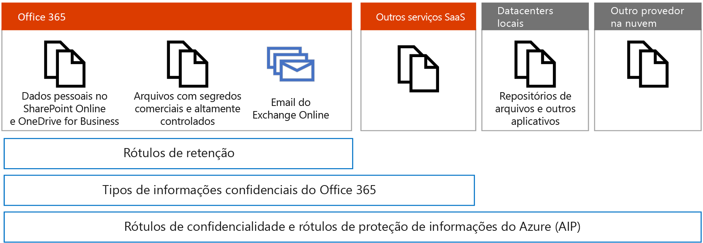
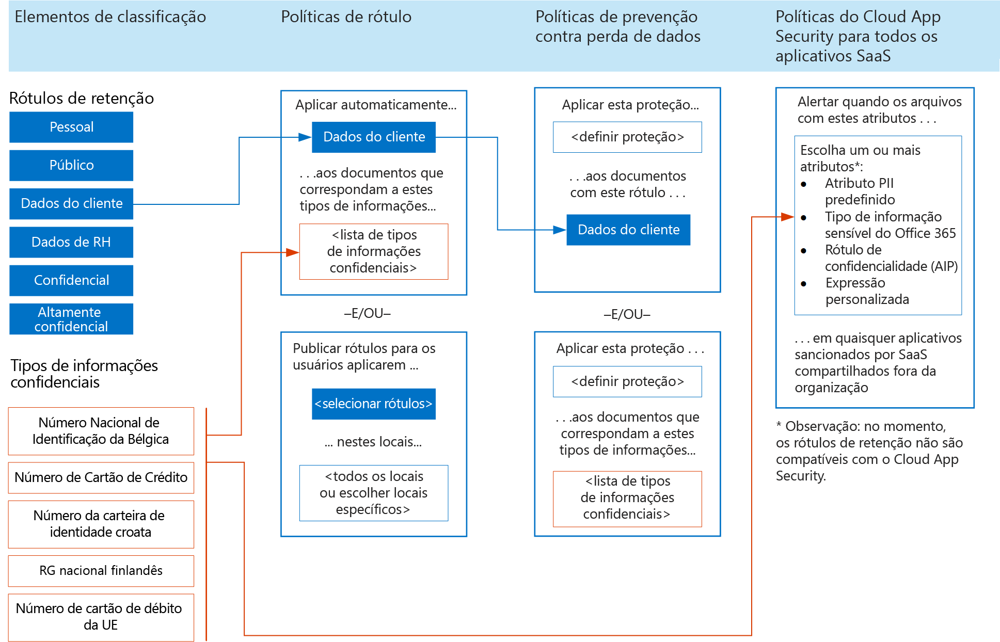
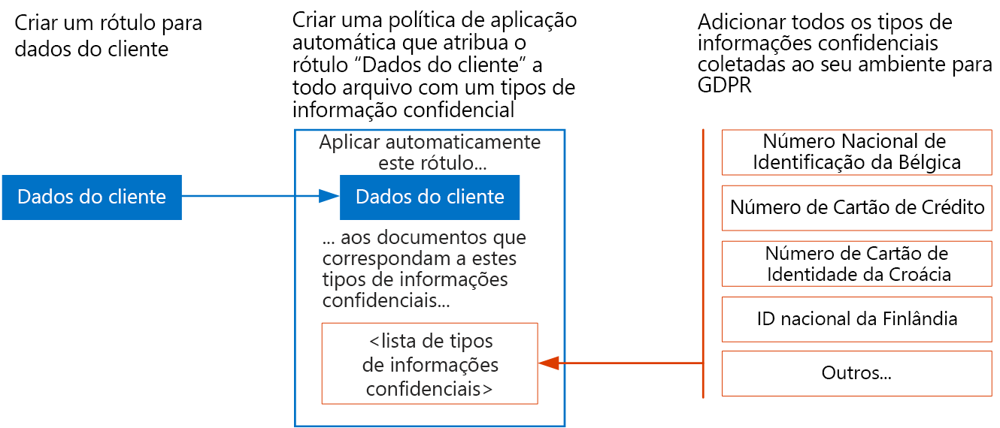

# Aplicar rótulos a dados pessoais

 Use este tópico se você estiver usando rótulos de classificação como parte do seu plano de proteção GDPR. 

Se você estiver usando rótulos para proteção de dados pessoais no Microsoft 365, recomendamos que você comece com [rótulos de retenção](labels.md). Com os rótulos de retenção, você pode:
- Use o Advanced Data Governance para aplicar automaticamente rótulos com base em tipos de informações confidenciais ou outros critérios.
- Use rótulos de retenção com a prevenção de perda de dados para aplicar a proteção. 
- Usar rótulos com Pesquisa de Conteúdo e Descoberta Eletrônica. 

O Cloud App Security atualmente não suporta rótulos de retenção, mas você pode usar tipos de informações confidenciais do Microsoft 365 com o Cloud App Security para monitorar dados pessoais que residem em outros aplicativos SaaS.

[Rótulos de confidencialidade](sensitivity-labels.md) atualmente são recomendados para a aplicação de rótulos a arquivos locais e em outros serviços de nuvem e provedores. Eles também são recomendados para arquivos no Microsoft 365 que exigem a criptografia da Proteção de Informações do Azure para proteção de dados, como arquivos de segredo comercial.

Neste momento, usar a proteção de informações do Azure para aplicar a criptografia não é recomendável para arquivos no Microsoft 365 com dados sujeitos ao RGPD. Os serviços do Microsoft 365 não podem ler em arquivos criptografados AIP no momento. Portanto, o serviço não consegue encontrar dados confidenciais nesses arquivos.

Rótulos de retenção podem ser aplicados a email no Exchange Online e esses rótulos funcionam com a prevenção contra a perda de dados do Microsoft 365.  

Na ilustração:

-   Use os rótulos de retenção em dados pessoais e arquivos de segredos comerciais e altamente controlados no SharePoint Online e no OneDrive for Business.
-   Os tipos de informações confidenciais do Microsoft 365 podem ser usados dentro do Microsoft 365 e com o Cloud App Security para monitorar dados pessoais que residem em outros aplicativos SaaS.
-   Use os rótulos de confidencialidade em arquivos de segredos comerciais e altamente controlados, emails do Exchange Online, arquivos de outros serviços SaaS, arquivos em datacenters no local e arquivos em outros provedores de nuvem.

## Usar os rótulos de retenção e os tipos de informações confidenciais no Microsoft 365 para proteção de informações

A ilustração a seguir mostra como os rótulos de retenção e os tipos de informações confidenciais podem ser usados em políticas de rotulação, de prevenção contra perda de dados e nas políticas do Cloud App Security.

Para maior acessibilidade, a tabela a seguir fornece os mesmos exemplos da ilustração.

<table>
<thead>
<tr class="header">
<th align="left"><strong>Elementos de classificação</strong></th>
<th align="left"><strong>Políticas de rotulação – dois exemplos</strong></th>
<th align="left"><strong>Políticas de prevenção contra perda de dados – dois exemplos</strong></th>
<th align="left"><strong>Políticas do Cloud App Security para todos os aplicativos SaaS – um exemplo</strong></th>
</tr>
</thead>
<tbody>
<tr class="odd">
<td align="left">Rótulos de retenção. Exemplos: Pessoal, Público, Dados do cliente, Dados de RH, Confidencial, Altamente confidencial</td>
<td align="left">
Aplicar automaticamente este rótulo...

Dados do cliente

...aos documentos que correspondam a estes tipos de informações confidenciais...

&lt;lista de exemplos de tipos de informações confidenciais&gt;
</td>
<td align="left">
Aplicar esta proteção...

&lt;definir proteção&gt;

...aos documentos com este rótulo...

Dados do cliente
</td>
<td align="left">
Alertar quando os arquivos com esses atributos...

Escolha um ou mais atributos: atributo PII predefinido, tipo de informação confidencial do Microsoft 365, rótulo de confidencialidade (API), expressão personalizada.

. . . que forem compartilhados fora da organização em qualquer aplicativo SaaS sancionado.

Obs.: rótulos de retenção atualmente não são suportados pelo Cloud App Security.</td>
</tr>
<tr class="even">
<td align="left">Tipos de informações confidenciais. Exemplos: Número Nacional de Identificação da Bélgica, Número do cartão de crédito, Número de Cartão de Identidade da Croácia, ID nacional da Finlândia</td>
<td align="left">
Publicar rótulos para os usuários aplicarem manualmente...

&lt;selecionar rótulos&gt;

...nestes locais...

&lt;todos os locais ou escolher locais específicos&gt;
</td>
<td align="left">
Aplicar esta proteção...

&lt;definir proteção&gt;

...aos documentos que correspondam a estes tipos de informações confidenciais&gt;
</td>
<td align="left"></td>
</tr>
</tbody>
</table>

## Priorizar as políticas de aplicação automática de rótulos

Para os dados pessoais sujeitos ao GDPR, a Microsoft recomenda a aplicação automática de rótulos usando os tipos de informações confidenciais que você selecionou para seu ambiente. É importante que as políticas de aplicação automática de rótulos sejam bem pensadas e testadas para alcançar o comportamento pretendido.

Tanto a ordem de criação das políticas de aplicação automática quanto o fato de os usuários também aplicarem rótulos afetam o resultado. Por isso, é importante planejar a distribuição com cuidado. Veja o que é preciso saber.

### Um rótulo por vez

Só é possível atribuir um rótulo a um documento.

### As políticas de aplicação automática mais antigas têm prioridade

Se houver várias regras de atribuição de um rótulo de aplicação automática e o conteúdo atender às condições de várias regras, o rótulo para a regra mais antiga será atribuído. Por esse motivo, é importante planejar as políticas de rótulo com atenção antes de configurá-las. Se uma organização precisar de uma alteração na prioridade das políticas de rótulo, será necessário excluí-las e recriá-las.

### Os rótulos aplicados manualmente pelo usuário prevalecem sobre os rótulos com aplicação automática

Os rótulos aplicados manualmente pelo usuários prevalecem sobre os rótulos com aplicação automática. As políticas de aplicação automática não podem substituir um rótulo já aplicado por um usuários. Porém, os usuários podem substituir rótulos aplicados automaticamente.

### Os rótulos atribuídos automaticamente podem ser atualizados

Os rótulos atribuídos automaticamente podem ser atualizados por políticas de rotulação mais recentes ou por atualizações das políticas existentes.

Seu plano para a implementação de rótulos deve:

- Priorizar a ordem de criação de políticas de aplicação automática.

- Deixar tempo suficiente para a aplicação automática de rótulos antes da distribuição para os usuários aplicarem manualmente. Pode levar até sete dias para que os rótulos sejam aplicados a todo o conteúdo que atende às condições.

### Exemplo de prioridade para a criação de políticas de aplicação automática

<table>
<thead>
<tr class="header">
<th align="left"><strong>Rótulos</strong></th>
<th align="left"><strong>Ordem de prioridade para a criação de políticas de aplicação automática </strong></th>
</tr>
</thead>
<tbody>
<tr class="odd">
<td align="left">Recursos humanos – dados de funcionários</td>
<td align="left">1</td>
</tr>
<tr class="even">
<td align="left">Dados do cliente</td>
<td align="left">2</td>
</tr>
<tr class="odd">
<td align="left">Altamente confidencial</td>
<td align="left">3</td>
</tr>
<tr class="even">
<td align="left">Recursos humanos – dados salariais</td>
<td align="left">4</td>
</tr>
<tr class="odd">
<td align="left">Confidencial</td>
<td align="left">5</td>
</tr>
<tr class="even">
<td align="left">Público</td>
<td align="left">6</td>
</tr>
<tr class="odd">
<td align="left">Pessoal</td>
<td align="left">Nenhuma política de aplicação automática</td>
</tr>
</tbody>
</table>

## Criar rótulos e políticas de aplicação automática de rótulos

Criar rótulos e políticas no centro de segurança ou no centro de conformidade.

<table>
<thead>
<tr class="header">
<th align="left"><strong>Etapa</strong></th>
<th align="left"><strong>Descrição</strong></th>
</tr>
</thead>
<tbody>
<tr class="odd">
<td align="left">
Conceder permissões aos membros da sua equipe de conformidade.
</td>
<td align="left">
Os membros da equipe de conformidade que criarão os rótulos precisam de permissões para usar o centro de segurança e/ou o centro de conformidade. Acesse as Permissões, no centro de segurança ou no centros de conformidade e modifique os membros do grupo Administrador de Conformidade.

Confira <a href="https://support.office.com/en-ie/article/Give-users-access-to-the-Office-365-Security-Compliance-Center-2cfce2c8-20c5-47f9-afc4-24b059c1bd76">Conceder aos usuários acesso ao centro de segurança e/ou o centro de conformidade</a>.
</td>
</tr>
<tr class="even">
<td align="left">
Crie rótulos de retenção.
</td>
<td align="left">Acesse Classificações, no centro de Segurança ou centro de Conformidade, escolha Rótulos de retenção e crie os rótulos para o seu ambiente.</td>
</tr>
<tr class="odd">
<td align="left">
Criar políticas de aplicação automática para rótulos.
</td>
<td align="left">Acesse Classificações, no centro de segurança ou centro de conformidade, escolha políticas de Rotulação e crie as políticas para a aplicação automática de rótulos. Certifique-se de criar as políticas por ordem de prioridade.</td>
</tr>
</tbody>
</table>

A ilustração a seguir mostra como criar um rótulo de aplicação automática para o Rótulo dados do cliente.

Na ilustração:

- O rótulo "Dados do cliente" foi criado.

- Os tipos de informações confidenciais desejados para o GDPR foram listados: Número Nacional de Identificação da Bélgica, Número do cartão de crédito, Número de Cartão de Identidade da Croácia, ID nacional da Finlândia.

- Criar uma política de aplicação automática atribui o rótulo "Dados do cliente" a todo arquivo com um dos tipos de informação confidencial que você adicionar à política.
