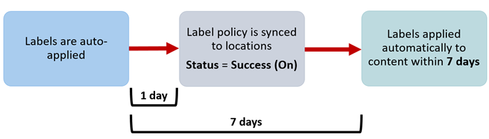

# <a name="automatically-apply-a-retention-label-to-retain-or-delete-content"></a>Aplicar automaticamente um rótulo de retenção para reter ou excluir conteúdo

>*[Diretrizes de licenciamento do Microsoft 365 para segurança e conformidade](/office365/servicedescriptions/microsoft-365-service-descriptions/microsoft-365-tenantlevel-services-licensing-guidance/microsoft-365-security-compliance-licensing-guidance).*

> [!NOTE]
> Não há suporte para esse cenário para [registros regulatórios](records-management.md#records).

Um dos recursos mais poderosos dos [rótulos de retenção](retention.md) é a capacidade de aplicá-los automaticamente ao conteúdo que corresponde a determinadas condições. Nesse caso, as pessoas da sua organização não precisam aplicar os rótulos de retenção. O Microsoft 365 faz o trabalho para elas.
  
Os rótulos de retenção de aplicação automática são excelentes porque:
  
- Você não precisa treinar os usuários com relação a todas as classificações.
    
- Você não precisa depender dos usuários para classificar corretamente o conteúdo.
    
- Os usuários não precisam mais conhecer as políticas de governança de dados; assim podem se concentrar no próprio trabalho.
    
Você pode aplicar rótulos de retenção ao conteúdo automaticamente quando esse conteúdo contiver informações confidenciais, palavras-chave, propriedades pesquisáveis ou uma correspondência para [classificadores treináveis](classifier-get-started-with.md).

> [!TIP]
> Lançado recentemente, use propriedades pesquisáveis para identificar [As gravações das reuniões das equipes](#microsoft-teams-meeting-recordings).

Os processos para aplicar automaticamente um rótulo de retenção com base nessas condições:


Use as instruções a seguir para as duas etapas de administrador.

> [!NOTE]
> As políticas automáticas usam o rotulamento do lado do serviço com condições para aplicar automaticamente os rótulos de retenção. Você também pode aplicar um rótulo de retenção automaticamente a uma política de rótulo ao fazer o seguinte: 
>
> - Aplicar um rótulo de retenção a um modelo de compreensão de documento no SharePoint Syntex
> - Aplicar um rótulo de retenção padrão para o Microsoft Office SharePoint Online e o Outlook
>- Aplicar um rótulo de retenção ao email usando regras do Outlook
>
> Nesses cenários, confira [Criar e aplicar rótulos de retenção em aplicativos](create-apply-retention-labels.md).

## <a name="before-you-begin"></a>Antes de começar

O administrador global da sua organização tem permissões completas para criar e editar os rótulos de retenção e suas políticas. Se você não estiver entrando como um administrador global, confira [Permissões necessárias para criar e gerenciar políticas e rótulos de retenção](get-started-with-retention.md#permissions-required-to-create-and-manage-retention-policies-and-retention-labels).

## <a name="how-to-auto-apply-a-retention-label"></a>Como aplicar automaticamente um rótulo de retenção

Primeiro, crie seu rótulo de retenção. Em seguida, crie uma política automática para aplicar esse rótulo. Se você já tiver criado seu rótulo de retenção, vá para [Criar uma política automática](#step-2-create-an-auto-apply-policy).

As instruções de navegação dependem se você estiver usando o [gerenciamento de relatórios](records-management.md) ou não. São fornecidas instruções para ambos os cenários.

### <a name="step-1-create-a-retention-label"></a>Etapa 1: Criar uma política de retenção

1. No [Centro de conformidade do Microsoft 365 ](https://compliance.microsoft.com/), navegue até um dos seguintes locais:
    
    - Se você estiver usando o gerenciamento de registros:
        - **Soluções** > **Gerenciamento de Registros** >  guia **Plano de Arquivos** > **+ Criar um Rótulo** > **Rótulo de Retenção**
        
    - Se você não estiver usando o gerenciamento de registros:
       - **Soluções** > **Governança de Informações** >  guia **Rótulos** > + **Criar um Rótulo**
    
    Não vê a opção imediatamente? Primeiro, selecione **Mostrar Tudo**. 

2. Siga as instruções do assistente. Se você estiver usando o gerenciamento de registros:
    
    - Para saber mais sobre os descritores de plano de arquivo, confira [Usar o plano de arquivo para gerenciar os rótulos de retenção](file-plan-manager.md)
    
    - Para usar o rótulo de retenção para declarar registros, selecione **Marcar itens como registros** ou **Marcar itens como registros regulatórios**. Para saber mais, confira [Configuração de rótulos de retenção para declarar registros](declare-records.md#configuring-retention-labels-to-declare-records).

3. Depois de criar o rótulo, você verá as opções para publicar a etiqueta, aplicar automaticamente a etiqueta, ou apenas salvar o rótulo: Selecione **Aplicar o rótulo automaticamente a um tipo específico de conteúdo** e, em seguida, selecione **concluído** para iniciar o assistente criar rotulagem automática, que o levará diretamente para a etapa 2 do procedimento a seguir.

Para editar um rótulo existente, selecione-o e, em seguida, selecione **Editar rótulo** para iniciar o Assistente do editor de retenção que permite alterar as descrições de rótulo e quaisquer [configurações qualificadas](#updating-retention-labels-and-their-policies) na etapa 2.

### <a name="step-2-create-an-auto-apply-policy"></a>Etapa 2: Criar uma política de aplicação automática

Ao criar uma política de aplicação automática, selecione um rótulo de retenção a ser aplicado automaticamente ao conteúdo com base nas condições que você especificar.

1. No [Centro de Conformidade do Microsoft 365 ](https://compliance.microsoft.com/), navegue até um dos seguintes locais:
    
    - Se você estiver usando o gerenciamento de registros: **Governança de Informações**:
        - **Soluções** > **Gerenciamento de Registros** guia  > **Políticas de Rótulo** > **Aplicar rótulo automaticamente**
    
    - Se você não estiver usando o gerenciamento de registros:
        - **Soluções** > **Governança de Informações** >  guia **Políticas de Rótulo** > **Aplicar rótulo automaticamente**
    
    Não vê a opção imediatamente? Primeiro, selecione **Mostrar Tudo**. 

2. Siga os avisos no assistente Criar rotulação automática.
    
    Para saber mais sobre como configurar condições que aplicam automaticamente o rótulo de retenção, confira o [Configurar condições para a aplicação automática de rótulos de retenção](#configuring-conditions-for-auto-apply-retention-labels) nesta página.
    
    Para obter informações sobre os locais suportados pelos rótulos de retenção, confira a seção[Rótulos e locais de retenção](retention.md#retention-label-policies-and-locations).

Para editar uma política de aplicação automática existente, selecione-a para iniciar o assistente para editar política de retenção que permite alterar o rótulo de retenção selecionado e quaisquer [configurações elegíveis](#updating-retention-labels-and-their-policies) da etapa 2.

Depois que o conteúdo é rotulado usando uma política de rótulo de aplicação automática, não é possível remover ou alterar automaticamente o rótulo aplicado, alterando o conteúdo ou a política ou uma nova política de aplicação automática. Para saber mais, consulte [Apenas um rótulo de retenção por vez](retention.md#only-one-retention-label-at-a-time).

### <a name="configuring-conditions-for-auto-apply-retention-labels"></a>Configurar condições para a aplicação automática de rótulos de retenção

Você pode aplicar os rótulos de retenção automaticamente ao conteúdo quando esse conteúdo apresentar:

- [Tipos específicos de informações confidenciais](#auto-apply-labels-to-content-with-specific-types-of-sensitive-information)

- [Palavras-chave específicas ou Propriedades pesquisáveis que correspondem a uma consulta criada](#auto-apply-labels-to-content-with-keywords-or-searchable-properties)

- [Uma correspondência de classificadores treináveis](#auto-apply-labels-to-content-by-using-trainable-classifiers)

#### <a name="auto-apply-labels-to-content-with-specific-types-of-sensitive-information"></a>Aplicar automaticamente rótulos a conteúdo com tipos específicos de informações confidenciais

> [!WARNING]
> Atualmente, esta configuração tem uma limitação conhecida onde todos os emails sem rótulo sempre têm o rótulo de retenção selecionado aplicado quando há uma correspondência dos tipos de informações confidenciais escolhidos. Por exemplo, mesmo que você use sua política de aplicação automática a usuários específicos, ou selecione locais diferentes do Exchange para a política, o rótulo sempre é aplicado a emails sem rótulo quando há uma correspondência.

Ao criar políticas de rótulo de retenção de aplicação automática para informações confidenciais, você vê a mesma lista de modelos de política de quando cria uma política de prevenção contra perda de dados (DLP). Cada modelo de política é pré-configurado para procurar tipos específicos de informações confidenciais. No exemplo a seguir, os tipos de informações confidenciais são da categoria **Privacidade** e do modelo de **Informações de identificação pessoal (PII) dos EUA**:


Para obter mais informações sobre os tipos de informações confidenciais, confira [Definições da entidade de tipo de informações confidenciais](sensitive-information-type-entity-definitions.md). Atualmente, [correspondências exatas de dados](create-custom-sensitive-information-types-with-exact-data-match-based-classification.md) e [impressão digital do documento](document-fingerprinting.md) não são suportadas neste cenário.

Depois de selecionar um modelo de política, você pode adicionar ou remover quaisquer tipos de informações confidenciais e pode alterar o nível de confiança e a contagem de instâncias. Na captura de tela de exemplo anterior, essas opções foram alteradas para que um rótulo de retenção seja aplicado automaticamente somente quando:
  
- O tipo de informações confidenciais detectadas tem uma correspondência de precisão (ou [nível de confiança](sensitive-information-type-learn-about.md#more-on-confidence-levels)) de pelo menos **Confiança média** para dois dos tipos de informações confidenciais e **Alto nível de confiança** para um. Muitos tipos de informações confidenciais são definidos com vários padrões, em que um padrão com maior precisão de correspondência requer mais evidências para ser encontrado (como palavras-chave, datas ou endereços), enquanto um padrão com precisão de correspondência inferior requer menos evidências. Quanto menor o nível de confiança, mais fácil será para o conteúdo corresponder à condição, mas com o potencial de mais falsos positivos.

- O conteúdo contém entre uma e nove instâncias de qualquer um destes três tipos de informações confidenciais. O padrão para o **para** valor é **Qualquer**.

Para obter mais informações sobre essas opções, confira as diretrizes a seguir na documentação da DLP [Regras de ajuste para torná-las mais fáceis ou difíceis de corresponder aos](data-loss-prevention-policies.md#tuning-rules-to-make-them-easier-or-harder-to-match).

Para considerar ao usar tipos de informações confidenciais para aplicar automaticamente os rótulos de retenção:

- Os itens novos e modificados podem ser rotulados automaticamente.

#### <a name="auto-apply-labels-to-content-with-keywords-or-searchable-properties"></a>Aplicar rótulos automaticamente a conteúdos com palavras-chave ou propriedades pesquisáveis

Você pode aplicar automaticamente os rótulos ao conteúdo usando uma consulta que inclui palavras ou frases específicas, ou valores de propriedades pesquisáveis. Você pode refinar a consulta usando os operadores de pesquisa AND, OR e NOT.


Para obter mais informações sobre a sintaxe de consulta que usa a Linguagem de Consulta de Palavra-chave (KQL), consulte [Referência de sintaxe da Linguagem de Consulta de Palavra-chave (KQL) no MSDN](/sharepoint/dev/general-development/keyword-query-language-kql-syntax-reference).

As políticas de aplicação automática baseadas em consulta usam o mesmo índice de pesquisa de conteúdo de descoberta eletrônica para identificar o conteúdo. Para obter mais informações sobre as propriedades pesquisáveis que você pode usar, consulte [Consultas de palavra-chave e critérios de pesquisa para Pesquisa de Conteúdo](keyword-queries-and-search-conditions.md).

Alguns pontos a considerar ao usar palavras-chave ou propriedades pesquisáveis para aplicar automaticamente os rótulos de retenção:

- Os itens novos, modificados e existentes serão rotulados automaticamente para SharePoint, OneDrive e Exchange.

- Para SharePoint, propriedades rastreadas e propriedades personalizadas não têm suporte para essas consultas KQL e você deve usar apenas propriedades gerenciadas predefinidas. No entanto, você pode usar mapeamentos no nível do locatário com as propriedades gerenciadas predefinidas habilitadas como refinadores por padrão (RefinableDate00-19, RefinableString00-99, RefinableInt00-49, RefinableDecimals00-09, and RefinableDouble00-09). Para obter mais informações, confira [Visão geral de propriedades rastreadas e gerenciadas no SharePoint Server](/SharePoint/technical-reference/crawled-and-managed-properties-overview)e para obter instruções, confira [Criar uma nova propriedade gerenciada](/sharepoint/manage-search-schema#create-a-new-managed-property).

- Caso mapeie uma propriedade personalizada para uma das propriedades de refinamento, espere 24 horas antes de usá-la em sua consulta KQL para um rótulo de retenção.

- Embora as propriedades gerenciadas do SharePoint possam ser renomeadas usando alias, não use-as para consultas KQL em suas etiquetas. Especifique sempre o nome real da propriedade gerenciada, por exemplo, RefinableString01.

- Para procurar valores que contenham espaços ou caracteres especiais, use aspas duplas (`" "`) para conter a frase, por exemplo, `subject:"Financial Statements"`.

- Use a propriedade *DocumentLink*, em vez de *Path* para corresponder um item com base em sua URL. 

- Não há suporte a pesquisas de caracteres curinga de sufixo (como `*cat`) ou pesquisas de subcadeias de caracteres curinga (como `*cat*`). No entanto, as pesquisas curinga de prefixo (como `cat*`) têm suporte.

- Lembre-se de que os itens parcialmente indexados podem ser responsáveis por não rotular os itens que você está esperando ou rotular os itens que você espera que sejam excluídos do rotulamento quando você usa o operador NOT. Para obter mais informações, consulte [Itens parcialmente indexados na Pesquisa de Conteúdo](partially-indexed-items-in-content-search.md).


Consultas de exemplos:

| Workload | Exemplo |
|:-----|:-----|
|Exchange   | `subject:"Financial Statements"` |
|Exchange   | `recipients:garthf@contoso.com` |
|Microsoft Office SharePoint Online | `contenttype:document` |
|SharePoint | `site:https://contoso.sharepoint.com/sites/teams/procurement AND contenttype:document`|
|Exchange ou SharePoint | `"customer information" OR "private"`|

Exemplos mais complexos:

A consulta a seguir para o SharePoint identifica documentos do Word ou planilhas do Excel quando esses arquivos contêm as palavras-chave **senha**, **senhas** ou **PW**:

```
(password OR passwords OR pw) AND (filetype:doc* OR filetype:xls*)
```

A consulta a seguir para o Exchange identifica todos os documentos do Word ou PDFs que contenham a palavra **NDA** ou a frase **contrato de não divulgação** quando esses documentos estiverem anexados a um email:

```
(nda OR "non disclosure agreement") AND (attachmentnames:.doc* OR attachmentnames:.pdf)
```

A consulta a seguir para o SharePoint identifica documentos que contenham um número de cartão de crédito: 

```
sensitivetype:"credit card number"
```

A consulta a seguir contém algumas palavras-chave comuns para ajudá-lo a identificar documentos ou emails que contenham conteúdo legal:

```
ACP OR (Attorney Client Privilege*) OR (AC Privilege)
```

A consulta a seguir contém palavras-chave comuns para ajudá-lo a identificar documentos ou emails para recursos humanos: 

```
(resume AND staff AND employee AND salary AND recruitment AND candidate)
```

Observe que este exemplo final usa a melhor prática de sempre incluir operadores entre palavras-chave. Um espaço entre palavras-chave ou duas expressões do tipo propriedade: valor equivale a um AND. Ao adicionar operadores sempre, fica mais fácil ver que essa consulta de exemplo identificará somente o conteúdo que contém todas essas palavras-chave, em vez de conteúdo que contenha qualquer uma das palavras-chave. Caso pretenda identificar o conteúdo que contenha qualquer uma das palavras-chave, especifique OR em vez de AND. Como mostra este exemplo, quando você especifica sempre os operadores, é mais fácil interpretar a consulta corretamente. 

##### <a name="microsoft-teams-meeting-recordings"></a>Gravações de reunião do Microsoft Teams

> [!NOTE]
> A capacidade de reter e excluir gravações de reuniões do Teams não funcionará antes que as gravações sejam salvas no OneDrive ou no SharePoint. Para saber mais, confira[Usar o OneDrive for Business e o SharePoint Online ou Stream para gravações de reunião](/MicrosoftTeams/tmr-meeting-recording-change).

Para identificar as gravações de reunião do Microsoft Teams que estão armazenadas nas contas do OneDrive do usuário ou no SharePoint, especifique o seguinte para o **Editor de consulta palavra-chave**:

``` 
ProgID:Media AND ProgID:Meeting
```

Na maioria das vezes, as gravações de reuniões são salvas no OneDrive. Mas para reuniões de canal, elas são salvas no SharePoint.


#### <a name="auto-apply-labels-to-content-by-using-trainable-classifiers"></a>Aplicar rótulos automaticamente ao conteúdo usando classificadores treináveis

Ao escolher a opção de um classificador treinado, você pode selecionar um dos classificadores internos ou um classificador personalizado. Os classificadores internos incluem **Currículos**, **SourceCode**, **Assédio Direcionado**, **Profanação** e **Ameaças**:


> [!CAUTION]
> Vamos substituir o classificador interno **Idioma Ofensivo** porque ele tem uma grande quantidade de falsos positivos. Não use esse classificador interno e se você estiver usando-o no momento, você deve migrar seus processos de negócios para fora dele. É recomendável usar os classificadores internos **Assédio Direcionado**, **Profanidade** e **Ameaças**.

Para aplicar um rótulo automaticamente usando essa opção, os sites e as caixas de correio do SharePoint devem conter pelo menos 10 MB de dados.

Para saber mais sobre esses classificadores treináveis, confira [Saiba mais sobre classificadores treináveis](classifier-learn-about.md).

> [!TIP]
> Se você usar classificadores treináveis para o Exchange, confira [Como treinar novamente um classificador no explorador de conteúdo](classifier-how-to-retrain-content-explorer.md).

Para considerar quando usar classificadores de treinamento para aplicar automaticamente os rótulos de retenção:

- Os itens novos e modificados podem ser rotulados automaticamente e os itens existentes dos últimos seis meses.

## <a name="how-long-it-takes-for-retention-labels-to-take-effect"></a>Quanto tempo demora para os rótulos de retenção entrarem em vigor

Quando você aplica rótulos de retenção automaticamente, pode levar até sete dias para que os rótulos de retenção sejam aplicados a todo o conteúdo existente que corresponde às condições.
  


Se os rótulos esperados não aparecerem após sete dias, verifique o **Status** da política de aplicação automática selecionando-a na página **Políticas de rótulo** na central de conformidade. Se você vir o status de **Desligado (Erro)** e nos detalhes dos locais, verá uma mensagem de que está demorando mais do que o esperado para implantar a política (para Microsoft Office SharePoint Online) ou para tentar reimplantar a política (para Microsoft OneDrive), tente executar o comando Windows PowerShell [Set-RetentionCompliancePolicy](/powershell/module/exchange/set-retentioncompliancepolicy) para tentar novamente a distribuição da política:

1. [Conectar-se ao Windows PowerShell do Centro de Conformidade e Segurança](/powershell/exchange/connect-to-scc-powershell).

2. Execute o seguinte comando:
    
    ``` PowerShell
    Set-RetentionCompliancePolicy -Identity <policy name> -RetryDistribution
   ```

## <a name="updating-retention-labels-and-their-policies"></a>Atualizar os rótulos de retenção e suas políticas

Se você editar um rótulo de retenção ou política de aplicação automática e o rótulo de retenção já estiver aplicado ao conteúdo, as configurações atualizadas serão aplicadas automaticamente a esse conteúdo, além do conteúdo recentemente rotulado.

Algumas configurações não podem ser alteradas depois que o rótulo ou política é criado e salvo, que incluem:
- O rótulo de retenção e o nome da política, além das configurações de retenção, exceto o período de retenção. No entanto, você não pode alterar o período de retenção quando o período de retenção se baseia em quando os itens eram rotulados.
- A opção para marcar os itens como um registro.

### <a name="deleting-retention-labels"></a>Excluindo rótulos de retenção

Você pode excluir rótulos de retenção que não estão incluídos atualmente em nenhuma política de rótulo de retenção, que não estão configurados para retenção baseada em eventos, ou marcar itens como registros regulatórios.

Quanto aos rótulos de retenção que podem ser excluídos, se eles foram aplicados a itens, a exclusão falhará e você verá um link para o explorador de conteúdos para identificar os itens rotulados.

No entanto, pode levar até dois dias para que o explorador de conteúdos mostre os itens rotulados. Nesse cenário, o rótulo de retenção pode ser excluído sem mostrar o link para o explorador de conteúdos.

## <a name="locking-the-policy-to-prevent-changes"></a>Bloquear a política para evitar alterações

Se você precisar garantir que ninguém pode desabilitar a política, excluí-la ou torná-la menos restritiva, confira [Usar Bloqueio de Preservação para restringir alterações nas políticas de retenção e nas políticas de rótulo de retenção](retention-preservation-lock.md).

## <a name="next-steps"></a>Próximas etapas

Confira [Usar rótulos de retenção para gerenciar o ciclo de vida de documentos armazenados no Microsoft Office SharePoint Online](auto-apply-retention-labels-scenario.md) para ver um cenário de exemplo que usa uma política de rótulo de retenção de aplicação automática com propriedades gerenciadas no Microsoft Office SharePoint Online e retenção baseada em eventos para iniciar o período de retenção.