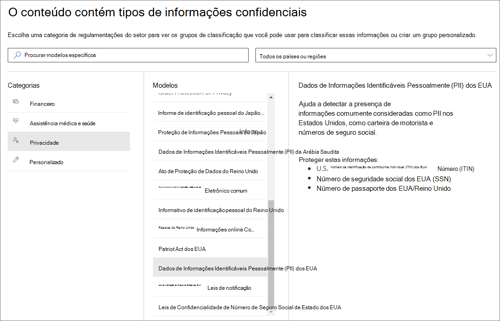
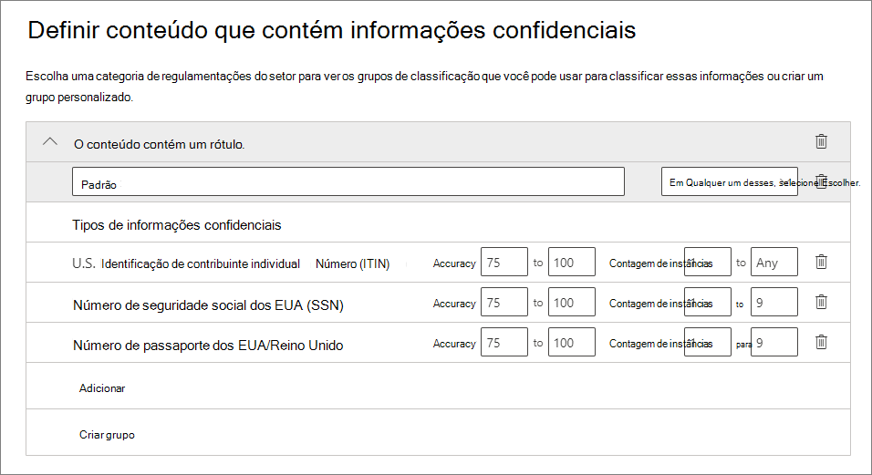

# <a name="automatically-apply-a-retention-label-to-retain-or-delete-content"></a><span data-ttu-id="04d29-103">Aplicar automaticamente um rótulo de retenção para reter ou excluir conteúdo</span><span class="sxs-lookup"><span data-stu-id="04d29-103">Automatically apply a retention label to retain or delete content</span></span>

><span data-ttu-id="04d29-104">*[Diretrizes de licenciamento do Microsoft 365 para segurança e conformidade](https://aka.ms/ComplianceSD).*</span><span class="sxs-lookup"><span data-stu-id="04d29-104">*[Microsoft 365 licensing guidance for security & compliance](https://aka.ms/ComplianceSD).*</span></span>

> [!NOTE]
> <span data-ttu-id="04d29-105">Não há suporte para esse cenário para [registros regulatórios](records-management.md#records).</span><span class="sxs-lookup"><span data-stu-id="04d29-105">This scenario is not supported for [regulatory records](records-management.md#records).</span></span>

<span data-ttu-id="04d29-106">Um dos recursos mais poderosos dos [rótulos de retenção](retention.md) é a capacidade de aplicá-los automaticamente ao conteúdo que corresponde a determinadas condições.</span><span class="sxs-lookup"><span data-stu-id="04d29-106">One of the most powerful features of [retention labels](retention.md) is the ability to apply them automatically to content that matches specified conditions.</span></span> <span data-ttu-id="04d29-107">Nesse caso, as pessoas da sua organização não precisam aplicar os rótulos de retenção.</span><span class="sxs-lookup"><span data-stu-id="04d29-107">In this case, people in your organization don't need to apply the retention labels.</span></span> <span data-ttu-id="04d29-108">O Microsoft 365 faz o trabalho para elas.</span><span class="sxs-lookup"><span data-stu-id="04d29-108">Microsoft 365 does the work for them.</span></span>
  
<span data-ttu-id="04d29-109">Os rótulos de retenção de aplicação automática são excelentes porque:</span><span class="sxs-lookup"><span data-stu-id="04d29-109">Auto-applying retention labels are powerful because:</span></span>
  
- <span data-ttu-id="04d29-110">Você não precisa treinar os usuários com relação a todas as classificações.</span><span class="sxs-lookup"><span data-stu-id="04d29-110">You don't need to train your users on all of your classifications.</span></span>
    
- <span data-ttu-id="04d29-111">Você não precisa depender dos usuários para classificar corretamente o conteúdo.</span><span class="sxs-lookup"><span data-stu-id="04d29-111">You don't need to rely on users to classify all content correctly.</span></span>
    
- <span data-ttu-id="04d29-112">Os usuários não precisam mais conhecer as políticas de governança de dados; assim podem se concentrar no próprio trabalho.</span><span class="sxs-lookup"><span data-stu-id="04d29-112">Users no longer need to know about data governance policies - they can focus on their work.</span></span>
    
<span data-ttu-id="04d29-113">Você pode aplicar rótulos de retenção ao conteúdo automaticamente quando esse conteúdo contiver informações confidenciais, palavras-chave, propriedades pesquisáveis ou uma correspondência para [classificadores treináveis](classifier-get-started-with.md).</span><span class="sxs-lookup"><span data-stu-id="04d29-113">You can apply retention labels to content automatically when that content contains sensitive information, keywords or searchable properties, or a match for [trainable classifiers](classifier-get-started-with.md).</span></span>

> [!TIP]
> <span data-ttu-id="04d29-114">Agora, no modo de visualização, use as propriedades pesquisáveis para identificar [gravações das reuniões do Teams](#microsoft-teams-meeting-recordings).</span><span class="sxs-lookup"><span data-stu-id="04d29-114">Now in preview, use searchable properties to identify [Teams meeting recordings](#microsoft-teams-meeting-recordings).</span></span>

<span data-ttu-id="04d29-115">Os processos para aplicar automaticamente um rótulo de retenção com base nessas condições:</span><span class="sxs-lookup"><span data-stu-id="04d29-115">The processes to automatically apply a retention label based on these conditions:</span></span>


<span data-ttu-id="04d29-117">Use as instruções a seguir para as duas etapas de administrador.</span><span class="sxs-lookup"><span data-stu-id="04d29-117">Use the following instructions for the two admin steps.</span></span>

> [!NOTE]
> <span data-ttu-id="04d29-118">As políticas automáticas usam o rotulamento do lado do serviço com condições para aplicar automaticamente os rótulos de retenção.</span><span class="sxs-lookup"><span data-stu-id="04d29-118">Auto-policies use service-side labeling with conditions to automatically apply retention labels.</span></span> <span data-ttu-id="04d29-119">Você também pode aplicar um rótulo de retenção automaticamente a uma política de rótulo ao fazer o seguinte:</span><span class="sxs-lookup"><span data-stu-id="04d29-119">You can also automatically apply a retention label with a label policy when you do the following:</span></span> 
>
> - <span data-ttu-id="04d29-120">Aplicar um rótulo de retenção a um modelo de compreensão de documento no SharePoint Syntex</span><span class="sxs-lookup"><span data-stu-id="04d29-120">Apply a retention label to a document understanding model in SharePoint Syntex</span></span>
> - <span data-ttu-id="04d29-121">Aplicar um rótulo de retenção padrão para o Microsoft Office SharePoint Online e o Outlook</span><span class="sxs-lookup"><span data-stu-id="04d29-121">Apply a default retention label for SharePoint and Outlook</span></span>
>- <span data-ttu-id="04d29-122">Aplicar um rótulo de retenção ao email usando regras do Outlook</span><span class="sxs-lookup"><span data-stu-id="04d29-122">Apply a retention label to email by using Outlook rules</span></span>
>
> <span data-ttu-id="04d29-123">Nesses cenários, confira [Criar e aplicar rótulos de retenção em aplicativos](create-apply-retention-labels.md).</span><span class="sxs-lookup"><span data-stu-id="04d29-123">For these scenarios, see [Create and apply retention labels in apps](create-apply-retention-labels.md).</span></span>

## <a name="before-you-begin"></a><span data-ttu-id="04d29-124">Antes de começar</span><span class="sxs-lookup"><span data-stu-id="04d29-124">Before you begin</span></span>

<span data-ttu-id="04d29-125">O administrador global da sua organização tem permissões completas para criar e editar os rótulos de retenção e suas políticas.</span><span class="sxs-lookup"><span data-stu-id="04d29-125">The global admin for your organization has full permissions to create and edit retention labels and their policies.</span></span> <span data-ttu-id="04d29-126">Se você não estiver entrando como um administrador global, confira [Permissões necessárias para criar e gerenciar políticas e rótulos de retenção](get-started-with-retention.md#permissions-required-to-create-and-manage-retention-policies-and-retention-labels).</span><span class="sxs-lookup"><span data-stu-id="04d29-126">If you aren't signing in as a global admin, see [Permissions required to create and manage retention policies and retention labels](get-started-with-retention.md#permissions-required-to-create-and-manage-retention-policies-and-retention-labels).</span></span>

## <a name="how-to-auto-apply-a-retention-label"></a><span data-ttu-id="04d29-127">Como aplicar automaticamente um rótulo de retenção</span><span class="sxs-lookup"><span data-stu-id="04d29-127">How to auto-apply a retention label</span></span>

<span data-ttu-id="04d29-128">Primeiro, crie seu rótulo de retenção.</span><span class="sxs-lookup"><span data-stu-id="04d29-128">First, create your retention label.</span></span> <span data-ttu-id="04d29-129">Em seguida, crie uma política automática para aplicar esse rótulo.</span><span class="sxs-lookup"><span data-stu-id="04d29-129">Then create an auto-policy to apply that label.</span></span> <span data-ttu-id="04d29-130">Se você já tiver criado seu rótulo de retenção, vá para [Criar uma política automática](#step-2-create-an-auto-apply-policy).</span><span class="sxs-lookup"><span data-stu-id="04d29-130">If you have already created your retention label, skip to [creating an auto-policy](#step-2-create-an-auto-apply-policy).</span></span>

<span data-ttu-id="04d29-131">As instruções de navegação dependem se você estiver usando o [gerenciamento de relatórios](records-management.md) ou não.</span><span class="sxs-lookup"><span data-stu-id="04d29-131">Navigation instructions depend on whether you're using [records management](records-management.md) or not.</span></span> <span data-ttu-id="04d29-132">São fornecidas instruções para ambos os cenários.</span><span class="sxs-lookup"><span data-stu-id="04d29-132">Instructions are provided for both scenarios.</span></span>

### <a name="step-1-create-a-retention-label"></a><span data-ttu-id="04d29-133">Etapa 1: Criar uma política de retenção</span><span class="sxs-lookup"><span data-stu-id="04d29-133">Step 1: Create a retention label</span></span>

1. <span data-ttu-id="04d29-134">No [Centro de conformidade do Microsoft 365 ](https://compliance.microsoft.com/), navegue até um dos seguintes locais:</span><span class="sxs-lookup"><span data-stu-id="04d29-134">In the [Microsoft 365 compliance center](https://compliance.microsoft.com/), navigate to one of the following locations:</span></span>
    
    - <span data-ttu-id="04d29-135">Se você estiver usando o gerenciamento de registros:</span><span class="sxs-lookup"><span data-stu-id="04d29-135">If you are using records management:</span></span>
        - <span data-ttu-id="04d29-136">**Soluções** > **Gerenciamento de Registros** >  guia **Plano de Arquivos** > **+ Criar um Rótulo** > **Rótulo de Retenção**</span><span class="sxs-lookup"><span data-stu-id="04d29-136">**Solutions** > **Records management** > **File plan** tab > **+ Create a label** > **Retention label**</span></span>
        
    - <span data-ttu-id="04d29-137">Se você não estiver usando o gerenciamento de registros:</span><span class="sxs-lookup"><span data-stu-id="04d29-137">If you are not using records management:</span></span>
       - <span data-ttu-id="04d29-138">**Soluções** > **Governança de Informações** >  guia **Rótulos** > + **Criar um Rótulo**</span><span class="sxs-lookup"><span data-stu-id="04d29-138">**Solutions** > **Information governance** > **Labels** tab > + **Create a label**</span></span>
    
    <span data-ttu-id="04d29-139">Não vê a opção imediatamente?</span><span class="sxs-lookup"><span data-stu-id="04d29-139">Don't immediately see your option?</span></span> <span data-ttu-id="04d29-140">Primeiro, selecione **Mostrar Tudo**.</span><span class="sxs-lookup"><span data-stu-id="04d29-140">First select **Show all**.</span></span> 

2. <span data-ttu-id="04d29-141">Siga as instruções do assistente.</span><span class="sxs-lookup"><span data-stu-id="04d29-141">Follow the prompts in the wizard.</span></span> <span data-ttu-id="04d29-142">Se você estiver usando o gerenciamento de registros:</span><span class="sxs-lookup"><span data-stu-id="04d29-142">If you are using records management:</span></span>
    
    - <span data-ttu-id="04d29-143">Para saber mais sobre os descritores de plano de arquivo, confira [Usar o plano de arquivo para gerenciar os rótulos de retenção](file-plan-manager.md)</span><span class="sxs-lookup"><span data-stu-id="04d29-143">For information about the file plan descriptors, see [Use file plan to manage retention labels](file-plan-manager.md)</span></span>
    
    - <span data-ttu-id="04d29-144">Para usar o rótulo de retenção para declarar registros, selecione **Marcar itens como registros** ou **Marcar itens como registros regulatórios**.</span><span class="sxs-lookup"><span data-stu-id="04d29-144">To use the retention label to declare records, select **Mark items as records**, or **Mark items as regulatory records**.</span></span> <span data-ttu-id="04d29-145">Para saber mais, confira [Configuração de rótulos de retenção para declarar registros](declare-records.md#configuring-retention-labels-to-declare-records).</span><span class="sxs-lookup"><span data-stu-id="04d29-145">For more information, see [Configuring retention labels to declare records](declare-records.md#configuring-retention-labels-to-declare-records).</span></span>

3. <span data-ttu-id="04d29-146">Depois de criar o rótulo, você verá as opções para publicar a etiqueta, aplicar automaticamente a etiqueta, ou apenas salvar o rótulo: Selecione **Aplicar o rótulo automaticamente a um tipo específico de conteúdo** e, em seguida, selecione **concluído** para iniciar o assistente criar rotulagem automática, que o levará diretamente para a etapa 2 do procedimento a seguir.</span><span class="sxs-lookup"><span data-stu-id="04d29-146">After you have created the label and you see the options to publish the label, auto-apply the label, or just save the label: Select **Auto-apply this label to a specific type of content**, and then select **Done** to start the Create auto-labeling wizard that takes you directly to step 2 in the following procedure.</span></span>

<span data-ttu-id="04d29-147">Para editar um rótulo existente, selecione-o e, em seguida, selecione **Editar rótulo** para iniciar o Assistente do editor de retenção que permite alterar as descrições de rótulo e quaisquer [configurações qualificadas](#updating-retention-labels-and-their-policies) na etapa 2.</span><span class="sxs-lookup"><span data-stu-id="04d29-147">To edit an existing label, select it, and then select the **Edit label** option to start the Edit retention wizard that lets you change the label descriptions and any [eligible settings](#updating-retention-labels-and-their-policies) from step 2.</span></span>

### <a name="step-2-create-an-auto-apply-policy"></a><span data-ttu-id="04d29-148">Etapa 2: Criar uma política de aplicação automática</span><span class="sxs-lookup"><span data-stu-id="04d29-148">Step 2: Create an auto-apply policy</span></span>

<span data-ttu-id="04d29-149">Ao criar uma política de aplicação automática, selecione um rótulo de retenção a ser aplicado automaticamente ao conteúdo com base nas condições que você especificar.</span><span class="sxs-lookup"><span data-stu-id="04d29-149">When you create an auto-apply policy, you select a retention label to automatically apply to content, based on the conditions that you specify.</span></span>

1. <span data-ttu-id="04d29-150">No [Centro de Conformidade do Microsoft 365 ](https://compliance.microsoft.com/), navegue até um dos seguintes locais:</span><span class="sxs-lookup"><span data-stu-id="04d29-150">In the [Microsoft 365 compliance center](https://compliance.microsoft.com/), navigate to one of the following locations:</span></span>
    
    - <span data-ttu-id="04d29-151">Se você estiver usando o gerenciamento de registros: **Governança de Informações**:</span><span class="sxs-lookup"><span data-stu-id="04d29-151">If you are using records management: **Information governance**:</span></span>
        - <span data-ttu-id="04d29-152">**Soluções** > **Gerenciamento de Registros** guia  > **Políticas de Rótulo** > **Aplicar rótulo automaticamente**</span><span class="sxs-lookup"><span data-stu-id="04d29-152">**Solutions** > **Records management** > **Label policies** tab > **Auto-apply a label**</span></span>
    
    - <span data-ttu-id="04d29-153">Se você não estiver usando o gerenciamento de registros:</span><span class="sxs-lookup"><span data-stu-id="04d29-153">If you are not using records management:</span></span>
        - <span data-ttu-id="04d29-154">**Soluções** > **Governança de Informações** >  guia **Políticas de Rótulo** > **Aplicar rótulo automaticamente**</span><span class="sxs-lookup"><span data-stu-id="04d29-154">**Solutions** > **Information governance** > **Label policies** tab > **Auto-apply a label**</span></span>
    
    <span data-ttu-id="04d29-155">Não vê a opção imediatamente?</span><span class="sxs-lookup"><span data-stu-id="04d29-155">Don't immediately see your option?</span></span> <span data-ttu-id="04d29-156">Primeiro, selecione **Mostrar Tudo**.</span><span class="sxs-lookup"><span data-stu-id="04d29-156">First select **Show all**.</span></span> 

2. <span data-ttu-id="04d29-157">Siga os avisos no assistente Criar rotulação automática.</span><span class="sxs-lookup"><span data-stu-id="04d29-157">Follow the prompts in the Create auto-labeling wizard.</span></span>
    
    <span data-ttu-id="04d29-158">Para saber mais sobre como configurar condições que aplicam automaticamente o rótulo de retenção, confira o [Configurar condições para a aplicação automática de rótulos de retenção](#configuring-conditions-for-auto-apply-retention-labels) nesta página.</span><span class="sxs-lookup"><span data-stu-id="04d29-158">For information about configuring the conditions that automatically apply the retention label, see the [Configuring conditions for auto-apply retention labels](#configuring-conditions-for-auto-apply-retention-labels) section on this page.</span></span>
    
    <span data-ttu-id="04d29-159">Para obter informações sobre os locais suportados pelos rótulos de retenção, confira a seção[Rótulos e locais de retenção](retention.md#retention-label-policies-and-locations).</span><span class="sxs-lookup"><span data-stu-id="04d29-159">For information about the locations supported by retention labels, see the [Retention labels and locations](retention.md#retention-label-policies-and-locations) section.</span></span>

<span data-ttu-id="04d29-160">Para editar uma política de aplicação automática existente, selecione-a para iniciar o assistente para editar política de retenção que permite alterar o rótulo de retenção selecionado e quaisquer [configurações elegíveis](#updating-retention-labels-and-their-policies) da etapa 2.</span><span class="sxs-lookup"><span data-stu-id="04d29-160">To edit an existing auto-apply policy, select it to start the Edit retention policy wizard that lets you change the selected retention label and any [eligible settings](#updating-retention-labels-and-their-policies) from step 2.</span></span>

<span data-ttu-id="04d29-161">Depois que o conteúdo é rotulado usando uma política de rótulo de aplicação automática, não é possível remover ou alterar automaticamente o rótulo aplicado, alterando o conteúdo ou a política ou uma nova política de aplicação automática.</span><span class="sxs-lookup"><span data-stu-id="04d29-161">After content is labeled by using an auto-apply label policy, the applied label can't be automatically removed or changed by changing the content or the policy, or by a new auto-apply label policy.</span></span> <span data-ttu-id="04d29-162">Para saber mais, consulte [Apenas um rótulo de retenção por vez](retention.md#only-one-retention-label-at-a-time).</span><span class="sxs-lookup"><span data-stu-id="04d29-162">For more information, see [Only one retention label at a time](retention.md#only-one-retention-label-at-a-time).</span></span>

### <a name="configuring-conditions-for-auto-apply-retention-labels"></a><span data-ttu-id="04d29-163">Configurar condições para a aplicação automática de rótulos de retenção</span><span class="sxs-lookup"><span data-stu-id="04d29-163">Configuring conditions for auto-apply retention labels</span></span>

<span data-ttu-id="04d29-164">Você pode aplicar os rótulos de retenção automaticamente ao conteúdo quando esse conteúdo apresentar:</span><span class="sxs-lookup"><span data-stu-id="04d29-164">You can apply retention labels to content automatically when that content contains:</span></span>

- [<span data-ttu-id="04d29-165">Tipos específicos de informações confidenciais</span><span class="sxs-lookup"><span data-stu-id="04d29-165">Specific types of sensitive information</span></span>](#auto-apply-labels-to-content-with-specific-types-of-sensitive-information)

- [<span data-ttu-id="04d29-166">Palavras-chave específicas ou Propriedades pesquisáveis que correspondem a uma consulta criada</span><span class="sxs-lookup"><span data-stu-id="04d29-166">Specific keywords or searchable properties that match a query you create</span></span>](#auto-apply-labels-to-content-with-keywords-or-searchable-properties)

- [<span data-ttu-id="04d29-167">Uma correspondência de classificadores treináveis</span><span class="sxs-lookup"><span data-stu-id="04d29-167">A match for trainable classifiers</span></span>](#auto-apply-labels-to-content-by-using-trainable-classifiers)

#### <a name="auto-apply-labels-to-content-with-specific-types-of-sensitive-information"></a><span data-ttu-id="04d29-168">Aplicar automaticamente rótulos a conteúdo com tipos específicos de informações confidenciais</span><span class="sxs-lookup"><span data-stu-id="04d29-168">Auto-apply labels to content with specific types of sensitive information</span></span>

<span data-ttu-id="04d29-169">Ao criar políticas de rótulo de retenção de aplicação automática para informações confidenciais, você vê a mesma lista de modelos de política de quando cria uma política de prevenção contra perda de dados (DLP).</span><span class="sxs-lookup"><span data-stu-id="04d29-169">When you create auto-apply retention label policies for sensitive information, you see the same list of policy templates as when you create a data loss prevention (DLP) policy.</span></span> <span data-ttu-id="04d29-170">Cada modelo de política é pré-configurado para procurar tipos específicos de informações confidenciais.</span><span class="sxs-lookup"><span data-stu-id="04d29-170">Each template is preconfigured to look for specific types of sensitive information.</span></span> <span data-ttu-id="04d29-171">Por exemplo, o modelo mostrado aqui procura por U.S. ITIN, SSN e números de passaporte da categoria **Privacidade** e **modelo de Dados de Informações de Identificação do Usuário Final (PII) dos EUA**:</span><span class="sxs-lookup"><span data-stu-id="04d29-171">For example, the template shown here looks for U.S. ITIN, SSN, and passport numbers from the **Privacy** category, and **U.S Personally Identifiable Information (PII) Data** template:</span></span>



<span data-ttu-id="04d29-173">Para obter mais informações sobre os tipos de informações confidenciais, confira [Definições da entidade de tipo de informações confidenciais](sensitive-information-type-entity-definitions.md).</span><span class="sxs-lookup"><span data-stu-id="04d29-173">To learn more about the sensitivity information types, see [Sensitive information type entity definitions](sensitive-information-type-entity-definitions.md).</span></span>

<span data-ttu-id="04d29-174">Após selecionar um modelo de política, você pode adicionar ou remover quaisquer tipos de informações confidenciais e pode alterar a contagem de instâncias e a precisão da correspondência.</span><span class="sxs-lookup"><span data-stu-id="04d29-174">After you select a policy template, you can add or remove any types of sensitive information, and you can change the instance count and match accuracy.</span></span> <span data-ttu-id="04d29-175">Na captura de tela de exemplo mostrada a seguir, um rótulo de retenção será automaticamente aplicado apenas quando:</span><span class="sxs-lookup"><span data-stu-id="04d29-175">In the example screenshot shown next, a retention label will be auto-applied only when:</span></span>
  
- <span data-ttu-id="04d29-176">O tipo de informações confidenciais detectadas tiver uma precisão de correspondência (ou um nível de confiança) de pelo menos 75.</span><span class="sxs-lookup"><span data-stu-id="04d29-176">The type of sensitive information that's detected has a match accuracy (or confidence level) of at least 75.</span></span> <span data-ttu-id="04d29-177">Muitos tipos de informações confidenciais são definidos com vários padrões, em que um padrão com maior precisão de correspondência requer mais evidências para ser encontrado (como palavras-chave, datas ou endereços), enquanto um padrão com precisão de correspondência inferior requer menos evidências.</span><span class="sxs-lookup"><span data-stu-id="04d29-177">Many sensitive information types are defined with multiple patterns, where a pattern with a higher match accuracy requires more evidence to be found (such as keywords, dates, or addresses), while a pattern with a lower match accuracy requires less evidence.</span></span> <span data-ttu-id="04d29-178">Quanto menor for a precisão de correspondência **min**, mais fácil será que o conteúdo corresponda à condição.</span><span class="sxs-lookup"><span data-stu-id="04d29-178">The lower the **min** match accuracy, the easier it is for content to match the condition.</span></span>

- <span data-ttu-id="04d29-179">O conteúdo contém entre uma e nove instâncias de qualquer um destes três tipos de informações confidenciais.</span><span class="sxs-lookup"><span data-stu-id="04d29-179">The content contains between 1 and 9 instances of any of these three sensitive information types.</span></span> <span data-ttu-id="04d29-180">Você pode excluir o valor **a** para que ele se transforme em **Qualquer**.</span><span class="sxs-lookup"><span data-stu-id="04d29-180">You can delete the **to** value so that it changes to **Any**.</span></span>

<span data-ttu-id="04d29-181">Para obter mais informações sobre essas opções, confira as diretrizes a seguir na documentação da DLP [Regras de ajuste para torná-las mais fáceis ou difíceis de corresponder aos](data-loss-prevention-policies.md#tuning-rules-to-make-them-easier-or-harder-to-match).</span><span class="sxs-lookup"><span data-stu-id="04d29-181">For more information about these options, see the following guidance from the DLP documentation [Tuning rules to make them easier or harder to match](data-loss-prevention-policies.md#tuning-rules-to-make-them-easier-or-harder-to-match).</span></span>
    


<span data-ttu-id="04d29-183">Para considerar ao usar tipos de informações confidenciais para aplicar automaticamente os rótulos de retenção:</span><span class="sxs-lookup"><span data-stu-id="04d29-183">To consider when using sensitive information types to auto-apply retention labels:</span></span>

- <span data-ttu-id="04d29-184">Os itens novos e modificados podem ser rotulados automaticamente.</span><span class="sxs-lookup"><span data-stu-id="04d29-184">New and modified items can be auto-labeled.</span></span>

#### <a name="auto-apply-labels-to-content-with-keywords-or-searchable-properties"></a><span data-ttu-id="04d29-185">Aplicar rótulos automaticamente a conteúdos com palavras-chave ou propriedades pesquisáveis</span><span class="sxs-lookup"><span data-stu-id="04d29-185">Auto-apply labels to content with keywords or searchable properties</span></span>

<span data-ttu-id="04d29-p115">Você pode aplicar automaticamente os rótulos ao conteúdo usando uma consulta que inclui palavras ou frases específicas, ou valores de propriedades pesquisáveis. Você pode refinar a consulta usando os operadores de pesquisa AND, OR e NOT.</span><span class="sxs-lookup"><span data-stu-id="04d29-p115">You can auto-apply labels to content by using a query that contains specific words, phrases, or values of searchable properties. You can refine your query by using search operators such as AND, OR, and NOT.</span></span>


<span data-ttu-id="04d29-189">Para obter mais informações sobre a sintaxe de consulta que usa a Linguagem de Consulta de Palavra-chave (KQL), consulte [Referência de sintaxe da Linguagem de Consulta de Palavra-chave (KQL) no MSDN](https://docs.microsoft.com/sharepoint/dev/general-development/keyword-query-language-kql-syntax-reference).</span><span class="sxs-lookup"><span data-stu-id="04d29-189">For more information about the query syntax that uses Keyword Query Language (KQL), see [Keyword Query Language (KQL) syntax reference](https://docs.microsoft.com/sharepoint/dev/general-development/keyword-query-language-kql-syntax-reference).</span></span>

<span data-ttu-id="04d29-190">As políticas de aplicação automática baseadas em consulta usam o mesmo índice de pesquisa de conteúdo de descoberta eletrônica para identificar o conteúdo.</span><span class="sxs-lookup"><span data-stu-id="04d29-190">Query-based auto-apply policies use the same search index as eDiscovery content search to identify content.</span></span> <span data-ttu-id="04d29-191">Para obter mais informações sobre as propriedades pesquisáveis que você pode usar, consulte [Consultas de palavra-chave e critérios de pesquisa para Pesquisa de Conteúdo](keyword-queries-and-search-conditions.md).</span><span class="sxs-lookup"><span data-stu-id="04d29-191">For more information about the searchable properties that you can use, see [Keyword queries and search conditions for Content Search](keyword-queries-and-search-conditions.md).</span></span>

<span data-ttu-id="04d29-192">Alguns pontos a considerar ao usar palavras-chave ou propriedades pesquisáveis para aplicar automaticamente os rótulos de retenção:</span><span class="sxs-lookup"><span data-stu-id="04d29-192">Some things to consider when using keywords or searchable properties to auto-apply retention labels:</span></span>

- <span data-ttu-id="04d29-193">Os itens novos, modificados e existentes serão rotulados automaticamente para SharePoint, OneDrive e Exchange.</span><span class="sxs-lookup"><span data-stu-id="04d29-193">New, modified, and existing items will be auto-labeled for SharePoint, OneDrive, and Exchange.</span></span>

- <span data-ttu-id="04d29-194">Para SharePoint, propriedades rastreadas e propriedades personalizadas não têm suporte para essas consultas KQL e você deve usar apenas propriedades gerenciadas predefinidas.</span><span class="sxs-lookup"><span data-stu-id="04d29-194">For SharePoint, crawled properties and custom properties aren't supported for these KQL queries and you must use only predefined managed properties.</span></span> <span data-ttu-id="04d29-195">No entanto, você pode usar mapeamentos no nível do locatário com as propriedades gerenciadas predefinidas habilitadas como refinadores por padrão (RefinableDate00-19, RefinableString00-99, RefinableInt00-49, RefinableDecimals00-09, and RefinableDouble00-09).</span><span class="sxs-lookup"><span data-stu-id="04d29-195">However, you can use mappings at the tenant level with the predefined managed properties that are enabled as refiners by default (RefinableDate00-19, RefinableString00-99, RefinableInt00-49, RefinableDecimals00-09, and RefinableDouble00-09).</span></span> <span data-ttu-id="04d29-196">Para obter mais informações, confira [Visão geral de propriedades rastreadas e gerenciadas no SharePoint Server](https://docs.microsoft.com/SharePoint/technical-reference/crawled-and-managed-properties-overview)e para obter instruções, confira [Criar uma nova propriedade gerenciada](https://docs.microsoft.com/sharepoint/manage-search-schema#create-a-new-managed-property).</span><span class="sxs-lookup"><span data-stu-id="04d29-196">For more information, see [Overview of crawled and managed properties in SharePoint Server](https://docs.microsoft.com/SharePoint/technical-reference/crawled-and-managed-properties-overview), and for instructions, see [Create a new managed property](https://docs.microsoft.com/sharepoint/manage-search-schema#create-a-new-managed-property).</span></span>

- <span data-ttu-id="04d29-197">Caso mapeie uma propriedade personalizada para uma das propriedades de refinamento, espere 24 horas antes de usá-la em sua consulta KQL para um rótulo de retenção.</span><span class="sxs-lookup"><span data-stu-id="04d29-197">If you map a custom property to one of the refiner properties, wait 24 hours before you use it in your KQL query for a retention label.</span></span>

- <span data-ttu-id="04d29-198">Embora as propriedades gerenciadas do SharePoint possam ser renomeadas usando alias, não use-as para consultas KQL em suas etiquetas.</span><span class="sxs-lookup"><span data-stu-id="04d29-198">Although SharePoint managed properties can be renamed by using aliases, don't use these for KQL queries in your labels.</span></span> <span data-ttu-id="04d29-199">Especifique sempre o nome real da propriedade gerenciada, por exemplo, RefinableString01.</span><span class="sxs-lookup"><span data-stu-id="04d29-199">Always specify the actual name of the managed property, for example, "RefinableString01".</span></span>

- <span data-ttu-id="04d29-200">Para procurar valores que contenham espaços ou caracteres especiais, use aspas duplas (`" "`) para conter a frase, por exemplo, `subject:"Financial Statements"`.</span><span class="sxs-lookup"><span data-stu-id="04d29-200">To search for values that contain spaces or special characters, use double quotation marks (`" "`) to contain the phrase; for example, `subject:"Financial Statements"`.</span></span>

- <span data-ttu-id="04d29-201">Use a propriedade *DocumentLink*, em vez de *Path* para corresponder um item com base em sua URL.</span><span class="sxs-lookup"><span data-stu-id="04d29-201">Use the *DocumentLink* property instead of *Path* to match an item based on its URL.</span></span> 

- <span data-ttu-id="04d29-202">Não há suporte a pesquisas de caracteres curinga de sufixo (como `*cat`) ou pesquisas de subcadeias de caracteres curinga (como `*cat*`).</span><span class="sxs-lookup"><span data-stu-id="04d29-202">Suffix wildcard searches ( such as `*cat`) or substring wildcard searches (such as `*cat*`) aren't supported.</span></span> <span data-ttu-id="04d29-203">No entanto, as pesquisas curinga de prefixo (como `cat*`) têm suporte.</span><span class="sxs-lookup"><span data-stu-id="04d29-203">However, prefix wildcard searches (such as `cat*`) are supported.</span></span>

- <span data-ttu-id="04d29-204">Lembre-se de que os itens parcialmente indexados podem ser responsáveis por não rotular os itens que você está esperando ou rotular os itens que você espera que sejam excluídos do rotulamento quando você usa o operador NOT.</span><span class="sxs-lookup"><span data-stu-id="04d29-204">Be aware that partially indexed items can be responsible for not labeling items that you're expecting, or labeling items that you're expecting to be excluded from labeling when you use the NOT operator.</span></span> <span data-ttu-id="04d29-205">Para obter mais informações, consulte [Itens parcialmente indexados na Pesquisa de Conteúdo](partially-indexed-items-in-content-search.md).</span><span class="sxs-lookup"><span data-stu-id="04d29-205">For more information, see [Partially indexed items in Content Search](partially-indexed-items-in-content-search.md).</span></span>


<span data-ttu-id="04d29-206">Consultas de exemplos:</span><span class="sxs-lookup"><span data-stu-id="04d29-206">Examples queries:</span></span>

| <span data-ttu-id="04d29-207">Workload</span><span class="sxs-lookup"><span data-stu-id="04d29-207">Workload</span></span> | <span data-ttu-id="04d29-208">Exemplo</span><span class="sxs-lookup"><span data-stu-id="04d29-208">Example</span></span> |
|:-----|:-----|
|<span data-ttu-id="04d29-209">Exchange</span><span class="sxs-lookup"><span data-stu-id="04d29-209">Exchange</span></span>   | `subject:"Financial Statements"` |
|<span data-ttu-id="04d29-210">Exchange</span><span class="sxs-lookup"><span data-stu-id="04d29-210">Exchange</span></span>   | `recipients:garthf@contoso.com` |
|<span data-ttu-id="04d29-211">Microsoft Office SharePoint Online</span><span class="sxs-lookup"><span data-stu-id="04d29-211">SharePoint</span></span> | `contenttype:document` |
|<span data-ttu-id="04d29-212">SharePoint</span><span class="sxs-lookup"><span data-stu-id="04d29-212">SharePoint</span></span> | `site:https://contoso.sharepoint.com/sites/teams/procurement AND contenttype:document`|
|<span data-ttu-id="04d29-213">Exchange ou SharePoint</span><span class="sxs-lookup"><span data-stu-id="04d29-213">Exchange or SharePoint</span></span> | `"customer information" OR "private"`|

<span data-ttu-id="04d29-214">Exemplos mais complexos:</span><span class="sxs-lookup"><span data-stu-id="04d29-214">More complex examples:</span></span>

<span data-ttu-id="04d29-215">A consulta a seguir para o SharePoint identifica documentos do Word ou planilhas do Excel quando esses arquivos contêm as palavras-chave **senha**, **senhas** ou **PW**:</span><span class="sxs-lookup"><span data-stu-id="04d29-215">The following query for SharePoint identifies Word documents or Excel spreadsheets when those files contain the keywords **password**, **passwords**, or **pw**:</span></span>

```
(password OR passwords OR pw) AND (filetype:doc* OR filetype:xls*)
```

<span data-ttu-id="04d29-216">A consulta a seguir para o Exchange identifica todos os documentos do Word ou PDFs que contenham a palavra **NDA** ou a frase **contrato de não divulgação** quando esses documentos estiverem anexados a um email:</span><span class="sxs-lookup"><span data-stu-id="04d29-216">The following query for Exchange identifies any Word document or PDF that contains the word **nda** or the phrase **non disclosure agreement** when those documents are attached to an email:</span></span>

```
(nda OR "non disclosure agreement") AND (attachmentnames:.doc* OR attachmentnames:.pdf)
```

<span data-ttu-id="04d29-217">A consulta a seguir para o SharePoint identifica documentos que contenham um número de cartão de crédito:</span><span class="sxs-lookup"><span data-stu-id="04d29-217">The following query for SharePoint identifies documents that contain a credit card number:</span></span> 

```
sensitivetype:"credit card number"
```

<span data-ttu-id="04d29-218">A consulta a seguir contém algumas palavras-chave comuns para ajudá-lo a identificar documentos ou emails que contenham conteúdo legal:</span><span class="sxs-lookup"><span data-stu-id="04d29-218">The following query contains some typical keywords to help identify documents or emails that contain legal content:</span></span>

```
ACP OR (Attorney Client Privilege*) OR (AC Privilege)
```

<span data-ttu-id="04d29-219">A consulta a seguir contém palavras-chave comuns para ajudá-lo a identificar documentos ou emails para recursos humanos:</span><span class="sxs-lookup"><span data-stu-id="04d29-219">The following query contains typical keywords to help identify documents or emails for human resources:</span></span> 

```
(resume AND staff AND employee AND salary AND recruitment AND candidate)
```

<span data-ttu-id="04d29-220">Observe que este exemplo final usa a melhor prática de sempre incluir operadores entre palavras-chave.</span><span class="sxs-lookup"><span data-stu-id="04d29-220">Note that this final example uses the best practice of always including  operators between keywords.</span></span> <span data-ttu-id="04d29-221">Um espaço entre palavras-chave ou duas expressões do tipo propriedade: valor equivale a um AND.</span><span class="sxs-lookup"><span data-stu-id="04d29-221">A space between keywords (or two property:value expressions) is the same as using AND.</span></span> <span data-ttu-id="04d29-222">Ao adicionar operadores sempre, fica mais fácil ver que essa consulta de exemplo identificará somente o conteúdo que contém todas essas palavras-chave, em vez de conteúdo que contenha qualquer uma das palavras-chave.</span><span class="sxs-lookup"><span data-stu-id="04d29-222">By always adding operators, it's easier to see that this example query will identify only content that contains all these keywords, instead of content that contains any of the keywords.</span></span> <span data-ttu-id="04d29-223">Caso pretenda identificar o conteúdo que contenha qualquer uma das palavras-chave, especifique OR em vez de AND.</span><span class="sxs-lookup"><span data-stu-id="04d29-223">If your intention is to identify content that contains any of the keywords, specify OR instead of AND.</span></span> <span data-ttu-id="04d29-224">Como mostra este exemplo, quando você especifica sempre os operadores, é mais fácil interpretar a consulta corretamente.</span><span class="sxs-lookup"><span data-stu-id="04d29-224">As this example shows, when you always specify the operators, it's easier to correctly interpret the query.</span></span> 

##### <a name="microsoft-teams-meeting-recordings"></a><span data-ttu-id="04d29-225">Gravações de reunião do Microsoft Teams</span><span class="sxs-lookup"><span data-stu-id="04d29-225">Microsoft Teams meeting recordings</span></span>

> [!NOTE]
> <span data-ttu-id="04d29-226">A capacidade de reter e excluir gravações de reunião do Teams está em versão prévia e não funciona antes de as gravações serem salvas no Microsoft OneDrive ou no Microsoft Office SharePoint Online.</span><span class="sxs-lookup"><span data-stu-id="04d29-226">The ability to retain and delete Teams meeting recordings is in preview and won't work before recordings are saved to OneDrive or SharePoint.</span></span> <span data-ttu-id="04d29-227">Para saber mais, confira[Usar o OneDrive for Business e o SharePoint Online ou Stream para gravações de reunião](https://docs.microsoft.com/MicrosoftTeams/tmr-meeting-recording-change).</span><span class="sxs-lookup"><span data-stu-id="04d29-227">For more information, see [Use OneDrive for Business and SharePoint Online or Stream for meeting recordings](https://docs.microsoft.com/MicrosoftTeams/tmr-meeting-recording-change).</span></span>

<span data-ttu-id="04d29-228">Para identificar as gravações de reunião do Microsoft Teams que estão armazenadas nas contas do OneDrive do usuário ou no SharePoint, especifique o seguinte para o **Editor de consulta palavra-chave**:</span><span class="sxs-lookup"><span data-stu-id="04d29-228">To identify Microsoft Teams meeting recordings that are stored in users' OneDrive accounts or in SharePoint, specify the following for the **Keyword query editor**:</span></span>

``` 
ProgID:Media AND ProgID:Meeting
```

<span data-ttu-id="04d29-229">Na maioria das vezes, as gravações de reuniões são salvas no Microsoft OneDrive.</span><span class="sxs-lookup"><span data-stu-id="04d29-229">Most of the time, meeting recordings are saved to OneDrive.</span></span> <span data-ttu-id="04d29-230">Mas para reuniões de canal, eles são salvos no Microsoft Office SharePoint Online.</span><span class="sxs-lookup"><span data-stu-id="04d29-230">But for channel meetings, they are saved in SharePoint.</span></span>


#### <a name="auto-apply-labels-to-content-by-using-trainable-classifiers"></a><span data-ttu-id="04d29-231">Aplicar rótulos automaticamente ao conteúdo usando classificadores treináveis</span><span class="sxs-lookup"><span data-stu-id="04d29-231">Auto-apply labels to content by using trainable classifiers</span></span>

<span data-ttu-id="04d29-232">Ao escolher a opção de um classificador treinado, você pode selecionar um dos classificadores internos ou um classificador personalizado.</span><span class="sxs-lookup"><span data-stu-id="04d29-232">When you choose the option for a trainable classifier, you can select one of the built-in classifiers, or a custom classifier.</span></span> <span data-ttu-id="04d29-233">Os classificadores internos incluem **Currículos**, **SourceCode**, **Assédio Direcionado**, **Profanação** e **Ameaças**:</span><span class="sxs-lookup"><span data-stu-id="04d29-233">The built-in classifiers include **Resumes**, **SourceCode**, **Targeted Harassment**, **Profanity**, and **Threat**:</span></span>


> [!CAUTION]
> <span data-ttu-id="04d29-235">Vamos substituir o classificador interno **Idioma Ofensivo** porque ele tem uma grande quantidade de falsos positivos.</span><span class="sxs-lookup"><span data-stu-id="04d29-235">We are deprecating the **Offensive Language** built-in classifier because it has been producing a high number of false positives.</span></span> <span data-ttu-id="04d29-236">Não use esse classificador interno e se você estiver usando-o no momento, você deve migrar seus processos de negócios para fora dele.</span><span class="sxs-lookup"><span data-stu-id="04d29-236">Don't use this built-in classifier and if you are currently using it, you should move your business processes off it.</span></span> <span data-ttu-id="04d29-237">É recomendável usar os classificadores internos **Assédio Direcionado**, **Profanidade** e **Ameaças**.</span><span class="sxs-lookup"><span data-stu-id="04d29-237">We recommend using the **Targeted Harassment**, **Profanity**, and **Threat** built-in classifiers instead.</span></span>

<span data-ttu-id="04d29-238">Para aplicar um rótulo automaticamente usando essa opção, os sites e as caixas de correio do SharePoint devem conter pelo menos 10 MB de dados.</span><span class="sxs-lookup"><span data-stu-id="04d29-238">To automatically apply a label by using this option, SharePoint sites and mailboxes must have at least 10 MB of data.</span></span>

<span data-ttu-id="04d29-239">Para saber mais sobre esses classificadores treináveis, confira [Saiba mais sobre classificadores treináveis](classifier-learn-about.md).</span><span class="sxs-lookup"><span data-stu-id="04d29-239">For more information about trainable classifiers, see [Learn about trainable classifiers](classifier-learn-about.md).</span></span>

> [!TIP]
> <span data-ttu-id="04d29-240">Se você usar classificadores treináveis para o Exchange, confira [Como treinar novamente um classificador no explorador de conteúdo](classifier-how-to-retrain-content-explorer.md).</span><span class="sxs-lookup"><span data-stu-id="04d29-240">If you use trainable classifiers for Exchange, see [How to retrain a classifier in content explorer](classifier-how-to-retrain-content-explorer.md).</span></span>

<span data-ttu-id="04d29-241">Para considerar quando usar classificadores de treinamento para aplicar automaticamente os rótulos de retenção:</span><span class="sxs-lookup"><span data-stu-id="04d29-241">To consider when using trainable classifiers to auto-apply retention labels:</span></span>

- <span data-ttu-id="04d29-242">Os itens novos e modificados podem ser rotulados automaticamente e os itens existentes dos últimos seis meses.</span><span class="sxs-lookup"><span data-stu-id="04d29-242">New and modified items can be auto-labeled, and existing items from the last six months.</span></span>

## <a name="how-long-it-takes-for-retention-labels-to-take-effect"></a><span data-ttu-id="04d29-243">Quanto tempo demora para os rótulos de retenção entrarem em vigor</span><span class="sxs-lookup"><span data-stu-id="04d29-243">How long it takes for retention labels to take effect</span></span>

<span data-ttu-id="04d29-244">Quando você aplica rótulos de retenção automaticamente, pode levar até sete dias para que os rótulos de retenção sejam aplicados a todo o conteúdo existente que corresponde às condições.</span><span class="sxs-lookup"><span data-stu-id="04d29-244">When you auto-apply retention labels, it can take up to seven days for the retention labels to be applied to all existing content that matches the conditions.</span></span>
  


<span data-ttu-id="04d29-246">Se os rótulos esperados não aparecerem após sete dias, verifique o **Status** da política de aplicação automática selecionando-a na página **Políticas de rótulo** na central de conformidade.</span><span class="sxs-lookup"><span data-stu-id="04d29-246">If the expected labels don't appear after seven days, check the **Status** of the auto-apply policy by selecting it from the **Label policies** page in the compliance center.</span></span> <span data-ttu-id="04d29-247">Se você vir o status de **Desligado (Erro)** e nos detalhes dos locais, verá uma mensagem de que está demorando mais do que o esperado para implantar a política (para Microsoft Office SharePoint Online) ou para tentar reimplantar a política (para Microsoft OneDrive), tente executar o comando Windows PowerShell [Set-RetentionCompliancePolicy](https://docs.microsoft.com/powershell/module/exchange/set-retentioncompliancepolicy) para tentar novamente a distribuição da política:</span><span class="sxs-lookup"><span data-stu-id="04d29-247">If you see the status of **Off (Error)** and in the details for the locations see a message that it's taking longer than expected to deploy the policy (for SharePoint) or to try redeploying the policy (for OneDrive), try running the [Set-RetentionCompliancePolicy](https://docs.microsoft.com/powershell/module/exchange/set-retentioncompliancepolicy) PowerShell command to retry the policy distribution:</span></span>

1. <span data-ttu-id="04d29-248">[Conectar-se ao Windows PowerShell do Centro de Conformidade e Segurança](https://docs.microsoft.com/powershell/exchange/connect-to-scc-powershell).</span><span class="sxs-lookup"><span data-stu-id="04d29-248">[Connect to Security & Compliance Center PowerShell](https://docs.microsoft.com/powershell/exchange/connect-to-scc-powershell).</span></span>

2. <span data-ttu-id="04d29-249">Execute o seguinte comando:</span><span class="sxs-lookup"><span data-stu-id="04d29-249">Run the following command:</span></span>
    
    ``` PowerShell
    Set-RetentionCompliancePolicy -Identity <policy name> -RetryDistribution
   ```

## <a name="updating-retention-labels-and-their-policies"></a><span data-ttu-id="04d29-250">Atualizar os rótulos de retenção e suas políticas</span><span class="sxs-lookup"><span data-stu-id="04d29-250">Updating retention labels and their policies</span></span>

<span data-ttu-id="04d29-251">Se você editar um rótulo de retenção ou política de aplicação automática e o rótulo de retenção já estiver aplicado ao conteúdo, as configurações atualizadas serão aplicadas automaticamente a esse conteúdo, além do conteúdo recentemente rotulado.</span><span class="sxs-lookup"><span data-stu-id="04d29-251">When you edit a retention label or auto-apply policy, and the retention label is already applied to content, your updated settings will automatically be applied to this content in addition to content that's newly identified.</span></span>

<span data-ttu-id="04d29-252">Algumas configurações não podem ser alteradas depois que o rótulo ou política é criado e salvo, que incluem:</span><span class="sxs-lookup"><span data-stu-id="04d29-252">Some settings can't be changed after the label or policy is created and saved, which include:</span></span>
- <span data-ttu-id="04d29-253">O rótulo de retenção e o nome da política, além das configurações de retenção, exceto o período de retenção.</span><span class="sxs-lookup"><span data-stu-id="04d29-253">The retention label and policy name, and the retention settings except the retention period.</span></span> <span data-ttu-id="04d29-254">No entanto, você não pode alterar o período de retenção quando o período de retenção se baseia em quando os itens eram rotulados.</span><span class="sxs-lookup"><span data-stu-id="04d29-254">However, you can't change the retention period when the retention period is based on when items were labeled.</span></span>
- <span data-ttu-id="04d29-255">A opção para marcar os itens como um registro.</span><span class="sxs-lookup"><span data-stu-id="04d29-255">The option to mark items as a record.</span></span>

## <a name="locking-the-policy-to-prevent-changes"></a><span data-ttu-id="04d29-256">Bloquear a política para evitar alterações</span><span class="sxs-lookup"><span data-stu-id="04d29-256">Locking the policy to prevent changes</span></span>

<span data-ttu-id="04d29-257">Se você precisar garantir que ninguém pode desabilitar a política, excluí-la ou torná-la menos restritiva, confira [Usar Bloqueio de Preservação para restringir alterações nas políticas de retenção e nas políticas de rótulo de retenção](retention-preservation-lock.md).</span><span class="sxs-lookup"><span data-stu-id="04d29-257">If you need to ensure that no one can turn off the policy, delete the policy, or make it less restrictive, see [Use Preservation Lock to restrict changes to retention policies and retention label policies](retention-preservation-lock.md).</span></span>

## <a name="next-steps"></a><span data-ttu-id="04d29-258">Próximas etapas</span><span class="sxs-lookup"><span data-stu-id="04d29-258">Next steps</span></span>

<span data-ttu-id="04d29-259">Confira [Usar rótulos de retenção para gerenciar o ciclo de vida de documentos armazenados no Microsoft Office SharePoint Online](auto-apply-retention-labels-scenario.md) para ver um cenário de exemplo que usa uma política de rótulo de retenção de aplicação automática com propriedades gerenciadas no Microsoft Office SharePoint Online e retenção baseada em eventos para iniciar o período de retenção.</span><span class="sxs-lookup"><span data-stu-id="04d29-259">See [Use retention labels to manage the lifecycle of documents stored in SharePoint](auto-apply-retention-labels-scenario.md) for an example scenario that uses an auto-apply retention label policy with managed properties in SharePoint, and event-based retention to start the retention period.</span></span>
