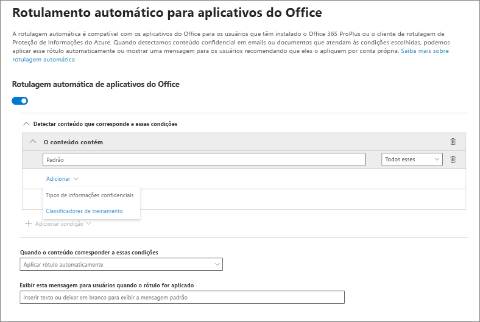
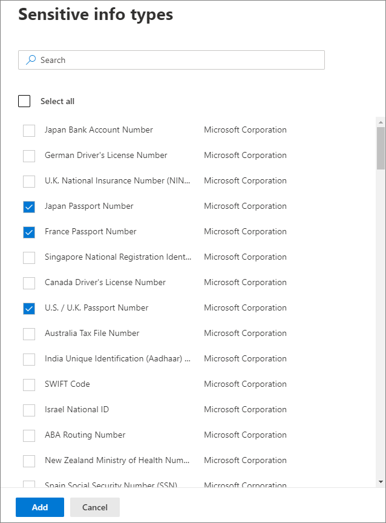
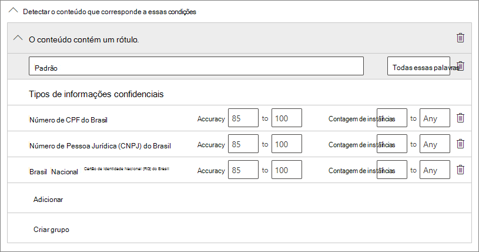
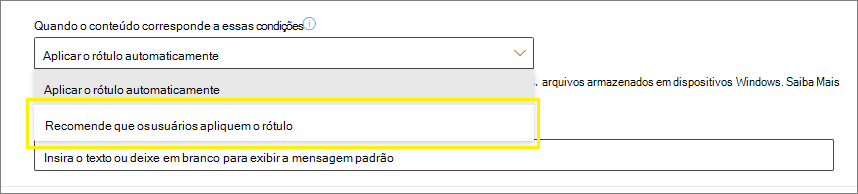
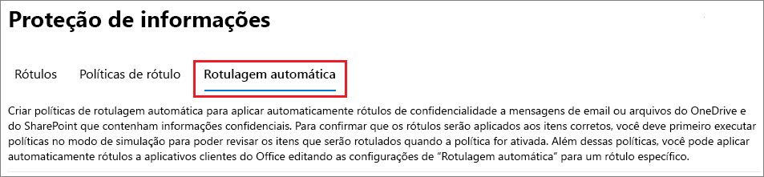
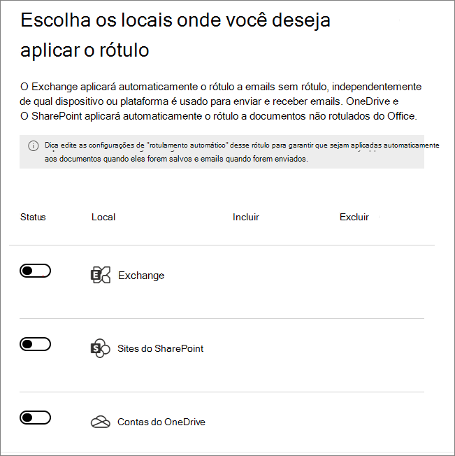
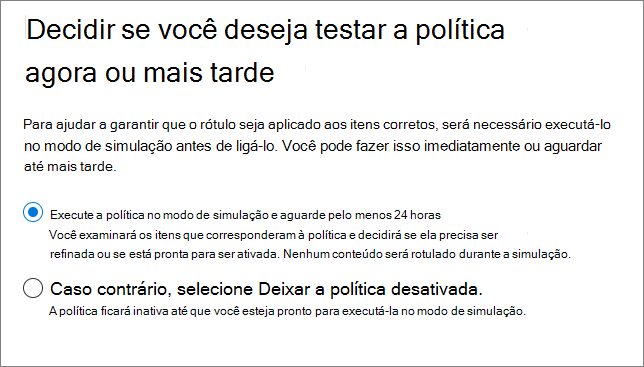
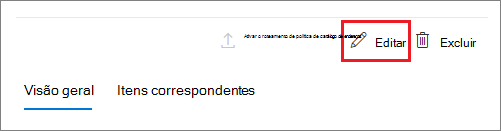

# <a name="apply-a-sensitivity-label-to-content-automatically"></a>Aplicar um rótulo de confidencialidade automaticamente ao conteúdo

>*[Diretrizes de licenciamento do Microsoft 365 para segurança e conformidade](https://aka.ms/ComplianceSD).*

> [!NOTE]
> Para informações sobre a aplicação automática de uma etiqueta de confidencialidade no Azure Purview (visualização), veja [Automaticamente rotular seu conteúdo no Azure Purview](https://docs.microsoft.com/azure/purview/create-sensitivity-label).

Quando você cria um rótulo de confidencialidade, é possível atribuir automaticamente esse rótulo a arquivos e emails quando ele corresponder às condições que você especificar.

A capacidade de aplicar rótulos de confidencialidade automaticamente ao conteúdo é importante porque:

- Você não precisa treinar seus usuários quando usar cada uma de suas classificações.

- Você não precisa depender dos usuários para classificar corretamente o conteúdo.

- Os usuários não precisam mais conhecer as suas políticas. Em vez disso, eles podem se concentrar no próprio trabalho.

Quando o conteúdo é rotulado manualmente, esse rótulo nunca será substituído pela rotulagem automática. No entanto, a etiquetagem automática pode substituir uma [etiqueta de prioridade mais baixa](sensitivity-labels.md#label-priority-order-matters) que foi aplicada automaticamente.

Há dois métodos diferentes para aplicar automaticamente um rótulo de confidencialidade ao conteúdo no Microsoft 365::

- **Rotulagem do lado do cliente quando os usuários editam documentos ou compõem (além de responder ou encaminhar) emails**: Use um rótulo configurado para rotular automaticamente os aplicativos do Office (Word, Excel, PowerPoint e Outlook). 
    
    Este método suporta a recomendação de um rótulo para os usuários, bem como a aplicação automática de um rótulo. Mas em ambos os casos, o usuário decide se aceita ou rejeita o rótulo, para ajudar a garantir a rotulagem correta do conteúdo. Essa rotulagem do lado do cliente possui um atraso mínimo para os documentos, pois o rótulo pode ser aplicado mesmo antes de o documento ser salvo. No entanto, nem todos os aplicativos cliente oferecem suporte à rotulagem automática. Esse recurso é suportado pelo cliente de rotulagem unificada da Proteção de Informações do Azure e por [algumas versões do Office](sensitivity-labels-office-apps.md#support-for-sensitivity-label-capabilities-in-apps). 
    
    Para obter instruções de configuração, confira [Como configurar a rotulamento automática para aplicativos do Office](#how-to-configure-auto-labeling-for-office-apps) nesta página.

- **Rotulagem do lado do serviço quando o conteúdo já foi salvo (no SharePoint ou no OneDrive) ou enviado por email (processado pelo Exchange Online)**: Use uma política de rotulação automática. 
    
    Esse método pode ser chamado de rotulagem automática de dados em repouso (em documentos no SharePoint e OneDrive) e dados em trânsito (em email enviado ou recebido pelo Exchange). No caso do Exchange, ele não inclui emails em repouso (caixas de correio).
    
    Como essa rotulagem é aplicada por serviços e não por aplicativos, você não precisa se preocupar com os aplicativos que os usuários têm e qual versão. Como resultado, esse recurso está imediatamente disponível em toda a organização e apropriado para rotular em escala. As políticas de rotulagem automática não oferecem suporte à rotulagem recomendada porque o usuário não interage com o processo de rotulagem. Em vez disso, o administrador executa as políticas no modo de simulação para ajudar a garantir a rotulagem correta do conteúdo antes de aplicar o rótulo.
    
    Para obter instruções de configuração, confira [Como configurar as políticas de rotulagem automática para o SharePoint, OneDrive e Exchange](#how-to-configure-auto-labeling-policies-for-sharepoint-onedrive-and-exchange) nesta página.
    
    Específico para rotulagem automática para o SharePoint e OneDrive:
    - Os arquivos do Office para Word, PowerPoint e Excel são suportados. Há suporte para o formato Open XML (como .docx e .xlsx), mas não para o formato Microsoft Office 97-2003 (como .doc e .xls).
        - Esses arquivos podem ser rotulados automaticamente quando não fazem parte de uma sessão aberta e se eles foram criados, carregados ou alterados desde que você criou políticas de rotulação automática, ou se os arquivos que não foram alterados já você criou suas políticas de rotulação automática.
    - Máximo de 25.000 arquivos rotulados automaticamente no seu locatário por dia.
    - Máximo de 10 políticas de rotulagem automática por locatário, cada uma visando até 10 sites (SharePoint ou OneDrive).
    - Os valores existentes para modificado, modificado por e a data não são alterados como resultado das políticas de rotulagem automática - tanto para o modo de simulação e quanto quando os rótulos são aplicados.
    - Quando o rótulo aplica criptografia, o [emissor de Gerenciamento de Direitos e proprietário de Gerenciamento de Direitos](https://docs.microsoft.com/azure/information-protection/configure-usage-rights#rights-management-issuer-and-rights-management-owner) é a conta que modificou o arquivo pela última vez.

    Específico para rotulagem automática do Exchange:
    - Diferentemente da rotulagem manual ou rotulagem automática com aplicativos do Office, os anexos do Office (arquivos do Word, Excel e PowerPoint) e os PDFs também são verificados quanto às condições especificadas na política de rotulagem automática. Quando há uma correspondência, o email é rotulado, mas não o anexo.
        - Para esses arquivos do Office, há suporte para o formato Open XML (como .docx e .xlsx), mas não para o formato Microsoft Office 97-2003 (como .doc e .xls).
    - Se você possui regras de fluxo de correio do Exchange ou políticas de prevenção contra perda de dados (DLP) que aplicam a criptografia de IRM: Quando o conteúdo é identificado por essas regras ou políticas e por uma política de rotulagem automática, o rótulo é aplicado. Se esse rótulo aplicar a criptografia, as configurações de IRM das regras de fluxo de email do Exchange ou políticas DLP serão ignoradas. No entanto, se esse rótulo não aplicar criptografia, as configurações de IRM das regras de fluxo de email ou políticas DLP serão aplicadas além do rótulo.
    - Um email com criptografia de IRM sem rótulo será substituído por um rótulo com todas as configurações de criptografia quando houver uma correspondência usando rotulagem automática.
    - Os emails de entrada são rotulados quando houver uma correspondência com as condições de rotulagem automática. No entanto, se o rótulo estiver configurado para criptografia, essa criptografia não será aplicada.
    - Quando o rótulo aplica criptografia, o [emissor do Gerenciamento de direitos e proprietário do Gerenciamento de direitos](https://docs.microsoft.com/azure/information-protection/configure-usage-rights#rights-management-issuer-and-rights-management-owner) é a pessoa que envia o e-mail.
    

## <a name="compare-auto-labeling-for-office-apps-with-auto-labeling-policies"></a>Comparar rotulagem automática para aplicativos do Office com políticas de rotulagem automática

Use a tabela a seguir para ajudá-lo a identificar as diferenças no comportamento dos dois métodos complementares de rotulagem automática:

|Recurso ou comportamento|Definição da etiqueta: Auto-rotulagem para arquivos e emails  |Política: Rotulagem automática|
|:-----|:-----|:-----|
|Dependência de aplicativos|[Sim](sensitivity-labels-office-apps.md#support-for-sensitivity-label-capabilities-in-apps) |Não \* |
|Restringir por local|Não |Sim |
|Condições: Classificadores de treinamento|Sim |Não |
|Condições: Opções de compartilhamento e opções adicionais para email|Não |Sim |
|Recomendações, dica de ferramenta da política e substituições de usuário|Sim |Não |
|Modo de simulação|Não |Sim |
|Anexos do Exchange verificados quanto a condições|Não | Sim|
|Aplicar marcações visuais |Sim |Sim (somente email) |
|Substituir a criptografia de IRM aplicada sem um rótulo|Sim, se o usuário tiver o direito mínimo de uso do Exportar |Sim (somente email) |
|Rótulo de email de entrada|Não |Sim (criptografia não aplicada) |

\* A rotulação automática não está disponível em todas as regiões. Se o locatário não oferecer suporte a essa funcionalidade, a guia de rotulamento automático não ficará visível no centro de rotulamento de administrador.

## <a name="how-multiple-conditions-are-evaluated-when-they-apply-to-more-than-one-label"></a>Como várias condições são avaliadas quando elas se aplicam a mais de um rótulo

Os rótulos são ordenados para avaliação de acordo com a posição especificada na política: o rótulo posicionado no início tem a posição mais baixa (menos confidencial) e o rótulo posicionado no final tem a posição mais alta (mais confidencial). Para saber mais sobre prioridade, confira [Prioridade de rótulos: a ordem é importante](sensitivity-labels.md#label-priority-order-matters)

## <a name="dont-configure-a-parent-label-to-be-applied-automatically-or-recommended"></a>Não configure uma etiqueta pai para ser aplicada automaticamente ou recomendada

Lembre-se de que você não pode aplicar um rótulo pai (um rótulo com sub-rótulos) ao conteúdo. Certifique-se de não configurar um rótulo pai para ser aplicado automaticamente ou recomendado nos aplicativos do Office, e não clique em um rótulo pai para uma política de etiquetagem automática. Se o fizer, o rótulo principal não será aplicado ao conteúdo.

Para usar a rotulagem automática com subrótulos, certifique0-se de publicar o rótulo pai e o subrótulo.

Confira mais informações em rótulos de pai e sub-rótulos[Sub-rótulos (agrupamento de rótulos)](sensitivity-labels.md#sublabels-grouping-labels).

## <a name="how-to-configure-auto-labeling-for-office-apps"></a>Como configurar rotulagem automática para aplicativos do Office

A rotulagem automática nos aplicativos Office para Windows têm suporte no cliente de rotulagem unificada da Proteção de Informações do Azure.  Para a rotulagem interna nos aplicativos do Office, esse recurso está em [diferentes estágios de disponibilidade de aplicativos diferentes](sensitivity-labels-office-apps.md#support-for-sensitivity-label-capabilities-in-apps).

As configurações de rotulagem automática para aplicativos do Office estão disponíveis quando você [cria ou edita um rótulo de confidencialidade](create-sensitivity-labels.md). Certifique-se de que **Arquivos e emails** estejam selecionados para o escopo do marcador: 


Ao passar pelo assistente, você verá a página **Auto-rotulagem para arquivos e emails** onde você pode escolher entre uma lista de tipos de informações confidenciais ou classificadores treináveis:



Quando esse rótulo de confidencialidade é aplicado automaticamente, o usuário vê uma notificação no aplicativo do Office. Por exemplo:


### <a name="configuring-sensitive-info-types-for-a-label"></a>Configurar tipos de informações confidenciais para um rótulo

Ao selecionar a opção **Tipos de informações confidenciais**, você vê a mesma lista de tipos de informações confidenciais que quando cria uma política de prevenção contra perda de dados (DLP). Assim, você pode, por exemplo, aplicar automaticamente um rótulo Altamente Confidencial a qualquer conteúdo que contenha informações pessoais dos clientes, como números de cartão de crédito, números de previdência social ou números de passaporte:



Depois de selecionar os tipos de informações confidenciais, você pode refinar sua condição alterando a contagem de instâncias ou a precisão da correspondência. Para mais informações, confira [Ajustar as regras para torná-las mais fáceis ou mais difíceis de combinar](data-loss-prevention-policies.md#tuning-rules-to-make-them-easier-or-harder-to-match).

Além disso, você pode escolher se uma condição deve detectar todos os tipos de informações confidenciais ou apenas uma delas. E para tornar suas condições mais flexíveis ou complexas, você pode adicionar grupos e usar operadores lógicos entre os grupos. Para mais informações, confira [Agrupamento e operadores lógicos](data-loss-prevention-policies.md#grouping-and-logical-operators).



### <a name="configuring-trainable-classifiers-for-a-label"></a>Configurar classificadores treináveis para um rótulo

Esta opção está atualmente no modo de visualização.

Ao selecionar a opção **Classificadores treináveis**, selecione um ou mais classificadores internos da Microsoft Corporation. Se você tiver criado seus próprios classificadores treináveis, eles também estão disponíveis para selecionar:


> [!CAUTION]
> Vamos substituir o classificador interno **Idioma Ofensivo** porque ele tem uma grande quantidade de falsos positivos. Não use esse classificador interno e se você estiver usando-o no momento, você deve migrar seus processos de negócios para fora dele. É recomendável usar os classificadores internos **Assédio Direcionado**, **Profanidade** e **Ameaças**.

Para saber mais sobre esses classificadores, confira [Saiba mais sobre classificadores de treinamento (visualização)](classifier-learn-about.md).

Durante o período de visualização desta opção, os seguintes aplicativos são compatíveis com classificadores treináveis de rótulos de confidencialidade:

- Microsoft 365 Apps para empresas ([antes Office 365 ProPlus](https://docs.microsoft.com/deployoffice/name-change)) para Windows, agora sendo distribuído no [Canal Atual](https://docs.microsoft.com/deployoffice/overview-update-channels#current-channel-overview) na versão 2006 e posterior:
    - Word
    - Excel
    - PowerPoint

- Office para aplicativos da Web, quando você [habilitou os rótulos de confidencialidade para arquivos do Office no SharePoint e no OneDrive](sensitivity-labels-sharepoint-onedrive-files.md):
    - Word
    - Excel
    - PowerPoint
    - Outlook

### <a name="recommend-that-the-user-applies-a-sensitivity-label"></a>Recomendar ao usuário que ele aplique um rótulo de confidencialidade

Se preferir, você pode recomendar aos usuários que apliquem o rótulo. Com essa opção, seus usuários podem aceitar a classificação e qualquer proteção associada ou descartar a recomendação se o rótulo não for adequado para seu conteúdo.



Veja o exemplo de um aviso do cliente de rotulagem unificada da Proteção de Informações do Azure quando você configura uma condição para aplicar um rótulo como uma ação recomendada, com uma dica de política personalizada. Você pode escolher o texto exibido na dica de política.


### <a name="when-automatic-or-recommended-labels-are-applied"></a>Quando rótulos automáticos ou recomendados são aplicados

A implementação de rotulagem automática e recomendada nos aplicativos do Office depende se você estiver usando a rotulagem interna do Office ou o cliente de rotulagem unificada da Proteção de Informações do Azure. Em ambos os casos, porém:

- Você não pode usar a rotulagem automática para documentos e e-mails rotulados anteriormente manualmente ou rotulados automaticamente com uma confidencialidade mais alta. Lembre-se de que você só pode aplicar um único rótulo de confidencialidade a um documento ou e-mail (além de um único rótulo de retenção).

- Não é possível usar a rotulagem recomendada nos documentos ou emails que foram rotulados anteriormente com uma confidencialidade mais alta. Quando o conteúdo já estiver rotulado com uma confidencialidade mais alta, o usuário não verá o aviso com a recomendação e a dica de política.

Específico para rotulagem interna:

- Nem todos os aplicativos dão suporte aos aplicativos do Office e a rotulagem automática (e recomendada). Para saber mais, confira [Suporte para recursos de rótulo de confidencialidade em aplicativos](sensitivity-labels-office-apps.md#support-for-sensitivity-label-capabilities-in-apps).

- Para obter os rótulos recomendados nas versões de área de trabalho do Word, o conteúdo confidencial que disparou a recomendação é sinalizado para que os usuários podem analisar e remover o conteúdo confidencial, em vez de aplicar o rótulo de confidencialidade recomendado.

- Para saber mais sobre como esses rótulos são aplicados aos aplicativos do Office, capturas de tela de exemplo e como as informações confidenciais são detectadas, confira [Aplicar ou recomendar rótulos de confidencialidade automaticamente aos seus arquivos e emails no Office](https://support.office.com/pt-BR/article/automatically-apply-or-recommend-sensitivity-labels-to-your-files-and-emails-in-office-622e0d9c-f38c-470a-bcdb-9e90b24d71a1).

Específico para o cliente de rotulagem unificada da Proteção de Informações do Azure:

-  A rotulagem automática e recomendada se aplica ao Word, Excel e PowerPoint quando você salva um documento e ao Outlook ao enviar um email.

- Para que o Outlook dê suporte a rótulos recomendados, você deve configurar primeiro uma [configuração de política avançada](https://docs.microsoft.com/azure/information-protection/rms-client/clientv2-admin-guide-customizations#enable-recommended-classification-in-outlook).

- As informações confidenciais podem ser detectadas no corpo de texto, em documentos e emails, além de cabeçalhos e rodapés - mas não na linha de assunto ou nos anexos do email.

## <a name="how-to-configure-auto-labeling-policies-for-sharepoint-onedrive-and-exchange"></a>Como configurar as políticas de rotulagem automática para o SharePoint, OneDrive e Exchange

Certifique-se de que você está ciente dos pré-requisitos antes de configurar as políticas de rotulação automática. 

### <a name="prerequisites-for-auto-labeling-policies"></a>Pré-requisitos para políticas de rotulagem automática

- Modo de simulação:
    - A auditoria do Microsoft 365 deve ser ativada. Se você precisar ativar a auditoria ou não tiver certeza se a auditoria já está ativada, confira [Ativar ou desativar a pesquisa de log de auditoria](turn-audit-log-search-on-or-off.md).
    - Para exibir o conteúdo do arquivo no modo de exibição de código-fonte, você deve ter a função **Visualizador de Conteúdo do Explorador de Conteúdo**. Por padrão, os administradores globais não possuem essa função. Caso não tenha essa permissão, você não verá o painel de visualização ao selecionar um item da guia **Itens Correspondentes**.

- Para rotular arquivos automaticamente no Microsoft Office SharePoint Online e no Microsoft OneDrive:
    - Você deve [habilitar rótulos de confidencialidade para arquivos do Office no SharePoint e no OneDrive ](sensitivity-labels-sharepoint-onedrive-files.md).
    - No momento em que a política de rotulagem automática é executada, o arquivo não deve estar aberto por outro processo ou usuário. Um arquivo que foi retirado para edição se enquadra nessa categoria.

- Se você planeja usar [tipos de informações confidenciais personalizadas](custom-sensitive-info-types.md), em vez de tipos de confidencialidade interna: 
    - Os tipos de informações de confidencialidade personalizados são avaliados para conteúdo adicionado ao Microsoft Office SharePoint Online ou OneDrive depois que os tipos de informações de confidencialidade personalizados são salvos. 
    - Para testar novos tipos de informações confidenciais personalizadas, crie-os antes de criar a política de rotulagem automática e crie novos documentos com dados de exemplo para teste.

- Um ou mais rótulos de confidencialidade [criados e publicados](create-sensitivity-labels.md) (para pelo menos um usuário) que você pode selecionar para suas políticas de rotulagem automática. Para esses rótulos:
    - Não importa se a rotulagem automática na configuração de rótulo dos aplicativos do Office está ativada ou desativada, porque essa configuração complementa as políticas de rotulagem automática, conforme explicado na introdução.
    - Se aos rótulos que você deseja usar para rotulagem automática estiverem configurados para usar marcações visuais (cabeçalhos, rodapés, marcas d'água), observe que eles não são aplicadas aos documentos.
    - Se os rótulos aplicarem [criptografia](encryption-sensitivity-labels.md), eles deverão ser configurados para a configuração **Atribuir permissões agora**.

### <a name="learn-about-simulation-mode"></a>Saiba mais sobre o modo de simulação

O modo de simulação é exclusivo das políticas de rotulagem automática e integrado ao fluxo de trabalho. Você não pode rotular automaticamente documentos e emails até que a política execute pelo menos uma simulação.

Fluxo de trabalho para uma política de rotulagem automática:

1. Crie e configure uma política de rotulagem automática.

2. Execute a política no modo de simulação e aguarde 24 horas, ou até que a simulação seja concluída.

3. Examine os resultados e, se necessário, refine a política. Execute novamente a política no modo de simulação e aguarde mais 24 horas, ou até que a simulação seja concluída.

4. Repita a etapa 3 conforme necessário.

5. Implante na produção.

A implantação simulada é executada como o parâmetro WhatIf do PowerShell. Você vê os resultados relatados como se a política de rotulagem automática tivesse aplicado o rótulo selecionado, usando as regras que você definiu. Você pode refinar as regras de precisão, se necessário, e executar novamente a simulação. No entanto, como a rotulagem automática do Exchange se aplica a emails enviados e recebidos, em vez de armazenados em caixas de correio, não espere que os resultados do email em uma simulação sejam consistentes, a menos que você possa enviar e receber exatamente as mesmas mensagens de email.

O modo de simulação também permite aumentar gradualmente o escopo da política de rotulagem automática antes da implantação. Por exemplo, você pode começar com um único local, como um site do SharePoint, com uma única biblioteca de documentos. Em seguida, com alterações iterativas, aumente o escopo para vários sites e depois para outro local, como o OneDrive.

Por fim, você pode usar o modo de simulação para fornecer uma aproximação do tempo necessário para executar a política de rotulagem automática, para ajudá-lo a planejar e agendar quando executá-la sem o modo de simulação.

### <a name="creating-an-auto-labeling-policy"></a>Criar uma política de rotulagem automática

1. No [centro de conformidade do Microsoft 365](https://compliance.microsoft.com/), navegue até rótulos de confidencialidade:
    
    - **Proteção de Informações** > **de soluções**
    
    Se você não vir essa opção imediatamente, selecione primeiro **Mostrar tudo**.

2. Selecione a guia **Rotulamento automático**:
    
    
    
    > [!NOTE]
    > Se você não vir a guia **Rotulamento automático**, esta funcionalidade não está disponível atualmente na sua região.

3. Selecione **+ Criar uma política de rotulamento automático**. Isso iniciará o Assistente de nova política:
    
    

4. Para a página **Escolher as informações às quais você deseja aplicar esse rótulo**: Selecione um dos modelos, como **Financeiro** ou **Privacidade**. Você pode refinar sua pesquisa usando o menu suspenso **Mostrar opções para**. Ou selecionar **Política personalizada** se os modelos não atenderem aos seus requisitos. Selecione **Avançar**.

5. Para a página **Nomear política de rotulagem automática**: Forneça um nome exclusivo e, opcionalmente, uma descrição para ajudar a identificar o rótulo, os locais e as condições automaticamente aplicados que identificam o conteúdo a ser rotulado.

6. Para a página **Escolher os locais onde você deseja aplicar o rótulo**: Selecione e especifique os locais para Exchange, sites do SharePoint e OneDrive. Em seguida, selecione **Avançar**.
    
    
    
    Você deve especificar sites individuais do SharePoint e contas do OneDrive. Para o OneDrive, a URL da conta do OneDrive de um usuário está no seguinte formato: `https://<tenant name>-my.sharepoint.com/personal/<user_name>_<tenant name>_com`
    
    Por exemplo, para um usuário no locatário contoso que tenha um nome de usuário "rsimone": `https://contoso-my.sharepoint.com/personal/rsimone_contoso_onmicrosoft_com`
    
    Para verificar a sintaxe do seu locatário e identificar URLs dos usuários, confira [Obter uma lista de todas as URLs de usuário do OneDrive em sua organização](https://docs.microsoft.com/onedrive/list-onedrive-urls).

7. Para a página **Configurar regras comuns ou avançadas**: Mantenha o padrão das **Regras comuns** para definir regras que identificam o conteúdo a ser rotulado em todos os locais selecionados. Se você precisar de regras diferentes por local, selecione **Configurações avançadas**. Em seguida, selecione **Avançar**.
    
    As regras usam condições que contêm tipos de informações confidenciais e opções de compartilhamento:
    - Para tipos de informações confidenciais, você pode selecionar os tipos de informações confidenciais internos e personalizados.
    - Para as opções compartilhadas, você pode escolher **apenas com pessoas dentro da minha organização** ou **com pessoas fora da minha organização**.
    
    Se o seu único local for **Exchange** ou se você selecionar **Regras avançadas**, há condições adicionais que você poderá selecionar:
    - O endereço IP do remetente é
    - O domínio do destinatário é
    - O destinatário é
    - A extensão de arquivo do anexo é
    - O anexo é protegido por senha
    - Nenhum conteúdo do anexo de email pôde ser verificado
    - Nenhum conteúdo do anexo de email concluiu a verificação

8. Dependendo das opções anteriores, você terá a oportunidade de criar novas regras usando condições e exceções.
    
    As opções de configuração para tipos de informações confidenciais são as mesmas que você seleciona para rotular automaticamente os aplicativos do Office. Se você precisar de mais informações, confira [Configurar tipos de informações confidenciais para um rótulo](#configuring-sensitive-info-types-for-a-label).
    
    Quando você definir todas as regras necessárias e confirmar o status delas, selecione **Avançar**. para passar para a escolha de um rótulo a ser aplicado automaticamente.

11. Para a página **Escolher um rótulo de aplicação automática**: Selecione **+ Escolher um rótulo**, selecione um rótulo no painel **Escolher um rótulo de confidencialidade** e selecione **Avançar**.

12. Para a página **Decida se deseja testar a política agora ou mais tarde**: selecione **Executar política no modo de simulação** se você estiver pronto para executar a política de rotulagem automática agora, no modo de simulação. Caso contrário, selecione **Deixar a política desativada**. Selecione **Avançar**: 
    
    

13. Para a página **Resumo**: Revise a configuração da política de rotulagem automática, faça as alterações necessárias e conclua o assistente.

Agora, em **Proteção de informações** > **, na página Rotulagem automática**, você verá a política de rotulagem automática na seção **Simulação** ou **Desativar**, dependendo se você optou por executá-la no modo de simulação ou não. Selecione a política para ver os detalhes da configuração e do status (por exemplo, a **Simulação da política ainda está sendo executada**). Para as políticas em modo de simulação, selecione a guia **Itens correspondentes** para ver quais emails ou documentos correspondem às regras que você especificou.

Você pode modificar sua política diretamente nesta interface:

- Para uma política na seção **Desativar**, selecione o botão **Editar política**.

- Para uma política na seção **Simulação**, selecione a opção **Editar política** na parte superior da página, em qualquer uma das guias:
    
    
    
    Quando estiver pronto para executar a política sem simulação, selecione a opção **Ativar política**.

Suas políticas automáticas são executadas continuamente até serem excluídas. Por exemplo, documentos novos e modificados serão incluídos nas configurações de política atuais.

Você também pode ver os resultados da política de rotulagem automática usando o [explorador de conteúdo](data-classification-content-explorer.md) quando tiver as [permissões](data-classification-content-explorer.md#permissions) apropriadas:
- O **Visualizador de Lista do Explorador de Conteúdo** permite que você veja o rótulo de um arquivo, mas não o conteúdo do arquivo.
- O **Visualizador de Conteúdo do Explorador de Conteúdo** permite que você veja o conteúdo do arquivo.

> [!TIP]
> Você também pode usar o gerenciador de conteúdo para identificar os locais que têm documentos com informações confidenciais, mas que não são rotulados. Usando essas informações, considere adicionar esses locais à política de rotulagem automática e inclua os tipos de informações confidenciais identificadas como regras.

### <a name="use-powershell-for-auto-labeling-policies"></a>Usar o PowerShell para políticas de rotulamento automático

Agora você pode usar o [Centro de Conformidade e Segurança do PowerShell](https://docs.microsoft.com/powershell/exchange/scc-powershell) para criar e configurar políticas de rotulamento automático. Isso significa que agora você pode criar um script completo da criação e da manutenção das políticas de rotulamento automático, que também fornece um método mais eficiente para especificar várias URLs para os locais do OneDrive e do SharePoint.

Antes de executar os comandos no PowerShell, você deve primeiro [conectar-se com o Centro de Segurança e Conformidade do PowerShell](https://docs.microsoft.com/powershell/exchange/connect-to-scc-powershell).

Para criar uma nova política de rotulamento automático: 

```powershell
New-AutoSensitivityLabelPolicy -Name <AutoLabelingPolicyName> -SharePointLocation "<SharePointSiteLocation>" -ApplySensitivityLabel <Label> -Mode TestWithoutNotifications
```
Esse comando cria uma política de rotulamento automático para um site do SharePoint especificado por você. Para um local do OneDrive, em vez disso, use o parâmetro *OneDriveLocation*. 

Para adicionar mais sites a uma política de rotulamento automático existente:

```powershell
$spoLocations = @("<SharePointSiteLocation1>","<SharePointSiteLocation2>")
Set-AutoSensitivityLabelPolicy -Identity <AutoLabelingPolicyName> -AddSharePointLocation $spoLocations -ApplySensitivityLabel <Label> -Mode TestWithoutNotifications
```

Esse comando especifica as URLs adicionais do SharePoint em uma variável que é adicionada a uma política de rotulamento automático existente. Se em vez disso quiser adicionar locais do OneDrive, use o parâmetro *AddOneDriveLocation* com uma variável diferente, como *$OneDriveLocations*.

Para criar uma nova regra de rotulamento automático:

```powershell
New-AutoSensitivityLabelRule -Policy <AutoLabelingPolicyName> -Name <AutoLabelingRuleName> -ContentContainsSensitiveInformation @{"name"= "a44669fe-0d48-453d-a9b1-2cc83f2cba77"; "mincount" = "2"} -Workload SharePoint
```

Para uma política de rotulamento automático existente, esse comando cria uma nova regra de política para detectar o tipo de informações confidenciais do **Número de seguridade social dos EUA (SSN)**, que tem uma ID de entidade a44669fe-0d48-453d-a9b1-2cc83f2cba77. Para encontrar as IDs de entidade para outros tipos de informações confidenciais, confira [Definições da entidade de tipo de informações confidenciais](sensitive-information-type-entity-definitions.md).

Para mais informações sobre os cmdlets do PowerShell que oferecem suporte a políticas de rotulação automática, seus parâmetros disponíveis e alguns exemplos, confira a ajuda do cmdlet a seguir:

- [Get-AutoSensitivityLabelPolicy](https://docs.microsoft.com/powershell/module/exchange/get-autosensitivitylabelpolicy)
- [New-AutoSensitivityLabelPolicy](https://docs.microsoft.com/powershell/module/exchange/new-autosensitivitylabelpolicy)
- [New-AutoSensitivityLabelRule](https://docs.microsoft.com/powershell/module/exchange/new-autosensitivitylabelrule)
- [Remove-AutoSensitivityLabelPolicy](https://docs.microsoft.com/powershell/module/exchange/remove-autosensitivitylabelpolicy)
- [Remove-AutoSensitivityLabelRule](https://docs.microsoft.com/powershell/module/exchange/remove-autosensitivitylabelrule)
- [Set-AutoSensitivityLabelPolicy](https://docs.microsoft.com/powershell/module/exchange/set-autosensitivitylabelpolicy)
- [Set-AutoSensitivityLabelRule](https://docs.microsoft.com/powershell/module/exchange/set-autosensitivitylabelrule)
