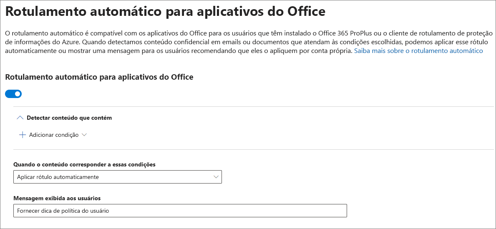

# Aplicar um rótulo de confidencialidade automaticamente ao conteúdoApply a sensitivity label to content automatically

Quando você cria um rótulo de confidencialidade, pode atribuir automaticamente um rótulo ao conteúdo, que inclui informações confidenciais, ou solicitar que os usuários apliquem o rótulo recomendado.When you create a sensitivity label, you can automatically assign that label to content containing sensitive information, or you can prompt users to apply the label that you recommend.

A capacidade de aplicar rótulos de confidencialidade automaticamente ao conteúdo é importante porque:The ability to apply sensitivity labels to content automatically is important because:

- Você não precisa treinar os usuários com relação a todas as classificações.You don't need to train your users on all of your classifications.

- Você não precisa depender dos usuários para classificar corretamente o conteúdo.You don't need to rely on users to classify all content correctly.

- Os usuários não precisam mais conhecer as políticas. Em vez disso, eles podem se concentrar no próprio trabalho.Users no longer need to know about your policies — they can instead focus on their work.

Para saber mais sobre os requisitos de licença, confira [Requisitos de assinatura e licenciamento de rótulos de confidencialidade](sensitivity-labels-office-apps.md#subscription-and-licensing-requirements-for-sensitivity-labels).For information about license requirements, see [Subscription and licensing requirements for sensitivity labels](sensitivity-labels-office-apps.md#subscription-and-licensing-requirements-for-sensitivity-labels).

As configurações de rotulagem automática estão disponíveis quando você cria um rótulo de confidencialidade no centro de conformidade do Microsoft 365, no centro de segurança do Microsoft 365 ou no Centro de Conformidade e Segurança do Office 365 em **Classificação** > **Rótulos de confidencialidade**.The auto-labeling settings are available when you create a sensitivity label in the Microsoft 365 compliance center, Microsoft 365 security center, or Office 365 Security & Compliance Center under **Classification** > **Sensitivity labels**.

## Aplicar um rótulo de confidencialidade automaticamente com base em condiçõesApply a sensitivity label automatically based on conditions

Um dos recursos mais poderosos dos rótulos de confidencialidade é a capacidade de aplicá-los automaticamente ao conteúdo que corresponde a determinadas condições.One of the most powerful features of sensitivity labels is the ability to apply them automatically to content that matches certain conditions. Nesse caso, as pessoas da sua organização não precisam aplicar os rótulos de confidencialidade. O Office 365 faz isso para elas.In this case, people in your organization don't need to apply the sensitivity labels — Office 365 does the work for them.

Você pode optar por aplicar rótulos de confidencialidade automaticamente ao conteúdo sempre que ele inclui tipos específicos de informações confidenciais. Quando configura um rótulo de confidencialidade para ser aplicado automaticamente, você vê a mesma lista de tipos de informações confidenciais quando cria uma política de prevenção contra perda de dados (DLP). Assim, você pode, por exemplo, aplicar automaticamente um rótulo Altamente Confidencial a qualquer conteúdo que inclua PII (informações de identificação pessoal) dos clientes, como números de cartão de crédito ou de seguro social.You can choose to apply sensitivity labels to content automatically when that content contains specific types of sensitive information. When you configure a sensitivity label to be applied automatically, you see the same list of sensitive information types as when you create a data loss prevention (DLP) policy. So you can, for example, automatically apply a Highly Confidential label to any content that contains customers' personally identifiable information (PII), such as credit card numbers or social security numbers.

Depois de escolher os tipos de informações confidenciais, você pode refinar sua condição alterando a contagem de instâncias ou a precisão da correspondência.After you choose your sensitive information types, you can refine your condition by changing the instance count or match accuracy. Para mais informações, confira [Ajustar as regras para torná-las mais fáceis ou mais difíceis de combinar](data-loss-prevention-policies.md#tuning-rules-to-make-them-easier-or-harder-to-match).For more information, see [Tuning rules to make them easier or harder to match](data-loss-prevention-policies.md#tuning-rules-to-make-them-easier-or-harder-to-match).

Além disso, você pode escolher se uma condição deve detectar todos os tipos de informações confidenciais ou apenas uma delas.Further, you can choose whether a condition must detect all sensitive information types, or just one of them. E para tornar suas condições mais flexíveis ou complexas, você pode adicionar grupos e usar operadores lógicos entre os grupos.And to make your conditions more flexible or complex, you can add groups and use logical operators between the groups. Para mais informações, confira [Agrupamento e operadores lógicos](data-loss-prevention-policies.md#grouping-and-logical-operators).For more information, see [Grouping and logical operators](data-loss-prevention-policies.md#grouping-and-logical-operators).

Quando um rótulo de confidencialidade é aplicado automaticamente, o usuário vê uma notificação no aplicativo do Office. Ele pode escolher **OK** ou ignorar a notificação.When a sensitivity label is automatically applied, the user sees a notification in their Office app. They can choose **OK** to dismiss the notification.

## Recomendar ao usuário que ele aplique um rótulo de confidencialidadeRecommend that the user apply a sensitivity label

Se preferir, você pode recomendar aos usuários que apliquem o rótulo.If you prefer, you can recommend to your users that they apply the label. Com essa opção, seus usuários podem aceitar a classificação e qualquer proteção associada ou descartar a recomendação se o rótulo não for adequado para seus documentos ou emails.With this option, your users can accept the classification and any associated protection, or dismiss the recommendation if the label isn't suitable for their document or email.

Os rótulos recomendados têm suporte no Word, PowerPoint e Excel (e exigem que o cliente de rotulagem unificado da Proteção de Informações do Azure esteja instalado).Recommended labels are supported in Word, PowerPoint, and Excel (and require that the Azure Information Protection unified labeling client is installed).

Veja o exemplo de um aviso ao configurar uma condição para aplicar um rótulo como uma ação recomendada, com uma dica de política personalizada. Você poderá escolher o texto que será exibido na dica de política.Here's an example of a prompt when you configure a condition to apply a label as a recommended action, with a custom policy tip. You can choose what text is displayed in the policy tip.

## Como aplicar rótulos automáticos ou recomendadosHow automatic or recommended labels are applied

- A etiquetagem automática se aplica ao Word, Excel e PowerPoint quando você salva um documento, e ao Outlook ao enviar um email.Automatic labeling applies to Word, Excel, and PowerPoint when you save a document, and to Outlook when you send an email. Essas condições detectam informações confidenciais no corpo de texto em documentos e emails, além de cabeçalhos e rodapés - mas não na linha de assunto ou nos anexos do email.These conditions detect sensitive information in the body text in documents and emails, and to headers and footers — but not in the subject line or attachments of email.

- Você não pode usar a classificação automática para documentos e e-mails rotulados anteriormente manualmente ou rotulados automaticamente com uma classificação mais alta.You can't use automatic classification for documents and emails that were previously manually labeled, or previously automatically labeled with a higher classification. Lembre-se de que você só pode aplicar um único rótulo de confidencialidade a um documento ou e-mail (além de um único rótulo de retenção).Remember, you can only apply a single sensitivity label to a document or email (in addition to a single retention label).

- As classificações recomendadas se aplicam ao Word, Excel e PowerPoint quando você salva os documentos.Recommended classification applies to Word, Excel, and PowerPoint when you save documents.

- Não é possível usar a classificação recomendada para os documentos que foram rotulados anteriormente com uma classificação mais alta.You can't use recommended classification for documents that were previously labeled with a higher classification. Quando o conteúdo já estiver rotulado com uma classificação mais alta, o usuário não verá o aviso com a recomendação e a dica de política.When the content's already labeled with a higher classification, the user won't see the prompt with the recommendation and policy tip.

## Como várias condições são avaliadas quando elas se aplicam a mais de um rótuloHow multiple conditions are evaluated when they apply to more than one label

Os rótulos são ordenados para avaliação de acordo com a posição especificada na política: o rótulo posicionado no início tem a posição mais baixa (menos confidencial) e o rótulo posicionado no final tem a posição mais alta (mais confidencial). Para saber mais sobre prioridade, confira [Prioridade de rótulos: a ordem é importante](sensitivity-labels.md#label-priority-order-matters)The labels are ordered for evaluation according to their position that you specify in the policy: The label positioned first has the lowest position (least sensitive) and the label positioned last has the highest position (most sensitive). For more information on priority, see [Label priority (order matters)](sensitivity-labels.md#label-priority-order-matters).

## Não configure uma etiqueta pai para ser aplicada automaticamente ou recomendadaDon't configure a parent label to be applied automatically or recommended

Lembre-se de que você não pode aplicar um rótulo pai (um rótulo com sub-rótulos) ao conteúdo.Remember, you can't apply a parent label (a label with sublabels) to content. Certifique-se de não configurar uma etiqueta pai para aplicação automática ou para a opção recomendada, pois a etiqueta pai não será aplicada ao conteúdo em aplicativos do Office que usam o cliente de rotulagem unificada da Proteção de Informações do Azure.Make sure that you don't configure a parent label to be auto-applied or recommended, because the parent label won't be applied to content in Office apps that use the Azure Information Protection unified labeling client. Confira mais informações em rótulos de pai e sub-rótulos[Sub-rótulos (agrupamento de rótulos)](sensitivity-labels.md#sublabels-grouping-labels).For more information on parent labels and sublabels, see [Sublabels (grouping labels)](sensitivity-labels.md#sublabels-grouping-labels).
