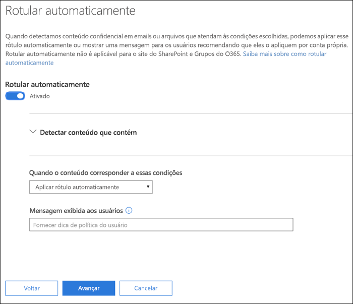
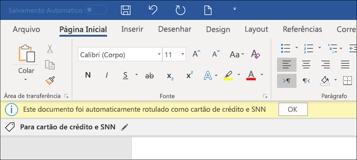
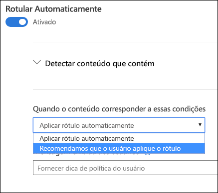

# Aplicar um rótulo de confidencialidade automaticamente ao conteúdo

Quando você cria um rótulo de confidencialidade, pode atribuir automaticamente um rótulo ao conteúdo, que inclui informações confidenciais, ou solicitar que os usuários apliquem o rótulo recomendado.

A capacidade de aplicar rótulos de confidencialidade automaticamente ao conteúdo é importante porque:

- Você não precisa treinar os usuários com relação a todas as classificações.

- Você não precisa depender dos usuários para classificar corretamente o conteúdo.

- Os usuários não precisam mais conhecer as políticas. Em vez disso, eles podem se concentrar no próprio trabalho.

Para saber mais sobre os requisitos de licença, confira [Requisitos de assinatura e licenciamento de rótulos de confidencialidade](sensitivity-labels-office-apps.md#subscription-and-licensing-requirements-for-sensitivity-labels).

As configurações de rotulagem automática estão disponíveis quando você cria um rótulo de confidencialidade no centro de conformidade do Microsoft 365, no centro de segurança do Microsoft 365 ou no Centro de Conformidade e Segurança do Office 365 em **Classificação** > **Rótulos de confidencialidade**.

## Aplicar um rótulo de confidencialidade automaticamente com base em condições

Um dos recursos mais poderosos dos rótulos de confidencialidade é a capacidade de aplicá-los automaticamente ao conteúdo que corresponde a determinadas condições. Nesse caso, as pessoas da sua organização não precisam aplicar os rótulos de confidencialidade. O Office 365 faz isso para elas.

Você pode optar por aplicar rótulos de confidencialidade automaticamente ao conteúdo sempre que ele inclui tipos específicos de informações confidenciais. Quando configura um rótulo de confidencialidade para ser aplicado automaticamente, você vê a mesma lista de tipos de informações confidenciais quando cria uma política de prevenção contra perda de dados (DLP). Assim, você pode, por exemplo, aplicar automaticamente um rótulo Altamente Confidencial a qualquer conteúdo que inclua PII (informações de identificação pessoal) dos clientes, como números de cartão de crédito ou de seguro social.

Depois de escolher os tipos de informações confidenciais, você pode refinar sua condição alterando a contagem de instâncias ou a precisão da correspondência. Para mais informações, confira [Ajustar as regras para torná-las mais fáceis ou mais difíceis de combinar](data-loss-prevention-policies.md#tuning-rules-to-make-them-easier-or-harder-to-match).

Além disso, você pode escolher se uma condição deve detectar todos os tipos de informações confidenciais ou apenas uma delas. E para tornar suas condições mais flexíveis ou complexas, você pode adicionar grupos e usar operadores lógicos entre os grupos. Para mais informações, confira [Agrupamento e operadores lógicos](data-loss-prevention-policies.md#grouping-and-logical-operators).

Quando um rótulo de confidencialidade é aplicado automaticamente, o usuário vê uma notificação no aplicativo do Office. Ele pode escolher **OK** ou ignorar a notificação.

## Recomendar ao usuário que ele aplique um rótulo de confidencialidade

Se preferir, você pode recomendar aos usuários que apliquem o rótulo. Com essa opção, seus usuários podem aceitar a classificação e qualquer proteção associada ou descartar a recomendação se o rótulo não for adequado para seus documentos ou emails.

Os rótulos recomendados têm suporte no Word, PowerPoint e Excel (e exigem que o cliente de rotulagem unificado da Proteção de Informações do Azure esteja instalado).

Veja o exemplo de um aviso ao configurar uma condição para aplicar um rótulo como uma ação recomendada, com uma dica de política personalizada. Você poderá escolher o texto que será exibido na dica de política.

## Como aplicar rótulos automáticos ou recomendados

- A etiquetagem automática se aplica ao Word, Excel e PowerPoint quando você salva um documento, e ao Outlook ao enviar um email. Essas condições detectam informações confidenciais no corpo de texto em documentos e emails, além de cabeçalhos e rodapés - mas não na linha de assunto ou nos anexos do email.

- Você não pode usar a classificação automática para documentos e e-mails rotulados anteriormente manualmente ou rotulados automaticamente com uma classificação mais alta. Lembre-se de que você só pode aplicar um único rótulo de confidencialidade a um documento ou e-mail (além de um único rótulo de retenção).

- As classificações recomendadas se aplicam ao Word, Excel e PowerPoint quando você salva os documentos.

- Não é possível usar a classificação recomendada para os documentos que foram rotulados anteriormente com uma classificação mais alta. Quando o conteúdo já estiver rotulado com uma classificação mais alta, o usuário não verá o aviso com a recomendação e a dica de política.

## Como várias condições são avaliadas quando elas se aplicam a mais de um rótulo

Os rótulos são ordenados para avaliação de acordo com a posição especificada na política: o rótulo posicionado no início tem a posição mais baixa (menos confidencial) e o rótulo posicionado no final tem a posição mais alta (mais confidencial). Para saber mais sobre prioridade, confira [Prioridade de rótulos: a ordem é importante](sensitivity-labels.md#label-priority-order-matters)

## Não configure uma etiqueta pai para ser aplicada automaticamente ou recomendada

Lembre-se de que você não pode aplicar um rótulo pai (um rótulo com sub-rótulos) ao conteúdo. Certifique-se de não configurar uma etiqueta pai para aplicação automática ou para a opção recomendada, pois a etiqueta pai não será aplicada ao conteúdo em aplicativos do Office que usam o cliente de rotulagem unificada da Proteção de Informações do Azure. Confira mais informações em rótulos de pai e sub-rótulos[Sub-rótulos (agrupamento de rótulos)](sensitivity-labels.md#sublabels-grouping-labels).
