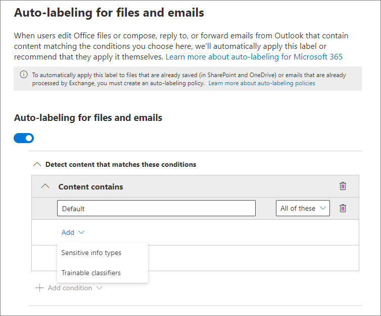
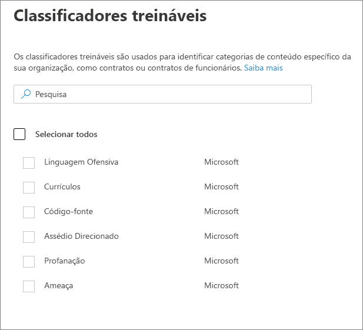

# Aplicar um rótulo de confidencialidade automaticamente ao conteúdoApply a sensitivity label to content automatically

>*[Diretrizes de licenciamento do Microsoft 365 para segurança e conformidade](https://aka.ms/ComplianceSD).**[Microsoft 365 licensing guidance for security & compliance](https://aka.ms/ComplianceSD).*

Ao criar um rótulo de confidencialidade, você pode atribuir automaticamente esse rótulo ao conteúdo quando ele corresponder às condições especificadas.When you create a sensitivity label, you can automatically assign that label to content when it matches conditions that you specify.

A capacidade de aplicar rótulos de confidencialidade automaticamente ao conteúdo é importante porque:The ability to apply sensitivity labels to content automatically is important because:

- Você não precisa treinar seus usuários quando usar cada uma de suas classificações.You don't need to train your users when to use each of your classifications.

- Você não precisa depender dos usuários para classificar corretamente o conteúdo.You don't need to rely on users to classify all content correctly.

- Os usuários não precisam mais conhecer as políticas. Em vez disso, eles podem se concentrar no próprio trabalho.Users no longer need to know about your policies — they can instead focus on their work.

Há dois métodos diferentes para aplicar automaticamente um rótulo de confidencialidade:There are two different methods for automatically applying a sensitivity label:

- **Rotulagem do lado do cliente quando os usuários editam documentos ou redigirem (além de responder ou encaminhar) emails**: Use um rótulo configurado para rotular automaticamente os aplicativos do Office (Word, Excel, PowerPoint e Outlook).**Client-side labeling when users edit documents or compose (also reply or forward) emails**: Use a label that's configured for auto-labeling for Office apps (Word, Excel, PowerPoint, and Outlook). 
    
    Este método suporta a recomendação de um rótulo para os usuários, bem como a aplicação automática de um rótulo.This method supports recommending a label to users, as well as automatically applying a label. Mas em ambos os casos, o usuário decide se aceita ou rejeita o rótulo, para ajudar a garantir a rotulagem correta do conteúdo.But in both cases, the user decides whether to accept or reject the label, to help ensure the correct labeling of content. Essa rotulagem do lado do cliente possui um atraso mínimo para os documentos, pois o rótulo pode ser aplicado mesmo antes de o documento ser salvo.This client-side labeling has minimal delay for documents because the label can be applied even before the document is saved. No entanto, nem todos os aplicativos cliente oferecem suporte à rotulagem automática.However, not all client apps support auto-labeling. Esse recurso é suportado pelo cliente de rotulagem unificada da Proteção de Informações do Azure e por [algumas versões do Office](sensitivity-labels-office-apps.md#support-for-sensitivity-label-capabilities-in-apps).This capability is supported by the Azure Information Protection unified labeling client, and [some versions of Office](sensitivity-labels-office-apps.md#support-for-sensitivity-label-capabilities-in-apps). 
    
    Para obter instruções de configuração, confira [Como configurar a rotulamento automática para aplicativos do Office](#how-to-configure-auto-labeling-for-office-apps) nesta página.For configuration instructions, see [How to configure auto-labeling for Office apps](#how-to-configure-auto-labeling-for-office-apps) on this page.

- **Rotulagem do lado do serviço quando o conteúdo já foi salvo (no SharePoint Online ou no OneDrive for Business) ou enviado por email (processado pelo Exchange Online)**: Use uma política de rotulação automática - atualmente no modo de visualização.**Service-side labeling when content is already saved (in SharePoint Online or OneDrive for Business) or emailed (processed by Exchange Online)**: Use an auto-labeling policy—currently in preview. 
    
    > [!NOTE]
    > Veja o anúncio de visualização, [Anunciar a visualização pública de classificação automática com rótulos de confidencialidade nos serviços do Microsoft 365](https://techcommunity.microsoft.com/t5/security-privacy-and-compliance/announcing-public-preview-of-auto-classification-with/ba-p/1279961).See the preview announcement, [Announcing public preview of auto classification with sensitivity labels in Microsoft 365 services](https://techcommunity.microsoft.com/t5/security-privacy-and-compliance/announcing-public-preview-of-auto-classification-with/ba-p/1279961).
    
    Esse método é chamado de classificação automática com rótulos de confidencialidade.This method is referred to as auto classification with sensitivity labels. Você também pode ouvi-lo ser chamado de rotulagem automática de dados em repouso (documentos no SharePoint e OneDrive) e dados em trânsito (email enviado ou recebido pelo Exchange).You might also hear it referred to as auto-labeling for data at rest (documents in SharePoint and OneDrive) and data in transit (email that is sent or received by Exchange). No caso do Exchange, ele não inclui emails em repouso (caixas de correio).For Exchange, it doesn't include emails at rest (mailboxes). 
    
    Como essa rotulagem é aplicada por serviços e não por aplicativos, você não precisa se preocupar com os aplicativos que os usuários têm e qual versão.Because this labeling is applied by services rather than by applications, you don't need to worry about what apps users have and what version. Como resultado, esse recurso está imediatamente disponível em toda a organização e apropriado para rotular em escala.As a result, this capability is immediately available throughout your organization and suitable for labeling at scale. As políticas de rotulagem automática não oferecem suporte à rotulagem recomendada porque o usuário não interage com o processo de rotulagem.Auto-labeling policies don't support recommended labeling because the user doesn't interact with the labeling process. Em vez disso, o administrador executa as políticas no modo de simulação para ajudar a garantir a rotulagem correta do conteúdo antes de aplicar o rótulo.Instead, the administrator runs the policies in simulation mode to help ensure the correct labeling of content before actually applying the label.
    
    Para obter instruções de configuração, confira [Como configurar as políticas de rotulagem automática para o SharePoint, OneDrive e Exchange](#how-to-configure-auto-labeling-policies-for-sharepoint-onedrive-and-exchange) nesta página.For configuration instructions, see [How to configure auto-labeling policies for SharePoint, OneDrive, and Exchange](#how-to-configure-auto-labeling-policies-for-sharepoint-onedrive-and-exchange) on this page.
    
    Específico para rotulagem automática para o SharePoint e OneDrive:Specific to auto-labeling for SharePoint and OneDrive:
    - Máximo de 25.000 arquivos rotulados automaticamente (Word, PowerPoint ou Excel) em seu locatário por diaMaximum of 25,000 automatically labeled files (Word, PowerPoint, or Excel) in your tenant per day
    - Máximo de 10 conjuntos de sites em todas as políticasMaximum of 10 sites collections across all policies
    - Máximo de 10 políticas em seu locatárioMaximum of 10 policies across your tenant

    Específico para rotulagem automática para o Exchange:Specific to auto-labeling for Exchange:
    - Diferentemente da rotulagem manual ou da rotulagem automática com aplicativos do Office, os anexos do Office também são verificados quanto às condições especificadas na política de rotulagem automática.Unlike manual labeling or auto-labeling with Office apps, Office attachments are also scanned for the conditions you specify in your auto-labeling policy. Quando há uma correspondência, o email é rotulado, mas não o anexo.When there is a match, the email is labeled but not the attachment.
    - Se você possui regras de fluxo de correio do Exchange ou políticas de prevenção contra perda de dados (DLP) que aplicam a criptografia de IRM: Quando o conteúdo é identificado por essas regras ou políticas e por uma política de rotulagem automática, o rótulo é aplicado.If you have Exchange mail flow rules or data loss prevention (DLP) policies that apply IRM encryption: When content is identified by these rules or policies and an auto-labeling policy, the label is applied. Se esse rótulo aplicar a criptografia, as configurações de IRM das regras de fluxo de email do Exchange ou políticas DLP serão ignoradas.If that label applies encryption, the IRM settings from the Exchange mail flow rules or DLP policies are ignored. No entanto, se esse rótulo não aplicar criptografia, as configurações de IRM das regras de fluxo de email ou políticas DLP serão aplicadas além do rótulo.However, if that label doesn't apply encryption, the IRM settings from the mail flow rules or DLP policies are applied in addition to the label.
    - Um email com criptografia de IRM sem rótulo será substituído por um rótulo com todas as configurações de criptografia quando houver uma correspondência usando rotulagem automática.Email that has IRM encryption with no label will be replaced by a label with any encryption settings when there is a match by using auto-labeling.
    - Os emails de entrada são rotulados quando houver uma correspondência com as condições de rotulagem automática.Incoming email is labeled when there is a match with your auto-labeling conditions. No entanto, se o rótulo estiver configurado para criptografia, essa criptografia não será aplicada.However, if the label is configured for encryption, that encryption isn't applied.
    

## Comparar rotulagem automática para aplicativos do Office com políticas de rotulagem automáticaCompare auto-labeling for Office apps with auto-labeling policies

Use a tabela a seguir para ajudá-lo a identificar as diferenças no comportamento dos dois métodos complementares de rotulagem automática:Use the following table to help you identify the differences in behavior for the two complementary automatic labeling methods:

|Recurso ou comportamentoFeature or behavior|Configuração do rótulo: Rotulagem automática para aplicativos do OfficeLabel setting: Auto-labeling for Office apps |Política: Rotulagem automáticaPolicy: Auto-labeling|
|:-----|:-----|:-----|:-----|
|Dependência de aplicativosApp dependency|Sim[Yes](sensitivity-labels-office-apps.md#support-for-sensitivity-label-capabilities-in-apps) |NãoNo |
|Restringir por localRestrict by location|NãoNo |SimYes |
|Condições: Classificadores de treinamentoConditions: Trainable classifers|Sim (visualização limitada)Yes (limited preview) |NãoNo |
|Condições: Opções de compartilhamento e opções adicionais para emailConditions: Sharing options and additional options for email|NãoNo |SimYes |
|Recomendações, dica de ferramenta da política e substituições de usuárioRecommendations, policy tooltip, and user overrides|SimYes |NãoNo |
|Modo de simulaçãoSimulation mode|NãoNo |SimYes |
|Anexos do Exchange verificados quanto a condiçõesExchange attachments checked for conditions|NãoNo | SimYes|
|Aplicar marcações visuaisApply visual markings |SimYes |Sim (somente email)Yes (email only) |
|Substituir a criptografia de IRM aplicada sem um rótuloOverride IRM encryption applied without a label|Sim, se o usuário tiver o direito mínimo de uso do ExportarYes if the user has the minimum usage right of Export |Sim (somente email)Yes (email only) |
|Rótulo de email de entradaLabel incoming email|NãoNo |Sim (criptografia não aplicada)Yes (encryption not applied) |

> [!NOTE]
> Quando o conteúdo é rotulado manualmente, esse rótulo nunca será substituído pela rotulagem automática.When content has been manually labeled, that label will never be replaced by automatic labeling. No entanto, as políticas de rotulagem automática podem substituir um [rótulo de prioridade mais baixa](sensitivity-labels.md#label-priority-order-matters) que foi aplicado usando rotulagem automática para aplicativos do Office.However, auto-labeling policies can replace a [lower priority label](sensitivity-labels.md#label-priority-order-matters) that was applied by using auto-labeling for Office apps.

## Como várias condições são avaliadas quando elas se aplicam a mais de um rótuloHow multiple conditions are evaluated when they apply to more than one label

Os rótulos são ordenados para avaliação de acordo com a posição especificada na política: o rótulo posicionado no início tem a posição mais baixa (menos confidencial) e o rótulo posicionado no final tem a posição mais alta (mais confidencial). Para saber mais sobre prioridade, confira [Prioridade de rótulos: a ordem é importante](sensitivity-labels.md#label-priority-order-matters)The labels are ordered for evaluation according to their position that you specify in the policy: The label positioned first has the lowest position (least sensitive) and the label positioned last has the highest position (most sensitive). For more information on priority, see [Label priority (order matters)](sensitivity-labels.md#label-priority-order-matters).

## Não configure uma etiqueta pai para ser aplicada automaticamente ou recomendadaDon't configure a parent label to be applied automatically or recommended

Lembre-se de que você não pode aplicar um rótulo pai (um rótulo com sub-rótulos) ao conteúdo.Remember, you can't apply a parent label (a label with sublabels) to content. Certifique-se de não configurar um rótulo pai para ser aplicado automaticamente ou recomendado nos aplicativos do Office, e não clique em um rótulo pai para uma política de etiquetagem automática.Make sure that you don't configure a parent label to be auto-applied or recommended in Office apps, and don't select a parent label for an auto-labeling policy. Se o fizer, o rótulo principal não será aplicado ao conteúdo.If you do, the parent label won't be applied to content.

Para usar a rotulagem automática com subrótulos, certifique0-se de publicar o rótulo pai e o subrótulo.To use automatic labeling with sublabels, make sure you publish both the parent label and the sublabel.

Confira mais informações em rótulos de pai e sub-rótulos[Sub-rótulos (agrupamento de rótulos)](sensitivity-labels.md#sublabels-grouping-labels).For more information on parent labels and sublabels, see [Sublabels (grouping labels)](sensitivity-labels.md#sublabels-grouping-labels).

## Como configurar rotulagem automática para aplicativos do OfficeHow to configure auto-labeling for Office apps

A rotulagem automática nos aplicativos Office para Windows têm suporte no cliente de rotulagem unificada da Proteção de Informações do Azure. Automatic labeling in Office apps for Windows is supported by the Azure Information Protection unified labeling client. Para rotulagem interna nos aplicativos do Office, esse recurso está [na visualização de alguns aplicativos](sensitivity-labels-office-apps.md#support-for-sensitivity-label-capabilities-in-apps).For built-in labeling in Office apps, this capability is [in preview for some apps](sensitivity-labels-office-apps.md#support-for-sensitivity-label-capabilities-in-apps).

As configurações de rotulagem automática para aplicativos do Office estão disponíveis quando você [cria ou edita um rótulo de confidencialidade](create-sensitivity-labels.md):The auto-labeling settings for Office apps are available when you [create or edit a sensitivity label](create-sensitivity-labels.md):

Você pode optar por aplicar rótulos de confidencialidade ao conteúdo automaticamente quando esse conteúdo contém tipos específicos de informações confidenciais.You can choose to apply sensitivity labels to content automatically when that content contains specific types of sensitive information. Escolha em uma lista de tipos ou classificadores de informações confidenciais:Choose from a list of sensitive info types or classifers:

> [!NOTE]
> Atualmente, a opção para **Classificadores** está em visualização limitada e exige que você envie um formulário à Microsoft para habilitar esse recurso para seu locatário.Currently, the option for **Classifers** is in limited preview and requires you to submit a form to Microsoft to enable this capability for your tenant. Para obter mais informações, confira a postagem do blog [Anunciar a rotulagem automática no Office Apps usando classificadores internos - Visualização limitada](https://techcommunity.microsoft.com/t5/security-privacy-and-compliance/announcing-automatic-labeling-in-office-apps-using-built-in/ba-p/1192889).For more information, see the blog post [Announcing automatic labeling in Office Apps using built-in classifiers - Limited Preview](https://techcommunity.microsoft.com/t5/security-privacy-and-compliance/announcing-automatic-labeling-in-office-apps-using-built-in/ba-p/1192889).

Quando esse rótulo de confidencialidade é aplicado automaticamente, o usuário vê uma notificação no aplicativo do Office.When this sensitivity label is automatically applied, the user sees a notification in their Office app. Por exemplo:For example:

### Configurar tipos de informações confidenciais para um rótuloConfiguring sensitive info types for a label

Ao selecionar a opção **Tipos de informações confidenciais**, você vê a mesma lista de tipos de informações confidenciais que quando cria uma política de prevenção contra perda de dados (DLP).When you select the **Sensitive info types** option, you see the same list of sensitive information types as when you create a data loss prevention (DLP) policy. Assim, você pode, por exemplo, aplicar automaticamente um rótulo Altamente Confidencial a qualquer conteúdo que contenha informações de identificação pessoal (PII) dos clientes, como números de cartão de crédito ou números de previdência social:So you can, for example, automatically apply a Highly Confidential label to any content that contains customers' personally identifiable information (PII), such as credit card numbers or social security numbers:

Depois de selecionar os tipos de informações confidenciais, você pode refinar sua condição alterando a contagem de instâncias ou a precisão da correspondência.After you select your sensitive information types, you can refine your condition by changing the instance count or match accuracy. Para mais informações, confira [Ajustar as regras para torná-las mais fáceis ou mais difíceis de combinar](data-loss-prevention-policies.md#tuning-rules-to-make-them-easier-or-harder-to-match).For more information, see [Tuning rules to make them easier or harder to match](data-loss-prevention-policies.md#tuning-rules-to-make-them-easier-or-harder-to-match).

Além disso, você pode escolher se uma condição deve detectar todos os tipos de informações confidenciais ou apenas uma delas.Further, you can choose whether a condition must detect all sensitive information types, or just one of them. E para tornar suas condições mais flexíveis ou complexas, você pode adicionar grupos e usar operadores lógicos entre os grupos.And to make your conditions more flexible or complex, you can add groups and use logical operators between the groups. Para mais informações, confira [Agrupamento e operadores lógicos](data-loss-prevention-policies.md#grouping-and-logical-operators).For more information, see [Grouping and logical operators](data-loss-prevention-policies.md#grouping-and-logical-operators).

### Configurar classificadores para um rótuloConfiguring classifers for a label

Ao selecionar a opção **Classificadores**, selecione um ou mais dos classificadores internos:When you select the **Classifers** option, select one or more of the built-in classifiers:

Para obter mais informações sobre os classificadores, confira [Introdução aos classificadores de treinamento (visualização)](classifier-getting-started-with.md).For more information about these classifers, see [Getting started with trainable classifiers (preview)](classifier-getting-started-with.md).

Durante o período de visualização, os seguintes aplicativos oferecem suporte a classificadores de rótulos de confidencialidade:During the preview period, the following apps support classifers for sensitivity labels:

- Aplicativos da área de trabalho do Office 365 ProPlus para Windows, do [Office Insider](https://office.com/insider):Office 365 ProPlus desktop apps for Windows, from [Office Insider](https://office.com/insider):
    - WordWord
    - ExcelExcel
    - PowerPointPowerPoint

- Office para aplicativos da Web, quando você [habilitou os rótulos de confidencialidade para arquivos do Office no SharePoint e no OneDrive (visualização pública)](sensitivity-labels-sharepoint-onedrive-files.md):Office for the web apps, when you have [enabled sensitivity labels for Office files in SharePoint and OneDrive (public preview)](sensitivity-labels-sharepoint-onedrive-files.md):
    - WordWord
    - ExcelExcel
    - PowerPointPowerPoint
    - OutlookOutlook

### Recomenda-se que o usuário aplique um rótulo de confidencialidade em aplicativos do OfficeRecommend that the user applies a sensitivity label in Office apps

Se preferir, você pode recomendar aos usuários que apliquem o rótulo.If you prefer, you can recommend to your users that they apply the label. Com essa opção, seus usuários podem aceitar a classificação e qualquer proteção associada ou descartar a recomendação se o rótulo não for adequado para seu conteúdo.With this option, your users can accept the classification and any associated protection, or dismiss the recommendation if the label isn't suitable for their content.

Veja o exemplo de um aviso do cliente de rotulagem unificada da Proteção de Informações do Azure quando você configura uma condição para aplicar um rótulo como uma ação recomendada, com uma dica de política personalizada.Here's an example of a prompt from the Azure Information Protection unified labeling client when you configure a condition to apply a label as a recommended action, with a custom policy tip. Você pode escolher o texto exibido na dica de política.You can choose what text is displayed in the policy tip.

### Quando os rótulos automáticos ou recomendados são aplicados em aplicativos do OfficeWhen automatic or recommended labels are applied in Office apps

A implementação de rotulagem automática e recomendada nos aplicativos do Office depende se você estiver usando a rotulagem interna do Office ou o cliente de rotulagem unificada da Proteção de Informações do Azure.The implementation of automatic and recommended labeling in Office apps depend on whether you're using labeling that's built into Office, or the Azure Information Protection unified labeling client. Em ambos os casos, porém:In both cases, however:

- Você não pode usar a rotulagem automática para documentos e e-mails rotulados anteriormente manualmente ou rotulados automaticamente com uma confidencialidade mais alta.You can't use automatic labeling for documents and emails that were previously manually labeled, or previously automatically labeled with a higher sensitivity. Lembre-se de que você só pode aplicar um único rótulo de confidencialidade a um documento ou e-mail (além de um único rótulo de retenção).Remember, you can only apply a single sensitivity label to a document or email (in addition to a single retention label).

- Não é possível usar a rotulagem recomendada nos documentos ou emails que foram rotulados anteriormente com uma confidencialidade mais alta.You can't use recommended labeling for documents or emails that were previously labeled with a higher sensitivity. Quando o conteúdo já estiver rotulado com uma confidencialidade mais alta, o usuário não verá o aviso com a recomendação e a dica de política.When the content's already labeled with a higher sensitivity, the user won't see the prompt with the recommendation and policy tip.

Específico para rotulagem interna:Specific to built-in labeling:

- Nem todos os aplicativos dão suporte aos aplicativos do Office e a rotulagem automática (e recomendada).Not all Office apps support automatic (and recommended) labeling. Para saber mais, confira [Suporte para recursos de rótulo de confidencialidade em aplicativos](sensitivity-labels-office-apps.md#support-for-sensitivity-label-capabilities-in-apps).For more information, see [Support for sensitivity label capabilities in apps](sensitivity-labels-office-apps.md#support-for-sensitivity-label-capabilities-in-apps).

- Para obter os rótulos recomendados nas versões de área de trabalho do Word, o conteúdo confidencial que disparou a recomendação é sinalizado para que os usuários podem analisar e remover o conteúdo confidencial, em vez de aplicar o rótulo de confidencialidade recomendado.For recommended labels in the desktop versions of Word, the sensitive content that triggered the recommendation is flagged so that users can review and remove the sensitive content instead of applying the recommended sensitivity label.

- Para saber mais sobre como esses rótulos são aplicados aos aplicativos do Office, capturas de tela de exemplo e como as informações confidenciais são detectadas, confira [Aplicar ou recomendar rótulos de confidencialidade automaticamente aos seus arquivos e emails no Office](https://support.office.com/en-us/article/automatically-apply-or-recommend-sensitivity-labels-to-your-files-and-emails-in-office-622e0d9c-f38c-470a-bcdb-9e90b24d71a1).For details about how these labels are applied in Office apps, example screenshots, and how sensitive information is detected, see [Automatically apply or recommend sensitivity labels to your files and emails in Office](https://support.office.com/en-us/article/automatically-apply-or-recommend-sensitivity-labels-to-your-files-and-emails-in-office-622e0d9c-f38c-470a-bcdb-9e90b24d71a1).

Específico para o cliente de rotulagem unificada da Proteção de Informações do Azure:Specific to the Azure Information Protection unified labeling client:

-  A rotulagem automática e recomendada se aplica ao Word, Excel e PowerPoint quando você salva um documento e ao Outlook ao enviar um email.Automatic and recommended labeling applies to Word, Excel, and PowerPoint when you save a document, and to Outlook when you send an email.

- Para que o Outlook dê suporte a rótulos recomendados, você deve configurar primeiro uma [configuração de política avançada](https://docs.microsoft.com/azure/information-protection/rms-client/clientv2-admin-guide-customizations#enable-recommended-classification-in-outlook).For Outlook to support recommended labeling, you must first configure an [advanced policy setting](https://docs.microsoft.com/azure/information-protection/rms-client/clientv2-admin-guide-customizations#enable-recommended-classification-in-outlook).

- As informações confidenciais podem ser detectadas no corpo de texto em documentos e emails, além de cabeçalhos e rodapés - mas não na linha de assunto ou nos anexos do email.Sensitive information can be detected in the body text in documents and emails, and to headers and footers — but not in the subject line or attachments of email.

## Como configurar as políticas de rotulagem automática para o SharePoint, OneDrive e ExchangeHow to configure auto-labeling policies for SharePoint, OneDrive, and Exchange
> [!NOTE]
> As políticas de rotulagem automática estão gradualmente sendo distribuídas para locatários em visualização pública e estão sujeitas a alterações.Auto-labeling policies are gradually rolling out to tenants in public preview and subject to change.

### Pré-requisitos para políticas de rotulagem automáticaPrerequisites for auto-labeling policies

- A auditoria do Office 365 deve estar ativada no modo de simulação.Auditing for Office 365 must be turned on for simulation mode. Se você precisar ativar a auditoria ou não tiver certeza se a auditoria já está ativada, confira [Ativar ou desativar a pesquisa de log de auditoria do Office 365](turn-audit-log-search-on-or-off.md).If you need to turn on auditing or you're not sure whether auditing is already on, see [Turn Office 365 audit log search on or off](turn-audit-log-search-on-or-off.md).

- Para rotular arquivos automaticamente no SharePoint e no OneDrive:To auto-label files in SharePoint and OneDrive:
    - Você deve [Habilitar rótulos de confidencialidade para arquivos do Office no SharePoint e no OneDrive (visualização pública)](sensitivity-labels-sharepoint-onedrive-files.md)You have [enabled sensitivity labels for Office files in SharePoint and OneDrive (public preview)](sensitivity-labels-sharepoint-onedrive-files.md).
    - No momento em que a política de rotulagem automática é executada, o arquivo não deve estar aberto por outro processo ou usuário.At the time the auto-labeling policy runs, the file mustn't be open by another process or user.

- Se você planeja usar [tipos de informações confidenciais personalizadas](custom-sensitive-info-types.md), em vez de tipos de confidencialidade interna:If you plan to use [custom sensitive information types](custom-sensitive-info-types.md) rather than the built-in sensitivity types: 
    - Os tipos de informações de confidencialidade personalizadas são avaliados quanto ao conteúdo criado depois que os tipos de informações de confidencialidade personalizadas são salvos.Custom sensitivity information types are evaluated for content that is created after the custom sensitivity information types are saved. 
    - Para testar novos tipos de informações confidenciais personalizadas, crie-os antes de criar a política de rotulagem automática e crie novos documentos com dados de exemplo para teste.To test new custom sensitive information types, create them before you create your auto-labeling policy, and then create new documents with sample data for testing.

- Um ou mais rótulos de confidencialidade [criados e publicados](create-sensitivity-labels.md) (para pelo menos um usuário) que você pode selecionar para sua política de rotulagem automática.One or more sensitivity labels [created and published](create-sensitivity-labels.md) (to at least one user) that you can select for your auto-labeling policy. Para esses rótulos:For these labels:
    - Não importa se a rotulagem automática na configuração de rótulo dos aplicativos do Office está ativada ou desativada, porque essa configuração complementa as políticas de rotulagem automática, conforme explicado na introdução.It doesn't matter if the auto-labeling in Office apps label setting is turned on or off, because that label setting supplements auto-labeling policies, as explained in the introduction. 
    - Se aos rótulos que você deseja usar para rotulagem automática estiverem configurados para usar marcações visuais (cabeçalhos, rodapés, marcas d'água), observe que eles não são aplicadas aos documentos.If the labels you want to use for auto-labeling are configured to use visual markings (headers, footers, watermarks), note that these are not applied to documents.

### Saiba mais sobre o modo de simulaçãoLearn about simulation mode

O modo de simulação é exclusivo das políticas de rotulagem automática e integrado ao fluxo de trabalho.Simulation mode is unique to auto-labeling policies and woven into the workflow. Você não pode rotular automaticamente documentos e emails até que a política execute pelo menos uma simulação.You can't automatically label documents and emails until your policy has run at least one simulation.

Fluxo de trabalho para uma política de rotulagem automática:Workflow for an auto-labeling policy:

1. Crie e configure uma política de rotulagem automáticaCreate and configure an auto-labeling policy

2. Execute a política no modo de simulação e aguarde pelo menos 24 horasRun the policy in simulation mode and wait at least 24 hours

3. Examine os resultados e, se necessário, refine a política, execute novamente o modo de simulação e aguarde pelo menos 24 horasReview the results, and if necessary, refine your policy, rerun simulation mode and wait at least 24 hours

4. Repita a etapa 3 conforme necessário.Repeat step 3 as needed

5. Implante na produçãoDeploy in production

A implantação simulada é executada como o parâmetro WhatIf do PowerShell.The simulated deployment runs like the WhatIf parameter for PowerShell. Você vê os resultados relatados como se a política de rotulagem automática tivesse aplicado o rótulo selecionado, usando as regras que você definiu.You see results reported as if the auto-labeling policy had applied your selected label, using the rules that you defined. Você pode refinar as regras de precisão, se necessário, e executar novamente a simulação.You can then refine your rules for accuracy if needed, and rerun the simulation. No entanto, como a rotulagem automática do Exchange se aplica a emails enviados e recebidos, em vez de armazenados em caixas de correio, não espere que os resultados do email em uma simulação sejam consistentes, a menos que você possa enviar e receber exatamente as mesmas mensagens de email.However, because auto-labeling for Exchange applies to emails that are sent and received, rather than emails stored in mailboxes, don't expect results for email in a simulation to be consistent unless you're able to send and receive the exact same email messages.

O modo de simulação também permite aumentar gradualmente o escopo da política de rotulagem automática antes da implantação.Simulation mode also lets you gradually increase the scope of your auto-labeling policy before deployment. Por exemplo, você pode começar com um único local, como um site do SharePoint, com uma única biblioteca de documentos.For example, you might start with a single location, such as a SharePoint site, with a single document library. Em seguida, com alterações iterativas, aumente o escopo para vários sites e depois para outro local, como o OneDrive.Then, with iterative changes, increase the scope to multiple sites, and then to another location, such as OneDrive.

Por fim, você pode usar o modo de simulação para fornecer uma aproximação do tempo necessário para executar a política de rotulagem automática, para ajudá-lo a planejar e agendar quando executá-la sem o modo de simulação.Finally, you can use simulation mode to provide an approximation of the time needed to run your auto-labeling policy, to help you plan and schedule when to run it without simulation mode.

### Criar uma política de rotulagem automáticaCreating an auto-labeling policy

1. No [centro de conformidade do Microsoft 365](https://compliance.microsoft.com/), navegue até rótulos de confidencialidade:In the [Microsoft 365 compliance center](https://compliance.microsoft.com/), navigate to sensitivity labels:
    
    - **Proteção de Informações** > \*\* de soluções \*\***Solutions** > **Information protection**
    
    Se você não vir essa opção imediatamente, selecione primeiro **Mostrar tudo**.If you don't immediately see this option, first select **Show all**.

2. Selecione a guia de **rotulagem automática (visualização)**:Select the **Auto-labeling (preview)** tab:
    
    

3. Selecione **+ Criar política**.Select **+ Create policy**.

4. Para a página **Escolher as informações às quais você deseja aplicar esse rótulo**: Selecione um dos modelos, como **Financeiro** ou **Privacidade**.For the page **Choose info you want this label applied to**: Select one of the templates, such as **Financial** or **Privacy**. Você pode refinar sua pesquisa usando o menu suspenso **Mostrar opções para**.You can refine your search by using the **Show options for** dropdown. Ou selecionar **Política personalizada** se os modelos não atenderem aos seus requisitos.Or, select **Custom policy** if the templates don't meet your requirements. Selecione **Avançar**.Select **Next**.

5. Para a página **Nomear política de rotulagem automática**: Forneça um nome exclusivo e, opcionalmente, uma descrição para ajudar a identificar o rótulo, os locais e as condições automaticamente aplicados que identificam o conteúdo a ser rotulado.For the page **Name your auto-labeling policy**: Provide a unique name, and optionally a description to help identify the automatically applied label, locations, and conditions that identify the content to label.

6. Para a página **Escolher os locais onde você deseja aplicar o rótulo**: Selecione e especifique os locais para Exchange, sites do SharePoint e OneDrive.For the page **Choose locations where you want to apply the label**: Select and specify locations for Exchange, SharePoint sites, and OneDrive. Em seguida, selecione **Avançar**.Then select **Next**.

7. Para a página **Definir configurações de política**: Mantenha o padrão **Localizar conteúdo que contém** para definir regras que identificam o conteúdo a ser rotulado em todos os locais selecionados.For the **Define policy settings** page: Keep the default of **Find content that contains** to define rules that identify content to label across all your selected locations. Se você precisar de regras diferentes por local, selecione **Configurações avançadas**.If you need different rules per location, select **Advanced settings**. Em seguida, selecione **Avançar**.Then select **Next**.
    
    As regras usam condições que contêm tipos de informações confidenciais e opções de compartilhamento:The rules use conditions that include sensitive information types and sharing options:
    - Para tipos de informações confidenciais, você pode selecionar os tipos de informações confidenciais internos e personalizados.For sensitive information types, you can select both built-in and custom sensitive information types.
    - Para as opções compartilhadas, você pode escolher **apenas com pessoas dentro da minha organização** ou **com pessoas fora da minha organização**.For the shared options, you can choose **only with people inside my organization** or **with people outside my organization**.
    
    Se o seu único local for **Exchange** ou se você selecionar **Configurações avançadas**, há condições adicionais que você poderá selecionar:If your only location is **Exchange**, or if you select **Advanced settings**, there are additional conditions that you can select:
    - O endereço IP do remetente éSender IP address is
    - O domínio do destinatário éRecipient domain is
    - O destinatário éRecipient is
    - A extensão de arquivo do anexo éAttachment's file extension is
    - O anexo é protegido por senhaAttachment is password protected
    - A propriedade do documento éDocument property is
    - Nenhum conteúdo do anexo de email pôde ser verificadoAny email attachment's content could not be scanned
    - Nenhum conteúdo do anexo de email concluiu a verificaçãoAny email attachment's content didn't complete scanning

8. Para a página **Configurar regras para definir qual conteúdo é rotulado**: Selecione **+ Criar regra** e selecione **Avançar**.For the **Set up rules to define what content is labeled** page: Select **+ Create rule** and then select **Next**.

9. Na página **Criar regra**, nomeie e defina a regra, usando tipos de informações confidenciais ou a opção de compartilhamento e, em seguida, selecione **Salvar**.On the **Create rule** page, name and define your rule, using sensitive information types or the sharing option, and then select **Save**.
    
    As opções de configuração para tipos de informações confidenciais são as mesmas que você seleciona para rotular automaticamente os aplicativos do Office.The configuration options for sensitive information types are the same as those you select for auto-labeling for Office apps. Se você precisar de mais informações, confira [Configurar tipos de informações confidenciais para um rótulo](#configuring-sensitive-info-types-for-a-label).If you need more information, see [Configuring sensitive info types for a label](#configuring-sensitive-info-types-for-a-label).

10. De volta à página **Configurar regras para definir qual conteúdo é rotulado**: Selecione **+ Criar regra** novamente se precisar de outra regra para identificar o conteúdo a ser rotulado e repita a etapa anterior.Back on the **Set up rules to define what content is labeled** page: Select **+ Create rule** again if you need another rule to identify the content to label, and repeat the previous step. Quando você definir todas as regras necessárias e confirmar o status delas, selecione **Avançar**.When you have defined all the rules you need, and confirmed their status is on, select **Next**.

11. Para a página **Escolher um rótulo de aplicação automática**: Selecione **+ Escolher um rótulo**, selecione um rótulo no painel **Escolher um rótulo de confidencialidade** e selecione **Avançar**.For the **Choose a label to auto-apply** page: Select **+ Choose a label**, select a label from the **Choose a sensitivity label** pane, and then select **Next**.

12. Para a página **Escolher um modo para a política**: Selecione **Testar** se você estiver pronto para executar a política de rotulagem automática agora, no modo de simulação.For the **Choose a mode for the policy** page: Select **Test it out** if you're ready to run the auto-labeling policy now, in simulation mode. Caso contrário, selecione **Deixar desativado**.Otherwise, select **Leave it turned off**. Selecione **Avançar**.Select **Next**. 

13. Para a página **Resumo**: Revise a configuração da política de rotulagem automática, faça as alterações necessárias e conclua o assistente.For the **Summary** page: Review the configuration of the your auto-labeling policy and make any changes that needed, and complete the wizard.
    
    Diferentemente da rotulagem automática para aplicativos do Office, não há opção de publicação separada.Unlike auto-labeling for Office apps, there's no separate publish option. No entanto, como nos rótulos de publicação, aguarde até 24 horas para que a política de rotulagem automática seja replicada em toda a organização.However, as with publishing labels, allow up to 24 hours for the auto-labeling policy to replicate throughout your organization.

Agora, na página **Proteção de informações**, guia **Rotulagem automática (visualização)**, você verá a política de rotulagemo automática na seção de **Teste**.Now on the **Information protection** page, **Auto-labeling (preview)** tab, you see your auto-labeling policy in the **Testing** section. Selecione a política para ver os detalhes da configuração e do status (por exemplo, ainda em teste ou teste concluído).Select your policy to see the details of the configuration and status (for example, still testing or test complete). Selecione a guia **Itens correspondentes** para ver quais emails ou documentos correspondem às regras que você especificou.Select the **Matched items** tab to see which emails or documents matched the rules that you specified.

Você pode modificar a política diretamente nessa interface, selecionando a opção **Editar** na parte superior da página.You can modify your policy directly from this interface by selecting the **Edit** option at the top of the page.

Quando estiver pronto para executar a política sem simulação, selecione a opção **Ativar**.When you're ready to run the policy without simulation, select the **Turn On** option.

Você também pode ver os resultados da política de rotulagem automática usando o [explorador de conteúdo](data-classification-content-explorer.md) quando tiver as [permissões](data-classification-content-explorer.md#permissions) apropriadas:You can also see the results of your auto-labeling policy by using [content explorer](data-classification-content-explorer.md) when you have the appropriate [permissions](data-classification-content-explorer.md#permissions):
- O **visualizador de lista do Explorador de Conteúdo** permite que você veja o rótulo de um arquivo, mas não o conteúdo do arquivo.**Content Explorer List viewer** lets you see a file's label but not the file's contents.
- O **visualizador de conteúdo do Explorador de Conteúdo** permite que você veja o conteúdo do arquivo.**Content Explorer Content viewer** lets you see the file's contents.

> [!TIP]
> Você também pode usar o explorador de conteúdo para identificar locais que possuem documentos não rotulados que contenham informações confidenciais.You can also use content explorer to identify locations that have unlabeled documents that contain sensitive information. Usando essas informações, considere adicionar esses locais à política de rotulagem automática e inclua os tipos de informações confidenciais identificadas como regras.Using this information, consider adding these locations to your auto-labeling policy, and include the identified sensitive information types as rules.

