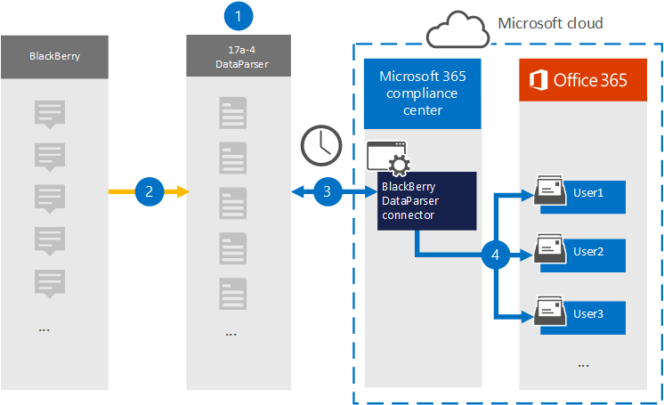

# Configurar um conector para arquivar dados blackberry (visualização)

Use o [BlackBerry DataParser](https://www.17a-4.com/BlackBerry-dataparser/) do 17a-4 LLC para importar e arquivar dados corporativos blackberry para caixas de correio de usuário em sua organização Microsoft 365. O DataParser inclui um conector BlackBerry configurado para capturar itens de uma fonte de dados de terceiros e importar esses itens para Microsoft 365. O conector BlackBerry DataParser converte dados BlackBerry em um formato de mensagem de email e importa esses itens para caixas de correio de usuário em Microsoft 365.

Depois que os dados blackberry são armazenados em caixas de correio de usuário, você pode aplicar Microsoft 365 de conformidade, como Retenção de Litígio, Descoberta Eletrônico, políticas de retenção e rótulos de retenção e conformidade de comunicação. Usar um conector BlackBerry para importar e arquivar dados em Microsoft 365 pode ajudar sua organização a manter-se em conformidade com políticas governamentais e regulatórias.

## Visão geral do arquivamento de dados blackberry

A visão geral a seguir explica o processo de uso de um conector de dados para arquivar dados blackberry em Microsoft 365.

1. Sua organização trabalha com o 17a-4 para configurar e configurar o BlackBerry DataParser.

2. Regularmente, os itens BlackBerry são coletados pelo DataParser. O DataParser também converte o conteúdo de uma mensagem em um formato de mensagem de email.

3. O conector BlackBerry DataParser criado no Centro de conformidade do Microsoft 365 conecta-se ao DataParser e transfere as mensagens para um local seguro do Azure Armazenamento na nuvem da Microsoft.

4. Uma subpasta na pasta Caixa de Entrada chamada **BlackBerry DataParser** é criada nas caixas de correio do usuário e os itens BlackBerry são importados para essa pasta. O conector determina para qual caixa de correio importar itens usando o valor da *propriedade Email.* Cada item BlackBerry contém essa propriedade, que é preenchida com o endereço de email de cada participante.

## Antes de configurar um conector

- Crie uma conta DataParser para conectores da Microsoft. Para fazer isso, entre em [contato com 17a-4 LLC](https://www.17a-4.com/contact/). Você precisa entrar nessa conta ao criar o conector na Etapa 1.

- O usuário que cria o conector BlackBerry DataParser na Etapa 1 (e o conclui na Etapa 3) deve ser atribuído à função De importação de importação de caixa de correio no Exchange Online. Essa função é necessária para adicionar conectores na página **Conectores de** dados no Centro de conformidade do Microsoft 365. Por padrão, essa função não é atribuída a um grupo de funções no Exchange Online. Você pode adicionar a função Exportar Importação de Importação de Caixa de Correio ao grupo de função Gerenciamento da Organização Exchange Online. Ou você pode criar um grupo de funções, atribuir a função Exportar Importação de Caixa de Correio e adicionar os usuários apropriados como membros. Para obter mais informações, consulte as seções Criar grupos de [função](/Exchange/permissions-exo/role-groups#create-role-groups) ou [Modificar](/Exchange/permissions-exo/role-groups#modify-role-groups) grupos de função no artigo "Gerenciar grupos de funções em Exchange Online".

## Etapa 1: Configurar um conector BlackBerry DataParser

A primeira etapa é acessar a página Conectores de dados no Centro de conformidade do Microsoft 365 e criar um conector 17a-4 para dados BlackBerry.

1. Vá para <https://compliance.microsoft.com> e clique em **Conectores de dados**  >  **BlackBerry DataParser**.

2. Na página Descrição do produto **BlackBerry DataParser,** clique **em Adicionar conector**.

3. Na página **Termos de serviço,** clique em **Aceitar**.

4. Insira um nome exclusivo que identifique o conector e clique em **Próximo**.

5. Entre na sua conta 17a-4 e conclua as etapas no assistente de conexão BlackBerry DataParser.

## Etapa 2: Configurar o conector BlackBerry DataParser

Trabalhe com o Suporte 17a-4 para configurar o conector BlackBerry DataParser.

## Etapa 3: Mapear usuários

O conector BlackBerry DataParser mapeará automaticamente os usuários para seus Microsoft 365 de email antes de importar dados para Microsoft 365.

## Etapa 4: Monitorar o conector BlackBerry DataParser

Depois de criar um conector BlackBerry DataParser, você pode exibir o status do conector no Centro de conformidade do Microsoft 365.

1. Vá para <https://compliance.microsoft.com> e clique **em Conectores de dados** na nav esquerda.

2. Clique na **guia Conectores** e selecione o conector BlackBerry DataParser que você criou para exibir a página de sobrevoo, que contém as propriedades e informações sobre o conector.

3. Em **Status do conector com origem**, clique no link Baixar **log** para abrir (ou salvar) o log de status do conector. Esse log contém dados que foram importados para a nuvem da Microsoft.

## Problemas conhecidos

Neste momento, não há suporte para importação de anexos ou itens maiores que 10 MB. O suporte para itens maiores estará disponível posteriormente.