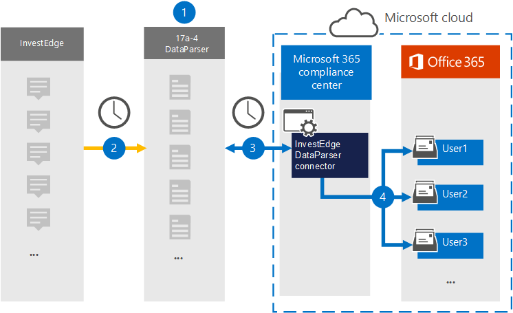

# Configurar um conector para arquivar dados do InvestEdge (visualização)Set up a connector to archive InvestEdge data (preview)

Use [o InvestEdge DataParser](https://www.17a-4.com/investedge-dataparser/) do 17a-4 LLC para importar e arquivar dados do InvestEdge para caixas de correio de usuário em sua organização Microsoft 365.Use the [InvestEdge DataParser](https://www.17a-4.com/investedge-dataparser/) from 17a-4 LLC to import and archive data from InvestEdge to user mailboxes in your Microsoft 365 organization. O DataParser inclui um conector InvestEdge configurado para capturar itens de uma fonte de dados de terceiros e importar esses itens para Microsoft 365.The DataParser includes a InvestEdge connector that's configured to capture items from a third-party data source and import those items to Microsoft 365. O conector InvestEdge DataParser converte dados do InvestEdge em um formato de mensagem de email e importa esses itens para caixas de correio de usuário em Microsoft 365.The InvestEdge DataParser connector converts InvestEdge data to an email message format and then imports those items to user mailboxes in Microsoft 365.

Depois que os dados do InvestEdge são armazenados em caixas de correio de usuário, você pode aplicar Microsoft 365 de conformidade, como Retenção de Litígio, Descoberta Eletrônico, políticas de retenção e rótulos de retenção e conformidade de comunicação.After InvestEdge data is stored in user mailboxes, you can apply Microsoft 365 compliance features such as Litigation Hold, eDiscovery, retention policies and retention labels, and communication compliance. Usar um conector InvestEdge para importar e arquivar dados em Microsoft 365 pode ajudar sua organização a manter-se em conformidade com políticas governamentais e regulatórias.Using a InvestEdge connector to import and archive data in Microsoft 365 can help your organization stay compliant with government and regulatory policies.

## Visão geral dos dados do InvestEdge de arquivamentoOverview of archiving InvestEdge data

A visão geral a seguir explica o processo de uso de um conector de dados para arquivar dados do InvestEdge em Microsoft 365.The following overview explains the process of using a data connector to archive InvestEdge data in Microsoft 365.

1. Sua organização trabalha com o 17a-4 para configurar e configurar o InvestEdge DataParser.Your organization works with 17a-4 to set up and configure the InvestEdge DataParser.

2. Regularmente, os itens InvestEdge são coletados pelo DataParser.On a regular basis, InvestEdge items are collected by the DataParser. O DataParser também converte o conteúdo de uma mensagem em um formato de mensagem de email.The DataParser also converts the content of a message to an email message format.

3. O conector InvestEdge DataParser criado no Centro de conformidade do Microsoft 365 conecta-se ao DataParser e transfere as mensagens para um local seguro do Azure Armazenamento na nuvem da Microsoft.The InvestEdge DataParser connector that you create in the Microsoft 365 compliance center connects to DataParser and transfers the messages to a secure Azure Storage location in the Microsoft cloud.

4. Uma subpasta na pasta Caixa de Entrada chamada **InvestEdge DataParser** é criada nas caixas de correio do usuário e os itens InvestEdge são importados para essa pasta.A subfolder in the Inbox folder named **InvestEdge DataParser** is created in the user mailboxes, and the InvestEdge items are imported to that folder. O conector determina para qual caixa de correio importar itens usando o valor da *propriedade Email.*The connector determines which mailbox to import items to by using the value of the *Email* property. Cada item InvestEdge contém essa propriedade, que é preenchida com o endereço de email de cada participante.Every InvestEdge item contains this property, which is populated with the email address of every participant.

## Antes de configurar um conectorBefore you set up a connector

- Crie uma conta DataParser para conectores da Microsoft.Create a DataParser account for Microsoft connectors. Para fazer isso, entre em [contato com 17a-4 LLC](https://www.17a-4.com/contact/).To do this, contact [17a-4 LLC](https://www.17a-4.com/contact/). Você precisa entrar nessa conta ao criar o conector na Etapa 1.You need to sign into this account when you create the connector in Step 1.

- O usuário que cria o conector InvestEdge DataParser na Etapa 1 (e o conclui na Etapa 3) deve ser atribuído à função de Exportação de Importação de Importação de Caixa de Correio no Exchange Online.The user who creates the InvestEdge DataParser connector in Step 1 (and completes it in Step 3) must be assigned to the Mailbox Import Export role in Exchange Online. Essa função é necessária para adicionar conectores na página **Conectores de** dados no Centro de conformidade do Microsoft 365.This role is required to add connectors on the **Data connectors** page in the Microsoft 365 compliance center. Por padrão, essa função não é atribuída a um grupo de funções no Exchange Online.By default, this role is not assigned to a role group in Exchange Online. Você pode adicionar a função Exportar Importação de Importação de Caixa de Correio ao grupo de função Gerenciamento da Organização Exchange Online.You can add the Mailbox Import Export role to the Organization Management role group in Exchange Online. Ou você pode criar um grupo de funções, atribuir a função Exportar Importação de Caixa de Correio e adicionar os usuários apropriados como membros.Or you can create a role group, assign the Mailbox Import Export role, and then add the appropriate users as members. Para obter mais informações, consulte as seções Criar grupos de [função](/Exchange/permissions-exo/role-groups#create-role-groups) ou [Modificar](/Exchange/permissions-exo/role-groups#modify-role-groups) grupos de função no artigo "Gerenciar grupos de funções em Exchange Online".For more information, see the [Create role groups](/Exchange/permissions-exo/role-groups#create-role-groups) or [Modify role groups](/Exchange/permissions-exo/role-groups#modify-role-groups) sections in the article "Manage role groups in Exchange Online".

## Etapa 1: Configurar um conector InvestEdge DataParserStep 1: Set up a InvestEdge DataParser connector

A primeira etapa é acessar a página Conectores de dados no Centro de conformidade do Microsoft 365 e criar um conector 17a-4 para dados InvestEdge.The first step is to access to the Data connectors page in the Microsoft 365 compliance center and create a 17a-4 connector for InvestEdge data.

1. Vá para <https://compliance.microsoft.com> e clique em **Conectores de dados**  >  **InvestEdge DataParser**.Go to <https://compliance.microsoft.com> and then click **Data connectors** > **InvestEdge DataParser**.

2. Na página **Descrição do produto Do InvestEdge DataParser,** clique **em Adicionar conector**.On the **InvestEdge DataParser** product description page, click **Add connector**.

3. Na página **Termos de serviço,** clique em **Aceitar**.On the **Terms of service** page, click **Accept**.

4. Insira um nome exclusivo que identifique o conector e clique em **Próximo**.Enter a unique name that identifies the connector and then click **Next**.

5. Entre na sua conta 17a-4 e conclua as etapas no assistente de conexão InvestEdge DataParser.Sign in to your 17a-4 account and complete the steps in the InvestEdge DataParser connection wizard.

## Etapa 2: Configurar o conector InvestEdge DataParserStep 2: Configure the InvestEdge DataParser connector

Trabalhe com o Suporte 17a-4 para configurar o conector InvestEdge DataParser.Work with 17a-4 Support to configure the InvestEdge DataParser connector.

## Etapa 3: Mapear usuáriosStep 3: Map users

O conector InvestEdge DataParser mapeará automaticamente os usuários para seus Microsoft 365 de email antes de importar dados para Microsoft 365.The InvestEdge DataParser connector will automatically map users to their Microsoft 365 email addresses before importing data to Microsoft 365.

## Etapa 4: Monitorar o conector InvestEdge DataParserStep 4: Monitor the InvestEdge DataParser connector

Depois de criar um conector InvestEdge DataParser, você poderá exibir o status do conector no Centro de conformidade do Microsoft 365.After you create a InvestEdge DataParser connector, you can view the connector status in the Microsoft 365 compliance center.

1. Vá para <https://compliance.microsoft.com> e clique **em Conectores de dados** na nav esquerda.Go to <https://compliance.microsoft.com> and click **Data connectors** in the left nav.

2. Clique na guia **Conectores** e selecione o conector InvestEdge DataParser que você criou para exibir a página de sobrevoo, que contém as propriedades e informações sobre o conector.Click the **Connectors** tab and then select the InvestEdge DataParser connector that you created to display the flyout page, which contains the properties and information about the connector.

3. Em **Status do conector com origem**, clique no link Baixar **log** para abrir (ou salvar) o log de status do conector.Under **Connector status with source**, click the **Download log** link to open (or save) the status log for the connector. Esse log contém dados que foram importados para a nuvem da Microsoft.This log contains data that has been imported to the Microsoft cloud.

## Problemas conhecidosKnown issues

Neste momento, não há suporte para importação de anexos ou itens maiores que 10 MB.At this time, we don't support importing attachments or items that are larger than 10 MB. O suporte para itens maiores estará disponível posteriormente.Support for larger items will be available at a later date.
