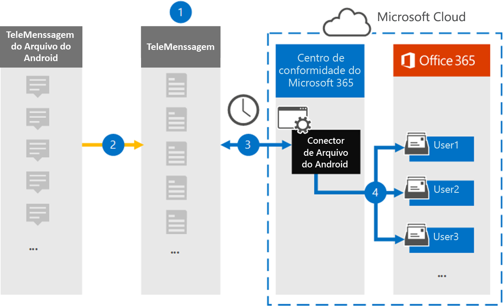

# Configurar um conector para arquivar dados móveis do AndroidSet up a connector to archive Android mobile data

Use um conector de Telemensagem no centro de conformidade da Microsoft 365 para importar e arquivar o SMS, MMS, chamadas de voz e logs de chamadas de telefones móveis Android.Use a TeleMessage connector in the Microsoft 365 compliance center to import and archive SMS, MMS, voice calls, and call logs from Android mobile phones. Depois de configurar e configurar um conector, ele se conecta à conta de Telemensagem de sua organização uma vez por dia e importa a comunicação móvel de funcionários usando o Archiver de Android para caixas de correio no Microsoft 365.After you set up and configure a connector, it connects to your organization's TeleMessage account once every day, and imports the mobile communication of employees using the TeleMessage Android Archiver to mailboxes in Microsoft 365.

Depois que os dados de telefones móveis Android são armazenados nas caixas de correio do usuário, você pode aplicar recursos de conformidade do Microsoft 365, como retenção de litígio, pesquisa de conteúdo e políticas de retenção da Microsoft 365 a dados do arquivo morto do Android.After data from Android mobile phones is stored in user mailboxes, you can apply Microsoft 365 compliance features such as Litigation Hold, Content Search, and Microsoft 365 retention policies to Android Archiver data. Por exemplo, você pode pesquisar a comunicação móvel do arquivo Android usando a pesquisa de conteúdo ou associar a caixa de correio que contém os dados do conector do Archiver para Android com um funcionário em uma caixa de descoberta eletrônica avançada.For example, you can search Android Archiver mobile communication using Content Search or associate the mailbox that contains the Android Archiver connector data with a custodian in an Advanced eDiscovery case. Usar um conector do Archiver para Android para importar e arquivar dados no Microsoft 365 pode ajudar sua organização a se manter em conformidade com as políticas governamentais e regulamentares.Using an Android Archiver connector to import and archive data in Microsoft 365 can help your organization stay compliant with government and regulatory policies.

## Visão geral do arquivamento de dados móveis do AndroidOverview of archiving Android mobile data

A visão geral a seguir explica o processo de usar um conector para arquivar dados móveis do Android no Microsoft 365.The following overview explains the process of using a connector to archive Android mobile data in Microsoft 365.

1. Sua organização trabalha com a telemessage para configurar um conector do Archiver para Android.Your organization works with TeleMessage to set up an Android Archiver connector. Para obter mais informações, consulte [Android Archiver](https://www.telemessage.com/office365-activation-for-android-archiver/).For more information, see [Android Archiver](https://www.telemessage.com/office365-activation-for-android-archiver/).

2. Uma vez a cada 24 horas, SMS, MMS, chamadas de voz e logs de chamadas dos telefones móveis Android da sua organização são copiados para o site de Telemensagem.Once every 24 hours, SMS, MMS, voice calls, and call logs from your organization's Android mobile phones are copied to the TeleMessage site.

3. O conector do Archiver para Android que você cria no centro de conformidade da Microsoft 365 se conecta ao site de Telemensagem todos os dias e transfere os dados do Android das 24 horas anteriores para um local seguro de armazenamento do Azure na nuvem da Microsoft.The Android Archiver connector that you create in the Microsoft 365 compliance center connects to the TeleMessage site every day and transfers the Android data from the previous 24 hours to a secure Azure Storage location in the Microsoft Cloud. O conector também converte os dados do Android em um formato de mensagem de email.The connector also converts the Android data to an email message format.

4. O conector importa os itens de comunicação móvel para a caixa de correio de um usuário específico.The connector imports the mobile communication items to the mailbox of a specific user. Uma nova pasta chamada Android Archiver é criada na caixa de correio do usuário específico e os itens são importados para ela.A new folder named Android Archiver is created in the specific user's mailbox and the items are imported to it. O conector faz o mapeamento usando o valor da propriedade de *endereço de email do usuário* .The connector does mapping by using the value of the *User’s Email address* property. Cada mensagem de email contém essa propriedade, que é preenchida com o endereço de email de cada participante da mensagem de email.Every email message contains this property, which is populated with the email address of every participant of the email message. Além do mapeamento automático de usuários usando o valor da propriedade de *endereço de email do usuário* , você também pode definir um mapeamento personalizado carregando um arquivo de mapeamento CSV.In addition to automatic user mapping using the value of the *User’s Email address* property, you can also define a custom mapping by uploading a CSV mapping file. Esse arquivo de mapeamento deve conter o número de celular do usuário e o endereço de caixa de correio do Microsoft 365 correspondente para cada usuário.This mapping file should contain User’s mobile Number and the corresponding Microsoft 365 mailbox address for each user. Se você habilitar o mapeamento automático de usuários e fornecer um mapeamento personalizado, para cada item de email, o conector examinará primeiro o arquivo de mapeamento personalizado.If you enable automatic user mapping and provide a custom mapping, for every email item the connector will first look at custom mapping file. Se não encontrar um usuário válido do Microsoft 365 que corresponda ao número de celular de um usuário, o conector usará a propriedade de endereço de email do usuário do item de email.If it doesn't find a valid Microsoft 365 user that corresponds to a user's mobile number, the connector will use the User ‘s email address property of the email item. Se o conector não localizar um usuário válido do Microsoft 365 no arquivo de mapeamento personalizado ou na propriedade de *endereço de email do usuário* do item de email, o item não será importado.If the connector doesn't find a valid Microsoft 365 user in either the custom mapping file or the *user’s email address* property of the email item, the item won't be imported.

## Antes de começarBefore you begin

Algumas das etapas de implementação necessárias para arquivar dados de comunicação do Android são externas para o Microsoft 365 e devem ser concluídas para que você possa criar o conector no centro de conformidade.Some of the implementation steps required to archive Android communication data are external to Microsoft 365 and must be completed before you can create the connector in the compliance center.

- Solicite o [serviço arquivador Android de Telemensagem](https://www.telemessage.com/mobile-archiver/order-mobile-archiver-for-o365) e obtenha uma conta de administração válida para sua organização.Order the [Android Archiver service from TeleMessage](https://www.telemessage.com/mobile-archiver/order-mobile-archiver-for-o365) and get a valid administration account for your organization. Você precisará entrar nessa conta ao criar o conector.You'll need to sign into this account when you create the connector.

- Registre todos os usuários que exigem o serviço arquivador Android na conta de Telemensagem.Register all users that require the Android Archiver service in the TeleMessage account. Ao registrar usuários, certifique-se de usar o mesmo endereço de email usado para a conta do Microsoft 365.When registering users, be sure to use the same email address that's used for their Microsoft 365 account.

- Instale e ative o aplicativo Archiver de mensagens do Android nos telefones celulares de seus funcionários.Install and activate the TeleMessage Android Archiver app on the mobile phones of your employees.

- Sua organização deve dar o consentimento para permitir que o serviço de importação do Office 365 acesse dados de caixa de correio em sua organização.Your organization must consent to allow the Office 365 Import service to access mailbox data in your organization. Você precisará fornecer esse consentimento ao criar o conector.You will need to provide this consent when you create the connector. Para concordar com essa solicitação, [acesse a página](https://login.microsoftonline.com/common/oauth2/authorize?client_id=570d0bec-d001-4c4e-985e-3ab17fdc3073&response_type=code&redirect_uri=https://portal.azure.com/&nonce=1234&prompt=admin_consent), entre com as credenciais do Microsoft 365 global admin e aceite a solicitação.To consent to this request, go to [this page](https://login.microsoftonline.com/common/oauth2/authorize?client_id=570d0bec-d001-4c4e-985e-3ab17fdc3073&response_type=code&redirect_uri=https://portal.azure.com/&nonce=1234&prompt=admin_consent), sign in with the credentials of Microsoft 365 global admin, and then accept the request. É necessário concluir esta etapa para que você possa criar com êxito um conector de rede no&T.You have to complete this step before you can successfully create an AT&T Network connector.

- O usuário que cria um conector do Archiver para Android deve ser atribuído à função de exportação de importação de caixa de correio no Exchange Online.The user who creates a Android Archiver connector must be assigned the Mailbox Import Export role in Exchange Online. Isso é necessário para adicionar conectores na página **conectores de dados** no centro de conformidade do Microsoft 365.This is required to add connectors in the **Data connectors** page in the Microsoft 365 compliance center. Por padrão, essa função não é atribuída a nenhum grupo de funções no Exchange Online.By default, this role isn't assigned to any role group in Exchange Online. Você pode adicionar a função de exportação de importação de caixa de correio ao grupo de funções Gerenciamento da organização no Exchange Online.You can add the Mailbox Import Export role to the Organization Management role group in Exchange Online. Ou você pode criar um grupo de função, atribua a função de exportação de importação de caixa de correio e, em seguida, adicione os usuários apropriados como membros.Or you can create a role group, assign the Mailbox Import Export role, and then add the appropriate users as members. Para obter mais informações, consulte as seções [criar grupos de função](https://docs.microsoft.com/Exchange/permissions-exo/role-groups#create-role-groups) ou [modificar grupos de função](https://docs.microsoft.com/Exchange/permissions-exo/role-groups#modify-role-groups) no artigo "gerenciar grupos de função no Exchange Online".For more information, see the [Create role groups](https://docs.microsoft.com/Exchange/permissions-exo/role-groups#create-role-groups) or [Modify role groups](https://docs.microsoft.com/Exchange/permissions-exo/role-groups#modify-role-groups) sections in the article "Manage role groups in Exchange Online".

## Criar um conector de arquivador AndroidCreate an Android Archiver connector

A última etapa é criar um conector do Archiver para Android no centro de conformidade do Microsoft 365.The last step is to create an Android Archiver connector in the Microsoft 365 compliance center. O conector usa as informações que você fornece para se conectar ao site de Telemensagem e transferir a comunicação Android para as caixas de correio de usuário correspondentes no Microsoft 365.The connector uses the information you provide to connect to the TeleMessage site and transfer Android communication to the corresponding user mailbox boxes in Microsoft 365.

1. Vá para [https://compliance.microsoft.com](https://compliance.microsoft.com) e clique em **conectores de dados**  >  **Archiver do Android**.Go to [https://compliance.microsoft.com](https://compliance.microsoft.com) and click **Data connectors** > **Android Archiver**.

2. Na página descrição do produto do **arquivo morto do Android** , clique em **Adicionar conector**.On the **Android Archiver** product description page, click **Add connector**.

3. Na página **termos de serviço** , clique em **aceitar**.On the **Terms of service** page, click **Accept**.

4. Na página **logon na Telemensagem** , em etapa 3, insira as informações necessárias nas caixas a seguir e clique em **Avançar**.On the **Login to TeleMessage** page, under Step 3, enter the required information in the following boxes and then click **Next**.

   - **Nome de usuário:** O nome de usuário de sua mensagem.**Username:** Your TeleMessage username.

   - **Senha:** Sua senha de Telemensagem.**Password:** Your TeleMessage password.

5. Depois que o conector é criado, feche a janela pop-up e clique em **Avançar**.After the connector is created, close the pop-up window and click **Next**.

6. Na página **mapeamento de usuário** , habilite mapeamento automático de usuário e clique em **Avançar**.On the **User mapping** page, enable automatic user mapping and click **Next**. Caso você precise de mapeamento personalizado, carregue um arquivo CSV e clique em **Avançar**.In case you need custom mapping upload a CSV file, and click **Next**.

7. Forneça o consentimento do administrador e clique em **Avançar**.Provide admin consent and then click **Next**.

   Para fornecer o consentimento do administrador, você deve estar conectado com as credenciais de um administrador global do Office 365 e aceitar a solicitação de consentimento.To provide admin consent, you must be signed in with the credentials of an Office 365 global admin, and then accept the consent request. Se você não estiver conectado como um administrador global, poderá ir para [esta página](https://login.microsoftonline.com/common/oauth2/authorize?client_id=570d0bec-d001-4c4e-985e-3ab17fdc3073&response_type=code&redirect_uri=https://portal.azure.com/&nonce=1234&prompt=admin_consent) e entrar usando as credenciais de administrador global para aceitar a solicitação.If you aren't signed in as a global admin, you can go to [this page](https://login.microsoftonline.com/common/oauth2/authorize?client_id=570d0bec-d001-4c4e-985e-3ab17fdc3073&response_type=code&redirect_uri=https://portal.azure.com/&nonce=1234&prompt=admin_consent) and sign in using global admin credentials to accept the request.

8. Revise suas configurações e clique em **concluir** para criar o conector.Review your settings, and then click **Finish** to create the connector.

9. Vá até a guia conectores na página **conectores de dados** para ver o andamento do processo de importação para o novo conector.Go to the Connectors tab in **Data connectors** page to see the progress of the import process for the new connector.

## Problemas conhecidosKnown issues

- No momento, não há suporte para importar anexos ou itens com mais de 10 MB.At this time, we don't support importing attachments or items that are larger than 10 MB. O suporte para itens maiores estará disponível em uma data posterior.Support for larger items will be available at a later date.
