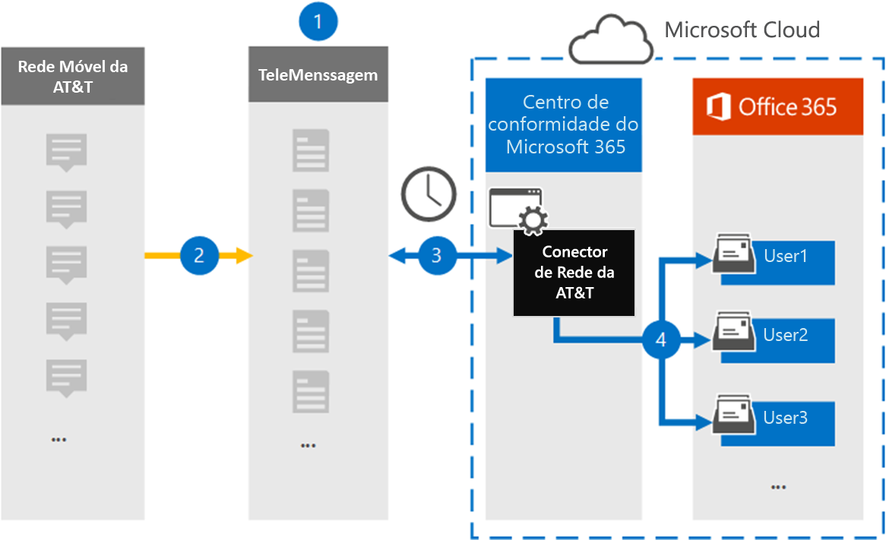

# Configurar um conector para arquivar em&T SMS/MMS data

Use um conector de Telemensagem no centro de conformidade da Microsoft 365 para importar e arquivar dados SMS e MMS de em&rede móvel. Após a configuração e a configuração de um conector, ele se conecta à rede de sua organização em&T a cada dia e importa dados SMS e MMS para caixas de correio no Microsoft 365.

Depois que as mensagens SMS e MMS são armazenadas nas caixas de correio do usuário, você pode aplicar recursos de conformidade do Microsoft 365, como retenção de litígio, pesquisa de conteúdo e políticas de retenção da Microsoft 365 a dados da rede em&. Por exemplo, você pode pesquisar em&a dados de rede usando a pesquisa de conteúdo ou associar a caixa de correio que contém os dados do conector de rede&T a um funcionário em uma caixa de descoberta eletrônica avançada. O uso de uma às&de um conector de rede para importar e arquivar dados no Microsoft 365 pode ajudar sua organização a se manter em conformidade com as políticas governamentais e regulamentares.

## Visão geral do arquivamento em dados da rede&T

A visão geral a seguir explica o processo de usar um conector para arquivar em dados de rede&T no Microsoft 365.

1. Sua organização trabalha com a telemessage para configurar um no conector de rede&T. Para obter informações, consulte [AT&T Network archiverr](https://www.telemessage.com/office365-activation-for-atnt-network-archiver/).

2. Uma vez a cada 24 horas, as mensagens SMS e MMS de sua organização na rede&T são copiadas para o site de Telemensagem.

3. O conector de rede em&T que você cria no centro de conformidade da Microsoft 365 se conecta ao site de Telemensagem todos os dias e transfere as mensagens SMS e MMS das últimas 24 horas para um local seguro de armazenamento do Azure na nuvem da Microsoft. O conector também converte o conteúdo de mensagens SMS e MMS em um formato de mensagem de email.

4. O conector importa os itens de comunicação móvel para a caixa de correio de usuários específicos. Uma nova pasta chamada **em&T SMS/MMS Network Archiver** é criada na caixa de correio do usuário e os itens são importados para ele. O conector faz esse mapeamento usando o valor da propriedade de *endereço de email do usuário* . Cada mensagem SMS e MMS contém essa propriedade, que é preenchida com o endereço de email de cada participante da mensagem.
 
   Além do mapeamento automático de usuários usando o valor da propriedade de *endereço de email do usuário* , você também pode definir um mapeamento personalizado carregando um arquivo de mapeamento CSV. Este arquivo de mapeamento contém o número de telefone celular e o endereço de email correspondente do Microsoft 365 para usuários em sua organização. Se você habilitar o mapeamento de usuário automático e o mapeamento personalizado, para cada item de email, o conector examinará primeiro o arquivo de mapeamento personalizado. Se não encontrar um usuário válido do Microsoft 365 que corresponda a um número de telefone celular, o conector usa os valores na propriedade de endereço de email do item que está tentando importar. Se o conector não localizar um usuário válido do Microsoft 365 no arquivo de mapeamento personalizado ou na propriedade de endereço de email do item de email, o item não será importado.

## Antes de começar

Algumas das etapas de implementação necessárias para arquivar em&T Network Data são externas para o Microsoft 365 e devem ser concluídas para que você possa criar o conector no centro de conformidade.

- Solicite o [serviço de arquivador móvel de Telemensagem](https://www.telemessage.com/mobile-archiver/order-mobile-archiver-for-o365/) e obtenha uma conta de administração válida para sua organização. Você precisará entrar nessa conta quando criar o conector no centro de conformidade.

- Obtenha os detalhes de contato da conta&T e de cobrança para que você possa preencher os formulários de integração de Telemensagem e solicitar o serviço de arquivamento de mensagens em&T.

- Registre todos os usuários que exigem no&T SMS/MMS Network Archiving na conta de Telemensagem. Ao registrar usuários, certifique-se de usar o mesmo endereço de email usado para a conta do Microsoft 365.

- Seus funcionários devem ter telefones celulares de propriedade corporativa e responsáveis corporativos na rede móvel do&T. O arquivamento de mensagens no Microsoft 365 não está disponível para funcionários de propriedade ou "Traga seus próprios dispositivos (BYOD).

- Sua organização deve dar o consentimento para permitir que o serviço de importação do Office 365 acesse dados de caixa de correio em sua organização. Você precisará fornecer esse consentimento ao criar o conector. Para concordar com essa solicitação, [acesse a página](https://login.microsoftonline.com/common/oauth2/authorize?client_id=570d0bec-d001-4c4e-985e-3ab17fdc3073&response_type=code&redirect_uri=https://portal.azure.com/&nonce=1234&prompt=admin_consent), entre com as credenciais do Microsoft 365 global admin e aceite a solicitação. É necessário concluir esta etapa para que você possa criar com êxito um conector de rede no&T.

- O usuário que cria um conector de rede no&T deve ser atribuído à função de exportação de importação de caixa de correio no Exchange Online. Isso é necessário para adicionar conectores na página **conectores de dados** no centro de conformidade do Microsoft 365. Por padrão, essa função não é atribuída a nenhum grupo de funções no Exchange Online. Você pode adicionar a função de exportação de importação de caixa de correio ao grupo de funções Gerenciamento da organização no Exchange Online. Ou você pode criar um grupo de função, atribua a função de exportação de importação de caixa de correio e, em seguida, adicione os usuários apropriados como membros. Para obter mais informações, consulte as seções [criar grupos de função](https://docs.microsoft.com/Exchange/permissions-exo/role-groups#create-role-groups) ou [modificar grupos de função](https://docs.microsoft.com/Exchange/permissions-exo/role-groups#modify-role-groups) no artigo "gerenciar grupos de função no Exchange Online".

## Criar um no conector de rede&T

Depois de concluir os pré-requisitos descritos na seção anterior, você pode criar uma em&T Network Connector no centro de conformidade da Microsoft 365. O conector usa as informações que você fornece para se conectar ao site de Telemensagem e transferir mensagens SMS e MMS para as caixas de correio de usuário correspondentes no Microsoft 365.

1. Vá para [https://compliance.microsoft.com](https://compliance.microsoft.com/) e clique em **conectores de dados**  \  **na rede&T**.

2. Na página de descrição do **produto da rede&T** , clique em **Adicionar conector**

3. Na página **termos de serviço** , clique em **aceitar**.

4. Na página **logon na Telemensagem** , em etapa 3, insira as informações necessárias nas caixas a seguir e clique em **Avançar**.

   - **Nome de usuário:** O nome de usuário de sua mensagem.

   - **Senha:** Sua senha de Telemensagem.

5. Depois que o conector é criado, você pode fechar a janela pop-up e ir para a próxima página.

6. Na página **mapeamento de usuário** , habilite o mapeamento de usuário automático. Para habilitar o mapeamento personalizado, carregue um arquivo CSV que contenha as informações de mapeamento do usuário e clique em **Avançar**.

7. Forneça o consentimento do administrador e clique em **Avançar**.

   Para fornecer o consentimento do administrador, você deve estar conectado com as credenciais de um administrador global do Office 365 e aceitar a solicitação de consentimento. Se você não estiver conectado como um administrador global, poderá ir para [esta página](https://login.microsoftonline.com/common/oauth2/authorize?client_id=570d0bec-d001-4c4e-985e-3ab17fdc3073&response_type=code&redirect_uri=https://portal.azure.com/&nonce=1234&prompt=admin_consent) e entrar usando as credenciais de administrador global para aceitar a solicitação. 

8. Revise suas configurações e clique em **concluir** para criar o conector.

9. Vá até a guia **conectores** na página **conectores de dados** no centro de conformidade para ver o andamento do processo de importação para o novo conector.

## Problemas conhecidos

- No momento, não há suporte para importar anexos ou itens com mais de 10 MB. O suporte para itens maiores estará disponível em uma data posterior.
