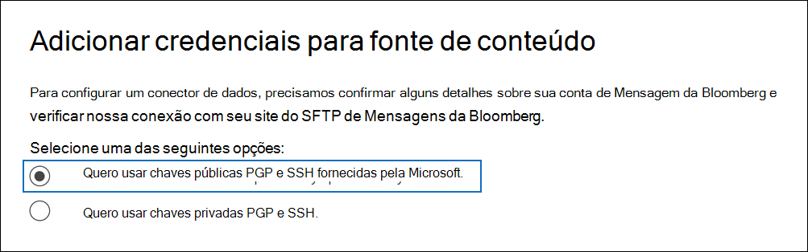
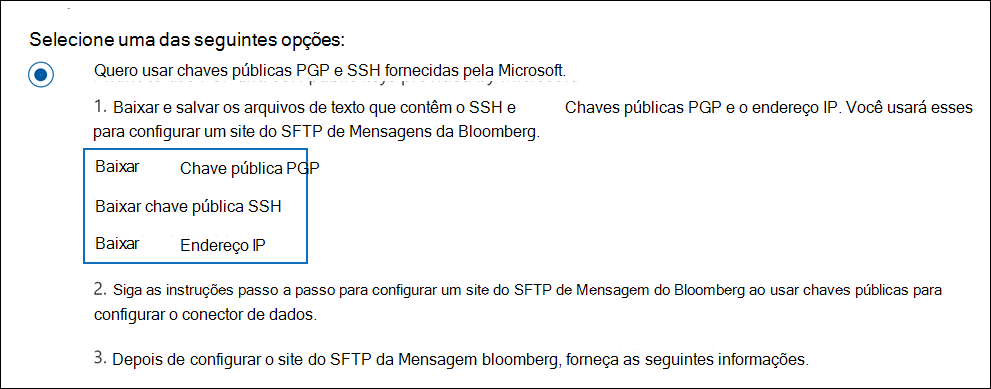
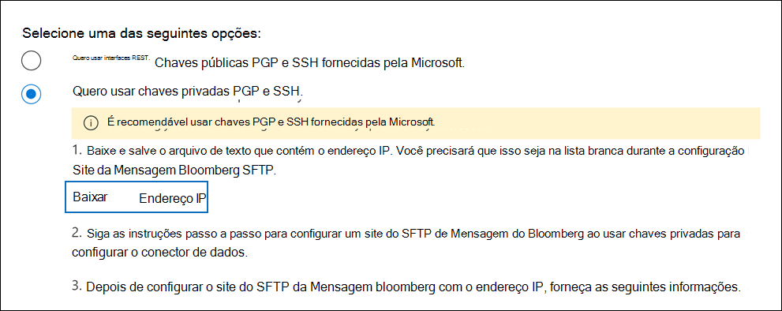
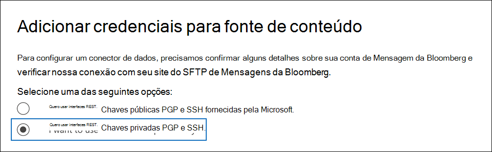

# Configurar um conector para arquivar dados da Mensagem bloombergSet up a connector to archive Bloomberg Message data

Use um conector de dados no centro de conformidade Microsoft 365 para importar e arquivar dados de email de serviços financeiros da ferramenta de colaboração [da Mensagem bloomberg.](https://www.bloomberg.com/professional/product/collaboration/)Use a data connector in the Microsoft 365 compliance center to import and archive financial services email data from the [Bloomberg Message](https://www.bloomberg.com/professional/product/collaboration/) collaboration tool. Depois de configurar e configurar um conector, ele se conecta ao site FTP seguro (SFTP) da sua organização uma vez por dia e importa itens de email para caixas de correio em Microsoft 365.After you set up and configure a connector, it connects to your organization's Bloomberg secure FTP (SFTP) site once every day, and imports email items to mailboxes in Microsoft 365.

Depois que os dados da Mensagem da Bloomberg são armazenados em caixas de correio de usuário, você pode aplicar recursos de conformidade Microsoft 365 como retenção de litígio, pesquisa de conteúdo, arquivamento in-locar, auditoria, conformidade de comunicação e políticas de retenção Microsoft 365 para dados da Mensagem bloomberg.After Bloomberg Message data is stored in user mailboxes, you can apply Microsoft 365 compliance features such as Litigation hold, content search, In-place archiving, auditing, Communication compliance, and Microsoft 365 retention policies to Bloomberg Message data. Por exemplo, você pode pesquisar emails da Mensagem da Bloomberg usando a ferramenta de pesquisa de conteúdo ou associar a caixa de correio que contém os dados da Mensagem bloomberg com um custodiante em um caso Advanced eDiscovery de conteúdo.For example, you can search Bloomberg Message emails using the content search tool or associate the mailbox that contains the Bloomberg Message data with a custodian in an Advanced eDiscovery case. Usar um conector de Mensagem da Bloomberg para importar e arquivar dados em Microsoft 365 pode ajudar sua organização a manter-se em conformidade com políticas governamentais e regulatórias.Using a Bloomberg Message connector to import and archive data in Microsoft 365 can help your organization stay compliant with government and regulatory policies.

## Visão geral dos dados de mensagem do Bloomberg de arquivamentoOverview of archiving Bloomberg Message data

A visão geral a seguir explica o processo de uso de um conector para arquivar dados da Mensagem do Bloomberg Microsoft 365.The following overview explains the process of using a connector to archive Bloomberg Message data in Microsoft 365.

1. Sua organização trabalha com a Bloomberg para configurar um site do SFTP da Bloomberg.Your organization works with Bloomberg to set up a Bloomberg SFTP site. Você também trabalhará com a Bloomberg para configurar a Mensagem bloomberg para copiar mensagens de email para o site do SFTP da Bloomberg.You'll also work with Bloomberg to configure Bloomberg Message to copy email messages to the Bloomberg SFTP site.

2. Uma vez a cada 24 horas, as mensagens de email da Mensagem Bloomberg são copiadas para o site do SFTP da Bloomberg.Once every 24 hours, email messages from Bloomberg Message are copied to the Bloomberg SFTP site.

3. O conector de Mensagem da Bloomberg que você cria no centro de conformidade do Microsoft 365 conecta-se ao site do SFTP da Bloomberg todos os dias e transfere as mensagens de email das 24 horas anteriores para uma área segura do Azure Armazenamento no Microsoft Cloud.The Bloomberg Message connector that you create in the Microsoft 365 compliance center connects to the Bloomberg SFTP site every day and transfers the email messages from the previous 24 hours to a secure Azure Storage area in the Microsoft Cloud.

4. O conector importa os itens de mensagem de email para a caixa de correio de um usuário específico.The connector imports the email message items to the mailbox of a specific user. Uma nova pasta chamada BloombergMessage é criada na caixa de correio do usuário específico e os itens serão importados para ela.A new folder named BloombergMessage is created in the specific user's mailbox and the items will be imported to it.

   O conector faz isso usando o valor da propriedade CorporateEmailAddress.The connector does this by using the value of the CorporateEmailAddress property. Cada mensagem de email contém essa propriedade, que é preenchida com o endereço de email de cada participante da mensagem de email.Every email message contains this property, which is populated with the email address of every participant of the email message. Além do mapeamento automático do usuário usando o valor da propriedade *CorporateEmailAddress,* você também pode definir um mapeamento personalizado carregando um arquivo de mapeamento CSV.In addition to automatic user mapping using the value of the *CorporateEmailAddress* property, you can also define a custom mapping by uploading a CSV mapping file. Este arquivo de mapeamento contém uma UUID da Bloomberg e o endereço de caixa de correio Microsoft 365 endereço de caixa de correio correspondente para cada usuário em sua organização.This mapping file contains a Bloomberg UUID and the corresponding Microsoft 365 mailbox address for each user in your organization. Se você habilitar o mapeamento automático do usuário e fornecer um mapeamento personalizado, para cada item de email, o conector olhará primeiro para o arquivo de mapeamento personalizado.If you enable automatic user mapping and provide a custom mapping, for every email item the connector will first look at the custom-mapping file. Se ele não encontrar um usuário Microsoft 365 que corresponda à UUID bloomberg de um usuário, o conector usará a propriedade *CorporateEmailAddress* do item de email.If it doesn't find a valid Microsoft 365 user that corresponds to a user's Bloomberg UUID, the connector uses the *CorporateEmailAddress* property of the email item. Se o conector não encontrar um usuário Microsoft 365 no arquivo de mapeamento personalizado ou na propriedade *CorporateEmailAddress* do item de email, o item não será importado.If the connector doesn't find a valid Microsoft 365 user in either the custom-mapping file or the *CorporateEmailAddress* property of the email item, the item won't be imported.

## Antes de configurar um conectorBefore you set up a connector

Algumas das etapas de implementação necessárias para arquivar dados da Mensagem do Bloomberg são externas Microsoft 365 e devem ser concluídas antes que você possa criar o conector no centro de conformidade.Some of the implementation steps required to archive Bloomberg Message data are external to Microsoft 365 and must be completed before you can create the connector in the compliance center.

- Para configurar um conector de Mensagem da Bloomberg, você precisa usar chaves e senhas de teclas para PGP (Privacidade Muito Boa) e Shell Seguro (SSH).To set up a Bloomberg Message connector, you have to use keys and key passphrases for Pretty Good Privacy (PGP) and Secure Shell (SSH). Essas chaves são usadas para configurar o site do SFTP da Bloomberg e usadas pelo conector para se conectar ao site do SFTP da Bloomberg para importar dados para Microsoft 365.These keys are used to configure the Bloomberg SFTP site and used by the connector to connect to the Bloomberg SFTP site to import data to Microsoft 365. A chave PGP é usada para configurar a criptografia de dados transferidos do site do SFTP da Bloomberg para Microsoft 365.The PGP key is used to configure the encryption of data that's transferred from the Bloomberg SFTP site to Microsoft 365. A chave SSH é usada para configurar o shell seguro para habilitar um logon remoto seguro quando o conector se conecta ao site do SFTP da Bloomberg.The SSH key is used to configure secure shell to enable a secure remote login when the connector connects to the Bloomberg SFTP site.

  Ao configurar um conector, você tem a opção de usar chaves públicas e senhas de chave fornecidas pela Microsoft ou pode usar suas próprias chaves privadas e senhas.When setting up a connector, you have the option to use public keys and key passphrases provided by Microsoft or you can use your own private keys and passphrases. Recomendamos que você use as chaves públicas fornecidas pela Microsoft.We recommend that you use the public keys provided by Microsoft. No entanto, se sua organização já configurou um site do SFTP da Bloomberg usando chaves privadas, então você pode criar um conector usando essas mesmas chaves privadas.However, if your organization has already configured a Bloomberg SFTP site using private keys, then you can create a connector using these same private keys.

- Inscreva-se [em Bloomberg Em Qualquer Lugar](https://www.bloomberg.com/professional/product/remote-access/?bbgsum-page=DG-WS-PROF-PROD-BBA).Subscribe to [Bloomberg Anywhere](https://www.bloomberg.com/professional/product/remote-access/?bbgsum-page=DG-WS-PROF-PROD-BBA). Isso é necessário para que você possa fazer logoff na Bloomberg Em Qualquer Lugar para acessar o site do SFTP da Bloomberg que você precisa configurar e configurar.This is required so that you can log in to Bloomberg Anywhere to access the Bloomberg SFTP site that you have to set up and configure.

- Configurar um site do SFTP da Bloomberg (protocolo de transferência de arquivos seguro).Set up a Bloomberg SFTP (Secure file transfer protocol) site. Depois de trabalhar com a Bloomberg para configurar o site do SFTP, os dados da Mensagem da Bloomberg são carregados no site SFTP todos os dias.After working with Bloomberg to set up the SFTP site, data from Bloomberg Message is uploaded to the SFTP site every day. O conector criado na Etapa 2 conecta-se a esse site SFTP e transfere os dados de email para Microsoft 365 caixas de correio.The connector you create in Step 2 connects to this SFTP site and transfers the email data to Microsoft 365 mailboxes. O SFTP também criptografa os dados da Mensagem Bloomberg que são enviados para caixas de correio durante o processo de transferência.SFTP also encrypts the Bloomberg Message data that is sent to mailboxes during the transfer process.

  Para obter informações sobre o SFTP da Bloomberg (também chamado *de BB-SFTP*):For information about Bloomberg SFTP (also called *BB-SFTP*):

  - Consulte o documento "Padrões de Conectividade SFTP" em [Suporte à Bloomberg](https://www.bloomberg.com/professional/support/documentation/).See the "SFTP Connectivity Standards" document at [Bloomberg Support](https://www.bloomberg.com/professional/support/documentation/).

  - Entre [em contato com o suporte ao cliente da Bloomberg.](https://service.bloomberg.com/portal/sessions/new?utm_source=bloomberg-menu&utm_medium=csc)Contact [Bloomberg customer support](https://service.bloomberg.com/portal/sessions/new?utm_source=bloomberg-menu&utm_medium=csc).

- Depois de trabalhar com a Bloomberg para configurar um site SFTP, a Bloomberg fornecerá algumas informações a você depois de responder à mensagem de email de implementação do Bloomberg.After you work with Bloomberg to set up an SFTP site, Bloomberg will provide some information to you after you respond to the Bloomberg implementation email message. Salve uma cópia das informações a seguir.Save a copy of the following information. Use-o para configurar um conector na Etapa 3.You use it to set up a connector in Step 3.

  - Código firme, que é uma ID da sua organização e é usado para fazer logoff no site do SFTP da Bloomberg.Firm code, which is an ID for your organization and is used to log in to the Bloomberg SFTP site.

  - Senha para seu site do SFTP da BloombergPassword for your Bloomberg SFTP site

  - URL do site do SFTP da Bloomberg (por exemplo, sftp.bloomberg.com).URL for Bloomberg SFTP site (for example, sftp.bloomberg.com). Além disso, a Bloomberg também pode fornecer um endereço IP correspondente para o site do SFTP da Bloomberg, que também pode ser usado para configurar o conector.In addition, Bloomberg may also provide a corresponding IP address for the Bloomberg SFTP site, which also can be used to set up the connector.

  - Número da porta para o site do SFTP da BloombergPort number for Bloomberg SFTP site

- O conector de Mensagem bloomberg pode importar um total de 200.000 itens em um único dia.The Bloomberg Message connector can import a total of 200,000 items in a single day. Se houver mais de 200.000 itens no site SFTP, nenhum desses itens será importado para Microsoft 365.If there are more than 200,000 items on the SFTP site, none of those items will be imported to Microsoft 365.

- O usuário que cria um conector de Mensagem do Bloomberg na Etapa 3 (e que baixa as chaves públicas e o endereço IP na Etapa 1) deve receber a função de Importação de Importação de Caixa de Correio na Exchange Online.The user who creates a Bloomberg Message connector in Step 3 (and who downloads the public keys and IP address in Step 1) must be assigned the Mailbox Import Export role in Exchange Online. Isso é necessário para adicionar conectores na página **Conectores** de dados no Microsoft 365 de conformidade.This is required to add connectors in the **Data connectors** page in the Microsoft 365 compliance center. Por padrão, essa função não é atribuída a nenhum grupo de funções no Exchange Online.By default, this role isn't assigned to any role group in Exchange Online. Você pode adicionar a função Exportar Importação de Importação de Caixa de Correio ao grupo de função Gerenciamento da Organização Exchange Online.You can add the Mailbox Import Export role to the Organization Management role group in Exchange Online. Ou você pode criar um grupo de funções, atribuir a função Exportar Importação de Caixa de Correio e adicionar os usuários apropriados como membros.Or you can create a role group, assign the Mailbox Import Export role, and then add the appropriate users as members. Para obter mais informações, consulte as seções Criar grupos de [função](/Exchange/permissions-exo/role-groups#create-role-groups) ou [Modificar](/Exchange/permissions-exo/role-groups#modify-role-groups) grupos de função no artigo "Gerenciar grupos de funções em Exchange Online".For more information, see the [Create role groups](/Exchange/permissions-exo/role-groups#create-role-groups) or [Modify role groups](/Exchange/permissions-exo/role-groups#modify-role-groups) sections in the article "Manage role groups in Exchange Online".

## Configurar um conector usando chaves públicasSet up a connector using public keys

As etapas nesta seção mostram como configurar um conector de Mensagem da Bloomberg usando as chaves públicas para PGP (Privacidade Muito Boa) e Shell Seguro (SSH).The steps in this section show you how to set up a Bloomberg Message connector using the public keys for Pretty Good Privacy (PGP) and Secure Shell (SSH).

### Etapa 1: Obter chaves públicas PGP e SSHStep 1: Obtain PGP and SSH public keys

A primeira etapa é obter uma cópia das chaves públicas PGP e SSH.The first step is to obtain a copy of the PGP and SSH public keys. Você usa essas chaves na Etapa 2 para configurar o site do SFTP da Bloomberg para permitir que o conector (criado na Etapa 3) se conecte ao site SFTP e transfira os dados de email da Mensagem Bloomberg para Microsoft 365 caixas de correio.You use these keys in Step 2 to configure the Bloomberg SFTP site to allow the connector (that you create in Step 3) to connect to the SFTP site and transfer the Bloomberg Message email data to Microsoft 365 mailboxes. Você também obtém um endereço IP nesta etapa, que você usa ao configurar o site do SFTP do Bloomberg.You also obtain an IP address in this step, which you use when configuring the Bloomberg SFTP site.

1. Vá para <https://compliance.microsoft.com> e clique **em Conectores de dados** na nav esquerda.Go to <https://compliance.microsoft.com> and click **Data connectors** in the left nav.

2. Na página **Conectores de dados** em **Mensagem de Bloomberg,** clique em **Exibir**.On the **Data connectors** page under **Bloomberg Message**, click **View**.

3. Na página **Descrição do produto da mensagem Bloomberg,** clique em **Adicionar conector**On the **Bloomberg Message** product description page, click **Add connector**

4. Na página **Termos de serviço,** clique em **Aceitar**.On the **Terms of service** page, click **Accept**.

5. Na página **Adicionar credenciais para fonte de** conteúdo, clique em Quero usar chaves **públicas PGP** e SSH fornecidas pela Microsoft .On the **Add credentials for content source** page, click **I want to use PGP and SSH public keys provided by Microsoft**.

   

6. Na etapa 1, clique na tecla **Baixar SSH,** baixe a tecla **PGP** e Baixe links de **endereço IP** para salvar uma cópia de cada arquivo no computador local.Under step 1, click the **Download SSH key**, **Download PGP key**, and **Download IP address** links to save a copy of each file to your local computer.

   

   Esses arquivos contêm os seguintes itens usados para configurar o site do SFTP do Bloomberg na Etapa 2:These files contain the following items that are used to configure the Bloomberg SFTP site in Step 2:

   - Chave pública PGP: essa chave é usada para configurar a criptografia de dados transferidos do site do SFTP da Bloomberg para Microsoft 365.PGP public key: This key is used to configure the encryption of data that's transferred from the Bloomberg SFTP site to Microsoft 365.

   - Chave pública SSH: essa chave é usada para configurar o shell seguro para habilitar um logon remoto seguro quando o conector se conecta ao site do SFTP da Bloomberg.SSH public key: This key is used to configure secure shell to enable a secure remote login when the connector connects to the Bloomberg SFTP site.

   - Endereço IP: o site do SFTP da Bloomberg está configurado para aceitar solicitações de conexão deste endereço IP.IP address: The Bloomberg SFTP site is configured to accept connection requests from this IP address. O mesmo endereço IP é usado pelo conector de Mensagem bloomberg para se conectar ao site SFTP e transferir dados da Mensagem bloomberg para Microsoft 365.The same IP address is used by the Bloomberg Message connector to connect to the SFTP site and transfer Bloomberg Message data to Microsoft 365.

7. Clique **em Cancelar** para fechar o assistente.Click **Cancel** to close the wizard. Você volta para este assistente na Etapa 3 para criar o conector.You come back to this wizard in Step 3 to create the connector.

### Etapa 2: Configurar o site do SFTP da BloombergStep 2: Configure the Bloomberg SFTP site

> [!NOTE]
> Se sua organização tiver criado anteriormente um site do SFTP da Bloomberg para arquivar dados instantâneos da Bloomberg usando chaves PGP e SSH públicas, você não precisa configurar outro.If your organization has previously set up a Bloomberg SFTP site to archive Instant Bloomberg data using public PGP and SSH keys, you don't have to set up another one. Você pode especificar o mesmo site SFTP ao criar o conector na Etapa 3.You can specify the same SFTP site when you create the connector in Step 3.

A próxima etapa é usar as chaves públicas PGP e SSH e o endereço IP obtido na Etapa 1 para configurar a criptografia PGP e a autenticação SSH para o site do SFTP da Bloomberg.The next step is to use the PGP and SSH public keys and the IP address that you obtained in Step 1 to configure PGP encryption and SSH authentication for the Bloomberg SFTP site. Isso permite que o conector de Mensagem do Bloomberg criado na Etapa 3 se conecte ao site do SFTP da Bloomberg e transfira dados da Mensagem da Bloomberg para Microsoft 365.This lets the Bloomberg Message connector that you create in Step 3 connect to the Bloomberg SFTP site and transfer Bloomberg Message data to Microsoft 365. Você precisa trabalhar com o suporte ao cliente da Bloomberg para configurar seu site do SFTP da Bloomberg.You need to work with Bloomberg customer support to set up your Bloomberg SFTP site. Entre [em contato com o suporte ao cliente da Bloomberg](https://service.bloomberg.com/portal/sessions/new?utm_source=bloomberg-menu&utm_medium=csc) para assistência.Contact [Bloomberg customer support](https://service.bloomberg.com/portal/sessions/new?utm_source=bloomberg-menu&utm_medium=csc) for assistance.

> [!IMPORTANT]
> A Bloomberg recomenda que você anexe os três arquivos baixados na Etapa 1 a uma mensagem de email e envie-a para a equipe de suporte ao cliente ao trabalhar com eles para configurar seu site do SFTP da Bloomberg.Bloomberg recommends that you attach the three files that you downloaded in Step 1 to an email message and send it to their customer support team when working with them to set up your Bloomberg SFTP site.

### Etapa 3: Criar um conector de mensagem da BloombergStep 3: Create a Bloomberg Message connector

A última etapa é criar um conector de Mensagem da Bloomberg no centro Microsoft 365 conformidade.The last step is to create a Bloomberg Message connector in the Microsoft 365 compliance center. O conector usa as informações fornecidas para se conectar ao site do SFTP da Bloomberg e transferir mensagens de email para as caixas de correio de usuário correspondentes no Microsoft 365.The connector uses the information you provide to connect to the Bloomberg SFTP site and transfer email messages to the corresponding user mailbox boxes in Microsoft 365.

1. Vá para <https://compliance.microsoft.com> e clique **em Conectores de dados** na nav esquerda.Go to <https://compliance.microsoft.com> and click **Data connectors** in the left nav.

2. Na página **Conectores de dados** em **Mensagem de Bloomberg,** clique em **Exibir**.On the **Data connectors** page under **Bloomberg Message**, click **View**.

3. Na página **Descrição do produto da mensagem Bloomberg,** clique em **Adicionar conector**On the **Bloomberg Message** product description page, click **Add connector**

4. Na página **Termos de serviço,** clique em **Aceitar**.On the **Terms of service** page, click **Accept**.

5. Na página **Adicionar credenciais para fonte de** conteúdo, clique em Quero usar chaves **públicas PGP** e SSH fornecidas pela Microsoft .On the **Add credentials for content source** page, click **I want to use PGP and SSH public keys provided by Microsoft**.

6. Em Etapa 3, insira as informações necessárias nas caixas a seguir e clique em **Validar conexão**.Under Step 3, enter the required information in the following boxes and then click **Validate connection**.

      - **Nome:** O nome do conector.**Name:** The name for the connector. Ele deve ser exclusivo em sua organização.It must be unique in your organization.

      - **Código firme:** A ID da sua organização que é usada como nome de usuário para o site do SFTP da Bloomberg.**Firm code:** The ID for your organization that is used as the username for the Bloomberg SFTP site.

      - **Senha:** A senha do site do SFTP bloomberg da sua organização.**Password:** The password for your organization's Bloomberg SFTP site.

      - **URL SFTP:** A URL do site do SFTP da Bloomberg (por exemplo, `sftp.bloomberg.com` ).**SFTP URL:** The URL for the Bloomberg SFTP site (for example, `sftp.bloomberg.com`). Você também pode usar um endereço IP para esse valor.You can also use an IP address for this value.

      - **Porta SFTP:** O número da porta do site do SFTP da Bloomberg.**SFTP port:** The port number for the Bloomberg SFTP site. O conector usa essa porta para se conectar ao site SFTP.The connector uses this port to connect to the SFTP site.

7. Depois que a conexão for validada com êxito, clique em **Next**.After the connection is successfully validated, click **Next**.

8. Na página **Mapear usuários da Mensagem bloomberg** para Microsoft 365 usuários, habilita o mapeamento automático do usuário e fornece o mapeamento de usuário personalizado conforme necessário.On the **Map Bloomberg Message users to Microsoft 365 users** page, enable automatic user mapping and provide custom user mapping as required.

   > [!NOTE]
   > O conector importa itens de mensagem para a caixa de correio de um usuário específico.The connector imports message items to the mailbox of a specific user. Uma nova pasta chamada **BloombergMessage** é criada na caixa de correio do usuário específico e os itens serão importados para ela.A new folder named **BloombergMessage** is created in the specific user's mailbox and the items will be imported to it. O conector faz usando o valor da *propriedade CorporateEmailAddress.*The connector does by using the value of the *CorporateEmailAddress* property. Cada mensagem de chat contém essa propriedade e a propriedade é preenchida com o endereço de email de cada participante da mensagem de chat.Every chat message contains this property, and the property is populated with the email address of every participant of the chat message. Além do mapeamento automático do usuário usando o valor da propriedade *CorporateEmailAddress,* você também pode definir o mapeamento personalizado carregando um arquivo de mapeamento CSV.In addition to automatic user mapping using the value of the *CorporateEmailAddress* property, you can also define custom mapping by uploading a CSV mapping file. O arquivo de mapeamento deve conter a UUID da Bloomberg e o endereço Microsoft 365 caixa de correio correspondente para cada usuário.The mapping file should contain the Bloomberg UUID and corresponding Microsoft 365 mailbox address for each user. Se você habilitar o mapeamento automático do usuário e fornecer um mapeamento personalizado, para cada item de mensagem, o conector procurará primeiro o arquivo de mapeamento personalizado.If you enable automatic user mapping and provide a custom mapping, for every message item the connector will first look at custom mapping file. Se ele não encontrar um usuário Microsoft 365 que corresponda à UUID bloomberg de um usuário, o conector usará a propriedade *CorporateEmailAddress* do item de chat.If it doesn't find a valid Microsoft 365 user that corresponds to a user's Bloomberg UUID, the connector will use the *CorporateEmailAddress* property of the chat item. Se o conector não encontrar um usuário Microsoft 365 no arquivo de mapeamento personalizado ou na propriedade *CorporateEmailAddress* do item de mensagem, o item não será importado.If the connector doesn't find a valid Microsoft 365 user in either the custom mapping file or the *CorporateEmailAddress* property of the message item, the item won't be imported.

9. Clique **em Próximo,** revise suas configurações e clique em **Concluir** para criar o conector.Click **Next**, review your settings, and then click **Finish** to create the connector.

10. Vá até a **página Conectores de dados** para ver o andamento do processo de importação do novo conector.Go to the **Data connectors** page to see the progress of the import process for the new connector. Clique no conector para exibir a página de sobrevoo, que contém informações sobre o conector.Click the connector to display the flyout page, which contains information about the connector.

## Configurar um conector usando chaves privadasSet up a connector using private keys

As etapas nesta seção mostram como configurar um conector de Mensagem da Bloomberg usando chaves privadas PGP e SSH.The steps in this section show you how to set up a Bloomberg Message connector using PGP and SSH private keys. Essa opção de instalação do conector destina-se a organizações que já configuraram um site do SFTP da Bloomberg usando chaves privadas.This connector setup option is intended for organizations that have already configured a Bloomberg SFTP site using private keys.

### Etapa 1: Obter um endereço IP para configurar o site do SFTP da BloombergStep 1: Obtain an IP address to configure the Bloomberg SFTP site

> [!NOTE]
> Se sua organização configurou anteriormente um site do SFTP da Bloomberg para arquivar dados instantâneos da Bloomberg usando chaves privadas PGP e SSH, você não precisa configurar outro.If your organization has previously configured a Bloomberg SFTP site to archive Instant Bloomberg data using PGP and SSH private keys, you don't have to configure another one. Você pode especificar o mesmo site SFTP ao criar o conector na Etapa 2.You can specify the same SFTP site when you create the connector in Step 2.

Se sua organização tiver usado chaves privadas PGP e SSH para configurar um site do SFTP da Bloomberg, você terá que obter um endereço IP e fornecer o suporte ao cliente da Bloomberg.If your organization has used PGP and SSH private keys to set up a Bloomberg SFTP site, then you have to obtain an IP address and provide it to Bloomberg customer support. O site do SFTP da Bloomberg deve ser configurado para aceitar solicitações de conexão deste endereço IP.The Bloomberg SFTP site must be configured to accept  connection requests from this IP address. O mesmo endereço IP é usado pelo conector de Mensagem bloomberg para se conectar ao site SFTP e transferir dados da Mensagem bloomberg para Microsoft 365.The same IP address is used by the Bloomberg Message connector to connect to the SFTP site and transfer Bloomberg Message data to Microsoft 365.

Para obter o endereço IP:To obtain the IP address:

1. Vá para <https://compliance.microsoft.com> e clique **em Conectores de dados** na nav esquerda.Go to <https://compliance.microsoft.com> and click **Data connectors** in the left nav.

2. Na página **Conectores de dados** em **Mensagem de Bloomberg,** clique em **Exibir**.On the **Data connectors** page under **Bloomberg Message**, click **View**.

3. Na página **Descrição do produto da mensagem Bloomberg,** clique em **Adicionar conector**On the **Bloomberg Message** product description page, click **Add connector**

4. Na página **Termos de serviço,** clique em **Aceitar**.On the **Terms of service** page, click **Accept**.

5. Na página Adicionar credenciais para fonte de conteúdo, clique em Quero usar chaves **privadas** **PGP e SSH.**On the **Add credentials for content source** page, click **I want to use PGP and SSH private keys**.

6. Na etapa 1, clique em **Baixar endereço IP** para salvar uma cópia do arquivo de endereço IP no computador local.Under step 1, click **Download IP address** to save a copy of the IP address file to your local computer.

   

7. Clique **em Cancelar** para fechar o assistente.Click **Cancel** to close the wizard. Você volta para este assistente na Etapa 2 para criar o conector.You come back to this wizard in Step 2 to create the connector.

Você precisa trabalhar com o suporte ao cliente da Bloomberg para configurar seu site do SFTP da Bloomberg para aceitar solicitações de conexão deste endereço IP.You need to work with Bloomberg customer support to configure your Bloomberg SFTP site to accept connection requests from this IP address. Entre [em contato com o suporte ao cliente da Bloomberg](https://service.bloomberg.com/portal/sessions/new?utm_source=bloomberg-menu&utm_medium=csc) para assistência.Contact [Bloomberg customer support](https://service.bloomberg.com/portal/sessions/new?utm_source=bloomberg-menu&utm_medium=csc) for assistance.

### Etapa 2: Criar um conector de mensagem da BloombergStep 2: Create a Bloomberg Message connector

Após a configuração do site do SFTP da Bloomberg, a próxima etapa é criar um conector de Mensagem da Bloomberg no centro de conformidade Microsoft 365.After your Bloomberg SFTP site is configured, the next step is to create a Bloomberg Message connector in the Microsoft 365 compliance center. O conector usa as informações fornecidas para se conectar ao site do SFTP da Bloomberg e transferir mensagens de email para as caixas de correio de usuário correspondentes no Microsoft 365.The connector uses the information you provide to connect to the Bloomberg SFTP site and transfer email messages to the corresponding user mailbox boxes in Microsoft 365. Para concluir essa etapa, certifique-se de ter cópias das mesmas chaves privadas e senhas que você usou para configurar seu site do SFTP da Bloomberg.To complete this step, be sure to have copies of the same private keys and key passphrases that you used to set up your Bloomberg SFTP site.

1. Vá para <https://compliance.microsoft.com> e clique **em Conectores de dados** na nav esquerda.Go to <https://compliance.microsoft.com> and click **Data connectors** in the left nav.

2. Na página **Conectores de dados** em **Mensagem de Bloomberg,** clique em **Exibir**.On the **Data connectors** page under **Bloomberg Message**, click **View**.

3. Na página **Descrição do produto da mensagem Bloomberg,** clique em **Adicionar conector**On the **Bloomberg Message** product description page, click **Add connector**

4. Na página **Termos de serviço,** clique em **Aceitar**.On the **Terms of service** page, click **Accept**.

5. Na página Adicionar credenciais para fonte de conteúdo, clique em Quero usar chaves **privadas** **PGP e SSH.**On the **Add credentials for content source** page, click **I want to use PGP and SSH private keys**.

   

6. Em Etapa 3, insira as informações necessárias nas caixas a seguir e clique em **Validar conexão**.Under Step 3, enter the required information in the following boxes and then click **Validate connection**.

      - **Nome:** O nome do conector.**Name:** The name for the connector. Ele deve ser exclusivo em sua organização.It must be unique in your organization.

      - **Código firme:** A ID da sua organização que é usada como nome de usuário para o site do SFTP da Bloomberg.**Firm code:** The ID for your organization that is used as the username for the Bloomberg SFTP site.

      - **Senha:** A senha do site do SFTP bloomberg da sua organização.**Password:** The password for your organization's Bloomberg SFTP site.

      - **URL SFTP:** A URL do site do SFTP da Bloomberg (por exemplo, `sftp.bloomberg.com` ).**SFTP URL:** The URL for the Bloomberg SFTP site (for example, `sftp.bloomberg.com`). Você também pode usar um endereço IP para esse valor.You can also use an IP address for this value.

      - **Porta SFTP:** O número da porta do site do SFTP da Bloomberg.**SFTP port:** The port number for the Bloomberg SFTP site. O conector usa essa porta para se conectar ao site SFTP.The connector uses this port to connect to the SFTP site.

      - **Chave privada PGP:** A chave privada PGP para o site do SFTP da Bloomberg.**PGP private key:** The PGP private key for the Bloomberg SFTP site. Certifique-se de incluir todo o valor da chave privada, incluindo as linhas inicial e final do bloco de teclas.Be sure to include the entire private key value, including the beginning and ending lines of the key block.

      - **Senha da chave PGP:** A senha da chave privada PGP.**PGP key passphrase:** The passphrase for the PGP private key.

      - **Chave privada SSH:** A chave privada SSH para o site do SFTP da Bloomberg.**SSH private key:** The SSH private key for the Bloomberg SFTP site. Certifique-se de incluir todo o valor da chave privada, incluindo as linhas inicial e final do bloco de teclas.Be sure to include the entire private key value, including the beginning and ending lines of the key block.

      - **Senha da chave SSH:** A senha da chave privada SSH.**SSH key passphrase:** The passphrase for the SSH private key.

7. Depois que a conexão for validada com êxito, clique em **Next**.After the connection is successfully validated, click **Next**.

8. Na página **Mapear usuários da Mensagem bloomberg** para Microsoft 365 usuários, habilita o mapeamento automático do usuário e fornece o mapeamento de usuário personalizado conforme necessário.On the **Map Bloomberg Message users to Microsoft 365 users** page, enable automatic user mapping and provide custom user mapping as required.

   > [!NOTE]
   > O conector importa itens de mensagem para a caixa de correio de um usuário específico.The connector imports message items to the mailbox of a specific user. Uma nova pasta chamada **BloombergMessage** é criada na caixa de correio do usuário específico e os itens serão importados para ela.A new folder named **BloombergMessage** is created in the specific user's mailbox and the items will be imported to it. O conector faz usando o valor da *propriedade CorporateEmailAddress.*The connector does by using the value of the *CorporateEmailAddress* property. Cada mensagem de chat contém essa propriedade e a propriedade é preenchida com o endereço de email de cada participante da mensagem de chat.Every chat message contains this property, and the property is populated with the email address of every participant of the chat message. Além do mapeamento automático do usuário usando o valor da propriedade *CorporateEmailAddress,* você também pode definir o mapeamento personalizado carregando um arquivo de mapeamento CSV.In addition to automatic user mapping using the value of the *CorporateEmailAddress* property, you can also define custom mapping by uploading a CSV mapping file. O arquivo de mapeamento deve conter a UUID da Bloomberg e o endereço Microsoft 365 caixa de correio correspondente para cada usuário.The mapping file should contain the Bloomberg UUID and corresponding Microsoft 365 mailbox address for each user. Se você habilitar o mapeamento automático do usuário e fornecer um mapeamento personalizado, para cada item de mensagem, o conector procurará primeiro o arquivo de mapeamento personalizado.If you enable automatic user mapping and provide a custom mapping, for every message item the connector will first look at custom mapping file. Se ele não encontrar um usuário Microsoft 365 que corresponda à UUID bloomberg de um usuário, o conector usará a propriedade *CorporateEmailAddress* do item de chat.If it doesn't find a valid Microsoft 365 user that corresponds to a user's Bloomberg UUID, the connector will use the *CorporateEmailAddress* property of the chat item. Se o conector não encontrar um usuário Microsoft 365 no arquivo de mapeamento personalizado ou na propriedade *CorporateEmailAddress* do item de mensagem, o item não será importado.If the connector doesn't find a valid Microsoft 365 user in either the custom mapping file or the *CorporateEmailAddress* property of the message item, the item won't be imported.

9. Clique **em Próximo,** revise suas configurações e clique em **Concluir** para criar o conector.Click **Next**, review your settings, and then click **Finish** to create the connector.

10. Vá até a **página Conectores de dados** para ver o andamento do processo de importação do novo conector.Go to the **Data connectors** page to see the progress of the import process for the new connector. Clique no conector para exibir a página de sobrevoo, que contém informações sobre o conector.Click the connector to display the flyout page, which contains information about the connector.

## Problemas conhecidosKnown issues

- Threading of Bloomberg Message email imported to Microsoft 365 não é suportado.Threading of Bloomberg Message email imported to Microsoft 365 isn't supported. As mensagens individuais enviadas a uma pessoa são importadas, mas não são apresentadas em uma conversa encadeada.Individual messages sent to a person are imported, but they aren't presented in a threaded conversation. A Microsoft está trabalhando para dar suporte ao threading em versões posteriores do conector de dados da Mensagem do Bloomberg.Microsoft is working to support threading in later versions of the Bloomberg Message data connector.
