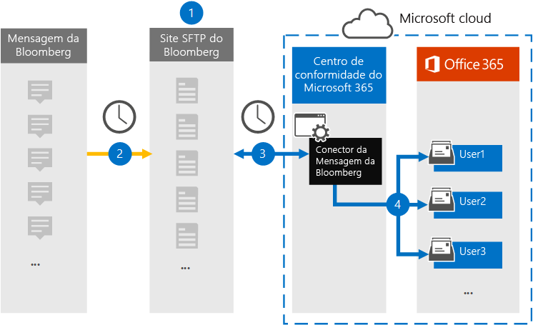

# Configurar um conector para arquivar dados da Mensagem bloombergSet up a connector to archive Bloomberg Message data

Use um conector de dados no centro de conformidade do Microsoft 365 para importar e arquivar dados de email de serviços financeiros da ferramenta de colaboração [da Mensagem bloomberg.](https://www.bloomberg.com/professional/product/collaboration/)Use a data connector in the Microsoft 365 compliance center to import and archive financial services email data from the [Bloomberg Message](https://www.bloomberg.com/professional/product/collaboration/) collaboration tool. Depois de configurar e configurar um conector, ele se conecta ao site FTP seguro da Bloomberg (SFTP) da sua organização uma vez por dia e importa itens de email para caixas de correio no Microsoft 365.After you set up and configure a connector, it connects to your organization's Bloomberg secure FTP (SFTP) site once every day, and imports email items to mailboxes in Microsoft 365.

Depois que os dados da Mensagem da Bloomberg são armazenados em caixas de correio de usuário, você pode aplicar recursos de conformidade do Microsoft 365, como retenção de litígio, pesquisa de conteúdo, arquivamento in-locar, auditoria, conformidade de comunicação e políticas de retenção do Microsoft 365 aos dados da Mensagem bloomberg.After Bloomberg Message data is stored in user mailboxes, you can apply Microsoft 365 compliance features such as Litigation hold, content search, In-place archiving, auditing, Communication compliance, and Microsoft 365 retention policies to Bloomberg Message data. Por exemplo, você pode pesquisar emails da Mensagem bloomberg usando a ferramenta de pesquisa de conteúdo ou associar a caixa de correio que contém os dados da Mensagem Bloomberg com um custodiante em um caso de Descoberta Avançada de Descoberta Eletrônico.For example, you can search Bloomberg Message emails using the content search tool or associate the mailbox that contains the Bloomberg Message data with a custodian in an Advanced eDiscovery case. Usar um conector de Mensagem da Bloomberg para importar e arquivar dados no Microsoft 365 pode ajudar sua organização a manter-se em conformidade com as políticas governamentais e regulatórias.Using a Bloomberg Message connector to import and archive data in Microsoft 365 can help your organization stay compliant with government and regulatory policies.

## Visão geral dos dados de mensagem do Bloomberg de arquivamentoOverview of archiving Bloomberg Message data

A visão geral a seguir explica o processo de uso de um conector para arquivar dados da Mensagem do Bloomberg no Microsoft 365.The following overview explains the process of using a connector to archive Bloomberg Message data in Microsoft 365.

1. Sua organização trabalha com a Bloomberg para configurar um site do SFTP da Bloomberg.Your organization works with Bloomberg to set up a Bloomberg SFTP site. Você também trabalhará com a Bloomberg para configurar a Mensagem bloomberg para copiar mensagens de email para o site do SFTP da Bloomberg.You'll also work with Bloomberg to configure Bloomberg Message to copy email messages to the Bloomberg SFTP site.

2. Uma vez a cada 24 horas, as mensagens de email da Mensagem Bloomberg são copiadas para o site do SFTP da Bloomberg.Once every 24 hours, email messages from Bloomberg Message are copied to the Bloomberg SFTP site.

3. O conector de Mensagem da Bloomberg que você cria no centro de conformidade do Microsoft 365 conecta-se ao site do SFTP da Bloomberg todos os dias e transfere as mensagens de email das 24 horas anteriores para uma área segura de Armazenamento do Azure no Microsoft Cloud.The Bloomberg Message connector that you create in the Microsoft 365 compliance center connects to the Bloomberg SFTP site every day and transfers the email messages from the previous 24 hours to a secure Azure Storage area in the Microsoft Cloud.

4. O conector importa os itens de mensagem de email para a caixa de correio de um usuário específico.The connector imports the email message items to the mailbox of a specific user. Uma nova pasta chamada BloombergMessage é criada na caixa de correio do usuário específico e os itens serão importados para ela.A new folder named BloombergMessage is created in the specific user's mailbox and the items will be imported to it. 

   O conector faz isso usando o valor da propriedade CorporateEmailAddress.The connector does this by using the value of the CorporateEmailAddress property. Cada mensagem de email contém essa propriedade, que é preenchida com o endereço de email de cada participante da mensagem de email.Every email message contains this property, which is populated with the email address of every participant of the email message. Além do mapeamento automático do usuário usando o valor da propriedade *CorporateEmailAddress,* você também pode definir um mapeamento personalizado carregando um arquivo de mapeamento CSV.In addition to automatic user mapping using the value of the *CorporateEmailAddress* property, you can also define a custom mapping by uploading a CSV mapping file. Este arquivo de mapeamento contém uma UUID da Bloomberg e o endereço de caixa de correio correspondente do Microsoft 365 para cada usuário em sua organização.This mapping file contains a Bloomberg UUID and the corresponding Microsoft 365 mailbox address for each user in your organization. Se você habilitar o mapeamento automático do usuário e fornecer um mapeamento personalizado, para cada item de email, o conector olhará primeiro para o arquivo de mapeamento personalizado.If you enable automatic user mapping and provide a custom mapping, for every email item the connector will first look at the custom-mapping file. Se ele não encontrar um usuário válido do Microsoft 365 que corresponda à UUID bloomberg de um usuário, o conector usará a propriedade *CorporateEmailAddress* do item de email.If it doesn't find a valid Microsoft 365 user that corresponds to a user's Bloomberg UUID, the connector uses the *CorporateEmailAddress* property of the email item. Se o conector não encontrar um usuário válido do Microsoft 365 no arquivo de mapeamento personalizado ou na propriedade *CorporateEmailAddress* do item de email, o item não será importado.If the connector doesn't find a valid Microsoft 365 user in either the custom-mapping file or the *CorporateEmailAddress* property of the email item, the item won't be imported.

## Antes de começarBefore you begin

Algumas das etapas de implementação necessárias para arquivar dados da Mensagem do Bloomberg são externas ao Microsoft 365 e devem ser concluídas antes que você possa criar o conector no centro de conformidade.Some of the implementation steps required to archive Bloomberg Message data are external to Microsoft 365 and must be completed before you can create the connector in the compliance center.

- Inscreva-se [em Bloomberg Em Qualquer Lugar](https://www.bloomberg.com/professional/product/remote-access/?bbgsum-page=DG-WS-PROF-PROD-BBA).Subscribe to [Bloomberg Anywhere](https://www.bloomberg.com/professional/product/remote-access/?bbgsum-page=DG-WS-PROF-PROD-BBA). Isso é necessário para que você possa fazer logoff na Bloomberg Em Qualquer Lugar para acessar o site do SFTP da Bloomberg que você precisa configurar e configurar.This is required so that you can log in to Bloomberg Anywhere to access the Bloomberg SFTP site that you have to set up and configure.

- Configurar um site do SFTP da Bloomberg (protocolo de transferência de arquivos seguro).Set up a Bloomberg SFTP (Secure file transfer protocol) site. Depois de trabalhar com a Bloomberg para configurar o site do SFTP, os dados da Mensagem da Bloomberg são carregados no site SFTP todos os dias.After working with Bloomberg to set up the SFTP site, data from Bloomberg Message is uploaded to the SFTP site every day. O conector criado na Etapa 2 conecta-se a esse site SFTP e transfere os dados de email para caixas de correio do Microsoft 365.The connector you create in Step 2 connects to this SFTP site and transfers the email data to Microsoft 365 mailboxes. O SFTP também criptografa os dados da Mensagem Bloomberg que são enviados para caixas de correio durante o processo de transferência.SFTP also encrypts the Bloomberg Message data that is sent to mailboxes during the transfer process.

  Para obter informações sobre o SFTP da Bloomberg (também chamado *de BB-SFTP*):For information about Bloomberg SFTP (also called *BB-SFTP*):

  - Consulte o documento "Padrões de Conectividade SFTP" em [Suporte à Bloomberg](https://www.bloomberg.com/professional/support/documentation/).See the "SFTP Connectivity Standards" document at [Bloomberg Support](https://www.bloomberg.com/professional/support/documentation/).

  - Entre [em contato com o suporte ao cliente da Bloomberg.](https://service.bloomberg.com/portal/sessions/new?utm_source=bloomberg-menu&utm_medium=csc)Contact [Bloomberg customer support](https://service.bloomberg.com/portal/sessions/new?utm_source=bloomberg-menu&utm_medium=csc).

   > [!NOTE]
   > Se sua organização já tiver implantado um conector para arquivar dados instantâneos do Bloomberg, você não precisará configurar outro site SFTP.If your organization already deployed a connector to archive Instant Bloomberg data, you don't need to set up another SFTP site. Você pode usar o mesmo site SFTP para o conector de Mensagens da Bloomberg.You can use the same SFTP site for the Bloomberg Message connector.

- Depois de trabalhar com a Bloomberg para configurar um site SFTP, a Bloomberg fornecerá algumas informações a você depois de responder à mensagem de email de implementação do Bloomberg.After you work with Bloomberg to set up an SFTP site, Bloomberg will provide some information to you after you respond to the Bloomberg implementation email message. Salve uma cópia das informações a seguir.Save a copy of the following information. Use-o para configurar um conector na Etapa 3.You use it to set up a connector in Step 3.

  - Código firme, que é uma ID da sua organização e é usado para fazer logoff no site do SFTP da Bloomberg.Firm code, which is an ID for your organization and is used to log in to the Bloomberg SFTP site.

  - Senha para seu site do SFTP da BloombergPassword for your Bloomberg SFTP site

  - URL do site do SFTP da Bloomberg (por exemplo, sftp.bloomberg.com).URL for Bloomberg SFTP site (for example, sftp.bloomberg.com). Além disso, a Bloomberg também pode fornecer um endereço IP correspondente para o site do SFTP da Bloomberg, que também pode ser usado para configurar o conector.In addition, Bloomberg may also provide a corresponding IP address for the Bloomberg SFTP site, which also can be used to set up the connector.

  - Número da porta para o site do SFTP da BloombergPort number for Bloomberg SFTP site

- O conector de Mensagem bloomberg pode importar um total de 200.000 itens em um único dia.The Bloomberg Message connector can import a total of 200,000 items in a single day. Se houver mais de 200.000 itens no site do SFTP, nenhum desses itens será importado para o Microsoft 365.If there are more than 200,000 items on the SFTP site, none of those items will be imported to Microsoft 365.

- O usuário que cria um conector de Mensagem do Bloomberg na Etapa 3 (e que baixa as chaves públicas e o endereço IP na Etapa 1) deve receber a função de Exportação de Importação de Caixa de Correio no Exchange Online.The user who creates a Bloomberg Message connector in Step 3 (and who downloads the public keys and IP address in Step 1) must be assigned the Mailbox Import Export role in Exchange Online. Isso é necessário para adicionar conectores na página **Conectores de** dados no centro de conformidade do Microsoft 365.This is required to add connectors in the **Data connectors** page in the Microsoft 365 compliance center. Por padrão, essa função não é atribuída a nenhum grupo de funções no Exchange Online.By default, this role isn't assigned to any role group in Exchange Online. Você pode adicionar a função Exportar Importação de Caixa de Correio ao grupo de função Gerenciamento da Organização no Exchange Online.You can add the Mailbox Import Export role to the Organization Management role group in Exchange Online. Ou você pode criar um grupo de funções, atribuir a função Exportar Importação de Caixa de Correio e adicionar os usuários apropriados como membros.Or you can create a role group, assign the Mailbox Import Export role, and then add the appropriate users as members. Para obter mais informações, consulte as seções Criar grupos de [função](/Exchange/permissions-exo/role-groups#create-role-groups) ou [Modificar](/Exchange/permissions-exo/role-groups#modify-role-groups) grupos de função no artigo "Gerenciar grupos de função no Exchange Online".For more information, see the [Create role groups](/Exchange/permissions-exo/role-groups#create-role-groups) or [Modify role groups](/Exchange/permissions-exo/role-groups#modify-role-groups) sections in the article "Manage role groups in Exchange Online".

## Etapa 1: Obter chaves públicas SSH e PGPStep 1: Obtain SSH and PGP public keys

A primeira etapa é obter uma cópia das chaves públicas para o Shell Seguro (SSH) e a PGP (Privacidade Muito Boa).The first step is to obtain a copy of the public keys for Secure Shell (SSH) and Pretty Good Privacy (PGP). Você usa essas chaves na Etapa 2 para configurar o site do SFTP do Bloomberg para permitir que o conector (criado na Etapa 3) se conecte ao site SFTP e transfira os dados de email da Mensagem Bloomberg para caixas de correio do Microsoft 365.You use these keys in Step 2 to configure the Bloomberg SFTP site to allow the connector (that you create in Step 3) to connect to the SFTP site and transfer the Bloomberg Message email data to Microsoft 365 mailboxes. Você também obtém um endereço IP nesta etapa, que você usa ao configurar o site do SFTP do Bloomberg.You also obtain an IP address in this step, which you use when configuring the Bloomberg SFTP site.

1. Vá para [ https://compliance.microsoft.com\ ]( https://compliance.microsoft.com) e clique em **Conectores de** dados na nav esquerda.Go to [https://compliance.microsoft.com\](https://compliance.microsoft.com) and click **Data connectors** in the left nav.

2. Na página **Conectores de dados** em **Mensagem de Bloomberg,** clique em **Exibir**.On the **Data connectors** page under **Bloomberg Message**, click **View**.

3. Na página **Descrição do produto da mensagem Bloomberg,** clique em **Adicionar conector**On the **Bloomberg Message** product description page, click **Add connector**

4. Na página **Termos de serviço,** clique em **Aceitar**.On the **Terms of service** page, click **Accept**.

5. No site Adicionar credenciais do **SFTP do Bloomberg** na etapa 1, clique na tecla **Baixar SSH,** baixe a **tecla PGP** e Baixe links de **endereço IP** para salvar uma cópia de cada arquivo no computador local.On the **Add credentials for Bloomberg SFTP site** under step 1, click the **Download SSH key**, **Download PGP key**, and **Download IP address** links to save a copy of each file to your local computer. Esses arquivos contêm os seguintes itens usados para configurar o site do SFTP do Bloomberg na Etapa 2:These files contain the following items that are used to configure the Bloomberg SFTP site in Step 2:

   - Chave pública SSH: essa chave é usada para configurar o Secure Shell (SSH) para habilitar um logon remoto seguro quando o conector se conectar ao site do SFTP da Bloomberg.SSH public key: This key is used to configure Secure Shell (SSH) to enable a secure remote login when the connector connects to the Bloomberg SFTP site.

   - Chave pública PGP: essa chave é usada para configurar a criptografia de dados transferidos do site do SFTP da Bloomberg para o Microsoft 365.PGP public key: This key is used to configure the encryption of data that's transferred from the Bloomberg SFTP site to Microsoft 365.

   - Endereço IP: o site do SFTP da Bloomberg está configurado para aceitar uma solicitação de conexão somente a partir desse endereço IP, que é usado pelo conector de Mensagem do Bloomberg que você cria na Etapa 3.IP address: The Bloomberg SFTP site is configured to accept a connection request only from this IP address, which is used by the Bloomberg Message connector that you create in Step 3.

6. Clique **em Cancelar** para fechar o assistente.Click **Cancel** to close the wizard. Você volta para este assistente na Etapa 3 para criar o conector.You come back to this wizard in Step 3 to create the connector.

## Etapa 2: Configurar o site do SFTP da BloombergStep 2: Configure the Bloomberg SFTP site

> [!NOTE]
> Como mencionado anteriormente, se você estiver organizando anteriormente um site do SFTP da Bloomberg para arquivar dados instantâneos do Bloomberg, você não precisa configurar outro.As previously stated, if you're organization has previously set up a Bloomberg SFTP site to archive Instant Bloomberg data, you don't have to set up another one. Você pode especificar o mesmo site SFTP ao criar o conector na Etapa 3.You can specify the same SFTP site when you create the connector in Step 3.

A próxima etapa é usar as chaves públicas SSH e PGP e o endereço IP obtido na Etapa 1 para configurar a autenticação SSH e a criptografia PGP para o site do SFTP da Bloomberg.The next step is to use the SSH and PGP public keys and the IP address that you obtained in Step 1 to configure SSH authentication and PGP encryption for the Bloomberg SFTP site. Isso permite que o conector de Mensagem do Bloomberg criado na Etapa 3 se conecte ao site do SFTP da Bloomberg e transfira dados da Mensagem do Bloomberg para o Microsoft 365.This lets the Bloomberg Message connector that you create in Step 3 connect to the Bloomberg SFTP site and transfer Bloomberg Message data to Microsoft 365. Você precisa trabalhar com o suporte ao cliente da Bloomberg para configurar seu site do SFTP da Bloomberg.You need to work with Bloomberg customer support to set up your Bloomberg SFTP site. Entre [em contato com o suporte ao cliente da Bloomberg](https://service.bloomberg.com/portal/sessions/new?utm_source=bloomberg-menu&utm_medium=csc) para assistência.Contact [Bloomberg customer support](https://service.bloomberg.com/portal/sessions/new?utm_source=bloomberg-menu&utm_medium=csc) for assistance.

> [!IMPORTANT]
> A Bloomberg recomenda que você anexe os três arquivos baixados na Etapa 1 a uma mensagem de email e envie-a para a equipe de suporte ao cliente ao trabalhar com eles para configurar seu site do SFTP da Bloomberg.Bloomberg recommends that you attach the three files that you downloaded in Step 1 to an email message and send it to their customer support team when working with them to set up your Bloomberg SFTP site.

## Etapa 3: Criar um conector de mensagem da BloombergStep 3: Create a Bloomberg Message connector

A última etapa é criar um conector de Mensagem do Bloomberg no centro de conformidade do Microsoft 365.The last step is to create a Bloomberg Message connector in the Microsoft 365 compliance center. O conector usa as informações fornecidas para se conectar ao site do SFTP da Bloomberg e transferir mensagens de email para as caixas de correio de usuário correspondentes no Microsoft 365.The connector uses the information you provide to connect to the Bloomberg SFTP site and transfer email messages to the corresponding user mailbox boxes in Microsoft 365.

1. Vá para [https://compliance.microsoft.com](https://compliance.microsoft.com) e clique **em Conectores de dados** na nav esquerda.Go to [https://compliance.microsoft.com](https://compliance.microsoft.com) and click **Data connectors** in the left nav.

2. Na página **Conectores de dados** em **Mensagem de Bloomberg,** clique em **Exibir**.On the **Data connectors** page under **Bloomberg Message**, click **View**.

3. Na página **Descrição do produto da mensagem Bloomberg,** clique em **Adicionar conector**On the **Bloomberg Message** product description page, click **Add connector**

4. Na página **Termos de serviço,** clique em **Aceitar**.On the **Terms of service** page, click **Accept**.

5. Na página Adicionar credenciais para o **site do SFTP da Bloomberg,** em Etapa 3, insira as informações necessárias nas caixas a seguir e clique em **Próximo**.On the **Add credentials for Bloomberg SFTP site** page, under Step 3, enter the required information in the following boxes and then click **Next**.

      - **Código firme:** A ID da sua organização que é usada como nome de usuário para o site do SFTP da Bloomberg.**Firm code:** The ID for your organization that is used as the username for the Bloomberg SFTP site.

      - **Senha:** A senha do site do SFTP bloomberg da sua organização.**Password:** The password for your organization's Bloomberg SFTP site.

      - **URL SFTP:** A URL do site do SFTP da Bloomberg (por exemplo, sftp.bloomberg.com).**SFTP URL:** The URL for the Bloomberg SFTP site (for example, sftp.bloomberg.com).

      - **Porta SFTP:** O número da porta do site do SFTP da Bloomberg.**SFTP port:** The port number for the Bloomberg SFTP site. O conector usa essa porta para se conectar ao site SFTP.The connector uses this port to connect to the SFTP site.

6. Na página **Mapeamento de usuário,** habilita o mapeamento automático do usuário e fornece mapeamento de usuário personalizado conforme necessárioOn the **User-mapping** page, enable automatic user mapping and provide custom user mapping as required

7. Clique **em Próximo,** revise suas configurações e clique em Preparar-se para criar o conector.Click **Next**, review your settings, and then click prepare to create the connector.

8. Vá até a **página Conectores de dados** para ver o andamento do processo de importação do novo conector.Go to the **Data connectors** page to see the progress of the import process for the new connector.

## Problemas conhecidosKnown issues

- Threading of Bloomberg Message email imported to Microsoft 365 isn't supported.Threading of Bloomberg Message email imported to Microsoft 365 isn't supported. As mensagens individuais enviadas a uma pessoa são importadas, mas não são apresentadas em uma conversa encadeada.Individual messages sent to a person are imported, but they aren't presented in a threaded conversation. A Microsoft está trabalhando para dar suporte ao threading em versões posteriores do conector de dados da Mensagem do Bloomberg.Microsoft is working to support threading in later versions of the Bloomberg Message data connector.