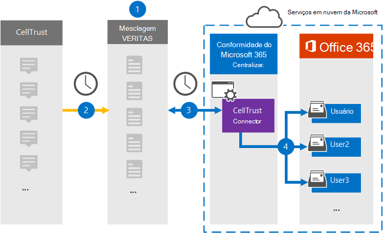

# Configurar um conector para arquivar dados cellTrustSet up a connector to archive CellTrust data

Use um conector Globalnet no centro de conformidade do Microsoft 365 para importar e arquivar dados da plataforma CellTrust para caixas de correio de usuário em sua organização do Microsoft 365.Use a Globanet connector in the Microsoft 365 compliance center to import and archive data from the CellTrust platform to user mailboxes in your Microsoft 365 organization. Globalnet fornece um [conector CellTrust](https://globanet.com/celltrust/) que captura itens da fonte de dados de terceiros e importa esses itens para o Microsoft 365.Globanet provides a [CellTrust](https://globanet.com/celltrust/) connector that captures items from the third-party data source and imports those items to Microsoft 365. O conector converte o conteúdo de mensagens SMS de contas CellTrust em um formato de mensagem de email e importa esses itens para a caixa de correio do usuário no Microsoft 365.The connector converts the content of SMS messages from CellTrust accounts to an email message format and then imports those items to the user's mailbox in Microsoft 365.

Depois que os dados cellTrust são armazenados em caixas de correio de usuário, você pode aplicar recursos de conformidade do Microsoft 365, como Retenção de Litígio, Descoberta Eletrônico, políticas de retenção e rótulos de retenção e conformidade de comunicação.After CellTrust data is stored in user mailboxes, you can apply Microsoft 365 compliance features such as Litigation Hold, eDiscovery, retention policies and retention labels, and communication compliance. Usar um conector CellTrust para importar e arquivar dados no Microsoft 365 pode ajudar sua organização a se manter em conformidade com políticas governamentais e regulatórias.Using a CellTrust connector to import and archive data in Microsoft 365 can help your organization stay compliant with government and regulatory policies.

## Visão geral dos dados cellTrust de arquivamentoOverview of archiving CellTrust data

A visão geral a seguir explica o processo de uso de um conector para arquivar dados cellTrust no Microsoft 365.The following overview explains the process of using a connector to archive CellTrust data in Microsoft 365.

1. Sua organização trabalha com CellTrust para configurar e configurar um site CellTrust.Your organization works with CellTrust to set up and configure a CellTrust site.

2. Uma vez a cada 24 horas, os itens CellTrust são copiados para o site Globalnet Merge1.Once every 24 hours, CellTrust items are copied to the Globanet Merge1 site. O conector também converte o conteúdo de uma mensagem em um formato de mensagem de email.The connector also converts the content of a message to an email message format.

3. O conector CellTrust criado no centro de conformidade do Microsoft 365 conecta-se ao site Globalnet Merge1 todos os dias e transfere as mensagens para um local seguro de Armazenamento do Azure na nuvem da Microsoft.The CellTrust connector that you create in the Microsoft 365 compliance center connects to the Globanet Merge1 site every day and transfers the messages to a secure Azure Storage location in the Microsoft cloud.

4. O mapeamento automático do usuário como conector importa itens para as caixas de correio de usuários específicos usando o valor da propriedade *Email* do descrito [na Etapa 3](#step-3-map-users-and-complete-the-connector-setup).The automatic user mapping as connector imports items to the mailboxes of specific users by using the value of the *Email* property of the described in [Step 3](#step-3-map-users-and-complete-the-connector-setup). Uma subpasta na pasta Caixa de Entrada chamada **CellTrust** é criada nas caixas de correio do usuário e os itens de mensagem são importados para essa pasta.A subfolder in the Inbox folder named **CellTrust** is created in the user mailboxes, and the message items are imported to that folder. O conector determina para qual caixa de correio importar itens usando o valor da *propriedade Email.*The connector determines which mailbox to import items to by using the value of the *Email* property. Cada item CellTrust contém essa propriedade, que é preenchida com o endereço de email de cada participante.Every CellTrust item contains this property, which is populated with the email address of every participant.

## Antes de começarBefore you begin

- Crie uma conta Merge1 para conectores da Microsoft.Create a Merge1 account for Microsoft connectors. Para criar uma conta, contate [Globalnet Customer Support](https://globanet.com/contact-us/).To create an account, contact [Globanet Customer Support](https://globanet.com/contact-us/). Você precisa entrar nessa conta ao criar o conector na Etapa 1.You need to sign into this account when you create the connector in Step 1.

- O usuário que cria o conector CellTrust na Etapa 1 (e o conclui na Etapa 3) deve ser atribuído à função De exportação de importação de caixa de correio no Exchange Online.The user who creates the CellTrust connector in Step 1 (and completes it in Step 3) must be assigned to the Mailbox Import Export role in Exchange Online. Essa função é necessária para adicionar conectores na página **Conectores de** dados no centro de conformidade do Microsoft 365.This role is required to add connectors on the **Data connectors** page in the Microsoft 365 compliance center. Por padrão, essa função não é atribuída a nenhum grupo de funções no Exchange Online.By default, this role isn't assigned to any role group in Exchange Online. Você pode adicionar a função Exportar Importação de Caixa de Correio ao grupo de função Gerenciamento da Organização no Exchange Online.You can add the Mailbox Import Export role to the Organization Management role group in Exchange Online. Ou você pode criar um grupo de funções, atribuir a função Exportar Importação de Caixa de Correio e adicionar os usuários apropriados como membros.Or you can create a role group, assign the Mailbox Import Export role, and then add the appropriate users as members. Para obter mais informações, consulte as seções Criar grupos de [função](/Exchange/permissions-exo/role-groups#create-role-groups) ou [Modificar](/Exchange/permissions-exo/role-groups#modify-role-groups) grupos de função no artigo "Gerenciar grupos de função no Exchange Online".For more information, see the [Create role groups](/Exchange/permissions-exo/role-groups#create-role-groups) or [Modify role groups](/Exchange/permissions-exo/role-groups#modify-role-groups) sections in the article "Manage role groups in Exchange Online".

## Etapa 1: Configurar o conector CellTrustStep 1: Set up the CellTrust connector

A primeira etapa é acessar os **Conectores** de Dados no centro de conformidade do Microsoft 365 e criar um conector para dados CellTrust.The first step is to access to the **Data Connectors** in the Microsoft 365 compliance center and create a connector for CellTrust data.

1. Vá para [https://compliance.microsoft.com](https://compliance.microsoft.com/) e clique em **Conectores de dados** \> **CellTrust**.Go to [https://compliance.microsoft.com](https://compliance.microsoft.com/) and then click **Data connectors** \> **CellTrust**.

2. Na página **Descrição do produto CellTrust,** clique em **Adicionar conector**.On the **CellTrust** product description page, click **Add connector**.

3. Na página **Termos de serviço,** clique em **Aceitar**.On the **Terms of service** page, click **Accept**.

4. Insira um nome exclusivo que identifique o conector e clique em **Próximo**.Enter a unique name that identifies the connector and then click **Next**.

5. Entre na sua conta Merge1 para configurar o conector.Sign in to your Merge1 account to configure the connector.

## Etapa 2: Configurar o conector CellTrust no site Globalnet Merge1Step 2: Configure the CellTrust connector on the Globanet Merge1 site

A segunda etapa é configurar o conector CellTrust no site Globalnet Merge1.The second step is to configure the CellTrust connector on the Globanet Merge1 site. Para obter informações sobre como configurar o conector CellTrust, consulte [Merge1 Third-Party Connectors User Guide](https://docs.ms.merge1.globanetportal.com/Merge1%20Third-Party%20Connectors%20CellTrust%20User%20Guide%20.pdf).For information about how to configure the CellTrust connector, see [Merge1 Third-Party Connectors User Guide](https://docs.ms.merge1.globanetportal.com/Merge1%20Third-Party%20Connectors%20CellTrust%20User%20Guide%20.pdf).

Depois de clicar em Salvar &  **Concluir**, a página de mapeamento do usuário no assistente de conector no centro de conformidade do Microsoft 365 será exibida.After you click **Save & Finish**, the **User mapping** page in the connector wizard in the Microsoft 365 compliance center is displayed.

## Etapa 3: mapear usuários e concluir a configuração do conectorStep 3: Map users and complete the connector setup

Para mapear usuários e concluir a configuração do conector no centro de conformidade do Microsoft 365, siga estas etapas:To map users and complete the connector set up in the Microsoft 365 compliance center, follow these steps:

1. Na página **Mapear usuários cellTrust para usuários do Microsoft 365,** habilita o mapeamento automático do usuário.On the **Map CellTrust users to Microsoft 365 users** page, enable automatic user mapping. Os itens CellTrust incluem uma propriedade chamada *Email*, que contém endereços de email para usuários em sua organização.The CellTrust items include a property called *Email*, which contains email addresses for users in your organization. Se o conector puder associar esse endereço a um usuário do Microsoft 365, os itens serão importados para a caixa de correio desse usuário.If the connector can associate this address with a Microsoft 365 user, the items are imported to that user’s mailbox.

2. Clique **em Avançar,** revise suas configurações e vá até a página **Conectores** de dados para ver o andamento do processo de importação do novo conector.Click **Next**, review your settings, and go to the **Data connectors** page to see the progress of the import process for the new connector.

## Etapa 4: Monitorar o conector CellTrustStep 4: Monitor the CellTrust connector

Depois de criar o conector CellTrust, você poderá exibir o status do conector no centro de conformidade do Microsoft 365.After you create the CellTrust connector, you can view the connector status in the Microsoft 365 compliance center.

1. Vá para [https://compliance.microsoft.com](https://compliance.microsoft.com/) e clique **em Conectores de dados** na nav esquerda.Go to [https://compliance.microsoft.com](https://compliance.microsoft.com/) and click **Data connectors** in the left nav.

2. Clique na **guia Conectores** e selecione o conector **CellTrust** para exibir a página de sobrevoo, que contém as propriedades e informações sobre o conector.Click the **Connectors** tab and then select the **CellTrust** connector to display the flyout page, which contains the properties and information about the connector.

3. Em **Status do conector com origem**, clique no link Baixar **log** para abrir (ou salvar) o log de status do conector.Under **Connector status with source**, click the **Download log** link to open (or save) the status log for the connector. Esse log contém dados que foram importados para a nuvem da Microsoft.This log contains data that has been imported to the Microsoft cloud.

## Problemas conhecidosKnown issues

- Neste momento, não há suporte para importação de anexos ou itens maiores que 10 MB.At this time, we don't support importing attachments or items that are larger than 10 MB. O suporte para itens maiores estará disponível posteriormente.Support for larger items will be available at a later date.