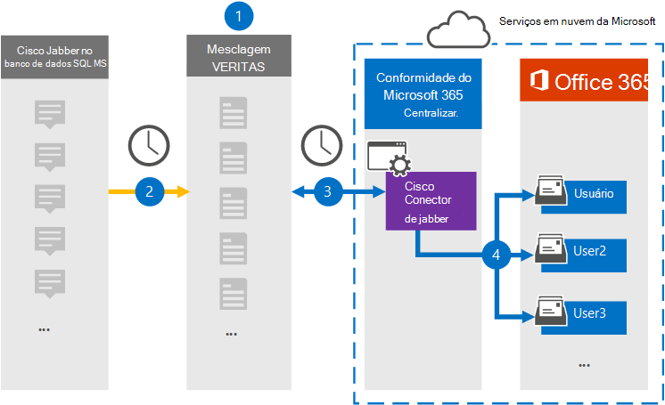

# Configurar um conector para arquivar os dados do Cisco JabberSet up a connector to archive Cisco Jabber data

Use um conector Globanet no centro de conformidade da Microsoft 365 para importar e arquivar dados da plataforma Cisco Jabber para caixas de correio do usuário na sua organização do Microsoft 365.Use a Globanet connector in the Microsoft 365 compliance center to import and archive data from the Cisco Jabber platform to user mailboxes in your Microsoft 365 organization. O Globanet fornece um conector [Cisco Jabber](https://globanet.com/jabber/) que é configurado para capturar itens do banco de dados MS SQL do Jabber, 1:1 como mensagens de chat e chats de grupo do e, em seguida, importa esses itens para a Microsoft 365.Globanet provides you with a [Cisco Jabber](https://globanet.com/jabber/) connector that is configured to capture items from the Jabber’s MS SQL Database, such as 1:1 chat messages and group chats and then import those items to Microsoft 365. O conector recupera dados do banco de dados MS SQL do Cisco Jabber, processa-o e converte o conteúdo de uma conta do Cisco Jabber do usuário em um formato de mensagem de email e, em seguida, importa esses itens para a caixa de correio do usuário no Microsoft 365.The connector retrieves data from the Cisco Jabber’s MS SQL Database, processes it, and the converts the content from a user's Cisco Jabber account to an email message format and then imports those items to the user's mailbox in Microsoft 365.

Depois que os dados do Cisco Jabber são armazenados nas caixas de correio do usuário, você pode aplicar recursos de conformidade do Microsoft 365, como retenção de litígio, descoberta eletrônica, políticas de retenção e rótulos de retenção e conformidade de comunicação.After Cisco Jabber data is stored in user mailboxes, you can apply Microsoft 365 compliance features such as Litigation Hold, eDiscovery, retention policies and retention labels, and communication compliance. O uso de um conector do Cisco Jabber para importar e arquivar dados no Microsoft 365 pode ajudar sua organização a se manter em conformidade com as políticas governamentais e regulamentares.Using a Cisco Jabber connector to import and archive data in Microsoft 365 can help your organization stay compliant with government and regulatory policies.

## Visão geral do arquivamento de dados do Cisco JabberOverview of archiving Cisco Jabber data

A visão geral a seguir explica o processo de usar um conector para arquivar os dados do Cisco Jabber no Microsoft 365.The following overview explains the process of using a connector to archive Cisco Jabber data in Microsoft 365.

1. Sua organização trabalha com a Cisco para configurar e configurar um banco de dados do Cisco Jabber no MS SQL.Your organization works with Cisco to set up and configure a Cisco Jabber on MS SQL Database.

2. Uma vez a cada 24 horas, os itens do Cisco Jabber são copiados do banco de dados MS SQL para o site do Merge1 do Globanet.Once every 24 hours, Cisco Jabber items are copied from the MS SQL Database to the Globanet Merge1 site. O conector também converte o conteúdo de mensagens de chat em um formato de mensagem de email.The connector also converts the content of chat messages to an email message format.

3. O conector do Cisco Jabber que você cria no centro de conformidade da Microsoft 365 conecta-se ao site do Globanet Merge1 todos os dias e transfere os itens para um local seguro de armazenamento do Azure na nuvem da Microsoft.The Cisco Jabber connector that you create in the Microsoft 365 compliance center connects to the Globanet Merge1 site every day and transfers the items to a secure Azure Storage location in the Microsoft cloud.

4. O mapeamento de usuário automático como conector importa itens para as caixas de correio de usuários específicos usando o valor da propriedade *email* do descrito na [etapa 3](#step-3-map-users-and-complete-the-connector-setup).The automatic user mapping as connector imports items to the mailboxes of specific users by using the value of the *Email* property of the described in [Step 3](#step-3-map-users-and-complete-the-connector-setup). Uma subpasta na pasta caixa de entrada chamada **Cisco Jabber no MS SQL** é criada nas caixas de correio do usuário e os itens de mensagem são importados para essa pasta.A subfolder in the Inbox folder named **Cisco Jabber on MS SQL** is created in the user mailboxes, and the message items are imported to that folder. O conector determina qual caixa de correio para a qual importar itens usando o valor da propriedade *email* .The connector determines which mailbox to import items to by using the value of the *Email* property. Cada item do Cisco Jabber contém essa propriedade, que é preenchida com o endereço de email de cada participante.Every Cisco Jabber item contains this property, which is populated with the email address of every participant.

## Antes de começarBefore you begin

- Crie uma conta do Merge1 do Globanet para conectores da Microsoft.Create a Globanet Merge1 account for Microsoft connectors. Para criar essa conta, entre em contato com o [suporte ao cliente Globanet](https://globanet.com/ms-connectors-contact/).To create this account, contact [Globanet Customer Support](https://globanet.com/ms-connectors-contact/). Você entrará nesta conta quando criar o conector na etapa 1.You will sign into this account when you create the connector in Step 1.

- Configurar um banco de dados MS SQL para recuperar os itens do Jabber antes de criar o conector na etapa 1.Set up an MS SQL Database to retrieve Jabber items from before creating the connector in Step 1. Você especificará as configurações de conexão para o banco de dados MS SQL ao configurar o conector do Cisco Jabber na etapa 2.You will specify the connection settings for the MS SQL Database when configuring the Cisco Jabber connector in Step 2. Para obter mais informações, consulte o [Guia do usuário do Merge1 conectores de terceiros](https://docs.ms.merge1.globanetportal.com/Merge1%20Third-Party%20Connectors%20Cisco%20Jabber%20on%20MS%20SQL%20User%20Guide%20.pdf).For more information, see the [Merge1 Third-Party Connectors User Guide](https://docs.ms.merge1.globanetportal.com/Merge1%20Third-Party%20Connectors%20Cisco%20Jabber%20on%20MS%20SQL%20User%20Guide%20.pdf).

- O usuário que cria o conector Cisco Jabber na etapa 1 (e conclui-lo na etapa 3) deve ser atribuído à função de exportação de importação de caixa de correio no Exchange Online.The user who creates the Cisco Jabber connector in Step 1 (and completes it in Step 3) must be assigned to the Mailbox Import Export role in Exchange Online. Essa função é necessária para adicionar conectores na página **conectores de dados** no centro de conformidade da Microsoft 365.This role is required to add connectors on the **Data connectors** page in the Microsoft 365 compliance center. Por padrão, essa função não é atribuída a um grupo de função no Exchange Online.By default, this role is not assigned to a role group in Exchange Online. Você pode adicionar a função de exportação de importação de caixa de correio ao grupo de funções Gerenciamento da organização no Exchange Online.You can add the Mailbox Import Export role to the Organization Management role group in Exchange Online. Ou você pode criar um grupo de função, atribua a função de exportação de importação de caixa de correio e, em seguida, adicione os usuários apropriados como membros.Or you can create a role group, assign the Mailbox Import Export role, and then add the appropriate users as members. Para obter mais informações, consulte as seções [criar grupos de função](https://docs.microsoft.com/Exchange/permissions-exo/role-groups#create-role-groups) ou [modificar grupos de função](https://docs.microsoft.com/Exchange/permissions-exo/role-groups#modify-role-groups) no artigo "gerenciar grupos de função no Exchange Online".For more information, see the [Create role groups](https://docs.microsoft.com/Exchange/permissions-exo/role-groups#create-role-groups) or [Modify role groups](https://docs.microsoft.com/Exchange/permissions-exo/role-groups#modify-role-groups) sections in the article "Manage role groups in Exchange Online".

## Etapa 1: configurar o conector Cisco JabberStep 1: Set up the Cisco Jabber connector

A primeira etapa é acessar os **conectores de dados** no centro de conformidade da Microsoft 365 e criar um conector para o Cisco Jabber em dados MS SQL.The first step is to access to the **Data Connectors** in the Microsoft 365 compliance center and create a connector for Cisco Jabber on MS SQL data.

1. Vá para [https://compliance.microsoft.com](https://compliance.microsoft.com/) e clique em **conectores de dados**  >  **Cisco Jabber no MS SQL**.Go to [https://compliance.microsoft.com](https://compliance.microsoft.com/)and then click **Data connectors** > **Cisco Jabber on MS SQL**.

2. Na página **Cisco Jabber na descrição do produto MS SQL** , clique em **Adicionar conector**.On the **Cisco Jabber on MS SQL** product description page, click **Add connector**.

3. Na página **termos de serviço** , clique em **aceitar**.On the **Terms of service** page, click **Accept**.

4. Insira um nome exclusivo que identifique o conector e clique em **Avançar**.Enter a unique name that identifies the connector and then click **Next**.

5. Entre em sua conta do Merge1 para configurar o conector.Sign in to your Merge1 account to configure the connector.

## Etapa 2: configurar o conector Cisco Jabber no site Globanet Merge1Step 2: Configure the Cisco Jabber connector on the Globanet Merge1 site

A segunda etapa é configurar o Cisco Jabber no MS SQL Connector no site do Merge1 Globanet.The second step is to configure the Cisco Jabber on MS SQL connector on the Globanet Merge1 site. Para obter informações sobre como configurar o Cisco Jabber no MS SQL Connector, consulte [Merge1 de terceiros conectores do usuário](https://docs.ms.merge1.globanetportal.com/Merge1%20Third-Party%20Connectors%20Cisco%20Jabber%20on%20MS%20SQL%20User%20Guide%20.pdf).For information about how to configure the Cisco Jabber on MS SQL connector, see [Merge1 Third-Party Connectors User Guide](https://docs.ms.merge1.globanetportal.com/Merge1%20Third-Party%20Connectors%20Cisco%20Jabber%20on%20MS%20SQL%20User%20Guide%20.pdf).

Depois de clicar em **salvar & concluir**, a página **mapeamento de usuário** no assistente de conector no centro de conformidade da Microsoft 365 é exibida.After you click **Save & Finish**, the **User mapping** page in the connector wizard in the Microsoft 365 compliance center is displayed.

## Etapa 3: mapear usuários e concluir a configuração do conectorStep 3: Map users and complete the connector setup

Para mapear usuários e concluir o conector configurado no centro de conformidade do Microsoft 365, siga estas etapas:To map users and complete the connector set up in the Microsoft 365 compliance center, follow these steps:

1. Na página **mapear o Cisco Jabber em usuários do MS SQL para usuários do Microsoft 365** , habilite o mapeamento de usuário automático.On the **Map Cisco Jabber on MS SQL users to Microsoft 365 users** page, enable automatic user mapping. Os itens do Cisco Jabber em MS SQL incluem uma propriedade chamada *email*, que contém endereços de email para usuários em sua organização.The Cisco Jabber on MS SQL items include a property called *Email*, which contains email addresses for users in your organization. Se o conector puder associar esse endereço a um usuário do Microsoft 365, os itens serão importados para a caixa de correio desse usuário.If the connector can associate this address with a Microsoft 365 user, the items are imported to that user’s mailbox.

2. Clique em **Avançar**, revise suas configurações e vá para a página **conectores de dados** para ver o andamento do processo de importação para o novo conector.Click **Next**, review your settings, and go to the **Data connectors** page to see the progress of the import process for the new connector.

## Etapa 4: monitorar o conector Cisco JabberStep 4: Monitor the Cisco Jabber connector

Depois de criar o Cisco Jabber no MS SQL Connector, você pode visualizar o status do conector no centro de conformidade da Microsoft 365.After you create the Cisco Jabber on MS SQL connector, you can view the connector status in the Microsoft 365 compliance center.

1. Vá para [https://compliance.microsoft.com](https://compliance.microsoft.com) e clique em **conectores de dados** no painel de navegação esquerdo.Go to [https://compliance.microsoft.com](https://compliance.microsoft.com) and click **Data connectors** in the left nav.

2. Clique na guia **conectores** e selecione o **Cisco JABBER no MS SQL** Connector para exibir a página do menu de atalho.Click the **Connectors** tab and then select the **Cisco Jabber on MS SQL** connector to display the flyout page. Esta página contém as propriedades e as informações sobre o conector.This page contains the properties and information about the connector.

3. Em **status do conector com origem**, clique no link **baixar log** para abrir (ou salvar) o log de status do conector.Under **Connector status with source**, click the **Download log** link to open (or save) the status log for the connector. Esse log contém dados que foram importados para a nuvem da Microsoft.This log contains data that has been imported to the Microsoft cloud.

## Problemas conhecidosKnown issues

- No momento, não há suporte para importar anexos ou itens com mais de 10 MB.At this time, we don't support importing attachments or items that are larger than 10 MB. O suporte para itens maiores estará disponível em uma data posterior.Support for larger items will be available at a later date.
