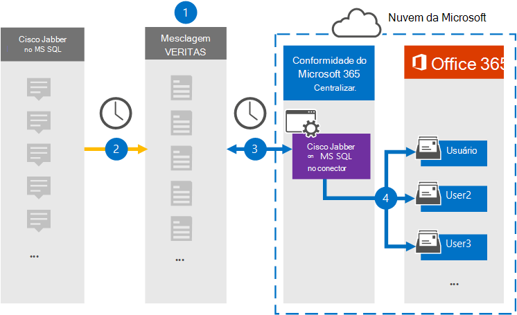

# Configurar um conector para arquivar os dados do Cisco Jabber

Use um conector Globanet no centro de conformidade da Microsoft 365 para importar e arquivar dados da plataforma Cisco Jabber para caixas de correio do usuário na sua organização do Microsoft 365. O Globanet fornece um conector [Cisco Jabber](https://globanet.com/jabber/) que é configurado para capturar itens do banco de dados MS SQL do Jabber, 1:1 como mensagens de chat e chats de grupo do e, em seguida, importa esses itens para a Microsoft 365. O conector recupera dados do banco de dados MS SQL do Cisco Jabber, processa-o e converte o conteúdo de uma conta do Cisco Jabber do usuário em um formato de mensagem de email e, em seguida, importa esses itens para a caixa de correio do usuário no Microsoft 365.

Depois que os dados do Cisco Jabber são armazenados nas caixas de correio do usuário, você pode aplicar recursos de conformidade do Microsoft 365, como retenção de litígio, descoberta eletrônica, políticas de retenção e rótulos de retenção e conformidade de comunicação. O uso de um conector do Cisco Jabber para importar e arquivar dados no Microsoft 365 pode ajudar sua organização a se manter em conformidade com as políticas governamentais e regulamentares.

## Visão geral do arquivamento de dados do Cisco Jabber

A visão geral a seguir explica o processo de usar um conector para arquivar os dados do Cisco Jabber no Microsoft 365.

1. Sua organização trabalha com a Cisco para configurar e configurar um banco de dados do Cisco Jabber no MS SQL.

2. Uma vez a cada 24 horas, os itens do Cisco Jabber são copiados do banco de dados MS SQL para o site do Merge1 do Globanet. O conector também converte o conteúdo de mensagens de chat em um formato de mensagem de email.

3. O conector do Cisco Jabber que você cria no centro de conformidade da Microsoft 365 conecta-se ao site do Globanet Merge1 todos os dias e transfere os itens para um local seguro de armazenamento do Azure na nuvem da Microsoft.

4. O mapeamento de usuário automático como conector importa itens para as caixas de correio de usuários específicos usando o valor da propriedade *email* do descrito na [etapa 3](#step-3-map-users-and-complete-the-connector-setup). Uma subpasta na pasta caixa de entrada chamada **Cisco Jabber no MS SQL** é criada nas caixas de correio do usuário e os itens de mensagem são importados para essa pasta. O conector determina qual caixa de correio para a qual importar itens usando o valor da propriedade *email* . Cada item do Cisco Jabber contém essa propriedade, que é preenchida com o endereço de email de cada participante.

## Antes de começar

- Crie uma conta do Merge1 do Globanet para conectores da Microsoft. Para criar essa conta, entre em contato com o [suporte ao cliente Globanet](https://globanet.com/ms-connectors-contact/). Você entrará nesta conta quando criar o conector na etapa 1.

- Configurar um banco de dados MS SQL para recuperar os itens do Jabber antes de criar o conector na etapa 1. Você especificará as configurações de conexão para o banco de dados MS SQL ao configurar o conector do Cisco Jabber na etapa 2. Para obter mais informações, consulte o [Guia do usuário do Merge1 conectores de terceiros](https://docs.ms.merge1.globanetportal.com/Merge1%20Third-Party%20Connectors%20Cisco%20Jabber%20on%20MS%20SQL%20User%20Guide%20.pdf).

- O usuário que cria o conector Cisco Jabber na etapa 1 (e conclui-lo na etapa 3) deve ser atribuído à função de exportação de importação de caixa de correio no Exchange Online. Essa função é necessária para adicionar conectores na página **conectores de dados** no centro de conformidade da Microsoft 365. Por padrão, essa função não é atribuída a um grupo de função no Exchange Online. Você pode adicionar a função de exportação de importação de caixa de correio ao grupo de funções Gerenciamento da organização no Exchange Online. Ou você pode criar um grupo de função, atribua a função de exportação de importação de caixa de correio e, em seguida, adicione os usuários apropriados como membros. Para obter mais informações, consulte as seções [criar grupos de função](https://docs.microsoft.com/Exchange/permissions-exo/role-groups#create-role-groups) ou [modificar grupos de função](https://docs.microsoft.com/Exchange/permissions-exo/role-groups#modify-role-groups) no artigo "gerenciar grupos de função no Exchange Online".

## Etapa 1: configurar o conector Cisco Jabber

A primeira etapa é acessar os **conectores de dados** no centro de conformidade da Microsoft 365 e criar um conector para o Cisco Jabber em dados MS SQL.

1. Vá para [https://compliance.microsoft.com](https://compliance.microsoft.com/) e clique em **conectores de dados**  >  **Cisco Jabber no MS SQL** .

2. Na página **Cisco Jabber na descrição do produto MS SQL** , clique em **Adicionar conector** .

3. Na página **termos de serviço** , clique em **aceitar** .

4. Insira um nome exclusivo que identifique o conector e clique em **Avançar** .

5. Entre em sua conta do Merge1 para configurar o conector.

## Etapa 2: configurar o conector Cisco Jabber no site Globanet Merge1

A segunda etapa é configurar o Cisco Jabber no MS SQL Connector no site do Merge1 Globanet. Para obter informações sobre como configurar o Cisco Jabber no MS SQL Connector, consulte [Merge1 de terceiros conectores do usuário](https://docs.ms.merge1.globanetportal.com/Merge1%20Third-Party%20Connectors%20Cisco%20Jabber%20on%20MS%20SQL%20User%20Guide%20.pdf).

Depois de clicar em **salvar & concluir** , a página **mapeamento de usuário** no assistente de conector no centro de conformidade da Microsoft 365 é exibida.

## Etapa 3: mapear usuários e concluir a configuração do conector

Para mapear usuários e concluir o conector configurado no centro de conformidade do Microsoft 365, siga estas etapas:

1. Na página **mapear o Cisco Jabber em usuários do MS SQL para usuários do Microsoft 365** , habilite o mapeamento de usuário automático. Os itens do Cisco Jabber em MS SQL incluem uma propriedade chamada *email* , que contém endereços de email para usuários em sua organização. Se o conector puder associar esse endereço a um usuário do Microsoft 365, os itens serão importados para a caixa de correio desse usuário.

2. Na página **consentimento do administrador** , clique em **fornecer consentimento** . Você será redirecionado para o site da Microsoft. Clique em **aceitar** para fornecer o consentimento.

   Sua organização deve dar o consentimento para permitir que o serviço de importação do Office 365 acesse dados de caixa de correio em sua organização. Para fornecer o consentimento do administrador, você deve estar conectado com as credenciais de um administrador global do Microsoft 365 e aceitar a solicitação de consentimento. Se você não estiver conectado como um administrador global, poderá ir para [esta página](https://login.microsoftonline.com/common/oauth2/authorize?client_id=570d0bec-d001-4c4e-985e-3ab17fdc3073&response_type=code&redirect_uri=https://portal.azure.com/&nonce=1234&prompt=admin_consent) e entrar usando as credenciais de administrador global para aceitar a solicitação.

3. Clique em **Avançar** , revise suas configurações e vá para a página **conectores de dados** para ver o andamento do processo de importação para o novo conector.

## Etapa 4: monitorar o conector Cisco Jabber

Depois de criar o Cisco Jabber no MS SQL Connector, você pode visualizar o status do conector no centro de conformidade da Microsoft 365.

1. Vá para [https://compliance.microsoft.com](https://compliance.microsoft.com) e clique em **conectores de dados** no painel de navegação esquerdo.

2. Clique na guia **conectores** e selecione o **Cisco JABBER no MS SQL** Connector para exibir a página do menu de atalho. Esta página contém as propriedades e as informações sobre o conector.

3. Em **status do conector com origem** , clique no link **baixar log** para abrir (ou salvar) o log de status do conector. Esse log contém dados que foram importados para a nuvem da Microsoft.

## Problemas conhecidos

- No momento, não há suporte para importar anexos ou itens com mais de 10 MB. O suporte para itens maiores estará disponível em uma data posterior.
