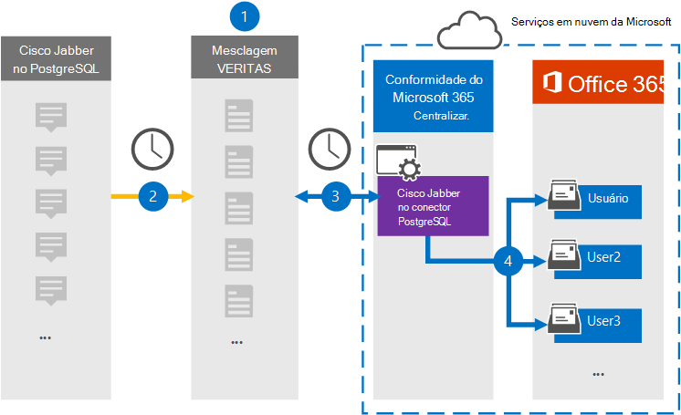

# Configurar um conector para arquivar Cisco Jabber em dados PostgreSQL (visualização)

Use um conector Veritas no centro de conformidade Microsoft 365 para importar e arquivar dados da plataforma Cisco Jabber para caixas de correio de usuário em sua Microsoft 365 organização. A Veritas fornece um Cisco Jabber no conector [PostgreSQL](https://www.veritas.com/insights/merge1/jabber) configurado para capturar itens da fonte de dados de terceiros (regularmente) e importar esses itens para Microsoft 365. O conector converte o conteúdo como mensagens, chats e conteúdo compartilhado do Cisco Jabber no PostgreSQL em um formato de mensagem de email e importa esses itens para a caixa de correio do usuário em Microsoft 365.

Depois que os dados do Cisco Jabber em PostgreSQL são armazenados em caixas de correio de usuário, você pode aplicar Microsoft 365 de conformidade, como Retenção de Litígio, Descoberta Eletrônico, políticas de retenção e rótulos de retenção. Usar um Cisco Jabber no conector PostgreSQL para importar e arquivar dados no Microsoft 365 pode ajudar sua organização a manter a conformidade com políticas governamentais e regulatórias.

## Visão geral do arquivamento do Cisco Jabber em dados PostgreSQL

A visão geral a seguir explica o processo de uso de um conector para arquivar o Cisco Jabber em dados PostgreSQL em Microsoft 365.

1. Sua organização trabalha com Cisco Jabber no PostgreSQL para configurar e configurar um Cisco Jabber no site PostgreSQL.

2. Uma vez a cada 24 horas, os itens Cisco Jabber em PostgreSQL são copiados para o site Veritas Merge1. O conector também converte Cisco Jabber em itens PostgreSQL em um formato de mensagem de email.

3. O cisco Jabber no conector PostgreSQL que você cria no centro de conformidade do Microsoft 365, se conecta ao site Veritas Merge1 todos os dias e transfere o conteúdo do Jabber para um local seguro do Azure Armazenamento na nuvem da Microsoft.

4. O conector importa os itens convertidos para as caixas de correio de usuários específicos usando o valor da propriedade *Email* do mapeamento automático do usuário, conforme descrito [na Etapa 3](#step-3-map-users-and-complete-the-connector-setup). Uma subpasta na pasta Caixa de Entrada chamada **Cisco Jabber no PostgreSQL** é criada nas caixas de correio do usuário e os itens são importados para essa pasta. O conector faz isso usando o valor da *propriedade Email.* Cada item Jabber contém essa propriedade, que é preenchida com o endereço de email de cada participante do item.

## Antes de começar

- Crie uma conta Merge1 para conectores da Microsoft. Para fazer isso, entre em contato [com o Suporte ao Cliente veritas.](https://www.veritas.com/content/support/en_US) Você precisa entrar nessa conta ao criar o conector na Etapa 1.

- O usuário que cria o Cisco Jabber no conector PostgreSQL na Etapa 1 (e o conclui na Etapa 3) deve ser atribuído à função Importação de Importação de Caixa de Correio na Exchange Online. Essa função é necessária para adicionar conectores na página **Conectores** de dados no Microsoft 365 de conformidade. Por padrão, essa função não é atribuída a nenhum grupo de funções no Exchange Online. Você pode adicionar a função Exportar Importação de Importação de Caixa de Correio ao grupo de função Gerenciamento da Organização Exchange Online. Ou você pode criar um grupo de funções, atribuir a função Exportar Importação de Caixa de Correio e adicionar os usuários apropriados como membros. Para obter mais informações, consulte as seções Criar grupos de [função](/Exchange/permissions-exo/role-groups#create-role-groups) ou [Modificar](/Exchange/permissions-exo/role-groups#modify-role-groups) grupos de função no artigo "Gerenciar grupos de funções em Exchange Online".

## Etapa 1: Configurar o Cisco Jabber no conector PostgreSQL

A primeira etapa é acessar a página **Conectores** de Dados no centro de conformidade Microsoft 365 e criar um conector para dados jabber.

1. Vá para <https://compliance.microsoft.com> e clique em **Conectores de dados** Cisco &gt; **Jabber em PostgreSQL**.

2. Na página **Descrição do produto Cisco Jabber em PostgreSQL,** clique **em Adicionar conector**.

3. Na página **Termos de serviço,** clique em **Aceitar**.

4. Insira um nome exclusivo que identifique o conector e clique em **Próximo**.

5. Entre na sua conta Merge1 para configurar o conector.

## Etapa 2: Configurar o Cisco Jabber no PostgreSQL no site Veritas Merge1

A segunda etapa é configurar o Cisco Jabber no conector PostgreSQL no site Veritas Merge1. Para obter informações sobre como configurar o Cisco Jabber no conector PostgreSQL, consulte [Merge1 Third-Party Connectors User Guide](https://docs.ms.merge1.globanetportal.com/Merge1%20Third-Party%20Connectors%20Cisco%20Jabber%20on%20PostgreSQL%20User%20Guide.pdf).

Depois de clicar em Salvar &  **Concluir**, a página de mapeamento do usuário no assistente de conector no Microsoft 365 de conformidade será exibida.

## Etapa 3: mapear usuários e concluir a configuração do conector

Para mapear usuários e concluir a instalação do conector no centro de conformidade Microsoft 365, siga estas etapas:

1. Na página **Mapear Cisco Jabber em Usuários PostgreSQL** para Microsoft 365 usuários, habilita o mapeamento automático do usuário. Os itens Cisco Jabber no PostgreSQL incluem uma propriedade chamada *Email*, que contém endereços de email para usuários em sua organização. Se o conector puder associar esse endereço a um Microsoft 365 usuário, os itens serão importados para a caixa de correio desse usuário.

2. Clique **em Avançar**, revise suas configurações e vá para a página Conectores de dados para ver o andamento do processo de importação do novo conector. 

## Etapa 4: Monitorar o Cisco Jabber no conector PostgreSQL

Depois de criar o Cisco Jabber no conector PostgreSQL, você poderá exibir o status do conector no Microsoft 365 de conformidade.

1. Vá para <https://compliance.microsoft.com/> e clique **em Conectores de dados** na nav esquerda.

2. Clique na **guia Conectores** e selecione o Cisco Jabber no conector **PostgreSQL** para exibir a página de sobrevoo, que contém as propriedades e informações sobre o conector.

3. Em **Status do conector com origem**, clique no link Baixar **log** para abrir (ou salvar) o log de status do conector. Esse log contém dados que foram importados para a nuvem da Microsoft.

## Problemas conhecidos

- Neste momento, não há suporte para importação de anexos ou itens maiores do que 10 MB, mas o suporte para itens maiores estará disponível posteriormente.
