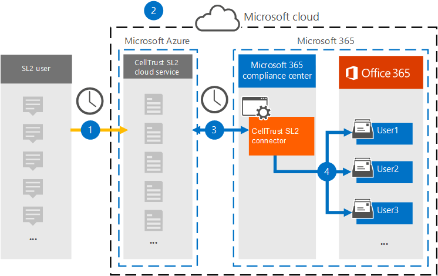
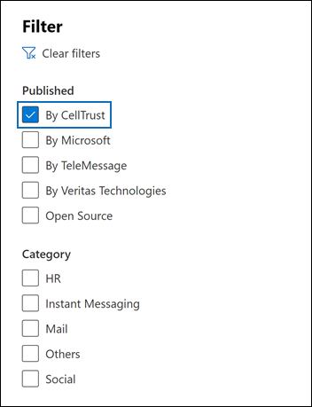
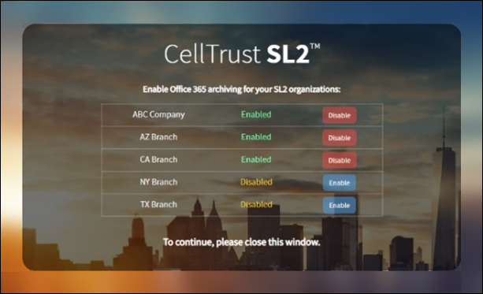

# Arquivar dados de CellTrust SL2 para Microsoft 365 (visualização)Archive data from CellTrust SL2 to Microsoft 365 (preview)

O CellTrust SL2 captura dados de comunicações móveis e se integra com as principais tecnologias de arquivamento para atender aos requisitos de descoberta eletrônica para regulamentações como FINRA, HIPAA, FOIA e TCPA.CellTrust SL2 captures mobile communications data and integrates with the leading archiving technologies to meet the electronic discovery requirements for regulations such as FINRA, HIPAA, FOIA, and TCPA. O Conector de Dados SL2 importa itens de comunicação móveis para Microsoft 365.The SL2 Data Connector imports mobile communication items to Microsoft 365. Este artigo descreve o processo de integração do SL2 com Microsoft 365 usando o Conector de Dados SL2 cellTrust para arquivamento.This article describes the process for integrating SL2 with Microsoft 365 by using the CellTrust SL2 Data Connector for archiving. Concluir esse processo supõe que você se inscreveu no serviço SL2 cellTrust e está familiarizado com a arquitetura SL2.Completing this process assumes that you have subscribed to CellTrust SL2 service and are familiar with the SL2 architecture. Para obter informações sobre SL2, consulte <www.celltrust.com>.For information about SL2, see <www.celltrust.com>.

Depois que os dados são importados para caixas de correio de usuário no Microsoft 365, você pode aplicar recursos de conformidade Microsoft 365 como Retenção de Litígio, Descoberta Eletrônico, políticas de retenção Microsoft 365 e conformidade de comunicação.After data is imported to user mailboxes in Microsoft 365, you can apply Microsoft 365 compliance features such as Litigation Hold, eDiscovery, Microsoft 365 retention policies, and communication compliance. Usar o CellTrust SL2 Data Connector para importar e arquivar dados no Microsoft 365 pode ajudar sua organização a se manter em conformidade com políticas governamentais e regulatórias.Using the CellTrust SL2 Data Connector to import and archive data in Microsoft 365 can help your organization stay compliant with government and regulatory policies.

## Visão geral do arquivamento com o Conector de Dados SL2 CellTrustOverview of archiving with the CellTrust SL2 Data Connector

A plataforma SL2 de CellTrust captura dados de comunicação de várias fontes.CellTrust's SL2 platform captures communication data from multiple sources. As fontes de dados SL2 são de pessoa para pessoa (P2P) ou Application-to-Person (A2P).SL2 data sources are either Person-to-Person (P2P) or Application-to-Person (A2P). O processo descrito neste artigo pertence apenas a fontes de dados P2P.The process described in this article pertains only to P2P data sources. Para todas as fontes de dados P2P, pelo menos uma parte na colaboração é um usuário SL2 que está inscrito no serviço SL2.For all P2P data sources, at least one party in the collaboration is an SL2 user who is subscribed to the SL2 service. A visão geral a seguir explica o processo de uso do Conector de Dados SL2 cellTrust em Microsoft 365.The following overview explains the process of using the CellTrust SL2 Data Connector in Microsoft 365.

1. Os usuários SL2 enviam e recebem dados de e para os serviços SL2 na Microsoft Azure nuvem.SL2 users send and receive data to and from SL2 services in the Microsoft Azure cloud.

2. Sua organização tem um domínio SL2 no ambiente do Serviço de Nuvem SL2 da CellTrust.Your organization has an SL2 domain in CellTrust's SL2 Cloud Service environment. Seu domínio pode ter uma ou mais unidades organizacionais (OUs).Your domain may have one or more organizational units (OUs). O Serviço de Nuvem SL2 transfere seus dados para uma área altamente segura na plataforma Microsoft Azure, para que seus dados nunca saiam do ambiente Microsoft Azure ambiente.The SL2 Cloud Service transfers your data to a highly secure area in the Microsoft Azure platform, so that your data never leaves the Microsoft Azure environment. Dependendo do seu plano SL2 (Enterprise, SMB ou Governo), seu domínio é hospedado no Microsoft Azure Global ou Microsoft Azure Government.Depending on your SL2 plan (Enterprise, SMB, or Government), your domain is either hosted on Microsoft Azure Global or Microsoft Azure Government.

3. Depois de criar o Conector de Dados do CellTrust SL2, seu domínio e as OUs (independentemente do plano SL2), comece a enviar dados para Microsoft 365.After you create the CellTrust SL2 Data Connector, your domain and OUs (regardless of your SL2 plan), begin sending data to Microsoft 365. O feed de dados é estruturado para dar suporte a relatórios com base em fontes de dados, OUs ou no domínio por si só.The data feed is structured to support reporting based on data sources, OUs, or the domain by itself. Como resultado, sua organização precisa de apenas um conector para alimentar todas as fontes de dados para Microsoft 365.As a result, your organization needs only one connector to feed all your data sources to Microsoft 365.

4. O conector cria uma pasta em cada usuário mapeado com uma licença Office 365 nomeada **CellTrust SL2**.The connector creates a folder under each mapped user with an appropriate Office 365 license titled **CellTrust SL2**. Esse mapeamento conecta um usuário do CellTrust SL2 a uma caixa de correio Office 365 usando um endereço de email.This mapping connects a CellTrust SL2 user to an Office 365 mailbox by using an email address. Se uma ID de usuário no CellTrust SL2 não tiver nenhuma Office 365, os dados do usuário não serão arquivados.If a user ID in CellTrust SL2 has no match in Office 365, the user's data will not be archived.

## Antes de configurar um conectorBefore you set up a connector

- Verifique se você tem um domínio no ambiente de serviço de nuvem CellTrust SL2.Verify that you have a domain in the CellTrust SL2 cloud service environment. Para obter informações adicionais sobre como obter um domínio SL2 de produção ou avaliação, [Contate CellTrust](https://www.celltrust.com/contact-us/#form).For additional information on obtaining a production or trial SL2 domain, [Contact CellTrust](https://www.celltrust.com/contact-us/#form).

- Obtenha as credenciais para acessar a conta de administrador do domínio SL2.Obtain the credentials to access the administrator account for your SL2 domain.

- O usuário que cria o conector de dados SL2 cellTrust na Etapa 1 (e o conclui na Etapa 3) deve ser atribuído à função De exportação de importação de caixa de correio no Exchange Online.The user who creates the CellTrust SL2 data connector in Step 1 (and completes it in Step 3) must be assigned to the Mailbox Import Export role in Exchange Online. Essa função é necessária para adicionar conectores na página **Conectores de** dados no Centro de conformidade do Microsoft 365.This role is required to add connectors on the **Data connectors** page in the Microsoft 365 compliance center. Por padrão, essa função não é atribuída a um grupo de funções no Exchange Online.By default, this role is not assigned to a role group in Exchange Online. Você pode adicionar a função Exportar Importação de Importação de Caixa de Correio ao grupo de função Gerenciamento da Organização Exchange Online.You can add the Mailbox Import Export role to the Organization Management role group in Exchange Online. Ou você pode criar um grupo de funções, atribuir a função Exportar Importação de Caixa de Correio e adicionar os usuários apropriados como membros.Or you can create a role group, assign the Mailbox Import Export role, and then add the appropriate users as members. Para obter mais informações, consulte as seções Criar grupos de [função](/Exchange/permissions-exo/role-groups#create-role-groups) ou [Modificar](/Exchange/permissions-exo/role-groups#modify-role-groups) grupos de função no artigo "Gerenciar grupos de funções em Exchange Online".For more information, see the [Create role groups](/Exchange/permissions-exo/role-groups#create-role-groups) or [Modify role groups](/Exchange/permissions-exo/role-groups#modify-role-groups) sections in the article "Manage role groups in Exchange Online".

## Etapa 1: Criar um conector SL2 CellTrustStep 1: Create a CellTrust SL2 connector

A primeira etapa é criar um conector de dados no Centro de conformidade do Microsoft 365.The first step is to create a data connector in the Microsoft 365 compliance center.

1. Vá até <https://compliance.microsoft.com> e clique **em Conectores de dados** no painel de navegação esquerdo.Go to <https://compliance.microsoft.com> and click **Data connectors** on the left navigation pane.

2. Na guia **Visão** geral, clique **em Filtrar** e selecione **Por CellTrust** e aplique o filtro.On the **Overview** tab, click **Filter** and select **By CellTrust**, and then apply the filter.

   

3. Clique **em CellTrust SL2 (visualização**).Click **CellTrust SL2 (preview**).

4. Na página **Descrição do produto CellTrust SL2 (visualização),** clique **em Adicionar conector**.On the **CellTrust SL2 (preview**) product description page, click **Add connector**.

5. Na página **Termos de serviço,** clique em **Aceitar**.On the **Terms of service** page, click **Accept**.

6. Insira um nome exclusivo que identifique o conector e clique em **Próximo**.Enter a unique name that identifies the connector and then click **Next**. O nome que você inserir identificará o conector na página **Conectores de** dados após a criação.The name you enter will identify the connector on the **Data connectors** page after you create it.

7. Na página **Entrar na sua conta CellTrust,** clique em Entrar em **CellTrust**.On the **Sign in to your CellTrust account** page, click **Sign into CellTrust**. Você será redirecionado para o **Portal CellTrust** para Microsoft 365 em uma nova janela do navegador.You'll be redirected to the **CellTrust Portal for Microsoft 365** in a new browser window.

## Etapa 2: Selecionar os domínios ou as OUs para arquivarStep 2: Select the domains or OUs to archive

A próxima etapa é entrar em uma conta de administrador para seu domínio SL2 CellTrust e selecionar os domínios e as OUs para arquivar Microsoft 365.The next step is to sign into an administrator account for your CellTrust SL2 domain and select the domains and OUs to archive in Microsoft 365.

1. Na página Conector de **Microsoft 365 CellTrust,** selecione seu ambiente no serviço de nuvem SL2 para exibir uma página de entrada.On the CellTrust **Microsoft 365 Connector** page, select your environment in the SL2 cloud service to display a sign-in page.

   Normalmente, você deve ver uma opção representando seu ambiente.Typically, you should see one option representing your environment. No entanto, se você tiver domínios em mais de um ambiente, verá opções para cada ambiente.However, if you have domains in more than one environment, you will see options for each environment. Depois de fazer uma seleção, você será redirecionado para a página de logon SL2.After you make a selection, you'll be redirected to the SL2 login page.

2. Entre com suas credenciais de conta de Administrador de Domínio ou UO.Sign in with your Domain or OU Administrator account credentials.

   Se você entrar como administrador de domínio SL2, verá o nome do seu domínio e das OUs nesse domínio.If you sign in as an SL2 domain administrator, you will see the name of your domain and the OUs in that domain. Se você não tiver OUs, você verá apenas o nome do seu domínio.If you do not have OUs, you only see the name of your domain. Se você fizer logoff como Administrador da UO, verá apenas o nome da sua UO.If you log in as OU Administrator, you only see the name of your OU.

3. Habilita as unidades de negócios que você deseja arquivar.Enable the business units you wish to archive. Selecionar o domínio não selecionará automaticamente as OUs.Selecting the domain will not automatically select the OUs. Você deve habilitar cada UO separadamente para arquivar.You must enable each OU separately to archive it.

   

4. Quando terminar suas seleções, feche a janela do navegador e retorne para a página do assistente Centro de conformidade do Microsoft 365.When you're finished with your selections, close the browser window and return to the wizard page in Microsoft 365 compliance center. Depois de alguns segundos, o assistente avança automaticamente para a próxima etapa de mapeamento de usuários.After a few seconds, the wizard automatically advances to the next step of mapping users.

## Etapa 3: mapear usuários e concluir a configuração do conectorStep 3: Map users and complete the connector setup

A última etapa é mapear usuários e concluir a instalação do conector no Centro de conformidade do Microsoft 365.The last step is to map users and complete the connector setup in the Microsoft 365 compliance center.

1. Na página **Mapeamento de** usuário, selecione **Habilitar** mapeamento automático do usuário se o endereço de email para usuários for o mesmo no SL2 e Microsoft 365.On the **User mapping** page, select **Enable automatic user mapping** if the email address for users is the same in both SL2 and  Microsoft 365. Caso contrário, você deve carregar manualmente endereços de email de usuário carregando um arquivo CSV que mapeia o endereço SL2 dos usuários para seu endereço Microsoft 365 endereço.Otherwise, you should manually user email addresses by uploading a CSV file that maps users' SL2 address to their Microsoft 365 address.

2. Clique **em Próximo,** revise suas configurações e clique em **Concluir** para criar o conector.Click **Next**, review your settings, and then click **Finish** to create the connector.

   O novo conector é adicionado à lista na página **Conectores de** dados.The new connector is added to the list on the **Data connectors** page.

## Obter ajuda de CellTrustGet help from CellTrust

Consulte a página Suporte ao Cliente [CellTrust](https://www.celltrust.com/contact-us/#support) para obter detalhes sobre como contatar a CellTrust para obter ajuda para configurar um conector de dados SL2 cellTrust.See the [CellTrust Customer Support page](https://www.celltrust.com/contact-us/#support) for details about contacting CellTrust for help with setting up a CellTrust SL2 data connector.

## Mais informaçõesMore information

- Um administrador de domínio pode configurar um conector para o domínio ou qualquer OUs nesse domínio.A domain administrator can set up a connector for the domain or any OUs in that domain. Se você usar a conta de Administrador da UO, só poderá configurar um conector para essa OU específica.If you use the OU Administrator account, you can only set up a connector for that specific OU.

- Para concluir com êxito as etapas acima, você deve ter uma licença Microsoft 365 E5 e ter os direitos de Microsoft Office administrador apropriados.To successfully complete the steps above, you must be assigned a Microsoft 365 E5 license and have the proper Microsoft Office admin rights.

- Para testar o novo conector, envie uma mensagem de texto usando seu aplicativo móvel SL2 ou do portal SL2.To test the new connector, send a text message using your SL2 mobile app or from your SL2 portal. Vá para sua Microsoft 365 de correio e abra a pasta **SL2 CellTrust** em sua Caixa de Entrada.Go to your Microsoft 365 mailbox and open the **CellTrust SL2** folder in your Inbox. Pode levar alguns minutos para as mensagens de texto aparecerem em sua caixa de correio.It may take a few minutes for the text messages to show up in your mailbox.

- Muitas leis e regulamentos exigem que a comunicação eletrônica seja preservada de forma que, quando solicitada, ela possa ser produzida como evidência.Many laws and regulations require electronic communication to be preserved in such a way that, when requested, it can be produced as evidence. A Descoberta Eletrônica (Descoberta Eletrônica) é usada para cumprir a produção de comunicação eletrônica.Electronic Discovery (eDiscovery) is used to comply with the production of electronic communication. Enterprise As soluções de Arquivamento de Informações (EIA) foram projetadas para executar a Descoberta Eletrônica e fornecer recursos como gerenciamento de política de retenção, classificação de dados e supervisão de conteúdo.Enterprise Information Archiving (EIA) solutions are designed to perform eDiscovery, and provide features such as retention policy management, data classification, and content supervision. Microsoft 365 oferece uma solução de retenção de longo prazo para conformidade com os regulamentos e padrões que afetam sua organização.Microsoft 365 offers a long-term retention solution for compliance with the regulations and standards that affect your organization.

- O termo *arquivamento* conforme usado neste documento refere-se ao arquivamento no contexto de uso em uma solução Enterprise Arquivamento de Informações (EIA).The term *archiving* as used in this document refers to archiving in the context of use within an Enterprise Information Archiving (EIA) solution. As soluções do EIA têm recursos de Descoberta Externa que produzem documentos para processos judiciais, litígios, auditorias e investigações.EIA solutions have eDiscovery features that produce documents for legal proceedings, litigation, audits, and investigations. O arquivamento no contexto de backup e restauração usado para recuperação de desastres e continuidade de negócios não é o uso pretendido do termo neste documento.Archiving in the context of backup and restore used for disaster recovery and business continuity isn't the intended use of the term within this document.
