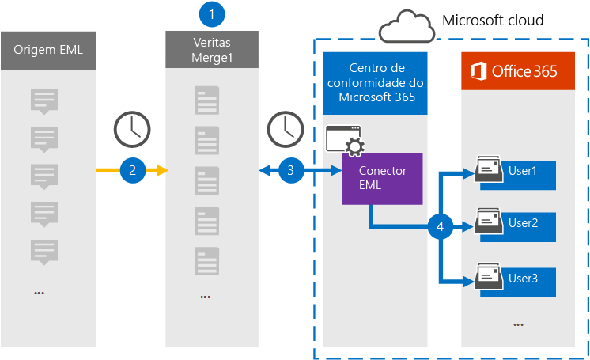

# Configurar um conector para arquivar dados emL

Use um conector Veritas no centro de conformidade Microsoft 365 para importar e arquivar dados emL para caixas de correio de usuário em sua Microsoft 365 organização. EML é a extensão de arquivo para uma mensagem de email salva em um arquivo. O conector converte o conteúdo de um item do formato de origem para um formato de mensagem de email e importa o item para uma caixa de correio de usuário.

Depois que as mensagens EML são armazenadas em caixas de correio de usuário, você pode aplicar Microsoft 365 de conformidade, como retenção de litígio, descoberta e políticas de retenção e rótulos de retenção. Usar um conector EML para importar e arquivar dados em Microsoft 365 pode ajudar sua organização a permanecer em conformidade com políticas governamentais e regulatórias.

## Visão geral dos dados emL de arquivamento

A visão geral a seguir explica o processo de uso de um conector para arquivar dados emL em Microsoft 365.

1. Sua organização trabalha com a fonte EML para configurar e configurar um site emL.

2. Uma vez a cada 24 horas, os itens de conteúdo da fonte EML são copiados para o site Veritas Merge1. Durante esse processo, o conteúdo de um arquivo EML é convertido em um formato de mensagem de email.

3. O conector EML criado no centro de conformidade do Microsoft 365, conecta-se ao site do Veritas Merge1 todos os dias e transfere as mensagens para um local seguro do Azure Armazenamento na nuvem da Microsoft.

4. O conector importa os itens de mensagem convertidos para as caixas de correio de usuários específicos usando o valor da propriedade *Email* do processo de mapeamento automático de usuário descrito na [Etapa 3](#step-3-map-users-and-complete-the-connector-setup). Durante esse processo, uma subpasta na pasta Caixa de Entrada chamada **EML** é criada nas caixas de correio do usuário e os itens EML são importados para essa pasta. O conector determina para qual caixa de correio importar itens usando o valor da *propriedade Email.* Cada mensagem contém essa propriedade, que é preenchida com o endereço de email de cada participante do item de conteúdo.

## Antes de começar

- Crie uma conta Veritas Merge1 para conectores da Microsoft. Para criar uma conta, entre em contato com [o Suporte ao Cliente veritas.](https://globanet.com/ms-connectors-contact) Você entrará nessa conta quando criar o conector na Etapa 1.

- O usuário que cria o conector EML na Etapa 1 (e o conclui na Etapa 3) deve ser atribuído à função De exportação de importação de caixa de correio no Exchange Online. Essa função é necessária para adicionar conectores na página **Conectores** de dados no Microsoft 365 de conformidade. Por padrão, essa função não é atribuída a um grupo de funções no Exchange Online. Você pode adicionar a função Exportar Importação de Importação de Caixa de Correio ao grupo de função Gerenciamento da Organização Exchange Online. Ou você pode criar um grupo de funções, atribuir a função Exportar Importação de Caixa de Correio e adicionar os usuários apropriados como membros. Para obter mais informações, consulte as seções Criar grupos de [função](/Exchange/permissions-exo/role-groups#create-role-groups) ou [Modificar](/Exchange/permissions-exo/role-groups#modify-role-groups) grupos de função no artigo "Gerenciar grupos de funções em Exchange Online".

## Etapa 1: Configurar um conector EML

A primeira etapa é acessar a página **Conectores** de Dados no centro de conformidade Microsoft 365 e criar um conector para dados emL.

1. Vá para [https://compliance.microsoft.com](https://compliance.microsoft.com/) e clique em **Conectores de dados**  >  **EML**.

2. Na página **Descrição do produto EML,** clique **em Adicionar conector**.

3. Na página **Termos de serviço,** clique em **Aceitar**.

4. Insira um nome exclusivo que identifique o conector e clique em **Próximo**.

5. Entre na sua conta Merge1 para configurar o conector.

## Etapa 2: Configurar o conector EML no site Veritas Merge1

A segunda etapa é configurar o conector EML no site Veritas Merge1. Para obter informações sobre como configurar o conector EML, consulte [Merge1 Third-Party Connectors User Guide](https://docs.ms.merge1.globanetportal.com/Merge1%20Third-Party%20Connectors%20EML%20User%20Guide%20.pdf).

Depois de clicar em Salvar &  **Concluir**, a página de mapeamento do usuário no assistente de conector no Microsoft 365 de conformidade será exibida.

## Etapa 3: mapear usuários e concluir a configuração do conector

Para mapear usuários e concluir a instalação do conector no centro de conformidade Microsoft 365, siga estas etapas:

1. Na página **Mapear usuários externos para Microsoft 365 usuários,** habilita o mapeamento automático do usuário. Os itens de origem emL incluem uma propriedade chamada *Email*, que contém endereços de email para usuários em sua organização. Se o conector puder associar esse endereço a um usuário Microsoft 365, os itens EML serão importados para a caixa de correio desse usuário.

2. Clique **em Avançar**, revise suas configurações e vá para a página Conectores de dados para ver o andamento do processo de importação do novo conector. 

## Etapa 4: Monitorar o conector EML

Depois de criar o conector EML, você poderá exibir o status do conector no Microsoft 365 de conformidade.

1. Vá para [https://compliance.microsoft.com](https://compliance.microsoft.com) e clique **em Conectores de dados** na nav esquerda.

2. Clique na **guia Conectores** e selecione o conector **EML** para exibir a página de sobrevoo. Esta página contém as propriedades e informações sobre o conector.

3. Em **Status do conector com origem**, clique no link Baixar **log** para abrir (ou salvar) o log de status do conector. Esse log contém informações sobre os dados que foram importados para a nuvem da Microsoft.

## Problemas conhecidos

- Neste momento, não há suporte para importação de anexos ou itens maiores que 10 MB. O suporte para itens maiores estará disponível posteriormente.