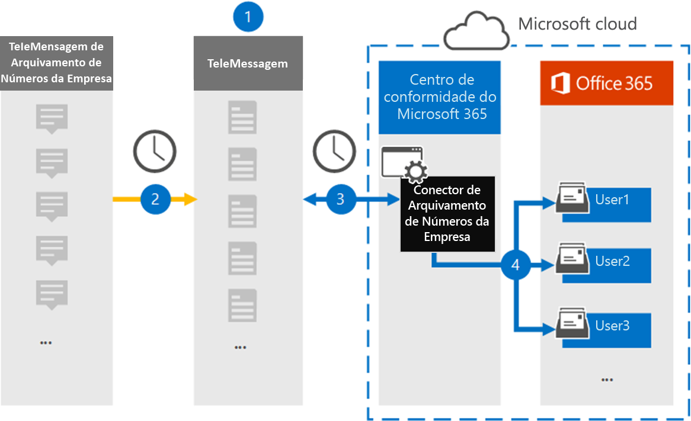

# Configurar um conector para arquivar dados de número de empresa (versão prévia)Set up a connector to archive Enterprise Number data (preview)

Use um conector de Telemensagem no centro de conformidade da Microsoft 365 para importar e arquivar mensagens de serviço de mensagens curtas (SMS) e MMS (serviço de mensagens de multimídia), mensagens de chat, gravações de chamada de voz e logs de chamada de voz do arquivador de número da empresa.Use a TeleMessage connector in the Microsoft 365 compliance center to import and archive Short Messaging Service (SMS) and Multimedia Messaging Service (MMS) messages, chat messages, voice call recordings, and voice call logs from the Enterprise Number Archiver. Depois de configurar e configurar um conector, ele se conecta à conta de Telemensagem de sua organização uma vez por dia e importa os dados de comunicação móvel de funcionários usando o arquivador de número de empresa de Telemensagem para caixas de correio no Microsoft 365.After you set up and configure a connector, it connects to your organization's TeleMessage account once every day and imports the mobile communication data of employees using the TeleMessage Enterprise Number Archiver to mailboxes in Microsoft 365.

Depois que os dados do conector do Archiver de número de empresa de Telemensagem são armazenados nas caixas de correio do usuário, você pode aplicar recursos de conformidade do Microsoft 365, como retenção de litígio, pesquisa de conteúdo, arquivamento in-loco, auditoria, conformidade de comunicação e políticas de retenção da Microsoft 365 para dados de arquivador de número corporativo.After the TeleMessage Enterprise Number Archiver connector data is stored in user mailboxes, you can apply Microsoft 365 compliance features such as Litigation Hold, Content Search, In-Place Archiving, Auditing, Communication compliance, and Microsoft 365 retention policies to Enterprise Number Archiver data. Por exemplo, você pode pesquisar o arquivador de número corporativo de WebMessage Archiver, o MMS e a chamada de voz usando a pesquisa de conteúdo ou associar a caixa de correio que contém os dados do conector Enterprise Number Archiver com um funcionário em uma ocorrência de descoberta eletrônica avançada.For example, you can search the TeleMessage Enterprise Number Archiver SMS, MMS, and Voice Call using Content Search or associate the mailbox that contains the Enterprise Number Archiver connector data with a custodian in an Advanced eDiscovery case. O uso de um conector de arquivador de número corporativo para importar e arquivar dados no Microsoft 365 pode ajudar sua organização a se manter em conformidade com as políticas governamentais e regulamentares.Using an Enterprise Number Archiver connector to import and archive data in Microsoft 365 can help your organization stay compliant with government and regulatory policies.

## Visão geral dos dados de número de empresa de arquivamentoOverview of archiving Enterprise Number data

A visão geral a seguir explica o processo de usar um conector para arquivar dados de rede corporativa no Microsoft 365.The following overview explains the process of using a connector to archive Enterprise Network data in Microsoft 365.

1. Sua organização funciona com telemessage para configurar um conector de arquivador de número corporativo.Your organization works with TeleMessage to set up an Enterprise Number Archiver connector. Para obter mais detalhes, consulte [aqui](https://www.telemessage.com/office365-activation-for-enterprise-number-archiver/).For more details refer to [here](https://www.telemessage.com/office365-activation-for-enterprise-number-archiver/).

2. O conector do arquivador de número corporativo que você cria no centro de conformidade da Microsoft 365 se conecta ao site de Telemensagem todos os dias e transfere as mensagens de email das últimas 24 horas para uma área de armazenamento do Azure segura na nuvem da Microsoft.The Enterprise Number Archiver connector that you create in the Microsoft 365 compliance center connects to the TeleMessage site every day and transfers the email messages from the previous 24 hours to a secure Azure Storage area in the Microsoft Cloud.

3. O conector importa os itens de comunicação móvel para a caixa de correio de um usuário específico.The connector imports the mobile communication items to the mailbox of a specific user. Uma nova pasta chamada Enterprise Number Archiver será criada na caixa de correio do usuário específico e os itens serão importados para ela.A new folder named Enterprise Number Archiver will be created in the specific user's mailbox and the items will be imported to it. O conector faz o mapeamento usando o valor da propriedade de *endereço de email do usuário* .The connector does mapping by using the value of the *User’s Email address* property. Cada mensagem de email contém essa propriedade, que é preenchida com o endereço de email de cada participante da mensagem de email.Every email message contains this property, which is populated with the email address of every participant of the email message. Além do mapeamento automático de usuários usando o valor da propriedade de *endereço de email do usuário* , você também pode definir um mapeamento personalizado carregando um arquivo de mapeamento CSV.In addition to automatic user mapping using the value of the *User’s Email address* property, you can also define a custom mapping by uploading a CSV mapping file. Esse arquivo de mapeamento deve conter o número de celular do usuário e o endereço de caixa de correio do Microsoft 365 correspondente para cada usuário.This mapping file should contain User’s mobile Number and the corresponding Microsoft 365 mailbox address for each user. Se você habilitar o mapeamento automático de usuários e fornecer um mapeamento personalizado, para cada item de email, o conector examinará primeiro o arquivo de mapeamento personalizado.If you enable automatic user mapping and provide a custom mapping, for every email item the connector will first look at custom mapping file. Se não encontrar um usuário válido do Microsoft 365 que corresponda ao número de celular de um usuário, o conector usará a propriedade de endereço de email do usuário do item de email.If it doesn't find a valid Microsoft 365 user that corresponds to a user's mobile number, the connector will use the User ‘s email address property of the email item. Se o conector não localizar um usuário válido do Microsoft 365 no arquivo de mapeamento personalizado ou na propriedade de *endereço de email do usuário* do item de email, o item não será importado.If the connector doesn't find a valid Microsoft 365 user in either the custom mapping file or the *user’s email address* property of the email item, the item won't be imported.

## Antes de começarBefore you begin

Algumas das etapas de implementação necessárias para arquivar dados de arquivador de número corporativo são externas para o Microsoft 365 e devem ser concluídas para que você possa criar o conector no centro de conformidade.Some of the implementation steps required to archive Enterprise Number Archiver data are external to Microsoft 365 and must be completed before you can create the connector in the compliance center.

- Solicite o [serviço arquivador de número corporativo de telemessage](https://www.telemessage.com/mobile-archiver/order-mobile-archiver-for-o365) e obtenha uma conta de administração válida para sua organização.Order the [Enterprise Number Archiver service from TeleMessage](https://www.telemessage.com/mobile-archiver/order-mobile-archiver-for-o365) and get a valid administration account for your organization. Você precisará entrar nessa conta quando criar o conector no centro de conformidade.You'll need to sign into this account when you create the connector in the compliance center.

- Registre todos os usuários que exigem o número corporativo de arquivamento de rede SMS/MMS na conta de Telemensagem.Register all users that require Enterprise Number SMS/MMS Network archiving in the TeleMessage account. Ao registrar usuários, certifique-se de usar o mesmo endereço de email usado para a conta do Microsoft 365.When registering users, be sure to use the same email address that's used for their Microsoft 365 account.

- Instale e ative o aplicativo arquivador de número de empresa de Telemensagem nos telefones celulares de seus funcionários.Install and activate the TeleMessage Enterprise Number Archiver app on the mobile phones of your employees.

- Sua organização deve dar o consentimento para permitir que o serviço de importação do Office 365 acesse dados de caixa de correio em sua organização.Your organization must consent to allow the Office 365 Import service to access mailbox data in your organization. Você precisará fornecer esse consentimento ao criar o conector.You will need to provide this consent when you create the connector. Para concordar com essa solicitação, [acesse a página](https://login.microsoftonline.com/common/oauth2/authorize?client_id=570d0bec-d001-4c4e-985e-3ab17fdc3073&response_type=code&redirect_uri=https://portal.azure.com/&nonce=1234&prompt=admin_consent), entre com as credenciais do Microsoft 365 global admin e aceite a solicitação.To consent to this request, go to [this page](https://login.microsoftonline.com/common/oauth2/authorize?client_id=570d0bec-d001-4c4e-985e-3ab17fdc3073&response_type=code&redirect_uri=https://portal.azure.com/&nonce=1234&prompt=admin_consent), sign in with the credentials of Microsoft 365 global admin, and then accept the request. Você precisa concluir esta etapa para poder criar um conector de rede Bell com êxito.You have to complete this step before you can successfully create a Bell Network connector.

- O usuário que cria um conector de arquivador de número corporativo deve ser atribuído à função de exportação de importação de caixa de correio no Exchange Online.The user who creates a Enterprise Number Archiver connector must be assigned the Mailbox Import Export role in Exchange Online. Isso é necessário para adicionar conectores na página **conectores de dados** no centro de conformidade do Microsoft 365.This is required to add connectors in the **Data connectors** page in the Microsoft 365 compliance center. Por padrão, essa função não é atribuída a nenhum grupo de funções no Exchange Online.By default, this role isn't assigned to any role group in Exchange Online. Você pode adicionar a função de exportação de importação de caixa de correio ao grupo de funções Gerenciamento da organização no Exchange Online.You can add the Mailbox Import Export role to the Organization Management role group in Exchange Online. Ou você pode criar um grupo de função, atribua a função de exportação de importação de caixa de correio e, em seguida, adicione os usuários apropriados como membros.Or you can create a role group, assign the Mailbox Import Export role, and then add the appropriate users as members. Para obter mais informações, consulte as seções [criar grupos de função](https://docs.microsoft.com/Exchange/permissions-exo/role-groups#create-role-groups) ou [modificar grupos de função](https://docs.microsoft.com/Exchange/permissions-exo/role-groups#modify-role-groups) no artigo "gerenciar grupos de função no Exchange Online".For more information, see the [Create role groups](https://docs.microsoft.com/Exchange/permissions-exo/role-groups#create-role-groups) or [Modify role groups](https://docs.microsoft.com/Exchange/permissions-exo/role-groups#modify-role-groups) sections in the article "Manage role groups in Exchange Online".

## Criar um conector de arquivador de número corporativoCreate an Enterprise Number Archiver connector

Depois de concluir os pré-requisitos descritos na seção anterior, você pode criar um conector de arquivador de número corporativo no centro de conformidade da Microsoft 365.After you've completed the prerequisites described in the previous section, you can create an Enterprise Number Archiver connector in the Microsoft 365 compliance center. O conector usa as informações que você fornece para se conectar ao site de Telemensagem e transferir mensagens de chamada SMS, MMS e de voz para as caixas de correio de usuário correspondentes no Microsoft 365.The connector uses the information you provide to connect to the TeleMessage site and transfer SMS, MMS, and voice call messages to the corresponding user mailbox boxes in Microsoft 365.

1. Vá para [https://compliance.microsoft.com](https://compliance.microsoft.com/) e clique em **Data Connectors** \> **Enterprise Number Archiver**.Go to [https://compliance.microsoft.com](https://compliance.microsoft.com/) and then click **Data connectors** \> **Enterprise Number Archiver**.

2. Na página descrição do produto **arquivador de número corporativo** , clique em **Adicionar conector**On the **Enterprise Number Archiver** product description page, click **Add connector**

3. Na página **termos de serviço** , clique em **aceitar**.On the **Terms of service** page, click **Accept**.

4. Na página **logon na Telemensagem** , em etapa 3, insira as informações necessárias nas caixas a seguir e clique em **Avançar**.On the **Login to TeleMessage** page, under Step 3, enter the required information in the following boxes and then click **Next**.

   - **Nome de usuário:** O nome de usuário de sua mensagem.**Username:** Your TeleMessage username.

   - **Senha:** Sua senha de Telemensagem.**Password:** Your TeleMessage password.

5. Depois que o conector é criado, você pode fechar a janela pop-up e ir para a próxima página.After the connector is created, you can close the pop-up window and go to the next page.

6. Na página **mapeamento de usuário** , habilite o mapeamento de usuário automático.On the **User mapping** page, enable automatic user mapping. Para habilitar o mapeamento personalizado, carregue um arquivo CSV que contenha as informações de mapeamento do usuário e clique em **Avançar**.To enable custom mapping, upload a CSV file that contains the user mapping information, and then click **Next**.

7. Forneça o consentimento do administrador e clique em **Avançar**.Provide admin consent and then click **Next**.

   Para fornecer o consentimento do administrador, você deve estar conectado com as credenciais de um administrador global do Office 365 e aceitar a solicitação de consentimento.To provide admin consent, you must be signed in with the credentials of an Office 365 global admin, and then accept the consent request. Se você não estiver conectado como um administrador global, poderá ir para [esta página](https://login.microsoftonline.com/common/oauth2/authorize?client_id=570d0bec-d001-4c4e-985e-3ab17fdc3073&response_type=code&redirect_uri=https://portal.azure.com/&nonce=1234&prompt=admin_consent) e entrar usando as credenciais de administrador global para aceitar a solicitação.If you aren't signed in as a global admin, you can go to [this page](https://login.microsoftonline.com/common/oauth2/authorize?client_id=570d0bec-d001-4c4e-985e-3ab17fdc3073&response_type=code&redirect_uri=https://portal.azure.com/&nonce=1234&prompt=admin_consent) and sign in using global admin credentials to accept the request.

8. Revise suas configurações e clique em **concluir** para criar o conector.Review your settings, and then click **Finish** to create the connector.

9. Vá até a guia conectores na página **conectores de dados** para ver o andamento do processo de importação para o novo conector.Go to the Connectors tab in **Data connectors** page to see the progress of the import process for the new connector.

## Problemas conhecidosKnown issues

- No momento, não há suporte para a importação de anexos com mais de 10 MB, mas o suporte a itens maiores estará disponível em uma data posterior.At this time, we don't support importing attachments larger than 10 MB but support for larger items will be available at a later date.
