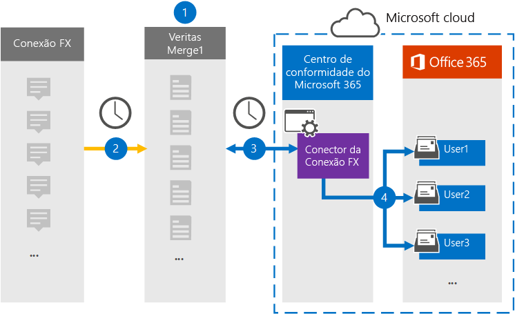

# Configurar um conector para arquivar dados Conexão FXSet up a connector to archive FX Connect data

Use um conector Veritas no centro de conformidade Microsoft 365 para importar e arquivar dados da plataforma de colaboração FX Conexão caixas de correio de usuário em sua organização Microsoft 365.Use a Veritas connector in the Microsoft 365 compliance center to import and archive data from the FX Connect collaboration platform to user mailboxes in your Microsoft 365 organization. A Veritas fornece um conector de Conexão [FX](https://globanet.com/fx-connect/) configurado para capturar itens FX Conexão e importar esses itens para Microsoft 365.Veritas provides an [FX Connect](https://globanet.com/fx-connect/) connector that is configured to capture FX Connect items and import those items to Microsoft 365. O conector converte o conteúdo do FX Conexão, como trocas, mensagens e outros detalhes da conta de Conexão FX da sua organização, para um formato de mensagem de email e importa esses itens para a caixa de correio do usuário no Microsoft 365.The connector converts the content from FX Connect, such as  trades, messages, and other details from your organization's FX Connect account, to an email message format and then imports those items to the user's mailbox in Microsoft 365.

Depois que os dados de Conexão FX são armazenados em caixas de correio de usuário, você pode aplicar Microsoft 365 recursos de conformidade, como Retenção de Litígio, Descoberta Eletrônico, políticas de retenção e rótulos de retenção e conformidade de comunicação.After FX Connect data is stored in user mailboxes, you can apply Microsoft 365 compliance features such as Litigation Hold, eDiscovery, retention policies and retention labels, and communication compliance. Usar um conector de Conexão FX para importar e arquivar dados no Microsoft 365 pode ajudar sua organização a manter a conformidade com políticas governamentais e regulatórias.Using an FX Connect connector to import and archive data in Microsoft 365 can help your organization stay compliant with government and regulatory policies.

## Visão geral do arquivamento FX Conexão dadosOverview of archiving FX Connect data

A visão geral a seguir explica o processo de uso de um conector para arquivar as informações Conexão FX no Microsoft 365.The following overview explains the process of using a connector to archive the FX Connect information in Microsoft 365.

1. Sua organização trabalha com Conexão FX para configurar e configurar um site de Conexão FX.Your organization works with FX Connect to set up and configure an FX Connect site.

2. Uma vez a cada 24 horas, os itens de contas Conexão FX são copiados para o site Veritas Merge1.Once every 24 hours, items from FX Connect accounts are copied to the Veritas Merge1 site. O conector também converte os itens FX Conexão em um formato de mensagem de email.The connector also converts the FX Connect items to an email message format.

3. O conector de Conexão FX que você cria no centro de conformidade do Microsoft 365, conecta-se ao site da Veritas Merge1 todos os dias e transfere os itens de Conexão FX para um local seguro do Azure Armazenamento na nuvem da Microsoft.The FX Connect connector that you create in the Microsoft 365 compliance center, connects to the Veritas Merge1 site every day and transfers the FX Connect items to a secure Azure Storage location in the Microsoft cloud.

4. O conector importa itens para as caixas de correio de usuários específicos usando o valor da propriedade *Email* do mapeamento automático do usuário, conforme descrito [na Etapa 3](#step-3-map-users-and-complete-the-connector-setup).The connector imports items to the mailboxes of specific users by using the value of the *Email* property of the automatic user mapping as described in [Step 3](#step-3-map-users-and-complete-the-connector-setup). Uma subpasta na pasta Caixa de Entrada chamada **FX Conexão** é criada nas caixas de correio do usuário e os itens são importados para essa pasta.A subfolder in the Inbox folder named **FX Connect** is created in the user mailboxes, and the items are imported to that folder. O conector faz isso usando o valor da *propriedade Email.*The connector does this by using the value of the *Email* property. Cada item de Conexão FX contém essa propriedade, que é preenchida com o endereço de email de cada participante do item.Every FX Connect item contains this property, which is populated with the email address of every participant of the item.

## Antes de começarBefore you begin

- Crie uma conta Veritas Merge1 para conectores da Microsoft.Create a Veritas Merge1 account for Microsoft connectors.  Para criar uma conta, entre em contato com [o Suporte ao Cliente veritas.](https://globanet.com/ms-connectors-contact)To create an account, contact [Veritas Customer Support](https://globanet.com/ms-connectors-contact). Você entrará nessa conta quando criar o conector na Etapa 1.You will sign into this account when you create the connector in Step 1.

- O usuário que cria o conector de Conexão FX na Etapa 1 (e o conclui na Etapa 3) deve ser atribuído à função De importação de importação de caixa de correio na Exchange Online.The user who creates the FX Connect connector in Step 1 (and completes it in Step 3) must be assigned to the Mailbox Import Export role in Exchange Online. Essa função é necessária para adicionar conectores na página **Conectores** de dados no Microsoft 365 de conformidade.This role is required to add connectors on the **Data connectors** page in the Microsoft 365 compliance center. Por padrão, essa função não é atribuída a um grupo de funções no Exchange Online.By default, this role is not assigned to a role group in Exchange Online. Você pode adicionar a função Exportar Importação de Importação de Caixa de Correio ao grupo de função Gerenciamento da Organização Exchange Online.You can add the Mailbox Import Export role to the Organization Management role group in Exchange Online. Ou você pode criar um grupo de funções, atribuir a função Exportar Importação de Caixa de Correio e adicionar os usuários apropriados como membros.Or you can create a role group, assign the Mailbox Import Export role, and then add the appropriate users as members. Para obter mais informações, consulte as seções Criar grupos de [função](/Exchange/permissions-exo/role-groups#create-role-groups) ou [Modificar](/Exchange/permissions-exo/role-groups#modify-role-groups) grupos de função no artigo "Gerenciar grupos de funções em Exchange Online".For more information, see the [Create role groups](/Exchange/permissions-exo/role-groups#create-role-groups) or [Modify role groups](/Exchange/permissions-exo/role-groups#modify-role-groups) sections in the article "Manage role groups in Exchange Online".

## Etapa 1: Configurar o conector de Conexão FXStep 1: Set up the FX Connect connector

A primeira etapa é acessar a página **Conectores** de Dados no centro de conformidade Microsoft 365 e criar um conector para dados Conexão FX.The first step is to access to the **Data Connectors** page in the Microsoft 365 compliance center and create a connector for FX Connect data.

1. Vá para [https://compliance.microsoft.com](https://compliance.microsoft.com/) e clique em **Conectores de dados**  >  **FX Conexão**.Go to [https://compliance.microsoft.com](https://compliance.microsoft.com/) and then click **Data connectors** > **FX Connect**.

2. Na página **FX Conexão** descrição do produto, clique **em Adicionar conector**.On the **FX Connect** product description page, click **Add connector**.

3. Na página **Termos de serviço,** clique em **Aceitar**.On the **Terms of service** page, click **Accept**.

4. Insira um nome exclusivo que identifique o conector e clique em **Próximo**.Enter a unique name that identifies the connector, and then click **Next**.

5. Entre na sua conta Merge1 para configurar o conector.Sign in to your Merge1 account to configure the connector.

## Etapa 2: Configurar o conector de Conexão FX no site Veritas Merge1Step 2: Configure the FX Connect connector on the Veritas Merge1 site

A segunda etapa é configurar o conector de Conexão FX no site Merge1.The second step is to configure the FX Connect connector on the Merge1 site. Para obter informações sobre como configurar o conector de Conexão FX, consulte [Merge1 Third-Party Connectors User Guide](https://docs.ms.merge1.globanetportal.com/Merge1%20Third-Party%20Connectors%20FX%20Connect%20User%20Guide%20.pdf).For information about how to configure the FX Connect connector, see [Merge1 Third-Party Connectors User Guide](https://docs.ms.merge1.globanetportal.com/Merge1%20Third-Party%20Connectors%20FX%20Connect%20User%20Guide%20.pdf).

Depois de clicar em Salvar &  **Concluir**, a página de mapeamento do usuário no assistente de conector no Microsoft 365 de conformidade será exibida.After you click **Save & Finish**, the **User mapping** page in the connector wizard in the Microsoft 365 compliance center is displayed.

## Etapa 3: mapear usuários e concluir a configuração do conectorStep 3: Map users and complete the connector setup

Para mapear usuários e concluir a instalação do conector no centro de conformidade Microsoft 365, siga estas etapas:To map users and complete the connector setup in the Microsoft 365 compliance center, follow these steps:

1. Na página **Mapear FX Conexão usuários para Microsoft 365** usuários, habilita o mapeamento automático do usuário.On the **Map FX Connect users to Microsoft 365 users** page, enable automatic user mapping. Os itens de Conexão FX incluem uma propriedade chamada *Email*, que contém endereços de email para usuários em sua organização.The FX Connect items include a property called *Email*, which contains email addresses for users in your organization. Se o conector puder associar esse endereço a um Microsoft 365 usuário, os itens serão importados para a caixa de correio desse usuário.If the connector can associate this address with a Microsoft 365 user, the items are imported to that user’s mailbox.

2. Clique **em Avançar**, revise suas configurações e vá para a página Conectores de dados para ver o andamento do processo de importação do novo conector. Click **Next**, review your settings, and then go to the **Data connectors** page to see the progress of the import process for the new connector.

## Etapa 4: Monitorar o conector de Conexão FXStep 4: Monitor the FX Connect connector

Depois de criar o conector de Conexão FX, você poderá exibir o status do conector no Microsoft 365 de conformidade.After you create the FX Connect connector, you can view the connector status in the Microsoft 365 compliance center.

1. Vá para <https://compliance.microsoft.com/> e clique **em Conectores de dados** na nav esquerda.Go to <https://compliance.microsoft.com/> and click **Data connectors** in the left nav.

2. Clique na **guia Conectores** e selecione o **conector de Conexão FX** para exibir a página de sobrevoo.Click the **Connectors** tab and then select the **FX Connect** connector to display the flyout page. Esta página contém as propriedades e informações sobre o conector.This page contains the properties and information about the connector.

3. Em **Status do conector com origem**, clique no link Baixar **log** para abrir (ou salvar) o log de status do conector.Under **Connector status with source**, click the **Download log** link to open (or save) the status log for the connector. Esse log contém dados que foram importados para a nuvem da Microsoft.This log contains data that has been imported to the Microsoft cloud.

## Problemas conhecidosKnown issues

- Neste momento, não há suporte para importação de anexos ou itens maiores que 10 MB.At this time, we don't support importing attachments or items that are larger than 10 MB. O suporte para itens maiores estará disponível posteriormente.Support for larger items will be available at a later date.