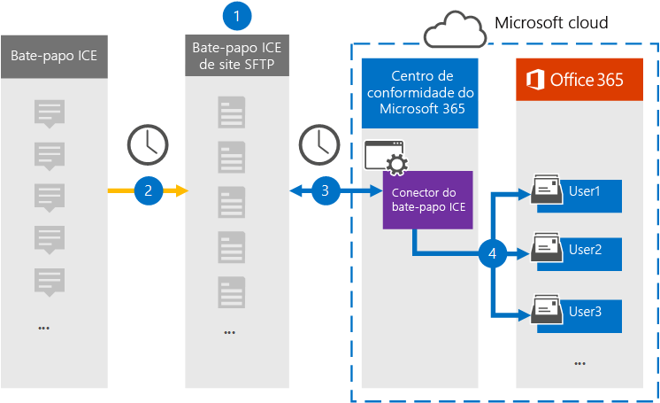

# Configurar um conector para arquivar dados de chat ICESet up a connector to archive ICE Chat data

Use um conector nativo no centro de conformidade do Microsoft 365 para importar e arquivar dados de chat de serviços financeiros da ferramenta de colaboração do ICE Chat.Use a native connector in the Microsoft 365 compliance center to import and archive financial services chat data from the ICE Chat collaboration tool. Depois de configurar um conector, ele se conecta ao site de segurança FTP (SFTP) de Chat ICE da sua organização uma vez por dia, converte o conteúdo das mensagens de chat em um formato de mensagem de email e, em seguida, importa esses itens para caixas de correio no Microsoft 365.After you set up and configure a connector, it connects to your organization's ICE Chat secure FTP (SFTP) site once every day, converts the content of chat messages to an email message format, and then import those items to mailboxes in Microsoft 365.

Depois que os dados de chat ICE são armazenados em caixas de correio do usuário, você pode aplicar recursos de conformidade do Microsoft 365, como retenção de litígio, Descoberta e Arquivamento, auditoria, conformidade de comunicação e políticas de retenção do Microsoft 365 aos dados do ICE Chat.After ICE chat data is stored in user mailboxes, you can apply Microsoft 365 compliance features such as litigation hold, eDiscovery, archiving, auditing, communication compliance, and Microsoft 365 retention policies to ICE Chat data. Por exemplo, você pode pesquisar mensagens de Chat ICE usando a pesquisa de conteúdo ou associar a caixa de correio que contém os dados de Chat ICE com um custodiante em um caso de Descoberta Eletrônico Avançada.For example, you can search ICE Chat messages using content search or associate the mailbox that contains the ICE Chat data with a custodian in an Advanced eDiscovery case. Usar um conector de Chat ICE para importar e arquivar dados no Microsoft 365 pode ajudar sua organização a manter a conformidade com políticas governamentais e regulatórias.Using an ICE Chat connector to import and archive data in Microsoft 365 can help your organization stay compliant with government and regulatory policies.

## Visão geral de arquivamento de dados de chat ICEOverview of archiving ICE Chat data

A visão geral a seguir explica o processo de uso de um conector para arquivar dados de chat ICE no Microsoft 365.The following overview explains the process of using a connector to archive ICE chat data in Microsoft 365.

1. Sua organização trabalha com o ICE Chat para configurar um site do ICE Chat SFTP.Your organization works with ICE Chat to set up an ICE Chat SFTP site. Você também trabalhará com o ICE Chat para configurar o ICE Chat para copiar mensagens de chat para seu site do ICE Chat SFTP.You'll also work with ICE Chat to configure ICE Chat to copy chat messages to your ICE Chat SFTP site.

2. Uma vez a cada 24 horas, as mensagens de chat do ICE Chat são copiadas para o seu site do ICE Chat SFTP.Once every 24 hours, chat messages from ICE Chat are copied to your ICE Chat SFTP site.

3. O conector de Chat ICE que você cria no centro de conformidade do Microsoft 365 conecta-se ao site SFTP do ICE Chat todos os dias e transfere as mensagens de chat das 24 horas anteriores para um local seguro de Armazenamento do Azure no Microsoft Cloud.The ICE Chat connector that you create in the Microsoft 365 compliance center connects to the ICE Chat SFTP site every day and transfers the chat messages from the previous 24 hours to a secure Azure Storage location in the Microsoft Cloud. O conector também converte o conteúdo de um chat em um formato de mensagem de email.The connector also converts the content of a chat massage to an email message format.

4. O conector importa itens de mensagem de chat para as caixas de correio de usuários específicos.The connector imports chat message items to the mailboxes of specific users. Uma nova pasta chamada **ICE Chat** é criada nas caixas de correio do usuário e os itens de mensagem de chat são importados para essa pasta.A new folder named **ICE Chat** is created in the user mailboxes and the chat message items are imported to that folder. O conector usa o valor das propriedades *SenderEmail* e *RecipientEmail.*The connector does by using the value of the *SenderEmail* and *RecipientEmail* properties. Cada mensagem de chat contém essas propriedades, que são preenchidas com o endereço de email do remetente e cada destinatário/participante da mensagem de chat.Every chat message contains these properties, which are populated with email address of the sender and every recipient/participant of the chat message.

   Além do mapeamento automático de usuário que usa os valores das propriedades *SenderEmail* e *RecipientEmail* (o que significa que o conector importa uma mensagem de chat para a caixa de correio do remetente e as caixas de correio de cada destinatário), você também pode definir o mapeamento de usuário personalizado carregando um arquivo de mapeamento CSV.In addition to automatic user mapping that uses the values of the *SenderEmail* and *RecipientEmail* property (which means that the connector imports a chat message to the sender's mailbox and the mailboxes of every recipient), you can also define custom user mapping by uploading a CSV mapping file. Esse arquivo de mapeamento contém a *ImId* do Chat ICE e o endereço de caixa de correio correspondente do Microsoft 365 para cada usuário em sua organização.This mapping file contains the ICE Chat *ImId* and the corresponding Microsoft 365 mailbox address for every user in your organization. Se você habilitar o mapeamento automático de usuário e fornecer um arquivo de mapeamento personalizado, para cada item de chat, o conector primeiro olhará para o arquivo de mapeamento personalizado.If you enable automatic user mapping and provide a custom-mapping file, for every chat item the connector will first look at the custom-mapping file. Se não encontrar uma conta de usuário válida do Microsoft 365 que corresponda à ImId de chat ICE de um usuário, o conector usará as propriedades *SenderEmail* e *RecipientEmail* do item de chat para importar o item para as caixas de correio dos participantes do chat.If it doesn't find a valid Microsoft 365 user account that corresponds to a user's ICE Chat ImId, the connector will use the *SenderEmail* and *RecipientEmail* properties of the chat item to import the item to the mailboxes of the chat participants. Se o conector não encontrar um usuário válido do Microsoft 365 no arquivo de mapeamento personalizado ou nas propriedades *SenderEmail* e *RecipientEmail,* o item não será importado.If the connector doesn't find a valid Microsoft 365 user in either the custom-mapping file or the *SenderEmail* and *RecipientEmail* properties, the item won't be imported.

## Antes de começarBefore you begin

Algumas das etapas de implementação necessárias para arquivar dados de Chat ICE são externas ao Microsoft 365 e devem ser concluídas antes que você possa criar o conector no centro de conformidade.Some of the implementation steps required to archive ICE Chat data are external to Microsoft 365 and must be completed before you can create the connector in the compliance center.

- O Chat ICE cobra aos clientes uma taxa de conformidade externa.ICE Chat charges their customers a fee for external compliance. Sua organização deve entrar em contato com o grupo de vendas do ICE Chat para discutir e assinar o contrato de serviços de dados de chat ICE, que você pode obter em [https://www.theice.com/publicdocs/agreements/ICE\_Data\_Services\_Agreement.pdf](https://www.theice.com/publicdocs/agreements/ICE\_Data\_Services\_Agreement.pdf) .Your organization should contact the ICE Chat sales group to discuss, and to sign the ICE Chat data services agreement, which you can obtain at [https://www.theice.com/publicdocs/agreements/ICE\_Data\_Services\_Agreement.pdf](https://www.theice.com/publicdocs/agreements/ICE\_Data\_Services\_Agreement.pdf). Este contrato é entre o ICE Chat e sua organização e não envolve a Microsoft.This agreement is between ICE Chat and your organization and does not involve Microsoft. Depois de configurar um site do ICE Chat SFTP na Etapa 2, o ICE Chat fornece as credenciais de FTP diretamente para sua organização.After you set up an ICE Chat SFTP site in Step 2, ICE Chat provides the FTP credentials directly to your organization. Em seguida, você que forneceria essas credenciais à Microsoft ao configurar o conector na Etapa 3.Then you who would provide those credentials to Microsoft when setting up the connector in Step 3.

- Você deve configurar um site SFTP de Chat ICE antes de criar o conector na Etapa 3.You must set up an ICE Chat SFTP site before creating the connector in Step 3. Depois de trabalhar com o ICE Chat para configurar o site SFTP, os dados do ICE Chat são carregados no site SFTP todos os dias.After working with ICE Chat to set up the SFTP site, data from ICE Chat is uploaded to the SFTP site every day. O conector criado na Etapa 3 conecta-se a esse site SFTP e transfere os dados de chat para as caixas de correio do Microsoft 365.The connector you create in Step 3 connects to this SFTP site and transfers the chat data to Microsoft 365 mailboxes. A SFTP também criptografa os dados de Chat ICE que são enviados para caixas de correio durante o processo de transferência.SFTP also encrypts the ICE Chat data that's sent to mailboxes during the transfer process.

- O conector de Chat ICE pode importar um total de 200.000 itens em um único dia.The ICE Chat connector can import a total of 200,000 items in a single day. Se houver mais de 200.000 itens no site SFTP, nenhum desses itens será importado para o Microsoft 365.If there are more than 200,000 items on the SFTP site, none of those items will be imported to Microsoft 365.

- O administrador que cria o conector de Chat ICE na Etapa 3 (e que baixa as chaves públicas e o endereço IP na Etapa 1) deve receber a função Importar Exportar Caixa de Correio no Exchange Online.The admin who creates the ICE Chat connector in Step 3 (and who downloads the public keys and IP address in Step 1) must be assigned the Mailbox Import Export role in Exchange Online. Essa função é necessária para adicionar conectores na página Conectores **de dados** no centro de conformidade do Microsoft 365.This role is required to add connectors on the **Data connectors** page in the Microsoft 365 compliance center. Por padrão, essa função não é atribuída a nenhum grupo de funções no Exchange Online.By default, this role isn't assigned to any role group in Exchange Online. Você pode adicionar a função Importar Exportar Caixa de Correio ao grupo de função Gerenciamento da Organização no Exchange Online.You can add the Mailbox Import Export role to the Organization Management role group in Exchange Online. Ou você pode criar um grupo de funções, atribuir a função Importar Exportar Caixa de Correio e adicionar os usuários apropriados como membros.Or you can create a role group, assign the Mailbox Import Export role, and then add the appropriate users as members. Para obter mais informações, consulte  as [seções](https://docs.microsoft.com/Exchange/permissions-exo/role-groups#create-role-groups) Criar grupos de função ou Modificar grupos de função no artigo "Gerenciar grupos de função no Exchange Online".For more information, see the [Create role groups](https://docs.microsoft.com/Exchange/permissions-exo/role-groups#create-role-groups) or [Modify role groups](https://docs.microsoft.com/Exchange/permissions-exo/role-groups#modify-role-groups) sections in the article "Manage role groups in Exchange Online".

## Etapa 1: Obter chaves públicas SSH e PGPStep 1: Obtain SSH and PGP public keys

A primeira etapa é obter uma cópia das chaves públicas para o Shell Seguro (SSH) e o PGP (Privacidade Bastante Boa).The first step is to obtain a copy of the public keys for Secure Shell (SSH) and Pretty Good Privacy (PGP). Use essas chaves na Etapa 2 para configurar o site SFTP de Chat ICE para permitir que o conector (criado na Etapa 3) se conecte ao site SFTP e transfira os dados do Chat ICE para as caixas de correio do Microsoft 365.You use these keys in Step 2 to configure the ICE Chat SFTP site to allow the connector (that you create in Step 3) to connect to the SFTP site and transfer the ICE Chat data to Microsoft 365 mailboxes. Você também obterá um endereço IP nesta etapa, que você usará ao configurar o site SFTP de Chat ICE.You will also obtain an IP address in this step, which you use when configuring the ICE Chat SFTP site.

1. Vá para [https://compliance.microsoft.com](https://compliance.microsoft.com) e clique **em Conectores de dados** na barra de entrada esquerda.Go to [https://compliance.microsoft.com](https://compliance.microsoft.com) and click **Data connectors** in the left nav.

2. Na página **Conectores de dados** em **Chat ICE,** clique em **Exibir**.On the **Data connectors** page under **ICE Chat**, click **View**.

3. Na página **chat ICE,** clique **em Adicionar conector**.On the **ICE Chat** page, click **Add connector**.

4. Na página **Termos de serviço,** clique em **Aceitar**.On the **Terms of service** page, click **Accept**.

5. Na página Adicionar credenciais para o **site do ICE Chat SFTP** na etapa 1, clique na chave SSH de **Download,** na chave **PGP** e baixe os links de endereço **IP** para salvar uma cópia de cada arquivo no computador local.On the **Add credentials for ICE Chat SFTP site** page under step 1, click the **Download SSH key**, **Download PGP key**, and **Download IP address** links to save a copy of each file to your local computer. Esses arquivos contêm os seguintes itens que são usados para configurar o site do ICE Chat SFTP na Etapa 2:These files contain the following items that are used to configure the ICE Chat SFTP site in Step 2:

   - Chave pública SSH: essa chave é usada para configurar o SSH Seguro para habilitar um logon remoto seguro quando o conector se conecta ao site SFTP de Chat ICE.SSH public key: This key is used to configure Secure SSH to enable a secure remote login when the connector connects to the ICE Chat SFTP site.

   - Chave pública PGP: essa chave é usada para configurar a criptografia de dados transferidos do site SFTP de Chat ICE para o Microsoft 365.PGP public key: This key is used to configure the encryption of data that's transferred from the ICE Chat SFTP site to Microsoft 365.

   - Endereço IP: O site SFTP de Chat ICE está configurado para aceitar uma solicitação de conexão somente deste endereço IP, que é usado pelo conector de Chat ICE criado na Etapa 3.IP address: The ICE Chat SFTP site is configured to accept a connection request only from this IP address, which is used by the ICE Chat connector that you create in Step 3.

6. Clique **em Cancelar** para fechar o assistente.Click **Cancel** to close the wizard. Você volta para este assistente na Etapa 3 para criar o conector.You come back to this wizard in Step 3 to create the connector.

## Etapa 2: Configurar o site do ICE Chat SFTPStep 2: Configure the ICE Chat SFTP site

A próxima etapa é usar as chaves públicas SSH e PGP e o endereço IP obtido na Etapa 1 para configurar a autenticação SSH e a criptografia PGP para o site ice Chat SFTP.The next step is to use the SSH and PGP public keys and the IP address that you obtained in Step 1 to configure SSH authentication and PGP encryption for the ICE Chat SFTP site. Isso permite que o conector de Chat ICE criado na Etapa 3 se conecte ao site SFTP de Chat ICE e transfira dados do ICE Chat para o Microsoft 365.This lets the ICE Chat connector that you create in Step 3 connect to the ICE Chat SFTP site and transfer ICE Chat data to Microsoft 365. Você precisa trabalhar com o suporte ao cliente do ICE Chat para configurar seu site do ICE Chat SFTP.You need to work with ICE Chat customer support to set up your ICE Chat SFTP site.

## Etapa 3: Criar um conector de Chat ICEStep 3: Create an ICE Chat connector

A última etapa é criar um conector de Chat ICE no centro de conformidade do Microsoft 365.The last step is to create an ICE Chat connector in the Microsoft 365 compliance center. O conector usa as informações que você fornece para se conectar ao site do ICE Chat SFTP e transferir mensagens de chat para as caixas de correio do usuário correspondentes no Microsoft 365.The connector uses the information you provide to connect to the ICE Chat SFTP site and transfer chat messages to the corresponding user mailbox boxes in Microsoft 365.

1. Vá para [https://compliance.microsoft.com](https://compliance.microsoft.com) e clique **em Conectores de dados** na barra de entrada esquerda.Go to [https://compliance.microsoft.com](https://compliance.microsoft.com) and click **Data connectors** in the left nav.

2. Na página **Conectores de dados** em **Chat ICE,** clique em **Exibir**.On the **Data connectors** page under **ICE Chat**, click **View**.

3. Na página **chat ICE,** clique **em Adicionar conector**.On the **ICE Chat** page, click **Add connector**.

4. Na página **Termos de serviço,** clique em **Aceitar**.On the **Terms of service** page, click **Accept**.

5. Na página Adicionar credenciais para o **site do ICE Chat SFTP,** em Etapa 3, insira as informações necessárias nas caixas a seguir e clique em **Validar conexão.**On the **Add credentials for ICE Chat SFTP site** page, under Step 3, enter the required information in the following boxes and then click **Validate connection**.

   - **Código da empresa:** A ID da sua organização, que é usada como o nome de usuário para o site SFTP de Chat ICE.**Firm code:** The ID for your organization, which is used as the username for the ICE Chat SFTP site.

   - **Senha:** A senha do seu site ice Chat SFTP.**Password:** The password for your ICE Chat SFTP site.

   - **URL SFTP:** A URL do site ice chat SFTP (por exemplo, sftp.theice.com).**SFTP URL:** The URL for the ICE Chat SFTP site (for example, sftp.theice.com).

   - **Porta SFTP:** O número da porta para o site do ICE Chat SFTP.**SFTP port:** The port number for the ICE Chat SFTP site. O conector usa essa porta para se conectar ao site SFTP.The connector uses this port to connect to the SFTP site.

6. Depois que a conexão for validada, clique em **Próximo.**After the connection is validated, click **Next**.

7. Na página Mapear usuários externos para usuários do **Microsoft 365,** habilita o mapeamento automático de usuários e fornece mapeamento de usuário personalizado conforme necessário.On the **Map external users to Microsoft 365 users** page, enable automatic user mapping and provide custom user mapping as required. Você pode baixar uma cópia do arquivo CSV de mapeamento de usuário nesta página.You can download a copy of the user-mapping CSV file on this page. Você pode adicionar os mapeamentos de usuário ao arquivo e, em seguida, carregue-o.You can add the user mappings to the file and then upload it.

   > [!NOTE]
   > Conforme explicado anteriormente, o arquivo CSV de mapeamento personalizado contém a IMID do Chat ICE e o endereço de caixa de correio correspondente do Microsoft 365 para cada usuário.As previously explained, custom mapping file CSV file contains the ICE Chat imid and corresponding Microsoft 365 mailbox address for each user. Se você habilitar o mapeamento automático de usuário e fornecer um mapeamento personalizado, para cada item de chat, o conector primeiro procurará o arquivo de mapeamento personalizado.If you enable automatic user mapping and provide a custom mapping, for every chat item, the connector will first look at custom mapping file. Se não encontrar um usuário válido do Microsoft 365 que corresponda à imid de chat ICE de um usuário, o conector importa o item para as caixas de correio dos usuários especificados nas propriedades *SenderEmail* e *RecipientEmail* do item de chat.If it doesn't find a valid Microsoft 365 user that corresponds to a user's ICE Chat imid, the connector will import the item to the mailboxes for the users specified in the *SenderEmail* and *RecipientEmail* properties of the chat item. Se o conector não encontrar um usuário válido do Microsoft 365 por mapeamento automático ou personalizado, o item não será importado.If the connector doesn't find a valid Microsoft 365 user by either automatic or custom user mapping, the item won't be imported.

8. Clique **em Próximo,** revise suas configurações e clique em **Concluir** para criar o conector.Click **Next**, review your settings, and then click **Finish** to create the connector.

9. Vá para a **página Conectores de dados** para ver o progresso do processo de importação do novo conector.Go to the **Data connectors** page to see the progress of the import process for the new connector.
