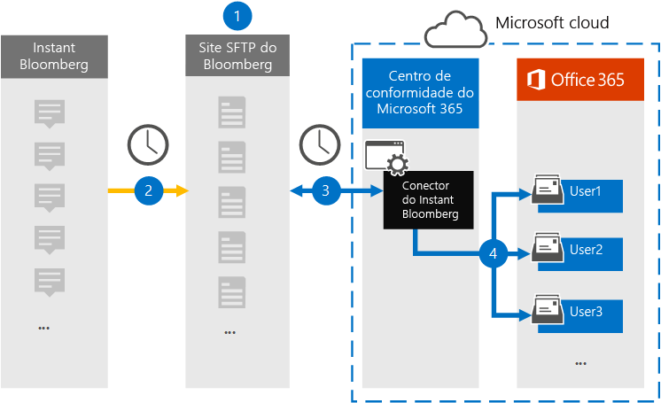

# Configurar um conector para arquivar dados do Instant BloombergSet up a connector to archive Instant Bloomberg data

Use um conector nativo no centro de conformidade da Microsoft 365 para importar e arquivar dados de chat de serviços financeiros da ferramenta de colaboração do [Bloomberg](https://www.bloomberg.com/professional/product/collaboration/) .Use a native connector in the Microsoft 365 compliance center to import and archive financial services chat data from the [Instant Bloomberg](https://www.bloomberg.com/professional/product/collaboration/) collaboration tool. Depois de configurar e configurar um conector, ele se conecta ao site da sua organização (SFTP) uma vez a cada dia, converte o conteúdo de mensagens de chat em um formato de mensagem de email e, em seguida, importa esses itens para caixas de correio no Microsoft 365.After you set up and configure a connector, it connects to your organization's Bloomberg secure FTP site (SFTP) once every day, converts the content of chat messages to an email message format, and then imports those items to mailboxes in Microsoft 365.

Após os dados do Bloomberg instantâneos serem armazenados nas caixas de correio do usuário, você pode aplicar recursos de conformidade do Microsoft 365, como retenção de litígio, pesquisa de conteúdo, arquivamento de In-Place, auditoria, conformidade de comunicação e políticas de retenção da Microsoft 365 para dados do Bloomberg instantâneo.After Instant Bloomberg data is stored in user mailboxes, you can apply Microsoft 365 compliance features such as Litigation Hold, Content Search, In-Place Archiving, Auditing, Communication compliance, and Microsoft 365 retention policies to Instant Bloomberg data. Por exemplo, você pode pesquisar mensagens de chat do Bloomberg instantâneas usando a pesquisa de conteúdo ou associar a caixa de correio que contém os dados do Bloomberg instantâneos a um funcionário em uma caixa de descoberta eletrônica avançada.For example, you can search Instant Bloomberg chat messages using Content Search or associate the mailbox that contains the Instant Bloomberg data with a custodian in an Advanced eDiscovery case. O uso de um conector de Bloomberg instantâneo para importar e arquivar dados no Microsoft 365 pode ajudar sua organização a se manter em conformidade com as políticas governamentais e regulamentares.Using an Instant Bloomberg connector to import and archive data in Microsoft 365 can help your organization stay compliant with government and regulatory policies.

## Visão geral do arquivamento de dados instantâneos do BloombergOverview of archiving Instant Bloomberg data

A visão geral a seguir explica o processo de uso de um conector para arquivar dados de chat instantânea do Bloomberg no Microsoft 365.The following overview explains the process of using a connector to archive Instant Bloomberg chat data in Microsoft 365. 

1. Sua organização trabalha com o Bloomberg para configurar um site do Bloomberg SFTP.Your organization works with Bloomberg to set up a Bloomberg SFTP site. Você também trabalhará com o Bloomberg para configurar o Bloomberg para copiar mensagens de chat para seu site do Bloomberg SFTP.You'll also work with Bloomberg to configure Instant Bloomberg to copy chat messages to your Bloomberg SFTP site.

2. Uma vez a cada 24 horas, as mensagens de bate-papo do Bloomberg imediato são copiadas para o site Bloomberg SFTP.Once every 24 hours, chat messages from Instant Bloomberg are copied to the Bloomberg SFTP site.

3. O conector de Bloomberg instantâneo que você cria no centro de conformidade da Microsoft 365 conecta-se ao site do Bloomberg SFTP todos os dias e transfere as mensagens de chat das últimas 24 horas para uma área de armazenamento do Azure segura na nuvem da Microsoft.The Instant Bloomberg connector that you create in the Microsoft 365 compliance center connects to the Bloomberg SFTP site every day and transfers the chat messages from the previous 24 hours to a secure Azure Storage area in the Microsoft Cloud. O conector também converte o conteúdo de um massage de chat em um formato de mensagem de email.The connector also converts the content of a chat massage to an email message format.

4. O conector importa os itens de mensagem de chat para a caixa de correio de um usuário específico.The connector imports the chat message items to the mailbox of a specific user. Uma nova pasta chamada InstantBloomberg é criada na caixa de correio do usuário específico e os itens serão importados para ela.A new folder named InstantBloomberg is created in the specific user's mailbox and the items will be imported to it. O conector faz isso usando o valor da propriedade *CorporateEmailAddress* .The connector does this by using the value of the *CorporateEmailAddress* property. Cada mensagem de chat contém essa propriedade, que é preenchida com o endereço de email de cada participante da mensagem de chat.Every chat message contains this property, which is populated with the email address of every participant of the chat message. Além do mapeamento automático de usuários usando o valor da propriedade *CorporateEmailAddress* , você também pode definir um mapeamento personalizado carregando um arquivo de mapeamento CSV.In addition to automatic user mapping using the value of the *CorporateEmailAddress* property, you can also define a custom mapping by uploading a CSV mapping file. Esse arquivo de mapeamento deve conter um UUID do Bloomberg e o endereço de caixa de correio do Microsoft 365 correspondente para cada usuário.This mapping file should contain a Bloomberg UUID and the corresponding Microsoft 365 mailbox address for each user. Se você habilitar o mapeamento automático de usuários e fornecer um mapeamento personalizado, para cada item de chat, o conector examinará primeiro o arquivo de mapeamento personalizado.If you enable automatic user mapping and provide a custom mapping, for every chat item the connector will first look at custom-mapping file. Se não encontrar um usuário válido do Microsoft 365 que corresponda ao UUID do Bloomberg de um usuário, o conector usará a propriedade *CorporateEmailAddress* do item de chat.If it doesn't find a valid Microsoft 365 user that corresponds to a user's Bloomberg UUID, the connector will use the *CorporateEmailAddress* property of the chat item. Se o conector não localizar um usuário válido do Microsoft 365 no arquivo de mapeamento personalizado ou na propriedade *CorporateEmailAddress* do item de chat, o item não será importado.If the connector doesn't find a valid Microsoft 365 user in either the custom-mapping file or the *CorporateEmailAddress* property of the chat item, the item won't be imported.

## Antes de começarBefore you begin

Algumas das etapas de implementação necessárias para arquivar dados instantâneos do Bloomberg são externas para o Microsoft 365 e devem ser concluídas para que você possa criar o conector no centro de conformidade.Some of the implementation steps required to archive Instant Bloomberg data are external to Microsoft 365 and must be completed before you can create the connector in the compliance center.

- Inscreva-se no [Bloomberg em qualquer lugar](https://www.bloomberg.com/professional/product/remote-access/?bbgsum-page=DG-WS-PROF-PROD-BBA).Subscribe to [Bloomberg Anywhere](https://www.bloomberg.com/professional/product/remote-access/?bbgsum-page=DG-WS-PROF-PROD-BBA). Isso é necessário para que você possa fazer logon no Bloomberg em qualquer lugar para acessar o site do Bloomberg SFTP que você precisa configurar e configurar.This is required so that you can log in to Bloomberg Anywhere to access the Bloomberg SFTP site that you have to set up and configure.

- Configurar um site Bloomberg SFTP (protocolo de transferência segura de arquivos).Set up a Bloomberg SFTP (Secure file transfer protocol) site. Depois de trabalhar com o Bloomberg para configurar o site SFTP, os dados do Bloomberg imediato são carregados para o site do SFTP todos os dias.After working with Bloomberg to set up the SFTP site, data from Instant Bloomberg is uploaded to the SFTP site every day. O conector que você cria na etapa 2 se conecta a esse site SFTP e transfere os dados de chat para caixas de correio do Microsoft 365.The connector you create in Step 2 connects to this SFTP site and transfers the chat data to Microsoft 365 mailboxes. O SFTP também criptografa os dados de chat do Bloomberg que são enviados para caixas de correio durante o processo de transferência.SFTP also encrypts the Instant Bloomberg chat data that is sent to mailboxes during the transfer process.

  Para obter informações sobre o Bloomberg SFTP (também chamado *de BB-SFTP*):For information about Bloomberg SFTP (also called *BB-SFTP*):

  - Consulte o documento "padrões de conectividade SFTP" no [suporte do Bloomberg](https://www.bloomberg.com/professional/support/documentation/).See the "SFTP Connectivity Standards" document at [Bloomberg Support](https://www.bloomberg.com/professional/support/documentation/).

  - Contatar o [suporte ao cliente do Bloomberg](https://service.bloomberg.com/portal/sessions/new?utm_source=bloomberg-menu&utm_medium=csc).Contact [Bloomberg customer support](https://service.bloomberg.com/portal/sessions/new?utm_source=bloomberg-menu&utm_medium=csc).

  Depois de trabalhar com o Bloomberg para configurar um site SFTP, o Bloomberg fornecerá algumas informações depois que você responder à mensagem de email de implementação do Bloomberg.After you work with Bloomberg to set up an SFTP site, Bloomberg will provide some information to you after you respond to the Bloomberg implementation email message. Salve uma cópia das informações a seguir.Save a copy of the following information. Você pode usá-lo para configurar um conector na etapa 3.You use it to set up a connector in Step 3.

  - O código da empresa, que é uma ID da sua organização e é usado para fazer logon no site do Bloomberg SFTP.Firm code, which is an ID for your organization and is used to log in to the Bloomberg SFTP site.

  - Senha para seu site do Bloomberg SFTPPassword for your Bloomberg SFTP site

  - URL para o site do Bloomberg SFTP (por exemplo, sftp.bloomberg.com)URL for Bloomberg SFTP site (for example, sftp.bloomberg.com)

  - Número de porta para o site Bloomberg SFTPPort number for Bloomberg SFTP site

- O conector de Bloomberg instantâneo pode importar um total de 200.000 itens em um único dia.The Instant Bloomberg connector can import a total of 200,000 items in a single day. Se houver mais de 200.000 itens em um dia presente no site SFTP, nenhum desses itens será importado para a Microsoft 365.If there are more than 200,000 items in a day present in the SFTP site, none of those itmes will be imported to Microsoft 365.

- O usuário que cria um conector de Bloomberg instantâneo na etapa 3 (e quem baixa as chaves públicas e o endereço IP na etapa 1) deve receber a função de exportação de importação de caixa de correio no Exchange Online.The user who creates an Instant Bloomberg connector in Step 3 (and who downloads the public keys and IP address in Step 1) must be assigned the Mailbox Import Export role in Exchange Online. Isso é necessário para adicionar conectores na página **conectores de dados** no centro de conformidade do Microsoft 365.This is required to add connectors in the **Data connectors** page in the Microsoft 365 compliance center. Por padrão, essa função não é atribuída a nenhum grupo de funções no Exchange Online.By default, this role isn't assigned to any role group in Exchange Online. Você pode adicionar a função de exportação de importação de caixa de correio ao grupo de funções Gerenciamento da organização no Exchange Online.You can add the Mailbox Import Export role to the Organization Management role group in Exchange Online. Ou você pode criar um grupo de função, atribua a função de exportação de importação de caixa de correio e, em seguida, adicione os usuários apropriados como membros.Or you can create a role group, assign the Mailbox Import Export role, and then add the appropriate users as members. Para obter mais informações, consulte as seções [criar grupos de função](https://docs.microsoft.com/Exchange/permissions-exo/role-groups#create-role-groups) ou [modificar grupos de função](https://docs.microsoft.com/Exchange/permissions-exo/role-groups#modify-role-groups) no artigo "gerenciar grupos de função no Exchange Online".For more information, see the [Create role groups](https://docs.microsoft.com/Exchange/permissions-exo/role-groups#create-role-groups) or [Modify role groups](https://docs.microsoft.com/Exchange/permissions-exo/role-groups#modify-role-groups) sections in the article "Manage role groups in Exchange Online".

## Etapa 1: obter as chaves públicas SSH e PGPStep 1: Obtain SSH and PGP public keys

A primeira etapa é obter uma cópia das chaves públicas para SSH (Secure Shell) e PGP (boa privacidade).The first step is to obtain a copy of the public keys for Secure Shell (SSH) and Pretty Good Privacy (PGP). Use essas chaves na etapa 2 para configurar o site do Bloomberg SFTP para permitir que o conector (que você criou na etapa 3) se conecte ao site SFTP e transfira os dados de chat do Bloomberg para o Microsoft 365 caixas de correio.You use these keys in Step 2 to configure the Bloomberg SFTP site to allow the connector (that you create in Step 3) to connect to the SFTP site and transfer the Instant Bloomberg chat data to Microsoft 365 mailboxes. Você também obtém um endereço IP nesta etapa, que você usa ao configurar o site do Bloomberg SFTP.You also obtain an IP address in this step, which you use when configuring the Bloomberg SFTP site.

1. Vá para <https://compliance.microsoft.com> e clique em **conectores de dados** do  >  **Bloomberg imediato**.Go to <https://compliance.microsoft.com> and then click **Data connectors** > **Instant Bloomberg**.

2. Na página descrição do produto do **Bloomberg instantâneo** , clique em **Adicionar conector**On the **Instant Bloomberg** product description page, click **Add connector**

3. Na página **termos de serviço** , clique em **aceitar**.On the **Terms of service** page, click **Accept**.

4. No **site adicionar credenciais para Bloomberg SFTP** , em etapa 1, clique na **chave de download SSH**, **baixar a chave PGP** e baixar links de **endereço IP** para salvar uma cópia de cada arquivo no computador local.On the **Add credentials for Bloomberg SFTP site** under step 1, click the **Download SSH key**, **Download PGP key**, and **Download IP address** links to save a copy of each file to your local computer. Esses arquivos contêm os seguintes itens que são usados para configurar o site do Bloomberg SFTP na etapa 2:These files contain the following items that are used to configure the Bloomberg SFTP site in Step 2:

   - Chave pública SSH: essa chave é usada para configurar o Secure Shell (SSH) para habilitar um logon remoto seguro quando o conector se conecta ao site do Bloomberg SFTP.SSH public key: This key is used to configure Secure Shell (SSH) to enable a secure remote login when the connector connects to the Bloomberg SFTP site.

   - Chave pública do PGP: essa chave é usada para configurar a criptografia de dados que são transferidos do site do Bloomberg SFTP para o Microsoft 365.PGP public key: This key is used to configure the encryption of data that's transferred from the Bloomberg SFTP site to Microsoft 365.

   - Endereço IP: o site do Bloomberg SFTP é configurado para aceitar uma solicitação de conexão apenas desse endereço IP, que é usado pelo conector do Bloomberg instantâneo criado na etapa 3.IP address: The Bloomberg SFTP site is configured to accept a connection request only from this IP address, which is used by the Instant Bloomberg connector that you create in Step 3. 

5. Clique em **Cancelar** para fechar o assistente.Click **Cancel** to close the wizard. Você volta para este assistente na etapa 3 para criar o conector.You come back to this wizard in Step 3 to create the connector.

## Etapa 2: configurar o site do Bloomberg SFTPStep 2: Configure the Bloomberg SFTP site

A próxima etapa é usar as chaves públicas SSH e PGP e o endereço IP obtido na etapa 1 para configurar a autenticação SSH e a criptografia PGP para o site Bloomberg SFTP.The next step is to use the SSH and PGP public keys and the IP address that you obtained in Step 1 to configure SSH authentication and PGP encryption for the Bloomberg SFTP site. Isso permite que o conector do Bloomberg instantâneo criado na etapa 3 se conecte ao site Bloomberg SFTP e transfira dados de Bloomberg instantâneos para o Microsoft 365.This lets the Instant Bloomberg connector that you create in Step 3 connect to the Bloomberg SFTP site and transfer Instant Bloomberg data to Microsoft 365. Você precisa trabalhar com o suporte ao cliente Bloomberg para configurar seu site do Bloomberg SFTP.You need to work with Bloomberg customer support to set up your Bloomberg SFTP site. Entre em contato com o [suporte ao cliente Bloomberg](https://service.bloomberg.com/portal/sessions/new?utm_source=bloomberg-menu&utm_medium=csc) para obter assistência.Contact [Bloomberg customer support](https://service.bloomberg.com/portal/sessions/new?utm_source=bloomberg-menu&utm_medium=csc) for assistance. 

> [!IMPORTANT]
> O Bloomberg recomenda que você anexe os três arquivos baixados na etapa 1 a uma mensagem de email e envie-o à sua equipe de suporte ao cliente ao trabalhar com eles para configurar seu site do Bloomberg SFTP.Bloomberg recommends that you attach the three files that you downloaded in Step 1 to an email message and send it to their customer support team when working with them to set up your Bloomberg SFTP site.

## Etapa 3: criar um conector de Bloomberg instantâneoStep 3: Create an Instant Bloomberg connector

A última etapa é criar um conector de Bloomberg instantâneo no centro de conformidade da Microsoft 365.The last step is to create an Instant Bloomberg connector in the Microsoft 365 compliance center. O conector usa as informações que você fornece para se conectar ao site do Bloomberg SFTP e transferir mensagens de chat para as caixas de correio de usuário correspondentes no Microsoft 365.The connector uses the information you provide to connect to the Bloomberg SFTP site and transfer chat messages to the corresponding user mailbox boxes in Microsoft 365.

1. Vá para <https://compliance.microsoft.com> e clique em **conectores de dados** do  >  **Bloomberg imediato**.Go to <https://compliance.microsoft.com> and then click **Data connectors** > **Instant Bloomberg**.

2. Na página descrição do produto do **Bloomberg instantâneo** , clique em **Adicionar conector**On the **Instant Bloomberg** product description page, click **Add connector**

3. Na página **termos de serviço** , clique em **aceitar**.On the **Terms of service** page, click **Accept**.

4. Na página **Adicionar credenciais para o site do Bloomberg SFTP** , em etapa 3, insira as informações necessárias nas caixas a seguir e clique em **Avançar**.On the **Add credentials for Bloomberg SFTP site** page, under Step 3, enter the required information in the following boxes and then click **Next**.

    - **Código da empresa:** A ID da sua organização que é usada como o nome de usuário para o site do Bloomberg SFTP.**Firm code:** The ID for your organization that is used as the username for the Bloomberg SFTP site.

    - **Senha:** Senha para o site Bloomberg SFTP.**Password:** Password for Bloomberg SFTP site.

    - **URL de SFTP:** A URL para o site do Bloomberg SFTP (por exemplo, sftp.bloomberg.com).**SFTP URL:** The URL for Bloomberg SFTP site (for example, sftp.bloomberg.com).

    - **Porta SFTP:** O número da porta para o site Bloomberg SFTP.**SFTP port:** The port number for Bloomberg SFTP site. O conector usa essa porta para se conectar ao site SFTP.The connector uses this port to connect to the SFTP site.

5. Na página **Selecionar tipos de dados a importar** , selecione os tipos de dados necessários a serem importados de **mensagens**On the **Select data types to import** page, select the required data types to be imported apart from **Messages**

6. Na página de **mapeamento do usuário** , habilite o mapeamento automático de usuários e forneça mapeamento de usuário personalizado conforme necessárioOn the **User-mapping** page, enable automatic user mapping and provide custom user mapping as required

   > [!NOTE]
   > O conector importa os itens de mensagem de chat para a caixa de correio de um usuário específico.The connector imports the chat message items to the mailbox of a specific user. Uma nova pasta chamada **InstantBloomberg** é criada na caixa de correio do usuário específico e os itens serão importados para ela.A new folder named **InstantBloomberg** is created in the specific user's mailbox and the items will be imported to it. O conector faz usando o valor da propriedade *CorporateEmailAddress* .The connector does by using the value of the *CorporateEmailAddress* property. Cada mensagem de chat contém essa propriedade e a propriedade é preenchida com o endereço de email de cada participante da mensagem de chat.Every chat message contains this property, and the property is populated with the email address of every participant of the chat message. Além do mapeamento automático de usuários usando o valor da propriedade *CorporateEmailAddress* , você também pode definir o mapeamento personalizado carregando um arquivo de mapeamento CSV.In addition to automatic user mapping using the value of the *CorporateEmailAddress* property, you can also define custom mapping by uploading a CSV mapping file. O arquivo de mapeamento deve conter o UUID do Bloomberg e o endereço da caixa de correio do Microsoft 365 correspondente para cada usuário.The mapping file should contain the Bloomberg UUID and corresponding Microsoft 365 mailbox address for each user. Se você habilitar o mapeamento automático de usuários e fornecer um mapeamento personalizado, para cada item de chat, o conector examinará primeiro o arquivo de mapeamento personalizado.If you enable automatic user mapping and provide a custom mapping, for every chat item the connector will first look at custom mapping file. Se não encontrar um usuário válido do Microsoft 365 que corresponda ao UUID do Bloomberg de um usuário, o conector usará a propriedade *CorporateEmailAddress* do item de chat.If it doesn't find a valid Microsoft 365 user that corresponds to a user's Bloomberg UUID, the connector will use the *CorporateEmailAddress* property of the chat item. Se o conector não localizar um usuário válido do Microsoft 365 no arquivo de mapeamento personalizado ou na propriedade *CorporateEmailAddress* do item de chat, o item não será importado.If the connector doesn't find a valid Microsoft 365 user in either the custom mapping file or the *CorporateEmailAddress* property of the chat item, the item won't be imported.

7. Clique em **Avançar**, revise suas configurações e clique em **preparar** para criar o conector.Click **Next**, review your settings, and then click **prepare** to create the connector.

8. Vá para a página **conectores de dados** para ver o andamento do processo de importação para o novo conector.Go to the **Data connectors** page to see the progress of the import process for the new connector.
