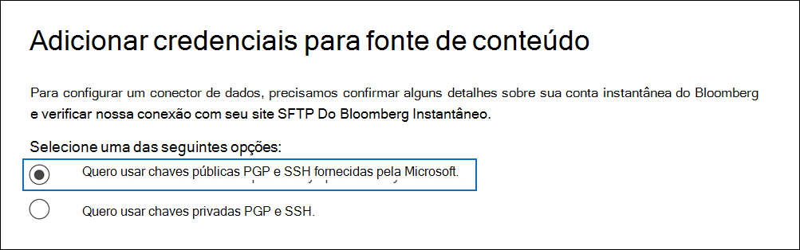
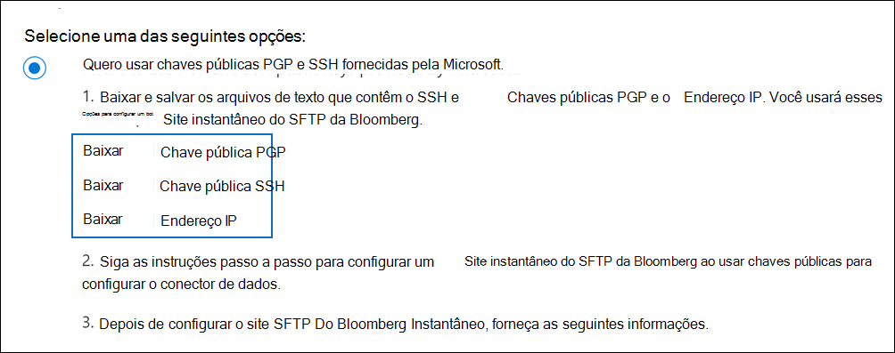
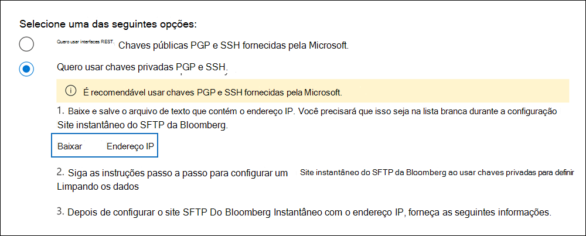
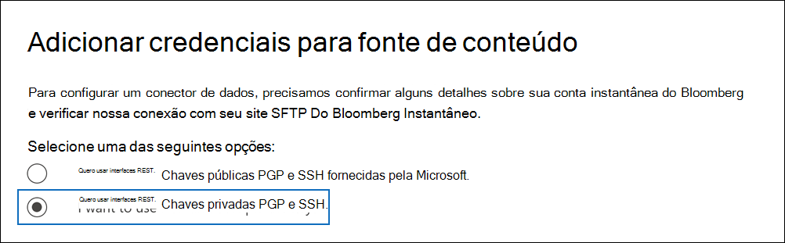

# Configurar um conector para arquivar dados do Instant Bloomberg

Use um conector nativo no centro de conformidade Microsoft 365 para importar e arquivar dados de chat de serviços financeiros da ferramenta [de colaboração Instantânea do Bloomberg.](https://www.bloomberg.com/professional/product/collaboration/) Depois de configurar e configurar um conector, ele se conecta ao site FTP seguro (SFTP) da sua organização uma vez por dia, converte o conteúdo das mensagens de chat em um formato de mensagem de email e importa esses itens para caixas de correio em Microsoft 365.

Depois que os dados instantâneos da Bloomberg são armazenados em caixas de correio de usuário, você pode aplicar recursos de conformidade Microsoft 365 como Retenção de Litígio, Pesquisa de Conteúdo, Arquivamento In-Place In-Place, Auditoria, Conformidade de comunicação e políticas de retenção Microsoft 365 aos dados instantâneos do Bloomberg. Por exemplo, você pode pesquisar mensagens de chat instantâneas do Bloomberg usando a Pesquisa de Conteúdo ou associar a caixa de correio que contém os dados instantâneos do Bloomberg com um custodiante em um caso Advanced eDiscovery de conteúdo. Usar um conector Instantâneo da Bloomberg para importar e arquivar dados em Microsoft 365 pode ajudar sua organização a manter-se em conformidade com políticas governamentais e regulatórias.

## Visão geral dos dados instantâneos do Bloomberg de arquivamento

A visão geral a seguir explica o processo de uso de um conector para arquivar dados de chat instantâneos do Bloomberg Microsoft 365. 

1. Sua organização trabalha com a Bloomberg para configurar um site do SFTP da Bloomberg. Você também trabalhará com a Bloomberg para configurar o Bloomberg Instantâneo para copiar mensagens de chat para seu site do SFTP da Bloomberg.

2. Uma vez a cada 24 horas, as mensagens de chat do Instant Bloomberg são copiadas para o site do SFTP da Bloomberg.

3. O conector Instantâneo do Bloomberg criado no centro de conformidade do Microsoft 365 conecta-se ao site do SFTP da Bloomberg todos os dias e transfere as mensagens de chat das 24 horas anteriores para uma área segura do Azure Armazenamento no Microsoft Cloud. O conector também converte o conteúdo de uma massagens de chat em um formato de mensagem de email.

4. O conector importa os itens de mensagem de chat para a caixa de correio de um usuário específico. Uma nova pasta chamada InstantBloomberg é criada na caixa de correio do usuário específico e os itens serão importados para ela. O conector faz isso usando o valor da *propriedade CorporateEmailAddress.* Cada mensagem de chat contém essa propriedade, que é preenchida com o endereço de email de cada participante da mensagem de chat. Além do mapeamento automático do usuário usando o valor da propriedade *CorporateEmailAddress,* você também pode definir um mapeamento personalizado carregando um arquivo de mapeamento CSV. Esse arquivo de mapeamento deve conter uma UUID da Bloomberg e o endereço Microsoft 365 caixa de correio correspondente para cada usuário. Se você habilitar o mapeamento automático do usuário e fornecer um mapeamento personalizado, para cada item de chat, o conector procurará primeiro o arquivo de mapeamento personalizado. Se ele não encontrar um usuário Microsoft 365 que corresponda à UUID bloomberg de um usuário, o conector usará a propriedade *CorporateEmailAddress* do item de chat. Se o conector não encontrar um usuário Microsoft 365 no arquivo de mapeamento personalizado ou na propriedade *CorporateEmailAddress* do item de chat, o item não será importado.

## Antes de configurar um conector

Algumas das etapas de implementação necessárias para arquivar dados instantâneos do Bloomberg são externas Microsoft 365 e devem ser concluídas antes que você possa criar o conector no centro de conformidade.

- Para configurar um conector Bloomberg Instantâneo, você precisa usar chaves e senhas de chave para PGP (Privacidade Muito Boa) e Shell Seguro (SSH). Essas chaves são usadas para configurar o site do SFTP da Bloomberg e usadas pelo conector para se conectar ao site do SFTP da Bloomberg para importar dados para Microsoft 365. A chave PGP é usada para configurar a criptografia de dados transferidos do site do SFTP da Bloomberg para Microsoft 365. A chave SSH é usada para configurar o shell seguro para habilitar um logon remoto seguro quando o conector se conecta ao site do SFTP da Bloomberg.

  Ao configurar um conector, você tem a opção de usar chaves públicas e senhas de chave fornecidas pela Microsoft ou pode usar suas próprias chaves privadas e senhas. Recomendamos que você use as chaves públicas fornecidas pela Microsoft. No entanto, se sua organização já configurou um site do SFTP da Bloomberg usando chaves privadas, então você pode criar um conector usando essas mesmas chaves privadas.

- Inscreva-se [em Bloomberg Em Qualquer Lugar](https://www.bloomberg.com/professional/product/remote-access/?bbgsum-page=DG-WS-PROF-PROD-BBA). Isso é necessário para que você possa fazer logoff na Bloomberg Em Qualquer Lugar para acessar o site do SFTP da Bloomberg que você precisa configurar e configurar.

- Configurar um site do SFTP da Bloomberg (protocolo de transferência de arquivos seguro). Depois de trabalhar com a Bloomberg para configurar o site do SFTP, os dados do Instant Bloomberg são carregados no site do SFTP todos os dias. O conector criado na Etapa 2 conecta-se a esse site SFTP e transfere os dados de chat para Microsoft 365 caixas de correio. O SFTP também criptografa os dados de chat instantâneos do Bloomberg que são enviados para caixas de correio durante o processo de transferência.

  Para obter informações sobre o SFTP da Bloomberg (também chamado *de BB-SFTP*):

  - Consulte o documento "Padrões de Conectividade SFTP" em [Suporte à Bloomberg](https://www.bloomberg.com/professional/support/documentation/).

  - Entre [em contato com o suporte ao cliente da Bloomberg.](https://service.bloomberg.com/portal/sessions/new?utm_source=bloomberg-menu&utm_medium=csc)

  Depois de trabalhar com a Bloomberg para configurar um site SFTP, a Bloomberg fornecerá algumas informações a você depois de responder à mensagem de email de implementação do Bloomberg. Salve uma cópia das informações a seguir. Use-o para configurar um conector na Etapa 3.

  - Código firme, que é uma ID da sua organização e é usado para fazer logoff no site do SFTP da Bloomberg.

  - Senha para seu site do SFTP da Bloomberg

  - URL do site do SFTP da Bloomberg (por exemplo, sftp.bloomberg.com)

  - Número da porta para o site do SFTP da Bloomberg

- O conector Instantâneo bloomberg pode importar um total de 200.000 itens em um único dia. Se houver mais de 200.000 itens no site SFTP, nenhum desses itens será importado para Microsoft 365.

- O usuário que cria um conector Bloomberg Instantâneo na Etapa 3 (e que baixa as chaves públicas e o endereço IP na Etapa 1) deve receber a função de Exportação de Importação de Caixa de Correio no Exchange Online. Isso é necessário para adicionar conectores na página **Conectores** de dados no Microsoft 365 de conformidade. Por padrão, essa função não é atribuída a nenhum grupo de funções no Exchange Online. Você pode adicionar a função Exportar Importação de Importação de Caixa de Correio ao grupo de função Gerenciamento da Organização Exchange Online. Ou você pode criar um grupo de funções, atribuir a função Exportar Importação de Caixa de Correio e adicionar os usuários apropriados como membros. Para obter mais informações, consulte as seções Criar grupos de [função](/Exchange/permissions-exo/role-groups#create-role-groups) ou [Modificar](/Exchange/permissions-exo/role-groups#modify-role-groups) grupos de função no artigo "Gerenciar grupos de funções em Exchange Online".

## Configurar um conector usando chaves públicas

As etapas nesta seção mostram como configurar um conector Instantâneo da Bloomberg usando as chaves públicas para PGP (Privacidade Muito Boa) e Shell Seguro (SSH).

### Etapa 1: Obter PGP e SSH e chaves públicas

A primeira etapa é obter uma cópia das chaves públicas para PGP (Privacidade Muito Boa) e Shell Seguro (SSH). Você usa essas chaves na Etapa 2 para configurar o site do SFTP do Bloomberg para permitir que o conector (criado na Etapa 3) se conecte ao site SFTP e transfira os dados de chat instantâneos do Bloomberg para Microsoft 365 caixas de correio. Você também obtém um endereço IP nesta etapa, que você usa ao configurar o site do SFTP do Bloomberg.

1. Vá para <https://compliance.microsoft.com> e clique **em Conectores de dados** na nav esquerda.

2. Na página **Conectores de dados** em **Instant Bloomberg,** clique em **Exibir**.

3. Na página Descrição instantânea do produto **Da Bloomberg,** clique em **Adicionar conector**

4. Na página **Termos de serviço,** clique em **Aceitar**.

5. Na página **Adicionar credenciais para fonte de** conteúdo, clique em Quero usar chaves **públicas PGP** e SSH fornecidas pela Microsoft .

   

6. Na etapa 1, clique na tecla **Baixar SSH,** baixe a tecla **PGP** e Baixe links de **endereço IP** para salvar uma cópia de cada arquivo no computador local.

   

   Esses arquivos contêm os seguintes itens usados para configurar o site do SFTP do Bloomberg na Etapa 2:

   - Chave pública PGP: essa chave é usada para configurar a criptografia de dados transferidos do site do SFTP da Bloomberg para Microsoft 365.

   - Chave pública SSH: essa chave é usada para configurar o shell seguro para habilitar um logon remoto seguro quando o conector se conecta ao site do SFTP da Bloomberg.

   - Endereço IP: o site do SFTP da Bloomberg está configurado para aceitar solicitações de conexão deste endereço IP. O mesmo endereço IP é usado pelo conector Instantâneo do Bloomberg para se conectar ao site SFTP e transferir dados instantâneos do Bloomberg para Microsoft 365.

7. Clique **em Cancelar** para fechar o assistente. Você volta para este assistente na Etapa 3 para criar o conector.

### Etapa 2: Configurar o site do SFTP da Bloomberg

A próxima etapa é usar as chaves públicas PGP e SSH e o endereço IP obtido na Etapa 1 para configurar a criptografia PGP e a autenticação SSH para o site do SFTP da Bloomberg. Isso permite que o conector Instantâneo do Bloomberg criado na Etapa 3 se conecte ao site do SFTP da Bloomberg e transfira dados instantâneos do Bloomberg para Microsoft 365. Você precisa trabalhar com o suporte ao cliente da Bloomberg para configurar seu site do SFTP da Bloomberg. Entre [em contato com o suporte ao cliente da Bloomberg](https://service.bloomberg.com/portal/sessions/new?utm_source=bloomberg-menu&utm_medium=csc) para assistência. 

> [!IMPORTANT]
> A Bloomberg recomenda que você anexe os três arquivos baixados na Etapa 1 a uma mensagem de email e envie-a para a equipe de suporte ao cliente ao trabalhar com eles para configurar seu site do SFTP da Bloomberg.

### Etapa 3: Criar um conector Instantâneo do Bloomberg

A última etapa é criar um conector Instantâneo da Bloomberg no Microsoft 365 de conformidade. O conector usa as informações fornecidas para se conectar ao site do SFTP da Bloomberg e transferir mensagens de chat para as caixas de correio de usuário correspondentes em Microsoft 365.

1. Vá até <https://compliance.microsoft.com> e clique em **Conectores de dados**  >  **Instantâneas bloomberg**.

2. Na página Descrição instantânea do produto **Da Bloomberg,** clique em **Adicionar conector**

3. Na página **Termos de serviço,** clique em **Aceitar**.

4. Na página Adicionar credenciais para o **site do SFTP da Bloomberg,** em Etapa 3, insira as informações necessárias nas caixas a seguir e clique em **Próximo**.

    - **Código firme:** A ID da sua organização que é usada como nome de usuário para o site do SFTP da Bloomberg.

    - **Senha:** Senha para site do SFTP da Bloomberg.

    - **URL SFTP:** A URL do site do SFTP da Bloomberg (por exemplo, `sftp.bloomberg.com` ). Você também pode usar um endereço IP para esse valor.

    - **Porta SFTP:** O número da porta para o site do SFTP da Bloomberg. O conector usa essa porta para se conectar ao site SFTP.

5. Na página **Selecionar tipos de dados a serem importados,** selecione os tipos de dados necessários a serem importados além de **Mensagens**

6. Na página **Mapear usuários instantâneos do Bloomberg** para Microsoft 365 usuários, habilita o mapeamento automático do usuário e fornece mapeamento de usuário personalizado conforme necessário

   > [!NOTE]
   > O conector importa os itens de mensagem de chat para a caixa de correio de um usuário específico. Uma nova pasta chamada **InstantBloomberg** é criada na caixa de correio do usuário específico e os itens serão importados para ela. O conector faz usando o valor da *propriedade CorporateEmailAddress.* Cada mensagem de chat contém essa propriedade e a propriedade é preenchida com o endereço de email de cada participante da mensagem de chat. Além do mapeamento automático do usuário usando o valor da propriedade *CorporateEmailAddress,* você também pode definir o mapeamento personalizado carregando um arquivo de mapeamento CSV. O arquivo de mapeamento deve conter a UUID da Bloomberg e o endereço Microsoft 365 caixa de correio correspondente para cada usuário. Se você habilitar o mapeamento automático do usuário e fornecer um mapeamento personalizado, para cada item de chat, o conector procurará primeiro o arquivo de mapeamento personalizado. Se ele não encontrar um usuário Microsoft 365 que corresponda à UUID bloomberg de um usuário, o conector usará a propriedade *CorporateEmailAddress* do item de chat. Se o conector não encontrar um usuário Microsoft 365 no arquivo de mapeamento personalizado ou na propriedade *CorporateEmailAddress* do item de chat, o item não será importado.

7. Clique **em Próximo,** revise suas configurações e clique em **Concluir** para criar o conector.

8. Vá até a **página Conectores de dados** para ver o andamento do processo de importação do novo conector. Clique no conector para exibir a página de sobrevoo, que contém informações sobre o conector.

## Configurar um conector usando chaves privadas

As etapas nesta seção mostram como configurar um conector Bloomberg Instantâneo usando chaves privadas PGP e SSH. Essa opção de instalação do conector destina-se a organizações que já configuraram um site do SFTP da Bloomberg usando chaves privadas.

### Etapa 1: Obter um endereço IP para configurar o site do SFTP da Bloomberg

> [!NOTE]
> Se sua organização configurou anteriormente um site do SFTP da Bloomberg para arquivar dados da Mensagem da Bloomberg usando chaves privadas PGP e SSH, você não precisa configurar outro. Você pode especificar o mesmo site SFTP ao criar o conector na Etapa 2.

Se sua organização tiver usado chaves privadas PGP e SSH para configurar um site do SFTP da Bloomberg, você terá que obter um endereço IP e fornecer o suporte ao cliente da Bloomberg. O site do SFTP da Bloomberg deve ser configurado para aceitar solicitações de conexão deste endereço IP. O mesmo endereço IP é usado pelo conector Instantâneo do Bloomberg para se conectar ao site SFTP e transferir dados instantâneos do Bloomberg para Microsoft 365.

Para obter o endereço IP:

1. Vá para <https://compliance.microsoft.com> e clique **em Conectores de dados** na nav esquerda.

2. Na página **Conectores de dados** em **Instant Bloomberg,** clique em **Exibir**.

3. Na página Descrição instantânea do produto **Da Bloomberg,** clique em **Adicionar conector**

4. Na página **Termos de serviço,** clique em **Aceitar**.

5. Na página Adicionar credenciais para fonte de conteúdo, clique em Quero usar chaves **privadas** **PGP e SSH.**

6. Na etapa 1, clique em **Baixar endereço IP** para salvar uma cópia do arquivo de endereço IP no computador local.

   

7. Clique **em Cancelar** para fechar o assistente. Você volta para este assistente na Etapa 2 para criar o conector.

Você precisa trabalhar com o suporte ao cliente da Bloomberg para configurar seu site do SFTP da Bloomberg para aceitar solicitações de conexão deste endereço IP. Entre [em contato com o suporte ao cliente da Bloomberg](https://service.bloomberg.com/portal/sessions/new?utm_source=bloomberg-menu&utm_medium=csc) para assistência.

### Etapa 2: Criar um conector Instantâneo do Bloomberg

Após a configuração do site do SFTP da Bloomberg, a próxima etapa é criar um conector Instantâneo da Bloomberg no centro de conformidade Microsoft 365 de segurança. O conector usa as informações fornecidas para se conectar ao site do SFTP da Bloomberg e transferir mensagens de email para as caixas de correio de usuário correspondentes no Microsoft 365. Para concluir essa etapa, certifique-se de ter cópias das mesmas chaves privadas e senhas que você usou para configurar seu site do SFTP da Bloomberg.

1. Vá para <https://compliance.microsoft.com> e clique **em Conectores de dados** na nav esquerda.

2. Na página **Conectores de dados** em **Instant Bloomberg,** clique em **Exibir**.

3. Na página Descrição instantânea do produto **Da Bloomberg,** clique em **Adicionar conector**

4. Na página **Termos de serviço,** clique em **Aceitar**.

5. Na página Adicionar credenciais para fonte de conteúdo, clique em Quero usar chaves **privadas** **PGP e SSH.**

   

6. Em Etapa 3, insira as informações necessárias nas caixas a seguir e clique em **Validar conexão**.

      - **Nome:** O nome do conector. Ele deve ser exclusivo em sua organização.

      - **Código firme:** A ID da sua organização que é usada como nome de usuário para o site do SFTP da Bloomberg.

      - **Senha:** A senha do site do SFTP bloomberg da sua organização.

      - **URL SFTP:** A URL do site do SFTP da Bloomberg (por exemplo, `sftp.bloomberg.com` ). Você também pode usar um endereço IP para esse valor.

      - **Porta SFTP:** O número da porta do site do SFTP da Bloomberg. O conector usa essa porta para se conectar ao site SFTP.

      - **Chave privada PGP:** A chave privada PGP para o site do SFTP da Bloomberg. Certifique-se de incluir todo o valor da chave privada, incluindo as linhas inicial e final do bloco de teclas.

      - **Senha da chave PGP:** A senha da chave privada PGP.

      - **Chave privada SSH:** A chave privada SSH para o site do SFTP da Bloomberg. Certifique-se de incluir todo o valor da chave privada, incluindo as linhas inicial e final do bloco de teclas.

      - **Senha da chave SSH:** A senha da chave privada SSH.

7. Depois que a conexão for validada com êxito, clique em **Next**.

8. Na página **Mapear usuários instantâneos do Bloomberg** para Microsoft 365 usuários, habilita o mapeamento automático do usuário e fornece mapeamento de usuário personalizado conforme necessário.

   > [!NOTE]
   > O conector importa os itens de mensagem de chat para a caixa de correio de um usuário específico. Uma nova pasta chamada **InstantBloomberg** é criada na caixa de correio do usuário específico e os itens serão importados para ela. O conector faz usando o valor da *propriedade CorporateEmailAddress.* Cada mensagem de chat contém essa propriedade e a propriedade é preenchida com o endereço de email de cada participante da mensagem de chat. Além do mapeamento automático do usuário usando o valor da propriedade *CorporateEmailAddress,* você também pode definir o mapeamento personalizado carregando um arquivo de mapeamento CSV. O arquivo de mapeamento deve conter a UUID da Bloomberg e o endereço Microsoft 365 caixa de correio correspondente para cada usuário. Se você habilitar o mapeamento automático do usuário e fornecer um mapeamento personalizado, para cada item de chat, o conector procurará primeiro o arquivo de mapeamento personalizado. Se ele não encontrar um usuário Microsoft 365 que corresponda à UUID bloomberg de um usuário, o conector usará a propriedade *CorporateEmailAddress* do item de chat. Se o conector não encontrar um usuário Microsoft 365 no arquivo de mapeamento personalizado ou na propriedade *CorporateEmailAddress* do item de chat, o item não será importado.

9. Clique **em Próximo,** revise suas configurações e clique em **Concluir** para criar o conector.

10. Vá até a **página Conectores de dados** para ver o andamento do processo de importação do novo conector. Clique no conector para exibir a página de sobrevoo, que contém informações sobre o conector.
