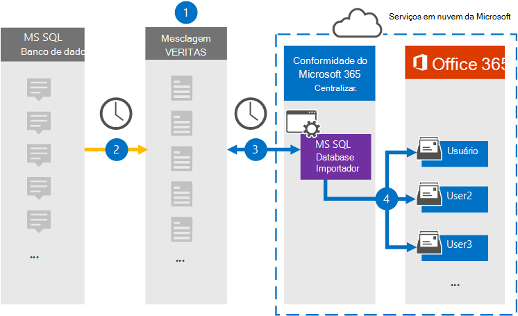

# Configurar um conector para arquivar dados do MS Banco de Dados SQL

Use um conector Veritas no centro de conformidade Microsoft 365 para importar e arquivar dados do MS Banco de Dados SQL caixas de correio de usuário em sua organização Microsoft 365. A Veritas fornece um conector MS Banco de Dados SQL Importador configurado para capturar itens de um banco de dados usando um arquivo de configuração XML e importar esses itens para Microsoft 365. O conector converte conteúdo do MS Banco de Dados SQL para um formato de mensagem de email e importa esses itens para caixas de correio de usuário em Microsoft 365.

Após o conteúdo do MS Banco de Dados SQL armazenado em caixas de correio de usuário, você pode aplicar Microsoft 365 de conformidade, como Retenção de Litígio, Descoberta Eletrônico, políticas de retenção e rótulos de retenção. Usar um conector de Banco de Dados SQL MS para importar e arquivar dados no Microsoft 365 pode ajudar sua organização a manter-se em conformidade com políticas governamentais e regulatórias.

## Visão geral do arquivamento dos dados de SQL MS

A visão geral a seguir explica o processo de uso de um conector para arquivar dados MS SQL dados em Microsoft 365.

1. Sua organização trabalha com um provedor de Banco de Dados SQL MS para configurar e configurar um site de Banco de Dados SQL MS.

2. Uma vez a cada 24 horas, os Banco de Dados SQL MS são copiados para o site Veritas Merge1. O conector também converte esse conteúdo em um formato de mensagem de email.

3. O conector de importador de Banco de Dados SQL MS que você cria no centro de conformidade do Microsoft 365, se conecta ao site Veritas Merge1 todos os dias e transfere as mensagens para um local seguro do Azure Armazenamento na nuvem da Microsoft.

4. O conector importa os itens MS convertidos Banco de Dados SQL para as caixas de correio de usuários específicos usando o valor da propriedade *Email* do mapeamento automático do usuário, conforme descrito na [Etapa 3](#step-3-map-users-and-complete-the-connector-setup). Uma subpasta na pasta Caixa de Entrada chamada **MS Banco de Dados SQL Importador** é criada nas caixas de correio do usuário e os itens são importados para essa pasta. O conector determina para qual caixa de correio importar itens usando o valor da *propriedade Email.* Cada item do MS Banco de Dados SQL contém essa propriedade, que é preenchida com o endereço de email de cada participante do item.

## Antes de começar

- Crie uma conta Veritas Merge1 para conectores da Microsoft. Para criar uma conta, entre em contato com [o Suporte ao Cliente veritas.](https://www.veritas.com/content/support/) Você precisa entrar nessa conta ao criar o conector na Etapa 1.

- O usuário que cria o conector de importador de Banco de Dados SQL MS na Etapa 1 (e o conclui na Etapa 3) deve ser atribuído à função de Exportação de Importação de Importação de Caixa de Correio no Exchange Online. Essa função é necessária para adicionar conectores na página Conectores de dados no Microsoft 365 de conformidade. Por padrão, essa função não é atribuída a nenhum grupo de funções no Exchange Online. Você pode adicionar a função Exportar Importação de Importação de Caixa de Correio ao grupo de função Gerenciamento da Organização Exchange Online. Ou você pode criar um grupo de funções, atribuir a função Exportar Importação de Caixa de Correio e adicionar os usuários apropriados como membros. Para obter mais informações, consulte as seções Criar grupos de [função](/Exchange/permissions-exo/role-groups#create-role-groups) ou [Modificar](/Exchange/permissions-exo/role-groups#modify-role-groups) grupos de função no artigo "Gerenciar grupos de funções em Exchange Online".

## Etapa 1: Configurar o conector de importador de Banco de Dados SQL MS

A primeira etapa é acessar a página **Conectores** de Dados no centro de conformidade do Microsoft365 e criar um conector para o MS Banco de Dados SQL.

1. Vá para [https://compliance.microsoft.com](https://compliance.microsoft.com) e clique em **Conectores de dados**  >  **MS Banco de Dados SQL Importador**.

2. Na página **MS Banco de Dados SQL Descrição do produto** importador, clique **em Adicionar novo conector**.

3. Na página **Termos de serviço,** clique em **Aceitar**.

4. Insira um nome exclusivo que identifique o conector e clique em **Próximo**.

5. Entre na sua conta Merge1 para configurar o conector.

## Etapa 2: Configurar o conector de importador de Banco de Dados SQL MS no site Veritas Merge1

A segunda etapa é configurar o conector de importador de Banco de Dados SQL MS no site Merge1. Para obter informações sobre como configurar o MS Banco de Dados SQL Importador, consulte [Merge1 Third-Party Connectors User Guide](https://docs.ms.merge1.globanetportal.com/Merge1%20Third-Party%20Connectors%20MS%20SQL%20Database%20Importer%20User%20Guide%20.pdf).

Depois de clicar em Salvar &  **Concluir**, a página de mapeamento do usuário no assistente de conector no Microsoft 365 de conformidade será exibida.

## Etapa 3: mapear usuários e concluir a configuração do conector

Para mapear usuários e concluir a configuração do conector, siga estas etapas:

1. Na página **Mapear MS Banco de Dados SQL importadores** para Microsoft 365 usuários, habilita o mapeamento automático do usuário. Os itens de Banco de Dados SQL MS incluem uma propriedade chamada *Email*, que contém endereços de email para usuários em sua organização. Se o conector puder associar esse endereço a um Microsoft 365 usuário, os itens serão importados para a caixa de correio desse usuário.

2. Clique **em Avançar,** revise suas configurações e vá até a página **Conectores** de dados para ver o andamento do processo de importação do novo conector.

## Etapa 4: Monitorar o conector de importador de Banco de Dados SQL MS

Depois de criar o conector MS Banco de Dados SQL Importador, você poderá exibir o status do conector no Microsoft 365 de conformidade.

1. Vá para <https://compliance.microsoft.com/> e clique **em Conectores de dados** na nav esquerda.

2. Clique na **guia Conectores** e selecione o conector de importador **MS**  Banco de Dados SQL para exibir a página de sobrevoo, que contém as propriedades e informações sobre o conector.

3. Em **Status do conector com origem**, clique no link Baixar **log** para abrir (ou salvar) o log de status do conector. Esse log contém dados que foram importados para a nuvem da Microsoft.

## Problemas conhecidos

- Neste momento, não há suporte para importação de anexos ou itens maiores que 10 MB. O suporte para itens maiores estará disponível posteriormente.