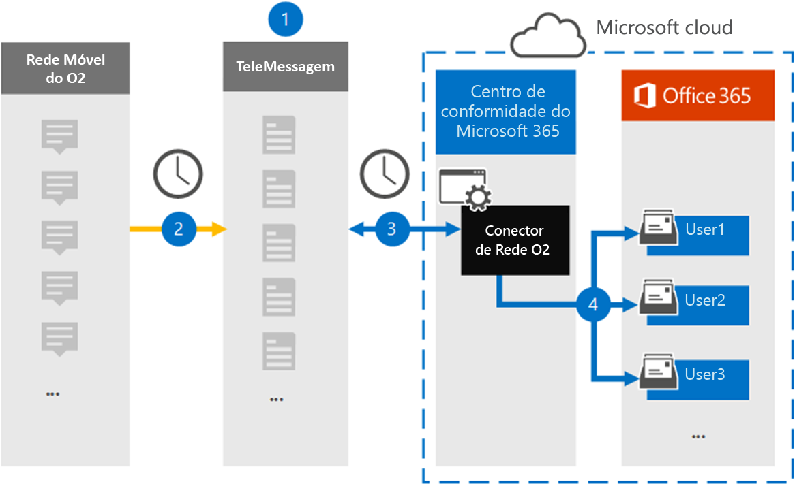

# Configurar um conector para arquivar dados da Rede O2

Use um conector teleMessage no centro de conformidade do Microsoft 365 para importar e arquivar mensagens e chamadas de voz do Serviço de Mensagens Curtas (SMS) da rede móvel O2. Depois de configurar e configurar um conector, ele se conecta à Rede O2 da sua organização uma vez por dia e importa SMS e chamadas de voz para caixas de correio no Microsoft 365.

Depois que mensagens SMS e chamadas de voz são armazenadas em caixas de correio de usuário, você pode aplicar recursos de conformidade do Microsoft 365, como Retenção de Litígio, Pesquisa de Conteúdo e políticas de retenção do Microsoft 365 aos dados da Rede O2. Por exemplo, você pode pesquisar mensagens sms de rede o2 e chamadas de voz usando a Pesquisa de Conteúdo ou associar a caixa de correio que contém dados da Rede O2 com um custodiante em um caso de Descoberta Avançada de Descoberta Eletrônico. Usar um conector de Rede O2 para importar e arquivar dados no Microsoft 365 pode ajudar sua organização a manter-se em conformidade com políticas governamentais e regulatórias.

## Visão geral dos dados de rede O2 de arquivamento

A visão geral a seguir explica o processo de uso de um conector para arquivar dados da Rede O2 no Microsoft 365.

1. Sua organização trabalha com TeleMessage e O2 para configurar um conector de Rede O2. Para obter mais informações, consulte [O2 Network Archiver](https://www.telemessage.com/office365-activation-for-o2-network-archiver).

2. Uma vez a cada 24 horas, mensagens SMS e chamadas de voz da Rede O2 da sua organização são copiadas para o site teleMessage.

3. O conector de Rede O2 criado no centro de conformidade do Microsoft 365 conecta-se ao site do TeleMessage todos os dias e transfere as mensagens SMS e chamadas de voz das 24 horas anteriores para um local seguro de Armazenamento do Azure no Microsoft Cloud. O conector também converte o conteúdo de mensagens SMS e chamadas de voz em um formato de mensagem de email.

4. O conector importa os itens de comunicação móvel para a caixa de correio de usuários específicos. Uma nova pasta chamada **O2 SMS e Voice Network Archiver** é criada na caixa de correio de um usuário específico e os itens são importados para ela. O conector faz esse mapeamento usando o valor da *propriedade endereço email do* usuário. Cada mensagem SMS e chamada de voz contém essa propriedade, que é preenchida com o endereço de email de cada participante da mensagem.

   Além do mapeamento automático do usuário usando o valor da propriedade endereço *email* do usuário, você também pode definir um mapeamento personalizado carregando um arquivo de mapeamento CSV. Este arquivo de mapeamento contém o número de telefone celular e o endereço de email correspondente do Microsoft 365 para usuários em sua organização. Se você habilitar o mapeamento automático do usuário e o mapeamento personalizado, para cada item O2, o conector primeiro olhará para o arquivo de mapeamento personalizado. Se ele não encontrar um usuário válido do Microsoft 365 que corresponda ao número de telefone celular de um usuário, o conector usará os valores na propriedade endereço de email do item que está tentando importar. Se o conector não encontrar um usuário válido do Microsoft 365 no arquivo de mapeamento personalizado ou na propriedade endereço de email do item O2, o item não será importado.

## Antes de começar

Algumas das etapas de implementação necessárias para arquivar dados da Rede O2 são externas ao Microsoft 365 e devem ser concluídas antes de você poder criar um conector no centro de conformidade.

- Order the [O2 Network Archiver service from TeleMessage](https://www.telemessage.com/mobile-archiver/order-mobile-archiver-for-o365/) and get a valid administration account for your organization. Você precisará entrar nessa conta quando criar o conector no centro de conformidade.

- Obtenha seus detalhes de contato de conta de Rede O2 e cobrança para que você possa preencher os formulários de integração do TeleMessage e solicitar o serviço de arquivamento de mensagens da O2.

- Registre todos os usuários que exigem o arquivamento de REDE de Voz e SMS O2 na conta teleMessage. Ao registrar usuários, certifique-se de usar o mesmo endereço de email usado para sua conta do Microsoft 365.

- Seus funcionários devem ter telefones móveis corporativos e corporativos na rede móvel O2. As mensagens de arquivamento no Microsoft 365 não estão disponíveis para dispositivos de propriedade do funcionário ou "Traga seus próprios dispositivos (BYOD).

- O usuário que cria um conector de Rede O2 deve receber a função de Exportação de Importação de Caixa de Correio no Exchange Online. Isso é necessário para adicionar conectores na página **Conectores de** dados no centro de conformidade do Microsoft 365. Por padrão, essa função não é atribuída a nenhum grupo de funções no Exchange Online. Você pode adicionar a função Exportar Importação de Caixa de Correio ao grupo de função Gerenciamento da Organização no Exchange Online. Ou você pode criar um grupo de funções, atribuir a função Exportar Importação de Caixa de Correio e adicionar os usuários apropriados como membros. Para obter mais informações, consulte as seções Criar grupos de [função](/Exchange/permissions-exo/role-groups#create-role-groups) ou [Modificar](/Exchange/permissions-exo/role-groups#modify-role-groups) grupos de função no artigo "Gerenciar grupos de função no Exchange Online".

## Criar um conector de rede O2

Depois de concluir os pré-requisitos descritos na seção anterior, você pode criar um conector de rede O2 no centro de conformidade do Microsoft 365. O conector usa as informações fornecidas para se conectar ao site teleMessage e transferir mensagens SMS e chamadas de voz para as caixas de correio de usuário correspondentes no Microsoft 365.

1. Vá para [https://compliance.microsoft.com](https://compliance.microsoft.com/) e clique em **Conectores de dados** \> **O2 Network.**

2. Na página Descrição do produto da **Rede O2,** clique em **Adicionar conector**

3. Na página **Termos de serviço,** clique em **Aceitar**.

4. Na página **Logon para TeleMessage,** em Etapa 3, insira as informações necessárias nas caixas a seguir e clique em **Próximo**.

   - **Nome de usuário:** Seu nome de usuário teleMessage.

   - **Senha:** Sua senha teleMessage.

5. Depois que o conector for criado, você poderá fechar a janela pop-up e ir para a próxima página.

6. Na página **Mapeamento de** usuário, habilita o mapeamento automático do usuário e clique em **Próximo**. Caso precise de mapeamento personalizado, carregue um arquivo CSV e clique em **Próximo**.

7. Revise suas configurações e clique em **Concluir** para criar o conector.

8. Vá até a guia Conectores na página **Conectores de** dados para ver o andamento do processo de importação do novo conector.

## Problemas conhecidos

- Neste momento, não há suporte para importação de anexos ou itens maiores que 10 MB. O suporte para itens maiores estará disponível posteriormente.