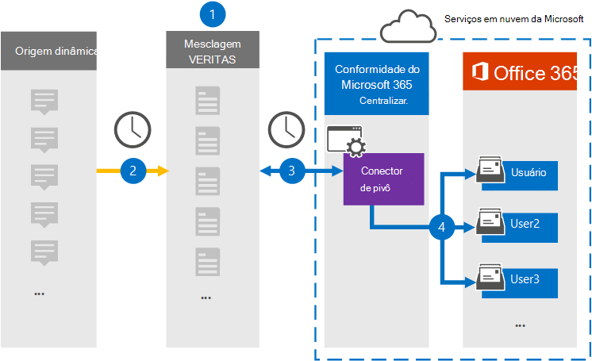

# Configurar um conector para arquivar dados pivotSet up a connector to archive Pivot data

Use um conector Globalnet no centro de conformidade do Microsoft 365 para importar e arquivar dados da plataforma Pivot para caixas de correio de usuário em sua organização do Microsoft 365.Use a Globanet connector in the Microsoft 365 compliance center to import and archive data from the Pivot platform to user mailboxes in your Microsoft 365 organization. A Globalnet fornece  um conector Pivot configurado para capturar itens da fonte de dados de terceiros (regularmente) e, em seguida, importar esses itens para o Microsoft 365.Globanet provides you with a [Pivot](https://globanet.com/pivot/) connector that is configured to capture items from the third-party data source (on a regular basis) and then import those items to Microsoft 365. Pivot é uma plataforma de mensagens instantâneas que permite a colaboração com participantes do mercado financeiro.Pivot is an instant messaging platform that allows collaboration with financial market participants. O conector converte itens como mensagens de chat, de contas dinâmicas de um usuário para um formato de mensagem de email e importa esses itens para as caixas de correio do usuário no Microsoft 365.The connector converts items such as chat messages, from a users' Pivot accounts to an email message format and then imports those items to the user mailboxes in Microsoft 365.

Depois que os dados pivot são armazenados em caixas de correio de usuário, você pode aplicar recursos de conformidade do Microsoft 365, como Retenção de Litígio, Descoberta Eletrônico, políticas de retenção e rótulos de retenção e conformidade de comunicação.After Pivot data is stored in user mailboxes, you can apply Microsoft 365 compliance features such as Litigation Hold, eDiscovery, retention policies and retention labels, and communication compliance. O uso de um conector pivot para importar e arquivar dados no Microsoft 365 pode ajudar sua organização a permanecer em conformidade com políticas governamentais e regulatórias.Using a Pivot connector to import and archive data in Microsoft 365 can help your organization stay compliant with government and regulatory policies.

## Visão geral dos dados pivôs de arquivamentoOverview of archiving Pivot data

A visão geral a seguir explica o processo de uso de um conector para arquivar os dados pivot no Microsoft 365.The following overview explains the process of using a connector to archive the Pivot data in Microsoft 365.

1. Sua organização trabalha com Pivot para configurar e configurar um site de origem dinâmica.Your organization works with Pivot to set up and configure a Pivot source site.

2. Uma vez a cada 24 horas, os itens Pivot são copiados para o site Globalnet Merge1.Once every 24 hours, Pivot items are copied to the Globanet Merge1 site. O conector também converte os itens Pivot em um formato de mensagem de email.The connector also converts the Pivot items to an email message format.

3. O conector pivot que você cria no centro de conformidade do Microsoft 365, conecta-se ao site Globalnet Merge1 todos os dias e transfere os itens Pivot para um local seguro de Armazenamento do Azure na nuvem da Microsoft.The Pivot connector that you create in the Microsoft 365 compliance center, connects to the Globanet Merge1 site every day and transfers the Pivot items to a secure Azure Storage location in the Microsoft cloud.

4. O conector importa os itens Pivot para as caixas de correio de usuários específicos usando o valor da propriedade *Email* do mapeamento automático do usuário, conforme descrito [na Etapa 3](#step-3-map-users-and-complete-the-connector-setup).The connector imports the Pivot items to the mailboxes of specific users by using the value of the *Email* property of the automatic user mapping as described in [Step 3](#step-3-map-users-and-complete-the-connector-setup). Uma subpasta na pasta Caixa de Entrada chamada **Pivot** é criada nas caixas de correio do usuário e os itens são importados para essa pasta.A subfolder in the Inbox folder named **Pivot** is created in the user mailboxes, and the items are imported to that folder. O conector faz isso usando o valor da *propriedade Email.*The connector does this by using the value of the *Email* property. Cada item Pivot contém essa propriedade, que é preenchida com o endereço de email de cada participante do item.Every Pivot item contains this property, which is populated with the email address of every participant of the item.

## Antes de começarBefore you begin

- Crie uma conta Globalnet Merge1 para conectores da Microsoft.Create a Globanet Merge1 account for Microsoft connectors. Para criar essa conta, contate [Globalnet Customer Support](https://globanet.com/ms-connectors-contact/).To create this account, contact [Globanet Customer Support](https://globanet.com/ms-connectors-contact/). Você entrará nessa conta quando criar o conector na Etapa 1.You will sign into this account when you create the connector in Step 1.

- O usuário que cria o conector pivot na Etapa 1 (e o conclui na Etapa 3) deve ser atribuído à função De exportação de importação de caixa de correio no Exchange Online.The user who creates the Pivot connector in Step 1 (and completes it in Step 3) must be assigned to the Mailbox Import Export role in Exchange Online. Essa função é necessária para adicionar conectores na página Conectores de dados no centro de conformidade do Microsoft 365.This role is required to add connectors on the Data connectors page in the Microsoft 365 compliance center. Por padrão, essa função não é atribuída a um grupo de funções no Exchange Online.By default, this role is not assigned to a role group in Exchange Online. Você pode adicionar a função Exportar Importação de Caixa de Correio ao grupo de função Gerenciamento da Organização no Exchange Online.You can add the Mailbox Import Export role to the Organization Management role group in Exchange Online. Ou você pode criar um grupo de funções, atribuir a função Exportar Importação de Caixa de Correio e adicionar os usuários apropriados como membros.Or you can create a role group, assign the Mailbox Import Export role, and then add the appropriate users as members. Para obter mais informações, consulte as seções Criar grupos de [função](/Exchange/permissions-exo/role-groups#create-role-groups) ou [Modificar](/Exchange/permissions-exo/role-groups#modify-role-groups) grupos de função no artigo "Gerenciar grupos de função no Exchange Online".For more information, see the [Create role groups](/Exchange/permissions-exo/role-groups#create-role-groups) or [Modify role groups](/Exchange/permissions-exo/role-groups#modify-role-groups) sections in the article "Manage role groups in Exchange Online".

## Etapa 1: Configurar o conector de pivôStep 1: Set up the Pivot connector

A primeira etapa é acessar a página **Conectores** de Dados no centro de conformidade da Microsoft e criar um conector para dados pivot.The first step is to access to the **Data Connectors** page in the Microsoft compliance center and create a connector for Pivot data.

1. Vá para [https://compliance.microsoft.com](https://compliance.microsoft.com/) e clique em **Conectores de dados**  >  **Pivot**.Go to [https://compliance.microsoft.com](https://compliance.microsoft.com/) and then click **Data connectors** > **Pivot**.

2. Na página **Descrição** dinâmica do produto, clique **em Adicionar conector**.On the **Pivot** product description page, click **Add connector**.

3. Na página **Termos de serviço,** clique em **Aceitar**.On the **Terms of service** page, click **Accept**.

4. Insira um nome exclusivo que identifique o conector e clique em **Próximo**.Enter a unique name that identifies the connector and then click **Next**.

5. Entre na sua conta Merge1 para configurar o conector.Sign in to your Merge1 account to configure the connector.

## Etapa 2: Configurar o conector de pivô no site Globalnet Merge1Step 2: Configure the Pivot connector on the Globanet Merge1 site

A segunda etapa é configurar o conector pivot no site Merge1.The second step is to configure the Pivot connector on the Merge1 site. Para obter informações sobre como configurar o conector pivot no site Globalnet Merge1, consulte [Merge1 Third-Party Connectors User Guide](https://docs.ms.merge1.globanetportal.com/Merge1%20Third-Party%20Connectors%20Pivot%20User%20Guide%20.pdf).For information about how to configure the Pivot connector on the Globanet Merge1 site, see [Merge1 Third-Party Connectors User Guide](https://docs.ms.merge1.globanetportal.com/Merge1%20Third-Party%20Connectors%20Pivot%20User%20Guide%20.pdf).

Depois de clicar em Salvar &  **Concluir**, a página de mapeamento do usuário no assistente de conector no centro de conformidade do Microsoft 365 será exibida.After you click **Save & Finish**, the **User mapping** page in the connector wizard in the Microsoft 365 compliance center is displayed.

## Etapa 3: mapear usuários e concluir a configuração do conectorStep 3: Map users and complete the connector setup

Para mapear usuários e concluir a configuração do conector no centro de conformidade do Microsoft 356, siga estas etapas:To map users and complete the connector setup in the Microsoft 356 compliance center, follow these steps:

1. Na página **Mapear usuários do Pivot para usuários do Microsoft 365,** habilita o mapeamento automático do usuário.On the **Map Pivot users to Microsoft 365 users** page, enable automatic user mapping. Os itens Pivot incluem uma propriedade chamada *Email*, que contém endereços de email para usuários em sua organização.The Pivot items include a property called *Email*, which contains email addresses for users in your organization. Se o conector puder associar esse endereço a um usuário do Microsoft 365, os itens serão importados para a caixa de correio desse usuário.If the connector can associate this address with a Microsoft 365 user, the items are imported to that user's mailbox.

2. Clique **em Avançar,** revise suas configurações e vá até a página **Conectores** de dados para ver o andamento do processo de importação do novo conector.Click **Next**, review your settings, and go to the **Data connectors** page to see the progress of the import process for the new connector.

## Etapa 4: Monitorar o conector de pivôStep 4: Monitor the Pivot connector

Depois de criar o conector pivot, você pode exibir o status do conector no centro de conformidade do Microsoft 365.After you create the Pivot connector, you can view the connector status in the Microsoft 365 compliance center.

1. Vá para [https://compliance.microsoft.com](https://compliance.microsoft.com) e clique **em Conectores de dados** na nav esquerda.Go to [https://compliance.microsoft.com](https://compliance.microsoft.com) and click **Data connectors** in the left nav.

2. Clique na **guia Conectores** e selecione o **conector pivot** para exibir a página de sobrevoo.Click the **Connectors** tab and then select the **Pivot** connector to display the flyout page. Esta página contém as propriedades e informações sobre o conector.This page contains the properties and information about the connector.

3. Em **Status do conector com origem**, clique no link Baixar **log** para abrir (ou salvar) o log de status do conector.Under **Connector status with source**, click the **Download log** link to open (or save) the status log for the connector. Esse log contém dados que foram importados para a nuvem da Microsoft.This log contains data that has been imported to the Microsoft cloud.

## Problemas conhecidosKnown issues

- Neste momento, não há suporte para importação de anexos ou itens maiores que 10 MB.At this time, we don't support importing attachments or items that are larger than 10 MB. O suporte para itens maiores estará disponível posteriormente.Support for larger items will be available at a later date.