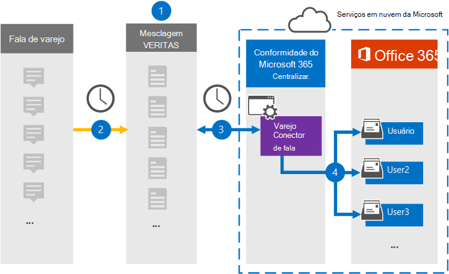

# Configurar um conector para arquivar dados de Fala redtail

Use um conector Globalnet no centro de conformidade do Microsoft 365 para importar e arquivar dados do Redtail Fale com as caixas de correio do usuário em sua organização do Microsoft 365. A Globalnet fornece um conector [Redtail Speak](https://globanet.com/redtail/) configurado para capturar itens do servidor SFTP da sua organização onde os itens são recebidos do Redtail. O conector converte o conteúdo de Redtail Speak em um formato de mensagem de email e importa esses itens para a caixa de correio do usuário no Microsoft 365.

Depois que os dados do Redtail Speak são armazenados nas caixas de correio do usuário, você pode aplicar recursos de conformidade do Microsoft 365, como Retenção de Litígio, Descoberta Eletrônico, políticas de retenção e rótulos de retenção. O uso de um conector Redtail Speak para importar e arquivar dados no Microsoft 365 pode ajudar sua organização a manter a conformidade com políticas governamentais e regulatórias.

## Visão geral do arquivamento dos dados de fala redtail

A visão geral a seguir explica o processo de uso de um conector para arquivar os dados do Redtail Speak no Microsoft 365.

1. Sua organização trabalha com o Redtail Speak para configurar um gateway SMTP no qual as mensagens são encaminhadas do Redtail Speak para o servidor SFTP da sua organização diariamente.

2. Uma vez a cada 24 horas, os itens Redtail Speak são copiados para o site Globalnet Merge1. O conector também converte os itens Redtail Speak em um formato de mensagem de email.

3. O conector Redtail Speak criado no centro de conformidade do Microsoft 365 conecta-se ao site Globalnet Merge1 todos os dias e transfere as mensagens para um local de armazenamento seguro do Azure na nuvem da Microsoft.

4. O conector importa os itens de Redtail Speak convertidos para as caixas de correio de usuários específicos usando o valor da propriedade *Email* do mapeamento automático de usuário, conforme descrito na [Etapa 3.](#step-3-map-users-and-complete-the-connector-setup) Uma subpasta na pasta Caixa de Entrada chamada **Redtail Speak** é criada nas caixas de correio do usuário e os itens são importados para essa pasta. O conector determina para qual caixa de correio os itens serão importados usando o valor da *propriedade Email.* Cada item Redtail Speak contém essa propriedade, que é preenchida com o endereço de email de cada participante do item.

## Antes de começar

- Crie uma conta Globalnet Merge1 para conectores da Microsoft. Para criar uma conta, entre em contato com o Suporte [ao Cliente Globalnet.](https://globanet.com/contact-us/) Você precisa entrar nessa conta ao criar o conector na Etapa 1.

- Na Etapa 2, você precisa especificar o servidor SFTP da sua organização. Esta etapa é necessária para que Globalnet Merge1 possa entrar em contato com ela para coletar dados redtail Speak via SFTP.

- O usuário que cria o conector Redtail Speak Importer na Etapa 1 (e o conclui na Etapa 3) deve ser atribuído à função Importar Exportar Caixa de Correio no Exchange Online. Essa função é necessária para adicionar conectores na página Conectores de dados no centro de conformidade do Microsoft 365. Essa função não é atribuída a nenhum grupo de funções no Exchange Online por padrão. Você pode adicionar a função Importar Exportar Caixa de Correio ao grupo de função Gerenciamento da Organização no Exchange Online. Ou você pode criar um grupo de funções, atribuir a função Importar Exportar Caixa de Correio e adicionar os usuários apropriados como membros. Para obter mais informações, consulte  as [seções](https://docs.microsoft.com/Exchange/permissions-exo/role-groups#create-role-groups) Criar grupos de função ou Modificar grupos de função no artigo "Gerenciar grupos de função no Exchange Online".

## Etapa 1: Configurar o conector Redtail Speak

A primeira etapa é  acessar a página Conectores de Dados no centro de conformidade do Microsoft 365 e criar um conector para os dados de Redtail Speak.

1. Vá para [https://compliance.microsoft.com](https://compliance.microsoft.com/) e selecione **Conectores de dados** &gt; **Redtail Speak**.

2. Na página **Redtail Speak** product description, selecione **Add new connector**.

3. Na página **Termos de serviço,** selecione **Aceitar**.

4. Insira um nome exclusivo que identifique o conector e selecione **Next.**

5. Entre em sua conta Merge1 para configurar o conector.

## Etapa 2: Configurar o conector Redtail Speak no site Globalnet Merge1

A segunda etapa é configurar o conector Redtail Speak no site Merge1. Para obter informações sobre como configurar o conector Redtail Speak, consulte [Merge1 Third-Party Connectors User Guide](https://docs.ms.merge1.globanetportal.com/Merge1%20Third-Party%20Connectors%20Redtail%20Speak%20User%20Guide%20.pdf).

Depois de selecionar Salvar &  **Concluir,** a página de mapeamento do usuário no assistente de conector no centro de conformidade do Microsoft 365 será exibida.

## Etapa 3: Mapear usuários e concluir a configuração do conector

Para mapear usuários e concluir a configuração do conector, siga estas etapas:

1. Na página **Mapear Redtail Falar com usuários do Microsoft 365,** habilita o mapeamento automático de usuários. Os itens Redtail Speak incluem uma propriedade chamada *Email*, que contém endereços de email para usuários em sua organização. Se o conector puder associar esse endereço a um usuário do Microsoft 365, os itens serão importados para a caixa de correio desse usuário.

2. Selecione **Avançar,** revise suas configurações  e vá para a página Conectores de dados para ver o progresso do processo de importação do novo conector.

## Etapa 4: Monitorar o conector Redtail Speak

Depois de criar o conector Redtail Speak, você pode exibir o status do conector no centro de conformidade do Microsoft 365.

1. Vá para [https://compliance.microsoft.com](https://compliance.microsoft.com/) e selecione **Conectores de dados** no painel de inv à esquerda.

2. Selecione a **guia Conectores** e selecione o **conector Redtail Speak** para exibir a página do flyout. Esta página exibe propriedades e informações sobre o conector.

3. Em **Status do Conector com origem,** selecione o link do log de **Download** para abrir (ou salvar) o log de status do conector. Esse log contém dados que foram importados para a nuvem da Microsoft.

## Problemas conhecidos

- No momento, não há suporte para a importação de anexos ou itens maiores do que 10 MB. O suporte para itens maiores estará disponível posteriormente.
